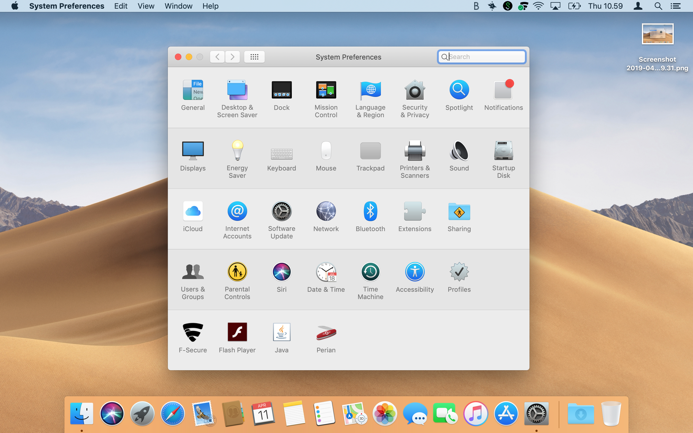
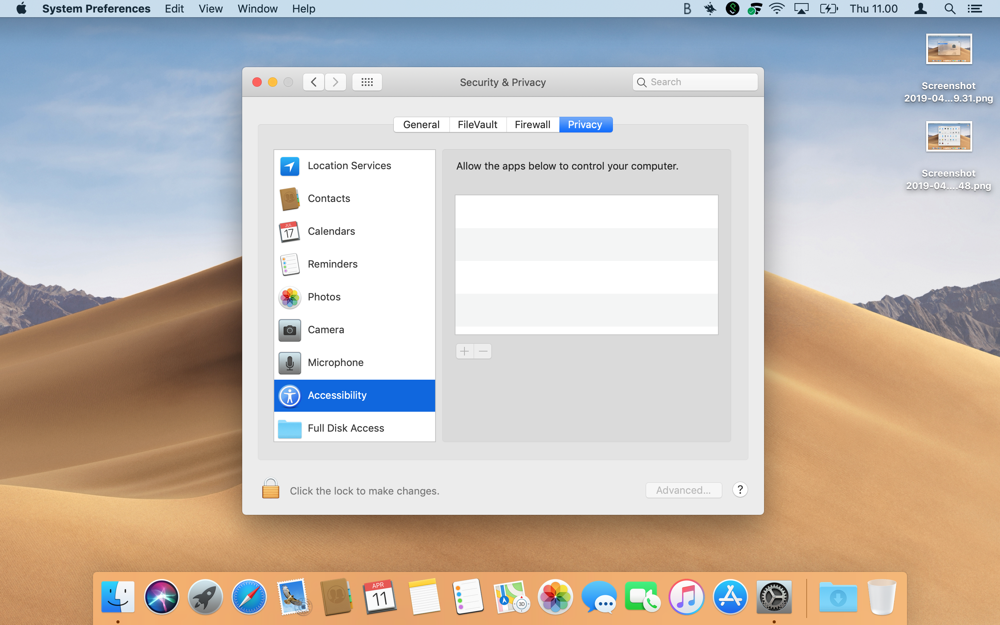
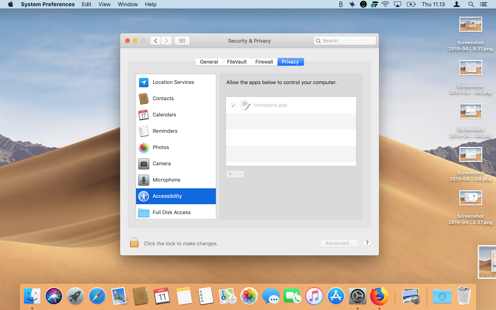

<!-- ## Käyttöliittymätestit -->
## User interface tests

<!-- Osa käyttöliittymätesteistä odottaa, että NetBeans/tmcbeans saa siirtää hiiren kursoria näytöllä, esimerkiksi testatakseen tehtävässä tehdyn käyttöliittymän nappuloita. macOS ei oletuksena salli turvasyistä ohjelmia siirtämään hiirtä, joten tmcbeans:lle pitää käydä lisäämässä oikeus tätä varten. -->
Some of the user interface tests expect that Netbeans/tmcbeans is allowed to move the mouse cursor on the screen. For example to test the buttons in the UI that are created in the exercise. MacOS does not allow this because of the security concerns. This is why tmcbeans has to be given the permission manually.

<!-- Oikeuden voi lisätä seuraavasti: -->
The permission can be added as follows:

<!-- 1. Avaa ensin System Preferences. Voit avata sen esimerkiksi hakemalla Spotlight:sta (suurennuslasikuvake oikeassa yläkulmassa) system preferences, ja avaamalla sieltä System Preferences.app. -->
1. Open the `System Preferences`. You can open it from example by searching from Spotlight (magnifying glass on the upper right corner) by keyword _System Preferences_ and by opening the `System Preferences.app`.

<!-- 2. Paina avautuvassa näkymässä yläriviltä löytyvää Security & Privacy.
 -->
2. Press the `Security & Privacy` from the opened menu.

<!-- 3. Navigoi näkymässä Privacy-välilehdelle ja siellä Accessibility -osioon.
 -->
3. From there navigate to `Privacy` tab and from there to `Accessability section`.

<!-- 4. Paina vasemmasta alakulmasta "Click the lock to make changes." Username-kentässä pitäisi lukea automaattisesti tietokoneesi käyttäjätunnus. Syötä se, jos se puuttuu. Syötä salasanasi Password-kenttään ja paina Unlock.
 -->
4. Press from the lower left corner "Click the lock to make changes.". In the username field there should be the name of your computer. Write if it's not there. Give your password in the password field and click Unlock.

<!-- 7. Paina nyt plus-kuvaketta. Navigoi avautuvassa näkymässä siihen kansioon, mihin tmcbeans on asennettuna koneellasi. Valitse tmcbeans.app ja paina Open. -->
7. Click the plus-icon. Navigate to the folder where your tmcbeans is installed. Select tmcbeans.app and click Open.

<!-- 9. Paina vasemmasta alakulmasta "Click the lock to prevent further changes." -->
9. In the lower left corner, click "Click the lock to prevent further changes."

<!-- Nyt tmcbeans pitäisi pystyä siirtämään hiirtä testien ajossa. Huomaathan, että et saa samanaikaisesti siirtää itse hiirtä tai availla ikkunoita, kun testit pyörivät. Testien pitää saada rauhassa navigoida yksin näytöllä, jotta ne testaavat oikein ohjelmasi toimintaa. -->
Now your tmcbeans should be able to move your mouse cursor during the execution of tests. Note that you may not be allowed to move your cursor or open windows during the tests. Tests should be allowed to run without interference in order for them to work correctly.
