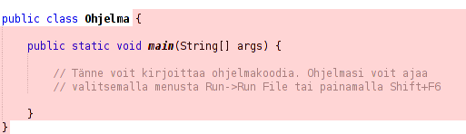
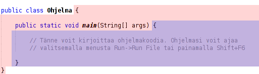
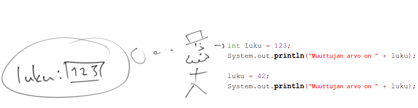
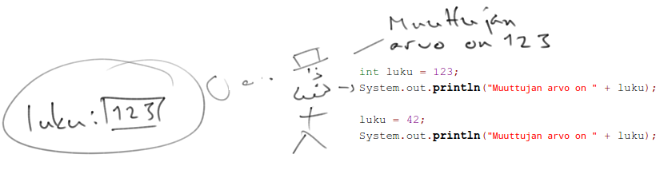
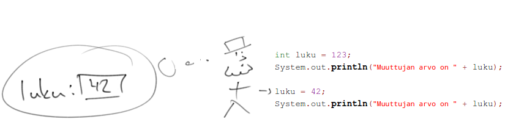
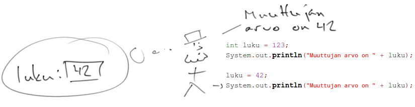

# Johdanto

<text-box variant='learningObjectives' name='Oppimistavoitteet'>

- Tiedät muutamia esimerkkejä siitä, miten ohjelmistot vaikuttavat yhteiskuntamme toimintaan.
- Tunnet käsitteet ohjelma, ohjelmointikieli ja lähdekoodi, ja tiedät, että lähdekoodi koostuu lauseista ja lausekkeista.
- Tiedät pääpiirteittäin ohjelmien suorittamiseen liittyvät askeleet.

</text-box>

<quiznator id="5c12b7f263de8e5db0cf8b8e"></quiznator>

Ohjelmoinnin opiskelua harkitseva tietää harvoin kuinka riippuvainen yhteiskuntamme on ohjelmoijien tuottamista ohjelmistoista. Ilman ohjelmistoja yhteydenpito, kaupankäynti, matkustaminen ja niin edelleen olisi monimutkaisempaa. Puhelimet eivät toimisi tai niitä olisi vain muutamia, verkkopankkeja saatikka pankki- tai luottokortteja ei olisi, matkojen varaaminen ja henkilöasiakirjojen käyttäminen ei onnistuisi verkon yli, ja terveydenhuoltopalveluissa sähköisistä palveluista kuten e-reseptistä tai potilastietojen nopeasta siirtämisestä osastojen ja sairaaloiden välillä voisi vain unelmoida. Wikipediaa tai hakukoneita ei myöskään olisi ja tiedon hakeminen tapahtuisi sana- ja tietokirjoista.

Digitalisaatio -- eli digitaalisen tietotekniikan yleistyminen arkielämässä -- muuttaa ihmisten arkea. Fyysiset tuotteet muuttuvat sähköisiksi, jolloin esimerkiksi uutisten jakaminen on nopeampaa ja edullisempaa. Digitaaliset palvelut eivät ole paikkasidonnaisia, jolloin niitä voidaan viedä kansainvälisille markkinoille ja toisaalta digitaalista työtä tekevien työntekijöiden ei tarvitse aina olla fyysisesti samassa paikassa. Perinteistä tuotantoa voidaan myös tehostaa, sillä erilaiset digitaaliset seurantamekanismit kuten varastonhallinta ja niistä kertyvän tiedon analyysi mahdollistavat tuotannon kohdentamisen tarveperustaisesti.

Tämä on johtanut tilanteeseen, missä työnkuvia katoaa ja työnkuvia syntyy. Samalla tieto siitä, mitä digitalisoituvien tehtävien suorittaminen vaatii katoaa järjestelmien syövereihin. Joitakin vuosikymmeniä sitten puhelujen yhdistämiseen tarvittiin ihmistä, kun nykyään puhelujen yhdistämisen hoitavat ohjelmistot. Joitakin vuosikymmeniä sitten toisaalta mobiilisovellusten kehittäjiä, data-analyytikkoja tai vaikkapa bloggaajia ei ollut lainkaan. Palveluiden muuttuminen sähköiseksi myös piilottaa niihin liittyvää monimutkaisuutta. Kun olet esimerkiksi lähdössä lentomatkalle ja teet lähtöselvitystä verkossa olevalla lomakkeella, lomakkeen lähettäminen aiheuttaa kymmenten järjestelmien välisen vuoropuhelun. Nimeesi ja henkilötietoihisi liittyvät merkinnät käydään läpi, passisi tilanne ja mahdollisten viisumien voimassaolo tarkistetaan, lentosi tilanne tarkastetaan, aiemmat lentosi käydään läpi, paikkavarauksesi menee paikkavarauksia hallinnoivaan järjestelmään, lentoyhtiöihin liittyvät kanta-asiakkuutesi käydään läpi, lentokoneeseen tankattavan polttoaineen määrää päivitetään ja niin edelleen.

Vaikka digitalisaatio voi tehostaa toimintaa muunmuassa vapauttamalla työntekijän helposti automatisoitavista tehtävistä, on digitalisaatiossa myös haasteita. Sähköisten järjestelmien käytön oppiminen ei ole aina helppoa ja työnkuvien muutoksen vaatima jatkuva uudelleenkouluttautuminen on uudenlainen koulutukseen liittyvä haaste. Innokkuus sähköisten palveluiden käyttöönotossa vähentää myös perinteisiä palveluita -- kukapa ei esimerkiksi olisi kuullut pankkipalveluiden digitalisoitumisen ja kassapalveluiden vähentymisen sivuvaikutuksena tuomista pitkistä pankkijonoista. Sähköiset palvelut ovat ihmisten tekemiä ja harvoin virheettömiä. Harva ei ole kuullut huonosti toimivista ohjelmistoista.

<quiznator id="5c1368623cc3ec11bcd773fa"></quiznator>


Tietojenkäsittelytieteilijät ja laajemmin ohjelmistotekniikan ammattilaiset ovat digitaalisten palveluiden arkkitehtejä. Vastuullamme on näiden järjestelmien toteutus siten, että ne toimivat mahdollisimman hyvin järjestelmien kohdeyleisölle -- myös niille, jotka eivät ole tottuneet käyttämään vastaavia järjestelmiä. Järjestelmien loppukäyttäjät harvoin tietävät kuka tai ketkä ovat toteuttaneet kyseiset järjestelmät -- harva on kuullut esimerkiksi [Margaret Hamilton](<https://en.wikipedia.org/wiki/Margaret_Hamilton_(scientist)>)ista, joka yhdessä ryhmänsä kanssa kirjoitti ihmisiä kuuhun vieneen ohjelman.


Ohjelmointia voidaan ajatella nykyajan käsityöläistaitona, ja ohjelmistoalan työläisiä on maailmassa kymmeniä miljoonia. Tälle modernille käsityöläistaidolle on myös kysyntää -- esimerkiksi Tivi uutisoi vuonna 2016 aiheesta otsikolla "[It-osaaja pääsee töihin vaikka heti](http://www.tivi.fi/Kaikki_uutiset/it-osaaja-paasee-toihin-vaikka-heti-6555159)". Ohjelmistojen ja digitaalisten järjestelmien ymmärryksen tarve näkyy myös nykyään kaikkialla -- ohjelmoinnin alkeita opetetaan jo peruskoulussa, ja samalla esimerkiksi moderni tiede hyödyntää enemmän ja enemmän tiedon analysoinnissa käytettäviä ohjelmistoja sekä ohjelmistoalan innovaatioita. Esimerkiksi meteorologit, fyysikot ja kemistit käyttävät ohjelmistoja ja ohjelmoivat työssään. Myös kasvatustiede ja opetusala hyödyntää digitalisaation tuomia mahdollisuuksia yhä enemmän. Nykyään on oikeastaan vaikeampaa keksiä ammatteja, joihin ohjelmistot ja digitalisaatio ei vaikuta, kuin ammatteja, joihin ohjelmistot ja digitalisaatio vaikuttaa.

Tällä kurssilla otat ensiaskeleet ohjelmointiin. Opit kirjoittamaan ohjelmia ja ymmärtämään niiden toimintaa. Tulet jäsentämään ohjelmissa olevia osakokonaisuuksia pieniksi paloiksi ja esittämään ohjelmissa esiintyviä käsitteitä yhteistoiminnassa toimivina palasina. Käsitteet kuten _muuttuja_, _ehtolause_, _toistolause_, _luokka_ ja _olio_ ovat kurssin lopuksi hyvin tuttuja, ja tiedät myös hieman algoritmiikasta sekä ohjelmistojen testaamisesta. Kurssin jälkeen saatat myös ajatella yhteiskunnan palveluita ohjelmoijan näkökulmasta ja pohdit niiden toimintaa (tai toimimattomuutta) ohjelmistojen tarjoamien mahdollisuuksien ja rajoitteiden näkökulmasta.

Kurssin jälkeen yksinkertainenkin ohjeistus kuten  "_Osta kaksi maitoa. Mikäli kaupassa on appelsiineja, osta neljä._" saa uusia sävyjä. Vaikka ihmiselle viesti on selvä, tietokone saattaisi päätyä ostamaan neljä maitoa.

Kurssi on tarkoitettu ohjelmoinnin alkeiskurssiksi kohdeyleisöä sen laajemmin rajoittamatta. Kurssi on samalla yksi ensiaskelista tietojenkäsittelytieteen opintoihin. Kurssin jälkeen ja kurssin aikaan kannattaa harkita muunmuassa kursseja Tietokantojen perusteet, Ohjelmistotekniikan menetelmät, Tietorakenteet ja algoritmit, sekä Johdatus yliopistomatematiikkaan.


## Ohjelmoija kirjoittaa lähdekoodia

Ohjelmointi on ohjelmistojen suunnittelua ja toteutusta. Toteutettava toiminnallisuus määräytyy ohjelmiston tilaajien ja käyttäjien toiveiden ja vaatimusten perusteella. Ohjelmia toteutetaan (eli kirjoitetaan tai "koodataan") tyypillisesti ihmisten kirjoitettavaksi ja luettavaksi tarkoitetulla ohjelmointikielellä. Ohjelmointikieliä on satoja ja tällä kurssilla keskitytään näistä kielistä yhteen. Kurssin kielenä on [Java](<https://en.wikipedia.org/wiki/Java_(programming_language)>), joka on yksi maailman eniten käytetyistä ohjelmointikielistä. Javaa tuntevan on myös helppo oppia uusia ohjelmointikieliä.

Ohjelmointikielet kuten Java tarjoavat suuren määrän valmiita komentoja, joita ohjelmoija käyttää ohjelmistoja luodessa. Tämä helpottaa ohjelmointia, sillä aivan kaikkea ei tarvitse toteuttaa alusta lähtien. Esimerkiksi graafisia käyttöliittymiä toteutettaessa ohjelmointikielillä on tyypillisesti valmiita toiminnallisuuksia erilaisten valikoiden ja näkymien luomiseen. Iso osa ohjelmoinnista onkin ohjelmointikielen valmiiksi tarjoamien komentojen soveltamista ongelmien ratkaisuissa.

Kirjoitettua "koodia" kutsutaan **lähdekoodiksi**. Lähdekoodi koostuu lauseista (statement) ja lausekkeista (expression), joita yleensä voidaan lukea rivi riviltä ylhäältä alaspäin ja vasemmalta oikealle. Esimerkiksi tekstin "Hei maailma" tulostuksessa käytetään Java-ohjelmointikielellä valmista komentoa `System.out.println()`, jolle kerrotaan sulkujen sisälle tulostettava teksti.

```java
System.out.println("Hei maailma");
```

Lause `System.out.println` on Java-ohjelmointikielen valmiiksi tarjoama komento, jota käytetään merkkijonon tulostamiseen. Komento käytännössä käskee tietokonetta tulostamaan sille sulkeiden sisällä lainausmerkeissä (joita ohjelmoijat kutsuvat usein 'hipsuiksi') annetun merkkijonon. Komennon pääte `ln` on lyhenne sanasta _line_, eli komentoa käyttämällä merkkijonon jälkeen tulostetaan myös rivinvaihto. Lauseen loppuun kirjoitetaan puolipiste `;`.

Java-ohjelmat vaativat toimiakseen kurssin aikana tutuksi tulevan rungon. Ohjelman runko on seuraavanlainen.

```java
public class Esimerkki {
    public static void main(String[] args) {
        // Tänne kirjoitetaan ohjelman käyttämät lauseet
        System.out.println("Tulostettava teksti");
    }
}
```

Yhdenkin merkin puuttuminen voi johtaa ohjelmoidessa virhetilanteeseen. Ohjelmoija saattaa vahingossa esimerkiksi syöttää pilkun pisteen sijaan, kirjoittaa vaikkapa `printin` sanan `println` sijaan, jättää tulostettavasta merkkijonosta hipsut pois, tai unohtaa komentoa seuraavan puolipisteen. Jokainen edelläolevista esimerkeistä johtaa virhetilanteeseen, missä ohjelman suoritus ei onnistu.


<quiznator id="5c136a4ea50dbe1223d1981d"></quiznator>


## Tietokone suorittaa ohjelman

Kun ohjelmoija haluaa kokeilla toimiiko hänen kirjoittamansa lähdekoodi, hän suorittaa ohjelman. Ohjelman suorittamiseen tarvittavat askeleet riippuvat käytetystä ohjelmointikielestä, mutta pääpiirteisesti askeleita on kaksi. Ensin lähdekoodi käännetään konekieliseen muotoon, jonka jälkeen ohjelma suoritetaan.

Lähdekoodin kääntäminen konekieliseen muotoon tapahtuu ohjelmointikielikohtaisella kääntäjällä, joka on myös ohjelma. Tämän jälkeen konekielinen ohjelma käynnistetään, eli siinä olevat käskyt suoritetaan yksi kerrallaan tietokoneen sisällä olevalla konekielisten käskyjen suorittamiseen erikoistuneella yksiköllä eli prosessorilla.

Ohjelman suorittamiseen liittyvät askeleet ovat ohjelmointikielikohtaisia. Edellä kuvattu lähdekoodin kääntäminen konekieliseen muotoon tapahtuu esimerkiksi C-ohjelmointikielessä, kun taas Java-ohjelmointikielessä ohjelma käännetään Java-ohjelmointikielen tavukoodiksi, jonka Java-kielen tulkki sitten suorittaa. Jotkut ohjelmointikielet kuten PHP ja Python ovat toisaalta sellaisia, että niitä ei käännetä lainkaan, vaan vaan ohjelmointikielen tulkki suorittaa komennot yksi kerrallaan.

Nämä askeleet vaikuttavat siihen, miten ja milloin ohjelmien virheet ilmenevät. Mikäli ohjelma käännetään ennen suoritusta, kääntämiseen käytettävä ohjelma voi etsiä tyypillisiä virheitä. Mikäli ohjelma tulkataan ilman käännöstä, virheet nousevat esiin vasta suorituksen aikana tai suorituksen epäonnistuessa. Tämä vaikuttaa myös ohjelmoinnissa käytetyn ohjelmointiympäristön tarjoamiin vinkkeihin -- jotkut ohjelmointiympäristöt kääntävät kirjoitettavaa ohjelmaa jatkuvasti konekielelle, jolloin ohjelmoija saa palautetta ohjelmassa olevista virheistä heti. Toisissa ohjelmointikielissä tätä mahdollisuutta taas ei ole, jolloin ohjelmointiympäristöjen tarjoamat vinkit ovat vähäisemmät.

Mitä tahansa ohjelmia voidaan kirjoittaa tekstieditorissa, joka ei muotoile tekstiä. Tällaisia tekstieditoreita ovat esimerkiksi [Notepad](https://en.wikipedia.org/wiki/Microsoft_Notepad). Ohjelmia kirjoitetaan kuitenkin tyypillisemmin ohjelmointiympäristöissä, jotka ovat ohjelmien kirjoittamisen tukemiseen erikoistuneita ohjelmia. Nämä mahdollistavat muunmuassa käännösvirheiden automaatisen näyttämisen käyttäjälle sekä ohjelman suorittamisen ohjelmointiympäristön sisällä. Tällä kurssilla käytetään ohjelmointiympäristöä nimeltä [NetBeans](https://en.wikipedia.org/wiki/NetBeans), jota varten on kehitetty tehtävien lataamiseen, testaamiseen ja lähettämiseen käytettävä liitännäinen.

Seuraavassa osassa aloitamme ohjelmoinnin ohjelmointiympäristössä.


# Tulostaminen ja lukeminen

<text-box variant='learningObjectives' name='Oppimistavoitteet'>

- Osaat kirjoittaa ohjelman, joka tulostaa tekstiä.
- Tutustut pinnallisesti käsitteeseen muuttuja
- Osaat luoda merkkijonomuuttujan (String) ja käyttää merkkijonomuuttujaa osana tekstiä tulostavaa ohjelmaa.
- Osaat luoda uuden merkkijonomuuttujan useampia merkkijonoja yhdistelemällä.
- Osaat kirjoittaa ohjelman, joka pyytää käyttäjältä tekstimuotoista syötettä.

</text-box>

## Ohjelmarunko

Java-ohjelmat vaativat toimiakseen ohjelmarungon. Ohjelmarunko on seuraavanlainen.

```java
public class Esimerkki {
    public static void main(String[] args) {
        // Tänne kirjoitetaan ohjelman käyttämät lauseet
        System.out.println("Tulostettava teksti");
    }
}
```

Ohjelmarunkomme sisältää Java-ohjelmointikielelle oleellisia osia. Ohjelman suoritus alkaa riviä `public static void main(String[] args) {` seuraavalta riviltä ja päättyy sulkevaan aaltosulkuun `}`. Lauseet suoritetaan yksi kerrallaan. Tällä hetkellä ainoa suoritettava lause on `System.out.println("Tulostettava teksti");`, mikä tulostaa tekstin "Tulostettava teksti".

Tulemme myöhemmin tutustumaan tarkemmin sanojen `public class` ja `public static void` merkitykseen.

Materiaalin esimerkeissä ei käytetä aina ohjelmarunkoa, mutta voit olettaa, että se tarvitaan aina. Esimerkit voivat siis olla esimerkiksi yhden rivin mittaisia kuten alla oleva tulostusesimerkki.

```java
System.out.println("Hei maailma!");
```

Todellisuudessa yllä oleva esimerkki näyttää Java-kielisellä ohjelmalla kuitenkin seuraavalta.

```java
public class Esimerkki {
    public static void main(String[] args) {
        // Tänne kirjoitetaan ohjelman käyttämät lauseet
        System.out.println("Hei maailma!");
    }
}
```

## Tulostuskomento

Ensimmäinen komento, jonka opimme on tulostuskomento. Komento `System.out.println("Hei maailma");` tulostaa tekstin "Hei maailma". Tulostettavaa tekstiä voi vaihtaa mielivaltaisesti, kunhan komento `System.out.println("mielivaltainen teksti");` -- eli `System` piste `out` piste `println` sulut auki `(` "teksti" sulut kiinni `)` ja puolipiste `;` pysyy muuttumattomana.

Kuten johdannossa todettiin, _Lause System.out.println on Java-ohjelmointikielen valmiiksi tarjoama komento, jota käytetään merkkijonon tulostamiseen. Komento käytännössä käskee tietokonetta tulostamaan sille sulkeiden sisällä hipsuissa annetun merkkijonon. Komennon pääte ln on lyhenne sanasta line, eli komentoa käyttämällä merkkijonon jälkeen tulostetaan myös rivinvaihto. Lauseen loppuun kirjoitetaan puolipiste ;._

```java
public class Ohjelma {
    public static void main(String[] args) {
        System.out.println("Hei maailma!");
    }
}
```

Alla oleva tekstialue on materiaalissa käytettävä esimerkki ohjelman tuottamaan tulostukseen. Yllä oleva ohjelma tuottaisi siis tulostuksen "Hei maailma!". Voit kokeilla kaikkia materiaalin esimerkkejä ohjelmointiympäristössä olevassa "Hiekkalaatikko"-nimisessä tehtäväpohjassa.

<sample-output>

Hei maailma!

</sample-output>

<text-box variant='hint' name='Ohjelmoinnin aloittaminen'>

Ohjelmoinnin aloittamiseen tarvitset seuraavat asiat.

1.  Käyttäjätunnuksen kurssilla käytettyyn TMC-järjestelmään.
2.  Javan (Java JDK).
3.  NetBeans with TMC-ohjelmointiympäristön.

<only-for-course-variant variant="dl">
  Ohjeistus oleellisten työvälineiden asentamiseen sekä kurssilla tarvittavan käyttäjätunnuksen luomiseen löytyy osoitteesta [https://materiaalit.github.io/tmc-asennus/netbeans/](https://materiaalit.github.io/tmc-asennus/netbeans/). Valitse organisaatioksi "MOOC" ja kurssiksi "Ohjelmoinnin MOOC 2019".
</only-for-course-variant>

<only-for-course-variant variant="nodl">
  Ohjeistus oleellisten työvälineiden asentamiseen sekä kurssilla tarvittavan käyttäjätunnuksen luomiseen löytyy osoitteesta [https://materiaalit.github.io/tmc-asennus/netbeans/](https://materiaalit.github.io/tmc-asennus/netbeans/). Valitse organisaatioksi "MOOC" ja kurssiksi "Ohjelmoinnin MOOC 2019 (aikatauluton)".
</only-for-course-variant>

<only-for-course-variant variant="ohja-dl">
  Ohjeistus oleellisten työvälineiden asentamiseen sekä kurssilla tarvittavan käyttäjätunnuksen luomiseen löytyy osoitteesta [https://materiaalit.github.io/tmc-asennus/netbeans/](https://materiaalit.github.io/tmc-asennus/netbeans/). Valitse organisaatioksi "MOOC" ja kurssiksi "Ohjelmoinnin MOOC 2019 -- Aloitan osasta 8".
</only-for-course-variant>

<only-for-course-variant variant="ohja-nodl">
  Ohjeistus oleellisten työvälineiden asentamiseen sekä kurssilla tarvittavan käyttäjätunnuksen luomiseen löytyy osoitteesta [https://materiaalit.github.io/tmc-asennus/netbeans/](https://materiaalit.github.io/tmc-asennus/netbeans/). Valitse organisaatioksi "MOOC" ja kurssiksi "Ohjelmoinnin MOOC 2019 -- Aloitan osasta 8 (aikatauluton)".
</only-for-course-variant>

<only-for-course-variant variant="kesa-dl">
  Ohjeistus oleellisten työvälineiden asentamiseen sekä kurssilla tarvittavan käyttäjätunnuksen luomiseen löytyy osoitteesta [https://materiaalit.github.io/tmc-asennus/netbeans/](https://materiaalit.github.io/tmc-asennus/netbeans/). Valitse organisaatioksi "MOOC" ja kurssiksi "Ohjelmoinnin MOOC 2019, Kesä".
</only-for-course-variant>

<only-for-course-variant variant="kesa-ohja-dl">
  Ohjeistus oleellisten työvälineiden asentamiseen sekä kurssilla tarvittavan käyttäjätunnuksen luomiseen löytyy osoitteesta [https://materiaalit.github.io/tmc-asennus/netbeans/](https://materiaalit.github.io/tmc-asennus/netbeans/). Valitse organisaatioksi "MOOC" ja kurssiksi "Ohjelmoinnin MOOC 2019 -- Aloitan osasta 8, Kesä".
</only-for-course-variant>

<only-for-not-logged-in>
  Kirjaudu sisään nähdäksesi, mikä organisaatio ja kurssi sinun tulee valita TMC:stä
</only-for-not-logged-in>

[Ohjeisiin!](https://materiaalit.github.io/tmc-asennus/netbeans/)

</text-box>

Alla on kurssin ensimmäiset ohjelmointitehtävät. Ensimmäinen tehtävä -- "Hiekkalaatikko" -- on oikeastaan ympäristö, missä voit tehdä omia kokeilujasi. Toisessa tehtävässä -- "Ada Lovelace" teet jo määrättyjä asioita.

Ohjelmointitehtävien tehtävänannot löytyvät kurssimateriaalista (eli materiaalista mitä juuri luet). Tehtävänannon saa auki klikkaamalla tehtävänannon otsikkoa (alla "Ada Lovelace"). Tehtäväpohjat löytyvät TMC:stä (asennusohjeet yllä kohdassa "Ohjelmoinnin aloittaminen").

Voit katsoa ohjeet aloittamiseen myös seuraavalta videolta.

<youtube id="zvE8XA8D0gE"></youtube>

<programming-exercise name='Hiekkalaatikko' tmcname='osa01-Osa01_01.Hiekkalaatikko'>

Tehtäväpohjassa on seuraavanlainen ohjelmarunko:

```java
public class Hiekkalaatikko {
    public static void main(String[] args) {
        // Kirjoita ohjelmasi tähän alle

    }
}
```

Voit tehdä tehtäväpohjaan omia kokeilujasi. Pisteet tehtävästä saa kun palauttaa toimivan ohjelman -- ohjelma voi olla käytännössä minkälainen tahansa, jopa tyhjä ohjelma kelpaa.

</programming-exercise>

<programming-exercise name='Ada Lovelace' tmcname='osa01-Osa01_02.AdaLovelace'>

Tehtäväpohjassa on seuraavanlainen ohjelmarunko:

```java
public class Nimi {
    public static void main(String[] args) {
        // Kirjoita ohjelmasi tähän alle

    }
}
```

Rivi "// Kirjoita ohjelmasi tähän alle" on _kommenttirivi_, jota tietokone ei ota huomioon ohjelmaa suoritettaessa. Lisää kommenttirivin alle lause, joka tulostaa merkkijonon "Ada Lovelace" ja suorita ohjelma. Ohjelman tulostuksen tulee olla seuraavanlainen:

<sample-output>

Ada Lovelace

</sample-output>

Kun olet tehnyt tehtävän ja huomaat, että ohjelma tulostaa halutun merkkijonon, palauta tehtävä TMC:lle. Tutustu tämän jälkeen halutessasi lisää [Ada Lovelaceen](https://en.wikipedia.org/wiki/Ada_Lovelace), joka oli yksi ensimmäisistä ohjelmoijista.

</programming-exercise>

Voit katsoa esimerkin miten Ada Lovelace -tehtävä voidaan ratkaista alla olevalta videolta.

<youtube id="-DzOKI6iH5w"></youtube>

Tehtävänannoissa olevat toiveet tulostusmuodosta ovat tarkkoja. Jos tehtävänannossa toivotaan esimerkiksi että ohjelma tulostaa sulun toisen rivin ensimmäiseksi merkiksi, ei sulkua saa jättää tulostamatta.

Ohjelmia rakennetaan komento komennolta, missä jokainen komento tulee uudelle rivilleen. Alla olevassa esimerkissä komento `System.out.println` esiintyy kahdesti, joka tarkoittaa sitä että ohjelmassa suoritetaan kaksi tulostuskomentoa.

```java
public class Ohjelma {
    public static void main(String[] args) {
        System.out.println("Hei maailma!");
        System.out.println("... ja maailmankaikkeus!");
    }
}
```

Yllä olevan ohjelman tulostus on seuraava.

<sample-output>

Hei maailma!
... ja maailmankaikkeus!

</sample-output>

<text-box variant='hint' name='Lyhenne "sout"'>

Komennon `System.out.println("...")` kirjoittaminen voi olla melko työlästä. Kokeile kirjoittaa NetBeans:iin (main:in sisään) tyhjälle riville _sout_ ja paina tabulaattoria (näppäin q:n vasemmalla puolella). Mitä tapahtuu? Tämä pieni apuväline säästänee jatkossa runsaasti aikaasi.

Alla oleva animaatio kuvaa sout-komennon käyttöä. Kun käyttäjä on kirjoittanut sout, hän painaa tabulaattoria. Taikatemppu!


</text-box>

<programming-exercise name='Olipa kerran' tmcname='osa01-Osa01_03.OlipaKerran'>

Tehtäväpohjassa on seuraavanlainen ohjelmarunko:

```java
public class OlipaKerran {
    public static void main(String[] args) {
        // Toteuta ohjelmasi tänne

    }
}
```

Muokkaa ohjelmaa siten, että ohjelman suoritus tulostaa seuraavanlaisen tekstin. Käytä tekstin tulostamiseen kolmea `System.out.println` komentoa.

<sample-output>

Olipa kerran... on ranskalainen opetusanimaatiosarjojen kokoelma.
Kokoelmaan kuuluu seitsemän erillistä sarjaa,
jotka käsittelevät eri tiedonaloja.

</sample-output>

</programming-exercise>

Tarkalleen ottaen komento `System.out.println("merkkijono");` tulostaa tekstin "merkkijono" sekä rivinvaihdon. Rivinvaihdon voi halutessaan tulostaa myös erikoismerkillä `\n`, joka kirjoitetaan osaksi tulostettavaa merkkijonoa. Esimerkiksi seuraavan tulostuksen saa aikaan ainakin kahdella eri tapaa.

<sample-output>

Hei maailma!
... ja maailmankaikkeus!

</sample-output>

Toinen vaihtoehto on kahden `System.out.println`-komennon käyttäminen, yksi kummallekin riville. Toinen on yhden `System.out.println`-komennon käyttäminen siten, että tulostettava merkkijono sisältää rivinvaihtomerkin `\n`. Tämä näyttäisi ohjelmassa seuraavalta.

```java
public class Ohjelma {
    public static void main(String[] args) {
        System.out.println("Hei maailma!\n... ja maailmankaikkeus!");
    }
}
```

 <programming-exercise name='Olipa kerran maa' tmcname='osa01-Osa01_04.OlipaKerranMaa'>

Tehtäväpohjassa on seuraavanlainen ohjelmarunko:

```java
public class OlipaKerranMaa {
    public static void main(String[] args) {

    }
}
```

Muokkaa ohjelmaa siten, että ohjelman suoritus tulostaa seuraavanlaisen tekstin. Käytä tekstin tulostamiseen yhtä `System.out.println` komentoa.

<sample-output>

Olipa kerran maa valmistui vuonna 2008. Sarja käsittelee
luontoympäristön suojelemista ja varoittaa maailmanlaajuisesta
ilmastonlämpenemisestä, kasvihuoneilmiöstä, saasteista ja
niin edelleen.

</sample-output>

</programming-exercise>

Mikäli merkkijonosta muodostuu hyvin pitkä, voi sen pilkkoa useampaan osaan. Tämä tapahtuu rajaamalla jokainen merkkijonon osa hipsuilla ja yhdistämällä osat `+`-merkillä. Tällöin tulostettavan merkkijonon voi esittää useammalla rivillä, vaikka tulostuskomentoja olisi vain yksi.

```java
public class Ohjelma {
    public static void main(String[] args) {
        System.out.println("Hei maailma!\n" + "... ja maailmankaikkeus!");
    }
}
```

## Komennon osia ja terminologiaa

Olemme käyttäneet lausetta `System.out.println("tulostettava");` merkkijonon tulostamiseen. Tulostuslause tulostaa sekä hipsuissa olevan merkkijonon että rivinvaihdon. Jos merkkijonon haluaa tulostaa ilman rivinvaihtoa, käytetään komentoa `System.out.print("tulostettava");`.

Tulostamiseen on kaksi lausetta:

- `System.out.println("sana");` tulostaa tekstin "sana" ja loppurivinvaihdon
- `System.out.print("sana");` tulostaa tekstin "sana" ilman loppurivinvaihtoa

Tulostettavan tekstin osana voi olla erikoismerkkejä, joista tärkein on rivinvaihto. Rivinvaihto ilmaistaan kenoviivalla ja n-merkillä seuraavasti: `\n`. Erikoismerkkejä on [muitakin](http://en.wikipedia.org/wiki/Escape_character 'Escape character - Wikipedia, the free encyclopedia').

```java
System.out.println("Ensimmäinen\nToinen\nKolmas");
```

Yllä oleva lause tulostaa seuraavaa:

<sample-output>

Ensimmäinen
Toinen
Kolmas

</sample-output>

### Komennon parametrit

Tulostuslauseen tulostama tieto eli komennon _parametrit_ annetaan tulostuskomennolle lisäämällä ne lauseen perässä olevien sulkujen `()` sisään. Esimerkiksi `System.out.println` -komennon parametriksi annetaan merkkijono _hei_ hipsujen sisällä seuraavasti: `System.out.println("hei")`.

### Puolipiste erottaa lauseet toisistaan

Puolipisteellä `;` erotetaan lauseet toisistaan. Voisimme oikeastaan kirjoittaa koko ohjelman yhdelle riville -- mikä ei kuitenkaan ole kovin ymmärrettävää.

```java
System.out.print("Hei "); System.out.print("maailma"); System.out.print("!\n");
```

<sample-output>

Hei maailma!

</sample-output>

Vaikka yllä oleva esimerkki toimii, on rivinvaihtojen käyttö tärkeää muita ohjelmoijia ajatellen. Tällöin ohjelman lukija tietää, että kullakin rivillä tehdään vain yksi konkreettinen asia.

### Lohko

Lohkolla tarkoitetaan aaltosulkujen rajaamaa aluetta. Ohjelmissamme näitä on tyypillisesti useita. Ohjelman sisältävä lähdekooditiedosto sisältää merkkijonon `public class _Ohjelma_`, jota seuraa lohkon avaava aaltosulku. Lohko päättyy sulkevaan aaltosulkuun. _Ohjelma_ sisällä voi olla useita lohkoja.

Esimerkiksi ohjelman käynnistämiskohdan määrittelevä merkkijono `public static void main(String[] args)` määrittelee oman lohkon, jonka sisällä oleva lähdekoodi suoritetaan kun ohjelma käynnistetään.

Alla olevassa kuvassa on näytettynä Ohjelma-nimisen luokan rajaama lohko. Lohko alkaa merkkijonon `public class Ohjelma` jälkeen alkavasta aaltosulusta ja päättyy viimeiseen aaltosulkuun.



Yllä olevan esimerkin lohko sisältää toisen lohkon. Tämä lohko alkaa merkkijonosta `public static void main(String[] args)` ja sisältää ohjelman käynnistymisessä suoritettavan lähdekoodin.



Laajemmin lohkojen merkitystä voi ajatella suoritettavan ohjelman rakenteen kuvaajina. Merkkijonosta `public class _Ohjelma_` alkava lohko sisältää koko ohjelman rakenteen, kun taas merkkijonosta `public static void main(String[] args)` alkava lohko sisältää ohjelman käynnistyksen jälkeen suoritettavan lähdekoodin.

Lohko rajataan aina aaltosuluilla, ja aaltosuluille tulee löytyä aina pari. Tietokone ei esimerkiksi ymmärtäisi seuraavanlaista ohjelmaa, sillä siitä puuttuu yksi aaltosulku.

```java
public class Ohjelma {
    public static void main(String[] args) {
        // Tänne voit kirjoittaa ohjelmakoodia. Ohjelmasi voit ajaa
        // valitsemalla menusta Run->Run File tai painamalla Shift+F6

}
```

### Kommentit

Lähdekoodia voi kommentoida selkeyttääkseen sitä tai lisätäkseen muistiinpanoja kahdella eri tavalla.

- Yhden rivin kommentit aloitetaan kahdella vinoviivalla, `//`. Kaikki kahta vinoviivaa seuraava samalla rivillä oleva teksti tulkitaan kommentiksi.
- Useamman rivin kommentit aloitetaan yhdellä vinoviivalla ja tähdellä `/*` ja lopetetaan tähdellä ja vinoviivalla `*/`. Kaikki useamman rivin kommentin aloittavan ja lopettavan alueen välillä tulkitaan kommentiksi.

Alla on esimerkki ohjelmasta, jossa kumpikin kommenttityyppi on käytössä.

```java
public class Kommentteja {
    public static void main(String[] args) {
        // Tulostetaan
        System.out.println("Tulostettava teksti");
        System.out.println("Lisää tulostettavaa!");
        /* Seuraavaksi: - lisää tulostamisesta - lisää harjoittelua - muuttujat - ... */ System.out.println("Muuta tulostettavaa");
    }
}
```

Esimerkin alin rivi esittelee erityisen kätevän käyttökohteen kommenteille. Kirjoitettua lähdekoodia ei tarvitse poistaa jos haluaa tilapäisesti kokeilla jotain.

### Ohjelmointityylistä

Vaikka tietokone ja käyttämämme ohjelmointikieli ei aseta rajoituksia kirjoitettavan ohjelmakoodin ulkoasulle, olemme huomanneet että ohjelmoijan -- tai opiskelevan ohjelmoijan -- kirjoittaman koodin ulkoasulla on merkitystä myös oppimisen kannalta. Luettavuus ja sisennyksen säännönmukaisuus ovat asioita, jotka vaikuttavat lähdekoodin ymmärrettävyyteen, ja sitä kautta myös oppimistuloksiin. Seuraava koodi on säännönmukaisesti sisennettyä.

```java
public class Esimerkki {
    public static void main(String[] args) {
        System.out.println("Heippa vaan! Tämä koodi on siististi sisennetty.");
        System.out.println("public class -- ei sisennystä.");
        System.out.println("public static -- neljän merkin sisennys.");
        System.out.println("public static ... sisällä -- kahdeksan merkin sisennys -- tai enemmän.");
    }
}
```

Tämä koodi taas ei ole kovin ymmärrettävää.

```java
         public class Esimerkki {
public static void main(String[] args) {
      System.out.println("Heippa vaan! Tämä koodi on siististi sisennetty.");
 System.out.println("public class -- ei sisennystä.");
                   System.out.println("public static -- neljän merkin sisennys.");
           System.out.println("public static ... sisällä -- kahdeksan merkin sisennys -- tai enemmän.");}}
```

Tyylivirheet näytetään ohjelmointiympäristössä keltaisella, ja normaalit testi-ilmoitukset punaisella. Kurssilla tutuksi tuleva tehtävän edistymispalkki muuttuu myöskin keltaiseksi, jos koodissa havaitaan tyylivirheitä. Vaikkakin näppäinyhdistelmä alt + shift + f (macOS control + shift + f) auttaa useimpien tyylivirheiden korjaamiseen, on koodia syytä kirjoittaa oikein alusta alkaen.


Javassa koodia sisennetään neljän välilyönnin tai yhden tabulaattorin verran jokaisen lohkon kohdalla. Käytä sisentämiseen joko välilyöntejä tai tabulaattoreita. Joissakin tapauksissa sisennys saattaa hajota mikäli käytät molempia. NetBeans auttaa tässä kun painat kirjainyhdistelmää "alt + shift + f" (macOS "control + shift + f").

Jatkossa ohjelmakoodi tulee sisentää oikein myös tehtävissä. Jos sisennys on väärin, ei ohjelmointiympäristö hyväksy tehtävää.

</text-box>

## Merkkijonon tulostaminen

Tulostuskomentoa harjoiteltaessa olemme antaneet tulostettavan merkkijonon hipsuissa tulostuskomennolle. Ohjelmointikielen kyseinen hipsuissa oleva merkkijono on ns. merkkijonoliteraali, eli määrätyn muotoinen merkkijonomuotoinen arvo.

Merkkijonoliteraalin voi asettaa myös merkkijonomuotoisen muuttujan arvoksi. Muuttujat ovat käytännössä nimettyjä lokeroita, jotka sisältävät tietyn tyyppistä tietoa, ja joilla on nimi. Merkkijonomuuttuja esitellään ohjelmassa kertomalla muuttujan tyyppi (`String`), muuttujan nimi (esimerkiksi `mjono`). Muuttujan esittelyn yhteydessä muuttujaan asetetaan tyypillisesti myös arvo. Arvon asettaminen tapahtuu muuttujan esittelyä seuraavalla yhtäsuuruusmerkillä, jonka jälkeen tulee arvo sekä puolipiste.

Merkkijonomuotoinen muuttuja nimeltä `viesti`, jonka arvona on merkkijono "Hei maailma!", luodaan seuraavasti.

```java
String viesti = "Hei maailma!";
```

Muuttujan luominen luo ohjelman käyttöön paikan, jonka sisältöön voi myöhemmin viitata. Viittaaminen tapahtuu muuttujan nimen avulla. Esimerkiksi merkkijonomuuttujan luominen ja tulostaminen tapahtuu seuraavalla tavalla.

```java
String viesti = "Hei maailma!";
System.out.println(viesti);
```

<sample-output>

Hei maailma!

</sample-output>

Mikäli ohjelmassa olisi hipsut merkkijonomuuttujan `viesti` nimen ympärillä, tulostaisi ohjelma tekstin "viesti" muuttujan `viesti` arvon eli tekstin "Hei maailma!" sijaan.

```java
String viesti = "Hei maailma!";
System.out.println("viesti");
```

<sample-output>

viesti

</sample-output>

<programming-exercise name='Passi ja hammasharja' tmcname='osa01-Osa01_05.PassiJaHammasharja'>

Tehtäväpohjassa on seuraavanlainen ohjelmarunko:

```java
public class PassiJaHammasharja {

    public static void main(String[] args) {
        String viesti = "Passi ja hammaslanka";

        System.out.println(viesti);
    }
}
```

Ohjelman suorittaminen tulostaa seuraavan tekstin.

<sample-output>

Passi ja hammaslanka

</sample-output>

Muokkaa ohjelmaa siten, että ohjelman suoritus tulostaa seuraavanlaisen tekstin. Huom! Älä muokkaa riviä `System.out.println(viesti);`.

<sample-output>

Passi ja hammasharja

</sample-output>

</programming-exercise>


Tulostettavan merkkijonon voi koostaa useammista merkkijonoista `+`-merkin avulla. Esimerkiksi alla oleva ohjelma tulostaa viestin "Hei maailma!" yhdelle riville.

```java
public class Ohjelma {

    public static void main(String[] args) {
        System.out.println("Hei " + "maailma!");
    }
}
```

Edellistä esimerkkiä noudattaen myös merkkijonomuuttujan arvon ja merkkijonoliteraalin arvo voidaan yhdistää.

```java
public class Ohjelma {

    public static void main(String[] args) {
        String viesti = "Hei maailma!";

        System.out.println(viesti + "\n... ja maailmankaikkeus!");
    }
}
```

<sample-output>
Hei maailma!
... ja maailmankaikkeus!

</sample-output>

Sama onnistuu myös useammalla osalla.

```java
public class Ohjelma {

    public static void main(String[] args) {
        String alku = "My name is ";
        String loppu = ", James Bond";

        System.out.println(alku + "Bond" + loppu);
    }
}
```

<sample-output>

My name is Bond, James Bond

</sample-output>

Vastaavasti merkkijonomuuttujan arvon voi luoda useammasta merkkijonoliteraalista.

```java
public class Ohjelma {

    public static void main(String[] args) {
        String luvut = "yksi" + "\n" + "kaksi" + "\n" + "kolme";

        System.out.println(luvut)
    }
}
```

<sample-output>

yksi
kaksi
kolme

</sample-output>

<programming-exercise name='Hei Ada Lovelace!' tmcname='osa01-Osa01_06.HelAdaLovelace'>

Tehtäväpohjassa on seuraavanlainen ohjelma.

```java
public class HeiAdaLovelace {

    public static void main(String[] args) {
        String nimi = "Ada Lovelace";

    }
}
```

Muokkaa ohjelmaa siten, että ohjelmassa tulostetaan muuttujan `nimi` sisältö, ja että ohjelman tulostus on kokonaisuudessaan muotoa:

<sample-output>

Hei Ada Lovelace!

</sample-output>

Huom! Kun käytät `System.out.println`-komentoa, älä kirjoita komentoon merkkijonoa "Ada Lovelace", vaan hyödynnä tulostuksessa olemassaolevaa muuttujaa `nimi`.

</programming-exercise>

## Merkkijonon lukeminen käyttäjältä

Tutustutaan syötteen lukemiseen käyttäjältä. Syötteen lukemiseen käytetään Javan valmista `Scanner`-apuvälinettä. Apuväline tuodaan käyttöön lisäämällä komento `import java.util.Scanner;` ennen pääohjelmarungon aloitusta (`public class` ...), ja se luodaan komennolla `Scanner lukija = new Scanner(System.in);`. Tarkemmin ottaen tässä luodaan _lukija_-niminen muuttuja, jota voidaan jatkossa käyttää käyttäjän kirjoittaman tekstin lukemiseen.

```java
import java.util.Scanner;

public class Ohjelma {

    public static void main(String[] args) {
        Scanner lukija = new Scanner(System.in);

        // ohjelmakoodi
    }
}
```

Älä hätäile vaikka pääohjelmarunko saattaa näyttää vaikeaselkoiselta! Jatkamme yhä ohjelmointia kommentilla _ohjelmakoodi_ merkittyyn kohtaan.

Merkkijonon lukeminen käyttäjältä onnistuu `lukija`-muuttujaan liittyvällä komennolla `nextLine()`. Mikäli käyttäjän syöttämä teksti halutaan tallentaa, tulee sitä varten esitellä merkkijonomuuttuja. Alla on esitelty ohjelma, joka kysyy käyttäjältä syötettä, lukee käyttäjän syöttämän merkkijonon, ja lopulta tulostaa käyttäjän syöttämän merkkijonon.

```java
// Tuodaan lukemiseen käytettävä Scanner-apuväline käyttöön
import java.util.Scanner;

public class Ohjelma {

    public static void main(String[] args) {
        // Luodaan lukemiseen käytettävä apuväline, jonka nimeksi tulee lukija
        Scanner lukija = new Scanner(System.in);

        // Tulostetaan käyttäjälle viesti "Syötä viesti: "
        System.out.println("Syötä viesti: ");

        // Luetaan käyttäjän syöttämä merkkijono ja asetetaan se muuttujan viesti arvoksi
        String viesti = lukija.nextLine();

        // Tulostetaan muuttujan viesti sisältö
        System.out.println(viesti);
    }
}
```

Jatkossa tulostusesimerkkeihin merkitään käyttäjän syöttämä syöte punaisella värillä. Mikäli käyttäjä syöttäisi ohjelmaan tekstin "Hei maailma", olisi ohjelman suoritus seuraavanlainen.

<sample-output>

Syötä viesti:
**Hei maailma**
Hei maailma

</sample-output>

Alla sama esimerkki, mutta siten, että käyttäjän syöttämä merkkijono tulostetaan tekstin "Viestisi oli " jälkeen.

```java
import java.util.Scanner;

public class Ohjelma {

    public static void main(String[] args) {
        Scanner lukija = new Scanner(System.in);

        System.out.println("Syötä viesti: ");

        String viesti = lukija.nextLine();

        System.out.println("Viestisi oli " + viesti);
    }
}
```

 <sample-output>

Syötä viesti:
**selkeä**
Viestisi oli selkeä

 </sample-output>

<youtube id='7lswbb_R7uM'></youtube>

<programming-exercise name='Viesti' tmcname='osa01-Osa01_07.Viesti'>

Kirjoita ohjelma, joka pyytää käyttäjää kirjoittamaan merkkijonon. Kun käyttäjä on syöttänyt merkkijonon (eli kirjoittanut tekstin sekä painanut enter-näppäintä), ohjelma tulostaa käyttäjän syöttämän merkkijonon.

Tehtäväpohjan mukana tulee runko, joka sisältää Scanner-apuvälineen luomisen.

```java
import java.util.Scanner;

public class Viesti {

    public static void main(String[] args) {
        Scanner lukija = new Scanner(System.in);

        System.out.println("Kirjoita merkkijono!");
        // toteuta ohjelma tänne
    }
}
```

Tulostusesimerkki kun käyttäjä syöttää merkkijonon "Heippa".

<sample-output>

Kirjoita merkkijono!
**Heippa**
Heippa

</sample-output>

Tulostusesimerkki kun käyttäjä syöttää merkkijonon "Olipa kerran...".

<sample-output>

Kirjoita merkkijono!
**Olipa kerran...**
Olipa kerran...

</sample-output>

</programming-exercise>

<programming-exercise name='Viesti kolmesti' tmcname='osa01-Osa01_08.ViestiKolmesti'>

Kirjoita ohjelma, joka pyytää käyttäjää kirjoittamaan merkkijonon. Kun käyttäjä on syöttänyt merkkijonon (eli kirjoittanut tekstin sekä painanut enter-näppäintä), ohjelma tulostaa käyttäjän syöttämän kolme kertaa (voit käyttää System.out.println-komentoa useampaan kertaan).

Tehtäväpohjan mukana tulee runko, joka sisältää Scanner-apuvälineen luomisen.

```java
import java.util.Scanner;

public class ViestiKolmesti {

    public static void main(String[] args) {
        Scanner lukija = new Scanner(System.in);

        System.out.println("Kirjoita merkkijono!");
        // toteuta ohjelma tänne
    }
}
```

Tulostusesimerkki kun käyttäjä syöttää merkkijonon "Heippa".

<sample-output>

Kirjoita merkkijono!
**Heippa**
Heippa
Heippa
Heippa

</sample-output>

Tulostusesimerkki kun käyttäjä syöttää merkkijonon "Olipa kerran...".

<sample-output>

Kirjoita merkkijono!
**Olipa kerran...**
Olipa kerran...
Olipa kerran...
Olipa kerran...

</sample-output>

</programming-exercise>

<programming-exercise name='Nimi' tmcname='osa01-Osa01_09.Nimi'>

Kirjoita ohjelma, joka kysyy käyttäjältä nimeä käyttäen tekstiä "Mikä on nimesi?". Kun käyttäjä syöttää nimen, ohjelma tulostaa käyttäjälle merkkijonon "Hei ", jota seuraa käyttäjän nimi.

Tehtäväpohjan mukana tulee runko, joka sisältää Scanner-apuvälineen luomisen.

```java
import java.util.Scanner;

public class Nimi {

    public static void main(String[] args) {
        Scanner lukija = new Scanner(System.in);

        // toteuta ohjelma tänne
    }
}
```

Tulostusesimerkki kun käyttäjä syöttää nimeksi Ada.

<sample-output>

Mikä on nimesi?
**Ada**
Hei Ada

</sample-output>

Tulostusesimerkki kun käyttäjä syöttää nimeksi Lilja.

<sample-output>

Mikä on nimesi?
**Lilja**
Hei Lilja

</sample-output>

</programming-exercise>


Ohjelma voi kysyä käyttäjältä myös montaa merkkijonoa. Tämä toimii kysymällä jokaista haluttua merkkijonoa erikseen `nextLine()`-komennolla.

```java
import java.util.Scanner;

public class Ohjelma {

    public static void main(String[] args) {
        Scanner lukija = new Scanner(System.in);

        System.out.println("Syötä kolme riviä, tulostan ne sen jälkeen: ");

        String eka = lukija.nextLine();
        String toka = lukija.nextLine();
        String kolmas = lukija.nextLine();

        System.out.println(eka);
        System.out.println(toka);
        System.out.println(kolmas);
    }
}
```

Yllä olevan ohjelman toimintaa kuvaava esimerkki:

<sample-output>

Syötä kolme riviä, tulostan ne sen jälkeen:
**yksi**
**kaksi**
**kolme**
yksi
kaksi
kolme

</sample-output>

Muuttujat voisi halutessaan tulostaa myös käänteisessä järjestyksessä tai vaikkapa yhteen pötköön.

```java
import java.util.Scanner;

public class Ohjelma {

    public static void main(String[] args) {
        Scanner lukija = new Scanner(System.in);

        System.out.println("Syötä kolme riviä, tulostan ne käänteisessä järjestyksessä: ");

        String eka = lukija.nextLine();
        String toka = lukija.nextLine();
        String kolmas = lukija.nextLine();

        System.out.println(kolmas);
        System.out.println(toka);
        System.out.println(eka);

        System.out.println(eka + toka + kolmas);
    }
}
```

<sample-output>

Syötä kolme riviä, tulostan ne sen jälkeen:
**yksi**
**kaksi**
**kolme**
kolme
kaksi
yksi
yksikaksikolme

</sample-output>

<programming-exercise name='Keskustelu' tmcname='osa01-Osa01_10.Keskustelu'>

Kirjoita ohjelma, joka toimii seuraavalla tavalla.

<sample-output>

Hyvää päivää! Mitä kuuluu?
**Kiitos hyvää!**
No mutta sepäs kiinnostavaa, kerro lisää!
**Noh, eipä tässä muuta.**
Kiitos kertomastasi!

</sample-output>

<sample-output>

Hyvää päivää! Mitä kuuluu?
**Mitäs tässä, ritari ässä!**
No mutta sepäs kiinnostavaa, kerro lisää!
**tulin juuri kaupasta.**
Kiitos kertomastasi!

</sample-output>

Tehtäväpohjan mukana tulee runko, joka sisältää Scanner-apuvälineen luomisen.

```java
import java.util.Scanner;

public class Keskustelu {

    public static void main(String[] args) {
        Scanner lukija = new Scanner(System.in);

        // toteuta ohjelma tänne
    }
}
```

</programming-exercise>

<programming-exercise name='Tarina' tmcname='osa01-Osa01_11.Tarina'>

Kirjoita ohjelma, joka toimii seuraavalla tavalla.

<sample-output>

Kerron kohta tarinan, mutta tarvitsen siihen hieman tietoja.
Minkä niminen tarinassa esiintyvä hahmo on?
**Nauriskala**
Mikä hahmon ammatti on?
**kalastaja**
Tässä tarina:
Olipa kerran Nauriskala, joka oli ammatiltaan kalastaja.
Matkatessaan töihin, Nauriskala mietti arkeaan. Kun työnä
on kalastaja, tekemistä riittää välillä hyvin paljon ja
välillä ei lainkaan. Ehkäpä Nauriskala ei olekaan koko
elämäänsä kalastaja.

</sample-output>

Tehtäväpohjan mukana tulee runko, joka sisältää Scanner-apuvälineen luomisen.

```java
import java.util.Scanner;

public class Tarina {

    public static void main(String[] args) {
        Scanner lukija = new Scanner(System.in);

        // toteuta ohjelma tänne
    }
}
```

Alla vielä toinen esimerkki.

<sample-output>

Kerron kohta tarinan, mutta tarvitsen siihen hieman tietoja.
Minkä niminen tarinassa esiintyvä hahmo on?
**Ada**
Mikä hahmon ammatti on?
**datatieteilijä**
Tässä tarina:
Olipa kerran Ada, joka oli ammatiltaan datatieteilijä.
Matkatessaan töihin, Ada mietti arkeaan. Kun työnä
on datatieteilijä, tekemistä riittää välillä hyvin paljon ja
välillä ei lainkaan. Ehkäpä Ada ei olekaan koko
elämäänsä datatieteilijä.

</sample-output>

</programming-exercise>

# Muuttujat ja ohjelmien kielellistäminen

<text-box variant='learningObjectives' name='Oppimistavoitteet'>

* Tunnet käsitteen muuttuja. Tiedät mitä ovat muuttujan tyyppi, muuttujan nimi, ja muuttujan arvo.
* Osaat luoda ja käsitellä merkkijono-, kokonaisluku-, liukuluku-, ja totuusarvomuuttujia.

</text-box>

Keskeinen käsite ohjelmoinnissa on muuttuja. Muuttujaa kannattaa ajatella lokerona, johon voi tallettaa annetun tyyppistä tietoa. Tiedolla on aina tyyppi. Tyyppejä ovat esimerkiksi teksti eli merkkijono (`String`), kokonaisluku (`int`), liukuluku (`double`) eli desimaaliluku, ja totuusarvo (`boolean`). Muuttujaan asetetaan arvo yhtäsuuruusmerkillä (`=`).

```java
int kuukausia = 12;
```

Yllä olevassa lauseessa asetetaan kokonaisluku-tyyppiä (int) olevaan muuttujaan nimeltä kuukausia arvo 12. Lause luetaan "muuttuja kuukausia saa arvon 12".

Muuttujan arvo voidaan yhdistää merkkijonoon +-merkillä seuraavan esimerkin mukaisesti.

```java
String teksti = "sisältää tekstiä";
int kokonaisluku = 123;
double liukuluku = 3.141592653;
boolean totuusarvo = true;

System.out.println("Tekstimuuttuja: " + teksti);
System.out.println("Kokonaislukumuuttuja: " + kokonaisluku);
System.out.println("Liukulukumuuttuja: " + liukuluku);
System.out.println("Totuusarvo: " + totuusarvo);
```

Tulostus:

<sample-output>

Tekstimuuttuja: sisältää tekstiä
Kokonaislukumuuttuja: 123
Liukulukumuuttuja: 3.141592653
Totuusarvo: true

</sample-output>

<programming-exercise name="Muuttuvat muuttujat" tmcname='osa01-Osa01_12.MuuttuvatMuuttujat'>

Tehtäväpohja sisältää ohjelman, joka tulostaa seuraavaa.

<sample-output>

Kanoja:
3
Pekonia (kg):
5.5
Traktori:
Ei ole!

Tässä vielä tiivistelmä:
3
5.5
Ei ole!

</sample-output>

Muuta ohjelmaa annetuista kohdista niin että tuloste on:

<sample-output>

Kanoja:
9000
Pekonia (kg):
0.1
Traktori:
Zetor

Tässä vielä tiivistelmä:
9000
0.1
Zetor

</sample-output>

</programming-exercise>

Muuttujien nimet ovat uniikkeja, eikä kahdella muuttujalla saa olla ohjelmassa samaa nimeä. Seuraavassa esimerkissä oleva ohjelma on virheellinen, koska ohjelmassa yritetään luoda kahteen kertaan muuttujaa nimeltä `pii`. Muuttujan luominen tapahtuu kun muuttuja esitellään ensimmäistä kertaa.

```java
public class Esimerkki {
    public static void main(String[] args) {
        double pii = 3.14;
        double pii = 3.141592653;

        System.out.println("Piin arvo on: " + pii);
    }
}
```

Muuttujan tyyppi kerrotaan kun muuttuja esitellään ensimmäistä kertaa. Kun muuttujaan asetetaan uusi arvo, ei muuttujan tyyppiä enää kerrota.

```java
int luku = 10;
System.out.println(luku);
luku = 4;
System.out.println(luku);
```

<sample-output>

10
4

</sample-output>


## Muuttujaan asetetun arvon muuttaminen

Muuttuja on olemassa sen esittelyhetkestä lähtien, ja sen arvo säilyy kunnes muuttujaan asetetaan toinen arvo. Muuttujan arvon muuttaminen onnistuu lauseella, jossa on muuttujan nimi, yhtäsuuruusmerkki, ja muuttujan uusi arvo. Huomaa että muuttujan tyyppi kirjoitetaan vain kun muuttuja esitellään ohjelmassa ensimmäistä kertaa.


```java
int luku = 123;
System.out.println("Muuttujan arvo on " + luku);

luku = 42;
System.out.println("Muuttujan arvo on " + luku);
```

Tulostus:

<sample-output>

Muuttujan arvo on 123
Muuttujan arvo on 42

</sample-output>

Tarkastellaan edellisen ohjelmakoodin suoritusta askel askeleelta. Kun muuttuja esitellään ohjelmakoodissa ensimmäistä kertaa, eli sekä muuttujan tyyppi (tässä `int`) että sen nimi (tässä `luku`) kerrotaan tietokoneelle, tietokone luo muuttujaa varten "nimetyn lokeron". Tämän jälkeen yhtäsuuruusmerkin oikealla puolella oleva arvo kopioidaan tähän nimettyyn lokeroon.



Kun ohjelmakoodissa viitataan muuttujaan sen nimellä -- tässä halutaan tulostaa merkkijono "Muuttujan arvo on " sekä muuttujan `luku` arvo, muuttujan `luku` arvo haetaan sen nimellä löytyvästä lokerosta.



Kun muuttujaan asetetaan arvo (tässä `luku = 42`), tarkistetaan ensin löytyykö muuttujan nimistä lokeroa. Jos lokero löytyy, uusi arvo kopioidaan lokeroon vanhan arvon tilalle ja vanha arvo katoaa. Jos muuttujan nimellä ei löydy lokeroa, ohjelman suoritus päättyy virheilmoitukseen tai ohjelmaa ei voida käynnistää.



Seuraavaksi ohjelmakoodissa viitataan taas muuttujaan sen nimellä -- tässäkin halutaan tulostaa merkkijono "Muuttujan arvo on " sekä muuttujan `luku` arvo. Toimitaan kuten normaalisti, eli haetaan muuttujan `luku` arvo sen nimellä löytyvästä lokerosta.



Kuten huomaat, ohjelman lopputilanteessa muuttujan alkuperäinen arvo on kadonnut. Muuttuja voi sisältää kerrallaan aina vain yhden arvon.

## Muuttujan tyyppi pysyy

Kun muuttujan tyyppi on kertaalleen määritelty, ei sitä voi enää muuttaa. Totuusarvoa ei siis voi esimerkiksi asettaa kokonaislukutyyppiseen muuttujaan, eikä totuusarvomuuttujaan voi asettaa kokonaislukua.

```java
boolean onnistuukoKokonaisLuvunAsetus = false;
onnistuukoKokonaisLuvunAsetus = 42; // Ei onnistu

int luku = 10;
onnistuukoKokonaisLuvunAsetus = luku; // Ei myöskään onnistu
```

Poikkeus kuitenkin löytyy: liukulukutyyppiseen muuttujaan voi asettaa kokonaisluvun, sillä Java osaa muuttaa kokonaisluvun liukuluvuksi asetuksen yhteydessä.

```java
double liukuluku = 0.42;
liukuluku = 1; // Onnistuu

int luku = 10;
liukuluku = luku; // Onnistuu myös

```


Liukulukua ei kuitenkaan voi asettaa kokonaislukuun. Tämä johtuu siitä, että ohjelmointikielen suunnittelijat yrittävät suojella ohjelmoijaa tietoa kadottavilta ohjelmointivirheiltä.

```java
int luku = 4.2; // Ei onnistu

double liukuluku = 0.42;
luku = liukuluku; // Ei myöskään onnistu
```

## Muuttujan nimentä

Muuttujien nimentä on oleellinen osa ohjelman kuvausta. Tarkastellaan kahta esimerkkiä.

```java
double a = 3.14;
double b = 22.0;
double c = a * b * b;

System.out.println(c);
```

<sample-output>

1519.76

</sample-output>

```java
double pii = 3.14;
double sade = 22.0;
double pintaAla = pii * sade * sade;

System.out.println(pintaAla);
```

<sample-output>

1519.76

</sample-output>


Edellä olevat kaksi esimerkkiä sisältävät täsmälleen saman toiminnallisuuden ja tuottavat saman tulostuksen. Toinen esimerkeistä on kuitenkin paljon ymmärrettävämpi. Kyseessä on ympyrän pinta-alan laskevan ohjelman koodi. Ensimmäisellä rivillä määritellään piin arvo, toisella rivillä ympyrän säde, ja kolmannella rivillä lasketaan pinta-ala. Tämän jälkeen pinta-ala tulostetaan.

<text-box variant='hint' name="Muuttujat sanoittavat ohjelmaa ja ratkaistavaa ongelmaa">

Ohjelmointi on ongelmanratkaisuväline. Ohjelmoidessa luodaan ratkaisua jonkinlaiseen ongelmaan kuten autojen automaattiseen ohjaamiseen. Kun ongelmaa ratkaistaan, ohjelmoija päättää termeistä, joilla ongelmaa kuvataan. Tämä termistö, esimerkiksi ohjelmassa käytettävien muuttujien nimet, tulevat kuvaamaan ongelmaa ohjelman parissa tulevaisuudessa työskenteleville.

Kun sanoitat ratkaistavaa ongelmaa, mieti ongelmaan liittyviä käsitteitä ja niitä kuvaavia sanoja. Jos et keksi sopivia termejä, pohdi ensin mitkä sanat eivät ainakaan kuvaa ongelmaa. Valitse tämän jälkeen jonkinlainen termistö -- voit tyypillisesti onneksi parantaa käyttämääsi termistöä myös jälkikäteen.

</text-box>

Muuttujan nimeämistä rajoittavat tietyt ehdot.

Muuttujan nimessä ei saa olla tiettyjä erikoismerkkejä, kuten huutomerkkejä (!). Välilyönti ei ole sallittu, sillä se erottaa komentojen osat toisistaan. Välilyönti kannattaa korvata [camelCase](http://fi.wikipedia.org/wiki/CamelCase "CamelCase – Wikipedia")<-tyylillä, jolloin nimi `muistuttaneeKamelia`. **Huom!** Muuttujien nimien ensimmäinen kirjain kirjoitetaan aina pienellä:

```java
int camelCaseMuuttuja = 7;
```

Numeroita voidaan käyttää muuttujan nimessä, kunhan nimi ei ala numerolla. Nimi ei myöskään voi koostua pelkistä numeroista.

```java
int 7muuttuja = 4; // Ei sallittu!
int muuttuja7 = 4; // Sallittu, mutta ei kuvaava muuttujan nimi
```


Muuttujan nimi ei saa olla jo entuudestaan käytössä. Tällaisia nimiä ovat mm. aikaisemmin määritellyt muuttujat ja Javan valmiit komennot, kuten `System.out.print` ja `System.out.println`.

```java
int camelCase = 2;
int camelCase = 5; // Ei sallittu -- muuttuja camelCase on jo käytössä!
```

Muuttujien nimissä ei tule myöskään käyttää ääkkösiä. Voit korvata ääkköset aakkosilla, eli muuta ä -> a ja ö -> o.

### Sallittuja muuttujien nimiä

* kuukaudenViimeinenPaiva = 20
* ensimmainenVuosi = 1952
* nimi = "Essi"

### Virheellisiä muuttujien nimiä

* kuukauden viimeinen päivä = 20
* 1paiva = 1952
* varo! = 1910
* 1920 = 1

## Muuttujan tyyppi kertoo muuttujan mahdollisista arvoista

Muuttujan tyyppi kerrotaan muuttujan esittelyn yhteydessä. Esimerkiksi merkkijonon "teksti" sisältävä merkkijonomuuttuja luodaan lauseella `String merkkijono = "teksti";` ja kokonaisluvun 42 sisältävä kokonaislukumuuttuja luodaan lauseella `int luku = 42;`.

Muuttujan tyyppi määrää arvot, joita muuttuja voi saada. `String`-tyyppiset muuttujat saavat arvokseen merkkijonoja, `int`-tyyppiset muuttujat saavat arvokseen kokonaislukuja, `double`-tyyppiset muuttujat saavat arvokseen liukulukuja, ja `boolean`-tyyppiset muuttujat saavat arvokseen totuusarvoja.

Kunkin tyypin mahdolliset arvot ovat siis rajattuja. Esimerkiksi merkkijonomuuttuja ei voi sisältää kokonaislukuarvoa, eikä liukuluku voi sisältää totuusarvoa. Alla on listattu käyttämillemme muuttujille niiden mahdolliset arvoalueet.


| Tyyppi | Esimerkki | Sallitut arvot |
|--------|-----------|----------------|
| Kokonaisuluku, eli `int` | `int luku = 4;` | Kokonaislukumuuttuja voi sisältää kokonaislukuja, joiden arvot ovat välillä -2147483648 ja 2147483647. |
| Liukuluku, eli `double` | `double luku = 4.2;` | Liukulukumuuttuja sisältää desimaalilukuja, joiden suurin mahdollinen arvo on noin 2<sup>1023</sup>  Kun desimaaliluku esitetään liukuluvun avulla, voi luku olla epätarkka;  liukuluvulla ei pysty esittämään mitä tahansa desimaalilukua.  Taustasyihin palataan kurssilla Tietokoneen toiminta. |
| Merkkijono, eli `String` | `String teksti = "Hei!";` | Merkkijonomuuttuja voi sisältää merkkijonoja. Merkkijonot rajataan hipsuilla. |
| Totuusarvo, eli `boolean` | `boolean tosi = true;` | Totuusarvomuuttuja sisältää joko arvon `true` eli totta tai arvon `false` eli epätotta. |


## Erityyppisten muuttujien lukeminen käyttäjältä

Ohjelmiemme käyttämissä tekstipohjaisissa käyttöliittymissä syötteen lukeminen käyttäjältä tapahtuu aina merkkijonona, sillä käyttäjä kirjoittaa syötteen tekstinä. Merkkijonon lukeminen käyttäjältä on jo tuttua -- siihen käytetään Scanner-apuvälineen tarjoamaa `nextLine`-komentoa.

```java
import java.util.Scanner;

public class Ohjelma {

    public static void main(String[] args) {
        Scanner lukija = new Scanner(System.in);

        System.out.println("Kirjoita tekstiä ja paina enter ");
        String teksti = lukija.nextLine();
        System.out.println("Kirjoitit " + teksti);
    }
}
```

<sample-output>

Kirjoita tekstiä ja paina enter
**teksti**
Kirjoitit teksti

</sample-output>


Muunlaiset syötteet kuten kokonaisluvut, liukuluvut ja totuusarvot luetaan myös tekstinä, mutta ne muunnetaan Javan tarjoamilla apuvälineillä annetun muuttujan tyyppiseksi.

## Kokonaisluvun lukeminen

Merkkijonon muuntaminen kokonaisluvuksi tapahtuu komennolla `Integer.valueOf`, jolle annetaan parametrina muunnettavan luvun sisältämä merkkijono.

```java
String lukuMerkkijonona = "42";
int luku = Integer.valueOf(lukuMerkkijonona);

System.out.println(luku);
```

<sample-output>

42

</sample-output>

Scanneria käytettäessä lukeminen ja muuntaminen asetetaan yleensä sisäkkäin. Tämä tapahtuu seuraavasti.

```java
import java.util.Scanner;

public class Ohjelma {

    public static void main(String[] args) {
        Scanner lukija = new Scanner(System.in);

        System.out.println("Kirjoita luku ");
        int luku = Integer.valueOf(lukija.nextLine());
        System.out.println("Kirjoitit " + luku);
    }
}
```

<sample-output>

Kirjoita luku
**42**
Kirjoitit 42

</sample-output>


<programming-exercise name="Kokonaisluku" tmcname='osa01-Osa01_13.Kokonaisluku'>

Kirjoita ohjelma, joka kysyy käyttäjältä lukua. Tämän jälkeen ohjelma tulostaa käyttäjän syöttämän luvun.

Alla on annettuna ohjelman esimerkkitulostuksia:

<sample-output>

Syötä luku!
**3**
Syötit luvun 3

</sample-output>

<sample-output>

Syötä luku!
**42**
Syötit luvun 42

</sample-output>

</programming-exercise>

Kokeile toteuttamasi ohjelman toimintaa myös syötteillä, jotka eivät ole lukuja. Ohjelman pitäisi hajota, sillä se ei tiedä miten sellaiset syötteet, jotka eivät ole lukuja, pitäisi muuttaa luvuiksi. Opimme Ohjelmoinnin jatkokurssilla menetelmiä muunmuassa tällaisten poikkeustilanteiden käsittelyyn.

### Liukuluvun lukeminen

Merkkijonon muuntaminen liukuluvuksi tapahtuu komennolla `Double.valueOf`, jolle annetaan parametrina muunnettavan luvun sisältämä merkkijono.

```java
String lukuMerkkijonona = "42.42";
double luku = Double.valueOf(lukuMerkkijonona);
System.out.println(luku);
```

<sample-output>

42.42

</sample-output>

Kuten kokonaislukujen tapauksessa, Scanneria käytettäessä lukeminen ja muuntaminen asetetaan yleensä sisäkkäin. Tämä tapahtuu seuraavasti.

```java
import java.util.Scanner;

public class Ohjelma {
    public static void main(String[] args) {
        Scanner lukija = new Scanner(System.in);
        System.out.println("Kirjoita luku ");
        double luku = Double.valueOf(lukija.nextLine());
        System.out.println("Kirjoitit " + luku);
    }
}
```

<sample-output>

Kirjoita luku
**1234.2**
Kirjoitit 1234.2

</sample-output>

Liukulukutyyppiseen muuttujaan voi lukea myös kokonaisluvun. Tällöin luku muunnetaan liukulukutyyppiseksi automaattisesti. Alla oleva esimerkki näyttää edellisen ohjelman toiminnan kun käyttäjä syöttää kokonaisluvun.

<sample-output>

Kirjoita luku
**18**
Kirjoitit 18.0

</sample-output>

<programming-exercise name="Liukuluku" tmcname='osa01-Osa01_14.Liukuluku'>

Kirjoita ohjelma, joka kysyy käyttäjältä liukulukua. Tämän jälkeen ohjelma tulostaa käyttäjän syöttämän luvun.

Alla on annettuna ohjelman esimerkkitulostuksia:

<sample-output>

Syötä luku!
**3.14**
Syötit luvun 3.14

</sample-output>

<sample-output>

Syötä luku!
**2.718**
Syötit luvun 2.718

</sample-output>

</programming-exercise>


### Totuusarvon lukeminen

Merkkijonon muuntaminen kokonaisluvuksi tapahtui komennolla `Integer.valueOf` ja merkkijonon muuntaminen liukuluvuksi tapahtui komennolla `Double.valueOf`. Komento `valueOf` esiintyy myös merkkijonon muuntamisessa totuusarvoksi -- tämä tehdään komennolla `Boolean.valueOf`.

Totuusarvotyyppiset muuttujat voivat saada arvokseen vain `true` eli totta tai `false` eli epätotta. Kun merkkijonoa muunnetaan totuusarvotyyppiseksi, merkkijonon tulee olla "true" mikäli totuusarvon arvoksi halutaan `true`. Kirjoitusasulla ei ole väliä, eli myös "TRue" muuttuu totuusarvoksi `true`. Muut merkkijonot muuntuvat totuusarvoksi `false`.

```java
import java.util.Scanner;

public class Ohjelma {
    public static void main(String[] args) {
        Scanner lukija = new Scanner(System.in);
        System.out.println("Kirjoita totuusarvo ");
        boolean arvo = Boolean.valueOf(lukija.nextLine());
        System.out.println("Kirjoitit " + arvo);
    }
}
```

<sample-output>

Kirjoita totuusarvo
**enpäs!**
Kirjoitit false

</sample-output>

<sample-output>

Kirjoita totuusarvo
**TRUE**
Kirjoitit true

</sample-output>

<sample-output>

Kirjoita totuusarvo
**true**
Kirjoitit true

</sample-output>


<programming-exercise name="Totuusarvo" tmcname='osa01-Osa01_15.Totuusarvo'>

Kirjoita ohjelma, joka kysyy käyttäjältä totuusarvoa. Tämän jälkeen ohjelma tulostaa käyttäjän syöttämän totuusarvon.

Alla on annettuna ohjelman esimerkkitulostuksia:

<sample-output>

Syötä jotain!
**joulupukkia ei ole olemassa**
Totta vaiko ei? false

</sample-output>

<sample-output>

Syötä jotain!
**TRUE**
Totta vaiko ei? true

</sample-output>

</programming-exercise>


### Yhteenveto

Alla vielä yhteenveto:

```java
import java.util.Scanner;

public class Ohjelma {
    public static void main(String[] args) {
        Scanner lukija = new Scanner(System.in);
        String teksti = lukija.nextLine();
        int kokonaisluku = Integer.valueOf(lukija.nextLine());
        double liukuluku = Double.valueOf(lukija.nextLine());
        boolean totuusarvo = Boolean.valueOf(lukija.nextLine());

        // jne
    }
}
```

<programming-exercise name="Muuttujat yhdessä"  tmcname='osa01-Osa01_16.MuuttujatYhdessa'>

Kirjoita ohjelma, joka kysyy käyttäjältä merkkijonoa, kokonaislukua, liukulukua ja totuusarvoa. Tämän jälkeen ohjelma tulostaa käyttäjän syöttämät arvot.

Alla on annettuna ohjelman esimerkkitulostuksia:

<sample-output>

Syötä merkkijono!
**heippa**
Syötä kokonaisluku!
**11**
Syötä liukuluku!
**4.2**
Syötä totuusarvo!
**true**
Syötit merkkijonon heippa
Syötit kokonaisluvun 11
Syötit liukuluvun 4.2
Syötit totuusarvon true

</sample-output>

<sample-output>

Syötä merkkijono!
**oho!**
Syötä kokonaisluku!
**-4**
Syötä liukuluku!
**3200.1**
Syötä totuusarvo!
**false**
Syötit merkkijonon oho!
Syötit kokonaisluvun -4
Syötit liukuluvun 3200.1
Syötit totuusarvon false

</sample-output>

</programming-exercise>


# Laskentaa luvuilla

<text-box variant='learningObjectives' name='Oppimistavoitteet'>

* Osaat tehdä laskutoimintoja muuttujien avulla.
* Osaat muodostaa tulostuslauseita, jossa on mukana sekä laskuoperaatioita (lausekkeita) että merkkijonoja.

</text-box>

Laskuoperaatiot ovat tuttuja ja suoraviivaisia: yhteenlasku `+`, erotus `-`, kertolasku `*` ja jakolasku `/`. Laskentajärjestys on myös tuttu: laskenta tehdään vasemmalta oikealle sulut huomioon ottaen. Kuitenkin `*` ja `/` lasketaan ennen `+` ja `-` operaatioita, samoin kuin perus- tai kansakoulumatematiikassa on tullut tutuksi.

```java
int eka = 2;
System.out.println(eka); // tulostaa 2
int toka = 4;
System.out.println(toka); // tulostaa 4

int summa = eka + toka; // muuttujaan summa asetetaan muuttujien eka ja toka arvojen summa
System.out.println(summa); // tulostaa 6
```

## Laskujärjestys ja sulut

Laskujärjestykseen voi vaikuttaa sulkujen avulla. Sulkujen sisällä olevat laskuoperaatiot suoritetaan ennen niiden ulkopuolella olevia laskuoperaatioita.

```java
int laskuSuluilla = (1 + 1) + 3 * (2 + 5);
System.out.println(laskuSuluilla); // tulostaa 23

int laskuSuluitta = 1 + 1 + 3 * 2 + 5;
System.out.println(laskuSuluitta); // tulostaa 13
```

Yllä olevan esimerkin voi jakaa myös osiin.

```java
int laskuSuluilla = (1 + 1);
System.out.println(laskuSuluilla); // tulostaa 2
laskuSuluilla = laskuSuluilla + 3 * (2 + 5);
System.out.println(laskuSuluilla); // tulostaa 23

int laskuSuluitta = 1 + 1;
laskuSuluitta = laskuSuluitta + 3 * 2;
laskuSuluitta = laskuSuluitta + 5;
System.out.println(laskuSuluitta); // tulostaa 13
```

<programming-exercise name="Sekunnit vuorokaudessa" tmcname='osa01-Osa01_17.SekunnitVuorokaudessa'>

Toteuta tehtäväpohjaan ohjelma, joka kysyy käyttäjältä vuorokausien lukumäärää. Tämän jälkeen ohjelma tulostaa sekuntien määrän annetuissa vuorokausissa.

Esimerkkitulostuksia:

<sample-output>

Kuinka monen vuorokauden sekunnit tulostetaan?
**3**
259200

</sample-output>

<sample-output>

Kuinka monen vuorokauden sekunnit tulostetaan?
**7**
604800

</sample-output>

</programming-exercise>


<quiznator id="5c12b7f263de8e5db0cf8b8f"></quiznator>


<text-box variant='hint' name='Lauseke ja lause'>

Lauseke (expression) on arvojen yhdistelmä, joka muuntuu arvoksi laskuoperaation tai evaluaation yhteydessä. Alla oleva lause sisältää lausekkeen `1 + 1 + 3 * 2 + 5`, joka evaluoidaan ennen arvon asetusta muuttujaan.

```java
int laskuSuluitta = 1 + 1 + 3 * 2 + 5;
```

Lausekkeen evaluaatio tapahtuu aina ennen muuttujan arvon asetusta, eli yllä lasku "1 + 1 + 3 * 2 + 5" suoritetaan ennen tuloksen asetusta muuttujaan.

</text-box>


Lausekkeen evaluointi tapahtuu ohjelmakoodissa siinä kohtaa, missä lauseke on. Evaluointi onnistuu siis esimerkiksi myös tulostuslauseen yhteydessä, jos lauseketta käytetään tulostuslauseen parametrin arvon laskemisessa.

```java
int eka = 2;
int toka = 4;

System.out.println(eka + toka); // tulostaa 6
System.out.println(2 + toka - eka - toka); // tulostaa 0
```

Lauseke ei muuta muuttujassa olevaa arvoa, ellei lausekkeen lopputulosta aseteta muuttujan arvoksi tai anneta parametrina esimerkiksi tulostukselle.

```java
int eka = 2;
int toka = 4;

// alla oleva lauseke ei edes toimi, sillä lauseketta
// ei aseteta minkään muuttujan arvoksi tai anneta parametrina
// tulostuslauseelle
eka + toka;
```

<quiznator id="5c12b7f263de8e5db0cf8b90"></quiznator>


## Laskentaa ja tulostamista

Muuttujan arvon voi tulostaa komennolla `System.out.println`. Tulostettavaan hipsuilla merkittyyn merkkijonoon, esim. "Pituus ", voidaan lisätä muuta tulostettavaa operaation `+` avulla.

```java
int pituus = 42;
System.out.println("Pituus " + pituus);
```

<sample-output>

Pituus 42

</sample-output>

```java
System.out.println("tuossa on kokonaisluku --> " + 2);
System.out.println(2 + " <-- tuossa on kokonaisluku");
```

<sample-output>

tuossa on kokonaisluku --> 2
2 <-- tuossa on kokonaisluku

</sample-output>

Jos toinen operaation `+` kohteista on merkkijono, muutetaan myös toinen operaation kohteista merkkijonoksi ohjelman suorituksen yhteydessä. Alla olevassa esimerkissä kokonaisluku `2` on muutettu merkkijonoksi "2", ja siihen on yhdistetty merkkijono.

Aiemmin esitellyt laskusäännöt pätevät täälläkin:

```java
System.out.println("Neljä: " + (2 + 2));
System.out.println("Mutta! kaksikymmentäkaksi: " + 2 + 2);
```

<sample-output>

Neljä: 4
Mutta! kaksikymmentäkaksi: 22

</sample-output>

<code-states-visualizer input='{"code":"public class Esimerkki {\n    public static void main(String[] args) {\n        System.out.println(\"Neljä: \" + (2 + 2));\n        System.out.println(\"Mutta! kaksikymmentäkaksi: \" + 2 + 2);\n    }\n}","stdin":"","trace":[{"stdout":"","event":"call","line":3,"stack_to_render":[{"func_name":"main:3","encoded_locals":{},"ordered_varnames":[],"parent_frame_id_list":[],"is_highlighted":true,"is_zombie":false,"is_parent":false,"unique_hash":"1","frame_id":1}],"globals":{},"ordered_globals":[],"func_name":"main","heap":{}},{"stdout":"","event":"step_line","line":3,"stack_to_render":[{"func_name":"main:3","encoded_locals":{},"ordered_varnames":[],"parent_frame_id_list":[],"is_highlighted":true,"is_zombie":false,"is_parent":false,"unique_hash":"2","frame_id":2}],"globals":{},"ordered_globals":[],"func_name":"main","heap":{}},{"stdout":"Neljä: 4\n","event":"step_line","line":4,"stack_to_render":[{"func_name":"main:4","encoded_locals":{},"ordered_varnames":[],"parent_frame_id_list":[],"is_highlighted":true,"is_zombie":false,"is_parent":false,"unique_hash":"5","frame_id":5}],"globals":{},"ordered_globals":[],"func_name":"main","heap":{}},{"stdout":"Neljä: 4\nMutta! kaksikymmentäkaksi: 22\n","event":"step_line","line":5,"stack_to_render":[{"func_name":"main:5","encoded_locals":{},"ordered_varnames":[],"parent_frame_id_list":[],"is_highlighted":true,"is_zombie":false,"is_parent":false,"unique_hash":"8","frame_id":8}],"globals":{},"ordered_globals":[],"func_name":"main","heap":{}},{"stdout":"Neljä: 4\nMutta! kaksikymmentäkaksi: 22\n","event":"return","line":5,"stack_to_render":[{"func_name":"main:5","encoded_locals":{"__return__":["VOID"]},"ordered_varnames":["__return__"],"parent_frame_id_list":[],"is_highlighted":true,"is_zombie":false,"is_parent":false,"unique_hash":"9","frame_id":9}],"globals":{},"ordered_globals":[],"func_name":"main","heap":{}}],"userlog":"Debugger VM maxMemory: 455M\n"}'></code-states-visualizer>

<programming-exercise name="Kahden luvun summa" tmcname='osa01-Osa01_18.KahdenLuvunSumma'>

Kirjoita ohjelma, joka kysyy käyttäjältä kahta lukua. Tämän jälkeen ohjelma tulostaa käyttäjän syöttämien lukujen summan.

Muistathan, että luvun lukeminen onnistuu Scanner-apuvälineen avulla seuraavasti:

```java
Scanner lukija = new Scanner(System.in);

System.out.println("Kirjoita luku ");
int luku = Integer.valueOf(lukija.nextLine());
System.out.println("Kirjoitit " + luku);
```

Alla on annettuna ohjelman toivottuja esimerkkitulostuksia:

<sample-output>

Syötä ensimmäinen luku!
**8**
Syötä toinen luku!
**3**
Lukujen summa on 11

</sample-output>

<sample-output>

Syötä ensimmäinen luku!
**3**
Syötä toinen luku!
**-1**
Lukujen summa on 2

</sample-output>

</programming-exercise>


<programming-exercise name="Kolmen luvun summa" tmcname='osa01-Osa01_19.KolmenLuvunSumma'>

Kirjoita ohjelma, joka kysyy käyttäjältä kolmea lukua. Tämän jälkeen ohjelma tulostaa käyttäjän syöttämien lukujen summan.

Alla on annettuna ohjelman esimerkkitulostuksia:

<sample-output>

Syötä ensimmäinen luku!
**8**
Syötä toinen luku!
**3**
Syötä kolmas luku!
**3**
Lukujen summa on 14

</sample-output>

<sample-output>

Syötä ensimmäinen luku!
**3**
Syötä toinen luku!
**-1**
Syötä kolmas luku!
**2**
Lukujen summa on 4

</sample-output>

</programming-exercise>


Edellistä tietoa soveltamalla voimme luoda lausekkeen, joka sisältää tekstiä ja muuttujan, ja joka evaluoidaan tulostuksen yhteydessä:

```java
int x = 10;

System.out.println("muuttujan x arvo on: " + x);

int y = 5;
int z = 6;

System.out.println("y on " + y + " ja z on " + z);
```

Tulostus:

<sample-output>

muuttujan x arvo on: 10
y on 5 ja z on 6

</sample-output>


<programming-exercise name="Yhteenlasku" tmcname='osa01-Osa01_20.Yhteenlasku'>

Tee ohjelma, jonka avulla voidaan laskea kahden kokonaisluvun summa. Ohjelman alussa kysytään kahta kokonaislukua, jotka sisältävät summattavat luvut. Tämän jälkeen ohjelma tulostaa lukujen summausta kuvaavan kaavan.

Tulostusesimerkkejä:

<sample-output>

Syötä ensimmäinen luku!
**5**
Syötä toinen luku!
**4**
5 + 4 = 9

</sample-output>

<sample-output>

Syötä ensimmäinen luku!
**73457**
Syötä toinen luku!
**12888**
73457 + 12888 = 86345

</sample-output>

</programming-exercise>


<programming-exercise name="Kertolasku" tmcname='osa01-Osa01_21.Kertolasku'>

Tee edellistä ohjelmaa vastaava ohjelma, joka laskee kahden kokonaislukumuuttujaan sijoitetun arvon kertolaskun.

Esimerkiksi jos syötetyt luvut ovat 2 ja 8, ohjelman suoritus on seuraava:

<sample-output>

Syötä ensimmäinen luku!
**2**
Syötä toinen luku!
**8**
2 * 8 = 16

</sample-output>

Jos taas syötetyt luvut ovat 277 ja 111, ohjelman suoritus on seuraava:

<sample-output>

Syötä ensimmäinen luku!
**277**
Syötä toinen luku!
**111**
277 * 111 = 30747

</sample-output>

</programming-exercise>


Kun olet saanut edellisen tehtävän toteutettua, kokeile mikä on suurin mahdollinen kertolasku minkä saat laskettua. Huomaamasi ilmiön taustalla on se, että kokonaislukumuuttujan arvo voi olla korkeintaan 2<sup>31</sup>-1 eli 2147483647. Tämä johtuu siitä, että kokonaislukumuuttujat esitetään tietokoneen muistissa 32 bitin avulla. Tähän tutustutaan tarkemmin muunmuassa kurssilla Tietokoneen toiminta.


## Jakolasku

Kokonaislukujen jakolasku on hieman hankalampi operaatio. Jakolausekkeessa käytettyjen muuttujien tyyppi määrää evaluaation tuloksena saatavan arvon tyypin. Jos kaikki jakolausekkeessa olevat muuttujat ovat kokonaislukuja, on tulos myös kokonaisluku.

```java
int tulos = 3 / 2;
System.out.println(tulos);
```

<sample-output>

1

</sample-output>

Edellinen esimerkki tulostaa luvun 1, sillä 3 ja 2 ovat kokonaislukuja ja kahden kokonaisluvun jakolaskun tulos on kokonaisluku.

```java
int eka = 3;
int toka = 2;
double tulos = eka / toka;
System.out.println(tulos);
```

<sample-output>

1

</sample-output>

Nytkin tulostus on 1, sillä eka ja toka ovat (yhä) kokonaislukuja.

Jos jakolaskun jakaja tai jaettava (tai molemmat!) ovat liukulukuja, tulee tulokseksi myös liukuluku.

```java
double kunJaettavaOnLiukuluku = 3.0 / 2;
System.out.println(kunJaettavaOnLiukuluku); // tulostaa 1.5

double kunJakajaOnLiukuluku = 3 / 2.0;
System.out.println(kunJakajaOnLiukuluku); // tulostaa 1.5
```


<sample-output>

1.5
1.5

</sample-output>

Kokonaisluku voidaan tarvittaessa muuttaa liukuluvuksi lisäämällä sen eteen tyyppimuunnosoperaatio `(double)`:

```java
int eka = 3;
int toka = 2;

double tulos1 = (double) eka / toka;
System.out.println(tulos1); // tulostaa 1.5

double tulos2 = eka / (double) toka;
System.out.println(tulos2); // tulostaa 1.5

double tulos3 = (double) (eka / toka);
System.out.println(tulos3); // tulostaa 1.0
```

<sample-output>

1.5
1.5
1.0

</sample-output>


Jälkimmäisessä esimerkissä tulos pyöristyy väärin sillä laskuoperaatio kokonaisluvuilla suoritetaan ennen tyyppimuunnosta.

Jos jakolausekkeen tulos asetetaan kokonaislukutyyppiseen muuttujaan, on tulos automaattisesti kokonaisluku.

```java
int kokonaisluku = 3.0 / 2;
System.out.println(kokonaisluku);
```

<sample-output>

1

</sample-output>

Seuraava esimerkki tulostaa "1.5", sillä jaettavasta tehdään liukuluku kertomalla se liukuluvulla (1.0 * 3 = 3.0) ennen jakolaskua.

```java
int jaettava = 3;
int jakaja = 2;

double tulos = 1.0 * jaettava / jakaja;
System.out.println(tulos);
```

<sample-output>

1.5

</sample-output>


<text-box variant='hint' name='Keskiarvon laskeminen'>

Seuraavissa tehtävissä pyydetään laskemaan syötettyjen lukujen keskiarvo. Kerrataan peruskoulu- tai kansakoulumatematiikasta tutun keskiarvon käsite pikaisesti.

Keskiarvolla tarkoitetaan lukujen summaa jaettuna niiden lukumäärällä. Esimerkiksi, jos haluaisimme lukujen 5 ja 3 keskiarvon, laskettaisiin keskiarvo kaavalla (5+3)/2. Vastaavasti, mikäli haluaisimme laskea lukujen 1, 2 ja 4 keskiarvon, laskettaisiin keskiarvo kaavalla (1+2+4)/3.

Ohjelmoinnissa tähän liittyy muutamia asioita, jotka tulee muistaa. Ensiksi, nollalla jakaminen ei tyypillisesti ole sallittua. Tämä tarkoittaa sitä, että nollan luvun keskiarvon laskeminen ei onnistu. Toiseksi, mikäli ohjelma käsittelee lukujen lukumäärän ja summan kokonaislukumuuttujina, tulee muuttujista jompikumpi (tai kummatkin) muuntaa liukulukumuuttujaksi kertomalla luku arvolla 1.0 ennen jakolaskua.

</text-box>


<programming-exercise name="Kahden luvun keskiarvo" tmcname='osa01-Osa01_22.KahdenLuvunKeskiarvo'>

Kirjoita ohjelma, joka kysyy käyttäjältä kahta kokonaislukua ja tulostaa lukujen keskiarvon.

<sample-output>

Syötä ensimmäinen luku!
**8**
Syötä toinen luku!
**2**
Syötettyjen lukujen keskiarvo on 5.0

</sample-output>

</programming-exercise>


<programming-exercise name="Kolmen luvun keskiarvo"  tmcname='osa01-Osa01_23.KolmenLuvunKeskiarvo'>

Kirjoita ohjelma, joka kysyy käyttäjältä kolme kokonaislukua ja tulostaa lukujen keskiarvon.

<sample-output>

Syötä ensimmäinen luku!
**8**
Syötä toinen luku!
**2**
Syötä kolmas luku!
**3**
Syötettyjen lukujen keskiarvo on 4.333333333333333

</sample-output>

<sample-output>

Syötä ensimmäinen luku!
**9**
Syötä toinen luku!
**5**
Syötä kolmas luku!
**-1**
Syötettyjen lukujen keskiarvo on 4.333333333333333

</sample-output>

</programming-exercise>


<quiznator id="5c12b7f263de8e5db0cf8b91"></quiznator>


<programming-exercise name="Nelilaskin" tmcname='osa01-Osa01_24.Nelilaskin'>

Kirjoita ohjelma, joka lukee käyttäjältä kaksi lukua ja tulostaa lukujen summan, lukujen erotuksen, lukujen kertolaskun, ja lukujen jakolaskun. Alla on kaksi esimerkkiä ohjelman toiminnasta.

<sample-output>

Syötä ensimmäinen luku!
**8**
Syötä toinen luku!
**2**
8 + 2 = 10
8 - 2 = 6
8 * 2 = 16
8 / 2 = 4.0

</sample-output>

<sample-output>

Syötä ensimmäinen luku!
**9**
Syötä toinen luku!
**2**
9 + 2 = 11
9 - 2 = 7
9 * 2 = 18
9 / 2 = 4.5

</sample-output>

</programming-exercise>


## Muuttujan arvoon liittyviä väärinkäsityksiä

Kun tietokone suorittaa ohjelmakoodia, suorittaa se sitä käsky kerrallaan, edeten aina täsmälleen siten, kuin ohjelmakoodissa sanotaan. Kun muuttujaan asetetaan arvo, tapahtuu aina sama asia, eli yhtäsuuruusmerkin oikealla puolella oleva arvo kopioidaan yhtäsuuruusmerkin vasemmalla puolella olevan muuttujan arvoksi, eli muuttujan nimeämään paikkaan.

On tärkeää, että ohjelmoija ymmärtää, että arvon asettaminen muuttujaan tekee aina saman asian.

Kolme yleistä väärinkäsitystä, jotka liittyvät muuttujan arvon asettamiseen ovat seuraavat:

* Muuttujan asettamisen näkeminen siirtona kopioimisen sijaan: ohjelmakoodin `eka = toka` suorituksen jälkeen ajatellaan, että muuttujan `toka` arvo on siirtynyt muuttujan `eka` arvoksi, jonka jälkeen muuttujalla `toka` ei ole enää arvoa, tai sen arvo on esimerkiksi nolla. Tämä ei pidä paikkansa, sillä ohjelmakoodin `eka = toka` suorituksessa muuttujan `toka` nimeämässä paikassa oleva arvo kopioidaan muuttujan `eka` nimeämään paikkaan. Muuttujan `toka` arvo ei siis muutu.

* Muuttujan asettamisen näkeminen riippuvuutena kopioimisen sijaan: ohjelmakoodin `eka = toka` suorituksen jälkeen ajatellaan, että mikä tahansa muutos muuttujaan `toka` vaikuttaa automaattisesti myös muuttujaan `eka`. Tämä ei pidä paikkansa, sillä asetus -- kopiointi -- on yksittäinen tapahtuma. Se tapahtuu vain silloin, kun ohjelmakoodi `eka = toka` suoritetaan.

* Kolmas väärinkäsitys liittyy kopioimisen suuntaan: ohjelmakoodin `eka = toka` suorituksessa ajatellaan, että muuttujan `toka` arvoksi kopioidaan muuttujan `eka` arvo. Tämä näkyy myös tilanteina, missä ohjelmoija voi vahingossa kirjoittaa esimerkiksi `42 = arvo` -- onneksi ohjelmointiympäristöt tukevat myös tässä.

Ehkäpä paras tapa tietokoneen ohjelmakoodin suorittamisen ymmärtämiseen on paperin ja kynän käyttäminen. Kun luet ohjelmakoodia, kirjoita paperille uusien muuttujien nimet, sekä kirjoita ylös rivi riviltä, miten ohjelmakoodissa olevien muuttujien arvot muuttuvat. Havainnollistetaan suoritusta seuraavalla ohjelmakoodilla:

```java
rivi 1: int eka = (1 + 1);
rivi 2: int toka = eka + 3 * (2 + 5);
rivi 3:
rivi 4: eka = 5;
rivi 5:
rivi 6: int kolmas = eka + toka;
rivi 7: System.out.println(eka);
rivi 8: System.out.println(toka);
rivi 9: System.out.println(kolmas);
```

Alla on kirjoitettu yllä olevan ohjelmakoodin suoritus auki.

<sample-output>

rivi 1: luodaan muuttuja eka
rivi 1: kopioidaan muuttujan eka arvoksi laskun 1 + 1 tulos
rivi 1: muuttujan eka arvo on 2
rivi 2: luodaan muuttuja toka
rivi 2: lasketaan 2 + 5, 2 + 5 -> 7
rivi 2: lasketaan 3 * 7, 3 * 7 -> 21
rivi 2: lasketaan eka + 21
rivi 2: kopioidaan muuttujan eka arvo laskuun, muuttujan eka arvo on 2
rivi 2: lasketaan 2 + 21, 2 + 21 -> 23
rivi 2: kopioidaan muuttujan toka arvoksi 23
rivi 2: muuttujan toka arvo on 23
rivi 3: (tyhjä, ei tehdä mitään)
rivi 4: kopioidaan muuttujan eka arvoksi 5
rivi 4: muuttujan eka arvo on 5
rivi 5: (tyhjä, ei tehdä mitään)
rivi 6: luodaan muuttuja kolmas
rivi 6: lasketaan eka + toka
rivi 6: kopioidaan muuttujan eka arvo laskuun, muuttujan eka arvo on 5
rivi 6: lasketaan 5 + toka
rivi 6: kopioidaan muuttujan toka arvo laskuun, muuttujan toka arvo on 23
rivi 6: lasketaan 5 + 23 -> 28
rivi 6: kopioidaan muuttujan kolmas arvoksi 28
rivi 6: muuttujan kolmas arvo on 28
rivi 7: tulostetaan muuttuja eka
rivi 7: kopioidaan muuttujan eka arvo tulostettavaksi, muuttujan eka arvo on 5
rivi 7: tulostetaan arvo 5
rivi 8: tulostetaan muuttuja toka
rivi 8: kopioidaan muuttujan toka arvo tulostettavaksi, muuttujan toka arvo on 23
rivi 8: tulostetaan arvo 23
rivi 9: tulostetaan muuttuja kolmas
rivi 9: kopioidaan muuttujan kolmas arvo tulostettavaksi, muuttujan kolmas arvo on 28
rivi 9: tulostetaan arvo 28

</sample-output>

Alla edellinen ohjelma askeleittain visualisoituna. Käytössä oleva askeleittainen visualisointi käsittelee ohjelmakoodia riveittäin -- pohdi askeleiden kohdalla miten ohjelma päätyy sen tulostamaan lopputulokseen.

<code-states-visualizer input='{"code":"public class LaskentaAskeleittain {\n  public static void main(String[] args) {\n    int eka = (1 + 1);\n    int toka = eka + 3 * (2 + 5);\n\n    eka = 5;\n\n    int kolmas = eka + toka;\n    System.out.println(eka);\n    System.out.println(toka);\n    System.out.println(kolmas);\n  }\n}","stdin":"","trace":[{"stdout":"","event":"call","line":3,"stack_to_render":[{"func_name":"main:3","encoded_locals":{},"ordered_varnames":[],"parent_frame_id_list":[],"is_highlighted":true,"is_zombie":false,"is_parent":false,"unique_hash":"1","frame_id":1}],"globals":{},"ordered_globals":[],"func_name":"main","heap":{}},{"stdout":"","event":"step_line","line":3,"stack_to_render":[{"func_name":"main:3","encoded_locals":{},"ordered_varnames":[],"parent_frame_id_list":[],"is_highlighted":true,"is_zombie":false,"is_parent":false,"unique_hash":"2","frame_id":2}],"globals":{},"ordered_globals":[],"func_name":"main","heap":{}},{"stdout":"","event":"step_line","line":4,"stack_to_render":[{"func_name":"main:4","encoded_locals":{"eka":2},"ordered_varnames":["eka"],"parent_frame_id_list":[],"is_highlighted":true,"is_zombie":false,"is_parent":false,"unique_hash":"4","frame_id":4}],"globals":{},"ordered_globals":[],"func_name":"main","heap":{}},{"stdout":"","event":"step_line","line":6,"stack_to_render":[{"func_name":"main:6","encoded_locals":{"eka":2,"toka":23},"ordered_varnames":["eka","toka"],"parent_frame_id_list":[],"is_highlighted":true,"is_zombie":false,"is_parent":false,"unique_hash":"9","frame_id":9}],"globals":{},"ordered_globals":[],"func_name":"main","heap":{}},{"stdout":"","event":"step_line","line":8,"stack_to_render":[{"func_name":"main:8","encoded_locals":{"eka":5,"toka":23},"ordered_varnames":["eka","toka"],"parent_frame_id_list":[],"is_highlighted":true,"is_zombie":false,"is_parent":false,"unique_hash":"12","frame_id":12}],"globals":{},"ordered_globals":[],"func_name":"main","heap":{}},{"stdout":"","event":"step_line","line":9,"stack_to_render":[{"func_name":"main:9","encoded_locals":{"eka":5,"toka":23,"kolmas":28},"ordered_varnames":["eka","toka","kolmas"],"parent_frame_id_list":[],"is_highlighted":true,"is_zombie":false,"is_parent":false,"unique_hash":"17","frame_id":17}],"globals":{},"ordered_globals":[],"func_name":"main","heap":{}},{"stdout":"5\n","event":"step_line","line":10,"stack_to_render":[{"func_name":"main:10","encoded_locals":{"eka":5,"toka":23,"kolmas":28},"ordered_varnames":["eka","toka","kolmas"],"parent_frame_id_list":[],"is_highlighted":true,"is_zombie":false,"is_parent":false,"unique_hash":"21","frame_id":21}],"globals":{},"ordered_globals":[],"func_name":"main","heap":{}},{"stdout":"5\n23\n","event":"step_line","line":11,"stack_to_render":[{"func_name":"main:11","encoded_locals":{"eka":5,"toka":23,"kolmas":28},"ordered_varnames":["eka","toka","kolmas"],"parent_frame_id_list":[],"is_highlighted":true,"is_zombie":false,"is_parent":false,"unique_hash":"24","frame_id":24}],"globals":{},"ordered_globals":[],"func_name":"main","heap":{}},{"stdout":"5\n23\n28\n","event":"step_line","line":12,"stack_to_render":[{"func_name":"main:12","encoded_locals":{"eka":5,"toka":23,"kolmas":28},"ordered_varnames":["eka","toka","kolmas"],"parent_frame_id_list":[],"is_highlighted":true,"is_zombie":false,"is_parent":false,"unique_hash":"27","frame_id":27}],"globals":{},"ordered_globals":[],"func_name":"main","heap":{}},{"stdout":"5\n23\n28\n","event":"return","line":12,"stack_to_render":[{"func_name":"main:12","encoded_locals":{"eka":5,"toka":23,"kolmas":28,"__return__":["VOID"]},"ordered_varnames":["eka","toka","kolmas","__return__"],"parent_frame_id_list":[],"is_highlighted":true,"is_zombie":false,"is_parent":false,"unique_hash":"28","frame_id":28}],"globals":{},"ordered_globals":[],"func_name":"main","heap":{}}],"userlog":"Debugger VM maxMemory: 455M\n"}'></code-states-visualizer>

<quiznator id="5c12b7f263de8e5db0cf8b92"></quiznator>


# Ehtolauseet ja vaihtoehtoinen toiminta

<text-box variant='learningObjectives' name='Oppimistavoitteet'>

* Tunnet käsitteen ehtolause ja osaat luoda ohjelmaan vaihtoehtoista toimintaa ehtolauseen avulla.
* Tunnet yleisimmät vertailuoperaatiot (yhtäsuuruus ==, suurempi kuin >, suurempi tai yhtäsuuri kuin >=, pienempi kuin <, pienempi tai yhtäsuuri kuin <=) ja osaat käyttää niitä kokonaislukujen ja liukulukujen vertailuun osana ehtolausetta.
* Osaat käyttää totuusarvomuuttujia osana ehtolausetta.
* Osaat vertailla merkkijonoja merkkijonoihin liittyvän equals-komennon avulla.

</text-box>


Ohjelmamme ovat tähän mennessä olleet lineaarisia eli ohjelmien suoritus on tapahtunut ylhäältä alaspäin ilman suuria yllätyksiä tai vaihtoehtoja. Ohjelmiin halutaan kuitenkin usein vaihtoehtoista toiminnallisuutta, eli toiminnallisuutta joka riippuu tavalla tai toisella ohjelmassa olevien muuttujien tilasta.

Jotta ohjelman suoritus voisi _haarautua_ esimerkiksi käyttäjän antaman syötteen perusteella, tarvitsemme käyttöömme **ehtolauseen**. Yksinkertaisin ehtolause on seuraavanlainen.

```java
System.out.println("Hei maailma!");
if (true) {
    System.out.println("Et voi välttää tätä koodia!");
}
```

<sample-output>

Hei maailma!
Et voi välttää tätä koodia!

</sample-output>

Ehtolause alkaa avainsanalla `if`, jota seuraa sulut. Sulkujen sisälle asetetaan lauseke, joka evaluoidaan kun ehtolause saavutetaan. Evaluoinnin tulos on totuusarvo, yllä evaluointia ei tehty, vaan ehtolauseessa käytettiin suoraan totuusarvoa.

Sulkuja seuraa lohko, joka määritellään avaavan aaltosulun `{` ja sulkevan aaltosulun `}` sisään. Lohkon sisällä oleva lähdekoodi mikäli sulkujen sisälle asetettu lauseke evaluoidaan todeksi (true).

Tarkastellaan esimerkkiä, missä ehtolauseen lausekkeessa vertaillaan lukuja.

```java
int luku = 11;
if (luku > 10) {
    System.out.println("Luku oli suurempi kuin 10");
}
```

Jos ehtolauseen lauseke evaluoidaan todeksi, yllä "jos muuttujassa luku oleva arvo on suurempi kuin 10", ohjelman suoritus siirtyy ehtolauseen määrittelemään lohkoon. Jos taas lauseke on epätotta, ohjelman suoritus siirtyy ehtolauseeseen liittyvän lohkon päättävän aaltosulun jälkeiseen lauseeseen.

Huomaa, että `if` -lauseen perään ei tule puolipistettä, sillä lause ei lopu ehto-osan jälkeen.


<text-box variant='hint' name='Ohjelmakoodin sisennys'>

Lohkojen sisällä oleva koodi sisennetään. Esimerkiksi ehtolauseeseen liittyvän lohkon sisältämä lähdekoodi sisennetään neljä välilyöntiä sisemmälle kuin ehtolauseen aloittava `if`-komento. Neljä merkkiä saa myös tabulaattorimerkillä (q:n vasemmalla puolella oleva näppäin). Kun lohko sulkeutuu, eli tulee }-merkki, sisennys loppuu. }-merkki on samalla tasolla kuin ehtolauseen aloittanut `if`-komento.

Alla oleva esimerkki on sisennetty väärin.

```java
if (luku > 10) {
luku = 9;
}
```

Alla oleva esimerkki on sisennetty oikein.

```java
if (luku > 10) {
    luku = 9;
}
```

</text-box>


<programming-exercise name="Ylinopeussakko" tmcname='osa01-Osa01_25.Ylinopeussakko'>

Tee ohjelma, joka kysyy käyttäjältä kokonaisluvun ja tulostaa merkkijonon "Ylinopeussakko!" jos luku on suurempi kuin 120.

<sample-output>

Kerro nopeus:
**15**

</sample-output>

<sample-output>

Kerro nopeus:
**135**
Ylinopeussakko!

</sample-output>

</programming-exercise>


## Vertailuoperaattorit

Vertailuoperaattoreita ovat seuraavat:

* `>`suurempi kuin
* `>=`suurempi tai yhtä suuri kuin
* `<`pienempi kuin
* `<=` pienempi tai yhtä suuri kuin
* `==` yhtä suuri kuin
* `!=` erisuuri kuin

```java
int luku = 55;

if (luku != 0) {
    System.out.println("Luku oli erisuuri kuin 0");
}

if (luku >= 1000) {
    System.out.println("Luku oli vähintään 1000");
}
```

<sample-output>

Luku oli erisuuri kuin 0

</sample-output>

<programming-exercise name="Orwell" tmcname='osa01-Osa01_26.Orwell'>

Tee ohjelma, joka kysyy käyttäjältä kokonaisluvun ja tulostaa merkkijonon "Orwell" jos luku on täsmälleen 1984.

<sample-output>

Anna luku:
**1983**

</sample-output>

<sample-output>

Anna luku:
**1984**
Orwell

</sample-output>

</programming-exercise>


<programming-exercise name="Wanha" tmcname='osa01-Osa01_27.Wanha'>

Tee ohjelma, joka kysyy käyttäjältä vuosilukua. Jos käyttäjä syöttää luvun, joka on pienempi kuin 2015, ohjelma tulostaa merkkijonon "Wanha!".

<sample-output>

Anna vuosiluku:
**2017**

</sample-output>

<sample-output>

Anna vuosiluku:
**2013**
Wanha!

</sample-output>

</programming-exercise>


## Muulloin eli else

Jos ehtolauseen sulkujen sisällä oleva lauseke evaluoituu epätodeksi, ohjelmakoodin suoritus siirtyy ehtolauseen lohkon lopettavan aaltosulun seuraavaan lauseeseen. Tämä ei aina ole toivottua, vaan usein halutaan luoda vaihtoehtoinen toiminta tilanteeseen, missä ehtolauseen lauseke on epätotta.

Tämä onnistuu `if`-komennon yhteydessä käytettävän `else`-komennon avulla.

```java
int luku = 4;

if (luku > 5) {
    System.out.println("Lukusi on suurempi kuin viisi!");
} else {
    System.out.println("Lukusi on viisi tai alle!");
}
```

<sample-output>

Lukusi on viisi tai alle!

</sample-output>

Jos ehtolauseeseen on määritelty `else`-haara, suoritetaan else-haaran määrittelemä lohko jos ehtolauseen ehto ei ole totta. Komento `else` tulee samalle riville `if`-komennon määrittelemän lohkon lopettavan aaltosulun kanssa.


<programming-exercise name="Positiivinen luku" tmcname='osa01-Osa01_28.PositiivinenLuku'>

Tee ohjelma, joka kysyy käyttäjältä kokonaisluvun ja kertoo, onko se positiivinen (eli suurempi kuin nolla) vai ei.

<sample-output>

Anna luku:
**5**
Luku on positiivinen.

</sample-output>

<sample-output>

Anna luku:
**-2**
Luku ei ole positiivinen.

</sample-output>

</programming-exercise>


<programming-exercise name="Täysi-ikäisyys" tmcname='osa01-Osa01_29.TaysiIkaisyys'>

Tee ohjelma, joka kysyy käyttäjän ikää ja kertoo, onko tämä täysi-ikäinen (eli 18-vuotias tai vanhempi).

<sample-output>

Kuinka vanha olet?
**12**
Et ole täysi-ikäinen!

</sample-output>

<sample-output>

Kuinka vanha olet?
**32**
Olet täysi-ikäinen!

</sample-output>

</programming-exercise>


## Lisää vaihtoehtoja: else if

Jos vaihtoehtoja on useampia käytetään `else if`-komentoa. Komento `else if` on kuin `else`, mutta lisäehdolla. `else if` tulee `if`-ehdon jälkeen, ja niitä voi olla useita.

```java
int luku = 3;

if (luku == 1) {
    System.out.println("Luku on yksi");
} else if (luku == 2) {
    System.out.println("Lukuna on kaksi");
} else if (luku == 3) {
    System.out.println("Kolme lienee lukuna!");
} else {
    System.out.println("Jotain muuta!");
}
```

<sample-output>

Kolme lienee lukuna!

</sample-output>

Luetaan yllä oleva esimerkki: 'Jos luku on yksi, tulosta "Luku on yksi", muuten jos luku on kaksi, tulosta "Lukuna on kaksi", muuten jos lukuna on kolme, tulosta "Kolme lienee lukuna!". Muulloin, tulosta "Jotain muuta!"'.

Yllä olevan ohjelman askeleittainen visualisointi:

<code-states-visualizer input='{"code":"public class Esimerkki {\n  public static void main(String[] args) {\n    int luku = 3;\n    \n    if (luku == 1) {\n      System.out.println(\"Luku on yksi\");\n    } else if (luku == 2) {\n      System.out.println(\"Lukuna on kaksi\");\n    } else if (luku == 3) {\n      System.out.println(\"Kolme lienee lukuna!\");\n    } else {\n      System.out.println(\"Jotain muuta!\");\n    }\n  }\n}","stdin":"","trace":[{"stdout":"","event":"call","line":3,"stack_to_render":[{"func_name":"main:3","encoded_locals":{},"ordered_varnames":[],"parent_frame_id_list":[],"is_highlighted":true,"is_zombie":false,"is_parent":false,"unique_hash":"1","frame_id":1}],"globals":{},"ordered_globals":[],"func_name":"main","heap":{}},{"stdout":"","event":"step_line","line":3,"stack_to_render":[{"func_name":"main:3","encoded_locals":{},"ordered_varnames":[],"parent_frame_id_list":[],"is_highlighted":true,"is_zombie":false,"is_parent":false,"unique_hash":"2","frame_id":2}],"globals":{},"ordered_globals":[],"func_name":"main","heap":{}},{"stdout":"","event":"step_line","line":5,"stack_to_render":[{"func_name":"main:5","encoded_locals":{"luku":3},"ordered_varnames":["luku"],"parent_frame_id_list":[],"is_highlighted":true,"is_zombie":false,"is_parent":false,"unique_hash":"4","frame_id":4}],"globals":{},"ordered_globals":[],"func_name":"main","heap":{}},{"stdout":"","event":"step_line","line":7,"stack_to_render":[{"func_name":"main:7","encoded_locals":{"luku":3},"ordered_varnames":["luku"],"parent_frame_id_list":[],"is_highlighted":true,"is_zombie":false,"is_parent":false,"unique_hash":"8","frame_id":8}],"globals":{},"ordered_globals":[],"func_name":"main","heap":{}},{"stdout":"","event":"step_line","line":9,"stack_to_render":[{"func_name":"main:9","encoded_locals":{"luku":3},"ordered_varnames":["luku"],"parent_frame_id_list":[],"is_highlighted":true,"is_zombie":false,"is_parent":false,"unique_hash":"12","frame_id":12}],"globals":{},"ordered_globals":[],"func_name":"main","heap":{}},{"stdout":"","event":"step_line","line":10,"stack_to_render":[{"func_name":"main:10","encoded_locals":{"luku":3},"ordered_varnames":["luku"],"parent_frame_id_list":[],"is_highlighted":true,"is_zombie":false,"is_parent":false,"unique_hash":"16","frame_id":16}],"globals":{},"ordered_globals":[],"func_name":"main","heap":{}},{"stdout":"Kolme lienee lukuna!\n","event":"step_line","line":14,"stack_to_render":[{"func_name":"main:14","encoded_locals":{"luku":3},"ordered_varnames":["luku"],"parent_frame_id_list":[],"is_highlighted":true,"is_zombie":false,"is_parent":false,"unique_hash":"20","frame_id":20}],"globals":{},"ordered_globals":[],"func_name":"main","heap":{}},{"stdout":"Kolme lienee lukuna!\n","event":"return","line":14,"stack_to_render":[{"func_name":"main:14","encoded_locals":{"luku":3,"__return__":["VOID"]},"ordered_varnames":["luku","__return__"],"parent_frame_id_list":[],"is_highlighted":true,"is_zombie":false,"is_parent":false,"unique_hash":"21","frame_id":21}],"globals":{},"ordered_globals":[],"func_name":"main","heap":{}}],"userlog":"Debugger VM maxMemory: 455M\n"}'></code-states-visualizer>


<programming-exercise name="Suurempi tai yhtäsuuri" tmcname='osa01-Osa01_30.SuurempiTaiYhtasuuri'>

Tee ohjelma, joka kysyy käyttäjältä kaksi kokonaislukua ja tulostaa niistä suuremman. Jos luvut ovat yhtä suuret, ohjelma huomaa myös tämän.

Esimerkkitulostuksia:

<sample-output>

Anna ensimmäinen luku:
**5**
Anna toinen luku:
**3**
Suurempi luku: 5

</sample-output>

<sample-output>

Anna ensimmäinen luku:
**5**
Anna toinen luku:
**8**
Suurempi luku: 8

</sample-output>

<sample-output>

Anna ensimmäinen luku: **5**
Anna toinen luku: **5**
Luvut ovat yhtä suuret!

</sample-output>

</programming-exercise>


## Vertailujen suoritusjärjestys

Vertailut suoritetaan järjestyksessä ylhäältä alaspäin. Kun suorituksessa päästään ehtolauseeseen, jonka ehto on totta, suoritetaan lohko ja lopetetaan vertailu.

```java
int luku = 5;

if (luku == 0) {
    System.out.println("Luku on nolla.");
} else if (luku > 0) {
    System.out.println("Luku on suurempi kuin nolla.");
} else if (luku > 2) {
    System.out.println("Luku on suurempi kuin kaksi.");
} else {
    System.out.println("Luku on pienempi kuin nolla.");
}
```

<sample-output>

Luku on suurempi kuin nolla.

</sample-output>

Yllä oleva esimerkki tulostaa merkkijonon "Luku on suurempi kuin nolla." vaikka myös ehto `luku > 2` on totta. Vertailu lopetetaan ensimmäiseen valintakäskyyn, jonka ehto on totta.


<programming-exercise name="Arvosanat ja pisteet" tmcname='osa01-Osa01_31.ArvosanatJaPisteet'>

Alla oleva taulukko kuvaa erään kurssin arvosanan muodostumista. Tee ohjelma, joka ilmoittaa kurssiarvosanan annetun taulukon mukaisesti.

| pistemäärä   | arvosana     |
| ------------ | --------     |
| < 0          | mahdotonta!  |
| 0-49         | hylätty      |
| 50-59        | 1            |
| 60-69        | 2            |
| 70-79        | 3            |
| 80-89        | 4            |
| 90-100       | 5            |
| > 100        | uskomatonta! |

Esimerkkitulostuksia:

<sample-output>

Anna pisteet [0-100]:
**37**
Arvosana: hylätty

</sample-output>

<sample-output>

Anna pisteet [0-100]:
**76**
Arvosana: 3

</sample-output>

<sample-output>

Anna pisteet [0-100]:
**95**
Arvosana: 5

</sample-output>

<sample-output>

Anna pisteet [0-100]:
**-3**
Arvosana: mahdotonta!

</sample-output>

</programming-exercise>


## Ehtolauseen lauseke ja totuusarvomuuttuja

Ehtolauseen sulkuihin asetettavan arvon tulee olla lausekkeen evaluoinnin jälkeen totuusarvotyyppinen. Totuusarvomuuttujan tyyppi on `boolean` ja arvo _true_ tai _false_.

```java
boolean onkoTotta = true;
System.out.println("Totuusarvomuuttujan arvo on " + onkoTotta);
```

<sample-output>

Totuusarvomuuttujan arvo on true

</sample-output>

Ehtolauseen voi suorittaa myös seuraavasti:

```java
boolean onkoTotta = true;
if (onkoTotta) {
    System.out.println("Aika vinhaa!");
}
```

<sample-output>

Aika vinhaa!

</sample-output>

Vertailuoperaattoreita voi käyttää myös ehtojen ulkopuolella. Tällöin vertailun tuloksena saatu totuusarvo asetetaan talteen totuusarvomuuttujaan myöhempää käyttöä varten.

```java
int eka = 1;
int toka = 3;
boolean onkoSuurempi = eka > toka;
```

Yllä olevassa esimerkissä totuusarvomuuttuja `onkoSuurempi` sisältää nyt totuusarvon _false_. Yllä olevaa esimerkkiä voi myös jatkaa ja ottaa siihen mukaan ehtolauseen.

```java
int eka = 1;
int toka = 3;
boolean onkoPienempi = eka < toka;

if (onkoPienempi) {
    System.out.println("1 on pienempi kuin 3!");
}
```


Yllä olevassa kuvassa ohjelmakoodia on suoritettu niin pitkään, että ohjelman muuttujat on luotu ja niihin on asetettu arvot. Muuttujassa `onkoPienempi` on arvona `true`. Seuraavana suoritetaan vertailu `if (onkoPienempi)` -- muuttujaan `onkoPienempi` liittyvä arvo löytyy sen lokerosta, ja lopulta ohjelma tulostaa:

<sample-output>

1 on pienempi kuin 3!

</sample-output>


<text-box variant='hint' name='Jakojäännös'>

Jakojäännös on hieman harvemmin käytetty operaatio, joka on kuitenkin varsin näppärä kun halutaan tarkistaa esimerkiksi luvun jaollisuutta. Jakojäännösoperaation merkki on `%`.

```java
int jakojaannos = 7 % 2;
System.out.println(jakojaannos); // tulostaa 1
System.out.println(5 % 3); // tulostaa 2
System.out.println(7 % 4); // tulostaa 3
System.out.println(8 % 4); // tulostaa 0
System.out.println(1 % 2); // tulostaa 1
```

Jos haluamme tietää onko käyttäjän syöttämä luku jaollinen neljälläsadalla, tarkastamme onko syötetyn luvun jakojäännös neljänsadan suhteen nolla.

```java
Scanner lukija = new Scanner(System.in);

int luku = Integer.valueOf(lukija.nextLine());
int jakojaannos = luku % 400;

if (jakojaannos == 0) {
    System.out.println("Luku " + luku + " on jaollinen neljälläsadalla.");
} else {
    System.out.println("Luku " + luku + " ei ole jaollinen neljälläsadalla.");
}
```

Koska jakojäännös on samanlainen operaatio kuin muutkin laskut, voi sen asettaa osaksi valintakäskyä.

```java
Scanner lukija = new Scanner(System.in);

int luku = Integer.valueOf(lukija.nextLine());

if (luku % 400 == 0) {
    System.out.println("Luku " + luku + " on jaollinen neljälläsadalla.");
} else {
    System.out.println("Luku " + luku + " ei ole jaollinen neljälläsadalla.");
}
```

</text-box>


<programming-exercise name="Pariton vai parillinen" tmcname='osa01-Osa01_32.ParitonVaiParillinen'>

Tee ohjelma, joka kysyy käyttäjältä luvun ja ilmoittaa, onko syötetty luku parillinen vai pariton.

<sample-output>

Anna luku:
**2**
Luku 2 on parillinen.

</sample-output>

<sample-output>

Anna luku:
**7**
Luku 7 on pariton.

</sample-output>

Vihje: Luvun jakojäännös 2:lla kertoo, onko luku parillinen vai pariton. Jakojäännös taas saadaan `%`-operaattorilla, tehtäväpohjassa on lisää ohjeita miten parittomuustarkastus hoituu jakojäännöksen avulla.

</programming-exercise>

## Ehtolauseet ja merkkijonojen vertailu

Siinä missä kokonaislukujen, liukulukujen, ja totuusarvojen samuutta voi verrata kahdella yhtäsuuruusmerkillä (`muuttuja1 == muuttuja2`), ei merkkijonojen samuuden vertailu kahdella yhtäsuuruusmerkillä onnistu.

Voit kokeilla tätä seuraavalla ohjelmalla:

```java
Scanner lukija = new Scanner(System.in);

System.out.println("Syötä ensimmäinen merkkijono");
String eka = lukija.nextLine();
System.out.println("Syötä toinen merkkijono");
String toka = lukija.nextLine();

if (eka == toka) {
    System.out.println("Merkkijonot olivat samat!");
} else {
    System.out.println("Merkkijonot olivat eri!");
}
```

<sample-output>

Syötä ensimmäinen merkkijono
**sama**
Syötä toinen merkkijono
**sama**
Merkkijonot olivat eri!

</sample-output>

<sample-output>

Syötä ensimmäinen merkkijono
**sama**
Syötä toinen merkkijono
**eri**
Merkkijonot olivat eri!

</sample-output>

Tämä liittyy merkkijonojen sisäiseen toimintaan sekä siihen, miten muuttujien vertailu on Javassa toteutettu. Käytännössä vertailun toimintaan vaikuttaa se, kuinka paljon tietoa muuttuja voi sisältää -- merkkijonot voivat sisältää äärettömän määrän merkkejä, kun taas kokonaisluvut, liukuluvut ja totuusarvot sisältävät aina yhden luvun tai arvon. Muuttujia, jotka sisältävät aina vain yhden luvun tai arvon voi verrata yhtäsuuruusmerkillä, kun taas enemmän tietoa sisältävillä muuttujille tällainen vertailu ei toimi. Palaamme tähän tarkemmin myöhemmin tällä kurssilla.

Merkkijonojen vertailussa käytetään merkkijonomuuttujiin liittyvää `equals`-komentoa. Komento toimii seuraavalla tavalla:

```java
Scanner lukija = new Scanner(System.in);

System.out.println("Syötä merkkijono");
String syote = lukija.nextLine();

if (syote.equals("merkkijono")) {
    System.out.println("Luit ohjeet oikein, hyvä!");
} else {
    System.out.println("Metsään meni!");
}
```

<sample-output>

Syötä merkkijono
**ok!**
Metsään meni!

</sample-output>

<sample-output>

Syötä merkkijono
**merkkijono**
Luit ohjeet oikein, hyvä!

</sample-output>

Komento equals kirjoitetaan merkkijonomuuttujan jälkeen siten, että se kiinnitetään pisteellä vertailtavaan muuttujaan. Komennolle annetaan parametrina merkkijono, johon muuttujaa vertaillaan. Mikäli merkkijonomuuttujaa vertaillaan suoraan merkkijonoon, voi merkkijonon asettaa hipsuilla merkittynä equals-komennon sulkujen sisään. Muulloin sulkujen sisään asetetaan sen merkkijonomuuttujan nimi, johon merkkijonomuuttujan sisältämää merkkijonoa verrataan.

Alla olevassa esimerkissä luetaan käyttäjältä kaksi merkkijonoa. Ensin tarkastetaan ovatko syötetyt merkkijonot samat, jonka jälkeen tarkastetaan onko syötettyjen merkkijonojen arvo "kaksi merkkijonoa".

```java
Scanner lukija = new Scanner(System.in);

System.out.println("Syötä kaksi merkkijonoa");
String eka = lukija.nextLine();
String toka = lukija.nextLine();

if (eka.equals(toka)) {
    System.out.println("Merkkijonot olivat samat!");
} else {
    System.out.println("Merkkijonot olivat eri!");
}

if (eka.equals("kaksi merkkijonoa")) {
    System.out.println("Nokkelaa!");
}

if (toka.equals("kaksi merkkijonoa")) {
    System.out.println("Ovelaa!");
}
```

<sample-output>

Syötä kaksi merkkijonoa
**hei**
**maailma**
Merkkijonot olivat eri!

</sample-output>

<sample-output>

Syötä kaksi merkkijonoa
**kaksi merkkijonoa**
**maailma**
Merkkijonot olivat eri!
Nokkelaa!

</sample-output>

<sample-output>

Syötä kaksi merkkijonoa
**samat**
**samat**
Merkkijonot olivat samat!

</sample-output>


<programming-exercise name="Tunnussana" tmcname='osa01-Osa01_33.Tunnussana'>

Tee ohjelma, joka kysyy käyttäjältä tunnussanaa. Mikäli tunnussana on "Caput Draconis", ohjelma tulostaa "Tervetuloa!". Muulloin ohjelman tulostus on "Hus siitä!".

<sample-output>

Tunnussana?
**Wattlebird**
Hus siitä!

</sample-output>

<sample-output>

Tunnussana?
**Caput Draconis**
Tervetuloa!

</sample-output>

</programming-exercise>


<programming-exercise name="Samat sanat" tmcname='osa01-Osa01_34.SamatSanat'>

Tee ohjelma, joka kysyy käyttäjältä kahta merkkijonoa. Mikäli merkkijonot ovat samat, ohjelma tulostaa "Samat sanat", muulloin ohjelma tulostaa "Ei sitten".

<sample-output>

Syötä ensimmäinen merkkijono:
**hei**
Syötä toinen merkkijono:
**hei**
Samat sanat

</sample-output>

<sample-output>

Syötä ensimmäinen merkkijono:
**hei**
Syötä toinen merkkijono:
**maailma**
Ei sitten

</sample-output>


# Toiminnallisuuden toistaminen

<text-box variant='learningObjectives' name='Oppimistavoitteet'>

* Tunnet käsitteen toistolause ja osaat luoda ohjelman, joka sisältää toistolauseen.
* Osaat käyttää `break`-komentoa toistolauseen suorituksen lopettamiseen ja toistolausetta seuraavaan käskyyn siirtymiseen.
* Osaat käyttää `continue`-komentoa toistolauseen alkuun palaamiseen.
* Osaat luoda ohjelman, joka lukee käyttäjältä syötettä kunnes käyttäjä syöttää tietynlaisen syötteen -- esim luku 0 tai merkkijono "loppu", jonka jälkeen ohjelma kertoo ennen lopettamista syötetyistä syötteistä (esim. syötteiden lukumäärä, lukujen tapauksessa summa ja keskiarvo).

</text-box>

Tietokoneen sisältämä käskyjen suorittamiseen erikoistunut prosessori pystyy -- moderneissa tietokoneissa -- suorittamaan yli miljardi konekielistä käskyä sekunnissa. Tässä osassa tutustumme toistolauseiden toteuttamiseen. Toistolauseita käytetään toistettavan ohjelmakoodin määrittelyyn.

Motivoidaan toistolauseiden käyttöä hieman. Alla on esimerkki ohjelmasta, missä kysytään käyttäjältä kymmenen lukua ja lasketaan niiden summa.

```java
Scanner lukija = new Scanner(System.in);
int summa = 0;

System.out.println("Syötä luku");
summa = summa + Integer.valueOf(lukija.nextLine());

System.out.println("Syötä luku");
summa = summa + Integer.valueOf(lukija.nextLine());

System.out.println("Syötä luku");
summa = summa + Integer.valueOf(lukija.nextLine());

System.out.println("Syötä luku");
summa = summa + Integer.valueOf(lukija.nextLine());

System.out.println("Syötä luku");
summa = summa + Integer.valueOf(lukija.nextLine());

System.out.println("Syötä luku");
summa = summa + Integer.valueOf(lukija.nextLine());

System.out.println("Syötä luku");
summa = summa + Integer.valueOf(lukija.nextLine());

System.out.println("Syötä luku");
summa = summa + Integer.valueOf(lukija.nextLine());

System.out.println("Syötä luku");
summa = summa + Integer.valueOf(lukija.nextLine());

System.out.println("Syötä luku");
summa = summa + Integer.valueOf(lukija.nextLine());

System.out.println("Lukujen summa on " + summa);
```

Hoitaa asian, mutta ei kovin tyylikkäästi. Entä jos ohjelman pitäisi lukea sata tai vaikkapa tuhat lukua ja tulostaa niiden summa? Entä jos ohjelman pitäisi lukea seitsemän lukua? Yllä olevasta ohjelmasta voisi ottaa mallia, mutta se olisi järjetöntä.

Saman ongelman voi ratkaista toistolauseella, joka pitää kirjaa sekä summasta että lukemiskerroista. Kymmenen luvun summan tulostava toistolauseella toteutettava ohjelma näyttää seuraavalta.

```java
Scanner lukija = new Scanner(System.in);

int luettujaLukuja = 0;
int summa = 0;

while (true) {
    if (luettujaLukuja == 10) {
        break;
    }

    System.out.println("Syötä luku");
    summa = summa + Integer.valueOf(lukija.nextLine());
    luettujaLukuja = luettujaLukuja + 1;
}
System.out.println("Lukujen summa on " + summa);
```

Tutustutaan seuraavaksi toistolauseisiin.

## Toistolause ja ikuinen toisto

Toistolause sisältää lausekkeen, jonka perusteella päätellään jatketaanko toistoa, sekä lohkon, joka sisältää toistettavan lähdekoodin. Toistolauseen muoto on seuraava.

```java
while (_lauseke_) {
    // aaltosuluilla rajatun lohkon sisältö
    // lohkossa voi olla käytännössä
    // rajaton määrä sisältöä
}
```

Käytämme toistaiseksi lausekkeena `true`-arvoa, eli boolean-tyyppista arvoa "totta". Tämä tarkoittaa sitä, että toistolauseen toistamista jatketaan aina kun ohjelma on tilantessa, missä selvitetään tuleeko toistolauseen suoritusta jatkaa. Tämä tapahtuu sekä silloin kun ohjelman suoritus päätyy toistolauseeseen ensimmäistä kertaa että silloin kun ohjelman suoritus päätyy toistolauseen lohkon loppuun.

Toistolauseen suoritus etenee askeleittain lause kerrallaan. Seuraava ohjelma tulostaa merkkijonoa _osaan ohjelmoida!_ ikuisesti eli "äärettömän monta kertaa":

```java
while (true) {
    System.out.println("osaan ohjelmoida!");
}
```

Ikuisen toiston sisältävä ohjelma ei sammu itsestään. Ohjelman sammutus tapahtuu NetBeansissa tulostusikkunan vasemmalla puolella olevaa punaista nappia painamalla.


## Toistolauseen päättäminen

Toistolauseen saa päätettyä komennolla `break`. Kun tietokone suorittaa komennon `break`, siirtyy se toistolauseeseen määriteltyä lohkoa seuraavan komennon suorittamiseen.

Toistolause päätetään tyypillisesti mikäli käyttäjä syöttää tietynlaisen syötteen tai mikäli toistolauseessa tehtävä laskenta päätyy haluttuun lopputulokseen. Tällaiset ohjelmat sisältävät sekä toistolauseen, jota käytetään toistettavan ohjelman määrittelyyn, että toistolauseen sisällä olevan ehtolauseen, jota käytetään toistolauseesta poistumiseen käytettävän ehdon tarkasteluun.

Alla olevassa esimerkissä on ohjelma, joka tulostaa luvut yhdestä viiteen. Ohjelmassa määritellään toistolauseen sisällä käsiteltävä luku ennen toistolauseen lohkoa. Tällöin muuttujan kasvatus onnistuu.

```java
int luku = 1;

while (true) {
    System.out.println(luku);
    if (luku >= 5) {
        break;
    }

    luku = luku + 1;
}

System.out.println("Valmista!");
```

<sample-output>

1
2
3
4
5
Valmista!

</sample-output>

Mikäli luku määritellään toistolauseen sisällä, kuten alla, ei toistolauseen suoritus pääty koskaan koska luku määritellään toistolauseen lohkossa, ja sen arvoksi asetetaan aina yksi.

```java
while (true) {
    int luku = 1;
    System.out.println(luku);
    if (luku >= 5) {
        break;
    }

    luku = luku + 1;
}

System.out.println("Valmista!");
```

<sample-output>

1
1
1
...
(ohjelma ei pääty koskaan)

</sample-output>

Toistolauseessa voidaan myös kysyä käyttäjältä syötettä. Kuten edellä, toistolauseessa käytettävät muuttujat kuten Scanner-lukija määritellään ennen toistolausetta. Alla olevassa esimerkissä ohjelma kysyy käyttäjältä mikäli ohjelman suoritusta pitäisi jatkaa. Mikäli käyttäjä syöttää merkkijonon "ei", ohjelman suoritus lopetetaan.

```java
Scanner lukija = new Scanner(System.in);

while (true) {
    System.out.println("Jatketaanko suoritusta? (ei lopettaa)");
    String syote = lukija.nextLine();
    if (syote.equals("ei")) {
        break;
    }

    System.out.println("Ok! Jatketaan!");
}

System.out.println("Valmista!");
```

Ohjelma toimii esimerkiksi seuraavasti. Alla käyttäjän syötteet ovat merkitty punaisella.

<sample-output>

Jatketaanko suoritusta? (ei lopettaa)
**kyllä**
Ok! Jatketaan!
Jatketaanko suoritusta? (ei lopettaa)
**joo**
Ok! Jatketaan!
Jatketaanko suoritusta? (ei lopettaa)
**ei**
Valmista!

</sample-output>

<programming-exercise name="Poistutaanko" tmcname='osa01-Osa01_35.Poistutaanko'>

Kirjoita edellä olevaa toistolause-esimerkkiä mukaillen ohjelma, joka kysyy käyttäjältä "Poistutaanko?" kunnes käyttäjä syöttää merkkijonon "kyllä".

<sample-output>

Poistutaanko?
**ei**
Poistutaanko?
**eeei**
Poistutaanko?
**nej**
Poistutaanko?
**kyllä**

</sample-output>

<sample-output>

Poistutaanko?
**joo**
Poistutaanko?
**kyl**
Poistutaanko?
**kylä**
Poistutaanko?
**yes**
Poistutaanko?
**kyllä**

</sample-output>

Huom! Joissakin Mac-käyttöjärjestelmissä tekstin **kyllä** syöttäminen ei onnistu merkistövirheen takia. Tutkimme ongelmaa. Tehtävän voi palauttaa TMC:lle vaikkei sen testaaminen manuaalisesti onnistuisi. Palauttaminen suoraan palvelimelle onnistuu painamalla ylös osoittavaa nuolta Netbeanssista.

</programming-exercise>


Edellisessä esimerkissä ohjelma lukee käyttäjältä merkkijonomuotoisia syötteitä. Vastaavanlaisen ohjelman toteutus onnistuu myös muilla muuttujatyypeillä. Alla olevassa esimerkissä käyttäjältä pyydetään lukuja kunnes käyttäjä syöttää luvun nolla.

```java
Scanner lukija = new Scanner(System.in);

while (true) {
    System.out.println("Syötä numeromuotoinen komento, 0 lopettaa");
    int komento = Integer.valueOf(lukija.nextLine());
    if (komento == 0) {
        break;
    }

    System.out.println("Syötit " + komento);
}

System.out.println("Valmista, kiitos!");
```

Ohjelman suoritus on esimerkiksi seuraavanlainen.

<sample-output>

Syötä numeromuotoinen komento, 0 lopettaa
**5**
Syötit 5
Syötä numeromuotoinen komento, 0 lopettaa
**-2**
Syötit -2
Syötä numeromuotoinen komento, 0 lopettaa
**0**
Valmista, kiitos!

</sample-output>

<programming-exercise name="Uudestaan" tmcname='osa01-Osa01_36.Uudestaan'>

Kirjoita edellä olevaa esimerkkiä mukaillen ohjelma, joka kysyy käyttäjältä lukuja kunnes käyttäjä syöttää luvun 4.

<sample-output>

Syötä luku
**5**
Syötä luku
**744**
Syötä luku
**22**
Syötä luku
**-1**
Syötä luku
**4**

</sample-output>

</programming-exercise>


## Toistolauseen alkuun palaaminen

Toistolauseen alkuun palataan silloin kun suoritus päätyy toistolauseen lohkon loppuun eli kaikki toistolauseen lohkossa olevat komennot on suoritettu. Toistolauseen alkuun voi palata myös muualta kuin toistolauseen lopusta erillisellä `continue`-komennolla. Kun tietokone suorittaa komennon `continue`, siirtyy ohjelman suoritus toistolauseen alkuun.

Alla olevassa esimerkissä esitellään `continue`-komennon käyttöä. Ohjelma pyytää käyttäjää syöttämään positiivisia lukuja. Mikäli käyttäjä syöttää negativiisen luvun tai nollan, ohjelma tulostaa viestin "Epäkelpo luku! Yritä uudelleen.", jonka jälkeen suoritus palaa toistolauseen alkuun. Edellisessä esimerkissä ohjelma lukee käyttäjältä merkkijonomuotoisia syötteitä. Vastaavanlaisen ohjelman toteutus onnistuu myös muilla muuttujatyypeillä. Alla olevassa esimerkissä käyttäjältä pyydetään lukuja kunnes käyttäjä syöttää luvun nolla.

```java
Scanner lukija = new Scanner(System.in);

while (true) {
    System.out.println("Syötä positiivisia lukuja.");
    int luku = Integer.valueOf(lukija.nextLine());

    if (luku <= 0) {
        System.out.println("Epäkelpo luku! Yritä uudelleen.");
        continue;
    }

    System.out.println("Syötit " + luku);
}
```

Ohjelman suoritus toistuu yllä olevassa esimerkissä ikuisesti, sillä toistolauseesta poistumiseen käytettävää `break`-komentoa ei ohjelmassa ole. Mikäli haluamme, että toistolauseesta voi poistua, tulee ohjelmaan lisätä `break`-komento.

Alla olevassa esimerkissä ohjelmaa on muokattu siten, että käyttäjältä pyydetään positiivisia lukuja. Mikäli käyttäjä syöttää negatiivisen luvun, kerrotaan että luku oli epäkelpo ja palataan toistolauseen alkuun. Mikäli käyttäjä syöttää nollan, toistolauseesta poistutaan.

```java
Scanner lukija = new Scanner(System.in);

while (true) {
    System.out.println("Syötä positiivisia lukuja.");
    int luku = Integer.valueOf(lukija.nextLine());

    if (luku == 0) {
        break;
    }

    if (luku < 0) {
        System.out.println("Epäkelpo luku! Yritä uudelleen.");
        continue;
    }

    System.out.println("Syötit " + luku);
}
```

<programming-exercise name="Syötteiden rajaus" tmcname='osa01-Osa01_37.SyotteidenRajaus'>

Kirjoita ohjelma, joka kysyy käyttäjältä lukuja. Mikäli luku on negatiivinen (eli pienempi kuin nolla), käyttäjälle tulostetaan viesti "Epäkelpo luku" ja käyttäjältä kysytään uutta lukua. Jos taas luku on nolla, lukujen lukeminen lopetetaan ja ohjelma poistuu toistolauseesta. Mikäli luku on positiivinen, ohjelma tulostaa luvun toisen potenssin.

<sample-output>

Syötä luku
**5**
25
Syötä luku
**4**
16
Syötä luku
**-3**
Epäkelpo luku
Syötä luku
**1**
1
Syötä luku
**0**

</sample-output>

</programming-exercise>

Edellisessä tehtävässä toteutettiin ohjelma, joka lukee käyttäjältä lukuja. Mikäli käyttäjä syöttää negatiivisen luvun, ohjelma ilmoittaa että luku oli epäkelpo, ja mikäli käyttäjä syöttää nollan, ohjelmasta poistutaan. Eräs ratkaisu tehtävään on seuraavanlainen.

```java
Scanner lukija = new Scanner(System.in);

while (true) {
    System.out.println("Syötä luku");
    int luku = Integer.valueOf(lukija.nextLine());

    if (luku == 0) {
        break;
    }

    if (luku < 0) {
        System.out.println("Epäkelpo luku");
        continue;
    }

    System.out.println(luku * luku);
}
```

Ohjelman voisi toteuttaa myös muotoilemalla ehtolauseet toisella tavalla. Alla olevassa esimerkissä erillisten ehtolauseiden sijaan ehtolauseet on yhdistetty.

```java
Scanner lukija = new Scanner(System.in);

while (true) {
    System.out.println("Syötä luku");
    int luku = Integer.valueOf(lukija.nextLine());

    if (luku == 0) {
        break;
    } else if (luku < 0) {
        System.out.println("Epäkelpo luku");
        continue;
    }

    System.out.println(luku * luku);
}
```

Kumpi edellä olevista vaihtoehdoista on selkeämpi?

Tarkastellaan edellisten ohjelmien selkeyttä toisen esimerkin kautta. Alla oleva ohjelma kysyy käyttäjältä lukua. Mikäli luku on negatiivinen, käyttäjälle kerrotaan että luku on epäkelpo ja siirrytään toistolauseen alkuun. Mikäli luku on nolla, toistolauseesta poistutaan. Muissa tilanteissa käyttäjälle tulostetaan syötetyn luvun neliö, eli syötetty luku kerrottuna itsellään.

```java
Scanner lukija = new Scanner(System.in);

while (true) {
    System.out.println("Syötä luku ");
    int luku = Integer.valueOf(lukija.nextLine());

    if (luku < 0) {
        System.out.println("Epäkelpo luku");
        continue;
    }

    if (luku == 0) {
        break;
    }

    System.out.println(luku * luku);
}
```

Myös tämän ohjelman voi toteuttaa yhdistämällä ehtolauseet. Tällöin toteutus olisi seuraavanlainen.

```java
Scanner lukija = new Scanner(System.in);

while (true) {
    System.out.println("Syötä luku ");
    int luku = Integer.valueOf(lukija.nextLine());

    if (luku < 0) {
        System.out.println("Epäkelpo luku");
    } else if (luku == 0) {
        break;
    } else {
        System.out.println(luku * luku);
    }
}
```

Tarkastellaan edellisiä ohjelmia kommentoituna. Jokaista palaa edeltää kommentit, jotka pyrkivät selittämään mitä ohjelmassa tapahtuu. Alla erillisillä ehtolauseilla toteutettu ohjelma.

```java
// Tehtävänä syötteen lukeminen käyttäjältä
Scanner lukija = new Scanner(System.in);

// Tehtävänä lohkon toistaminen kunnes lohkosta poistutaan
while (true) {
    // Tehtävänä luvun syöttämisen kehottaminen
    System.out.println("Syötä luku ");
    // Tehtävänä luvun lukeminen käyttäjältä
    int luku = Integer.valueOf(lukija.nextLine());

    // Tehtävänä vartiointi, estetään epäkelpojen lukujen
    // jatkokäsittely
    if (luku < 0) {
        System.out.println("Epäkelpo luku");
        continue;
    }

    // Tehtävänä toistolauseesta poistumisen tarkastaminen
    if (luku == 0) {
        break;
    }

    // Tehtävänä syötetyn luvun neliön tulostaminen
    System.out.println(luku * luku);
}
```

Huomaat, että yllä jokaisella ehtolauseella on ohjelmassa yksi selkeä tehtävä.

Kun kommentoimme ohjelman, joka sisältää ehtolauseet yhdistettynä, kommentit ovat seuraavat.

```java
// Tehtävänä syötteen lukeminen käyttäjältä
Scanner lukija = new Scanner(System.in);

// Tehtävänä lohkon toistaminen kunnes lohkosta poistutaan
while (true) {
    // Tehtävänä luvun syöttämisen kehottaminen
    System.out.println("Syötä luku ");
    // Tehtävänä luvun lukeminen käyttäjältä
    int luku = Integer.valueOf(lukija.nextLine());

    // if-else if-else -kokonaisuuden tehtävä?
    // Tehtävänä luvun käsittely?
    if (luku < 0) {
        System.out.println("Epäkelpo luku");
    } else if (luku == 0) {
        break;
    } else {
        System.out.println(luku * luku);
    }
}
```

Huomaamme, että `if-else if-else`-rakenteelle on vaikea määritellä yksi selkeä tehtävä. Ohjelmia suunniteltaessa ja toteuttaessa kannattaakin pyrkiä tilanteeseen, missä jokaisella ohjelman osalla on yksi selkeä tehtävä. Tämä teema tulee toistumaan kurssilla.


## Laskentaa toistolauseiden avulla

Toistolauseita hyödynnetään usein asioiden laskemisessa. Esimerkiksi ohjelmat, joissa käsitellään määrittelemätöntä määrää käyttäjän syöttämiä lukuja perustuvat toistolauseseen. Tällaisissa ohjelmissa tulostetaan tyypillisesti jonkinlaisia tilastoja luetuista luvuista tai muista syötteistä toistolauseen jälkeen.

Jotta ohjelma voi tulostaa toistolauseen jälkeen tietoja toistolauseen suorituksesta, tulee tietoa säilöä ja muokata toistolauseen aikana.

Mikäli tiedon tallentamiseen käytettävä muuttuja esitellään toistolauseen lohkon sisällä, on muuttuja käytössä vain toistolauseen lohkon sisällä sekä sen alla määritellyissä lohkoissa, mutta ei toistolauseen lohkon ulkopuolella.

Luodaan ohjelma, jonka tarkoituksena on laskea ja tulostaa käyttäjän syöttämien ykkösten lukumäärä. Tehdään ensin toimimaton versio ja tarkastellaan lohkojen toimintaa.

```java
Scanner lukija = new Scanner(System.in);

// Tehtävänä lukujen lukemisen toistaminen
while (true) {

    // Tehtävänä ykkösten lukumäärän säilöminen
    int ykkosia = 0;

    System.out.println("Syötä luku (0 lopettaa): ");
    // Tehtävänä yksittäisen luvun lukeminen
    int luku = Integer.valueOf(lukija.nextLine());

    // Tehtävänä toistolauseesta poistuminen kun
    // käyttäjä syöttää luvun nolla
    if (luku == 0) {
        break;
    }

    // Tehtävänä ykkösten lukumäärän kasvattaminen
    // yhdellä kun käyttäjä syöttää luvun yksi
    if (luku == 1) {
        ykkosia = ykkosia + 1;
    }
}

// Tehtävänä havainnoitujen ykkösten lukumäärän tulostaminen
// Tämä ei toimi, sillä muuttuja ykkosia on esitelty
// edellä olevan toistolauseen sisälläö
System.out.println("Ykkösiä yhteensä: " + ykkosia);
```

Edellinen ohjelma ei toimi, sillä muuttuja `ykkosia` esitellään toistolauseen lohkon sisällä ja sitä yritetään käyttää ohjelman lopussa toistolauseen lohkon ulkopuolelta. Muuttuja on olemassa vain sen lohkon sisällä missä se on määritelty. Mikäli tulostus `System.out.println("Ykkösiä yhteensä: " + ykkosia);` olisi toistolauseen sisällä, ohjelma toimisi mutta ei toivotusti. Tarkastellaan tätä vielä seuraavaksi.


```java
Scanner lukija = new Scanner(System.in);

// Tehtävänä lukujen lukemisen toistaminen
while (true) {

    // Tehtävänä ykkösten lukumäärän säilöminen
    int ykkosia = 0;

    System.out.println("Syötä luku (0 lopettaa): ");
    // Tehtävänä yksittäisen luvun lukeminen
    int luku = Integer.valueOf(lukija.nextLine());

    // Tehtävänä toistolauseesta poistuminen kun
    // käyttäjä syöttää luvun nolla
    if (luku == 0) {
        break;
    }

    // Tehtävänä ykkösten lukumäärän kasvattaminen
    // yhdellä kun käyttäjä syöttää luvun yksi
    if (luku == 1) {
        ykkosia = ykkosia + 1;
    }

    // Tehtävänä havainnoitujen ykkösten lukumäärän tulostaminen
    System.out.println("Ykkösiä yhteensä: " + ykkosia);
}
```

Yllä oleva esimerkki toimii, mutta ei kuten toivomme. Alla ohjelman toimintaesimerkki.

<sample-output>

Syötä luku (0 lopettaa)
**5**
Ykkösiä yhteensä: 0
Syötä luku (0 lopettaa)
**1**
Ykkösiä yhteensä: 1
Syötä luku (0 lopettaa)
**1**
Ykkösiä yhteensä: 1
Syötä luku (0 lopettaa)
**2**
Ykkösiä yhteensä: 0
Syötä luku (0 lopettaa)
**0**

</sample-output>

Mikäli haluat käyttää muuttujaa toistolauseen jälkeen (ja halutessasi toistolauseessa), tulee muuttuja esitellä ennen toistolausetta.

Alla olevassa esimerkissä ohjelma laskee syötettyjen ykkösten lukumäärän. Syötteitä luetaan kunnes käyttäjä syöttää luvun 0, jonka jälkeen tulostetaan luettujen ykkösten lukumäärä. Ohjelmassa käytetään muuttujaa `ykkosia` ykkösten lukumäärän ylläpitoon.

```java
Scanner lukija = new Scanner(System.in);

// Tehtävänä ykkösten lukumäärän säilöminen
int ykkosia = 0;

// Tehtävänä lukujen lukemisen toistaminen
while (true) {
    System.out.println("Syötä luku (0 lopettaa): ");
    // Tehtävänä yksittäisen luvun lukeminen
    int luku = Integer.valueOf(lukija.nextLine());

    // Tehtävänä toistolauseesta poistuminen kun
    // käyttäjä syöttää luvun nolla
    if (luku == 0) {
        break;
    }

    // Tehtävänä ykkösten lukumäärän kasvattaminen
    // yhdellä kun käyttäjä syöttää luvun yksi
    if (luku == 1) {
        ykkosia = ykkosia + 1;
    }
}

// Tehtävänä havainnoitujen ykkösten lukumäärän tulostaminen
System.out.println("Ykkösiä yhteensä: " + ykkosia);
```

Alla on esimerkki ohjelman toiminnasta.

<sample-output>

Syötä luku
**1**
Syötä luku
**2**
Syötä luku
**1**
Syötä luku
**-1**
Syötä luku
**0**
Ykkösiä yhteensä: 2

</sample-output>


<programming-exercise name="Lukujen lukumäärä" tmcname='osa01-Osa01_38.LukujenLukumaara'>

Kirjoita ohjelma, joka lukee käyttäjältä lukuja kunnes käyttäjä syöttää luvun 0. Tämän jälkeen ohjelman tulee tulostaa syötettyjen lukujen lukumäärän. Syötteen loppumisesta kertovaa nollaa ei tule laskea osaksi lukujen lukumäärää.

Ohjelman tulostusesimerkki:

<sample-output>

Syötä luku
**5**
Syötä luku
**22**
Syötä luku
**9**
Syötä luku
**-2**
Syötä luku
**0**
Lukuja yhteensä 4

</sample-output>

</programming-exercise>


<programming-exercise name="Negatiivisten lukujen lukumäärä" tmcname='osa01-Osa01_39.NegatiivistenLukujenMaara'>

Kirjoita ohjelma, joka lukee käyttäjältä lukuja kunnes käyttäjä syöttää luvun 0. Tämän jälkeen ohjelman tulee tulostaa syötteessä olleiden negatiivisten lukujen lukumäärän. Syötteen loppumisesta kertovaa nollaa ei tule laskea osaksi lukujen lukumäärää.

Ohjelman tulostusesimerkki:

<sample-output>

Syötä luku
**5**
Syötä luku
**22**
Syötä luku
**9**
Syötä luku
**-2**
Syötä luku
**0**
Negatiivisia lukuja yhteensä 1

</sample-output>

</programming-exercise>


<programming-exercise name="Lukujen summa" tmcname='osa01-Osa01_40.LukujenSumma'>

Kirjoita ohjelma, joka lukee käyttäjältä lukuja kunnes käyttäjä syöttää luvun 0. Tämän jälkeen ohjelman tulee tulostaa syötettyjen lukujen summan. Syötteen loppumisesta kertovaa nollaa ei tarvitse osaksi lukujen summaa, vaikkei siitä tässä tapauksessa oikeastaan haittaakaan ole.

Ohjelman tulostusesimerkki:

<sample-output>

Syötä luku
**5**
Syötä luku
**22**
Syötä luku
**9**
Syötä luku
**-2**
Syötä luku
**0**
Lukujen summa 34

</sample-output>

</programming-exercise>


<programming-exercise name="Lukujen lukumäärä ja summa" tmcname='osa01-Osa01_41.LukumaaraJaSumma'>

Kirjoita ohjelma, joka lukee käyttäjältä lukuja kunnes käyttäjä syöttää luvun 0. Tämän jälkeen ohjelman tulee tulostaa syötettyjen lukujen lukumäärä ja summan. Syötteen loppumisesta kertovaa nollaa ei tule ottaa huomioon lukumäärässä tai summassa.

_Tarvitset tässä kaksi muuttujaa tiedon säilömiseen. Käytä toista muuttujaa lukujen lukumäärän säilömiseen ja toista muuttujaa lukujen summan laskemiseen._

Ohjelman tulostusesimerkki:

<sample-output>

Syötä luku
**5**
Syötä luku
**22**
Syötä luku
**9**
Syötä luku
**-2**
Syötä luku
**0**
Lukuja yhteensä 4
Lukujen summa 34

</sample-output>

</programming-exercise>


<programming-exercise name="Lukujen keskiarvo" tmcname='osa01-Osa01_42.LukujenKeskiarvo'>

Kirjoita ohjelma, joka lukee käyttäjältä lukuja kunnes käyttäjä syöttää luvun 0. Tämän jälkeen ohjelman tulee tulostaa syötettyjen lukujen keskiarvo. Syötteen loppumisesta kertovaa nollaa ei tule ottaa huomioon keskiarvon laskemisessa. Voit olettaa, että käyttäjä syöttää aina vähintään yhden luvun.

Ohjelman tulostusesimerkki:

<sample-output>

Syötä luku
**5**
Syötä luku
**22**
Syötä luku
**9**
Syötä luku
**-2**
Syötä luku
**0**
Lukujen keskiarvo 8.5

</sample-output>

</programming-exercise>


# Yhteenveto

Ensimmäinen osa käsitteli ohjelmoinnin ja tietokoneiden toiminnan kannalta oleellisia ydinasioita. Näitä ovat tulostaminen, muuttujat ja tieto, laskeminen, syötteen käsittely ja lukeminen, vertailu ja päätösten tekeminen sekä toiminnallisuuden toistaminen.

Vastaa alla olevaan kyselyyn kun olet valmis ensimmäisen osan tehtävien kanssa.


<quiznator id="5c12b7f263de8e5db0cf8b93"></quiznator>
