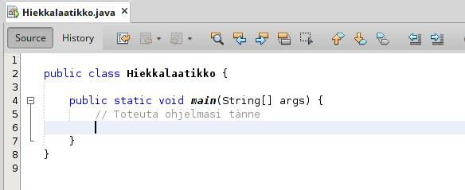

<!-- ---
path: '/osa-1/2-tulostaminen'
title: 'Tulostaminen'
hidden: false
--- -->

<!-- <text-box variant='learningObjectives' name='Oppimistavoitteet'>

- Opit kirjoittamaan ohjelman, joka tulostaa tekstiä.
- Tutustut ohjelmien suorittamiseen.
- Tiedät mitä termillä parametri tarkoitetaan.

</text-box> -->

<text-box variant='learningObjectives' name='Learning Objectives'>

- You learn to write a program that prints text.
- You become familiar with executing programs.
- You know what the term parameter means.

<!-- </text-box>

Tulostuskomento `System.out.println("Hei maailma");` tulostaa tekstin "Hei maailma".

```java
System.out.println("Hei maailma!");
```

<sample-output>

Hei maailma!

</sample-output> -->

</text-box>

The print command `System.out.println("Hello world");` prints the text "Hello world".

```java
System.out.println("Hello world!");
```

<sample-output>

Hello world!

</sample-output>

<!-- Yllä olevan tekstialueen näköiset kohdat materiaalissa kuvaavat koodiesimerkin tuottamaan tulostuksen. Yllä ohjelma tuottaisi siis tulostuksen "Hei maailma!". Voit kokeilla kaikkia materiaalin esimerkkejä ohjelmointiympäristössä olevassa "Hiekkalaatikko"-nimisessä tehtäväpohjassa.

Tulostuskomennon avulla tulostettavaa tekstiä voi vaihtaa mielivaltaisesti, kunhan komento `System.out.println("mielivaltainen teksti");` -- eli `System` piste `out` piste `println` sulut auki `(` "teksti" sulut kiinni `)` ja puolipiste `;` pysyy muuttumattomana. Alla oleva komento tulostaa tekstin "Hei vaan!". -->

Sections in the material similar to the text area above demonstrate an output produced by some example code. Accordingly, the above program would produce the print output "Hello World!". You can try all of the material's examples in the exercise template named "Sandbox", which is found in the programming environment.

Text printed with the print command can be changed arbitrarily as long as the command `System.out.println("arbitary text");` -- i.e., `System` dot `out` dot `println` open parentheses `(` "the text" close parentheses `)` and semicolon `;` remains unchanged. The command below command will print the text "Hello there!".

<!-- ```java
System.out.println("Hei vaan!");
```

<sample-output>

Hei vaan!

</sample-output> -->

```java
System.out.println("Hello there!");
```

<sample-output>

Hello there!

</sample-output>

<!-- ## Ohjelmarunko

Ohjelmamme vaativat toimiakseen ohjelmarungon, joka näyttää seuraavalta. Rungon nimi, tässä `Esimerkki` vastaa lähdekoodin sisältävän tiedoston nimeä (esim. `Esimerkki.java`).

```java
public class Esimerkki {
    public static void main(String[] args) {

        System.out.println("Tulostettava teksti");

    }
}
``` -->

## Program Frame

Our programs have to be written within a program frame, such as the one below, for them to work. The name of the frame, `Example` in this case, corresponds to the file name that contains the source code (e.g. `Example.java`).

```java
public class Example {
    public static void main(String[] args) {

        System.out.println("Text to be printed");

    }
}
```

<!-- Ohjelman suoritus alkaa riviä `public static void main(String[] args) {` seuraavalta riviltä ja päättyy sulkevaan aaltosulkuun `}`. Komennot suoritetaan yksi kerrallaan. Tulemme myöhemmin tutustumaan tarkemmin sanojen `public class` ja `public static void` merkitykseen. Yllä olevassa esimerkissä ainoa suoritettava komento on `System.out.println("Tulostettava teksti");`, jonka tulostus on seuraava.

<sample-output>

Tulostettava teksti

</sample-output>

 -->

Execution of the program starts from the line that follows `public static void main(string[] args) {`, and ends at the closing curly bracket `}`. Commands are executed one line at a time. We will get know the meaning of the words `public class` and `public static void` later on. In the above example, `System.out.println("Text to be printed")` is the only command to be executed and its output is:

<sample-output>

Text to be printed

</sample-output>

<!-- <text-box variant="hint" name="Materiaalin esimerkit ja ohjelmarunko">

Materiaalin esimerkeissä ei käytetä aina ohjelmarunkoa, mutta voit olettaa, että se tarvitaan aina. Esimerkit voivat siis olla esimerkiksi yhden rivin mittaisia kuten alla oleva tulostusesimerkki.

```java
System.out.println("Hei maailma!");
```

Todellisuudessa yllä oleva esimerkki näyttää Java-kielisellä ohjelmalla kuitenkin seuraavalta.

```java
public class Esimerkki {
    public static void main(String[] args) {
        // Tänne kirjoitetaan ohjelman käyttämät lauseet
        System.out.println("Hei maailma!");
    }
}
```

</text-box> -->

<text-box variant="hint" name="Examples in material and code boilerplate">

Not all of the material examples use a template, but you should assume that one is always needed. The examples can consist of only a single line, such as the printing example below.

```java
System.out.println("Hello world");
```

In reality however, the example above looks like the following when written in Java.

```java
public class Example {
    public static void main(String[] args) {
        // Here goes the statements used by the program
        System.out.println("Hello world!");
    }
}
```

</text-box>

<!-- Alla on kurssin toinen ohjelmointitehtävä. Mikäli haluat, voit katsoa jo nyt alta olevalta videolta miten tehtävä ratkaistaan.

<youtube id="-DzOKI6iH5w"></youtube>

<programming-exercise name='Ada Lovelace' tmcname='osa01-Osa01_02.AdaLovelace'>

Tehtäväpohjassa on seuraavanlainen ohjelmarunko:

```java
public class Nimi {
    public static void main(String[] args) {
        // Kirjoita ohjelmasi tähän alle
x
    }
}
```
Rivi "// Kirjoita ohjelmasi tähän alle" on _kommenttirivi_, jota tietokone ei ota huomioon ohjelmaa suoritettaessa. Lisää kommenttirivin alle lause, joka tulostaa merkkijonon "Ada Lovelace" ja suorita ohjelma. Ohjelman tulostuksen tulee olla seuraavanlainen:

<sample-output>

Ada Lovelace

</sample-output>

Kun olet tehnyt tehtävän ja huomaat, että ohjelma tulostaa halutun merkkijonon, palauta tehtävä TMC:lle. Tutustu tämän jälkeen halutessasi lisää [Ada Lovelaceen](https://en.wikipedia.org/wiki/Ada_Lovelace), joka oli yksi ensimmäisistä ohjelmoijista.

</programming-exercise>
-->

You'll find the second programming exercise of the course below. If you want, you can watch the video linked below in advance to see how the exercise is solved.

<!-- TODO video englanniksi? -->

<youtube id="-DzOKI6iH5w"></youtube>

<programming-exercise name='Ada Lovelace' tmcname='part01-Part01_02.AdaLovelace'>

The exercise template has the following frame:

```java
public class AdaLovelace {
    public static void main(String[] args) {
        // Write your program here

    }
}
```

The line "// Write your program here" is a _line comment_, which the computer ignores when executing the program. Add a new line below the line comment that prints the string "Ada Lovelace" and run the program. The output of the program should be:

<sample-output>

Ada Lovelace

</sample-output>

Once you've finished the exercise and see that it prints the correct string, return the exercise to TMC. Following that, you can read more about [Ada Lovelace](https://en.wikipedia.org/wiki/Ada_Lovelace), who was one of the first programmers.

</programming-exercise>

<!-- <text-box variant='hint' name='Ohjelman suorittaminen'>

Ohjelman suorittaminen tapahtuu TMC:ssä vihreää play-nappia painamalla tai valitsemalla TMC-valikosta vaihtoehdon "Run project".

TODO: tähän kuva TMC:stä (highlightattuna run-nappi).

Ohjelman suorittaminen on helppoa, mutta pinnan alla tapahtuu paljon. Kun ohjelma halutaan suorittaa, lähdekoodi käännetään ensin Java-ohjelmointikielen tavukoodiksi. Tämä kääntäminen tapahtuu Javan omalla kääntäjällä, joka on myös ohjelma. Tämän jälkeen ohjelma käynnistetään, eli siinä olevat käskyt suoritetaan yksi kerrallaan Java-kielistä tavukoodia ymmärtävän Java-tulkin toimesta.

Tämä käännösprosessi vaikuttaa siihen, miten ja milloin ohjelmien virheet ilmenevät. Kun ohjelma käännetään ennen suoritusta, kääntämiseen käytettävä ohjelma voi etsiä ohjelmasta virheitä. Tämä vaikuttaa myös ohjelmoinnissa käytetyn ohjelmointiympäristön tarjoamiin vinkkeihin, jolloin ohjelmoija voi saada palautetta ohjelmassa olevista virheistä heti.

Käytössämme oleva ohjelmointiympäristö kääntää ja suorittaa ohjelman yhdellä napinpainalluksella. Ohjelmointiympäristö kääntää ohjelmaa kuitenkin jatkuvasti, jolloin se pystyy ilmoittamaan virheistä. Kokeile vaikkapa vaihtaa yllä olevan Ada Lovelace -tehtävän tulostuslause muotoon `Systemoutprintln("hei!")` -- huomaat, että rivi alleviivataan ja sen vasemmalle puolelle tulee ilmoitus virheestä.

</text-box> -->

<text-box variant='hint' name='Running the program'>

You can run a program in TMC by pressing the green play-button, or by selecting "Run project" from the TMC-menu.

TODO: tähän kuva TMC:stä (highlightattuna run-nappi).

Although running the program is straightforward, a lot happens behind the scenes. When a program is run, the source code is first compiled into Java bytecode. This compilation process is done by Java's own compiler, which itself is a program. Following that, the program gets executed, meaning the commands are executed one-by-one by a Java-interpreter that is able to read Java bytecode.

This compile process affects how and when errors occur. When program is compiled before execution, the program used for compiling can search errors from your program. This affects also what tips the programming environment can offer so that a programmer can get feedback about possible errors instantly.

Our programming environment compiles and executes the program at the touch of a button. However, the programming environment compiles the program continually in which case it can report errors. You can for example try to change above Ada Lovelace exercise print command to `Systemoutprintln("hi!")` -- you will notice, that the row will be underlined and there will be notification about a error on the left side.

</text-box>

<!-- ## Useamman rivin tulostaminen

Ohjelmia rakennetaan komento komennolta, missä jokainen komento tulee uudelle riville. Alla olevassa esimerkissä komento `System.out.println` esiintyy kahdesti, joka tarkoittaa sitä että ohjelmassa suoritetaan kaksi tulostuskomentoa.

```java
public class Ohjelma {
    public static void main(String[] args) {
        System.out.println("Hei maailma!");
        System.out.println("... ja maailmankaikkeus!");
    }
}
```

Yllä olevan ohjelman tulostus on seuraava.

<sample-output>

Hei maailma!
... ja maailmankaikkeus!

</sample-output> -->

## Printing Multiple Lines

Programs are constructed command by command where each command comes on a new line. In the example below, command `System.out.println` appears twice, which means that two print commands are being executed in the program.

```java
public class Ohjelma {
    public static void main(String[] args) {
        System.out.println("Hello world!");
        System.out.println("... and the universe!");
    }
}
```

Above program will print:

<sample-output>

Hello world!
... and the universe!

</sample-output> -->

<!--
<text-box variant='hint' name='Tarkka tarkastaja'>

Ohjelmointitehtävät tarkastaa TMC-Henrik, joka on hyvin tarkka. Tehtävänannoissa olevat toiveet tulostusmuodosta ovat tarkkoja. Jos tehtävänannossa toivotaan esimerkiksi että ohjelma tulostaa sulun, ei sulkua saa jättää tulostamatta.

Tämä tulostukseen liittyvä tarkkuus on oleellista laajemmin ohjelmoinnissa. Yhdenkin merkin puuttuminen voi johtaa virhetilanteeseen. Aloittelevat ohjelmoijat usein esimerkiksi syöttävät pilkun pisteen sijaan, kirjoittavat vaikkapa `printin` sanan `println` sijaan, jättävät tulostettavasta merkkijonosta hipsut pois, tai unohtavat komentoa seuraavan puolipisteen. Jokainen edelläolevista esimerkeistä johtaa virhetilanteeseen, missä ohjelman suoritus ei onnistu.

Ohjelmoinnin opettelu onkin oikeastaan tie täynnä virheitä -- jokainen virheviesti on myös oppimistilanne.


</text-box> -->

<text-box variant='hint' name='Exact inspector'>

Programming exercises will be checked by TMC-Henrik, who is very exact. Expectations about print format in assignmenst are very exact. If, for example, the assignment expects you to print a parenthese, you must print a parenthese.

This exactness in printing is widelt relevant in programming. Missing a sinlge character can cause an error. Beginner programmers often input a comma instead of a point, write for example `printin` instad of `println`, leave apostrophes out, or forget the following semicolon after a command. Every example of the above would cause and error where executing of a program fails.

Learning programming really is a road full of errors -- every error is a learning situation.

</text-box>
<!--
<programming-exercise name='Olipa kerran ohjelma' tmcname='osa01-Osa01_03.OlipaKerranOhjelma'>

Tehtäväpohjassa on seuraavanlainen ohjelmarunko:

```java
public class OlipaKerran {
    public static void main(String[] args) {
        // Toteuta ohjelmasi tänne

    }
}
```

Muokkaa ohjelmaa siten, että ohjelman suoritus tulostaa seuraavanlaisen tekstin. Käytä tekstin tulostamiseen kolmea `System.out.println` komentoa.

<sample-output>

Olipa
kerran
ohjelma

</sample-output>

</programming-exercise> -->

<programming-exercise name='Once upon a time' tmcname='part01-Part01_03.OnceUponATime'>

The exercise template comes with the following code frame:

```java
public class OnceUponATime {
    public static void main(String[] args) {
        // Write your program here

    }
}
```

Edit the program so that it will print the following text. Use three `System.out.println` commands for printing.

<sample-output>

Once upon a time
there was
a program

</sample-output>

</programming-exercise>

<!-- <text-box variant='hint' name='Lyhenne "sout"'>

Komennon `System.out.println("...")` kirjoittaminen voi olla melko työlästä. Kokeile kirjoittaa NetBeans:iin (main:in sisään) tyhjälle riville _sout_ ja paina tabulaattoria (näppäin q:n vasemmalla puolella). Mitä tapahtuu? Tämä pieni apuväline säästänee jatkossa runsaasti aikaasi.

Alla oleva animaatio kuvaa sout-komennon käyttöä. Kun käyttäjä on kirjoittanut sout, hän painaa tabulaattoria. Taikatemppu!



</text-box> -->

<text-box>

Writing the command `System.out.println("...") can be pretty cumbersome. In NetBeans try to write on a blank line (in main) **sout** and press tabulator (key left to q). What happens? This small tool will propably save much of your time.

Animation below illustrates the use of sout-command. First user writes sout and then pressed tabulator. A Magic Trick!


</text-box>

<!-- <programming-exercise name='Olipa kerran maa' tmcname='osa01-Osa01_04.OlipaKerranMaa'>

Tehtäväpohjassa on seuraavanlainen ohjelmarunko:

```java
public class OlipaKerranMaa {
    public static void main(String[] args) {

    }
}
```

Muokkaa ohjelmaa siten, että ohjelman suoritus tulostaa seuraavanlaisen tekstin. Käytä tässä yllä nähtyä "sout"-lyhennettä tulostuskomentojen kirjoittamiseen.

<sample-output>

Olipa
kerran
maa

</sample-output>

</programming-exercise> -->

<programming-exercise name='Dinosaur' tmcname='part01-Part01_04.Dinosaur'>

The exercise comes ready with the following template:

```java
public class Dinosaur {
    public static void main(String[] args) {
        // Write your program here
    }
}
```

Edit the program so that it will print the following text. Use the "sout"-shorthand for writing the print commands.

<sample-output>

Once upon a time
there was
a dinosaur

</sample-output>

</programming-exercise>

<!-- ## Terminologiaa ja koodin kommentointi

### Komennon parametrit

Tulostuslauseen tulostama tieto eli komennon _parametrit_ annetaan tulostuskomennolle lisäämällä ne lauseen perässä olevien sulkujen `()` sisään. Esimerkiksi `System.out.println` -komennon parametriksi annetaan merkkijono "hei" hipsujen sisällä seuraavasti: `System.out.println("hei")`.

### Puolipiste erottaa lauseet toisistaan

Puolipisteellä `;` erotetaan lauseet toisistaan. Voisimme oikeastaan kirjoittaa lähes kaiken yhdelle riville. Tämä ei ole kuitenkaan kovin ymmärrettävää.

```java
System.out.println("Hei "); System.out.println("maailma"); System.out.println("!\n");
```

<sample-output>

Hei
maailma
!

</sample-output>

Vaikka yllä oleva esimerkki toimii, on rivinvaihtojen käyttö tärkeää muita ohjelmoijia ajatellen. Tällöin ohjelman lukija tietää, että kullakin rivillä tehdään vain yksi konkreettinen asia.


TODO: quiz, jossa kysytään että mistä tietyssä termissä on kyse
 -->

## Terminology and Commenting Code

### Command parameters

The information to be printed by the print command, i.e. its **parameters**, are passed to it by placing them inside the parentheses `()` that follow the command. For example, passing `Hi` as a parameter to the `System.out.println` command is done like this: `System.out.println("Hi")`.

### Semicolon separates commands

Commands are separated with a semicolon `;`. We could, if we wanted to, write almost everything on a single line. However, that would be difficult to understand.

```java
System.out.println("Hello "); System.out.println("world"); System.out.println("!\n");
```

<sample-output>

Hello
world
!

</sample-output>

Although the above example works, it's important to be considerate of other programmers and to use line breaks. That way, anyone reading the program knows that each line does only a single concrete thing.

<!-- TODO: quiz, jossa kysytään että mistä tietyssä termissä on kyse -->

<!-- ### Kommentit

Lähdekoodia voi kommentoida selkeyttääkseen sitä tai lisätäkseen muistiinpanoja kahdella eri tavalla.

- Yhden rivin kommentit aloitetaan kahdella vinoviivalla, `//`. Kaikki kahta vinoviivaa seuraava samalla rivillä oleva teksti tulkitaan kommentiksi.
- Useamman rivin kommentit aloitetaan yhdellä vinoviivalla ja tähdellä `/*` ja lopetetaan tähdellä ja vinoviivalla `*/`. Kaikki useamman rivin kommentin aloittavan ja lopettavan alueen välillä tulkitaan kommentiksi.

Alla on esimerkki ohjelmasta, jossa kumpikin kommenttityyppi on käytössä.

```java
public class Kommentteja {
    public static void main(String[] args) {
        // Tulostetaan
        System.out.println("Tulostettava teksti");
        System.out.println("Lisää tulostettavaa!");
        /* Seuraavaksi:
        - lisää tulostamisesta
        - lisää harjoittelua
        - muuttujat
        - ...
        */
        System.out.println("Muuta tulostettavaa");
    }
}
```

Esimerkin alin rivi esittelee erityisen kätevän käyttökohteen kommenteille. Kirjoitettua lähdekoodia ei tarvitse poistaa jos haluaa tilapäisesti kokeilla jotain. -->

### Comments

Source code can be commented to clarify it or to add notes. There are two ways to do this.

- Single-line comments are marked with two slashes `//`. Everything following them on the same line is interpreted as a comment.
- Multi-line comments are marked with a slash and an asterisk `/*`, and closed with an asterisk followed by a slash `*/`. Everything between them is interpreted as a comment.

Below is an example of a program where both are used.

```java
public class Comments {
    public static void main(String[] args) {
        // Printing
        System.out.println("Text to print");
        System.out.println("More text to print!");
        /* Next:
        - more on printing
        - more practice
        - variables
        - ...
        */
        System.out.println("Some other text to print");
        // System.out.println("Trying stuff out")
    }
}
```

The last line of the example shows a particularly handy use-case for comments. The source code does not need to be removed to temporarily try out something.

<!-- TODO: Tää ei nyt oikei käy järkeen? -->
