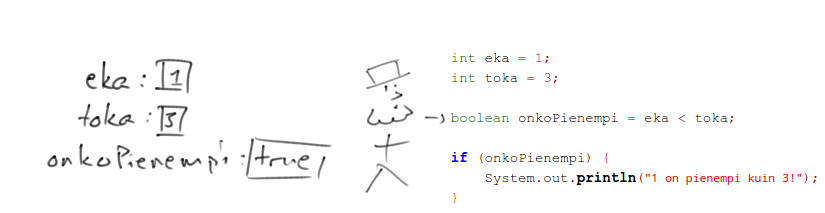

<text-box variant='learningObjectives' name='Oppimistavoitteet'>

* Tunnet käsitteen ehtolause ja osaat luoda ohjelmaan vaihtoehtoista toimintaa ehtolauseen avulla.
* Tunnet yleisimmät vertailuoperaatiot (yhtäsuuruus ==, suurempi kuin >, suurempi tai yhtäsuuri kuin >=, pienempi kuin <, pienempi tai yhtäsuuri kuin <=) ja osaat käyttää niitä kokonaislukujen ja liukulukujen vertailuun osana ehtolausetta.
* Osaat käyttää totuusarvomuuttujia osana ehtolausetta.
* Osaat vertailla merkkijonoja merkkijonoihin liittyvän equals-komennon avulla.

</text-box>


Ohjelmamme ovat tähän mennessä olleet lineaarisia eli ohjelmien suoritus on tapahtunut ylhäältä alaspäin ilman suuria yllätyksiä tai vaihtoehtoja. Ohjelmiin halutaan kuitenkin usein vaihtoehtoista toiminnallisuutta, eli toiminnallisuutta joka riippuu tavalla tai toisella ohjelmassa olevien muuttujien tilasta.

Jotta ohjelman suoritus voisi _haarautua_ esimerkiksi käyttäjän antaman syötteen perusteella, tarvitsemme käyttöömme **ehtolauseen**. Yksinkertaisin ehtolause on seuraavanlainen.

```java
System.out.println("Hei maailma!");
if (true) {
    System.out.println("Et voi välttää tätä koodia!");
}
```

<sample-output>

Hei maailma!
Et voi välttää tätä koodia!

</sample-output>

Ehtolause alkaa avainsanalla `if`, jota seuraa sulut. Sulkujen sisälle asetetaan lauseke, joka evaluoidaan kun ehtolause saavutetaan. Evaluoinnin tulos on totuusarvo, yllä evaluointia ei tehty, vaan ehtolauseessa käytettiin suoraan totuusarvoa.

Sulkuja seuraa lohko, joka määritellään avaavan aaltosulun `{` ja sulkevan aaltosulun `}` sisään. Lohkon sisällä oleva lähdekoodi mikäli sulkujen sisälle asetettu lauseke evaluoidaan todeksi (true).

Tarkastellaan esimerkkiä, missä ehtolauseen lausekkeessa vertaillaan lukuja.

```java
int luku = 11;
if (luku > 10) {
    System.out.println("Luku oli suurempi kuin 10");
}
```

Jos ehtolauseen lauseke evaluoidaan todeksi, yllä "jos muuttujassa luku oleva arvo on suurempi kuin 10", ohjelman suoritus siirtyy ehtolauseen määrittelemään lohkoon. Jos taas lauseke on epätotta, ohjelman suoritus siirtyy ehtolauseeseen liittyvän lohkon päättävän aaltosulun jälkeiseen lauseeseen.

Huomaa, että `if` -lauseen perään ei tule puolipistettä, sillä lause ei lopu ehto-osan jälkeen.


<text-box variant='hint' name='Ohjelmakoodin sisennys'>

Lohkojen sisällä oleva koodi sisennetään. Esimerkiksi ehtolauseeseen liittyvän lohkon sisältämä lähdekoodi sisennetään neljä välilyöntiä sisemmälle kuin ehtolauseen aloittava `if`-komento. Neljä merkkiä saa myös tabulaattorimerkillä (q:n vasemmalla puolella oleva näppäin). Kun lohko sulkeutuu, eli tulee }-merkki, sisennys loppuu. }-merkki on samalla tasolla kuin ehtolauseen aloittanut `if`-komento.

Alla oleva esimerkki on sisennetty väärin.

```java
if (luku > 10) {
luku = 9;
}
```

Alla oleva esimerkki on sisennetty oikein.

```java
if (luku > 10) {
    luku = 9;
}
```

</text-box>


<programming-exercise name="Ylinopeussakko" tmcname='osa01-Osa01_25.Ylinopeussakko'>

Tee ohjelma, joka kysyy käyttäjältä kokonaisluvun ja tulostaa merkkijonon "Ylinopeussakko!" jos luku on suurempi kuin 120.

<sample-output>

Kerro nopeus:
**15**

</sample-output>

<sample-output>

Kerro nopeus:
**135**
Ylinopeussakko!

</sample-output>

</programming-exercise>


## Vertailuoperaattorit

Vertailuoperaattoreita ovat seuraavat:

* `>`suurempi kuin
* `>=`suurempi tai yhtä suuri kuin
* `<`pienempi kuin
* `<=` pienempi tai yhtä suuri kuin
* `==` yhtä suuri kuin
* `!=` erisuuri kuin

```java
int luku = 55;

if (luku != 0) {
    System.out.println("Luku oli erisuuri kuin 0");
}

if (luku >= 1000) {
    System.out.println("Luku oli vähintään 1000");
}
```

<sample-output>

Luku oli erisuuri kuin 0

</sample-output>

<programming-exercise name="Orwell" tmcname='osa01-Osa01_26.Orwell'>

Tee ohjelma, joka kysyy käyttäjältä kokonaisluvun ja tulostaa merkkijonon "Orwell" jos luku on täsmälleen 1984.

<sample-output>

Anna luku:
**1983**

</sample-output>

<sample-output>

Anna luku:
**1984**
Orwell

</sample-output>

</programming-exercise>


<programming-exercise name="Wanha" tmcname='osa01-Osa01_27.Wanha'>

Tee ohjelma, joka kysyy käyttäjältä vuosilukua. Jos käyttäjä syöttää luvun, joka on pienempi kuin 2015, ohjelma tulostaa merkkijonon "Wanha!".

<sample-output>

Anna vuosiluku:
**2017**

</sample-output>

<sample-output>

Anna vuosiluku:
**2013**
Wanha!

</sample-output>

</programming-exercise>


## Muulloin eli else

Jos ehtolauseen sulkujen sisällä oleva lauseke evaluoituu epätodeksi, ohjelmakoodin suoritus siirtyy ehtolauseen lohkon lopettavan aaltosulun seuraavaan lauseeseen. Tämä ei aina ole toivottua, vaan usein halutaan luoda vaihtoehtoinen toiminta tilanteeseen, missä ehtolauseen lauseke on epätotta.

Tämä onnistuu `if`-komennon yhteydessä käytettävän `else`-komennon avulla.

```java
int luku = 4;

if (luku > 5) {
    System.out.println("Lukusi on suurempi kuin viisi!");
} else {
    System.out.println("Lukusi on viisi tai alle!");
}
```

<sample-output>

Lukusi on viisi tai alle!

</sample-output>

Jos ehtolauseeseen on määritelty `else`-haara, suoritetaan else-haaran määrittelemä lohko jos ehtolauseen ehto ei ole totta. Komento `else` tulee samalle riville `if`-komennon määrittelemän lohkon lopettavan aaltosulun kanssa.


<programming-exercise name="Positiivinen luku" tmcname='osa01-Osa01_28.PositiivinenLuku'>

Tee ohjelma, joka kysyy käyttäjältä kokonaisluvun ja kertoo, onko se positiivinen (eli suurempi kuin nolla) vai ei.

<sample-output>

Anna luku:
**5**
Luku on positiivinen.

</sample-output>

<sample-output>

Anna luku:
**-2**
Luku ei ole positiivinen.

</sample-output>

</programming-exercise>


<programming-exercise name="Täysi-ikäisyys" tmcname='osa01-Osa01_29.TaysiIkaisyys'>

Tee ohjelma, joka kysyy käyttäjän ikää ja kertoo, onko tämä täysi-ikäinen (eli 18-vuotias tai vanhempi).

<sample-output>

Kuinka vanha olet?
**12**
Et ole täysi-ikäinen!

</sample-output>

<sample-output>

Kuinka vanha olet?
**32**
Olet täysi-ikäinen!

</sample-output>

</programming-exercise>


## Lisää vaihtoehtoja: else if

Jos vaihtoehtoja on useampia käytetään `else if`-komentoa. Komento `else if` on kuin `else`, mutta lisäehdolla. `else if` tulee `if`-ehdon jälkeen, ja niitä voi olla useita.

```java
int luku = 3;

if (luku == 1) {
    System.out.println("Luku on yksi");
} else if (luku == 2) {
    System.out.println("Lukuna on kaksi");
} else if (luku == 3) {
    System.out.println("Kolme lienee lukuna!");
} else {
    System.out.println("Jotain muuta!");
}
```

<sample-output>

Kolme lienee lukuna!

</sample-output>

Luetaan yllä oleva esimerkki: 'Jos luku on yksi, tulosta "Luku on yksi", muuten jos luku on kaksi, tulosta "Lukuna on kaksi", muuten jos lukuna on kolme, tulosta "Kolme lienee lukuna!". Muulloin, tulosta "Jotain muuta!"'.

Yllä olevan ohjelman askeleittainen visualisointi:

<code-states-visualizer input='{"code":"public class Esimerkki {\n  public static void main(String[] args) {\n    int luku = 3;\n    \n    if (luku == 1) {\n      System.out.println(\"Luku on yksi\");\n    } else if (luku == 2) {\n      System.out.println(\"Lukuna on kaksi\");\n    } else if (luku == 3) {\n      System.out.println(\"Kolme lienee lukuna!\");\n    } else {\n      System.out.println(\"Jotain muuta!\");\n    }\n  }\n}","stdin":"","trace":[{"stdout":"","event":"call","line":3,"stack_to_render":[{"func_name":"main:3","encoded_locals":{},"ordered_varnames":[],"parent_frame_id_list":[],"is_highlighted":true,"is_zombie":false,"is_parent":false,"unique_hash":"1","frame_id":1}],"globals":{},"ordered_globals":[],"func_name":"main","heap":{}},{"stdout":"","event":"step_line","line":3,"stack_to_render":[{"func_name":"main:3","encoded_locals":{},"ordered_varnames":[],"parent_frame_id_list":[],"is_highlighted":true,"is_zombie":false,"is_parent":false,"unique_hash":"2","frame_id":2}],"globals":{},"ordered_globals":[],"func_name":"main","heap":{}},{"stdout":"","event":"step_line","line":5,"stack_to_render":[{"func_name":"main:5","encoded_locals":{"luku":3},"ordered_varnames":["luku"],"parent_frame_id_list":[],"is_highlighted":true,"is_zombie":false,"is_parent":false,"unique_hash":"4","frame_id":4}],"globals":{},"ordered_globals":[],"func_name":"main","heap":{}},{"stdout":"","event":"step_line","line":7,"stack_to_render":[{"func_name":"main:7","encoded_locals":{"luku":3},"ordered_varnames":["luku"],"parent_frame_id_list":[],"is_highlighted":true,"is_zombie":false,"is_parent":false,"unique_hash":"8","frame_id":8}],"globals":{},"ordered_globals":[],"func_name":"main","heap":{}},{"stdout":"","event":"step_line","line":9,"stack_to_render":[{"func_name":"main:9","encoded_locals":{"luku":3},"ordered_varnames":["luku"],"parent_frame_id_list":[],"is_highlighted":true,"is_zombie":false,"is_parent":false,"unique_hash":"12","frame_id":12}],"globals":{},"ordered_globals":[],"func_name":"main","heap":{}},{"stdout":"","event":"step_line","line":10,"stack_to_render":[{"func_name":"main:10","encoded_locals":{"luku":3},"ordered_varnames":["luku"],"parent_frame_id_list":[],"is_highlighted":true,"is_zombie":false,"is_parent":false,"unique_hash":"16","frame_id":16}],"globals":{},"ordered_globals":[],"func_name":"main","heap":{}},{"stdout":"Kolme lienee lukuna!\n","event":"step_line","line":14,"stack_to_render":[{"func_name":"main:14","encoded_locals":{"luku":3},"ordered_varnames":["luku"],"parent_frame_id_list":[],"is_highlighted":true,"is_zombie":false,"is_parent":false,"unique_hash":"20","frame_id":20}],"globals":{},"ordered_globals":[],"func_name":"main","heap":{}},{"stdout":"Kolme lienee lukuna!\n","event":"return","line":14,"stack_to_render":[{"func_name":"main:14","encoded_locals":{"luku":3,"__return__":["VOID"]},"ordered_varnames":["luku","__return__"],"parent_frame_id_list":[],"is_highlighted":true,"is_zombie":false,"is_parent":false,"unique_hash":"21","frame_id":21}],"globals":{},"ordered_globals":[],"func_name":"main","heap":{}}],"userlog":"Debugger VM maxMemory: 455M\n"}'></code-states-visualizer>


<programming-exercise name="Suurempi tai yhtäsuuri" tmcname='osa01-Osa01_30.SuurempiTaiYhtasuuri'>

Tee ohjelma, joka kysyy käyttäjältä kaksi kokonaislukua ja tulostaa niistä suuremman. Jos luvut ovat yhtä suuret, ohjelma huomaa myös tämän.

Esimerkkitulostuksia:

<sample-output>

Anna ensimmäinen luku:
**5**
Anna toinen luku:
**3**
Suurempi luku: 5

</sample-output>

<sample-output>

Anna ensimmäinen luku:
**5**
Anna toinen luku:
**8**
Suurempi luku: 8

</sample-output>

<sample-output>

Anna ensimmäinen luku: **5**
Anna toinen luku: **5**
Luvut ovat yhtä suuret!

</sample-output>

</programming-exercise>


## Vertailujen suoritusjärjestys

Vertailut suoritetaan järjestyksessä ylhäältä alaspäin. Kun suorituksessa päästään ehtolauseeseen, jonka ehto on totta, suoritetaan lohko ja lopetetaan vertailu.

```java
int luku = 5;

if (luku == 0) {
    System.out.println("Luku on nolla.");
} else if (luku > 0) {
    System.out.println("Luku on suurempi kuin nolla.");
} else if (luku > 2) {
    System.out.println("Luku on suurempi kuin kaksi.");
} else {
    System.out.println("Luku on pienempi kuin nolla.");
}
```

<sample-output>

Luku on suurempi kuin nolla.

</sample-output>

Yllä oleva esimerkki tulostaa merkkijonon "Luku on suurempi kuin nolla." vaikka myös ehto `luku > 2` on totta. Vertailu lopetetaan ensimmäiseen valintakäskyyn, jonka ehto on totta.


<programming-exercise name="Arvosanat ja pisteet" tmcname='osa01-Osa01_31.ArvosanatJaPisteet'>

Alla oleva taulukko kuvaa erään kurssin arvosanan muodostumista. Tee ohjelma, joka ilmoittaa kurssiarvosanan annetun taulukon mukaisesti.

| pistemäärä   | arvosana     |
| ------------ | --------     |
| < 0          | mahdotonta!  |
| 0-49         | hylätty      |
| 50-59        | 1            |
| 60-69        | 2            |
| 70-79        | 3            |
| 80-89        | 4            |
| 90-100       | 5            |
| > 100        | uskomatonta! |

Esimerkkitulostuksia:

<sample-output>

Anna pisteet [0-100]:
**37**
Arvosana: hylätty

</sample-output>

<sample-output>

Anna pisteet [0-100]:
**76**
Arvosana: 3

</sample-output>

<sample-output>

Anna pisteet [0-100]:
**95**
Arvosana: 5

</sample-output>

<sample-output>

Anna pisteet [0-100]:
**-3**
Arvosana: mahdotonta!

</sample-output>

</programming-exercise>


## Ehtolauseen lauseke ja totuusarvomuuttuja

Ehtolauseen sulkuihin asetettavan arvon tulee olla lausekkeen evaluoinnin jälkeen totuusarvotyyppinen. Totuusarvomuuttujan tyyppi on `boolean` ja arvo _true_ tai _false_.

```java
boolean onkoTotta = true;
System.out.println("Totuusarvomuuttujan arvo on " + onkoTotta);
```

<sample-output>

Totuusarvomuuttujan arvo on true

</sample-output>

Ehtolauseen voi suorittaa myös seuraavasti:

```java
boolean onkoTotta = true;
if (onkoTotta) {
    System.out.println("Aika vinhaa!");
}
```

<sample-output>

Aika vinhaa!

</sample-output>

Vertailuoperaattoreita voi käyttää myös ehtojen ulkopuolella. Tällöin vertailun tuloksena saatu totuusarvo asetetaan talteen totuusarvomuuttujaan myöhempää käyttöä varten.

```java
int eka = 1;
int toka = 3;
boolean onkoSuurempi = eka > toka;
```

Yllä olevassa esimerkissä totuusarvomuuttuja `onkoSuurempi` sisältää nyt totuusarvon _false_. Yllä olevaa esimerkkiä voi myös jatkaa ja ottaa siihen mukaan ehtolauseen.

```java
int eka = 1;
int toka = 3;
boolean onkoPienempi = eka < toka;

if (onkoPienempi) {
    System.out.println("1 on pienempi kuin 3!");
}
```



Yllä olevassa kuvassa ohjelmakoodia on suoritettu niin pitkään, että ohjelman muuttujat on luotu ja niihin on asetettu arvot. Muuttujassa `onkoPienempi` on arvona `true`. Seuraavana suoritetaan vertailu `if (onkoPienempi)` -- muuttujaan `onkoPienempi` liittyvä arvo löytyy sen lokerosta, ja lopulta ohjelma tulostaa:

<sample-output>

1 on pienempi kuin 3!

</sample-output>


<text-box variant='hint' name='Jakojäännös'>

Jakojäännös on hieman harvemmin käytetty operaatio, joka on kuitenkin varsin näppärä kun halutaan tarkistaa esimerkiksi luvun jaollisuutta. Jakojäännösoperaation merkki on `%`.

```java
int jakojaannos = 7 % 2;
System.out.println(jakojaannos); // tulostaa 1
System.out.println(5 % 3); // tulostaa 2
System.out.println(7 % 4); // tulostaa 3
System.out.println(8 % 4); // tulostaa 0
System.out.println(1 % 2); // tulostaa 1
```

Jos haluamme tietää onko käyttäjän syöttämä luku jaollinen neljälläsadalla, tarkastamme onko syötetyn luvun jakojäännös neljänsadan suhteen nolla.

```java
Scanner lukija = new Scanner(System.in);

int luku = Integer.valueOf(lukija.nextLine());
int jakojaannos = luku % 400;

if (jakojaannos == 0) {
    System.out.println("Luku " + luku + " on jaollinen neljälläsadalla.");
} else {
    System.out.println("Luku " + luku + " ei ole jaollinen neljälläsadalla.");
}
```

Koska jakojäännös on samanlainen operaatio kuin muutkin laskut, voi sen asettaa osaksi valintakäskyä.

```java
Scanner lukija = new Scanner(System.in);

int luku = Integer.valueOf(lukija.nextLine());

if (luku % 400 == 0) {
    System.out.println("Luku " + luku + " on jaollinen neljälläsadalla.");
} else {
    System.out.println("Luku " + luku + " ei ole jaollinen neljälläsadalla.");
}
```

</text-box>


<programming-exercise name="Pariton vai parillinen" tmcname='osa01-Osa01_32.ParitonVaiParillinen'>

Tee ohjelma, joka kysyy käyttäjältä luvun ja ilmoittaa, onko syötetty luku parillinen vai pariton.

<sample-output>

Anna luku:
**2**
Luku 2 on parillinen.

</sample-output>

<sample-output>

Anna luku:
**7**
Luku 7 on pariton.

</sample-output>

Vihje: Luvun jakojäännös 2:lla kertoo, onko luku parillinen vai pariton. Jakojäännös taas saadaan `%`-operaattorilla, tehtäväpohjassa on lisää ohjeita miten parittomuustarkastus hoituu jakojäännöksen avulla.

</programming-exercise>

## Ehtolauseet ja merkkijonojen vertailu

Siinä missä kokonaislukujen, liukulukujen, ja totuusarvojen samuutta voi verrata kahdella yhtäsuuruusmerkillä (`muuttuja1 == muuttuja2`), ei merkkijonojen samuuden vertailu kahdella yhtäsuuruusmerkillä onnistu.

Voit kokeilla tätä seuraavalla ohjelmalla:

```java
Scanner lukija = new Scanner(System.in);

System.out.println("Syötä ensimmäinen merkkijono");
String eka = lukija.nextLine();
System.out.println("Syötä toinen merkkijono");
String toka = lukija.nextLine();

if (eka == toka) {
    System.out.println("Merkkijonot olivat samat!");
} else {
    System.out.println("Merkkijonot olivat eri!");
}
```

<sample-output>

Syötä ensimmäinen merkkijono
**sama**
Syötä toinen merkkijono
**sama**
Merkkijonot olivat eri!

</sample-output>

<sample-output>

Syötä ensimmäinen merkkijono
**sama**
Syötä toinen merkkijono
**eri**
Merkkijonot olivat eri!

</sample-output>

Tämä liittyy merkkijonojen sisäiseen toimintaan sekä siihen, miten muuttujien vertailu on Javassa toteutettu. Käytännössä vertailun toimintaan vaikuttaa se, kuinka paljon tietoa muuttuja voi sisältää -- merkkijonot voivat sisältää äärettömän määrän merkkejä, kun taas kokonaisluvut, liukuluvut ja totuusarvot sisältävät aina yhden luvun tai arvon. Muuttujia, jotka sisältävät aina vain yhden luvun tai arvon voi verrata yhtäsuuruusmerkillä, kun taas enemmän tietoa sisältävillä muuttujille tällainen vertailu ei toimi. Palaamme tähän tarkemmin myöhemmin tällä kurssilla.

Merkkijonojen vertailussa käytetään merkkijonomuuttujiin liittyvää `equals`-komentoa. Komento toimii seuraavalla tavalla:

```java
Scanner lukija = new Scanner(System.in);

System.out.println("Syötä merkkijono");
String syote = lukija.nextLine();

if (syote.equals("merkkijono")) {
    System.out.println("Luit ohjeet oikein, hyvä!");
} else {
    System.out.println("Metsään meni!");
}
```

<sample-output>

Syötä merkkijono
**ok!**
Metsään meni!

</sample-output>

<sample-output>

Syötä merkkijono
**merkkijono**
Luit ohjeet oikein, hyvä!

</sample-output>

Komento equals kirjoitetaan merkkijonomuuttujan jälkeen siten, että se kiinnitetään pisteellä vertailtavaan muuttujaan. Komennolle annetaan parametrina merkkijono, johon muuttujaa vertaillaan. Mikäli merkkijonomuuttujaa vertaillaan suoraan merkkijonoon, voi merkkijonon asettaa hipsuilla merkittynä equals-komennon sulkujen sisään. Muulloin sulkujen sisään asetetaan sen merkkijonomuuttujan nimi, johon merkkijonomuuttujan sisältämää merkkijonoa verrataan.

Alla olevassa esimerkissä luetaan käyttäjältä kaksi merkkijonoa. Ensin tarkastetaan ovatko syötetyt merkkijonot samat, jonka jälkeen tarkastetaan onko syötettyjen merkkijonojen arvo "kaksi merkkijonoa".

```java
Scanner lukija = new Scanner(System.in);

System.out.println("Syötä kaksi merkkijonoa");
String eka = lukija.nextLine();
String toka = lukija.nextLine();

if (eka.equals(toka)) {
    System.out.println("Merkkijonot olivat samat!");
} else {
    System.out.println("Merkkijonot olivat eri!");
}

if (eka.equals("kaksi merkkijonoa")) {
    System.out.println("Nokkelaa!");
}

if (toka.equals("kaksi merkkijonoa")) {
    System.out.println("Ovelaa!");
}
```

<sample-output>

Syötä kaksi merkkijonoa
**hei**
**maailma**
Merkkijonot olivat eri!

</sample-output>

<sample-output>

Syötä kaksi merkkijonoa
**kaksi merkkijonoa**
**maailma**
Merkkijonot olivat eri!
Nokkelaa!

</sample-output>

<sample-output>

Syötä kaksi merkkijonoa
**samat**
**samat**
Merkkijonot olivat samat!

</sample-output>


<programming-exercise name="Tunnussana" tmcname='osa01-Osa01_33.Tunnussana'>

Tee ohjelma, joka kysyy käyttäjältä tunnussanaa. Mikäli tunnussana on "Caput Draconis", ohjelma tulostaa "Tervetuloa!". Muulloin ohjelman tulostus on "Hus siitä!".

<sample-output>

Tunnussana?
**Wattlebird**
Hus siitä!

</sample-output>

<sample-output>

Tunnussana?
**Caput Draconis**
Tervetuloa!

</sample-output>

</programming-exercise>


<programming-exercise name="Samat sanat" tmcname='osa01-Osa01_34.SamatSanat'>

Tee ohjelma, joka kysyy käyttäjältä kahta merkkijonoa. Mikäli merkkijonot ovat samat, ohjelma tulostaa "Samat sanat", muulloin ohjelma tulostaa "Ei sitten".

<sample-output>

Syötä ensimmäinen merkkijono:
**hei**
Syötä toinen merkkijono:
**hei**
Samat sanat

</sample-output>

<sample-output>

Syötä ensimmäinen merkkijono:
**hei**
Syötä toinen merkkijono:
**maailma**
Ei sitten

</sample-output>

