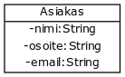
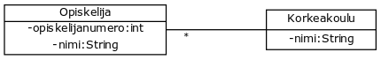

# Luokkakaaviot


<text-box variant='learningObjectives' name='Oppimistavoitteet'>

- Tunnet luokkakaavioiden merkintätavan ja osaat merkitä luokkakaavioon luokat, attribuutit, konstruktorit, ja metodit.
- Tunnet luokkien väliset yhteydet ja osaat merkitä luokkakaavioon perinnän sekä rajapinnan toteutuksen.
- Osaat luoda luokkia luokkakaavioiden perusteella.

</text-box>


Luokkakaavio on ohjelmistojen suunnittelussa ja mallinnuksessa käytettävä kaavio, jonka avulla kuvataan luokkia ja niiden yhteyksiä. Luokkakaaviot mahdollistavat ohjelmien kuvaamisen korkealla abstraktiotasolla ilman lähdekoodin katsomista.

Luokkaaviossa kuvattavat luokat vastaavat ohjelmakoodin luokkia. Kaavioissa kuvataan luokkien nimet, attribuutit, luokkien väliset yhteydet sekä mahdollisesti myös metodit.

Tutustumme seuraavaksi luokkakaavioiden merkintään ja tulkintaan. Opimme samalla <a href="https://fi.wikipedia.org/wiki/UML-mallinnus" target="_blank" norel>UML</a>-kielen luokkakaavioiden kuvaamiseen -- yhteisen kielen avulla eri ihmisten piirtämät luokkakaaviot ovat kaikkien ymmärrettävissä.

<br/>

## Luokan ja sen attribuuttien kuvaaminen

Tutustutaan ensin luokan ja sen attribuuttien kuvaamiseen. Luodaan luokka nimeltä `Henkilo`, jolla on oliomuuttujat nimi ja ikä.


```java
public class Henkilo {
    private String nimi;
    private int ika;
}
```

Luokkakaavioissa luokka kuvataan suorakulmiona, jonka ylälaidassa on luokan nimi. Luokan nimen alla on viiva, ja viivan alapuolella on attribuuttien eli oliomuuttujien nimet ja tyypit. Kukin oliomuuttuja kuvataan omalla rivillään.

Luokkaakaaviossa luokkaan liittyvät oliomuuttujat määritellään muodossa "muuttujanNimi: muuttujanTyyppi". Muuttujien näkyvyysmääreet merkitään muuttujan nimeä edeltävällä miinuksella (private) tai plussalla (public).


## Luokan konstruktorin kuvaaminen

Määrittellään luokalle seuraavaksi parametrillinen konstruktori. Konstruktori saa parametrinaan nimen.


```java
public class Henkilo {
    private String nimi;
    private int ika;

    public Henkilo(String nimi) {
        this.nimi = nimiAlussa;
        this.ika = 0;
    }
}
```

Luokkakaaviossa konstruktori (ja metodit) merkitään oliomuuttujien jälkeen. Oliomuuttujien alapuolelle lisätään viiva, jonka jälkeen tulee konstruktori (ja metodit). Konstruktori saa näkyvyysmääreen public takia eteen plussan, jonka lisäksi siitä merkitään nimi sekä parametrien nimet ja niiden tyypit. Yllä olevan luokan konstruktori merkitään muodossa `+ Henkilo(nimi: String)`.

Parametrit noudattavat siis samaa määrittelymuotoa kuin oliomuuttujat, eli "muuttujanNimi: muuttujanTyyppi".


## Luokan metodien kuvaaminen


Lisätään luokalle metodi, jonka palautustyyppi on void.

```java
public class Henkilo {
    private String nimi;
    private int ika;

    public Henkilo(String nimi) {
        this.nimi = nimi;
        this.ika = 0;
    }

    public void tulostaHenkilo() {
        System.out.println(this.nimi + ", ikä " + this.ika + " vuotta");
    }
}
```

Luokkakaaviossa metodi merkitään konstruktorin kanssa samaan alueeseen -- konstruktorit listataan ennen metodeja. Toisin kuin konstruktorille, metodeille merkitään myös palautustyyppi.


<text-box variant='hint' name='Luokkakaavio kertoo luokat, muuttujat, konstruktorit, ja metodit'>

Luokkakaaviossa kuvataan luokat, muuttujat, konstruktorit, ja metodit sekä luokkien väliset yhteydet. Luokkakaavio ei kuitenkaan kerro mitään konstruktorien ja metodien sisäisestä toteutuksesta. Luokkakaaviolla kerrotaan siis olioiden rakenteesta, mutta luokkakaaviot eivät itsessään määrittele toiminnallisuutta.

Esimerkiksi metodi `tulostaHenkilo` hyödyntää oliomuuttujia `nimi` ja `ika`, mutta luokkakaaviossa tämä ei näy millään tavalla.

</text-box>


Lisätään luokalle vielä nimen palauttava metodi `getNimi`.


```java
public class Henkilo {
    private String nimi;
    private int ika;

    public Henkilo(String nimi) {
        this.nimi = nimi;
        this.ika = 0;
    }

    public void tulostaHenkilo() {
        System.out.println(this.nimi + ", ikä " + this.ika + " vuotta");
    }

    public String getNimi() {
        return this.nimi;
    }
}
```


<programming-exercise name='Asiakas' tmcname='osa10-Osa10_01.Asiakas'>

Alla olevassa luokkakaaviossa on kuvattuna luokka Asiakas. Toteuta luokka tehtäväpohjaan.



</programming-exercise>

<programming-exercise name='Kirja ja lentokone' tmcname='osa10-Osa10_02.KirjaJaLentokone'>

Alla olevassa luokkakaaviossa on kuvattuna luokat Kirja ja Lentokone. Toteuta luokat tehtäväpohjaan.


</programming-exercise>


## Luokkien väliset yhteydet

Luokkakaavioissa yhteydet merkitään viivoilla, joissa nuolet kuvaavat yhteyden suuntaa. Oletetaan, että käytössämme luokka Kirja.


```java
public class Kirja {
    private String nimi;
    private String kustantaja;

    // konstruktorit ja metodit
}
```


Jos luokalle kirja merkitään kirjoittaja, joka on tyyppiä Henkilo, ohjelmakoodissa oliomuuttuja merkitään muiden muuttujien seuraksi.


```java
public class Kirja {
    private String nimi;
    private String kustantaja;
    private Henkilo kirjoittaja;

    // konstruktorit ja metodit
}
```

Luokkakaaviossa toisiin olioihin viittaavia muuttujia ei merkitä attribuutteihin, vaan ne merkitään yhteyksinä. Alla olevassa luokkakaaviossa on merkittynä luokat Henkilo ja Kirja, sekä näiden välinen yhteys.


[Henkilo]">

Nuoli kertoo "tietämyssuunnan". Yllä oleva yhteys kertoo, että kirja tietää kirjoittajansa, mutta henkilö ei tiedä mitään kirjoittamistaan kirjoista. Viivaan voi kirjoittaa myös tekstin, joka antaa lisätietoa yhteydestä. Yllä olevassa esimerkissä viivaan on kirjattu tieto siitä, että kirjaan liittyy "kirjoittaja".

Mikäli kirjalla voi olla useita kirjoittajia, kirjoittajat merkitään luokkaan listana.

```java
public class Kirja {
    private String nimi;
    private String kustantaja;
    private ArrayList<Henkilo> kirjoittajat;

    // konstruktorit ja metodit
}
```

Luokkakaaviossa tilanne merkitään yhteyden päätyyn asetettavalla tähdellä. Tähti kertoo, että kirjalla voi olla nollasta äärettömään kirjoittajaa. Alla olevassa esimerkissä yhteyteen ei ole merkitty yhteyttä kuvaavaa tekstiä "kirjoittajat", mutta se kannattaisi selkeyden takia lisätä kaavioon.

[Henkilo]">


Metodit merkitään luokkakaavioon normaalisti. Alla luokkaan Kirja on lisätty metodit `getKirjoittajat` ja `lisaaKirjoittaja`.


```java
public class Kirja {
    private String nimi;
    private String kustantaja;
    private ArrayList<Henkilo> kirjoittajat;

    // konstruktori

    public ArrayList<Henkilo> getKirjoittajat() {
        return this.kirjoittajat;
    }

    public void lisaaKirjoittaja(Henkilo kirjoittaja) {
        this.kirjoittajat.add(kirjoittaja);
    }
}
```

[Henkilo]">


Ylläolevaan kaavioon voisi lisätä vielä ArrayListin sisältämien arvojen tyypin `ArrayList<Henkilo>` sekä yhteyttä tarkentavan määreen "kirjoittajat".


<programming-exercise name='Naytos ja lippu' tmcname='osa10-Osa10_03.NaytosJaLippu'>

Alla on kuvattu kaksi luokkaa, Naytos ja Lippu, sekä niiden välinen yhteys. Alla olevassa kuvassa tähti on luokan Lippu-päädyssä -- tässä tapauksessa tähti antaa lisätietoa yhteydestä; vaikkei näytös tiedä näytökseen myydyistä lipuista, voi lippuja silti myydä näytökseen monia.

Toteuta kuvatut luokat tehtäväpohjaan.


</programming-exercise>


Mikäli luokkakaavioon ei merkitä nuolta, näkyy yhteys kummassakin oliossa. Alla esimerkki tilanteesta, missä kirja tietää kirjoittajansa ja henkilö tietää kirjoittamansa kirjan.


```java
public class Henkilo {
    private String nimi;
    private int ika;
    private Kirja kirja;

    // ...
}
```


```java
public class Kirja {
    private String nimi;
    private String kustantaja;
    private ArrayList<Henkilo> kirjoittajat;

    // ..
}
```

Kuten yllä huomaat, oletuksena -- eli kun viivan päätyyn ei merkitä tähteä -- kyse on yhdestä viitteestä. Yllä olevat luokat ovat mielenkiintoiset, sillä henkilöllä voi olla vain yksi kirja.


Mikäli henkilöllä voi olla monta kirjaa ja kirjalla monta kirjoittajaa, merkitään tähti yhteyden kumpaankin päätyyn seuraavasti:


Nyt luokka Henkilo olisi muotoa:


```java
import java.util.ArrayList;

public class Henkilo {
    private String nimi;
    private int ika;
    private ArrayList<Kirja> kirja;

    // ...
}
```


<programming-exercise name='Opiskelija ja korkeakoulu' tmcname='osa10-Osa10_04.OpiskelijaJaKorkeakoulu'>

Alla on kuvattu kaksi luokkaa, Opiskelija ja Korkeakoulu, sekä niiden välinen yhteys. Toteuta kuvatut luokat tehtäväpohjaan.



</programming-exercise>


## Perintä luokkakaavioissa

Perintä merkitään luokkakaavioon kolmion muotoisella nuolella. Kolmio on perittävän luokan päädyssä. Alla olevassa esimerkissä luokka Moottori perii luokan Osa.


Alla olevaan esimerkkiin on kirjoitettu auki muistavaa tuotevarastoa käsittelevän tehtävän luokkakaavio. Muistava tuotevarasto perii tuotevaraston, joka taas perii varaston. Muutoshistoria on erillinen luokka, jonka muistava tuotevarasto sisältää. Muistava tuotevarasto tietää muutoshistorian, mutta muutoshistoria ei tiedä muistavasta tuotevarastosta.


Abstraktien luokkien perintä toimii lähes samalla tavalla. Abstraktit luokat kuitenkin merkitään luokkakaavioon siten, että luokan nimen yläpuolella lukee `<<abstract>>`. Tämän lisäksi luokan nimi ja luokassa määritellyt abstraktit metodit kuvataan kursiivilla.


<programming-exercise name='Pelaaja ja tekoäly' nocoins='true' tmcname='osa10-Osa10_05.PelaajaJaTekoaly'>

Alla on kuvattu kaksi luokkaa, Pelaaja ja Tekoaly, sekä niiden välinen yhteys. Toteuta kuvatut luokat tehtäväpohjaan.


Tähän tehtävään ei ole erillistä mallivastausta.

</programming-exercise>


## Rajapinnat luokkakaavioissa

Rajapinnat merkitään luokkakaavioissa muodossa `<<interface>>` RajapintaLuokanNimi. Tarkastellaan esimerkkinä rajapintaa Luettava.


```java
public interface Luettava {

}
```


Metodit voidaan merkitä alle kuten luokkakaavioissa.

Rajapinnan toteuttaminen merkitään katkoviivalla ja kolmiolla. Alla on kuvattu tilanne, missä luokka Kirja toteuttaa rajapinnan Luettava.

> Luettava][Kirja]-.-^[<<interface>> Luettava]">


<programming-exercise name='Tallennettava henkilo' tmcname='osa10-Osa10_06.TallennettavaHenkilo'>

Alla on kuvattuna rajapinta Tallennettava sekä luokka Henkilo. Toteuta luokkakaaviossa kuvattu sisältö tehtäväpohjaan.

> Tallennettava||+tallenna():void;+poista():void;+lataa(osoite:String):void]^-.-[Henkilo|-nimi:String;-osoite:String]">


</programming-exercise>


<text-box variant='hint' name='Miten näitä kannattaa piirtää?'>

Luokkakaaviot ovat erinomainen tapa kuvata ongelma-aluetta ja ongelman muotoa muille. Niiden käyttö on erittäin hyödyllistä myös silloin, kun ohjelmoija suunnittelee useammasta luokasta koostuvan ohjelman rakennetta.


Luokkakaavioita piirretään ohjelman suunnitteluvaiheessa usein esimerkiksi valkotaulua tai isompaa paperiarkkia käyttäen. Luokkakaaviot kannattaa ajatella poisheitettävinä tuotoksina, jotka auttavat ohjelman rakennuksessa. Kaavion piirtämiseen -- eli tyylin oikeellisuuteen ja yksityiskohtiin -- ei kannata käyttää liian pitkään aikaa. Vastaavasti kaavio kannattaa piirtää sopivalla abstraktiotasolla. Esimerkiksi kymmeniä luokkia sisältävään luokkakaavioon ei kannata merkitä jokaisen luokan jokaista metodia ja muuttujaa: oleellista on, että kaaviosta saa luotua nopean yleiskuvan.


Materiaalissa käytetyt luokkakaaviot on piirretty <a href="https://yuml.me/" target="_blank" norel>yUML</a>:n, <a href="https://creately.com" target="_blank" norel>Creately</a>n, ja <a href="https://www.draw.io/" target="_blank" norel>draw.io</a>:n. Myös NetBeansiin löytyy välineitä luokkakaavioiden luomiseen -- esimerkiksi <a href="http://plugins.netbeans.org/plugin/55435/easyuml" target="_blank" norel>easyUML</a> mahdollistaa luokkakaavioiden luomisen suoraan projektin koodista.


</text-box>


<programming-exercise name='Isompi luokkakaavio' tmcname='osa10-Osa10_07.IsompiLuokkakaavio'>

Alla on kuvattuna isompi luokkakaavio, jossa on luokat A, B, C, D ja E, sekä rajapinnat IA, IB ja IC. Toteuta luokkakaavion kuvaama sisältö tehtäväpohjaan.

>;IA][<<interface>>;IB][<<interface>>;IC][A]-.-^[<<interface>>;IA][B]-.-^[<<interface>>;IB][C]-.-^[<<interface>>;IC][D]->[<<interface>>;IA][E]*-*[C][C]-^[B][B]-^[A]">

</programming-exercise>


<quiz id="8d94bdb1-6c84-5b35-9416-5808adaa2105"></quiz>

# Pakkaukset

<text-box variant='learningObjectives' name='Oppimistavoitteet'>

- Tiedät mitä pakkaukset ovat ja osaat asettaa luokkia pakkauksiin.
- Tiedät mistä Javassa käytetyn `import`-lauseen osat muodostuvat.

</text-box>


Ohjelmaa varten toteutettujen luokkien määrän kasvaessa toiminnallisuuksien ja metodien muistaminen vaikeutuu. Muistamista helpottaa luokkien järkevä nimentä sekä luokkien suunnittelu siten, että jokaisella luokalla on yksi selkeä vastuu. Tämän lisäksi luokat kannattaa jakaa toiminnallisuutta, käyttötarkoitusta tai jotain muuta loogista kokonaisuutta kuvaaviin pakkauksiin.

Pakkaukset (*package*) ovat käytännössä hakemistoja (directory, puhekielessä myös kansio), joihin lähdekooditiedostot organisoidaan.

Ohjelmointiympäristöt tarjoavat valmiit työkalut pakkausten hallintaan. Olemme tähän mennessä luoneet luokkia ja rajapintoja vain projektiin liittyvän lähdekoodipakkaukset-osion (*Source Packages*) oletuspakkaukseen (*default package*). Uuden pakkauksen voi luoda NetBeansissa projektin pakkauksiin liittyvässä Source Packages -osiossa oikeaa hiirennappia painamalla ja valitsemalla *New -&gt; Java Package...*.

Pakkauksen sisälle voidaan luoda luokkia aivan kuten oletuspakkaukseenkin (`default package`). Alla luodaan juuri luotuun pakkaukseen `kirjasto` luokka `Sovellus`.

Luokan pakkaus -- eli pakkaus, jossa luokka sijaitsee -- ilmaistaan lähdekooditiedoston alussa lauseella `package *pakkaus*;`. Alla oleva luokka `Sovellus` sijaitsee pakkauksessa `kirjasto`.


```java
package kirjasto;

public class Sovellus {

    public static void main(String[] args) {
        System.out.println("Hello packageworld!");
    }
}
```

Jokainen pakkaus -- myös oletuspakkaus eli default package -- voi sisältää useampia pakkauksia. Esimerkiksi pakkausmäärittelyssä `package kirjasto.domain` pakkaus `domain` on pakkauksen `kirjasto` sisällä. Edellä käytettyä nimeä `domain` käytetään usein kuvaamaan sovellusalueen käsitteisiin liittyvien luokkien säilytyspaikkaa. Esimerkiksi luokka `Kirja` voisi hyvin olla pakkauksen `kirjasto.domain` sisällä, sillä se kuvaa kirjastosovellukseen liittyvää käsitettä.


```java
package kirjasto.domain;

public class Kirja {
    private String nimi;

    public Kirja(String nimi) {
        this.nimi = nimi;
    }

    public String getNimi() {
        return this.nimi;
    }
}
```

Pakkauksissa olevia luokkia tuodaan luokan käyttöön `import`-lauseen avulla. Pakkauksessa `kirjasto.domain` oleva luokka `Kirja` tuodaan käyttöön puolipisteeseen päättyvällä lauseella `import kirjasto.domain.Kirja`. Luokkien tuomiseen käytetyt import-lauseet asetetaan lähdekooditiedostoon pakkausmäärittelyn jälkeen.

```java
package kirjasto;

import kirjasto.domain.Kirja;

public class Sovellus {

    public static void main(String[] args) {
        Kirja kirja = new Kirja("pakkausten ABC!");
        System.out.println("Hello packageworld: " + kirja.getNimi());
    }
}
```

<sample-output>

Hello packageworld: pakkausten ABC!

</sample-output>

Jatkossa *lähes kaikissa* tehtävissämme käytetään pakkauksia. Luodaan seuraavaksi ensimmäiset pakkaukset itse.


<programming-exercise name='Ensimmäisiä pakkauksia (3 osaa)' tmcname='osa10-Osa10_08.EnsimmaisiaPakkauksia'>


<h2>Käyttöliittymä-rajapinta</h2>

Tehtäväpohjassa on valmiina pakkaus `mooc`. Rakennetaan tämän pakkauksen sisälle sovelluksen toiminta. Lisää pakkaukseen mooc pakkaus `ui` (tämän jälkeen käytössä pitäisi olla pakkaus `mooc.ui`), ja lisää sinne rajapinta `Kayttoliittyma`.

Rajapinnan `Kayttoliittyma` tulee määritellä metodi `void paivita()`.


<h2>Tekstikäyttöliittymä</h2>

Luo samaan pakkaukseen luokka `Tekstikayttoliittyma`, joka toteuttaa rajapinnan `Kayttoliittyma`. Toteuta luokassa `Tekstikayttoliittyma` rajapinnan `Kayttoliittyma` vaatima metodi `public void paivita()` siten, että sen ainut tehtävä on merkkijonon "`Päivitetään käyttöliittymää`"-tulostaminen `System.out.println`-metodikutsulla.


<h2>Sovelluslogiikka</h2>

Luo tämän jälkeen pakkaus `mooc.logiikka`, ja lisää sinne luokka `Sovelluslogiikka`. Sovelluslogiikan tarjoaman toiminnallisuuden tulee olla seuraavanlainen.


- `public Sovelluslogiikka(Kayttoliittyma kayttoliittyma)`<br/>Sovelluslogiikka-luokan konstruktori. Saa parametrina Kayttoliittyma-rajapinnan toteuttavan luokan. Huom: jotta sovelluslogiikka näkisi rajapinnan, on sen "importoitava" se, eli tarvitset tiedoston alkuun rivin `import mooc.ui.Kayttoliittyma;`


- `public void suorita(int montaKertaa)`<br/>Tulostaa `montaKertaa`-muuttujan määrittelemän määrän merkkijonoa "Sovelluslogiikka toimii". Jokaisen "Sovelluslogiikka toimii"-tulostuksen jälkeen tulee kutsua konstruktorin parametrina saadun rajapinnan `Kayttoliittyma`-toteuttaman olion määrittelemää `paivita()`-metodia.


Voit testata sovelluksen toimintaa seuraavalla pääohjelmaluokalla.


```java
import mooc.logiikka.Sovelluslogiikka;
import mooc.ui.Kayttoliittyma;
import mooc.ui.Tekstikayttoliittyma;

public class Main {

    public static void main(String[] args) {
        Kayttoliittyma kayttoliittyma = new Tekstikayttoliittyma();
        new Sovelluslogiikka(kayttoliittyma).suorita(3);
    }
}
```

<sample-output>

Sovelluslogiikka toimii
Päivitetään käyttöliittymää
Sovelluslogiikka toimii
Päivitetään käyttöliittymää
Sovelluslogiikka toimii
Päivitetään käyttöliittymää

</sample-output>

</programming-exercise>


<programming-exercise name='Kolme pakkausta' tmcname='osa10-Osa10_09.KolmePakkausta'>

Luo tehtäväpohjaan kolme pakkausta `a`, `b` ja `c`. Luo pakkauksen `a` sisälle luokka `A`, pakkauksen `b` sisälle luokka `B`, ja pakkauksen `c` sisälle luokka `C`. Luokissa ei tarvita oliomuuttujia, konstruktoreja tai metodeja.

</programming-exercise>


## Hakemistorakenne tiedostojärjestelmässä


Kaikki NetBeansissa näkyvät projektit ovat tietokoneesi <a href="http://fi.wikipedia.org/wiki/Tiedostoj%C3%A4rjestelm%C3%A4" target="_blank">tiedostojärjestelmässä</a> tai jollain keskitetyllä levypalvelimella. Jokaiselle projektille on olemassa oma hakemisto, jonka sisällä on projektiin liittyvät tiedostot ja hakemistot.

<br/>

Projektin hakemistossa `src/main/java` on ohjelmaan liittyvät lähdekoodit. Jos luokan pakkauksena on kirjasto, sijaitsee luokka projektin lähdekoodihakemiston `src/main/java/kirjasto`-kansiossa. NetBeansissa voi käydä katsomassa projektien konkreettista rakennetta **Files**-välilehdeltä joka on normaalisti **Projects**-välilehden vieressä. Jos et näe välilehteä **Files**, saa sen näkyville valitsemalla vaihtoehdon **Files** valikosta **Window**.

Sovelluskehitystä tehdään normaalisti **Projects**-välilehdeltä, jossa NetBeans on piilottanut projektiin liittyviä tiedostoja joista ohjelmoijan ei tarvitse välittää.


## Pakkaukset ja näkyvyysmääreet

Olemme tähän mennessä käyttäneet kahta näkyvyysmäärettä. Näkyvyysmääreellä `private` määritellään muuttujia (ja metodeja), jotka ovat näkyvissä vain sen luokan sisällä joka määrittelee ne. Niitä ei voi käyttää luokan ulkopuolelta. Näkyvyysmääreellä `public` varustetut metodit ja muuttujat ovat taas kaikkien käytettävissä.


```java
package kirjasto.ui;

public class Kayttoliittyma {
    private Scanner lukija;

    public Kayttoliittyma(Scanner lukija) {
        this.lukija = lukija;
    }

    public void kaynnista() {
        tulostaOtsikko();

        // muu toiminnallisuus
    }

    private void tulostaOtsikko() {
        System.out.println("************");
        System.out.println("* KIRJASTO *");
        System.out.println("************");
    }
}
```


Yllä olevasta `Kayttoliittyma`-luokasta tehdyn olion konstruktori ja `kaynnista`-metodi on kutsuttavissa mistä tahansa ohjelmasta. Metodi `tulostaOtsikko` ja `lukija`-muuttuja on käytössä vain luokan sisällä.

Jos näkyvyysmäärettä ei määritellä, metodit ja muuttujat ovat näkyvillä saman pakkauksen sisällä. Tätä kutsutaan oletus- tai pakkausnäkyvyydeksi. Muutetaan yllä olevaa esimerkkiä siten, että metodilla `tulostaOtsikko` on pakkausnäkyvyys.


```java
package kirjasto.ui;

public class Kayttoliittyma {
    private Scanner lukija;

    public Kayttoliittyma(Scanner lukija) {
        this.lukija = lukija;
    }

    public void kaynnista() {
        tulostaOtsikko();

        // muu toiminnallisuus
    }

    void tulostaOtsikko() {
        System.out.println("************");
        System.out.println("* KIRJASTO *");
        System.out.println("************");
    }
}
```

Nyt saman pakkauksen sisällä olevat luokat -- eli luokat, jotka sijaitsevat pakkauksessa `kirjasto.ui` voivat käyttää metodia `tulostaOtsikko`.


```java
package kirjasto.ui;

import java.util.Scanner;

public class Main {

    public static void main(String[] args) {
        Scanner lukija = new Scanner(System.in);
        Kayttoliittyma kayttoliittyma = new Kayttoliittyma(lukija);

        kayttoliittyma.tulostaOtsikko(); // onnistuu!
    }
}
```

Jos luokka on eri pakkauksessa, ei metodia `tulostaOtsikko` pysty käyttämään. Alla olevassa esimerkissä luokka Main on pakkauksessa `kirjasto`, jolloin pakkauksessa `kirjasto.ui` pakkausnäkyvyydellä määriteltyyn metodiin `tulostaOtsikko` ei pääse käsiksi.


```java
package kirjasto;

import java.util.Scanner;
import kirjasto.ui.Kayttoliittyma;

public class Main {

    public static void main(String[] args) {
        Scanner lukija = new Scanner(System.in);
        Kayttoliittyma kayttoliittyma = new Kayttoliittyma(lukija);

        kayttoliittyma.tulostaOtsikko(); // ei onnistu!
    }
}
```


## Laajempi esimerkki: lentokentän hallinta


Tarkastellaan ohjelmaa, joka tarjoaa tekstikäyttöliittymän lentokoneiden ja lentojen lisäämiseen sekä näiden tarkasteluun. Ohjelman tekstikäyttöliittymä on seuraava.


<sample-output>

Lentokentän hallinta
--------------------

Valitse toiminto:
[1] Lisää lentokone
[2] Lisää lento
[x] Poistu hallintamoodista
&gt; **1**
Anna lentokoneen tunnus: **HA-LOL**
Anna lentokoneen kapasiteetti: **42**
Valitse toiminto:
[1] Lisää lentokone
[2] Lisää lento
[x] Poistu hallintamoodista
&gt; **1**
Anna lentokoneen tunnus: **G-OWAC**
Anna lentokoneen kapasiteetti: **101**
Valitse toiminto:
[1] Lisää lentokone
[2] Lisää lento
[x] Poistu hallintamoodista
&gt; **2**
Anna lentokoneen tunnus: **HA-LOL**
Anna lähtöpaikan tunnus: **HEL**
Anna kohdepaikan tunnus: **BAL**
Valitse toiminto:
[1] Lisää lentokone
[2] Lisää lento
[x] Poistu hallintamoodista
&gt; **2**
Anna lentokoneen tunnus: **G-OWAC**
Anna lähtöpaikan tunnus: **JFK**
Anna kohdepaikan tunnus: **BAL**
Valitse toiminto:
[1] Lisää lentokone
[2] Lisää lento
[x] Poistu hallintamoodista
&gt; **2**
Anna lentokoneen tunnus: **HA-LOL**
Anna lähtöpaikan tunnus: **BAL**
Anna kohdepaikan tunnus: **HEL**
Valitse toiminto:
[1] Lisää lentokone
[2] Lisää lento
[x] Poistu hallintamoodista
&gt; **x**

Lentopalvelu
------------

Valitse toiminto:
[1] Tulosta lentokoneet
[2] Tulosta lennot
[3] Tulosta lentokoneen tiedot
[x] Lopeta
&gt; **1**
G-OWAC (101 henkilöä)
HA-LOL (42 henkilöä)
Valitse toiminto:
[1] Tulosta lentokoneet
[2] Tulosta lennot
[3] Tulosta lentokoneen tiedot
[x] Lopeta
&gt; **2**
HA-LOL (42 henkilöä) (HEL-BAL)
HA-LOL (42 henkilöä) (BAL-HEL)
G-OWAC (101 henkilöä) (JFK-BAL)

Valitse toiminto:
[1] Tulosta lentokoneet
[2] Tulosta lennot
[3] Tulosta lentokoneen tiedot
[x] Lopeta
&gt; **3**
Mikä kone: **G-OWAC**
G-OWAC (101 henkilöä)

Valitse toiminto:
[1] Tulosta lentokoneet
[2] Tulosta lennot
[3] Tulosta lentokoneen tiedot
[x] Lopeta
&gt; **x**

</sample-output>

Ohjelmasta löytyy useita aihealueen käsitteitä, joista oleellisia ovat `Lentokone` ja `Lento`. Kuhunkin lentoon liittyy lisäksi `Paikka` (lähtöpaikka ja kohdepaikka).  Aihealuetta kuvaavien käsitteiden lisäksi ohjelmaan kuuluu tekstikäyttöliittymä sekä luokka, jonka kautta tekstikäyttöliittymä hallinnoi käsitteitä.

Ohjelman pakkausrakenne voi olla -- esimerkiksi -- seuraava:

- `lentokentta` - sisältää ohjelman käynnistämiseen tarvittavan pääohjelmaluokan.

- `lentokentta.domain` - sisältää aihealueen käsitteitä kuvaavat luokat `Lentokone`, `Lento`, ja `Paikka`.

- `lentokentta.logiikka` - sisältää toiminnallisuuden, jonka avulla sovellusta hallinnoidaan

- `lentokentta.ui` - sisältää tekstikäyttöliittymän


Alla olevissa aliluvuissa on listattu eräs mahdollinen jako sovelluksen toimintaa varten (poislukien pääohjelmaluokka).


### Aihealueen käsitteitä kuvaavat luokat

Aihealueen käsitteitä kuvaavat luokat asetetaan usein pakkaukseen nimeltä `domain`. Koska koko sovellus on pakkauksessa `lentokentta`, asetetaan pakkaus `domain` pakkaukseen `lentokentta`. Aihealueen käsitteitä kuvaavat luokat `Paikka`, `Lentokone`, ja `Lento`.


```java
package lentokentta.domain;

public class Paikka {

    private String tunnus;

    public Paikka(String tunnus) {
        this.tunnus = tunnus;
    }

    @Override
    public String toString() {
        return this.tunnus;
    }
}
```

```java
package lentokentta.domain;

public class Lentokone {

    private String tunnus;
    private int kapasiteetti;

    public Lentokone(String tunnus, int kapasiteetti) {
        this.tunnus = tunnus;
        this.kapasiteetti = kapasiteetti;
    }

    public String getTunnus() {
        return this.tunnus;
    }

    public int getKapasiteetti() {
        return this.kapasiteetti;
    }

    @Override
    public String toString() {
        return this.tunnus + " (" + this.kapasiteetti + " henkilöä)";
    }
}
```

```java
package lentokentta.domain;

public class Lento {

    private Lentokone lentokone;
    private Paikka lahtopaikka;
    private Paikka kohdepaikka;

    public Lento(Lentokone lentokone, Paikka lahtopaikka, Paikka kohdepaikka) {
        this.lentokone = lentokone;
        this.lahtopaikka = lahtopaikka;
        this.kohdepaikka = kohdepaikka;
    }

    public Lentokone getLentokone() {
        return this.lentokone;
    }

    public Paikka getLahtopaikka() {
        return lahtopaikka;
    }

    public Paikka getKohdepaikka() {
        return kohdepaikka;
    }

    @Override
    public String toString() {
        return this.lentokone + " (" + this.lahtopaikka + "-" + this.kohdepaikka + ")";
    }
}
```


### Sovelluslogiikka

Sovelluslogiikka eriytetään tyypillisesti aihealuetta kuvaavista luokista. Sovelluslogiikka on esimerkissämme lisätty pakkaukseen `logiikka`. Sovelluslogiikka sisältää toiminnallisuudet lentokoneiden ja lentojen lisäämiseen sekä niiden listaamiseen.


```java
package lentokentta.logiikka;

import java.util.Collection;
import lentokentta.domain.Lento;
import lentokentta.domain.Lentokone;
import java.util.HashMap;
import java.util.Map;
import lentokentta.domain.Paikka;

public class Lentohallinta {

    private Map<String, Lentokone> lentokoneet;
    private Map<String, Lento> lennot;
    private Map<String, Paikka> paikat;

    public Lentohallinta() {
        this.lennot = new HashMap<>();
        this.lentokoneet = new HashMap<>();
        this.paikat = new HashMap<>();
    }

    public void lisaaLentokone(String tunnus, int kapasiteetti) {
        Lentokone lentokone = new Lentokone(tunnus, kapasiteetti);
        this.lentokoneet.put(tunnus, lentokone);
    }

    public void lisaaLento(Lentokone lentokone, String lahtotunnus, String kohdetunnus) {
        this.paikat.putIfAbsent(lahtotunnus, new Paikka(lahtotunnus));
        this.paikat.putIfAbsent(kohdetunnus, new Paikka(kohdetunnus));

        Lento lento = new Lento(lentokone, this.paikat.get(lahtotunnus), this.paikat.get(kohdetunnus));
        this.lennot.put(lento.toString(), lento);
    }

    public Collection<Lentokone> getLentokoneet() {
        return this.lentokoneet.values();
    }

    public Collection<Lento> getLennot() {
        return this.lennot.values();
    }

    public Lentokone haeLentokone(String tunnus) {
        return this.lentokoneet.get(tunnus);
    }
}
```

<quiz id="ad9d86d2-ee96-5f5d-b734-962c2f4f1832"></quiz>


### Tekstikäyttöliittymä

Käyttöliittymä eriytetään aihealuetta kuvaavista luokista ja sovelluslogiikasta. Käyttöliittymä on alla olevassa esimerkissä lisätty pakkaukseen `ui`.


```java
package lentokentta.ui;

import lentokentta.domain.Lento;
import lentokentta.domain.Lentokone;
import java.util.Scanner;
import lentokentta.logiikka.Lentohallinta;

public class Tekstikayttoliittyma {

    private Lentohallinta lentohallinta;
    private Scanner lukija;

    public Tekstikayttoliittyma(Lentohallinta lentohallinta, Scanner lukija) {
        this.lentohallinta = lentohallinta;
        this.lukija = lukija;
    }

    public void kaynnista() {
        // tehdään käynnistys kahdessa osassa -- ensin käynnistetään hallinta,
        // sitten lentopalvelu
        kaynnistaLentokentanHallinta();
        System.out.println();
        kaynnistaLentoPalvelu();
        System.out.println();
    }

    private void kaynnistaLentokentanHallinta() {
        System.out.println("Lentokentän hallinta");
        System.out.println("--------------------");
        System.out.println();

        while (true) {
            System.out.println("Valitse toiminto:");
            System.out.println("[1] Lisää lentokone");
            System.out.println("[2] Lisää lento");
            System.out.println("[x] Poistu hallintamoodista");

            System.out.print("> ");
            String vastaus = lukija.nextLine();

            if (vastaus.equals("1")) {
                lisaaLentokone();
            } else if (vastaus.equals("2")) {
                lisaaLento();
            } else if (vastaus.equals("x")) {
                break;
            }
        }
    }

    private void lisaaLentokone() {
        System.out.print("Anna lentokoneen tunnus: ");
        String tunnus = lukija.nextLine();
        System.out.print("Anna lentokoneen kapasiteetti: ");
        int kapasiteetti = Integer.parseInt(lukija.nextLine());

        this.lentohallinta.lisaaLentokone(tunnus, kapasiteetti);
    }

    private void lisaaLento() {
        System.out.print("Anna lentokoneen tunnus: ");
        Lentokone lentokone = kysyLentokone();
        System.out.print("Anna lähtöpaikan tunnus: ");
        String lahtotunnus = lukija.nextLine();
        System.out.print("Anna kohdepaikan tunnus: ");
        String kohdetunnus = lukija.nextLine();

        this.lentohallinta.lisaaLento(lentokone, lahtotunnus, kohdetunnus);
    }

    private void kaynnistaLentoPalvelu() {
        System.out.println("Lentopalvelu");
        System.out.println("------------");
        System.out.println();

        while (true) {
            System.out.println("Valitse toiminto:");
            System.out.println("[1] Tulosta lentokoneet");
            System.out.println("[2] Tulosta lennot");
            System.out.println("[3] Tulosta lentokoneen tiedot");
            System.out.println("[x] Lopeta");

            System.out.print("> ");
            String vastaus = lukija.nextLine();
            if (vastaus.equals("1")) {
                tulostaLentokoneet();
            } else if (vastaus.equals("2")) {
                tulostaLennot();
            } else if (vastaus.equals("3")) {
                tulostaLentokone();
            } else if (vastaus.equals("x")) {
                break;
            }
        }
    }

    private void tulostaLentokoneet() {
        for (Lentokone lentokone : lentohallinta.getLentokoneet()) {
            System.out.println(lentokone);
        }
    }

    private void tulostaLennot() {
        for (Lento lento : lentohallinta.getLennot()) {
            System.out.println(lento);
            System.out.println("");
        }
    }

    private void tulostaLentokone() {
        System.out.print("Mikä kone: ");
        Lentokone kone = kysyLentokone();
        System.out.println(kone);
        System.out.println();
    }

    private Lentokone kysyLentokone() {
        Lentokone lentokone = null;
        while (lentokone == null) {
            String tunnus = lukija.nextLine();
            lentokone = lentohallinta.haeLentokone(tunnus);

            if (lentokone == null) {
                System.out.println("Tunnuksella " + tunnus + " ei ole lentokonetta.");
            }
        }

        return lentokone;
    }
}
```


<programming-exercise name='Lentokenttä (2 osaa)' tmcname='osa10-Osa10_10.Lentokentta'>

Tässä tehtävässä toteutat edellä kuvatun sovelluksen. Saat suunnitella rakenteen vapaasti, tai voit noudattaa edellä kuvattua rakennetta. Käyttöliittymän ulkomuoto sekä vaaditut komennot on määritelty ennalta. Tehtävä on kahden yksittäisen tehtäväpisteen arvoinen.

**Huom: jotta testit toimisivat, saat luoda ohjelmassasi vain yhden Scanner-olion käyttäjän syötteen lukemiseen.**

Lentokenttä-tehtävässä toteutetaan lentokentän hallintasovellus. Lentokentän hallintasovelluksessa hallinnoidaan lentokoneita ja lentoja. Lentokoneista tiedetään aina tunnus ja kapasiteetti. Lennoista tiedetään lennon lentokone, lähtöpaikan tunnus (esim. <a href="http://en.wikipedia.org/wiki/Helsinki_Airport" target="_blank" rel="noopener">HEL</a>) ja kohdepaikan tunnus (esim. <a href="http://en.wikipedia.org/wiki/Batman_Airport" target="_blank" rel="noopener">BAL</a>).

<br/>

Sekä lentokoneita että lentoja voi olla useita. Samalla lentokoneella voidaan myös lentää useita eri lentoja.

Sovelluksen tulee toimia kahdessa vaiheessa: ensin syötetään lentokoneiden ja lentojen tietoja hallintakäyttöliittymässä, jonka jälkeen siirrytään lentopalvelun käyttöön. Lentopalvelussa on kolme toimintoa; lentokoneiden tulostaminen, lentojen tulostaminen, ja lentokoneen tietojen tulostaminen. Tämän lisäksi käyttäjä voi poistua ohjelmasta valitsemalla vaihtoehdon `x`. Jos käyttäjä syöttää epäkelvon komennon, kysytään komentoa uudestaan.


**Ohjelman tulee käynnistyä kun pakkauksessa `lentokentta` olevan luokan Main metodi main suoritetaan.**

Ohjelman esimerkkitulostus alla:

<sample-output>

Lentokentän hallinta
--------------------

Valitse toiminto:
[1] Lisää lentokone
[2] Lisää lento
[x] Poistu hallintamoodista
&gt; **1**
Anna lentokoneen tunnus: **HA-LOL**
Anna lentokoneen kapasiteetti: **42**
Valitse toiminto:
[1] Lisää lentokone
[2] Lisää lento
[x] Poistu hallintamoodista
&gt; **1**
Anna lentokoneen tunnus: **G-OWAC**
Anna lentokoneen kapasiteetti: **101**
Valitse toiminto:
[1] Lisää lentokone
[2] Lisää lento
[x] Poistu hallintamoodista
&gt; **2**
Anna lentokoneen tunnus: **HA-LOL**
Anna lähtöpaikan tunnus: **HEL**
Anna kohdepaikan tunnus: **BAL**
Valitse toiminto:
[1] Lisää lentokone
[2] Lisää lento
[x] Poistu hallintamoodista
&gt; **2**
Anna lentokoneen tunnus: **G-OWAC**
Anna lähtöpaikan tunnus: **JFK**
Anna kohdepaikan tunnus: **BAL**
Valitse toiminto:
[1] Lisää lentokone
[2] Lisää lento
[x] Poistu hallintamoodista
&gt; **2**
Anna lentokoneen tunnus: **HA-LOL**
Anna lähtöpaikan tunnus: **BAL**
Anna kohdepaikan tunnus: **HEL**
Valitse toiminto:
[1] Lisää lentokone
[2] Lisää lento
[x] Poistu hallintamoodista
&gt; **x**

Lentopalvelu
------------

Valitse toiminto:
[1] Tulosta lentokoneet
[2] Tulosta lennot
[3] Tulosta lentokoneen tiedot
[x] Lopeta
&gt; **1**
G-OWAC (101 henkilöä)
HA-LOL (42 henkilöä)
Valitse toiminto:
[1] Tulosta lentokoneet
[2] Tulosta lennot
[3] Tulosta lentokoneen tiedot
[x] Lopeta
&gt; **2**
HA-LOL (42 henkilöä) (HEL-BAL)
HA-LOL (42 henkilöä) (BAL-HEL)
G-OWAC (101 henkilöä) (JFK-BAL)

Valitse toiminto:
[1] Tulosta lentokoneet
[2] Tulosta lennot
[3] Tulosta lentokoneen tiedot
[x] Lopeta
&gt; **3**
Mikä kone: **G-OWAC**
G-OWAC (101 henkilöä)

Valitse toiminto:
[1] Tulosta lentokoneet
[2] Tulosta lennot
[3] Tulosta lentokoneen tiedot
[x] Lopeta
&gt; **x**

</sample-output>


**Huom1:** Testien kannalta on oleellista että *käyttöliittymä* toimii **täsmälleen** kuten yllä kuvattu. Ohjelman tulostamat vaihtoehdot kannattanee copypasteta tästä ohjelmakoodiin. Testit eivät oleta, että ohjelmasi on varautunut epäkelpoihin syötteisiin.

**Huom2:** älä käytä luokkien nimissä skandeja, ne saattavat aiheuttaa ongelmia testeihin!


</programming-exercise>


# Poikkeukset

<text-box variant='learningObjectives' name='Oppimistavoitteet'>

- Tiedät mitä poikkeukset ovat ja osaat varautua poikkeuksiin.
- Osaat heittää poikkeuksia.
- Tiedät että osaan poikkeksista tulee varautua, ja tiedät että on olemassa poikkeuksia joihin ei tarvitse erikseen varautua.

</text-box>

Poikkeukset ovat tilanteita, joissa ohjelman suoritus päättyy virheeseen. Ohjelmassa on esimerkiksi kutsuttu *null*-viitteeseen liittyvää metodia, jolloin ohjelmassa tapahtuu poikkeus `NullPointerException`. Vastaavasti taulukon ulkopuolella olevan indeksin hakeminen johtaa poikkeukseen `IndexOutOfBoundsException` ym.


Osa Javassa esiintyvistä poikkeuksista on sellaisia, että niihin tulee aina varautua. Näitä ovat esimerkiksi tiedoston lukemisessa tapahtuvaan virheeseen tai verkkoyhteyden katkeamiseen liittyvät poikkeukset. Osa poikkeuksista taas on ajonaikaisia poikkeuksia -- kuten vaikkapa NullPointerException --, joihin ei erikseen tarvitse varautua. Java ilmoittaa aina jos ohjelmassa on lause tai lauseke, jossa mahdollisesti tapahtuvaan poikkeukseen tulee varautua.


## Poikkeusten käsittely

Poikkeukset käsitellään `try { } catch (Exception e) { }` -lohkorakenteella. Avainsanan `try` aloittaman lohkon sisällä on lähdekoodi, jonka suorituksessa tapahtuu *mahdollisesti* poikkeus. Avainsanan `catch` aloittaman lohkon sisällä taas määritellään poikkeustilanteessa tapahtuva käsittely, eli mitä tehdään kun try-lohkossa tapahtuu poikkeus. Avainsanaa catch seuraa myös käsiteltävän poikkeuksen tyyppi, esimerkiksi "kaikki poikkeukset" eli Exception (`catch (Exception e)`).


```java
try {
    // poikkeuksen mahdollisesti heittävä ohjelmakoodi
} catch (Exception e) {
    // lohko johon päädytään poikkeustilanteessa
}
```

Avainsana `catch` eli *ota kiinni* tulee siitä, että poikkeukset *heitetään* (`throw`).

Kuten edellä todettiin, ajonaikaisiin poikkeuksiin kuten NullPointerException ei tarvitse erikseen varautua. Tällaiset poikkeukset voidaan jättää käsittelemättä, jolloin ohjelman suoritus päättyy virheeseen poikkeustilanteen tapahtuessa. Tarkastellaan erästä poikkeustilannetta nyt jo tutun merkkijonon kokonaisluvuksi muuntamisen kautta.


Olemme käyttäneet luokan `Integer` metodia <a href="http://docs.oracle.com/javase/8/docs/api/java/lang/Integer.html#parseInt-java.lang.String-" target="_blank" rel="noopener">parseInt</a> merkkijonon kokonaisluvuksi muuntamiseen. Metodi heittää poikkeuksen `NumberFormatException`, jos sille parametrina annettu merkkijono ei ole muunnettavissa kokonaisluvuksi.

<br/>

```java
Scanner lukija = new Scanner(System.in);
System.out.print("Syötä numero: ");

int numero = Integer.parseInt(lukija.nextLine());
```

<sample-output>

Syötä numero: **tatti**
  **Exception in thread "..." java.lang.NumberFormatException: For input string: "tatti"**

</sample-output>


Yllä ohjelma heittää poikkeuksen, kun käyttäjä syöttää virheellisen numeron. Ohjelman suoritus päättyy tällöin virhetilanteeseen.

Lisätään esimerkkiin poikkeuksen käsittely. Kutsu, joka saattaa heittää poikkeuksen asetetaan `try`-lohkon sisään, ja virhetilanteessa tapahtuva toiminta `catch`-lohkon sisään.


```java
Scanner lukija = new Scanner(System.in);

System.out.print("Syötä numero: ");
int numero = -1;

try {
    numero = Integer.parseInt(lukija.nextLine());
} catch (Exception e) {
    System.out.println("Et syöttänyt kunnollista numeroa.");
}
```

<sample-output>

Syötä numero: **5**

</sample-output>

<sample-output>

Syötä numero: **enpäs!**
Et syöttänyt kunnollista numeroa.

</sample-output>


Avainsanan `try` määrittelemän lohkon sisältä siirrytään `catch`-lohkoon heti poikkeuksen tapahtuessa. Havainnollistetaan tätä lisäämällä tulostuslause `try`-lohkossa metodia `Integer.parseInt` kutsuvan rivin jälkeen.


```java
Scanner lukija = new Scanner(System.in);

System.out.print("Syötä numero: ");
int numero = -1;

try {
    numero = Integer.parseInt(lukija.nextLine());
    System.out.println("Hienosti syötetty!");
} catch (Exception e) {
    System.out.println("Et syöttänyt kunnollista numeroa.");
}
```

<sample-output>

Syötä numero: **5**
Hienosti syötetty!

</sample-output>

<sample-output>

Syötä numero: **enpäs!**
Et syöttänyt kunnollista numeroa.

</sample-output>


Ohjelmalle syötetty merkkijono `enpäs!` annetaan parametrina `Integer.parseInt`-metodille, joka heittää poikkeuksen, jos parametrina saadun merkkijonon muuntaminen luvuksi epäonnistuu. Huomaa, että `catch`-lohkossa oleva koodi suoritetaan *vain* poikkeustapauksissa.

Tehdään yllä olevasta luvun muuntajasta hieman hyödyllisempi. Tehdään siitä metodi, joka kysyy numeroa yhä uudestaan, kunnes käyttäjä syöttää oikean numeron. Metodin suoritus loppuu vasta silloin, kun käyttäjä syöttää kokonaisluvun.


```java
public int lueLuku(Scanner lukija) {
    while (true) {
        System.out.print("Syötä numero: ");

        try {
            int numero = Integer.parseInt(lukija.nextLine());
            return numero;
        } catch (Exception e) {
            System.out.println("Et syöttänyt kunnollista numeroa.");
        }
    }
}
```

<sample-output>

Syötä numero: **enpäs!**
Et syöttänyt kunnollista numeroa.
Syötä numero: **Matilla on ovessa tatti.**
Et syöttänyt kunnollista numeroa.
Syötä numero: **43**

</sample-output>


## Poikkeukset ja resurssit

Erilaisten käyttöjärjestelmäresurssien kuten tiedostojen lukemiseen on toteutettu erillinen versio poikkeustenhallinnasta. ns. try-with-resources -tyyppisessä poikkeustenhallinnassa avattava resurssi lisätään try-osaan määriteltävään ei-pakolliseen suluilla rajattavaan osaan.

Alla olevassa esimerkissä luetaan tiedoston "tiedosto.txt" kaikki rivit, jotka lisätään ArrayList-listaan. Tiedostoja lukiessa voidaan kohdata virhetilanne, joten tiedoston lukeminen vaatii erillisen "yrittämisen" (try) sekä mahdollisen virheen kiinnioton (catch).


```java
ArrayList<String> rivit = new ArrayList<>();

// luodaan lukija tiedoston lukemista varten
try (Scanner lukija = new Scanner(new File("tiedosto.txt"))) {

    // luetaan kaikki tiedoston rivit
    while (lukija.hasNextLine()) {
        rivit.add(lukija.nextLine());
    }
} catch (Exception e) {
    System.out.println("Virhe: " + e.getMessage());
}

// tee jotain luetuilla riveillä
```

Yllä kuvattu try-with-resources -lähestymistapa on hyödyllinen resurssien käsittelyssä, sillä tässä tapauksessa ohjelma sulkee käytetyt resurssit automaattisesti. Tällöin esimerkiksi tiedostoihin liittyvät viitteet saavat luvan "kadota", koska niille ei ole enää käyttöä. Mikäli taas resursseja ei suljeta, ovat tiedostot käyttöjärjestelmän näkökulmasta käytössä kunnes ohjelma sammutetaan.


## Käsittelyvastuun siirtäminen


Metodit ja konstruktorit voivat *heittää* poikkeuksia. Heitettäviä poikkeuksia on karkeasti ottaen kahdenlaisia. On poikkeuksia jotka on pakko käsitellä, ja on poikkeuksia joita ei ole pakko käsitellä. Poikkeukset käsitellään joko `try-catch` -lohkossa, tai *heittämällä ne ulos metodista*.


Alla olevassa esimerkissä luetaan parametrina annetun tiedoston rivit yksitellen. Tiedoston lukeminen saattaa heittää poikkeuksen -- voi olla, ettei tiedostoa esimerkiksi löydy, tai voi olla ettei siihen ole lukuoikeuksia. Tällainen poikkeus tulee käsitellä. Poikkeuksen käsittely tapahtuu  `try-catch` -lauseella. Seuraavassa esimerkissä emme juurikaan välitä poikkeustilanteesta, mutta tulostamme kuitenkin poikkeukseen liittyvän viestin.


```java
public List<String> lue(String tiedosto) {
    List<String> rivit = new ArrayList<>();

    try {
        Files.lines(Paths.get("tiedosto.txt")).forEach(rivi -> rivit.add(rivi));
    } catch (Exception e) {
        System.out.println("Virhe: " + e.getMessage());
    }

    return rivit;
}
```

Ohjelmoija voi myös jättää poikkeuksen käsittelemättä ja *siirtää vastuun* poikkeuksen käsittelystä metodin kutsujalle. Vastuun siirto tapahtuu heittämällä poikkeus metodista eteenpäin lisäämällä tästä tieto metodin määrittelyyn. Tieto poikkeuksen heitosta -- `throws *PoikkeusTyyppi*`, missä poikkeustyyppi esimerkiksi Exception -- lisätään ennen metodirungon avaavaa aaltosulkua.


```java
public List<String> lue(String tiedosto) throws Exception {
    ArrayList<String> rivit = new ArrayList<>();
    Files.lines(Paths.get(tiedosto)).forEach(rivi -> rivit.add(rivi));
    return rivit;
}
```

Nyt metodia `lue` kutsuvan metodin tulee joko käsitellä poikkeus `try-catch` -lohkossa tai siirtää poikkeuksen käsittelyn vastuuta eteenpäin. Joskus poikkeuksen käsittelyä vältetään viimeiseen asti, ja `main`-metodikin heittää poikkeuksen käsiteltäväksi eteenpäin:


```java
public class Paaohjelma {
   public static void main(String[] args) throws Exception {
       // ...
   }
}
```

Tällöin mahdollinen poikkeus päätyy ohjelman suorittajalle eli Javan virtuaalikoneelle, joka keskeyttää ohjelman suorituksen poikkeukseen johtavan virheen tapahtuessa.


## Poikkeusten heittäminen

Voimme heittää poikkeuksen `throw`-komennolla. Esimerkiksi `NumberFormatException`-luokasta luodun poikkeuksen heittäminen tapahtuisi komennolla `throw new NumberFormatException()`. Seuraava ohjelma päätyy aina poikkeustilaan.


```java
public class Ohjelma {

    public static void main(String[] args) throws Exception {
        throw new NumberFormatException(); // Ohjelmassa heitetään poikkeus
    }
}
```

Eräs poikkeus, johon käyttäjän ei ole pakko varautua on `IllegalArgumentException`. Poikkeuksella `IllegalArgumentException` kerrotaan että metodille tai konstruktorille annettujen parametrien arvot ovat *vääränlaiset*. IllegalArgumentException-poikkeusta käytetään esimerkiksi silloin, kun halutaan varmistaa, että parametreilla on tietyt arvot.

Luodaan luokka `Arvosana`, joka saa konstruktorin parametrina kokonaislukutyyppisen arvosanan.


```java
public class Arvosana {
    private int arvosana;

    public Arvosana(int arvosana) {
        this.arvosana = arvosana;
    }

    public int getArvosana() {
        return this.arvosana;
    }
}
```

Haluamme seuraavaksi varmistaa, että Arvosana-luokan konstruktorin parametrina saatu arvo täyttää tietyt kriteerit. Arvosanan tulee olla aina välillä 0-5. Jos arvosana on jotain muuta, haluamme *heittää poikkeuksen*. Lisätään `Arvosana`-luokan konstruktoriin ehtolause, joka tarkistaa onko arvosana arvovälin 0-5 ulkopuolella. Jos on, heitetään poikkeus `IllegalArgumentException` sanomalla `throw new IllegalArgumentException("Arvosanan tulee olla välillä 0-5");`.


```java
public class Arvosana {
    private int arvosana;

    public Arvosana(int arvosana) {
        if (arvosana < 0 || arvosana > 5) {
            throw new IllegalArgumentException("Arvosanan tulee olla välillä 0-5");
        }

        this.arvosana = arvosana;
    }

    public int getArvosana() {
        return this.arvosana;
    }
}
```

```java
Arvosana arvosana = new Arvosana(3);
System.out.println(arvosana.getArvosana());

Arvosana virheellinenArvo = new Arvosana(22);
// tapahtuu poikkeus, tästä ei jatketa eteenpäin
```

<sample-output>

3
Exception in thread "..." java.lang.IllegalArgumentException: Arvosanan tulee olla välillä 0-5

</sample-output>


Jos poikkeus on esimerkiksi tyyppiä IllegalArgumentException, tai yleisemmin ajonaikainen poikkeus, ei sen heittämisestä tarvitse kirjoittaa erikseen metodin määrittelyyn.


<programming-exercise name='Parametrien validointi (2 osaa)' tmcname='osa10-Osa10_11.ParametrienValidointi'>

Harjoitellaan hieman parametrien validointia `IllegalArgumentException`-poikkeuksen avulla. Tehtäväpohjassa tulee kaksi luokkaa, `Henkilo` ja `Laskin`. Muuta luokkia seuraavasti:

<h2>Henkilön validointi</h2>


Luokan `Henkilo` konstruktorin tulee varmistaa että parametrina annettu nimi ei ole null, tyhjä tai yli 40 merkkiä pitkä. Myös iän tulee olla väliltä 0-120. Jos joku edelläolevista ehdoista ei päde, tulee konstruktorin heittää `IllegalArgumentException`-poikkeus.


<h2>Laskimen validointi</h2>


Luokan `Laskin` metodeja tulee muuttaa seuraavasti: Metodin `kertoma` tulee toimia vain jos parametrina annetaan ei-negatiivinen luku (0 tai suurempi). Metodin `binomikerroin` tulee toimia vain jos parametrit ovat ei-negatiivisia ja osajoukon koko on pienempi kuin joukon koko. Jos jompikumpi metodeista saa epäkelpoja arvoja metodikutsujen yhteydessä, tulee metodien heittää poikkeus `IllegalArgumentException`.


</programming-exercise>


<text-box variant='hint' name='Poikkeusten tyypit'>

Edellä todettiin seuraavaa: *...poikkeuksia on karkeasti ottaen kahdenlaisia. On poikkeuksia jotka on pakko käsitellä, ja on poikkeuksia joita ei ole pakko käsitellä.*.


Poikkeukset, jotka on pakko käsitellä, ovat tarkemmin ottaen poikkeuksia, joiden mahdollinen heittäminen ja niihin varautuminen tarkastetaan käännösaikaisesti. Tämän takia joihinkin poikkeuksiin tulee joko varautua `try-catch`-lauseella tai ne tulee heittää edelleen metodiin liitettävällä `throws`-määreellä. Tällaisia poikkeuksia ovat esimerkiksi tiedostojen käsittelyyn liittyvät poikkeukset `IOException` ja `FileNotFoundException`.

Osa poikkeuksista on taas sellaisia, että niitä ei tarkasteta käännösaikaisesti, vaan ne saattavat tapahtua ohjelman suorituksen aikana. Tällaisiin ei ole pakko varautua `try-catch`-lauseella. Tällaisia poikkeuksia ovat esimerkiksi `IllegalArgumentException` ja `NullPointerException`.


</text-box>


## Poikkeukset ja rajapinnat

Rajapintaluokissa voidaan määritellä metodeja, jotka saattavat heittää poikkeuksen. Esimerkiksi seuraavan rajapinnan `Tiedostopalvelin` toteuttavat luokat heittävät *mahdollisesti* poikkeuksen metodeissa `lataa` ja `tallenna`.


```java
public interface Tiedostopalvelin {
    String lataa(String tiedosto) throws Exception;
    void tallenna(String tiedosto, String merkkijono) throws Exception;
}
```

Jos rajapinta määrittelee metodeille `throws Exception`-määreet, eli että metodit heittävät mahdollisesti poikkeuksen, tulee samat määreet olla myös rajapinnan toteuttavassa luokassa. Luokan ei kuitenkaan ole pakko heittää poikkeusta kuten alla olevasta esimerkistä näkee.


```java
public class Tekstipalvelin implements Tiedostopalvelin {

    private Map<String, String> data;

    public Tekstipalvelin() {
        this.data = new HashMap<>();
    }

    @Override
    public String lataa(String tiedosto) throws Exception {
        return this.data.get(tiedosto);
    }

    @Override
    public void tallenna(String tiedosto, String merkkijono) throws Exception {
        this.data.put(tiedosto, merkkijono);
    }
}
```

## Poikkeuksen tiedot


Poikkeusten käsittelytoiminnallisuuden sisältämä `catch`-lohko määrittelee catch-osion sisällä poikkeuksen johon varaudutaan `catch (*Exception e*)`. Poikkeuksen tiedot tallennetaan `e`-muuttujaan.


```java
try {
    // ohjelmakoodi, joka saattaa heittää poikkeuksen
} catch (Exception e) {
    // poikkeuksen tiedot ovat tallessa muuttujassa e
}
```

Luokka `Exception` tarjoaa hyödyllisiä metodeja. Esimerkiksi metodi `printStackTrace()` tulostaa *stack tracen*, joka kertoo miten poikkeukseen päädyttiin. Tutkitaan seuraavaa metodin `printStackTrace()` tulostamaa virhettä.


<sample-output>

Exception in thread "main" java.lang.NullPointerException
  at pakkaus.Luokka.tulosta(Luokka.java:43)
  at pakkaus.Luokka.main(Luokka.java:29)

</sample-output>


Stack tracen lukeminen tapahtuu alhaalta ylöspäin. Alimpana on ensimmäinen kutsu, eli ohjelman suoritus on alkanut luokan `Luokka` metodista `main()`. Luokan `Luokka` main-metodin rivillä 29 on kutsuttu metodia `tulosta()`. Metodin `tulosta` rivillä 43 on tapahtunut poikkeus `NullPointerException`. Poikkeuksen tiedot ovatkin hyvin hyödyllisiä virhekohdan selvittämisessä.


<quiz id="7fa97df0-9e2d-5442-91e9-dfb2379f254c"></quiz>


<programming-exercise name='Sensorit ja lämpötila (4 osaa)' tmcname='osa10-Osa10_12.SensoritJaLampotila'>


Kaikki luotavat luokat tulee sijoittaa pakkaukseen `sovellus`.

Käytössämme on seuraava rajapinta:

```java
public interface Sensori {
    boolean onPaalla();  // palauttaa true jos sensori on päällä
    void paalle();       // käynnistä sensorin
    void poisPaalta();   // sulkee sensorin
    int mittaa();        // palauttaa sensorin lukeman jos sensori on päällä
                         // jos sensori ei ole päällä heittää poikkeuksen
                         // IllegalStateException
}
```

<h2>Vakiosensori</h2>

Tee luokka `Vakiosensori` joka toteuttaa rajapinnan `Sensori`.

Vakiosensori on koko ajan päällä. Metodien paalle ja poisPaalta kutsuminen ei tee mitään. Vakiosensorilla tulee olla konstruktori, jonka parametrina on kokonaisluku. Metodikutsu `mittaa` palauttaa aina konstruktorille parametrina annetun luvun.

Esimerkki:

```java
public static void main(String[] args) {
    Vakiosensori kymppi = new Vakiosensori(10);
    Vakiosensori miinusViis = new Vakiosensori(-5);

    System.out.println(kymppi.mittaa());
    System.out.println(miinusViis.mittaa());

    System.out.println(kymppi.onPaalla());
    kymppi.poisPaalta();
    System.out.println(kymppi.onPaalla());
}
```

<sample-output>

10
-5
true
true

</sample-output>


<h2>Lampomittari</h2>

Tee luokka `Lampomittari`, joka toteuttaa rajapinnan `Sensori`.

Aluksi lämpömittari on poissa päältä. Kutsuttaessa metodia `mittaa` kun mittari on päällä mittari arpoo luvun väliltä -30...30 ja palauttaa sen kutsujalle. Jos mittari ei ole päällä, heitetään poikkeus `IllegalStateException`.

Käytä Javan valmista luokkaa <a href="https://docs.oracle.com/javase/8/docs/api/java/util/Random.html" target="_blank" rel="noopener">Random</a> satunnaisen luvun arpomiseen. Saat luvun väliltä 0...60 kutsulla `new Random().nextInt(61);` -- väliltä -30...30 arvotun luvun saa vähentämällä väliltä 0...60 olevasta luvusta sopiva luku.

<br/>


<h2>Keskiarvosensori</h2>

Tee luokka `Keskiarvosensori`, joka toteuttaa rajapinnan `Sensori`.

Keskiarvosensori sisältää useita sensoreita. Rajapinnan `Sensori` määrittelemien metodien lisäksi keskiarvosensorilla on metodi `public void lisaaSensori(Sensori lisattava)` jonka avulla keskiarvosensorin hallintaan lisätään uusi sensori.

Keskiarvosensori on päällä silloin kuin *kaikki* sen sisältävät sensorit ovat päällä. Kun keskiarvosensori käynnistetään, täytyy kaikkien sen sisä
ltävien sensorien käynnistyä jos ne eivät ole käynnissä. Kun keskiarvosensori suljetaan, täytyy ainakin yhden sen sisältävän sensorin mennä pois päältä. Saa myös käydä niin että kaikki sen sisältävät sensorit menevät pois päältä.

Keskiarvosensorin metodi `mittaa` palauttaa sen sisältämien sensoreiden lukemien keskiarvon (koska paluuarvo on `int`, pyöristyy lukema alaspäin kuten kokonaisluvuilla tehdyissä jakolaskuissa). Jos keskiarvosensorin metodia `mittaa` kutsutaan sensorin ollessa poissa päältä, tai jos keskiarvosensorille ei vielä ole lisätty yhtään sensoria heitetään poikkeus `IllegalStateException`.

Seuraavassa sensoreja käyttävä esimerkkiohjelma (huomaa, että sekä Lämpömittarin että Keskiarvosensorin konstruktorit ovat parametrittomia):


```java
public static void main(String[] args) {
    Sensori kumpula = new Lampomittari();
    kumpula.paalle();
    System.out.println("lämpötila Kumpulassa " + kumpula.mittaa() + " astetta");

    Sensori kaisaniemi = new Lampomittari();
    Sensori helsinkiVantaa = new Lampomittari();

    Keskiarvosensori paakaupunki = new Keskiarvosensori();
    paakaupunki.lisaaSensori(kumpula);
    paakaupunki.lisaaSensori(kaisaniemi);
    paakaupunki.lisaaSensori(helsinkiVantaa);

    paakaupunki.paalle();
    System.out.println("lämpötila Pääkaupunkiseudulla " + paakaupunki.mittaa() + " astetta");
}
```

Alla olevan esimerkin tulostukset riippuvat arvotuista lämpötiloista:


<sample-output>

lämpötila Kumpulassa 11 astetta
lämpötila Pääkaupunkiseudulla 8 astetta

</sample-output>


<h2>Kaikki mittaukset</h2>


Lisää luokalle Keskiarvosensori metodi `public List<Integer> mittaukset()`, joka palauttaa listana kaikkien keskiarvosensorin avulla suoritettujen mittausten tulokset. Seuraavassa esimerkki metodin toiminnasta:


```java
public static void main(String[] args) {
    Sensori kumpula = new Lampomittari();
    Sensori kaisaniemi = new Lampomittari();
    Sensori helsinkiVantaa = new Lampomittari();

    Keskiarvosensori paakaupunki = new Keskiarvosensori();
    paakaupunki.lisaaSensori(kumpula);
    paakaupunki.lisaaSensori(kaisaniemi);
    paakaupunki.lisaaSensori(helsinkiVantaa);

    paakaupunki.paalle();
    System.out.println("lämpötila Pääkaupunkiseudulla " + paakaupunki.mittaa() + " astetta");
    System.out.println("lämpötila Pääkaupunkiseudulla " + paakaupunki.mittaa() + " astetta");
    System.out.println("lämpötila Pääkaupunkiseudulla " + paakaupunki.mittaa() + " astetta");

    System.out.println("mittaukset: " + paakaupunki.mittaukset());
}
```

Alla olevan esimerkin tulostukset riippuvat jälleen arvotuista lämpötiloista:


<sample-output>

lämpötila Pääkaupunkiseudulla -10 astetta
lämpötila Pääkaupunkiseudulla -4 astetta
lämpötila Pääkaupunkiseudulla 5 astetta

mittaukset: [-10, -4, 5]

</sample-output>

</programming-exercise>


# Tiedostojen käsittely

<text-box variant='learningObjectives' name='Oppimistavoitteet'>

- Kertaat tiedon lukemista tiedostosta.
- Osaat kirjoittaa tiedostoon.

</text-box>

Olemme aiemmin oppineet menetelmiä tekstitiedostojen lukemiseen. Mikäli nämä eivät ole tuoreessa muistissa, kertaa kurssimateriaalin neljäs osa sopivilta osin.

Tarkastellaan seuraavaksi tiedostoon kirjoittamista. Luokka <a href="https://docs.oracle.com/javase/8/docs/api/java/io/PrintWriter.html">PrintWriter</a> tarjoaa toiminnallisuuden tiedostoon kirjoittamiseen. Luokan `PrintWriter` konstruktorille annetaan parametrina kohdetiedoston sijaintia kuvaava merkkijono.


```java
PrintWriter kirjoittaja = new PrintWriter("tiedosto.txt");
kirjoittaja.println("Hei tiedosto!"); // kirjoittaa tiedostoon merkkijonon "Hei tiedosto!" sekä rivinvaihdon
kirjoittaja.println("Lisää tekstiä");
kirjoittaja.print("Ja vielä lisää"); // kirjoittaa tiedostoon merkkijonon "ja vielä lisää" ilman rivinvaihtoa
kirjoittaja.close(); // sulkee tiedoston ja varmistaa että kirjoitettu teksti menee tiedostoon
```

Esimerkissä kirjoitetaan tiedostoon "tiedosto.txt" merkkijono "Hei tiedosto!", jota seuraa rivinvaihto, ja vielä hieman lisää tekstiä. Huomaa että tiedostoon kirjoitettaessa metodi `print` ei lisää rivinvaihtoja, vaan ne tulee lisätä itse. Metodi `println` lisää myös rivinvaihdot.

`PrintWriter`-luokan konstruktori heittää mahdollisesti poikkeuksen, joka tulee joko käsitellä tai siirtää kutsuvan metodin vastuulle. Metodi, jolle annetaan parametrina kirjoitettavan tiedoston nimi ja kirjoitettava sisältö voisi näyttää seuraavalta.


```java
public class Tallentaja {

    public void kirjoitaTiedostoon(String tiedostonNimi, String teksti) throws Exception {
        PrintWriter kirjoittaja = new PrintWriter(tiedostonNimi);
        kirjoittaja.println(teksti);
        kirjoittaja.close();
    }
}
```

Yllä olevassa `kirjoitaTiedostoon`-metodissa luodaan ensin `PrintWriter`-olio, joka kirjoittaa parametrina annetussa sijainnissa sijaitsevaan tiedostoon `tiedostonNimi`. Tämän jälkeen kirjoitetaan tiedostoon `println`-metodilla. Konstruktorin mahdollisesti heittämä poikkeus tulee käsitellä joko `try-catch`-lohkolla tai siirtämällä poikkeuksen käsittelyvastuuta eteenpäin. Metodissa `kirjoitaTiedostoon` käsittelyvastuu on siirretty eteenpäin.

Luodaan `main`-metodi jossa kutsutaan `Tallentaja`-olion `kirjoitaTiedostoon`-metodia. Poikkeusta ei ole pakko käsitellä `main`-metodissakaan, vaan se voi ilmoittaa heittävänsä mahdollisesti poikkeuksen määrittelyllä `throws Exception`.


```java
public static void main(String[] args) throws Exception {
    Tallentaja tallentaja = new Tallentaja();
    tallentaja.kirjoitaTiedostoon("paivakirja.txt", "Rakas päiväkirja, tänään oli kiva päivä.");
}
```

Yllä olevaa metodia kutsuttaessa luodaan tiedosto "paivakirja.txt" johon kirjoitetaan teksti "Rakas päiväkirja, tänään oli kiva päivä.". Jos tiedosto on jo olemassa, pyyhkiytyy vanhan tiedoston sisältö uutta kirjoittaessa.

Mikäli tiedostoja haluaa käsitellä siten, että kirjoitus tapahtuu olemassaolevan tiedoston perään, kannattaa kirjoituksessa käyttää <a href="https://docs.oracle.com/javase/8/docs/api/java/io/FileWriter.html" target="_blank" norel>FileWriter</a>-luokkaa.

<br/>

<quiz id="05822c24-34ad-5a60-a3f0-b09ac094c7c7"></quiz>


<programming-exercise name='Muistava sanakirja (4 osaa)' nocoins='true' tmcname='osa10-Osa10_13.MuistavaSanakirja'>

Tässä tehtävässä laajennetaan sanakirjaa siten, että sanat voidaan lukea tiedostosta ja kirjoittaa tiedostoon. Sanakirjan tulee myös osata kääntää molempiin suuntiin, suomesta vieraaseen kieleen sekä toiseen suuntaan (tehtävässä oletetaan hieman epärealistisesti, että suomen kielessä ja vieraassa kielessä ei ole yhtään samalla tavalla kirjoitettavaa sanaa). Tehtävänäsi on luoda sanakirja luokkaan `MuistavaSanakirja`. Toteuta luokka pakkaukseen `sanakirja`.


<h2>Muistiton perustoiminnallisuus</h2>

Tee sanakirjalle parametriton konstruktori sekä metodit:

- `public void lisaa(String sana, String kaannos)` lisää sanan sanakirjaan. Jokaisella sanalla on vain yksi käännös ja jos sama sana lisätään uudelleen, ei tapahdu mitään.
- `public String kaanna(String sana)` palauttaa käännöksen annetulle sanalle. Jos sanaa ei tunneta, palautetaan null.


Sanakirjan tulee tässä vaiheessa toimia seuraavasti:


```java
MuistavaSanakirja sanakirja = new MuistavaSanakirja();
sanakirja.lisaa("apina", "monkey");
sanakirja.lisaa("banaani", "banana");
sanakirja.lisaa("apina", "apfe");

System.out.println(sanakirja.kaanna("apina"));
System.out.println(sanakirja.kaanna("monkey"));
System.out.println(sanakirja.kaanna("ohjelmointi"));
System.out.println(sanakirja.kaanna("banana"));
```

Tulostuu

<sample-output>

monkey
apina
null
banaani

</sample-output>

Kuten tulostuksesta ilmenee, käännöksen lisäämisen jälkeen sanakirja osaa tehdä käännöksen molempiin suuntiin.


<b>Huom:</b> metodit `lisaa` ja `kaanna` eivät lue tiedostoa tai kirjoita tiedostoon! Myöskään konstruktori ei koske tiedostoon.


<h2>Sanojen poistaminen</h2>


Lisää sanakirjalle metodi `public void poista(String sana)` joka poistaa annetun sanan ja sen käännöksen sanakirjasta.

Kannattanee kerrata aiemmilta viikoilta materiaalia, mikä liittyy olioiden poistamiseen ArrayListista.

<b>HUOM2:</b> metodi `poista` ei kirjoita tiedostoon.

Sanakirjan tulee tässä vaiheessa toimia seuraavasti:


```java
MuistavaSanakirja sanakirja = new MuistavaSanakirja();
sanakirja.lisaa("apina", "monkey");
sanakirja.lisaa("banaani", "banana");
sanakirja.lisaa("ohjelmointi", "programming");
sanakirja.poista("apina");
sanakirja.poista("banana");

System.out.println(sanakirja.kaanna("apina"));
System.out.println(sanakirja.kaanna("monkey"));
System.out.println(sanakirja.kaanna("banana"));
System.out.println(sanakirja.kaanna("banaani"));
System.out.println(sanakirja.kaanna("ohjelmointi"));
```

Tulostuu

<sample-output>

null
null
null
null
programming

</sample-output>


Poisto siis toimii myös molemmin puolin, alkuperäisen sanan tai sen käännöksen poistamalla, poistuu sanakirjasta tieto molempien suuntien käännöksestä


<h2>Lataaminen tiedostosta</h2>


Tee sanakirjalle konstruktori `public MuistavaSanakirja(String tiedosto)`  ja metodi `public boolean lataa()`, joka lataa sanakirjan konstruktorin parametrina annetun nimisestä tiedostosta. Jos tiedoston avaaminen tai lukeminen ei onnistu, palauttaa metodi false ja muuten true.

<b>Huom: </b> parameterillinen konstruktori ainoastaan kertoo sanakirjalle käytetävän tiedoston nimen. Konstruktori ei lue tiedostoa, tiedoston lukeminen tapahtuu *ainoastaan* metodissa `lataa`.

Sanakirjatiedostossa yksi rivi sisältää sanan ja sen käännöksen merkillä ":" erotettuna. Tehtäväpohjan mukana tuleva testaamiseen tarkoitettu sanakirjatiedosto `sanat.txt` on sisällöltään seuraava:

<sample-output>

apina:monkey
alla oleva:below
olut:beer

</sample-output>

Lue sanakirjatiedosto rivi riviltä lukijan metodilla `nextLine`. Voit pilkkoa rivin String metodilla `split` seuraavasti:


```java
Scanner tiedostonLukija = new ...
while (tiedostonLukija.hasNextLine()) {
    String rivi = tiedostonLukija.nextLine();
    String[] osat = rivi.split(":");   // pilkotaan rivi :-merkkien kohdalta

    System.out.println(osat[0]);     // ennen :-merkkiä ollut osa rivistä
    System.out.println(osat[1]);     // :-merkin jälkeen ollut osa rivistä
}
```

Sanakirjaa käytetään seuraavasti:


```java
MuistavaSanakirja sanakirja = new MuistavaSanakirja("sanat.txt");
boolean onnistui = sanakirja.lataa();

if (onnistui) {
    System.out.println("sanakirjan lataaminen onnistui");
}

System.out.println(sanakirja.kaanna("apina"));
System.out.println(sanakirja.kaanna("ohjelmointi"));
System.out.println(sanakirja.kaanna("alla oleva"));
```

Tulostuu

<sample-output>

sanakirjan lataaminen onnistui
monkey
null
below

</sample-output>


<h2>Tallennus tiedostoon</h2>


Tee sanakirjalle metodi `public boolean tallenna()`, jota kutsuttaessa sanakirjan sisältö kirjoitetaan konstruktorin parametrina annetun nimiseen tiedostoon. Jos tallennus ei onnistu, palauttaa metodi false ja muuten true. Sanakirjatiedostot tulee tallentaa ylläesitellyssä muodossa, eli ohjelman on osattava lukea itse kirjoittamiaan tiedostoja.

<b>Huom1:</b> mikään muu metodi kuin `tallenna` ei kirjoita tiedostoon. Jos teit edelliset kohdat oikein, sinun ei tulisi tarvita muuttaa mitään olemassaolevaa koodia.

**Huom2:** vaikka sanakirja osaa käännökset molempiin suuntiin, ei sanakirjatiedostoon tule kirjoittaa kuin toinen suunta. Eli jos sanakirja tietää esim. käännöksen *tietokone = computer*, tulee tallennuksessa olla rivi:


<sample-output>

tietokone:computer

</sample-output>

tai rivi

<sample-output>

computer:tietokone

</sample-output>

mutta ei molempia!

Talletus kannattanee hoitaa siten, että koko käännöslista kirjoitetaan uudelleen vanhan tiedoston päälle, eli materiaalissa esiteltyä `append`-metodia ei kannata käyttää.

Sanakirjan lopullista versiota on tarkoitus käyttää  seuraavasti:

```java
MuistavaSanakirja sanakirja = new MuistavaSanakirja("sanat.txt");
sanakirja.lataa();

// käytä sanakirjaa

sanakirja.tallenna();
```

Eli käytön aluksi ladataan sanakirja tiedostosta ja lopussa tallennetaan se takaisin tiedostoon jotta sanakirjaan tehdyt muutokset pysyvät voimassa seuraavallekin käynnistyskerralle.

</programming-exercise>


# Tehtävän luominen ja laajempi tehtävä

<text-box variant='learningObjectives' name='Oppimistavoitteet'>

- Kertaat ArrayListin toimintaa
- Harjoittelet testien kirjoittamista

</text-box>

Tässä osassa pääset suunnittelemaan CrowdSorcerer-työkalua käyttämällä oman ohjelmointitehtävän. Osaa kurssilaisten luomista ohjelmointitehtävistä tullaan käyttämään myöhemmillä kursseilla.
Käy kertaamassa CrowdSorcererin käyttöä kurssin <a href="https://ohjelmointi-19.mooc.fi/osa-7/4-ohjelmointitehtavien-luominen">seitsemännestä osasta</a> ennen aloittamista.

<br/>


## Suunnittele oma tehtävä: Listat

Suunnittele ohjelmointitehtävä, jonka avulla ohjelmoija voi harjoitella listojen käsittelyä (tiedon lisäämistä listalle, tiedon hakemista listalta, ...). Toteuta tehtävänanto siten, että tehtävän ratkaisijan tulee kirjoittaa yksi tai useampi luokkametodi.

Kirjoita ohjelmointitehtävälle tehtävänanto, malliratkaisu ja automaattiset testit (vähintään 3). Merkitse malliratkaisuun tulevilta ohjelmoijilta piilotettavat rivit lähdekoodinäkymän vasemmalta laidalta rukseja painamalla.

Kun kirjoitat tehtävänantoa, pyri mahdollisimman tarkkoihin ohjeisiin. Kerro ohjelmoijalle mm.
1. Minkä niminen tai minkä nimisiä metodeja tulee luoda.
2. Mitä metodin tulee palauttaa (Pyydä toteuttamaan vain metodeja, jotka palauttavat arvon)
3. Mitä parametreja metodit saavat.

Tarkastellaan seuraavaa esimerkkiä. Oletetaan, että tehtävässä tulee luoda seuraavanlainen metodi:

```java
public String listanPisin(List<String> lista) {
    if (lista.isEmpty()) {
        return null;
    }
    String pisin = lista.get(0);
    for (String merkkijono: lista) {
        if (merkkijono.length() > pisin.length()) {
            pisin = merkkijono;
        }
    }

    return pisin;
}
```

Yllä olevaa metodia odotettaessa ohjelmoijaa tulisi ohjeistaa vähintään seuraavasti: *Kirjoita metodi, jonka nimi on listanPisin. Metodi saa parametrinaan `List`-tyyppisen merkkijonoja sisältävän listan. Metodin tulee palauttaa listan pisin merkkijono. Mikäli listalla ei ole yhtäkään arvoa, tulee metodin palauttaa `null`-viite*.

Voit lisäksi antaa esimerkkikoodia tai vaikkapa esimerkkisyötteitä, joiden perusteella ohjelmaa voi testata. Tee lisäksi vähintään kolme automaattista testiä. Yllä olevaa luokkaa voisi testata esimerkiksi seuraavilla metodeilla -- alla oletetaan, että metodin sisältävästä luokasta on luotu olio, ja että olion nimi on `tehtavaOlio`:

```java
@Test
public void palauttaaNullJosTyhja() {
    List<String> lista = new ArrayList<>();
    assertTrue(tehtavaOlio.listanPisin(lista) == null);
}

@Test
public void palautusOikeinYhdenArvonSisaltavastaListasta() {
    List<String> lista = new ArrayList<>();
    lista.add("Hei maailma!");

    assertEquals("Hei maailma!", tehtavaOlio.listanPisin(lista));
}
```

Tehtävien luomistehtävät vastaavat kurssin pisteytyksessä ohjelmointitehtävää.

Kirjoita tehtäväsi alla olevaan ikkunaan.

<crowdsorcerer id='28'></crowdsorcerer>


Kun olet saanut ohjelmointitehtävän luotua, aloita seuraavan hieman laajemman tehtävän toteutus.


<programming-exercise name='Maatilasimulaattori (5 osaa)' tmcname='osa10-Osa10_14.Maatilasimulaattori'>

Maatiloilla on lypsäviä eläimiä, jotka tuottavat maitoa.  Maatilat eivät itse käsittele maitoa, vaan se kuljetetaan Maitoautoilla meijereille.  Meijerit ovat yleisiä maitotuotteita tuottavia rakennuksia.  Jokainen meijeri erikoistuu yhteen tuotetyyppiin, esimerkiksi Juustomeijeri tuottaa Juustoa, Voimeijeri tuottaa voita ja Maitomeijeri tuottaa maitoa.

Rakennetaan maidon elämää kuvaava simulaattori, joskin meijerit jäävät toteutuksestamme toistaiseksi pois.

Simulaattorin lopullinen rakenne kutakuinkin noudattaa seuraavaa luokkakaaviota.


<h2>Maitosäiliö</h2>


Jotta maito pysyisi tuoreena, täytyy se säilöä sille tarkoitettuun säiliöön. Säiliöitä valmistetaan sekä oletustilavuudella 2000 litraa, että asiakkaalle räätälöidyllä tilavuudella.  Toteuta luokka Maitosailio jolla on seuraavat konstruktorit ja metodit.

- `public Maitosailio()`
- `public Maitosailio(double tilavuus)`
- `public double getTilavuus()`
- `public double getSaldo()`
- `public double paljonkoTilaaJaljella()`
- `public void lisaaSailioon(double maara)`
    lisää säiliöön vain niin paljon maitoa kuin sinne mahtuu,
    ylimääräiset jäävät lisäämättä, maitosäiliön ei siis tarvitse huolehtia tilanteesta jossa maitoa valuu yli
- `public double otaSailiosta(double maara)`
    ottaa säiliöstä pyydetyn määrän, tai niin paljon kuin siellä on jäljellä

Huomaa, että teet *kaksi konstruktoria*. Kutsuttava konstruktori määräytyy sille annettujen parametrien perusteella. Jos kutsut `new Maitosailio()`, suoritetaan ensimmäisen konstruktorin lähdekoodi. Toista konstruktoria taas kutsutaan antamalla konstruktorille parametrina tilavuus, esim. `new Maitosailio(300.0)`.

Toteuta `Maitosailio`-luokalle myös `toString()`-metodi, jolla kuvaat sen tilaa. Ilmaistessasi säiliön tilaa `toString()`-metodissa, pyöristä litramäärät ylöspäin käyttäen `Math`-luokan tarjoamaa `ceil()`-metodia.

Testaa maitosailiötä seuraavalla ohjelmapätkällä:


```java
Maitosailio sailio = new Maitosailio();
sailio.otaSailiosta(100);
sailio.lisaaSailioon(25);
sailio.otaSailiosta(5);
System.out.println(sailio);

sailio = new Maitosailio(50);
sailio.lisaaSailioon(100);
System.out.println(sailio);
```

<sample-output>
20.0/2000.0
50.0/50.0
</sample-output>


<h2>Lehmä</h2>

Saadaksemme maitoa tarvitsemme myös lehmiä. Lehmällä on nimi ja utareet. Utareiden tilavuus on satunnainen luku väliltä 15 ja 40, luokkaa `Random` voi käyttäää satunnaislukujen arpomiseen, esimerkiksi  `int luku = 15 + new Random().nextInt(26);`. Luokalla `Lehma` on seuraavat toiminnot:

- `public Lehma()` luo uuden lehmän satunnaisesti valitulla nimellä
- `public Lehma(String nimi)` luo uuden lehmän annetulla nimellä
- `public String getNimi()` palauttaa lehmän nimen
- `public double getTilavuus()` palauttaa utareiden tilavuuden
- `public double getMaara()` palauttaa utareissa olevan maidon määrän
- `public String toString()` palauttaa lehmää kuvaavan merkkijonon (ks. esimerkki alla)


`Lehma` toteuttaa myös rajapinnat: `Lypsava`, joka kuvaa lypsämiskäyttäytymistä, ja `Eleleva`, joka kuvaa elelemiskäyttäytymistä.


```java
public interface Lypsava {
    public double lypsa();
}

public interface Eleleva {
    public void eleleTunti();
}
```

Lehmää lypsettäessä sen koko maitovarasto tyhjennetään jatkokäsittelyä varten. Lehmän elellessä sen maitovarasto täyttyy hiljalleen. Suomessa maidontuotannossa käytetyt lehmät tuottavat keskimäärin noin 25-30 litraa maitoa päivässä. Simuloidaan tätä tuotantoa tuottamalla noin 0.7 - 2 litraa tunnissa.

Simuloi tuotantoa tuottamalla noin 0.7 - 2 litraa tunnissa. Random-luokan metodista `nextDouble`, joka palauttaa satunnaisluvun 0 ja 1 välillä lienee tässä hyötyä.

Lisäksi, jos lehmälle ei anneta nimeä, valitse sille nimi satunnaisesti seuraavasta taulukosta. Tässä on hyötyä Random-luokan metodista `nextInt`, jolle annetaan parametrina yläraja. Kannattaa tutustua Random-luokan toimintaan erikseen ennen kuin lisää sen osaksi tätä ohjelmaa.


```java
private static final String[] NIMIA = new String[]{
    "Anu", "Arpa", "Essi", "Heluna", "Hely",
    "Hento", "Hilke", "Hilsu", "Hymy", "Matti", "Ilme", "Ilo",
    "Jaana", "Jami", "Jatta", "Laku", "Liekki",
    "Mainikki", "Mella", "Mimmi", "Naatti",
    "Nina", "Nyytti", "Papu", "Pullukka", "Pulu",
    "Rima", "Soma", "Sylkki", "Valpu", "Virpi"};
```

Toteuta luokka Lehma ja testaa sen toimintaa seuraavan ohjelmapätkän avulla.


```java
Lehma lehma = new Lehma();
System.out.println(lehma);

Eleleva elelevaLehma = lehma;
elelevaLehma.eleleTunti();
elelevaLehma.eleleTunti();
elelevaLehma.eleleTunti();
elelevaLehma.eleleTunti();

System.out.println(lehma);

Lypsava lypsavaLehma = lehma;
lypsavaLehma.lypsa();

System.out.println(lehma);
System.out.println("");

lehma = new Lehma("Ammu");
System.out.println(lehma);
lehma.eleleTunti();
lehma.eleleTunti();
System.out.println(lehma);
lehma.lypsa();
System.out.println(lehma);
```

Ohjelman tulostus on erimerkiksi seuraavanlainen.

<sample-output>
Liekki 0.0/23.0
Liekki 7.0/23.0
Liekki 0.0/23.0
Ammu 0.0/35.0
Ammu 9.0/35.0
Ammu 0.0/35.0
</sample-output>


<h2>Lypsyrobotti</h2>


Nykyaikaisilla maatiloilla lypsyrobotit hoitavat lypsämisen. Jotta lypsyrobotti voi lypsää lypsävää otusta, tulee lypsyrobotin olla kiinnitetty maitosäiliöön:


- `public Lypsyrobotti()` luo uuden lypsyrobotin
- `public Maitosailio getMaitosailio()` palauttaa kiinnitetyn maitosäiliö tai `null`-viitteen, jos säiliötä ei ole vielä kiinnitetty
- `public void setMaitosailio(Maitosailio maitosailio)` kiinnittää annetun säiliön lypsyrobottiin
- `public void lypsa(Lypsava lypsava)` lypsää lehmän robottiin kiinnitettyyn maitosäiliöön. Jos robottiin ei ole kiinnitetty maitosäiliötä, ohjelma ilmoittaa että maito menee hukkaan.

Toteuta luokka Lypsyrobotti ja testaa sitä seuraavien ohjelmanpätkien avulla. Varmista että lypsyrobotti voi lypsää kaikkia Lypsava-rajapinnan toteuttavia olioita!

```java
Lypsyrobotti lypsyrobotti = new Lypsyrobotti();
Lehma lehma = new Lehma();
lypsyrobotti.lypsa(lehma);
```

<sample-output>

Maidot menevät hukkaan!

</sample-output>

```java
Lypsyrobotti lypsyrobotti = new Lypsyrobotti();
Lehma lehma = new Lehma();
System.out.println("");

Maitosailio sailio = new Maitosailio();
lypsyrobotti.setMaitosailio(sailio);
System.out.println("Säiliö: " + sailio);

for (int i = 0; i < 2; i++) {
    System.out.println(lehma);
    System.out.println("Elellään..");
    for (int j = 0; j < 5; j++) {
        lehma.eleleTunti();
    }
    System.out.println(lehma);

    System.out.println("Lypsetään...");
    lypsyrobotti.lypsa(lehma);
    System.out.println("Säiliö: " + sailio);
    System.out.println("");
}
```

Ohjelman tulostus on esimerkiksi seuraavanlainen.

<sample-output>

Säiliö: 0.0/2000.0
Mella 0.0/23.0
Elellään..
Mella 6.2/23.0
Lypsetään...
Säiliö: 6.2/2000.0

Mella 0.0/23.0
Elellään..
Mella 7.8/23.0
Lypsetään...
Säiliö: 14.0/2000.0

</sample-output>


<h2>Navetta</h2>


Lehmät hoidetaan (eli tässä tapauksessa lypsetään) navetassa. Alkukantaisissa navetoissa on maitosäiliö ja tilaa yhdelle lypsyrobotille. Huomaa että lypsyrobottia asennettaessa se kytketään juuri kyseisen navetan maitosäiliöön.  Jos navetassa ei ole lypsyrobottia, ei siellä voida myöskään hoitaa lehmiä. Toteuta luokka `Navetta` jolla on seuraavat konstruktorit ja metodit:


- `public Navetta(Maitosailio maitosailio)`
- `public Maitosailio getMaitosailio()` palauttaa navetan maitosailion
- `public void asennaLypsyrobotti(Lypsyrobotti lypsyrobotti)` asentaa lypsyrobotin ja kiinnittää sen navetan maitosäiliöön
- `public void hoida(Lehma lehma)` lypsää parametrina annetun lehmän lypsyrobotin avulla, metodi heittää poikkeuksen `IllegalStateException`, jos lypsyrobottia ei ole asennettu
- `public void hoida(List<Lehma> lehmat)` lypsää parametrina annetut lehmät lypsyrobotin avulla, metodi heittää poikkeuksen `IllegalStateException`, jos lypsyrobottia ei ole asennettu
- `public String toString()` palauttaa navetan sisältämän maitosäiliön tilan


Testaa luokkaa `Navetta` seuraavan ohjelmapätkän avulla.


```java
Navetta navetta = new Navetta(new Maitosailio());
System.out.println("Navetta: " + navetta);

Lypsyrobotti robo = new Lypsyrobotti();
navetta.asennaLypsyrobotti(robo);

Lehma ammu = new Lehma();
ammu.eleleTunti();
ammu.eleleTunti();

navetta.hoida(ammu);
System.out.println("Navetta: " + navetta);

List<Lehma> lehmaLista = new ArrayList<>();
lehmaLista.add(ammu);
lehmaLista.add(new Lehma());

for (Lehma lehma: lehmaLista) {
    lehma.eleleTunti();
    lehma.eleleTunti();
};

navetta.hoida(lehmaLista);
System.out.println("Navetta: " + navetta);
```

Tulostuksen tulee olla esimerkiksi seuraavanlainen:

<sample-output>
Navetta: 0.0/2000.0
Navetta: 2.8/2000.0
Navetta: 9.6/2000.0
</sample-output>


<h2>Maatila</h2>

Maatilalla on omistaja ja siihen kuuluu navetta sekä joukko lehmiä. Maatila toteuttaa myös aiemmin nähdyn rajapinnan `Eleleva`, jonka metodia `eleleTunti()`-kutsumalla kaikki maatilaan liittyvät lehmät elelevät tunnin.  Toteuta luokka maatila siten, että se toimii seuraavien esimerkkiohjelmien mukaisesti.

```java
Maitosailio sailio = new Maitosailio();
Navetta navetta = new Navetta(sailio);

Maatila maatila = new Maatila("Esko", navetta);
System.out.println(maatila);

System.out.println(maatila.getOmistaja() + " on ahkera mies!");
```

Odotettu tulostus:

<sample-output>
Maatilan omistaja: Esko
Navetan maitosäiliö: 0.0/2000.0
Ei lehmiä.
Esko on ahkera mies!
</sample-output>

```java
Maatila maatila = new Maatila("Esko", new Navetta(new Maitosailio()));
maatila.lisaaLehma(new Lehma());
maatila.lisaaLehma(new Lehma());
maatila.lisaaLehma(new Lehma());
System.out.println(maatila);
```

Odotettu tulostus:

<sample-output>
Maatilan omistaja: Esko
Navetan maitosäiliö: 0.0/2000.0
Lehmät:
    Naatti 0.0/19.0
    Hilke 0.0/30.0
    Sylkki 0.0/29.0
</sample-output>

```java
Maatila maatila = new Maatila("Esko", new Navetta(new Maitosailio()));

maatila.lisaaLehma(new Lehma());
maatila.lisaaLehma(new Lehma());
maatila.lisaaLehma(new Lehma());

maatila.eleleTunti();
maatila.eleleTunti();

System.out.println(maatila);
```


Odotettu tulostus:


<sample-output>
Maatilan omistaja: Esko
Navetan maitosäiliö: 0.0/2000.0
Lehmät:
    Heluna 2.0/17.0
    Rima 3.0/32.0
    Ilo 3.0/25.0
</sample-output>

```java
Maatila maatila = new Maatila("Esko", new Navetta(new Maitosailio()));
Lypsyrobotti robo = new Lypsyrobotti();
maatila.asennaNavettaanLypsyrobotti(robo);

maatila.lisaaLehma(new Lehma());
maatila.lisaaLehma(new Lehma());
maatila.lisaaLehma(new Lehma());

maatila.eleleTunti();
maatila.eleleTunti();

maatila.hoidaLehmat();

System.out.println(maatila);
```

Odotettu tulostus:

<sample-output>
Maatilan omistaja: Esko
Navetan maitosäiliö: 18.0/2000.0
Lehmät:
    Hilke 0.0/30.0
    Sylkki 0.0/35.0
    Hento 0.0/34.0
</sample-output>


Edellä otettiin ensiaskeleet simulaattorin tekemiseen. Ohjelmaa voisi jatkaa vaikkapa lisäämällä maitoauton sekä luomalla useampia navettoja. Maitoautot voisivat kulkea tehtaalle, jossa tehtäisiin juustoa, jnejne..

</programming-exercise>

# Yhteenveto

Kymmenennessä osassa osassa tutustuimme luokkakaavioihin ja pakkauksiin. Otimme ensimmäisiä askeleita ohjelmien rakenteen kuvaamiseen ja ohjelman rakenteen jakamiseen loogisiin osakokonaisuuksiin. Tutustuimme poikkeuksien käsittelyyn ja niiden eteenpäin heittämiseen, ja harjoittelimme tiedostosta lukemista sekä tiedostoon kirjoittamista. Kertasimme myös testien kirjoittamista.

Vastaa vielä alla olevaan kyselyyn.

<quiz id='d2021600-bbcd-580f-976e-1a3ce26139da'></quiz>
