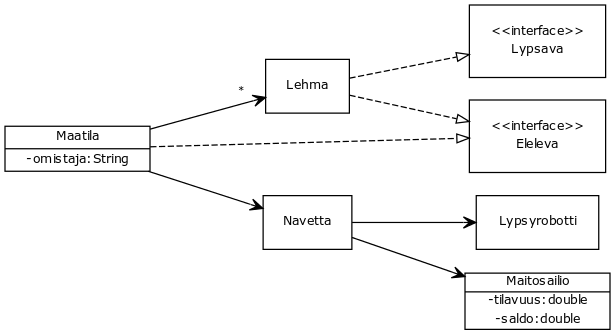

<text-box variant='learningObjectives' name='Oppimistavoitteet'>

- Kertaat ArrayListin toimintaa
- Harjoittelet testien kirjoittamista

</text-box>

Tässä osassa pääset suunnittelemaan CrowdSorcerer-työkalua käyttämällä oman ohjelmointitehtävän. Osaa kurssilaisten luomista ohjelmointitehtävistä tullaan käyttämään myöhemmillä kursseilla.
Käy kertaamassa CrowdSorcererin käyttöä kurssin <a href="https://ohjelmointi-19.mooc.fi/osa-7/4-ohjelmointitehtavien-luominen">seitsemännestä osasta</a> ennen aloittamista.

<br/>


## Suunnittele oma tehtävä: Listat

Suunnittele ohjelmointitehtävä, jonka avulla ohjelmoija voi harjoitella listojen käsittelyä (tiedon lisäämistä listalle, tiedon hakemista listalta, ...). Toteuta tehtävänanto siten, että tehtävän ratkaisijan tulee kirjoittaa yksi tai useampi luokkametodi.

Kirjoita ohjelmointitehtävälle tehtävänanto, malliratkaisu ja automaattiset testit (vähintään 3). Merkitse malliratkaisuun tulevilta ohjelmoijilta piilotettavat rivit lähdekoodinäkymän vasemmalta laidalta rukseja painamalla.

Kun kirjoitat tehtävänantoa, pyri mahdollisimman tarkkoihin ohjeisiin. Kerro ohjelmoijalle mm.
1. Minkä niminen tai minkä nimisiä metodeja tulee luoda.
2. Mitä metodin tulee palauttaa (Pyydä toteuttamaan vain metodeja, jotka palauttavat arvon)
3. Mitä parametreja metodit saavat.

Tarkastellaan seuraavaa esimerkkiä. Oletetaan, että tehtävässä tulee luoda seuraavanlainen metodi:

```java
public String listanPisin(List<String> lista) {
    if (lista.isEmpty()) {
        return null;
    }
    String pisin = lista.get(0);
    for (String merkkijono: lista) {
        if (merkkijono.length() > pisin.length()) {
            pisin = merkkijono;
        }
    }

    return pisin;
}
```

Yllä olevaa metodia odotettaessa ohjelmoijaa tulisi ohjeistaa vähintään seuraavasti: *Kirjoita metodi, jonka nimi on listanPisin. Metodi saa parametrinaan `List`-tyyppisen merkkijonoja sisältävän listan. Metodin tulee palauttaa listan pisin merkkijono. Mikäli listalla ei ole yhtäkään arvoa, tulee metodin palauttaa `null`-viite*.

Voit lisäksi antaa esimerkkikoodia tai vaikkapa esimerkkisyötteitä, joiden perusteella ohjelmaa voi testata. Tee lisäksi vähintään kolme automaattista testiä. Yllä olevaa luokkaa voisi testata esimerkiksi seuraavilla metodeilla -- alla oletetaan, että metodin sisältävästä luokasta on luotu olio, ja että olion nimi on `tehtavaOlio`:

```java
@Test
public void palauttaaNullJosTyhja() {
    List<String> lista = new ArrayList<>();
    assertTrue(tehtavaOlio.listanPisin(lista) == null);
}

@Test
public void palautusOikeinYhdenArvonSisaltavastaListasta() {
    List<String> lista = new ArrayList<>();
    lista.add("Hei maailma!");

    assertEquals("Hei maailma!", tehtavaOlio.listanPisin(lista));
}
```

Tehtävien luomistehtävät vastaavat kurssin pisteytyksessä ohjelmointitehtävää.

Kirjoita tehtäväsi alla olevaan ikkunaan.

<crowdsorcerer id='28'></crowdsorcerer>


Kun olet saanut ohjelmointitehtävän luotua, aloita seuraavan hieman laajemman tehtävän toteutus.


<programming-exercise name='Maatilasimulaattori (5 osaa)' tmcname='osa10-Osa10_14.Maatilasimulaattori'>

Maatiloilla on lypsäviä eläimiä, jotka tuottavat maitoa.  Maatilat eivät itse käsittele maitoa, vaan se kuljetetaan Maitoautoilla meijereille.  Meijerit ovat yleisiä maitotuotteita tuottavia rakennuksia.  Jokainen meijeri erikoistuu yhteen tuotetyyppiin, esimerkiksi Juustomeijeri tuottaa Juustoa, Voimeijeri tuottaa voita ja Maitomeijeri tuottaa maitoa.

Rakennetaan maidon elämää kuvaava simulaattori, joskin meijerit jäävät toteutuksestamme toistaiseksi pois.

Simulaattorin lopullinen rakenne kutakuinkin noudattaa seuraavaa luokkakaaviota.





<h2>Maitosäiliö</h2>


Jotta maito pysyisi tuoreena, täytyy se säilöä sille tarkoitettuun säiliöön. Säiliöitä valmistetaan sekä oletustilavuudella 2000 litraa, että asiakkaalle räätälöidyllä tilavuudella.  Toteuta luokka Maitosailio jolla on seuraavat konstruktorit ja metodit.

- `public Maitosailio()`
- `public Maitosailio(double tilavuus)`
- `public double getTilavuus()`
- `public double getSaldo()`
- `public double paljonkoTilaaJaljella()`
- `public void lisaaSailioon(double maara)`
    lisää säiliöön vain niin paljon maitoa kuin sinne mahtuu,
    ylimääräiset jäävät lisäämättä, maitosäiliön ei siis tarvitse huolehtia tilanteesta jossa maitoa valuu yli
- `public double otaSailiosta(double maara)`
    ottaa säiliöstä pyydetyn määrän, tai niin paljon kuin siellä on jäljellä

Huomaa, että teet *kaksi konstruktoria*. Kutsuttava konstruktori määräytyy sille annettujen parametrien perusteella. Jos kutsut `new Maitosailio()`, suoritetaan ensimmäisen konstruktorin lähdekoodi. Toista konstruktoria taas kutsutaan antamalla konstruktorille parametrina tilavuus, esim. `new Maitosailio(300.0)`.

Toteuta `Maitosailio`-luokalle myös `toString()`-metodi, jolla kuvaat sen tilaa. Ilmaistessasi säiliön tilaa `toString()`-metodissa, pyöristä litramäärät ylöspäin käyttäen `Math`-luokan tarjoamaa `ceil()`-metodia.

Testaa maitosailiötä seuraavalla ohjelmapätkällä:


```java
Maitosailio sailio = new Maitosailio();
sailio.otaSailiosta(100);
sailio.lisaaSailioon(25);
sailio.otaSailiosta(5);
System.out.println(sailio);

sailio = new Maitosailio(50);
sailio.lisaaSailioon(100);
System.out.println(sailio);
```

<sample-output>
20.0/2000.0
50.0/50.0
</sample-output>


<h2>Lehmä</h2>

Saadaksemme maitoa tarvitsemme myös lehmiä. Lehmällä on nimi ja utareet. Utareiden tilavuus on satunnainen luku väliltä 15 ja 40, luokkaa `Random` voi käyttäää satunnaislukujen arpomiseen, esimerkiksi  `int luku = 15 + new Random().nextInt(26);`. Luokalla `Lehma` on seuraavat toiminnot:

- `public Lehma()` luo uuden lehmän satunnaisesti valitulla nimellä
- `public Lehma(String nimi)` luo uuden lehmän annetulla nimellä
- `public String getNimi()` palauttaa lehmän nimen
- `public double getTilavuus()` palauttaa utareiden tilavuuden
- `public double getMaara()` palauttaa utareissa olevan maidon määrän
- `public String toString()` palauttaa lehmää kuvaavan merkkijonon (ks. esimerkki alla)


`Lehma` toteuttaa myös rajapinnat: `Lypsava`, joka kuvaa lypsämiskäyttäytymistä, ja `Eleleva`, joka kuvaa elelemiskäyttäytymistä.


```java
public interface Lypsava {
    public double lypsa();
}

public interface Eleleva {
    public void eleleTunti();
}
```

Lehmää lypsettäessä sen koko maitovarasto tyhjennetään jatkokäsittelyä varten. Lehmän elellessä sen maitovarasto täyttyy hiljalleen. Suomessa maidontuotannossa käytetyt lehmät tuottavat keskimäärin noin 25-30 litraa maitoa päivässä. Simuloidaan tätä tuotantoa tuottamalla noin 0.7 - 2 litraa tunnissa.

Simuloi tuotantoa tuottamalla noin 0.7 - 2 litraa tunnissa. Random-luokan metodista `nextDouble`, joka palauttaa satunnaisluvun 0 ja 1 välillä lienee tässä hyötyä.

Lisäksi, jos lehmälle ei anneta nimeä, valitse sille nimi satunnaisesti seuraavasta taulukosta. Tässä on hyötyä Random-luokan metodista `nextInt`, jolle annetaan parametrina yläraja. Kannattaa tutustua Random-luokan toimintaan erikseen ennen kuin lisää sen osaksi tätä ohjelmaa.


```java
private static final String[] NIMIA = new String[]{
    "Anu", "Arpa", "Essi", "Heluna", "Hely",
    "Hento", "Hilke", "Hilsu", "Hymy", "Matti", "Ilme", "Ilo",
    "Jaana", "Jami", "Jatta", "Laku", "Liekki",
    "Mainikki", "Mella", "Mimmi", "Naatti",
    "Nina", "Nyytti", "Papu", "Pullukka", "Pulu",
    "Rima", "Soma", "Sylkki", "Valpu", "Virpi"};
```

Toteuta luokka Lehma ja testaa sen toimintaa seuraavan ohjelmapätkän avulla.


```java
Lehma lehma = new Lehma();
System.out.println(lehma);

Eleleva elelevaLehma = lehma;
elelevaLehma.eleleTunti();
elelevaLehma.eleleTunti();
elelevaLehma.eleleTunti();
elelevaLehma.eleleTunti();

System.out.println(lehma);

Lypsava lypsavaLehma = lehma;
lypsavaLehma.lypsa();

System.out.println(lehma);
System.out.println("");

lehma = new Lehma("Ammu");
System.out.println(lehma);
lehma.eleleTunti();
lehma.eleleTunti();
System.out.println(lehma);
lehma.lypsa();
System.out.println(lehma);
```

Ohjelman tulostus on erimerkiksi seuraavanlainen.

<sample-output>
Liekki 0.0/23.0
Liekki 7.0/23.0
Liekki 0.0/23.0
Ammu 0.0/35.0
Ammu 9.0/35.0
Ammu 0.0/35.0
</sample-output>


<h2>Lypsyrobotti</h2>


Nykyaikaisilla maatiloilla lypsyrobotit hoitavat lypsämisen. Jotta lypsyrobotti voi lypsää lypsävää otusta, tulee lypsyrobotin olla kiinnitetty maitosäiliöön:


- `public Lypsyrobotti()` luo uuden lypsyrobotin
- `public Maitosailio getMaitosailio()` palauttaa kiinnitetyn maitosäiliö tai `null`-viitteen, jos säiliötä ei ole vielä kiinnitetty
- `public void setMaitosailio(Maitosailio maitosailio)` kiinnittää annetun säiliön lypsyrobottiin
- `public void lypsa(Lypsava lypsava)` lypsää lehmän robottiin kiinnitettyyn maitosäiliöön. Jos robottiin ei ole kiinnitetty maitosäiliötä, ohjelma ilmoittaa että maito menee hukkaan.

Toteuta luokka Lypsyrobotti ja testaa sitä seuraavien ohjelmanpätkien avulla. Varmista että lypsyrobotti voi lypsää kaikkia Lypsava-rajapinnan toteuttavia olioita!

```java
Lypsyrobotti lypsyrobotti = new Lypsyrobotti();
Lehma lehma = new Lehma();
lypsyrobotti.lypsa(lehma);
```

<sample-output>

Maidot menevät hukkaan!

</sample-output>

```java
Lypsyrobotti lypsyrobotti = new Lypsyrobotti();
Lehma lehma = new Lehma();
System.out.println("");

Maitosailio sailio = new Maitosailio();
lypsyrobotti.setMaitosailio(sailio);
System.out.println("Säiliö: " + sailio);

for (int i = 0; i < 2; i++) {
    System.out.println(lehma);
    System.out.println("Elellään..");
    for (int j = 0; j < 5; j++) {
        lehma.eleleTunti();
    }
    System.out.println(lehma);

    System.out.println("Lypsetään...");
    lypsyrobotti.lypsa(lehma);
    System.out.println("Säiliö: " + sailio);
    System.out.println("");
}
```

Ohjelman tulostus on esimerkiksi seuraavanlainen.

<sample-output>

Säiliö: 0.0/2000.0
Mella 0.0/23.0
Elellään..
Mella 6.2/23.0
Lypsetään...
Säiliö: 6.2/2000.0

Mella 0.0/23.0
Elellään..
Mella 7.8/23.0
Lypsetään...
Säiliö: 14.0/2000.0

</sample-output>


<h2>Navetta</h2>


Lehmät hoidetaan (eli tässä tapauksessa lypsetään) navetassa. Alkukantaisissa navetoissa on maitosäiliö ja tilaa yhdelle lypsyrobotille. Huomaa että lypsyrobottia asennettaessa se kytketään juuri kyseisen navetan maitosäiliöön.  Jos navetassa ei ole lypsyrobottia, ei siellä voida myöskään hoitaa lehmiä. Toteuta luokka `Navetta` jolla on seuraavat konstruktorit ja metodit:


- `public Navetta(Maitosailio maitosailio)`
- `public Maitosailio getMaitosailio()` palauttaa navetan maitosailion
- `public void asennaLypsyrobotti(Lypsyrobotti lypsyrobotti)` asentaa lypsyrobotin ja kiinnittää sen navetan maitosäiliöön
- `public void hoida(Lehma lehma)` lypsää parametrina annetun lehmän lypsyrobotin avulla, metodi heittää poikkeuksen `IllegalStateException`, jos lypsyrobottia ei ole asennettu
- `public void hoida(List<Lehma> lehmat)` lypsää parametrina annetut lehmät lypsyrobotin avulla, metodi heittää poikkeuksen `IllegalStateException`, jos lypsyrobottia ei ole asennettu
- `public String toString()` palauttaa navetan sisältämän maitosäiliön tilan


Testaa luokkaa `Navetta` seuraavan ohjelmapätkän avulla.


```java
Navetta navetta = new Navetta(new Maitosailio());
System.out.println("Navetta: " + navetta);

Lypsyrobotti robo = new Lypsyrobotti();
navetta.asennaLypsyrobotti(robo);

Lehma ammu = new Lehma();
ammu.eleleTunti();
ammu.eleleTunti();

navetta.hoida(ammu);
System.out.println("Navetta: " + navetta);

List<Lehma> lehmaLista = new ArrayList<>();
lehmaLista.add(ammu);
lehmaLista.add(new Lehma());

for (Lehma lehma: lehmaLista) {
    lehma.eleleTunti();
    lehma.eleleTunti();
};

navetta.hoida(lehmaLista);
System.out.println("Navetta: " + navetta);
```

Tulostuksen tulee olla esimerkiksi seuraavanlainen:

<sample-output>
Navetta: 0.0/2000.0
Navetta: 2.8/2000.0
Navetta: 9.6/2000.0
</sample-output>


<h2>Maatila</h2>

Maatilalla on omistaja ja siihen kuuluu navetta sekä joukko lehmiä. Maatila toteuttaa myös aiemmin nähdyn rajapinnan `Eleleva`, jonka metodia `eleleTunti()`-kutsumalla kaikki maatilaan liittyvät lehmät elelevät tunnin.  Toteuta luokka maatila siten, että se toimii seuraavien esimerkkiohjelmien mukaisesti.

```java
Maitosailio sailio = new Maitosailio();
Navetta navetta = new Navetta(sailio);

Maatila maatila = new Maatila("Esko", navetta);
System.out.println(maatila);

System.out.println(maatila.getOmistaja() + " on ahkera mies!");
```

Odotettu tulostus:

<sample-output>
Maatilan omistaja: Esko
Navetan maitosäiliö: 0.0/2000.0
Ei lehmiä.
Esko on ahkera mies!
</sample-output>

```java
Maatila maatila = new Maatila("Esko", new Navetta(new Maitosailio()));
maatila.lisaaLehma(new Lehma());
maatila.lisaaLehma(new Lehma());
maatila.lisaaLehma(new Lehma());
System.out.println(maatila);
```

Odotettu tulostus:

<sample-output>
Maatilan omistaja: Esko
Navetan maitosäiliö: 0.0/2000.0
Lehmät:
    Naatti 0.0/19.0
    Hilke 0.0/30.0
    Sylkki 0.0/29.0
</sample-output>

```java
Maatila maatila = new Maatila("Esko", new Navetta(new Maitosailio()));

maatila.lisaaLehma(new Lehma());
maatila.lisaaLehma(new Lehma());
maatila.lisaaLehma(new Lehma());

maatila.eleleTunti();
maatila.eleleTunti();

System.out.println(maatila);
```


Odotettu tulostus:


<sample-output>
Maatilan omistaja: Esko
Navetan maitosäiliö: 0.0/2000.0
Lehmät:
    Heluna 2.0/17.0
    Rima 3.0/32.0
    Ilo 3.0/25.0
</sample-output>

```java
Maatila maatila = new Maatila("Esko", new Navetta(new Maitosailio()));
Lypsyrobotti robo = new Lypsyrobotti();
maatila.asennaNavettaanLypsyrobotti(robo);

maatila.lisaaLehma(new Lehma());
maatila.lisaaLehma(new Lehma());
maatila.lisaaLehma(new Lehma());

maatila.eleleTunti();
maatila.eleleTunti();

maatila.hoidaLehmat();

System.out.println(maatila);
```

Odotettu tulostus:

<sample-output>
Maatilan omistaja: Esko
Navetan maitosäiliö: 18.0/2000.0
Lehmät:
    Hilke 0.0/30.0
    Sylkki 0.0/35.0
    Hento 0.0/34.0
</sample-output>


Edellä otettiin ensiaskeleet simulaattorin tekemiseen. Ohjelmaa voisi jatkaa vaikkapa lisäämällä maitoauton sekä luomalla useampia navettoja. Maitoautot voisivat kulkea tehtaalle, jossa tehtäisiin juustoa, jnejne..

</programming-exercise>
