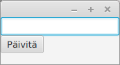
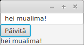
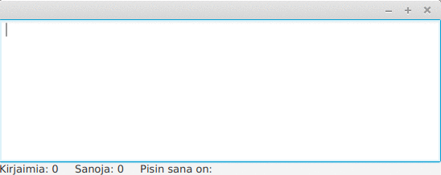

<text-box variant='hint' name='Kahdennentoista osan tavoitteet'>

  
    Tutustut graafisten käyttöliittymien ohjelmointiin. Tunnet muutamia käyttöliittymäkomponentteja, käyttöliittymäkomponenttien asettelun mekanismeja, sekä osaat käsitellä käyttöliittymän tapahtumia. Osaat tehdä käyttöliittymiä, jotka sisältävät useamman näkymän.
  

<% end %>


# 
  Graafiset käyttöliittymät
<% end %>

<text-box variant='learningObjectives' name='Oppimistavoitteet'>

  
    - 
      Tiedät mistä käyttöliittymät koostuvat ja osaat käynnistää graafisen käyttöliittymän.
    
    - 
      Tunnet muutamia käyttöliittymäkomponentteja ja osaat lisätä niitä käyttöliittymään.
    
    - 
      Tunnet menetelmiä käyttöliittymäkomponenttien asetteluun.
    
    - 
      Tunnet käsitteen tapahtumankäsittelijä ja osaat käsitellä käyttöliittymän tapahtumia. 
    
    - 
      Tunnet menetelmiä sovelluslogiikan ja käyttöliittymälogiikan eriyttämiseen.
    
  

<% end %>


  Tutustutaan seuraavaksi graafisten käyttöliittymien luomiseen. Graafisia käyttöliittymiä luodessa hyödynnämme ensisijaisesti käyttöliittymäkirjastoja, jotka tarjoavat valmiita komponentteja kuten nappeja ja tekstikenttiä. Käyttöliittymäkirjastot hoitavat komponenttien piirtämisen puolestamme, eli meidän ei tarvitse piirtää jokaista käyttöliittymässä olevaa komponenttia ohjelmassamme -- riittää, että komponentit lisätään ohjelmaan.


  Siinä missä tekstikäyttöliittymissä toiminnallisuus kytketään tietyn muotoiseen syötteeseen, graafisissa käyttöliittymissä toiminnallisuus lisätään käyttöliittymäkomponentteihin. Ohjelmoija esimerkiksi lisää käyttöliittymässä olevaan nappiin metodin, joka käsittelee napin painallukseen liittyvän tapahtuman.


  Käytämme graafisten käyttöliittymien luomiseen Javan <a href="https://en.wikipedia.org/wiki/JavaFX" target="_blank" rel="noopener">JavaFX</a> käyttöliittymäkirjastoa. Toteuttamamme sovellukset ovat työpöytäsovelluksia.


<text-box variant='hint' name='Graafiset käyttöliittymät ja tarvittavat kirjastot'>

  
    Graafisten käyttöliittymien luomiseen käytetään JavaFX-nimistä kirjastoa. Linux-koneilla joudut -- riippuen Javan asennuksesta -- asentamaan myös openjfx-kirjaston. Tämän asentaminen onnistuu Ubuntussa (komentoriviltä) komennolla:
  

  <pre>
  sudo apt-get install openjfx
  </pre>

  
    Tehtäväpohjissa käytetään JavaFx-ohjelmien testaamiseen <a href="https://github.com/TestFX/TestFX/wiki" target="_blank" norel>TestFX</a>-nimistä apukirjastoa. Kirjasto tulee tehtäväpohjien mukana.
  

<% end %>


  Yksinkertaisen ikkunan luominen onnistuu JavaFX:n avulla seuraavanlaisella ohjelmalla.


```java
package sovellus;

import javafx.application.Application;
import javafx.stage.Stage;

public class JavaFxSovellus extends Application {

    @Override
    public void start(Stage ikkuna) {
        ikkuna.setTitle("Hei Maailma!");
        ikkuna.show();
    }

    public static void main(String[] args) {
        launch(JavaFxSovellus.class);
    }
}
<% end %>


  Kun ohjelman käynnistää, sovellus näyttää seuraavalta.


&nbsp;


  Mitä ohjelmassa oikein tapahtuu? Luokkamme JavaFxSovellus perii JavaFx-käyttöliittymäkirjaston luokan <a href="https://docs.oracle.com/javase/8/javafx/api/javafx/application/Application.html" target="_blank" rel="noopener">Application</a>, joka tarjoaa rungon graafisten käyttöliittymien luomiseen. Sovellus käynnistetään Application-luokalta perittävällä metodilla <a href="https://docs.oracle.com/javase/8/javafx/api/javafx/application/Application.html#launch-java.lang.Class-java.lang.String...--" target="_blank" rel="noopener">launch</a>, jolle annetaan parametrina käynnistettävän luokan nimi muodossa <em>LuokanNimi.class</em> -- yllä luokan nimi on JavaFxSovellus, joten metodille launch annetaan parametrina `JavaFxSovellus.class`.


  Kun metodia launch kutsutaan, Application-luokassa sijaitseva metodi luo parametrina annetusta luokasta (tässä JavaFxSovellus) uuden olion ja kutsuu sen init-metodia. Metodi init on määritelty luokassa Application, ja sitä käytetään esimerkiksi ohjelmassa käytettävien olioiden alustamiseen. Metodin init kutsumisen jälkeen ohjelma kutsuu metodia start, joka saa parametrinaan ikkunaa kuvaavan <a href="https://docs.oracle.com/javase/8/javafx/api/javafx/stage/Stage.html" target="_blank" rel="noopener">Stage</a>-olion. Yllä tehdyssä start-metodin toteutuksessa parametrina saadulle Stage-tyyppiselle ikkunaoliolle asetetaan otsikko metodilla setTitle, jonka jälkeen kutsutaan ikkunan näyttämiseen johtavaa metodia show. Lopulta ohjelma jää kuuntelemaan käyttöliittymässä tapahtuvia tapahtumia kuten ikkunan sulkemista, joka johtaa sovelluksen sammumiseen.


<programming-exercise name='Sovellukseni', model_solution: '54366'>

  
    Luo tehtäväpohjassa olevaan luokkaan graafinen käyttöliittymä, jonka otsikkona on "Sovellukseni". Sovelluksen tulee käynnistyä kun main-metodi suoritetaan.
  

<% end %>

## 
  Käyttöliittymän rakenne
<% end %>


  Graafiset käyttöliittymät koostuvat oleellisesti kolmesta osasta. Stage-olio toimii ohjelman ikkunana. Stage-oliolle asetetaan <a href="https://docs.oracle.com/javase/8/javafx/api/javafx/scene/Scene.html" target="_blank" rel="noopener">Scene</a>-olio, joka kuvastaa ikkunassa olevaa näkymää. Scene-olio taas sisältää näkymään liittyvien komponenttien asettelusta vastaavan olion (esim. FlowPane), joka taas sisältää konkreettiset käyttöliittymäkomponentit.


  Alla oleva ohjelma luo käyttöliittymän, jossa on yksittäinen nappi.


```java
package sovellus;

import javafx.application.Application;
import javafx.scene.Scene;
import javafx.scene.control.Button;
import javafx.scene.layout.FlowPane;
import javafx.stage.Stage;

public class JavaFxSovellus extends Application {

    @Override
    public void start(Stage ikkuna) {
        Button nappi = new Button("Tämä on nappi");

        FlowPane komponenttiryhma = new FlowPane();
        komponenttiryhma.getChildren().add(nappi);

        Scene nakyma = new Scene(komponenttiryhma);

        ikkuna.setScene(nakyma);
        ikkuna.show();
    }

    public static void main(String[] args) {
        launch(JavaFxSovellus.class);
    }
}
<% end %>


  Sovellus näyttää seuraavalta.


  &nbsp;


  Käyttöliittymäkomponentit lisätään niiden asettelusta vastaavan olion -- edellä FlowPane -- "lapsiksi". Tämä liittyy JavaFx:n suunnittelussa tehtyyn päätökseen, missä jokainen käyttöliittymäkomponenttien asetteluun käytettävä olio voi sisältää muita käyttöliittymäkomponenttien asetteluun käytettäviä olioita sekä käyttöliittymäkomponentteja. Tämä mahdollistaa graafiset käyttöliittymät, joissa käyttöliittymäkomponenttien asettelutapa riippuu niiden paikasta käyttöliittymässä. Esimerkiksi käyttöliittymässä ylhäällä olevan valikon vaihtoehdot asetetaan yleensä vierekkäin, kun taas listattavat asiat allekkain.


  Käyttöliittymän rakenne on siis lyhyesti seuraava. Ikkuna sisältää Scene-olion. Scene-olio sisältää käyttöliittymäkomponenttien asettelusta vastaavan olion. Käyttöliittymäkomponenttien asettelusta vastaava olio voi sisältää sekä käyttöliitymäkomponentteja, että käyttöliittymäkomponenttien asettelusta vastaavia olioita.


<!--
  TODO: kuva


stage
 |
scene
 |
käyttöliittymäkomponenttien asettelusta vastaava olio
 |        |
kälivast kälikomp kälikomp
 |
kälikomp
   -->


## 
  Käyttöliittymäkomponentit
<% end %>


  Graafisia käyttöliittymiä luodessa ohjelmoijat tyypillisesti hyödyntävät valmiiden käyttöliittymäkirjastojen tarjoamia osia sovellusten laatimiseen. Ohjelmoijan ei esimerkiksi kannata toteuttaa käyttöliittymän nappia tyhjästä (eli luoda luokkaa, joka piirtää napin sekä mahdollistaa siihen liittyvien toiminnallisuuksien käsittelyn), sillä vastaava komponentti löytyy yleensä käyttöliittymäkirjastoista valmiina. Tutustutaan seuraavaksi muutamaan käyttöliittymäkomponenttiin.


  Tekstin näyttäminen tapahtuu <a href="https://docs.oracle.com/javase/8/javafx/api/javafx/scene/control/Label.html" target="_blank" rel="noopener">Label</a>`-luokan avulla. Label tarjoaa käyttöliittymäkomponentin, jolle voi asettaa tekstiä ja jonka sisältämää tekstiä voi muokata metodien avulla. Näytettävä teksti asetetaan joko konstruktorissa tai erillisellä `setText`-metodilla.


```java
package sovellus;

import javafx.application.Application;
import javafx.scene.Scene;
import javafx.scene.control.Label;
import javafx.scene.layout.FlowPane;
import javafx.stage.Stage;

public class JavaFxSovellus extends Application {

    @Override
    public void start(Stage ikkuna) {
        Label tekstikomponentti = new Label("Tekstielementti");

        FlowPane komponenttiryhma = new FlowPane();
        komponenttiryhma.getChildren().add(tekstikomponentti);

        Scene nakyma = new Scene(komponenttiryhma);

        ikkuna.setScene(nakyma);
        ikkuna.show();
    }

    public static void main(String[] args) {
        launch(JavaFxSovellus.class);
    }
}
<% end %>


  &nbsp;


  Käyttöliittymään saa painikkeita <a href="https://docs.oracle.com/javase/8/javafx/api/javafx/scene/control/Button.html" target="_blank" rel="noopener">Button</a>-luokan avulla. Napin lisääminen käyttöliittymään tapahtuu aivan kuten tekstikomponentin lisääminen.


```java
package sovellus;

import javafx.application.Application;
import javafx.scene.Scene;
import javafx.scene.control.Button;
import javafx.scene.layout.FlowPane;
import javafx.stage.Stage;

public class JavaFxSovellus extends Application {

    @Override
    public void start(Stage ikkuna) {
        Button nappikomponentti = new Button("Tämä on nappi");

        FlowPane komponenttiryhma = new FlowPane();
        komponenttiryhma.getChildren().add(nappikomponentti);

        Scene nakyma = new Scene(komponenttiryhma);

        ikkuna.setScene(nakyma);
        ikkuna.show();
    }

    public static void main(String[] args) {
        launch(JavaFxSovellus.class);
    }
}
<% end %>


&nbsp;


  Sovellukseen voi lisätä myös useampia käyttöliittymäelementtejä samaan aikaan. Alla käytössä on sekä nappi että tekstikomponentti.


```java
package sovellus;

import javafx.application.Application;
import javafx.scene.Scene;
import javafx.scene.control.Button;
import javafx.scene.control.Label;
import javafx.scene.layout.FlowPane;
import javafx.stage.Stage;

public class JavaFxSovellus extends Application {

    @Override
    public void start(Stage ikkuna) {
        Button nappikomponentti = new Button("Tämä on nappi");
        Label tekstikomponentti = new Label("Tekstielementti");

        FlowPane komponenttiryhma = new FlowPane();
        komponenttiryhma.getChildren().add(nappikomponentti);
        komponenttiryhma.getChildren().add(tekstikomponentti);

        Scene nakyma = new Scene(komponenttiryhma);

        ikkuna.setScene(nakyma);
        ikkuna.show();
    }

    public static void main(String[] args) {
        launch(JavaFxSovellus.class);
    }
}
<% end %>


  Sovellus näyttää seuraavalta.


  &nbsp;


  Osoitteessa <a href="https://docs.oracle.com/javase/8/javafx/user-interface-tutorial/" target="_blank" rel="noopener">https://docs.oracle.com/javase/8/javafx/user-interface-tutorial/</a> on listattuna joukko valmiita käyttöliittymäkomponentteja. Sivu tarjoaa myös esimerkkejä käyttöliittymäkomponenttien käytöstä.


  Käyttöliittymäkomponentteja on huomattava määrä. Niiden opiskeluun kannattaa käyttää verkossa olevia valmiita oppaita kuten edellä mainittua osoitetta <a href="https://docs.oracle.com/javase/8/javafx/user-interface-tutorial/" target="_blank" rel="noopener">https://docs.oracle.com/javase/8/javafx/user-interface-tutorial/</a>. Käyttöliittymäkomponentteja kannattaa kokeilla aluksi erikseen siten, että kokeilee yhden komponentin lisäämistä ja tarkastelee sen toimintaa.


  Kun yksittäiset komponentit tulevat tutuksi, on niiden käyttäminen suoraviivaisempaa. Lähes kaikille komponenteille yhteistä on se, miten ne lisätään sovellukseen. Kun osaat lisätä yhden komponentin käyttöliittymään, osaat lisätä käytännössä lähes kaikki komponentit käyttöliittymään.


  Ainoa merkittävä ero käyttöliittymäkomponenttien lisäämisessä liittyy siihen, että mihin kohtaan käyttöliittymää komponentin haluaa lisätä. Tarkastellaan käyttöliittymäkomponenttien asettelua kohta.


<programming-exercise name='Nappi ja tekstielementti', model_solution: '54628'>

  
    Luo edellistä esimerkkiä seuraten tehtäväpohjassa olevaan luokkaan käyttöliittymä, jossa on nappi (Button) ja tekstikomponentti (Label). Napin tulee olla tekstikomponentin vasemmalla puolella tai yläpuolella.
  

<% end %>

<programming-exercise name='Nappi ja tekstikenttä', model_solution: '54629'>

  
    Luo tehtäväpohjassa olevaan luokkaan graafinen käyttöliittymä, jossa on nappi ja tekstikenttä. Tekstikentän saa toteutettua luokalla <a href="https://docs.oracle.com/javase/8/javafx/api/javafx/scene/control/TextField.html" target="_blank" rel="noopener">TextField</a>. Napin tulee olla tekstikentän vasemmalla puolella tai yläpuolella.
  

<% end %>


## 
  Käyttöliittymäkomponenttien asettelu
<% end %>


  Jokaisella käyttöliittymäkomponentilla on käyttöliittymässä sijainti. Komponentin sijainnin määrää käytössä oleva käyttöliittymäkomponenttien asetteluun käytettävä luokka.


  Edellisissä esimerkeissä käytimme käyttöliittymäkomponenttien asetteluun <a href="https://docs.oracle.com/javase/8/javafx/api/javafx/scene/layout/FlowPane.html" target="_blank" rel="noopener">FlowPane</a>-nimistä luokkaa. FlowPanen avulla käyttöliittymään lisättävät komponentit tulevat vierekkäin. Jos ikkunan koko pienenee siten, että kaikki komponentit eivät mahdu vierekkäin, rivitetään komponentit automaattisesti. Alla olevassa kuvassa edellisen esimerkin tuottamaa sovellusta on kavennettu, jolloin komponentit ovat rivittyneet automaattisesti.


&nbsp;


### 
  BorderPane
<% end %>


  <a href="https://docs.oracle.com/javase/8/javafx/api/javafx/scene/layout/BorderPane.html" target="_blank" norel>BorderPane</a>-luokan avulla käyttöliittymäkomponentit voidaan asetella viiteen pääkohtaan käyttöliittymässä: ylälaita, oikea laita, alalaita, vasen laita ja keskikohta. Perinteiset sovellukset, kuten käyttämäsi web-selain hyödyntävät tätä asettelua. Ylälaidassa on valikko sekä osoiterivi, ja keskellä on sivun sisältö.


```java
package sovellus;

import javafx.application.Application;
import javafx.scene.Scene;
import javafx.scene.control.Label;
import javafx.scene.layout.BorderPane;
import javafx.stage.Stage;

public class JavaFxSovellus extends Application {

    @Override
    public void start(Stage ikkuna) {
        BorderPane asettelu = new BorderPane();
        asettelu.setTop(new Label("ylälaita"));
        asettelu.setRight(new Label("oikea laita"));
        asettelu.setBottom(new Label("alalaita"));
        asettelu.setLeft(new Label("vasen laita"));
        asettelu.setCenter(new Label("keskikohta"));

        Scene nakyma = new Scene(asettelu);

        ikkuna.setScene(nakyma);
        ikkuna.show();
    }

    public static void main(String[] args) {
        launch(JavaFxSovellus.class);
    }
}
<% end %>


  &nbsp;


<programming-exercise name='BorderPane', model_solution: '54630'>


  
    Luo tehtäväpohjassa olevaan luokkaan graafinen käyttöliittymä, joka käyttää BorderPane-luokkaa käyttöliittymäkomponenttien asetteluun. Lisää ylälaitaan tekstikomponentti, jossa on teksti "NORTH", oikeaan laitaan tekstikomponentti, jossa on teksti "EAST", ja alalaitaan tekstikomponentti, jossa on teksti "SOUTH".
  

<% end %>


### 
  HBox
<% end %>


  <a href="https://docs.oracle.com/javase/8/javafx/api/javafx/scene/layout/HBox.html" target="_blank" norel>HBox</a>-luokan avulla käyttöliittymäkomponentit asetellaan riviin.


```java
@Override
public void start(Stage ikkuna) {
    HBox asettelu = new HBox();

    asettelu.getChildren().add(new Label("eka"));
    asettelu.getChildren().add(new Label("toka"));
    asettelu.getChildren().add(new Label("kolmas"));

    Scene nakyma = new Scene(asettelu);

    ikkuna.setScene(nakyma);
    ikkuna.show();
}
<% end %>


  &nbsp;


  Kuten edellisestä esimerkistä huomaa, HBox asettaa käyttöliittymäkomponentit oletuksena täysin toisiinsa kiinni. Metodin setSpacing avulla käyttöliittymäkomponenttien väliin saa tyhjää.


```java
@Override
public void start(Stage ikkuna) {
    HBox asettelu = new HBox();
    asettelu.setSpacing(10);

    asettelu.getChildren().add(new Label("eka"));
    asettelu.getChildren().add(new Label("toka"));
    asettelu.getChildren().add(new Label("kolmas"));

    Scene nakyma = new Scene(asettelu);

    ikkuna.setScene(nakyma);
    ikkuna.show();
}
<% end %>


  &nbsp;


  Luokka <a href="https://docs.oracle.com/javase/8/javafx/api/javafx/scene/layout/VBox.html" target="_blank">VBox</a> toimii vastaavasti, mutta asettelee käyttöliittymäkomponentit allekkain.


  &nbsp;


### 
  GridPane
<% end %>


  <a href="https://docs.oracle.com/javafx/2/api/javafx/scene/layout/GridPane.html" target="_blank" rel="noopener">GridPane</a>-luokan avulla käyttöliittymäkomponentit asetellaan ruudukkoon. Alla olevassa esimerkissä luodaan 3x3-kokoinen ruudukko, jossa jokaisessa ruudussa on nappi.


```java
@Override
public void start(Stage ikkuna) {
    GridPane asettelu = new GridPane();

    for (int x = 1; x <= 3; x++) {
        for (int y = 1; y <= 3; y++) {
            asettelu.add(new Button("" + x + ", " + y), x, y);
        }
    }

    Scene nakyma = new Scene(asettelu);

    ikkuna.setScene(nakyma);
    ikkuna.show();
}
<% end %>


  &nbsp;


### 
  Useampi asettelija samassa
<% end %>


  Käyttöliittymäkomponenttien asettelijoita voi myös yhdistellä. Tyypillinen ratkaisu on BorderPane-asettelun käyttäminen pohjalla, jonka sisälle asetetaan muita asetteluja. Alla olevassa esimerkissä BorderPanen ylälaidassa on samalle riville asetteluun käytetty HBox ja vasemmassa laidassa allekkain asetteluun käytetty VBox. Keskelle on laitettu tekstikenttä.


```java
package sovellus;

import javafx.application.Application;
import javafx.scene.Scene;
import javafx.scene.control.Button;
import javafx.scene.control.Label;
import javafx.scene.control.TextArea;
import javafx.scene.layout.BorderPane;
import javafx.scene.layout.HBox;
import javafx.scene.layout.VBox;
import javafx.stage.Stage;

public class JavaFxSovellus extends Application {

    @Override
    public void start(Stage ikkuna) {
	BorderPane asettelu = new BorderPane();

	HBox napit = new HBox();
	napit.setSpacing(10);
	napit.getChildren().add(new Button("Eka"));
	napit.getChildren().add(new Button("Toka"));
	napit.getChildren().add(new Button("Kolmas"));

	VBox tekstit = new VBox();
	tekstit.setSpacing(10);
	tekstit.getChildren().add(new Label("Eka"));
	tekstit.getChildren().add(new Label("Toka"));
	tekstit.getChildren().add(new Label("Kolmas"));

	asettelu.setTop(napit);
	asettelu.setLeft(tekstit);

	asettelu.setCenter(new TextArea(""));

	Scene nakyma = new Scene(asettelu);

	ikkuna.setScene(nakyma);
	ikkuna.show();
    }

    public static void main(String[] args) {
	launch(JavaFxSovellus.class);
    }
}
<% end %>


  &nbsp;


<programming-exercise name='Tekstitilastointia', model_solution: '54631'>

  
    Luo tehtäväpohjassa olevaan luokkaan sovellus, joka käyttää BorderPane-luokkaa asetteluun. Keskellä tulee olla TextArea-luokasta luotu tekstikenttä, ja alalaidassa kolme tekstikomponenttia. Aseta alalaidan tekstikomponentit HBox-olion sisään. Ensimmäisessä tekstikomponentissa tulee olla teksti "Kirjaimia: 0". Toisessa tekstikomponentissa tulee olla teksti "Sanoja: 0". Kolmannessa tekstikomponentissa tulee olla teksti "Pisin sana on:".
  

<% end %>


## 
  Tapahtumien käsittely
<% end %>


  Edellä toteuttamamme käyttöliittymät eivät reagoi käyttöliittymässä tehtyihin tapahtumiin. Reagoimattomuus ei johdu käyttöliittymäkomponenteista, vaan siitä että emme ole lisänneet käyttöliittymäkomponentteihin tapahtumien käsittelyyn tarvittavaa toiminnallisuutta.


  Nappien painaminen käsitellään <a href="https://docs.oracle.com/javase/8/javafx/api/javafx/event/EventHandler.html" target="_blank" rel="noopener">EventHandler</a>-rajapinnan toteuttavalla luokalla. Tapahtuman tyyppi on tällöin <a href="https://docs.oracle.com/javase/8/javafx/api/javafx/event/ActionEvent.html" target="_blank" rel="noopener">ActionEvent</a>. Rajapinnan toteutukseen määritellään <em>mitä tehdään</em> silloin, kun käyttäjä painaa nappia.


```java
Button nappi = new Button("Tämä on nappi");
nappi.setOnAction(new EventHandler&lt;ActionEvent&gt;() {
    @Override
    public void handle(ActionEvent event) {
        System.out.println("Painettu!");
    }
});
<% end %>


  Rajapinnan eksplisiittisen toteutuksen voi korvata halutessaan Lambda-lausekkeella.


```java
Button nappi = new Button("Tämä on nappi");
nappi.setOnAction((event) -&gt; {
    System.out.println("Painettu!");
});
<% end %>


  Kun edellä olevaa nappi painetaan, konsoliin tulostetaan teksti "Painettu!".


  Käyttöliittymäkomponentteihin liitetyt <strong>tapahtumankäsittelijät</strong> kuten edellä käytetty EventHandler liittyvät aina tiettyihin käyttöliittymäkomponentteihin. Aina kun käyttöliittymäkomponentille tehdään toiminto, esimerkiksi napille napin painaminen, jokaista kyseiseen käyttöliittymäkomponenttiin liitettyä tapahtumankäsittelijää kutsutaan, ja niihin liittyvä ohjelmakoodi suoritetaan.


  Haluamme usein että tapahtumankäsittelijä muokkaa jonkun olion tilaa. Päästäksemme olioon käsiksi, tulee tapahtumankäsittelijällä olla viite käsiteltävään olioon. Pohditaan seuraavaa käyttöliittymää jossa on kaksi tekstikenttää sekä nappi.


```java
@Override
public void start(Stage ikkuna) {
    TextField vasenTeksti = new TextField();
    TextField oikeaTeksti = new TextField();
    Button nappi = new Button("Kopioi");

    HBox komponenttiryhma = new HBox();
    komponenttiryhma.setSpacing(20);
    komponenttiryhma.getChildren().addAll(vasenTeksti, nappi, oikeaTeksti);

    Scene nakyma = new Scene(komponenttiryhma);

    ikkuna.setScene(nakyma);
    ikkuna.show();
}
<% end %>


  Käyttöliittymän vasemmassa ja oikeassa laidassa on tekstikenttä. Tekstikenttien lisäksi käyttöliittymän keskellä on nappi, jossa on teksti "Kopioi".


&nbsp;


  Haluamme ohjelman, missä vasemman tekstikentän sisältö kopioituu oikean kentän sisällöksi kun käyttäjä painaa nappia. Tämä onnistuu EventHandler-rajapinnan toteuttavan olion avulla. 


```java
@Override
public void start(Stage ikkuna) {
    TextField vasenTeksti = new TextField();
    TextField oikeaTeksti = new TextField();
    Button nappi = new Button("Kopioi");

    nappi.setOnAction((event) -&gt; {
        oikeaTeksti.setText(vasenTeksti.getText());
    });

    HBox komponenttiryhma = new HBox();
    komponenttiryhma.setSpacing(20);
    komponenttiryhma.getChildren().addAll(vasenTeksti, nappi, oikeaTeksti);

    Scene nakyma = new Scene(komponenttiryhma);

    ikkuna.setScene(nakyma);
    ikkuna.show();
}
<% end %>


  Nyt nappia painettaessa vasemman tekstikentän sisältö kopioituu oikealla olevaan tekstikenttään.


  &nbsp;


  Huom! Toteutettava metodi pystyy käyttämään metodin edellä määriteltyjä olioita, mikäli käytettävien olioiden arvoa ei aseteta ohjelmassa uudestaan yhtäsuuruusmerkillä (eli viitteet eivät muutu).


<programming-exercise name='Ilmoitin', model_solution: '54632'>

  
    Toteuta tehtäväpohjassa olevaan luokkaan käyttöliittymä, jossa on kolme käyttöliittymäkomponenttia. Ylin komponentti on tekstikenttä (TextField), keskimmäinen komponentti nappi (Button), ja alin komponentti tekstikomponentti (Label). Asettele komponentit VBox-luokan avulla. Käyttöliittymän tulee näyttää (esimerkiksi) seuraavalta.
  

  

  &nbsp;

  
    Lisää tämän jälkeen sovellukseen toiminnallisuus, missä napin painaminen johtaa siihen, että tekstikentän teksti kopioituu tekstikomponentin arvoksi. Alla olevassa esimerkissä tekstikenttään on kirjoitettu teksti "hei mualima!", jonka jälkeen nappia on painettu.
  

  

  &nbsp;

<% end %>


  Käytettävä tapahtumankäsittelijä riippuu käyttöliittymäkomponentista, johon tapahtumankäsittelijä kytketään. Jos haluaisimme seurata tekstikenttään tapahtuvia muutoksia merkki merkiltä, käyttäisimme rajapintaa <a href="https://docs.oracle.com/javafx/2/api/javafx/beans/value/ChangeListener.html" target="_blank" rel="noopener">ChangeListener</a>.  Alla olevassa esimerkissä vasempaan tekstikenttään on kytketty rajapinnan ChangeListener toteuttava olio, joka sekä tulostaa muutokset tekstikonsoliin että asettaa aina uuden arvon oikealla olevaan tekstikenttään.


```java
vasenTeksti.textProperty().addListener(new ChangeListener&lt;String&gt;() {
    @Override
    public void changed(ObservableValue&lt;? extends String&gt; muutos,
            String vanhaArvo, String uusiArvo) {

        System.out.println(vanhaArvo + " -&gt; " + uusiArvo);
        oikeaTeksti.setText(uusiArvo);
    }
});
<% end %>


  Edellä muutoksia havainnoidaan tekstikenttään liittyvästä tekstistä. Koska teksti on merkkijonomuotoista, on muutoksia käsittelevälle rajapinnalle annettu tyypiksi merkkijono. Kuten edellä, myös tässäkin esimerkissä ohjelmakoodi voidaan esittää lyhyemmässä muodossa.


```java
vasenTeksti.textProperty().addListener((muutos, vanhaArvo, uusiArvo) -&gt; {
    System.out.println(vanhaArvo + " -&gt; " + uusiArvo);
    oikeaTeksti.setText(uusiArvo);
});
<% end %>


  Ohjelma voi tehdä myös tilastointia. Edellisessä tehtävässä luotujen tekstikenttien arvot saa laskettua melko suoraviivaisesti. Alla olevaa esimerkkiä noudattaen arvot päivittyisivät aina kun käyttäjä muuttaa tekstikentän sisältöä.


```java
vasenTeksti.textProperty().addListener((muutos, vanhaArvo, uusiArvo) -&gt; {
    int merkkeja = uusiArvo.length();
    String[] palat = uusiArvo.split(" ");
    int sanoja = palat.length;
    String pisin = Arrays.stream(palat)
        .sorted((s1, s2) -&gt; s2.length() - s1.length())
        .findFirst()
        .get();

    // asetetaan arvot tekstielementteihin
});
<% end %>


<programming-exercise name='Tekstitilastointia, osa II', model_solution: '54633'>

  
    Kopioi tehtävässä Tekstitilastointia tekemäsi toteutus tehtäväpohjassa olevaan luokkaan ja liitä mukaan yllä olevassa esimerkissä oleva toiminnallisuus tilastojen laskemiseen. Lopputuloksena ohjelman pitäisi laskea kirjoitetusta tekstistä tilastoja, jotka päivittyvät automaattisesti sovellukseen.
  

  

<% end %>


## 
  Sovelluslogiikan ja käyttöliittymälogiikan eriyttäminen
<% end %>


  Sovelluslogiikan (esimerkiksi ristinollan rivien tarkastamiseen tai vuorojen ylläpitoon liittyvä toiminnallisuus) ja käyttöliittymän pitäminen samassa luokassa tai samoissa luokissa on yleisesti ottaen huono asia. Se vaikeuttaa ohjelman testaamista ja muokkaamista huomattavasti ja tekee lähdekoodista myös vaikeammin luettavaa. Motto "Jokaisella luokalla pitäisi olla vain yksi selkeä vastuu" pätee hyvin tässäkin.


  Tarkastellaan sovelluslogiikan erottamista käyttöliittymälogiikasta. Oletetaan, että käytössämme on seuraavan rajapinnan toteuttava olio ja haluamme toteuttaa käyttöliittymän henkilöiden tallentamiseen.


```java
public interface Henkilovarasto {
    void talleta(Henkilo henkilo);
    Henkilo hae(String henkilotunnus);

    void poista(Henkilo henkilo);
    void poista(String henkilotunnus);
    void poistaKaikki();

    Collection&lt;Henkilo&gt; haeKaikki();
}
<% end %>


  Käyttöliittymää toteutettaessa hyvä aloitustapa on ensin käyttöliittymän piirtäminen, jota seuraa sopivien käyttöliittymäkomponenttien lisääminen käyttöliittymään. Henkilöiden tallennuksessa tarvitsemme kentät nimelle ja henkilötunnukselle sekä napin jolla henkilö voidaan lisätä. Käytetään luokkaa TextField nimen ja henkilötunnuksen syöttämiseen ja luokkaa Button napin toteuttamiseen. Luodaan käyttöliittymään lisäksi käyttöliittymän toiminnallisuutta selventävät Label-tyyppiset selitystekstit.


  Käytetään käyttöliittymän asetteluun `GridPane`-asettelijaa. Rivejä käyttöliittymässä on 3, sarakkeita 2. Lisätään tapahtumien käsittelytoiminnallisuus myöhemmin. Käyttöliittymän alustusmetodi näyttää seuraavalta.


```java
@Override
public void start(Stage ikkuna) {

    Label nimiTeksti = new Label("Nimi: ");
    TextField nimiKentta = new TextField();
    Label hetuTeksti = new Label("Hetu: ");
    TextField hetuKentta = new TextField();

    Button lisaaNappi = new Button("Lisää henkilö!");

    GridPane komponenttiryhma = new GridPane();
    komponenttiryhma.add(nimiTeksti, 0, 0);
    komponenttiryhma.add(nimiKentta, 1, 0);
    komponenttiryhma.add(hetuTeksti, 0, 1);
    komponenttiryhma.add(hetuKentta, 1, 1);
    komponenttiryhma.add(lisaaNappi, 1, 2);

    // tyylittelyä: lisätään tyhjää tilaa reunoille ym
    komponenttiryhma.setHgap(10);
    komponenttiryhma.setVgap(10);
    komponenttiryhma.setPadding(new Insets(10, 10, 10, 10));

    Scene nakyma = new Scene(komponenttiryhma);

    ikkuna.setScene(nakyma);
    ikkuna.show();
}
<% end %>


  &nbsp;


  Luodaan seuraavaksi ohjelmaan ActionEvent-rajapinnan toteuttava olio, joka lisää kenttien arvot Henkilovarasto-rajapinnalle.


```java
@Override
public void start(Stage ikkuna) {
    // ...

    lisaaNappi.setOnAction((event) -&gt; {
        henkilovarasto.talleta(new Henkilo(nimiTeksti.getText(), hetuTeksti.getText());
    });
    // ...
}
<% end %>


  Mutta. Mistä saamme konkreettisen Henkilovarasto-olion? Se luodaan esimerkiksi start-metodin alussa. Alla annettuna koko sovelluksen runko.


```java
// pakkaus

import javafx.application.Application;
import javafx.geometry.Insets;
import javafx.scene.Scene;
import javafx.scene.control.Button;
import javafx.scene.control.Label;
import javafx.scene.control.TextField;
import javafx.scene.layout.GridPane;
import javafx.stage.Stage;

public class HenkiloSovellus extends Application {

    @Override
    public void start(Stage ikkuna) {
        Henkilovarasto henkilovarasto = new OmaHenkilovarasto();

        Label nimiTeksti = new Label("Nimi: ");
        TextField nimiKentta = new TextField();
        Label hetuTeksti = new Label("Hetu: ");
        TextField hetuKentta = new TextField();

        Button lisaaNappi = new Button("Lisää henkilö!");
        lisaaNappi.setOnAction((event) -&gt; {
            Henkilo lisattava = new Henkilo(nimiTeksti.getText(), hetuTeksti.getText());
            henkilovarasto.talleta(new Henkilo(lisattava);
        });

        GridPane komponenttiryhma = new GridPane();
        komponenttiryhma.add(nimiTeksti, 0, 0);
        komponenttiryhma.add(nimiKentta, 1, 0);
        komponenttiryhma.add(hetuTeksti, 0, 1);
        komponenttiryhma.add(hetuKentta, 1, 1);
        komponenttiryhma.add(lisaaNappi, 1, 2);

        // tyylittelyä: lisätään tyhjää tilaa reunoille ym
        komponenttiryhma.setHgap(10);
        komponenttiryhma.setVgap(10);
        komponenttiryhma.setPadding(new Insets(10, 10, 10, 10));

        Scene nakyma = new Scene(komponenttiryhma);

        ikkuna.setScene(nakyma);
        ikkuna.show();
    }

    public static void main(String[] args) {
        launch(HenkiloSovellus.class);
    }
}
<% end %>


## 
  Sovelluksen käynnistäminen luokan ulkopuolelta
<% end %>


  Esimerkkien JavaFx-sovellukset on tähän mennessä käynnistetty `Application`-luokan perivän luokan sisällä olevasta pääohjelmametodista. Tarkastellaan tässä lyhyesti sovellusten käynnistämistä `Application`-luokan ulkopuolelta. Oletetaan, että käytössämme on seuraava yksinkertainen JavaFx-sovellus.


```java
  package sovellus;

  import javafx.application.Application;
  import javafx.stage.Stage;

  public class JavaFxSovellus extends Application {

      @Override
      public void start(Stage ikkuna) {
          ikkuna.setTitle("Hei Maailma!");
          ikkuna.show();
      }
  }
<% end %>


  Sovelluksen voi käynnistää luokan ulkopuolelta toisesta luokasta `Application`-luokan tarjoaman `launch`-metodin avulla. Alla olevassa esimerkissä erillinen luokka `Main` käynnistää sovelluksen.


```java
  package sovellus;

  import javafx.application.Application;

  public class Main {

      public static void main(String[] args) {
          Application.launch(JavaFxSovellus.class);
      }
  }
<% end %>


  Kun yllä olevan luokan `main`-metodi suoritetaan, käynnistyy `JavaFxSovellus`-luokan määrittelemä käyttöliittymä.


  Sovellukselle voi antaa myös käynnistyksenaikaisia parametreja osana `launch`-metodia. Metodi `launch` saa käynnistettävän luokan lisäksi rajattoman määrän merkkijonoja, joita voi käyttää osana käynnistystä. Nämä merkkijonot on saatavilla sovelluksen käynnistyksen yhteydessä `getParameters`-metodikutsulla.


  Metodi `getParameters()` palauttaa <a href="https://docs.oracle.com/javase/8/javafx/api/javafx/application/Application.Parameters.html" target="_blank" norel>Parameters</a>-tyyppisen olion, jonka metodilla `getNamed` saa käyttöönsä avain-arvo -pareja sisältävän hajautustaulun. Avain-arvo -parit annetaan launch-metodille muodossa `--avain=arvo`. Alla olevassa esimerkissä otsikko muodostetaan kahdesta parametrista: `organisaatio` ja `kurssi`.


```java
  package sovellus;

  import javafx.application.Application;
  import javafx.application.Application.Parameters;
  import javafx.stage.Stage;

  public class JavaFxSovellus extends Application {

      @Override
      public void start(Stage ikkuna) {
          Parameters params = getParameters();
          String organisaatio = params.getNamed().get("organisaatio");
          String kurssi = params.getNamed().get("kurssi");

          ikkuna.setTitle(organisaatio + ": " + kurssi);
          ikkuna.show();
      }
  }
<% end %>


  Nyt sovelluksen käynnistäminen seuraavalla luokalla asettaa sovelluksen otsikoksi "Olipa kerran: Otsikko".


```java
  package sovellus;

  import javafx.application.Application;

  public class Main {

      public static void main(String[] args) {
          Application.launch(JavaFxSovellus.class,
              "--organisaatio=Olipa kerran",
              "--kurssi=Otsikko");
      }
  }
<% end %>


  Parametreja käyttämällä ohjelmalle voisi kertoa esimerkiksi henkilöiden tallentamiseen ja lataamiseen käytetyn tiedoston nimen tai vaikkapa verkko-osoitteen.


<programming-exercise name='Käyttäjän otsikko', model_solution: '54634'>

  
    Kirjoita ohjelma, joka kysyy tekstikäyttöliittymässä käyttäjältä sovelluksen otsikkoa. Kun käyttäjä syöttää otsikon tekstikäyttöliittymään ja painaa enter, käyttäjälle näytetään graafinen käyttöliittymä, jonka otsikkona on käyttäjän syöttämä otsikko.
  

  
    Huomaa, että tässä tehtävässä ei ole automaattisia testejä. Palauta sovellus kun se toimii tehtävänannossa kuvatulla tavalla.
  

<% end %>


# 
  Useampi näkymä sovelluksessa
<% end %>

<text-box variant='learningObjectives' name='Oppimistavoitteet'>

  
    - 
      Harjoittelet useamman näkymän lisäämistä graafiseen käyttöliittymään. 
    
    - 
      Tunnet näkymän vaihtamiseen käytettäviä menetelmiä.
    
  

<% end %>


  Tähän mennessä toteuttamamme graafiset käyttöliittymät ovat sisältäneet aina yhden näkymän. Tutustutaan seuraavaksi useampia näkymiä sisältäviin käyttöliittymiin.


  Yleisesti ottaen näkymät luodaan Scene-olion avulla, joiden välillä siirtyminen tapahtuu sovellukseen kytkettyjen tapahtumien avulla. Alla olevassa esimerkissä on luotu kaksi erillistä Scene-oliota, joista kummallakin on oma sisältö sekä sisältöön liittyvä tapahtuma. Alla Scene-olioihin ei ole erikseen liitetty käyttöliittymän asetteluun käytettyä komponenttia (esim. BorderPane), vaan kummassakin Scene-oliossa on täsmälleen yksi käyttöliittymäkomponentti.


```java
  package sovellus;

  import javafx.application.Application;
  import javafx.scene.Scene;
  import javafx.scene.control.Button;
  import javafx.stage.Stage;

  public class EdesTakaisinSovellus extends Application {

      @Override
      public void start(Stage ikkuna) {

          Button edes = new Button("Edes ..");
          Button takaisin = new Button(".. takaisin.");

          Scene eka = new Scene(edes);
          Scene toka = new Scene(takaisin);

          edes.setOnAction((event) -&gt; {
              ikkuna.setScene(toka);
          });

          takaisin.setOnAction((event) -&gt; {
              ikkuna.setScene(eka);
          });

          ikkuna.setScene(eka);
          ikkuna.show();
      }

      public static void main(String[] args) {
          launch(EdesTakaisinSovellus.class);
      }
  }
<% end %>


  Edellä olevan sovelluksen käynnistäminen luo käyttöliittymän, jossa siirtyminen näkymästä toiseen onnistuu nappia painamalla.


<programming-exercise name='Useampi Näkymä', model_solution: '54635'>

  
    Luo tehtäväpohjassa olevaan luokkaan UseampiNakyma sovellus, joka sisältää kolme erillistä näkymää. Näkymät ovat seuraavat:
  

  
    - 
      Ensimmäinen näkymä on aseteltu BorderPane-luokan avulla. Ylälaidassa on teksti "Eka näkymä!". Keskellä on nappi, jossa on teksti "Tokaan näkymään!", ja jota painamalla siirrytään toiseen näkymään.
    
    - 
      Toinen näkymä on aseteltu VBox-luokan avulla. Asettelussa tulee ensin nappi, jossa on teksti "Kolmanteen näkymään!", ja jota painamalla siirrytään kolmanteen näkymään. Nappia seuraa teksti "Toka näkymä!".
    
    - 
      Kolmas näkymä on aseteltu GridPane-luokan avulla. Asettelussa tulee koordinaatteihin (0,0) teksti "Kolmas näkymä!". Koordinaatteihin (1,1) tulee nappi, jossa on teksti "Ekaan näkymään!", ja jota painamalla siirrytään ensimmäiseen näkymään.
    
  

  
    Sovelluksen tulee käynnistyessään näyttää ensimmäinen näkymä.
  

<% end %>


## 
  Oma asettelu jokaista näkymää varten
<% end %>


  Tutustutaan seuraavaksi kaksi erillistä näkymää sisältävään esimerkkiin. Ensimmäisessä näkymässä käyttäjää pyydetään syöttämään salasana. Jos käyttäjä kirjoittaa väärän salasanan, väärästä salasanasta ilmoitetaan. Jos käyttäjä kirjoittaa oikean salasanan, ohjelma vaihtaa seuraavaan näkymään. Ohjelman toiminta on seuraavanlainen.


  &nbsp;


  Näkymien välillä vaihtaminen tapahtuu kuten edellisessä esimerkissä. Konkreettinen vaihtotapahtuma on määritelty kirjautumisnappiin. Nappia painettaessa ohjelma tarkastaa salasanakenttään kirjoitetun salasanan -- tässä toivotaan, että käyttäjä kirjoittaa "salasana". Jos salasana on oikein, ikkunan näyttämä näkymä vaihdetaan. Esimerkissämme näkymä sisältää vain tekstin "Tervetuloa, tästä se alkaa!".


```java
  package sovellus;

  import javafx.application.Application;
  import javafx.geometry.Insets;
  import javafx.geometry.Pos;
  import javafx.scene.Scene;
  import javafx.scene.control.Button;
  import javafx.scene.control.Label;
  import javafx.scene.control.PasswordField;
  import javafx.scene.layout.GridPane;
  import javafx.scene.layout.StackPane;
  import javafx.stage.Stage;

  public class SalattuSovellus extends Application {

      @Override
      public void start(Stage ikkuna) throws Exception {

          // 1. Luodaan salasanan kysymiseen käytetty näkymä

          // 1.1 luodaan käytettävät komponentit
          Label ohjeteksti = new Label("Kirjoita salasana ja paina kirjaudu");
          PasswordField salasanakentta = new PasswordField();
          Button aloitusnappi = new Button("Kirjaudu");
          Label virheteksti = new Label("");

          // 1.2 luodaan asettelu ja lisätään komponentit siihen
          GridPane asettelu = new GridPane();

          asettelu.add(ohjeteksti, 0, 0);
          asettelu.add(salasanakentta, 0, 1);
          asettelu.add(aloitusnappi, 0, 2);
          asettelu.add(virheteksti, 0, 3);

          // 1.3 tyylitellään asettelua
          asettelu.setPrefSize(300, 180);
          asettelu.setAlignment(Pos.CENTER);
          asettelu.setVgap(10);
          asettelu.setHgap(10);
          asettelu.setPadding(new Insets(20, 20, 20, 20));

          // 1.4 luodaan itse näkymä ja asetetaan asettelu siihen
          Scene salasanaNakyma = new Scene(asettelu);


          // 2. Luodaan tervetuloa-tekstin näyttämiseen käytetty näkymä
          Label tervetuloaTeksti = new Label("Tervetuloa, tästä se alkaa!");

          StackPane tervetuloaAsettelu = new StackPane();
          tervetuloaAsettelu.setPrefSize(300, 180);
          tervetuloaAsettelu.getChildren().add(tervetuloaTeksti);
          tervetuloaAsettelu.setAlignment(Pos.CENTER);

          Scene tervetuloaNakyma = new Scene(tervetuloaAsettelu);


          // 3. Lisätään salasanaruudun nappiin tapahtumankäsittelijä
          //    näkymää vaihdetaan jos salasana on oikein
          aloitusnappi.setOnAction((event) -&gt; {
              if (!salasanakentta.getText().trim().equals("salasana")) {
                  virheteksti.setText("Tuntematon salasana!");
                  return;
              }

              ikkuna.setScene(tervetuloaNakyma);
          });

          ikkuna.setScene(salasanaNakyma);
          ikkuna.show();
      }

      public static void main(String[] args) {
          launch(SalattuSovellus.class);
      }
  }
<% end %>


  Esimerkissä on hyödynnetty sekä GridPanen että StackPanen asettelussa niiden tarjoamia setPrefSize ja setAlignment-metodeja. Metodilla setPrefSize annetaan asettelulle toivottu koko, ja metodilla setAlignment kerrotaan miten asettelun sisältö tulee ryhmittää. Parametrilla Pos.CENTER toivotaan asettelua näkymän keskelle.


<programming-exercise name='Tervehtijä', model_solution: '54636'>

  
    Luo tehtäväpohjassa olevaan luokkaan TervehtijaSovellus sovellus, jossa on kaksi näkymää. Ensimmäisessä näkymässä on tekstikenttä, jolla kysytään käyttäjän nimeä. Toisessa näkymässä käyttäjälle näytetään tervehdysteksti. Tervehdystekstin tulee olla muotoa "Tervetuloa nimi!", missä nimen paikalle tulee käyttäjän kirjoittama nimi.
  

  
    Esimerkki sovelluksen toiminnasta:
  

  

  
    &nbsp;
  

<% end %>


## 
  Sama pääasettelu näkymillä
<% end %>


  Riippuen sovelluksen käyttötarpeesta, joskus sovellukselle halutaan pysyvä näkymä, jonka osia vaihdetaan tarvittaessa. Jonkinlaisen valikon tarjoavat ohjelmat toimivat tyypillisesti tällä tavalla.


  Alla olevassa esimerkissä on luotu sovellus, joka sisältää päävalikon sekä vaihtuvasisältöisen alueen. Vaihtuvasisältöisen alueen sisältö vaihtuu päävalikon nappeja painamalla.


```java
  package sovellus;

  import javafx.application.Application;
  import javafx.geometry.Insets;
  import javafx.geometry.Pos;
  import javafx.scene.Scene;
  import javafx.scene.control.Button;
  import javafx.scene.control.Label;
  import javafx.scene.layout.BorderPane;
  import javafx.scene.layout.HBox;
  import javafx.scene.layout.StackPane;
  import javafx.stage.Stage;

  public class EsimerkkiSovellus extends Application {

      @Override
      public void start(Stage ikkuna) throws Exception {

          // 1. Luodaan päätason asettelu
          BorderPane asettelu = new BorderPane();

          // 1.1. Luodaan päätason asettelun valikko
          HBox valikko = new HBox();
          valikko.setPadding(new Insets(20, 20, 20, 20));
          valikko.setSpacing(10);

          // 1.2. Luodaan valikon napit
          Button eka = new Button("Eka");
          Button toka = new Button("Toka");

          // 1.3. Lisätään napit valikkoon
          valikko.getChildren().addAll(eka, toka);

          asettelu.setTop(valikko);


          // 2. Luodaan alinäkymät ja kytketään ne valikon nappeihin
          // 2.1. Luodaan alinäkymät -- tässä asettelut
          StackPane ekaAsettelu = luoNakyma("Eka näkymä!");
          StackPane tokaAsettelu = luoNakyma("Toka näkymä!");

          // 2.2. Liitetään alinäkymät nappeihin. Napin painaminen vaihtaa alinäkymää.
          eka.setOnAction((event) -> asettelu.setCenter(ekaAsettelu));
          toka.setOnAction((event) -> asettelu.setCenter(tokaAsettelu));

          // 2.3. Näytetään aluksi ekaAsettelu
          asettelu.setCenter(ekaAsettelu);


          // 3. Luodaan päänäkymä ja asetetaan päätason asettelu siihen
          Scene nakyma = new Scene(asettelu);


          // 4. Näytetään sovellus
          ikkuna.setScene(nakyma);
          ikkuna.show();
      }

      private StackPane luoNakyma(String teksti) {

          StackPane asettelu = new StackPane();
          asettelu.setPrefSize(300, 180);
          asettelu.getChildren().add(new Label(teksti));
          asettelu.setAlignment(Pos.CENTER);

          return asettelu;
      }

      public static void main(String[] args) {
          launch(EsimerkkiSovellus.class);
      }
  }
<% end %>


  Sovellus toimii seuraavalla tavalla:


  &nbsp;


<programming-exercise name='Vitsi', model_solution: '54637'>

  
    Luo tehtäväpohjassa olevaan luokkaan VitsiSovellus sovellus, jota käytetään yhden vitsin selittämiseen. Sovellus tarjoaa kolme nappia sisältävän valikon sekä näitä nappeja painamalla näytettävät sisällöt. Ensimmäinen nappi (teksti "Vitsi") näyttää vitsiin liittyvän kysymyksen, toinen nappi (teksti "Vastaus") näyttää vitsin kysymykseen liittyvän vastauksen, ja kolmas nappi (teksti "Selitys") näyttää vitsin selityksen.
  

  
    Oletuksena (kun sovellus käynnistyy) sovelluksen tulee näyttää vitsiin liittyvä kysymys. Käytä kysymyksenä merkkijonoa "What do you call a bear with no teeth?" ja vastauksena merkkijonoa "A gummy bear.". Saat päättää selityksen vapaasti.
  

<% end %>


## 
  Hieman suurempi sovellus: Sanaston harjoittelua
<% end %>


  Hahmotellaan vieraiden sanojen harjoitteluun tarkoitettua sovellusta. Sovellus tarjoaa käyttäjälle kaksi toimintoa: sanojen ja niiden käännösten syöttämisen sekä harjoittelun. Luodaan sovellusta varten neljä erillistä luokkaa: ensimmäinen luokka tarjoaa sovelluksen ydinlogiikkatoiminnallisuuden eli sanakirjan ylläpidon, toinen ja kolmas luokka sisältävät syöttönäkymän ja harjoittelunäkymän, ja neljäs luokka sovelluksen päävalikon sekä sovelluksen käynnistämiseen tarvittavan toiminnallisuuden.


### 
  Sanakirja
<% end %>


  Sanakirja toteutetaan hajautustaulun ja listan avulla. Hajautustaulu sisältää sanat ja niiden käännökset, ja listaa käytetään satunnaisesti kysyttävän sanan arpomiseen. Luokalla on metodit käännösten lisäämiseen, käännöksen hakemiseen sekä käännettävän sanan arpomiseen.


```java
  package sovellus;

  import java.util.ArrayList;
  import java.util.HashMap;
  import java.util.List;
  import java.util.Map;
  import java.util.Random;

  public class Sanakirja {

      private List&lt;String&gt; sanat;
      private Map&lt;String, String&gt; kaannokset;

      public Sanakirja() {
          this.sanat = new ArrayList&lt;&gt;();
          this.kaannokset = new HashMap&lt;&gt;();

          lisaa("sana", "word");
      }

      public String hae(String sana) {
          return this.kaannokset.get(sana);
      }

      public void lisaa(String sana, String kaannos) {
          if (!this.kaannokset.containsKey(sana)) {
              this.sanat.add(sana);
          }

          this.kaannokset.put(sana, kaannos);
      }

      public String arvoSana() {
          Random satunnainen = new Random();
          return this.sanat.get(satunnainen.nextInt(this.sanat.size()));
      }
  }
<% end %>


  Sanakirjan voisi toteuttaa myös niin, että sanan arpominen loisi aina uduen listan kaannokset-hajautustaulun avaimista. Tällöin sanat-listalle ei olisi erillistä tarvetta. Tämä vaikuttaisi kuitenkin sovelluksen tehokkuuteen (tai, olisi ainakin vaikuttanut ennen vuosituhannen vaihdetta -- nykyään koneet ovat jo hieman nopeampia..).


### 
  Sanojen syöttäminen
<% end %>


  Luodaan seuraavaksi sanojen syöttämiseen tarvittava toiminnallisuus. Sanojen syöttämistä varten tarvitsemme viitteen sanakirja-olioon sekä tekstikentät sanalle ja käännökselle. GridPane-asettelu sopii hyvin kenttien asetteluun. Luodaan luokka Syottonakyma, joka tarjoaa metodin getNakyma, joka luo sanojen syöttämiseen tarvittavan näkymän. Metodi palauttaa viitteen <a href="https://docs.oracle.com/javase/8/javafx/api/javafx/scene/Parent.html" target="_blank" rel="noopener">Parent</a>-tyyppiseen olioon. Parent on muunmuassa asetteluun käytettävien luokkien yläluokka, joten mitä tahansa asetteluun käytettävää luokkaa voidaan esittää Parent-oliona.


  Luokka määrittelee myös käyttöliittymään liittyvän napinpainallustoiminnallisuuden. Kun käyttäjä painaa nappia, sanapari lisätään sanakirjaan. Samalla myös tekstikentät tyhjennetään seuraavan sanan syöttämistä varten.


```java
  package sovellus;

  import javafx.geometry.Insets;
  import javafx.geometry.Pos;
  import javafx.scene.Parent;
  import javafx.scene.control.Button;
  import javafx.scene.control.Label;
  import javafx.scene.control.TextField;
  import javafx.scene.layout.GridPane;

  public class Syottonakyma {

      private Sanakirja sanakirja;

      public Syottonakyma(Sanakirja sanakirja) {
          this.sanakirja = sanakirja;
      }

      public Parent getNakyma() {
          GridPane asettelu = new GridPane();

          Label sanaohje = new Label("Sana");
          TextField sanakentta = new TextField();
          Label kaannosohje = new Label("Käännös");
          TextField kaannoskentta = new TextField();

          asettelu.setAlignment(Pos.CENTER);
          asettelu.setVgap(10);
          asettelu.setHgap(10);
          asettelu.setPadding(new Insets(10, 10, 10, 10));

          Button lisaanappi = new Button("Lisää sanapari");

          asettelu.add(sanaohje, 0, 0);
          asettelu.add(sanakentta, 0, 1);
          asettelu.add(kaannosohje, 0, 2);
          asettelu.add(kaannoskentta, 0, 3);
          asettelu.add(lisaanappi, 0, 4);

          lisaanappi.setOnMouseClicked((event) -&gt; {
              String sana = sanakentta.getText();
              String kaannos = kaannoskentta.getText();

              sanakirja.lisaa(sana, kaannos);

              sanakentta.clear();
              kaannoskentta.clear();
          });

          return asettelu;
      }
  }
<% end %>

### 
  Sanaharjoittelu
<% end %>


  Luodaan tämän jälkeen harjoitteluun tarvittava toiminnallisuus. Harjoittelua varten tarvitsemme myös viitteen sanakirja-olioon, jotta voimme hakea harjoiteltavia sanoja sekä tarkastaa käyttäjän syöttämien käännösten oikeellisuuden. Sanakirjan lisäksi tarvitsemme tekstin, jonka avulla kysytään sanaa, sekä tekstikentän, johon käyttäjä voi syöttää käännöksen. Myös tässä GridPane sopii hyvin kenttien asetteluun.


  Kullakin hetkellä harjoiteltava sana on luokalla oliomuuttujana. Oliomuuttujaa voi käsitellä ja muuttaa myös tapahtumankäsittelijän yhteyteen määrittelyssä metodissa.


```java
  package sovellus;

  import javafx.geometry.Insets;
  import javafx.geometry.Pos;
  import javafx.scene.Parent;
  import javafx.scene.control.Button;
  import javafx.scene.control.Label;
  import javafx.scene.control.TextField;
  import javafx.scene.layout.GridPane;

  public class Harjoittelunakyma {

      private Sanakirja sanakirja;
      private String sana;

      public Harjoittelunakyma(Sanakirja sanakirja) {
          this.sanakirja = sanakirja;
          this.sana = sanakirja.arvoSana();
      }

      public Parent getNakyma() {
          GridPane asettelu = new GridPane();

          Label sanaohje = new Label("Käännä sana '" + this.sana + "'");
          TextField kaannoskentta = new TextField();

          asettelu.setAlignment(Pos.CENTER);
          asettelu.setVgap(10);
          asettelu.setHgap(10);
          asettelu.setPadding(new Insets(10, 10, 10, 10));

          Button lisaanappi = new Button("Tarkista");

          Label palaute = new Label("");

          asettelu.add(sanaohje, 0, 0);
          asettelu.add(kaannoskentta, 0, 1);
          asettelu.add(lisaanappi, 0, 2);
          asettelu.add(palaute, 0, 3);

          lisaanappi.setOnMouseClicked((event) -> {
              String kaannos = kaannoskentta.getText();
              if (sanakirja.hae(sana).equals(kaannos)) {
                  palaute.setText("Oikein!");
              } else {
                  palaute.setText("Väärin! Sanan '" + sana + "' käännös on '" + sanakirja.hae(sana) + "'.");
                  return;
              }

              this.sana = this.sanakirja.arvoSana();
              sanaohje.setText("Käännä sana '" + this.sana + "'");
              kaannoskentta.clear();
          });

          return asettelu;
      }
  }
<% end %>

### 
  Harjoittelusovellus
<% end %>


  Harjoittelusovellus sekä nitoo edellä toteutetut luokat yhteen että tarjoaa sovelluksen valikon. Harjoittelusovelluksen rakenne on seuraava.


```java
  package sovellus;

  import javafx.application.Application;
  import javafx.geometry.Insets;
  import javafx.scene.Scene;
  import javafx.scene.control.Button;
  import javafx.scene.layout.BorderPane;
  import javafx.scene.layout.HBox;
  import javafx.stage.Stage;

  public class HarjoitteluSovellus extends Application {

      private Sanakirja sanakirja;

      @Override
      public void init() throws Exception {
          // 1. Luodaan sovelluksen käyttämä sanakirja
          this.sanakirja = new Sanakirja();
      }

      @Override
      public void start(Stage ikkuna) throws Exception {
          // 2. Luodaan näkymät ("alinäkymät")
          Harjoittelunakyma harjoittelunakyma = new Harjoittelunakyma(sanakirja);
          Syottonakyma syottonakyma = new Syottonakyma(sanakirja);

          // 3. Luodaan päätason asettelu
          BorderPane asettelu = new BorderPane();

          // 3.1. Luodaan päätason asettelun valikko
          HBox valikko = new HBox();
          valikko.setPadding(new Insets(20, 20, 20, 20));
          valikko.setSpacing(10);

          // 3.2. Luodaan valikon napit
          Button lisaanappi = new Button("Lisää sanoja");
          Button harjoittelenappi = new Button("Harjoittele");

          // 3.3. Lisätään napit valikkoon
          valikko.getChildren().addAll(lisaanappi, harjoittelenappi);
          asettelu.setTop(valikko);

          // 4. Liitetään alinäkymät nappeihin. Napin painaminen vaihtaa alinäkymää.
          lisaanappi.setOnAction((event) -&gt; asettelu.setCenter(syottonakyma.getNakyma()));
          harjoittelenappi.setOnAction((event) -&gt; asettelu.setCenter(harjoittelunakyma.getNakyma()));

          // 5. Näytetään ensin syöttönäkymä
          asettelu.setCenter(syottonakyma.getNakyma());

          // 6. Luodaan päänäkymä ja asetetaan päätason asettelu siihen
          Scene nakyma = new Scene(asettelu, 400, 300);

          // 7. Näytetään sovellus
          ikkuna.setScene(nakyma);
          ikkuna.show();
      }

      public static void main(String[] args) {
          launch(HarjoitteluSovellus.class);
      }
  }
<% end %>


<programming-exercise name='Sanojen harjoittelua', model_solution: '54638'>

  
    Tässä tehtävässä laadit edellä olevaa materiaalia noudattaen sanojen harjoitteluun tarkoitetun sovelluksen. Sovelluksen tulee käynnistyä kun luokan SanaharjoitteluSovellus main-metodi suoritetaan.
  

  
    Luo edellistä esimerkkiä noudattaen sanojen harjoitteluun tarkoitettu sovellus. Sanojen harjoitteluun tarkoitetun sovelluksen tulee tarjota kaksi näkymää. Ensimmäisessä näkymässä käyttäjä voi syöttää alkuperäisiä sanoja ja niiden käännöksiä. Toisessa näkymässä käyttäjältä kysytään sanojen käännöksiä. Harjoiteltavat sanat tulee aina arpoa kaikista syötetyistä sanoista.
  

  
    Käyttöliittymästä tarkemmin. Sanojen syöttämisnäkymän näyttävän napin tekstin tulee olla "Lisää sanoja". Sanojen harjoittelunäkymän näyttävän napin tekstin tulee olla "Harjoittele". Sanoja syötettäessä ensimmäisen tekstikentän tulee olla sana alkuperäiskielellä, ja toisen tekstikentän tulee olla sana käännettynä. Syöttämiseen käytetyn napin tekstin tulee olla "Lisää sanapari". Harjoittelutilassa käyttäjältä kysytään aina sanoja alkuperäiskielellä ja hänen tulee kirjoittaa sanojen käännöksiä. Vastauksen tarkistamiseen käytetyn napin tekstin tulee olla "Tarkista". Jos vastaus on oikein, käyttöliittymässä näytetään teksti "Oikein!". Jos taas vastaus on väärin, käyttöliittymässä näytetään teksti "Väärin!" sekä tieto oikeasta vastausksesta.
  

  

  
    &nbsp;
  

  
    Sovelluksessa ei ole automaattisia testejä -- palauta tehtävä kun sovellus toimii tehtävänannossa kuvatulla tavalla. Esimerkkiratkaisuun on hahmoteltu ensiaskeleita myös mahdollisesta tilastotoiminnallisuudesta, mikä ei kuitenkaan ole oleellista tehtävän tavoitteiden kannalta.
  

<% end %>


<programming-exercise name='Ristinolla (3 osaa)', model_solution: '54639'>

  
    Tässä tehtävässä toteutat 3x3-kokoisen ristinollapelin. Tehtävä on jaettu kolmeen osaan: ensin luodaan käyttöliittymän osat, sitten nappien toiminnallisuus, ja lopuksi mahdollisuus pelin loppuun pelaamiseen.
  

  

  
    Huom! Saat nappien merkit pysymään saman kokoisina sopivalla fontilla. Kuvakaappauksessa nappien käyttämä fontti on asetettu seuraavalla tavalla:
  

  ```java
Button nappi = new Button(" ");
nappi.setFont(Font.font("Monospaced", 40));
  <% end %>


  <h2>Käyttöliittymä</h2>

  
    Muokkaa luokkaa RistinollaSovellus siten, että se käynnistää graafisen käyttöliittymän. Käytä käyttöliittymäkomponenttien asetteluun ensin BorderPane-luokkaa. Aseta BorderPanen ylälaitaan tekstikomponentti, joka sisältää tiedon vuorosta sekä pelin loppuessa tiedon pelin loppumisesta. Aseta BorderPanen keskelle GridPane, joka sisältää 9 nappia. GridPanessa tulee olla 3 riviä ja 3 saraketta, jolloin napit muodostavat 3x3-ruudukon.
  


  <h2>Vuorojen vaihtaminen ja reilu peli</h2>

  
    Pelissä pelaavat X ja O. Pelin aloittaa aina X. Lisää peliin toiminnallisuus, missä nappia painamalla tilanne päivittyy siten, että nappiin asetetaan vuorossa olevan pelaajan merkki (jos on X:n vuoro, nappiin tulee teksti X). Tämän jälkeen vuoro siirtyy seuraavalle pelaajalle.
  

  
    Pelin ylälaidassa olevan tekstikentän tulee kertoa aina vuorossa oleva pelaaja. Teksti on aluksi "Vuoro: X". Kun X pelaa vuoronsa, eli painaa jotain nappia, tekstiksi asetetaan "Vuoro: O". Tämän jälkeen kun O pelaa vuoronsa, tekstiksi asetetaan taas "Vuoro: X".
  

  
    Huom! Jos pelaaja on jo pelannut tietyn ruudun, ei toinen pelaaja saa enää pelata sitä. Varmista, ettei vuoro muutu tilanteessa, missä pelaaja yrittää pelata jo pelatun ruudun.
  

  
    Huom2! Mahdollisesti kohtaamasi virhe "local variables referenced from a lambda expression must be final or effectively final" johtuu siitä, että rajapinnoista tehdyt oliot eivät voi käyttää metodin ulkopuolella määriteltyjä muuttujia. Voit "kiertää" virheen luomalla uudet muuttujat, joihin asetat ongelmalliset arvot juuri ennen niiden käyttöönottoa metodissa.
  


  <h2>Pelin loppuun vieminen</h2>

  
    Lisää peliin toiminnallisuus, missä pelin voi pelata loppuun. Peli loppuu jos toinen pelaajista saa kolme samaa merkkiä riviin (pysty, vaaka, vino). Pelin loppuminen tulee ilmaista siten, että ylälaidassa on teksti "Loppu!". Tämän jälkeen pelin jatkaminen ei enää onnistu.
  

  
    Tehtävän testit eivät ole kattavimmat. Pyri tekemään ohjelma ilman suurta testeihin tukeutumista.
  

<% end %>


# 
  Ohjelmien testaaminen
<% end %>

<text-box variant='learningObjectives' name='Oppimistavoitteet'>

  
    - 
      Kertaat automaattisten testien kirjoittamista.
    
  

<% end %>


  Kurssin aikana olet päässyt harjoittelemaan testien kirjoittamista. Nyt on aika viimeiselle vaiheelle: saat luoda itse koko tehtävän alusta loppuun, lähdekoodia ja testejä myöten.


  Mikäli se, miten tehtäviä luodaan, on unohtunut, voit käydä palauttamassa ohjeet mieleesi kurssimateriaalin <a href="/part2/">toisessa osassa</a>. Muistathan erityisesti erotella lähdekoodista vain malliratkaisuun kuuluvat rivit, jotta ne eivät näy tehtävää tekevälle.


<% partial 'partials/general_callout', locals: { name: 'Suunnittele oma tehtävä: Kurssin kertausta'>

  
    Tehtävänäsi on suunnitella ja luoda tehtävä. Tehtävässä opiskelijaa tulee pyytää luomaan yksi tai useampi luokkametodi, joka saa parametrinaan jotain, ja joka lopulta palauttaa jotain. Metodin tulee siis olla muotoa `public static <em>palautus</em> <em>metodinNimi</em>(<em>parametrit</em>)`. Ohjelman käynnistämiseen kutsuttava metodi voi kutsua myös muita metodeja.
  

  
    Kirjoita ohjelmaan liittyvälle metodillesi (tai metodeillesi) kattavat testit. Huomaa, että metodisi tulee sijaitsemaan luokassa `Submission`, joten luokkametodien kutsu tapahtuu muodossa `Submission.metodi()`.
  

  
    Alla on annettu kaksi esimerkkiä ohjelman käynnistävästä metodista sekä sen testistä.
  

  
    Ensimmäisessä esimerkissä metodi saa parametrinaan Scanner-olion, lukee sen rivit ja palauttaa rivit sisältävän merkkijonon. Ohjelman käynnistävä metodi luokassa Submission.
  

  ```java
    public static String lueJaTulosta(Scanner syote) {
        String tulostus = "";
        while (syote.hasNextLine()) {
            tulostus = tulostus = syote.nextLine();
        }
        return tulostus;
    }
  <% end %>

  
    Metodin testi luokkaan SubmissionTest.
  

  ```java
    @Test
    public void testaaSyote() {
        Scanner syote = new Scanner("hei\nmaailma\n");
        String tulostus = Submission.lueJaTulosta(syote);
        assertEquals("heimaailma", tulostus);
    }
  <% end %>
    
  
    Toisessa esimerkissä metodi saa parametrinaan merkkijonoja sisältävän listan sekä merkkijonon, ja metodi palauttaa listan joka sisältää vain ne merkkijonot joissa esiintyy käyttäjän metodille antama merkkijono.
  

  ```java
    public static ArrayList&lt;String&gt; rajaa(ArrayList&lt;String&gt; sanat, String pitaaSisaltaa) {
        ArrayList&lt;String&gt; uusi = new ArrayList&lt;&gt;();
        for (String sana: sanat) {
            if (sana.contains(pitaaSisaltaa)) {
                uusi.add(sana);
            }
        }

        return uusi;
    }
  <% end %>

  
    Metodin testi luokkaan SubmissionTest.
  

  ```java
    @Test
    public void testaaSyote() {
        ArrayList&lt;String&gt; sanat = new ArrayList&lt;&gt;();
        sanat.add("eka");
        sanat.add("toka");
        sanat.add("kolmas");

        ArrayList&lt;String&gt; sanat = Submission.rajaa(sanat, "ok");
        
        assertEquals(1, sanat.size());
        assertEquals("toka", sanat.get(0));
    }
  <% end %>

  
    Tee tehtävästäsi edellisiä esimerkkejä laajempi -- voit erityisesti antaa lisää parametreja ohjelman käynnistämiseen käytettävälle metodille. Myös ohjelman käynnistävä metodi voi palauttaa jotain muuta kuten esimerkiksi listan tai hajautustaulun (muistathan tällöin tarvittavat importit). Tehtävien luomistehtävät käsitellään pisteytyksessä bonuksena.
    

<% end %>

<div class='crowdsorcerer-widget' data-assignment='20'></div>

# 
  Yhteenveto
<% end %>


  Kahdennessatoista osassa eli Ohjelmoinnin jatkokurssin viidennessä osassa tutustuimme graafisten käyttöliittymien luomiseen. Harjoittelimme käyttöliittymäkomponenttien lisäämistä, asettelua sekä niissä tapahtuviin tapahtumiin reagointia. Teimme myös muutamia graafisia käyttöliittymiä, jotka sisältävät useamman näkymän. Lopuksi kertasimme testien kirjoittamista.


<%= partial 'partials/quiz', locals: { id: '5bf7a0100f49d53dce30b93f' } %>
