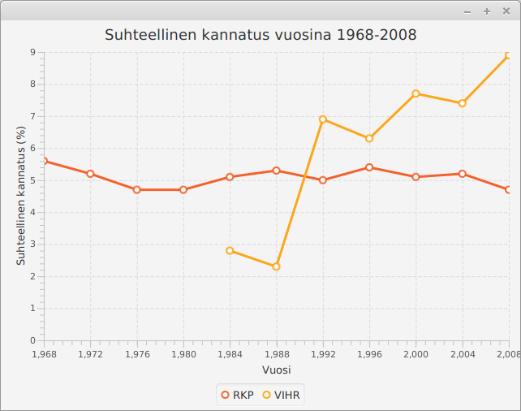
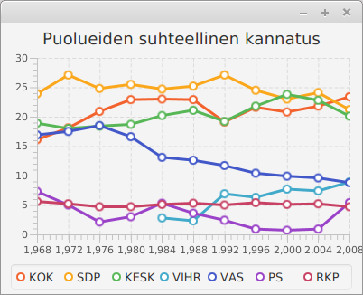
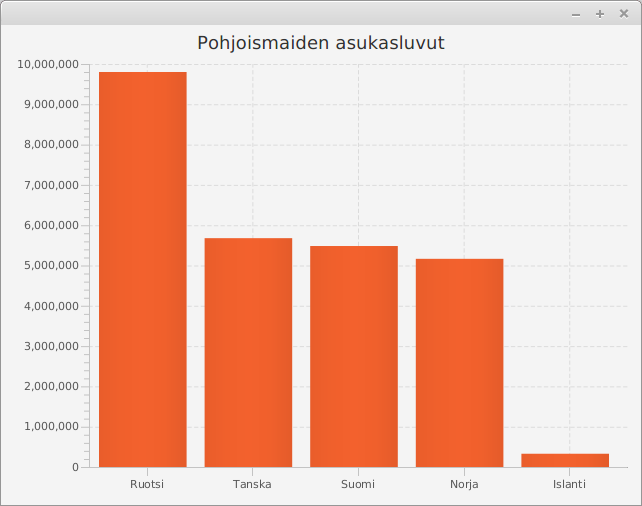

# Tiedon visualisointi

<text-box variant='learningObjectives' name='Oppimistavoitteet'>

- Tunnet menetelmiä tiedon visualisointiin.
- Osaat käyttää Javan valmiita tiedon visualisointiin tarkoitettuja käyttöliittymäkomponentteja.
- Tiedät tavan jatkuvasti muuttuvan tiedon visualisointiin

</text-box>


Sananlasku "a picture is worth a thousand words" eli "yksi kuva kertoo enemmän kuin tuhat sanaa" kuvaa hyvin tiedon visualisoinnin tavoitetta. Tiedon visualisoinnilla pyritään tilanteeseen, missä tieto esitetään tiiviissä mutta ymmärrettävässä muodossa. Visualisaatioilla voi korostaa tärkeitä asioita ja käyttäjälle voi esimerkiksi tehdä yhteenvetoja datasta.

Alla olevassa kuvassa on kuva sovelluksesta, joka mahdollistaa pyöräilijätilastojen tarkastelun. Käytetyt tilastot on noudettu osoitteessa [https://www.avoindata.fi/data/fi/dataset/helsingin-pyorailijamaarat](https://www.avoindata.fi/data/fi/dataset/helsingin-pyorailijamaarat) olevasta Helsingin kaupunkisuunnitteluviraston tietoaineistosta (CC-BY).

<br/>


Kun vertaa kuvan näyttämää tilastoa tiedoston muotoon -- alla muutama rivi esimerkiksi -- edun huomaa hyvin. Alkuperäisessä datassa arvot on esitetty tuntikohtaisina, kun taas visualisaatiota varten datasta on luotu kuukausikohtaiset yhteenvedot. Alkuperäinen data sisältää myös kaikki tarkasteltavat paikat, kun taas visualisaatiossa käyttäjä voi valita tietyn pisteen.


<pre>
Päivämäärä;Huopalahti (asema);Kaisaniemi;Kulosaaren silta et.;...
ke 1 tammi 2014 00:00;;1;;;;;;2;5;3;;11;;;7;8
ke 1 tammi 2014 01:00;;3;;;;;;6;5;1;;8;;;5;4
ke 1 tammi 2014 02:00;;3;;;;;;1;1;1;;14;;;2;11
ke 1 tammi 2014 03:00;;2;;;;;;0;2;0;;7;;;5;3
...
</pre>

<br/>

Yllä kuvatun muotoista dataa voi käsitellä merkkijonoja riveittäin. Rivit pilkotaan paloiksi, joita voidaan käsitellä listamuotoisen rakenteen kautta. Tämä tapahtuu -- esimerkiksi -- seuraavalla tavalla.

```java
String rivi = "Päivämäärä;Huopalahti (asema);Kaisaniemi;Kulosaaren silta et.;..."
String[] palat = rivi.split(";");
for (int i = 0; i < palat.length; i++) {
    System.out.println(i + ": " + palat[i]);
}
```

<sample-output>
0: Päivämäärä
1: Huopalahti (asema)
2: Kaisaniemi
3: Kulosaaren silta et.
4: ...
</sample-output>


Tutustutaan tässä muutamaan tiedon visualisointiin käytettävään kaavioon sekä erääseen liikkuvan tiedon visualisointitapaan.


## Kaaviot

Java tarjoaa [paljon valmiita luokkia](https://docs.oracle.com/javafx/2/api/javafx/scene/chart/package-summary.html) kaavioiden piirtämiseen. Kaaviotyypit sisältävät muunmuassa aluekaavion, pylväskaavion, viivakaavion sekä piirakkakaavion.

Tutustutaan tässä viivakaavion ja pylväskaavion käyttöön. Kannattaa myös tutustua osoitteessa [https://docs.oracle.com/javafx/2/charts/jfxpub-charts.htm](https://docs.oracle.com/javafx/2/charts/jfxpub-charts.htm) olevaan Oraclen oppaaseen aiheesta.

<br/>

### Viivakaavio


Viivakaaviota käytetään esimerkiksi ajan yli tapahtuvan muutoksen kuvaamiseen. Tieto kuvataan kaksiulotteisessa koordinaatistossa sijaitsevien pisteiden läpi piirretyllä viivalla, missä x-koordinaatti kuvaa ajanhetkeä ja y-koordinaatti muuttujan arvoa kullakin ajanhetkellä. Viivakaavio voi sisältää myös useampia muuttujia.


Viivakaaviota voi käyttää esimerkiksi Tilastokeskuksen tarjoaman puolueiden äänimääriä ja suhteellista kannatusta kunnallisvaaleissa vuosina 1968-2008 kuvaavan tiedon visualisointiin. Alkuperäinen data löytyy osoitteesta [https://tilastokeskus.fi/til/kvaa/2008/kvaa_2008_2010-07-30\_tau\_002.html](https://tilastokeskus.fi/til/kvaa/2008/kvaa_2008_2010-07-30_tau_002.html). Datasta on poimittu visualisointia varten muutama piste -- keskitymme tässä suhteelliseen kannatukseen. Käytössä oleva data on seuraavanlainen -- datan erottelussa on käytetty sarkainmerkkiä ('\t').

<br/>

<pre>
Puolue	1968	1972	1976	1980	1984	1988	1992	1996	2000	2004	2008
KOK	16.1	18.1	20.9	22.9	23.0	22.9	19.1	21.6	20.8	21.8	23.4
SDP	23.9	27.1	24.8	25.5	24.7	25.2	27.1	24.5	23.0	24.1	21.2
KESK	18.9	18.0	18.4	18.7	20.2	21.1	19.2	21.8	23.8	22.8	20.1
VIHR	-	-	-	-	2.8	2.3	6.9	6.3	7.7	7.4	8.9
VAS	16.9	17.5	18.5	16.6	13.1	12.6	11.7	10.4	9.9	9.6	8.8
PS	7.3	5.0	2.1	3.0	5.3	3.6	2.4	0.9	0.7	0.9	5.4
RKP	5.6	5.2	4.7	4.7	5.1	5.3	5.0	5.4	5.1	5.2	4.7
</pre>


Yksittäisen yllä kuvatun rivin voi pilkkoa seuraavasti.


```java
String rivi = "Puolue	1968	1972	1976	1980	1984	1988"
List<String> palat = Arrays.asList(rivi.split("\t"));
for (int i = 0; i < palat.size(); i++) {
    System.out.println(i + ": " + palat.get(i));
}
```

<sample-output>

0: Puolue
1: 1968
2: 1972
3: 1976
4: 1980
5: 1984
6: 1988

</sample-output>


Viivakaavion käyttö vaatii koordinaatiston akseleiden määrittelyn, koordinaatistoja käyttävän viivakaavion luomisen, sekä tiedon lisäämisen viivakaavioon. Ensimmäinen hahmotelma sovelluksesta on seuraava. Sovellus yrittää visualisoida RKP:n kannatusta vuosina 1968-2008.


```java
@Override
public void start(Stage ikkuna) {
    // luodaan kaaviossa käytettävät x- ja y-akselit
    NumberAxis xAkseli = new NumberAxis();
    NumberAxis yAkseli = new NumberAxis();

    // asetetaan akseleille nimet
    xAkseli.setLabel("Vuosi");
    yAkseli.setLabel("Suhteellinen kannatus (%)");

    // luodaan viivakaavio. Viivakaavion arvot annetaan numeroina
    // ja se käyttää aiemmin luotuja x- ja y-akseleita
    LineChart<Number, Number> viivakaavio = new LineChart<>(xAkseli, yAkseli);
    viivakaavio.setTitle("Suhteellinen kannatus vuosina 1968-2008");

    // luodaan viivakaavioon lisättävä datajoukko
    XYChart.Series rkpData = new XYChart.Series();
    rkpData.setName("RKP");
    // lisätään datajoukkoon yksittäisiä pisteitä
    rkpData.getData().add(new XYChart.Data(1968, 5.6));
    rkpData.getData().add(new XYChart.Data(1972, 5.2));
    rkpData.getData().add(new XYChart.Data(1976, 4.7));
    rkpData.getData().add(new XYChart.Data(1980, 4.7));
    rkpData.getData().add(new XYChart.Data(1984, 5.1));
    rkpData.getData().add(new XYChart.Data(1988, 5.3));
    rkpData.getData().add(new XYChart.Data(1992, 5.0));
    rkpData.getData().add(new XYChart.Data(1996, 5.4));
    rkpData.getData().add(new XYChart.Data(2000, 5.1));
    rkpData.getData().add(new XYChart.Data(2004, 5.2));
    rkpData.getData().add(new XYChart.Data(2008, 4.7));

    // lisätään datajoukko viivakaavioon
    viivakaavio.getData().add(rkpData);

    // näytetään viivakaavio
    Scene nakyma = new Scene(viivakaavio, 640, 480);
    ikkuna.setScene(nakyma);
    ikkuna.show();
}
```


Kun käynnistämme sovelluksen, huomaamme muutamia ongelmia (kokeile sovellusta ja katso miltä data näyttää). Koordinaatiston akseleiden luomiseen käytetty luokka [NumberAxis](https://docs.oracle.com/javase/8/javafx/api/javafx/scene/chart/NumberAxis.html) tarjoaa onneksemme myös toisenlaisen konstruktorin. NumberAxin-luokan konstruktorille voi määritellä myös ala- ja yläraja sekä välien määrän näytettyjen numeroiden välillä. Määritellään alarajaksi 1968, ylärajaksi 2008, ja välien määräksi 4.

<br/>

```java
@Override
public void start(Stage ikkuna) {
    // luodaan kaaviossa käytettävät x- ja y-akselit
    NumberAxis xAkseli = new NumberAxis(1968, 2008, 4);
    // .. muu ohjelmakoodi pysyy samana
```


Toisen puolueen kannatuksen lisääminen onnistuu ohjelmaan vastaavasti. Alla olevassa esimerkissä kaavioon on lisätty Vihreät, joilla on ollut toimintaa vuodesta 1984 lähtien.


```java
@Override
public void start(Stage ikkuna) {
    // luodaan kaaviossa käytettävät x- ja y-akselit
    NumberAxis xAkseli = new NumberAxis(1968, 2008, 4);
    NumberAxis yAkseli = new NumberAxis();

    // asetetaan akseleille nimet
    xAkseli.setLabel("Vuosi");
    yAkseli.setLabel("Suhteellinen kannatus (%)");

    // luodaan viivakaavio. Viivakaavion arvot annetaan numeroina
    // ja se käyttää aiemmin luotuja x- ja y-akseleita
    LineChart<Number, Number> viivakaavio = new LineChart<>(xAkseli, yAkseli);
    viivakaavio.setTitle("Suhteellinen kannatus vuosina 1968-2008");

    // luodaan viivakaavioon lisättävä datajoukko
    XYChart.Series rkpData = new XYChart.Series();
    rkpData.setName("RKP");
    // lisätään datajoukkoon yksittäisiä pisteitä
    rkpData.getData().add(new XYChart.Data(1968, 5.6));
    rkpData.getData().add(new XYChart.Data(1972, 5.2));
    rkpData.getData().add(new XYChart.Data(1976, 4.7));
    rkpData.getData().add(new XYChart.Data(1980, 4.7));
    rkpData.getData().add(new XYChart.Data(1984, 5.1));
    rkpData.getData().add(new XYChart.Data(1988, 5.3));
    rkpData.getData().add(new XYChart.Data(1992, 5.0));
    rkpData.getData().add(new XYChart.Data(1996, 5.4));
    rkpData.getData().add(new XYChart.Data(2000, 5.1));
    rkpData.getData().add(new XYChart.Data(2004, 5.2));
    rkpData.getData().add(new XYChart.Data(2008, 4.7));

    // lisätään datajoukko viivakaavioon
    viivakaavio.getData().add(rkpData);

    // luodaan toinen viivakaavioon lisättävä datajoukko
    XYChart.Series vihreatData = new XYChart.Series();
    vihreatData.setName("VIHR");
    // lisätään datajoukkoon yksittäisiä pisteitä
    vihreatData.getData().add(new XYChart.Data(1984, 2.8));
    vihreatData.getData().add(new XYChart.Data(1988, 2.3));
    vihreatData.getData().add(new XYChart.Data(1992, 6.9));
    vihreatData.getData().add(new XYChart.Data(1996, 6.3));
    vihreatData.getData().add(new XYChart.Data(2000, 7.7));
    vihreatData.getData().add(new XYChart.Data(2004, 7.4));
    vihreatData.getData().add(new XYChart.Data(2008, 8.9));

    // lisätään datajoukko viivakaavioon
    viivakaavio.getData().add(vihreatData);

    // näytetään viivakaavio
    Scene nakyma = new Scene(viivakaavio, 640, 480);
    ikkuna.setScene(nakyma);
    ikkuna.show();
}
```

Ohjelma näyttää käynnistyessään seuraavalta.




Edellä jokainen kaavion piste lisättiin ohjelmakoodiin manuaalisesti -- olemme ohjelmoijia, joten tämä tuntuu hieman hölmöltä. Ratkaisu on tiedon lukeminen sopivaan tietorakenteeseen, jota seuraa tietorakenteen läpikäynti ja tiedon lisääminen kaavioon. Sopiva tietorakenne on esimerkiksi puolueiden nimiä avaimena käyttävä hajautustaulu, jonka arvona on hajautustaulu -- tämä hajautustaulu sisältää numeropareja, jotka kuvaavat vuotta ja kannatusta. Nyt datan lisääminen kaavioon on suoraviivaisempaa.


```java
// akselit ja viivakaavio luotu aiemmin

// data luettu aiemmin -- datan sisältää seuraava olio
Map<String, Map<Integer, Double>> arvot = // luotu muualla

// käydään puolueet läpi ja lisätään ne kaavioon
arvot.keySet().stream().forEach(puolue -> {
    // jokaiselle puolueelle luodaan oma datajoukko
    XYChart.Series data = new XYChart.Series();
    data.setName(puolue);

    // datajoukkoon lisätään puolueen pisteet
    arvot.get(puolue).entrySet().stream().forEach(pari -> {
        data.getData().add(new XYChart.Data(pari.getKey(), pari.getValue()));
    });

    // ja datajoukko lisätään kaavioon
    viivakaavio.getData().add(data);
});
```


<programming-exercise name='Shanghai' tmcname='osa13-Osa13_01.Shanghai'>

Yliopistoja vertaillaan vuosittain. Eräs kansainvälisesti tunnistettu arvioijataho on Shanghai Ranking Consultancy, joka julkaisee vuosittain listan kansainvälisesti tunnistetuista yliopistoista. Lista sisältää myös yliopiston sijan maailmanlaajuisessa vertailussa. Helsingin yliopiston sijoitus on vuosina 2007-2017 ollut seuraava:

<pre>
2007 73
2008 68
2009 72
2010 72
2011 74
2012 73
2013 76
2014 73
2015 67
2016 56
2017 56
</pre>

Luo tehtäväpohjassa olevaan luokkaan `ShanghaiSovellus` ohjelma, joka näyttää Helsingin yliopiston sijoituksen kehityksen viivakaaviona. Huom! Älä käytä sovelluksessa mitään asettelua, eli anna viivakaavio-olio suoraan Scene-oliolle konstruktorin parametrina. Huomaa myös, että Scenelle tulee tällöin antaa näytettävän alueen leveys ja korkeus.

Sovelluksen tuottama tulos näyttää esimerkiksi seuraavanlaiselta:


</programming-exercise>


<programming-exercise name='Puolueet' tmcname='osa13-Osa13_02.Puolueet'>

Luo tehtäväpohjassa olevaan luokkaan PuolueetSovellus ohjelma, joka näyttää puolueiden suhteellisen kannatuksen vuosina 1968-2008. Käytössä on edellisissä esimerkeissä käytetty data, joka löytyy tiedostosta "puoluedata.tsv".

Suhteellinen kannatus tulee näyttää puoluekohtaisesti siten, että jokaista puoluetta kuvaa viivakaaviossa erillinen viiva. Aseta aina viivan luomiseen käytettävän XYChart.Series-olion nimeksi (metodi setName) datasta löytyvä puolueen nimi.

Kun viivakaavion käyttämää x-akselia luo, kannattaa huomioida myös se, että ensimmäinen tilaston sisältämä tieto on vuodelta 1968.

Sarkainmerkillä erotellun merkkijonon saa pilkottua osiin seuraavasti:


```java
String merkkijono = "KOK	16.1	18.1	20.9";
String[] palat = merkkijono.split("\t");
System.out.println(palat[0]);
System.out.println(palat[1]);
System.out.println(palat[2]);
System.out.println(palat[3]);
```

<sample-output>

KOK
16.1
18.1
20.9

</sample-output>


Merkkijonomuodossa olevan desimaaliluvun muuntaminen desimaaliluvuksi onnistuu luokan Double metodilla valueOf. Esim. `Double.valueOf("16.1");`

Sovelluksen tuottaman visualisaation tulee näyttää kutakuinkin seuraavanlaiselta:



&nbsp;


*Dataa vastaaviin kaavioihin löytyy muunmuassa Tilastokeskuksen [PX-Web-tietokannoista](https://pxnet2.stat.fi/PXWeb/pxweb/fi/StatFin/).*

</programming-exercise>


<programming-exercise name='Säästölaskuri (3 osaa)' tmcname='osa13-Osa13_03.Saastolaskuri'>

Toteutetaan tässä tehtävässä sovellus, jota käytetään säästämiseen liittyvien mahdollisten tuottojen tarkasteluun. Laskuri tarjoaa mahdollisuuden sekä kuukausittaisen säästön määrittelyyn että vuosittaisen koron määrittelyyn, ja näyttää säästösumman kasvun kolmenkymmenen vuoden aikana yli.


<h2>Käyttöliittymä</h2>


Toteuta ensin sovelluksen käyttöliittymä. Sovelluksen komponentteja hallinnoidaan BorderPanen avulla. BorderPanen keskellä on viivakaavio (LineChart), joka sisältää kaksi numeerista akselia (NumberAxis). BorderPanen ylälaidassa on VBox-asettelu. VBox-asettelu sisältää kaksi BorderPanea. Ensimmäisessä (ylemmässä) BorderPanessa on vasemmalla teksti "Kuukausittainen tallennus", keskellä liukuri (Slider), ja oikealla liukurin arvoa kuvaava teksti. Toisessa (alemmassa) BorderPanessa on vasemmalla teksti "Vuosittainen", keskellä liukuri (Slider), ja oikealla liukurin arvoa kuvaava teksti.


Löydät vinkkejä Slider-luokan käyttöön hakemalla Googlesta avainsanoilla "javafx slider".


Määrittele Sliderit siten, että kuukausittaista tallennusta kuvaavan Sliderin minimiarvo on 25 ja maksimiarvo on 250. Vuosittaisen koron minimiarvo on 0 ja maksimiarvo on 10. Kaavion x-akselin tulee näyttää arvon nollasta kolmeenkymmeneen, jotka kuvaavat vuosien kehitystä. Y-akselin arvojen tulee mukautua näytettäviin arvoihin.

Sovellus näyttää tämän vaiheen jälkeen seuraavalta.


<h2>Tallennusten näyttäminen</h2>

Kun käyttöliittymän rakenne ja ulkoasu on kohdallaan, aloitetaan laskurin toiminnallisuuden toteuttaminen.

Muokkaa käyttöliittymää siten, että kun käyttäjä siirtää kuukausittaiseen tallennukseen liittyvää liukuria (ylempi liukureista), kaavion näyttämä tallennuksen kasvua vuosien yli kuvaava kaavio päivittyy ja näyttää tallennuksen kasvun. Esimerkiksi kun kuukausittainen tallennus on 50, tulee kaaviossa olla viiva, joka näyttää arvot [(0, 0), (1, 600), (2, 1200), (3, 1800), ...]

Sovellus näyttää tämän vaiheen jälkeen (esimerkiksi) seuraavalta. Alla kuukausittaisen tallennuksen arvoksi on valittu 50.


<h2>Tallennusten näyttäminen korkoineen</h2>

Muokkaa käyttöliittymää siten, että koron näyttäminen sovelluksessa toimii. Tämän jälkeen sovelluksen tulee näyttää kaksi viivaa, yksi viivoista näyttää pelkän talletuksen, ja toinen viiva näyttää talletuksen korkoineen.

Laske korko vuosittain vuoden lopussa olevan tallennuksen perusteella (eli hieman optimistisesti). Esimerkiksi kun kuukausittainen tallennus on 50 ja vuosikorko 5%, tulee vuosittaisten summien korkoineen olla [(0, 0), (1, 630), (2, 1291.5), (3, 1986.075), ...]

Sovellus näyttää tämän vaiheen jälkeen (esimerkiksi) seuraavalta. Alla kuukausittaisen tallennuksen arvoksi on valittu 50 ja koroksi 10 (eli 10% korko).


Kuvassa huomaamme ns. "korkoa korolle"-efektin, joskin hyvin optimistiselle korolle. Kun olet saanut sovelluksen toimimaan ja olet palauttanut sen, voit tarkastella esimerkiksi miten 25 euron kuukausittainen tallennus 4% vuosikorolla kasvaa 50 vuoden aikana.

</programming-exercise>


### Pylväskaaviot

Pylväskaavioita käytetään kategorisen datan visualisointiin. Tieto kuvataan pylväinä, missä jokainen pylväs kuvaa tiettyä kategoriaa, ja pylvään korkeus (tai pituus) kategoriaan liittyvää arvoa. Pylväskaavioilla kuvattavasta datasta esimerkkejä ovat esimerkiksi maiden asukasluvut tai kauppojen tai tuotteiden markkinaosuudet.

Tarkastellaan pylväskaavion käyttöä pohjoismaiden asukaslukujen visualisointiin. Käytetty data on Wikipedian pohjoismaita kuvaavasta artikkelista osoitteesta [https://fi.wikipedia.org/wiki/Pohjoismaat](https://fi.wikipedia.org/wiki/Pohjoismaat) (noudettu 10.4.2017, asukasluvut ovat vuoden 2015 arvioita).

<br/>

<pre>
Islanti, 329100
Norja, 5165800
Ruotsi, 9801616
Suomi, 5483533
Tanska, 5678348
</pre>


Pylväskaavio luodaan JavaFx:n luokan [BarChart](https://docs.oracle.com/javase/8/javafx/api/javafx/scene/chart/BarChart.html) avulla. Kuten viivakaavion käyttö, myös pylväskaavion käyttö vaatii käytettävien koordinaatistojen määrittelyn sekä tiedon lisäämisen kaavioon. Toisin kuin viivakaavioesimerkissä, tässä käytämme x-akselin määrittelyssä kategorista kategorista [CategoryAxis](https://docs.oracle.com/javase/8/javafx/api/javafx/scene/chart/CategoryAxis.html)-luokkaa. Kun käytössä on CategoryAxis-luokka, kaavion akselin arvojen tyyppi on String, mikä tulee näkyä myös kaavioon lisättävässä datassa.

<br/>

```java
@Override
public void start(Stage ikkuna) {
    CategoryAxis xAkseli = new CategoryAxis();
    NumberAxis yAkseli = new NumberAxis();
    BarChart<String, Number> pylvaskaavio = new BarChart<>(xAkseli, yAkseli);

    pylvaskaavio.setTitle("Pohjoismaiden asukasluvut");
    pylvaskaavio.setLegendVisible(false);

    XYChart.Series asukasluvut = new XYChart.Series();
    asukasluvut.getData().add(new XYChart.Data("Ruotsi", 9801616));
    asukasluvut.getData().add(new XYChart.Data("Tanska", 5678348));
    asukasluvut.getData().add(new XYChart.Data("Suomi", 5483533));
    asukasluvut.getData().add(new XYChart.Data("Norja", 5165800));
    asukasluvut.getData().add(new XYChart.Data("Islanti", 329100));

    pylvaskaavio.getData().add(asukasluvut);
    Scene nakyma = new Scene(pylvaskaavio, 640, 480);
    ikkuna.setScene(nakyma);
    ikkuna.show();
}
```

<quiznator id="5cb02d5dddb6b814af32ca5a"></quiznator>

Edellinen lähdekoodi tuottaa seuraavanlaisen kaavion.




Kuten huomaat, kun x-akseli on määritelty luokan CategoryAxis avulla, kaavio noudattaa sitä järjestystä, missä kategoriat annetaan sovellukselle. Edellisessä esimerkissä maat on järjestetty asukaslukumäärien mukaan. Kokeile muokata sovellusta siten, että pohjoismaat on järjestetty maan nimen mukaan kaaviossa. Ymmärrät mahdollisesti sovelluksen käynnistettyäsi miksei kyseistä visualisaatiota näytetä tällaisessa järjestyksessä lähes missään...


<programming-exercise name='Epäreilua mainontaa' tmcname='osa13-Osa13_04.EpareiluaMainontaa'>

Sanonnan "Vale, emävale, tilasto" mukaan mikään ei valehtele kuin tilasto. Sanonta ei ehkäpä ole täysin väärässä, sillä tilastoja luodaan silloin tällöin tahallisesti epäselviksi.

Tehtäväpohjassa oleva sovellus käynnistää erään kuvitteellisen yrityksen mainonnassa käytetyn visualisaation. Visualisaatio kuvaa mobiiliyhteyden nopeutta, ja näyttää merkittävän eron kilpailijoihin verrattuna.


Vertailu ei kuitenkaan ole kovin reilu ja se antaa väärän kuvan todellisesta tilanteesta. Muunna ohjelmaa siten, että vertailu on reilumpi.

Tässä tehtävässä ei ole automaattisia testejä eikä mallivastausta, joten voit määritellä reilun vertailun hieman vapaammin.

</programming-exercise>


<programming-exercise name='Pyöräilijätilastot' tmcname='osa13-Osa13_05.Pyorailijatilastot'>

Tehtäväpohjassa tulee mukana valmis sovellus, jota on käytetty pyöräilijätilastojen näyttöön viivakaaviona. Muokkaa sovellusta siten, että sovellus käyttää viivakaavion sijaan  pylväskaaviota. Kaikki viitteet viivakaavioon tulee poistaa muokkauksen yhteydessä.

</programming-exercise>


## Jatkuvasti muuttuvan tiedon visualisointi


Ohjelmistoja käytetään myös jatkuvasti muuttuvan tiedon visualisaatioon. Esimerkiksi osakekurssien seurantaan käytetyt ohjelmistot hakevat jatkuvasti uusinta tietoa osakekursseista ja näyttävät tietoa käyttäjälle. Vastaavasti sääohjelmistot hakevat mittausasemien tietoja, ja näyttävät viimeisimmän tiedon käyttäjälle. Samalla tavoin toimivat myös palvelinohjelmistojen seurantaan kehitetyt ohjelmistot, jotka tietyin aikavälein tarkastavat vastaako palvelinohjelmisto pyyntöihin.


Luokkaa [AnimationTimer](https://docs.oracle.com/javase/8/javafx/api/javafx/animation/AnimationTimer.html) voidaan hyödyntää myös jatkuvasti muuttuvan tiedon visualisoinnissa. AnimationTimer-luokan avulla voidaan luoda sovellus, joka hakee tai luo uutta tietoa ajoittain sovellukseen.

<br/>


Alla olevassa esimerkissä havainnollistetaan [suurten lukujen lakia](https://fi.wikipedia.org/wiki/Suurten_lukujen_laki). Suurten lukujen laki on todennäköisyyslaskentaan liittyvä ilmiö, joka kertoo, erttä satunnaismuuttujan keskiarvo lähestyy satunnaismuuttujan odotusarvoa kun toistojen määrä kasvaa. Käytännössä esimerkiksi kuusisivuisen nopan heittojen keskiarvo lähestyy heittojen lukumäärän kasvaessa lukua 3.5. Vastaavasti kolikkoa heitettäessä kruunien ja klaavojen suhde lähestyy "fifti-fifti"-jakoa kun kolikonheittojen määrä kasvaa.

<br/>


```java
@Override
public void start(Stage ikkuna) {
    // Luokkaa Random käytetään nopan heittojen arpomiseen
    Random arpoja = new Random();

    NumberAxis xAkseli = new NumberAxis();
    // y-akseli kuvaa nopanheittojen keskiarvoa. Keskiarvo on aina välillä [1-6]
    NumberAxis yAkseli = new NumberAxis(1, 6, 1);

    LineChart<Number, Number> viivakaavio = new LineChart<>(xAkseli, yAkseli);
    // kaaviosta poistetaan mm. pisteisiin liittyvät ympyrät
    viivakaavio.setLegendVisible(false);
    viivakaavio.setAnimated(false);
    viivakaavio.setCreateSymbols(false);

    // luodaan dataa kuvaava muuttuja ja lisätään se kaavioon
    XYChart.Series keskiarvo = new XYChart.Series();
    viivakaavio.getData().add(keskiarvo);

    new AnimationTimer() {
        private long edellinen;
        private long summa;
        private long lukuja;

        @Override
        public void handle(long nykyhetki) {
            if (nykyhetki - edellinen < 100_000_000L) {
                return;
            }

            edellinen = nykyhetki;

            // heitetään noppaa
            int luku = arpoja.nextInt(6) + 1;

            // kasvatetaan summaa ja lukujen määrää
            summa += luku;
            lukuja++;

            // lisätään dataan uusi piste
            keskiarvo.getData().add(new XYChart.Data(lukuja, 1.0 * summa / lukuja));
        }
    }.start();

    Scene nakyma = new Scene(viivakaavio, 400, 300);
    ikkuna.setScene(nakyma);
    ikkuna.show();
}
```

Alla olevassa kuvassa on esimerkki sovelluksen toiminnassa. Kuvassa noppaa on heitetty lähes 100 kertaa.


Tarkkasilmäiset lukijat saattoivat huomata, että sovelluksen lähdekoodissa kaaviota ei piirretty uudestaan datan lisäämisen yhteydessä. Mitä ihmettä?

Kaaviot kuten LineChart ja BarChart käyttävät sisäisen tiedon säilömiseen [ObservableList](https://docs.oracle.com/javase/8/javafx/api/javafx/collections/ObservableList.html)-rajapinnan toteuttavaa tietorakennetta. ObservableList-rajapinnan toteuttavat kokoelmat tarjoavat mahdollisuuden kokoelmissa tapahtuvien muutosten kuunteluun. Kun listalle lisätään uusi tietue, esimerkiksi uusi keskiarvoa kuvaava piste, kertoo lista muutoksesta kaikille listan muutoksia kuunteleville olioille. Kaavioiden kuten LineChart ja BarChart sisäinen toteutus on tehty siten, että ne kuuntelevat muutoksia niiden näyttämään tietoon. Jos tieto muuttuu, päivittyy kaavio automaattisesti.

Joissain tilanteissa jatkuvasti muuttuvasta datasta halutaan näkyville esimerkiksi vain viimeiset 100 havaintoa. Tämä onnistuisi edellisessä esimerkissä asettamalla x-akselia kuvaavan NumberAxis-olion arvojen arvailu pois päältä (metodi setAutoRanging(false)) sekä lisäämällä seuraavan tarkistuksen AnimationTimer-luokan handle-metodin loppuun.


```java
if (keskiarvo.getData().size() > 100) {
    keskiarvo.getData().remove(0);
    xAkseli.setLowerBound(xAkseli.getLowerBound() + 1);
    xAkseli.setUpperBound(xAkseli.getUpperBound() + 1);
}
```

Nyt sovellus näyttää käyttäjälle aina vain viimeiset 100 arvoa.


# Multimedian käyttö sovelluksissa

<text-box variant='learningObjectives' name='Oppimistavoitteet'>

- Tunnet menetelmiä multimedian käyttämiseen graafisissa käyttöliittymissä.
- Osaat piirtää graafiseen käyttöliittymään.
- Osaat näyttää kuvan graafisessa käyttöliittymässä.
- Osaat soittaa ääniä graafisessa käyttöliittymässä.

</text-box>


Tutustutaan seuraavaksi lyhyesti multimedian käyttöön JavaFX-sovelluksissa.


## Piirtäminen

JavaFX-käyttöliittymäkirjastossa piirtämiseen käytetään [Canvas](https://docs.oracle.com/javase/8/javafx/api/javafx/scene/canvas/Canvas.html)-oliota. Canvas-olio edustaa tyhjää taulua, johon voi piirtää. Piirtäminen tapahtuu Canvas-oliolta saatavalla [GraphicsContext](https://docs.oracle.com/javase/8/javafx/api/javafx/scene/canvas/GraphicsContext.html)-oliolla.


Alla olevassa esimerkissä on luotu yksinkertainen piirto-ohjelma. Ohjelmassa luodaan 640 pikseliä leveä ja 480 pikseliä korkea piirtoalusta, joka asetetaan BorderPane-asettelun keskelle. Tämän lisäksi luodaan piirtovärin valintaan käytettävä [ColorPicker](https://docs.oracle.com/javase/8/javafx/api/javafx/scene/control/ColorPicker.html)-olio, jolta saa tietoonsa kullakin hetkellä valittuna olevan värin. Värin valitsin asetetaan BorderPane-asettelun oikealle laidalle. Piirtoalustaan lisätään hiiren liikkumista kuunteleva tapahtuman käsittelijä. Kun hiirtä liikutetaan nappi pohjassa (onMouseDragged), kutsutaan GraphicsContext-olion värin asetusmetodia sekä piirretään hiiren kohtaan pieni ympyrä.

```java
// pakkaus

import javafx.application.Application;
import javafx.scene.Scene;
import javafx.scene.canvas.Canvas;
import javafx.scene.canvas.GraphicsContext;
import javafx.scene.control.ColorPicker;
import javafx.scene.layout.BorderPane;
import javafx.stage.Stage;

public class MiniPaint extends Application {

    @Override
    public void start(Stage ikkuna) {

        Canvas piirtoalusta = new Canvas(640, 480);
        GraphicsContext piirturi = piirtoalusta.getGraphicsContext2D();

        ColorPicker varinValitsin = new ColorPicker();

        BorderPane asettelu = new BorderPane();
        asettelu.setCenter(piirtoalusta);
        asettelu.setRight(varinValitsin);

        piirtoalusta.setOnMouseDragged((event) -> {
            double kohtaX = event.getX();
            double kohtaY = event.getY();
            piirturi.setFill(varinValitsin.getValue());
            piirturi.fillOval(kohtaX, kohtaY, 4, 4);
        });

        Scene nakyma = new Scene(asettelu);

        ikkuna.setScene(nakyma);
        ikkuna.show();
    }

    public static void main(String[] args) {
        launch(MiniPaint.class);
    }
}
```


Sovellus näyttää seuraavanlaiselta. Alla sovellusta on käytetty jo hieman piirtämiseen.


<programming-exercise name='Hymiö' tmcname='osa13-Osa13_06.Hymio'>

Luo tehtäväpohjassa olevaan luokkaan graafinen käyttöliittymä. Lisää graafiseen käyttöliittymään asettelusta vastaava BorderPane-olio. Lisää BorderPanen keskellä Canvas-olio. Piirrä tämän jälkeen Canvas-olioon liittyvän GraphicsContext-olion avulla hymiö. Käytä taustan värinä valkoista (Color.WHITE) ja hymiön värinä mustaa (Color.BLACK).

Tehtävän testit tarkastavat vain, että piirrät ikkunaan. Palauta tehtävä vasta kun saat hymiön piirtämisen toimimaan. Huomaa ettei tässä ole tarkoitus piirtää hymiötä esimerkiksi hiirellä -- käytä suoraan GraphicsContext-olion tarjoamia metodeja siten että kuva on piirrettynä heti ohjelman käynnistyessä.


</programming-exercise>


## Kuvat

Kuvan näyttämiseen osana sovellusta on useita tapoja. Eräs suoraviivainen lähestymistapa hyödyntää JavaFx:n [Image](https://docs.oracle.com/javafx/2/api/javafx/scene/image/Image.html) ja [ImageView](https://docs.oracle.com/javase/8/javafx/api/javafx/scene/image/ImageView.html) luokkia.

Image-luokalle annetaan parametrina avattavan kuvatiedoston nimi -- nimeä tulee edeltää etuliite `file:`, joka kertoo kuvan olevan tiedosto. Alla olevassa esimerkissä ladataan tiedosto `humming.jpg`, joka annetaan luotavalle ImageView-oliolle parametrina. Tämän jälkeen ImageView-olio asetetaan Pane-asetteluun -- Pane-asettelu ei ota mm. kantaa sen sisältävien elementtien sijaintiin. Lopulta asettelu asetetaan osaksi Scene-oliota ja se asetetaan näkyville.


```java
import javafx.application.Application;
import static javafx.application.Application.launch;
import javafx.scene.Scene;
import javafx.scene.image.Image;
import javafx.scene.image.ImageView;
import javafx.scene.layout.Pane;
import javafx.stage.Stage;

public class KuvaApplication extends Application {

    @Override
    public void start(Stage stage) {

        Image kuvatiedosto = new Image("file:humming.jpg");
        ImageView kuva = new ImageView(kuvatiedosto);

        Pane ruutu = new Pane();
        ruutu.getChildren().add(kuva);

        stage.setScene(new Scene(ruutu));
        stage.show();

    }

    public static void main(String[] args) {
        launch(args);
    }
}
```


Ohjelman suorittaminen luo seuraavanlaisen ikkunan. Tässä oletetaan, että tiedosto `humming.jpg` on olemassa, ja että se löytyy projektin juuresta (samasta kansiosta kuin tiedosto `pom.xml`).


Esimerkissä käytetään [Linda Tanner](https://www.flickr.com/photos/15323831@N05)in kuvaa osoitteesta [http://www.freestockphotos.biz/stockphoto/17874](http://www.freestockphotos.biz/stockphoto/17874). Kuva on lisensoitu [Creative Commons CC BY 2.0](https://creativecommons.org/licenses/by/2.0/)-lisenssillä.

ImageView-olio tarjoaa joukon menetelmiä kuvan (yksinkertaiseen käsittelyyn). Kuvaa voi muunmuassa kääntää, sen kokoa voi muuttaa, ja sitä voi siirtää ruudulla. Alla olevassa esimerkissä kuva on käännetty ympäri, sen koko on puolitettu, ja sitä on siirretty hieman oikealle.


```java
@Override
public void start(Stage stage) {

    Image kuvatiedosto = new Image("file:humming.jpg");
    ImageView kuva = new ImageView(kuvatiedosto);

    kuva.setRotate(180);
    kuva.setScaleX(0.5);
    kuva.setScaleY(0.5);

    kuva.setTranslateX(50);

    Pane ruutu = new Pane();
    ruutu.getChildren().add(kuva);

    stage.setScene(new Scene(ruutu));
    stage.show();
}
```


ImageView-luokka tarjoaa pääsyn kuvaan, mutta sen kautta ei pääse yksittäisiin pikseleihin (eli yksittäisiin yhtä väriä sisältäviin pieniin "ruutuihin", joista kuva koostuu). Kuvan yksittäisiä pikseleitä voi lukea Image-oliosta saatavan [PixelReader](https://docs.oracle.com/javafx/2/api/javafx/scene/image/PixelReader.html)-olion avulla. PixelReader-olion avulla voidaan käydä koko kuva läpi pikseli pikseliltä, samalla kuvaa erilliseen [WritableImage](https://docs.oracle.com/javafx/2/api/javafx/scene/image/WritableImage.html)-olioon kirjoittaen.

Alla olevassa esimerkissä kuva kopioidaan pikseli pikseliltä erilliselle WritableImage-oliolle, joka näytetään sovelluksessa.


```java
@Override
public void start(Stage stage) {

    Image kuvatiedosto = new Image("file:humming.jpg");

    PixelReader lukija = kuvatiedosto.getPixelReader();

    int leveys = (int) kuvatiedosto.getWidth();
    int korkeus = (int) kuvatiedosto.getHeight();

    WritableImage kohdeKuva = new WritableImage(leveys, korkeus);
    PixelWriter kirjoittaja = kohdeKuva.getPixelWriter();

    for (int y = 0; y < korkeus; y++) {
        for (int x = 0; x < leveys; x++) {

            Color vari = lukija.getColor(x, y);
            double punainen = vari.getRed();
            double vihrea = vari.getGreen();
            double sininen = vari.getBlue();
            double lapinakyvyys = vari.getOpacity();

            Color uusiVari = new Color(punainen, vihrea, sininen, lapinakyvyys);

            kirjoittaja.setColor(x, y, uusiVari);
        }
    }

    ImageView kuva = new ImageView(kohdeKuva);

    Pane pane = new Pane();
    pane.getChildren().add(kuva);

    stage.setScene(new Scene(pane));
    stage.show();
}
```

Kuvan ulkomuoto ei ole muuttunut lainkaan.


<programming-exercise name='Kollaasi (3 osaa)' tmcname='osa13-Osa13_07.Kollaasi'>

Andy Warhol tuli tutuksi kuvakollaaseista, joissa yksi tai useampi kuva toistui useampaan otteeseen esimerkiksi eri väreissä.

Matkitaan tässä tehtävässä hänen tyyliään ja luodaan Andy Warholmainen versio klassisesta Mona Lisasta. Valmis ohjelma näyttää Mona Lisan seuraavan näköisenä.


Aloitetaan.

<h2>Vasen yläkulma</h2>

Tehtäväpohjassa on ohjelma, joka lataa ja näyttää Mona Lisan. Tässä tehtävän osassa tavoitteenasi on luoda tilanne, missä Mona Lisa näkyy pienempänä kuvana vasemmassa yläkulmassa. Pienemmän kuvan koon tulee olla neljäsosa alkuperäisestä kuvasta.


Käytännössä siis koordinaattiin 0, 0 tulee kopioida koordinaatin 0, 0 arvo. Koordinaattiin 0, 1 koordinaatin 0, 2 arvo. Koordinaattiin 0, 2 koordinaatin 0, 4 arvo. Koordinaattiin 0, 3 koordinaatin 0, 6 arvo jne. Vastaavasti myös y-akselilla, eli esimerkiksi koordinaattiin 1, 1 koordinaatin 2, 2 arvo, ja koordinaattiin 1, 2 koordinaatin 2, 4 arvo.


<h2>Ruudukko</h2>

Muokkaa seuraavaksi ohjelmaa siten, että edellisessä osassa vasempaan yläkulmaan luotu kuva toistuu kuvassa neljään kertaan. Ensimmäisen kuvan vasemman yläkulman tulee olla koordinaatissa 0, 0. Toisen kuvan vasemman yläkulman tulee olla koordinaatissa (kuvan leveys / 2), 0. Kolmannen kuvan vasemman yläkulman tulee olla koordinaatissa 0, (kuvan korkeus / 2). Neljännen kuvan vasemman yläkulman tulee olla koordinaatissa (kuvan leveys / 2), (kuvan korkeus / 2).


<h2>Negatiivi</h2>

Kun olet saanut muodostettua ruudukon, muokkaa kuvaa vielä siten, että kuvassa näytetään negatiivi alkuperäisen kuvan sijaan. Negatiivin luominen onnistuu ottamalla jokaisen pikselin värin erotus luvusta yksi, esim. `punainen = 1.0 - punainen`.


*Tehtäväpohjan mukana tuleva Mona Lisa -kuva on noudettu Wikimedian osoitteesta [https://commons.wikimedia.org/wiki/Category:Mona_Lisa](https://commons.wikimedia.org/wiki/Category:Mona_Lisa). Käytetty kuva on vapaasti käytettävissä.*


</programming-exercise>


## Äänet

Äänitiedostojen käsittelyyn löytyy myös useampia menetelmiä, joista tässä käsitellään yksi tapa. Tapa liittyy äänitiedostojen käsittelyyn äänileikkeinä (audioclip), jotka ovat esimerkiksi ääniefektejä ym.


Esimerkissä käytetään Daniel Simionin [Creative Commons Attribution 3.0](https://creativecommons.org/licenses/by/3.0/)-lisenssillä julkaisemaa äänitiedostoa. Äänitiedoston voi kuunnella alla. Äänitiedosto on noudettu osoitteessa [http://soundbible.com/](http://soundbible.com/) olevasta palvelusta.

<br/>

<audio controls>
<source src="../img/front-desk-bells-daniel_simon.wav" type="audio/wav"/>
</audio>

Oletetaan, että tiedoston nimi on `bell.wav`, ja että se sijaitsee projektin juuressa. Yksinkertaisimmillaan äänen soittaminen tapahtuu seuraavasti.

```java
AudioClip leike = new AudioClip("file:bell.wav");
leike.play();
```

AudioClip-olion toiminta on riippuvainen JavaFx:n kirjastoista, joten äänitiedosto tulee käynnistää osana JavaFx-ohjelmaa. Allaoleva esimerkki etsii projektin juuresta tiedostoa `bell.wav` ja luo siitä äänileikkeen. Tämän jälkeen äänileike soitetaan, ja sovellukseen liittyvä (tyhjä) ikkuna avataan.


```java
import javafx.application.Application;
import static javafx.application.Application.launch;
import javafx.scene.media.AudioClip;
import javafx.stage.Stage;

public class AudioClipApplication extends Application {

    @Override
    public void start(Stage stage) {

        AudioClip leike = new AudioClip("file:bell.wav");
        leike.play();

        stage.show();
    }

    public static void main(String[] args) {
        launch(args);
    }

}
```

<programming-exercise name='Hurraa' tmcname='osa13-Osa13_08.Hurraa'>

Tehtäväpohjan juurikansiossa on tiedosto `Applause-Yannick_Lemieux.wav`, joka sisältää hurrausäänen. Tehtävänäsi on luoda sovellus, missä on "Hurraa"-nappi. Kun käyttäjä painaa nappia, sovelluksen tulee soittaa edellä mainittu äänitiedosto.


*Äänitiedosto on Yannick Lemieuxin nauhoittama. Tiedosto on lisensoitu Creative Commonsin Attribuutiolisenssillä [https://creativecommons.org/licenses/by/3.0/](https://creativecommons.org/licenses/by/3.0/).*


</programming-exercise>


<text-box variant='hint' name='Mediasoittimen luominen'>

Osoitteessa [https://examples.javacodegeeks.com/desktop-java/javafx/javafx-media-api/](https://examples.javacodegeeks.com/desktop-java/javafx/javafx-media-api/) on opas mediasoittimen luomiseen. Opas on varsin hyvä lähtökohta mikäli äänten soittaminen ja käsittely ohjelmallisesti kiinnostaa.

</text-box>


# Laajempi sovellus: Asteroids

<text-box variant='learningObjectives' name='Oppimistavoitteet'>

- Tiedät tavan interaktiivisen pelin toteuttamiseen.
- Näet miten laajempi sovellus rakentuu askel askeleelta.
- Harjoittelet askeleittaisten ohjeiden seuraamista laajemman sovelluksen rakentamiseksi.

</text-box>

[Asteroids](https://en.wikipedia.org/wiki/Asteroids_(video_game)) on [Atari](https://en.wikipedia.org/wiki/Atari,_Inc.)n kehittämä ja vuonna 1979 julkaisema tietokonepeliklassikko. Pelissä pelaaja ohjaa kolmionmuotoista avaruusalusta, ja pelin tavoitteena on tuhota asteroideja niitä ampuen.

Seuraavaksi tehdään laajempi esimerkki, missä toteutetaan osa Asteroids-pelistä. Peli on myös kurssin tehtävänä -- tee peli esimerkkiä seuraten annettuun tehtäväpohjaan (esimerkin lopussa).

Peli koostetaan useammassa osassa, jotka ovat seuraavat:

- Peliruudun luominen

- Aluksen luominen

- Aluksen kääntäminen

- Aluksen liikuttaminen

- Asteroidin luominen

- Aluksen ja asteroidin törmääminen

- Useampi asteroidi

- Ruudussa pysyminen

- Ammukset

- Pisteiden lisääminen

- Asteroidien jatkuva lisääminen

Aloitetaan ohjelman luominen peliruudun luomisesta.

## Peliruudun luominen

Rakennetaan ohjelma niin, että ohjelman ruutu voi sisältää vapaavalintaisen määrän elementtejä, joiden sijaintiin käytettävä asettelu ei ota kantaa. Tähän sopii hyvin luokka [Pane](https://docs.oracle.com/javase/8/javafx/api/javafx/scene/layout/Pane.html). Luokka Pane sisältää edellisestä [ObservableList](https://docs.oracle.com/javase/8/javafx/api/javafx/collections/ObservableList.html)-tyyppisen listan lapsielementtejä. Listaan pääsee käsiksi Pane-luokan metodin `getChildren`-kautta.

Alla olevassa esimerkissä on ohjelma, joka luo 300 pikseliä leveän ja 200 pikseliä korkean ruudun. Ruudussa on kohdassa 30, 50 ympyrä, jonka säde on 10 pikseliä. Tietokoneohjelmissa koordinaatiston origo on tyypillisesti ikkunan vasemmassa yläkulmassa. Lisäksi y-koordinaatin arvo kasvaa alaspäin mennessä.


```java
import javafx.application.Application;
import javafx.scene.Scene;
import javafx.scene.layout.Pane;
import javafx.scene.shape.Circle;
import javafx.stage.Stage;

public class PaneEsimerkki extends Application {

    @Override
    public void start(Stage stage) throws Exception {
        Pane ruutu = new Pane();
        ruutu.setPrefSize(300, 200);
        ruutu.getChildren().add(new Circle(30, 50, 10));

        Scene scene = new Scene(ruutu);
        stage.setScene(scene);
        stage.show();
    }

    public static void main(String[] args) {
        launch(args);
    }
}
```


Kutsutaan ohjelmaamme AsteroidsSovellukseksi. AsteroidsSovellus mukailee yllä olevaa esimerkkiä. Sovelluksessa ei aseteta ruutuun ympyrää, mutta sovellukselle on asetettu otsikko. Ikkunan leveys on 600 pikseliä ja korkeus 400 pikseliä.


```java
import javafx.application.Application;
import javafx.scene.Scene;
import javafx.scene.layout.Pane;
import javafx.stage.Stage;

public class AsteroidsSovellus extends Application {

    @Override
    public void start(Stage stage) throws Exception {
        Pane ruutu = new Pane();
        ruutu.setPrefSize(600, 400);

        Scene scene = new Scene(ruutu);
        stage.setTitle("Asteroids!");
        stage.setScene(scene);
        stage.show();
    }

    public static void main(String[] args) {
        launch(args);
    }
}
```

## Aluksen luominen


Luodaan ohjelmaan seuraavaksi alus. Asteroidsissa alus on kolmio. Kolmion esittäminen onnistuu monikulmiota kuvaavan [Polygon](https://docs.oracle.com/javase/8/javafx/api/javafx/scene/shape/Polygon.html)-luokan avulla. Monikulmion kulmat asetetaan Polygon-oliolle joko konstruktorin parametrina tai Polygon-luokan sisältämään listaan. Listaan pääsee käsiksi metodilla `getPoints`.

Alla olevassa esimerkissä ruutuun on lisätty 100 pikseliä leveä ja 50 pikseliä korkea suunnikas, joka on luotu Polygon-luokan avulla.


```java
@Override
public void start(Stage stage) throws Exception {
    Pane ruutu = new Pane();
    ruutu.setPrefSize(300, 200);

    Polygon suunnikas = new Polygon(0, 0, 100, 0, 100, 50, 0, 50);
    ruutu.getChildren().add(suunnikas);

    Scene scene = new Scene(ruutu);
    stage.setScene(scene);
    stage.show();
}
```


Polygon-olion siirtäminen sopivampaan paikkaan onnistuu sen tarjoamien `setTranslateX` ja `setTranslateY`-metodien avulla. Alla olevassa esimerkissä luodaan edellistä esimerkkiä vastaava suunnikas, mutta nyt suunnikasta on siirretty 100 pikseliä oikealle ja 20 pikseliä alas.


```java
@Override
public void start(Stage stage) throws Exception {
    Pane ruutu = new Pane();
    ruutu.setPrefSize(300, 200);

    Polygon suunnikas = new Polygon(0, 0, 100, 0, 100, 50, 0, 50);
    suunnikas.setTranslateX(100);
    suunnikas.setTranslateY(20);

    ruutu.getChildren().add(suunnikas);

    Scene scene = new Scene(ruutu);
    stage.setScene(scene);
    stage.show();
}
```


Luodaan alusta kuvaava kolmio ja lisätään se aiempaan AsteroidsSovellukseemme. Siirretään hahmo ruudun keskelle -- koska ruudun leveys on 600 pikseliä ja ruudun korkeus on 400 pikseliä, hahmoa siirretään 300 pikseliä oikealla ja 200 pikseliä alas.


```java
import javafx.application.Application;
import javafx.scene.Scene;
import javafx.scene.layout.Pane;
import javafx.scene.shape.Polygon;
import javafx.stage.Stage;

public class AsteroidsSovellus extends Application {

    @Override
    public void start(Stage stage) throws Exception {
        Pane ruutu = new Pane();
        ruutu.setPrefSize(600, 400);

        Polygon alus = new Polygon(-5, -5, 10, 0, -5, 5);
        alus.setTranslateX(300);
        alus.setTranslateY(200);

        ruutu.getChildren().add(alus);

        Scene scene = new Scene(ruutu);
        stage.setTitle("Asteroids!");
        stage.setScene(scene);
        stage.show();
    }

    public static void main(String[] args) {
        launch(args);
    }
}
```

## Aluksen kääntäminen: Näppäimistön kuuntelija, osa 1

Luokat kuten Polygon ja Circle perivät JavaFx:n [Node](https://docs.oracle.com/javase/8/javafx/api/javafx/scene/Node.html)-luokan. Node-luokalla on valmiina muuttuja `rotate`, joka kuvaa esineen käännöstä asteina. Minkä tahansa Node-luokan perivän olion kääntäminen on siis melko suoraviivaista -- tarvitsee vain käyttää valmista metodia `setRotate`. Metodille annetaan parametrina käännöksen asteluku.

<br/>

Alla olevassa esimerkissä edellä nähtyä esimerkkiä on muunnettu siten, että alusta on käännetty 30 astetta.


```java
@Override
public void start(Stage stage) throws Exception {
    Pane ruutu = new Pane();
    ruutu.setPrefSize(600, 400);

    Polygon alus = new Polygon(-5, -5, 10, 0, -5, 5);
    alus.setTranslateX(300);
    alus.setTranslateY(200);
    alus.setRotate(30);

    ruutu.getChildren().add(alus);

    Scene scene = new Scene(ruutu);
    stage.setScene(scene);
    stage.show();
}
```

Todellisuudessa emme kuitenkaan halua tilannetta, missä alus kääntyy vain kerran, vaan tilanteen, missä alusta voi ohjata pelin käynnissäollessa. Tarvitsemme siis tapahtumankuuntelijan, joka kuuntelee näppäimistöä ja kääntää alusta näppäimistön painalluksen yhteydessä.

Ikkunan sisältöä kuvaava `Scene`-olio tarjoaa metodin `setOnKeyPressed`, jolle voidaan antaa parametrina tapahtumia käsittelevä olio. Luodaan tapahtumankäsittelijä, joka reagoi näppäimistöön. Näppäimistötapahtumiin liittyy enumeroitu muuttuja `KeyCode`, joka kertoo painetun napin. Olemme kiinnostuneita napeista vasen (LEFT) ja oikea (RIGHT).

Tehdään ensin testiversio, missä aluksen käännös on yksinkertainen. Jos käyttäjä painaa nuolta vasemmalle, asteeksi asetetaan -30. Jos taas käyttäjä painaa nuolta oikealle, asteeksi asetetaan 30.

```java
scene.setOnKeyPressed(event -> {
    if (event.getCode() == KeyCode.LEFT) {
        alus.setRotate(-30);
    }

    if (event.getCode() == KeyCode.RIGHT) {
        alus.setRotate(30);
    }
});
```

Jos aluksen sijaan käytössä olisi suunnikas, ohjelman toiminta näyttäisi seuraavanlaiselta.


Käännöksen saa tasaiseksi hyödyntämällä tietoa olemassaolevasta käännöksestä. Alla olevassa esimerkissä alus kääntyy viisi astetta kerrallaan.

```java
scene.setOnKeyPressed(event -> {
    if (event.getCode() == KeyCode.LEFT) {
        alus.setRotate(alus.getRotate() - 5);
    }

    if (event.getCode() == KeyCode.RIGHT) {
        alus.setRotate(alus.getRotate() + 5);
    }
});
```

Alla kuvattuna vastaava esimerkki, missä aluksen sijaan käännetään suunnikasta.


## Aluksen kääntäminen: Näppäimistön kuuntelija, osa 2

Edellä kuvattu lähestymistapa mahdollistaa "ihan ok"-tyyppisen kääntämisen. Lähestymistavassa on samalla ongelma -- liike ei ole sulavaa. Kun nappia painaa, alus kääntyy, pitää pienen tauon, ja jatkaa vasta tämän jälkeen kääntymistä.

Tämä liittyy siihen, miten ohjelmat oletuksena käsittelevät näppäinten painalluksen. Jos ohjelma käsittelisi näppäimen painalluksen useana tapahtumana heti kun näppäintä painetaan, muuttuisi esimerkiksi tekstin kirjoittaminen paljon hankalammaksi, sillä hieman pidemmät painallukset tuottaisivat heti useampia merkkejä.

Muutetaan näppäinten käsittelyä siten, että pidämme kirjaa pohjassa olevista napeista. Tämä onnistuu (esimerkiksi) hajautustaulun avulla. Hajautustaulu sisältää avaimena KeyCode-olion, eli nappia kuvaavan olion, ja arvona Boolean-tyyppisen muuttujan. Jos tiettyyn nappiin liittyvän boolean-muuttujan arvo on `true`, nappi on pohjassa, muulloin nappi ei ole pohjassa.

Nyt huomioidaan myös napin nostaminen, eli `onKeyReleased`-tapahtuma.


```java
Map<KeyCode, Boolean> painetutNapit = new HashMap<>();

scene.setOnKeyPressed(event -> {
    painetutNapit.put(event.getCode(), Boolean.TRUE);
});

scene.setOnKeyReleased(event -> {
    painetutNapit.put(event.getCode(), Boolean.FALSE);
});
```

Mutta! Eihän tuolla mikään nyt käännä alusta.

Ei niin. Tarvitsemme vielä kääntämistoiminnallisuuden. Otetaan käyttöön animaatioiden luomiseen tarkoitettu AnimationTimer-luokka, ja annetaan sen vastuulle aluksen kääntäminen mikäli vasen tai oikea nappi on pohjassa.


```java
Map<KeyCode, Boolean> painetutNapit = new HashMap<>();

scene.setOnKeyPressed(event -> {
    painetutNapit.put(event.getCode(), Boolean.TRUE);
});

scene.setOnKeyReleased(event -> {
    painetutNapit.put(event.getCode(), Boolean.FALSE);
});

new AnimationTimer() {

    @Override
    public void handle(long nykyhetki) {
        if(painetutNapit.getOrDefault(KeyCode.LEFT, false)) {
            alus.setRotate(alus.getRotate() - 5);
        }

        if(painetutNapit.getOrDefault(KeyCode.RIGHT, false)) {
            alus.setRotate(alus.getRotate() + 5);
        }
    }
}.start();
```

AnimationTimer-luokan maetodia `handle` kutsutaan noin 60 kertaa sekunnissa. Nyt kääntyminen on paljon sulavampaa (tosin, sitä ei alla olevasta gif-kuvasta taida huomata...).


## Aluksen liikuttaminen: Ensimmäinen yritys

Alustamme pystyy nyt kääntämään. Lisätään seuraavaksi mahdollisuus liikkumiseen. Alus voi liikkua mihin tahansa ilmansuuntaan, eli liikkeen kuvaamiseen tarvitaan sekä x- että y-koordinaatin arvo. Konkreettinen liikkuminen tapahtuu muuntamalla alusta kuvaavan polygonin sijaintia ohjelman edetessä.

Hyödynnetään Javan valmista [Point2D](https://docs.oracle.com/javase/8/javafx/api/javafx/geometry/Point2D.html)-luokkaa liikkeen kuvaamiseen -- luokalla on sekä x- että y-koordinaatti.

Ensimmäinen testiversio on liike-muuttujan luominen sekä sen lisääminen AnimationTimer-luokan handle-metodiin.


```java
Point2D liike = new Point2D(1, 0);
```

```java
new AnimationTimer() {

    @Override
    public void handle(long nykyhetki) {
        if(painetutNapit.getOrDefault(KeyCode.LEFT, false)) {
            alus.setRotate(alus.getRotate() - 5);
        }

        if(painetutNapit.getOrDefault(KeyCode.RIGHT, false)) {
            alus.setRotate(alus.getRotate() + 5);
        }

        alus.setTranslateX(alus.getTranslateX() + liike.getX());
    }
}.start();
```

Huraa! Alus liikkuu (ja sitä voi kääntää). Se tosin katoaa aika nopeasti..


Valitsemamme Point2D luokka muistuttaa hieman String-luokkaa siinä, että se on *immutaabeli* eli muuttumaton. Emme voi muuttaa olemassaolevan pisteen arvoja, vaan pisteen metodien kutsuminen palauttaa aina uuden arvon. Tämä on hieman ongelmallista, sillä olioiden arvoja ei saa asettaa uudestaan metodien sisällä -- emme siis voi tehdä esimerkiksi seuraavasti.


```java
new AnimationTimer() {

    @Override
    public void handle(long nykyhetki) {
        // .. ei toimi ..
        if(painetutNapit.getOrDefault(KeyCode.UP, false)) {
            liike = liike.add(new Point2D(1, 1));
        }
        // ..
    }
}.start();
```

Metodikutsut ovat kuitenkin sallittuja. Taitaa olla aika refaktoroinnille, eli ohjelman rakenteen selkeyttämiselle..


## Aluksen liikuttaminen: Ohjelman refaktorointi

Luodaan luokka Alus, joka sisältää Polygon-olion sekä Point2D-olion. Polygon-olio kuvaa alusta, ja Point2D-olio aluksen liikettä. Alus saa konstruktorin parametrina aluksen x- ja y-koordinaatit, jonka lisäksi alusta voi kääntää vasemmalle ja oikealle.


```java
import javafx.geometry.Point2D;
import javafx.scene.shape.Polygon;

public class Alus {

    private Polygon hahmo;
    private Point2D liike;

    public Alus(int x, int y) {
        this.hahmo = new Polygon(-5, -5, 10, 0, -5, 5);
        this.hahmo.setTranslateX(x);
        this.hahmo.setTranslateY(y);

        this.liike = new Point2D(0, 0);
    }

    public Polygon getHahmo() {
        return hahmo;
    }

    public void kaannaVasemmalle() {
        this.hahmo.setRotate(this.hahmo.getRotate() - 5);
    }

    public void kaannaOikealle() {
        this.hahmo.setRotate(this.hahmo.getRotate() + 5);
    }

    public void liiku() {
        this.hahmo.setTranslateX(this.hahmo.getTranslateX() + this.liike.getX());
        this.hahmo.setTranslateY(this.hahmo.getTranslateY() + this.liike.getY());
    }
}
```


Refaktoroinnin johdosta sovellusta tulee muuttaa muutamasta kohtaa. Liikettä kuvaavan pisteen sijaan ja alusta kuvaavan monikulmion sijaan luodaan Alus. Tämän lisäksi Pane-oliolle annetaan alukseen liittyvä Polygon-olio, mutta ei itse alus-oliota.


```java
Alus alus = new Alus(150, 100);

ruutu.getChildren().add(alus.getHahmo());
```

Myös AnimationTimer-olion metodia tulee päivittää siten, että metodissa hyödynnetään aluksen metodeja.

```java
new AnimationTimer() {

    @Override
    public void handle(long nykyhetki) {
        if(painetutNapit.getOrDefault(KeyCode.LEFT, false)) {
            alus.kaannaVasemmalle();
        }

        if(painetutNapit.getOrDefault(KeyCode.RIGHT, false)) {
            alus.kaannaOikealle();
        }

        alus.liiku();
    }

}.start();
```

## Aluksen liikuttaminen: Toinen yritys

Alus liikkuu, mutta aluksen liikettä ei voi vielä muuttaa. Lisätään alukselle kiihdytystoiminnallisuus. Kiihdytyksen tulee toimia niin, että aluksen nopeus kiihtyy aluksen osoittamaan suuntaan. Saamme kiihdytyksen monikulmion asteesta, jonka saa selville metodilla `getRotate()`. Olemme käyttäneet tätä jo paljon alusta kääntäessä.

Kiihdytyksen suunta saadaan selville sini- ja kosinifunktion avulla. Nämä löytyvät Javan valmiista [Math](https://docs.oracle.com/javase/8/docs/api/java/lang/Math.html)-luokasta. Metodit saavat parametrina asteen radiaaneina, joten joudumme hyödyntämään myös Math-luokan asteiden radiaaneiksi muuttavaa metodia.


```java
double muutosX = Math.cos(Math.toRadians(*kulmaAsteina*));
double muutosY = Math.sin(Math.toRadians(*kulmaAsteina*));
```

Luokan Alus kiihdyta-metodin ensimmäinen versio on seuraavanlainen.


```java
public void kiihdyta() {
    double muutosX = Math.cos(Math.toRadians(this.hahmo.getRotate()));
    double muutosY = Math.sin(Math.toRadians(this.hahmo.getRotate()));

    this.liike = this.liike.add(muutosX, muutosY);
}
```

Lisätään sovellukseen vielä kiihdytystoiminnallisuus. Kiihdytysmetodia kutsutaan kun käyttäjä painaa ylös-nappia.


```java
new AnimationTimer() {

    @Override
    public void handle(long nykyhetki) {
        if(painetutNapit.getOrDefault(KeyCode.LEFT, false)) {
            alus.kaannaVasemmalle();
        }

        if(painetutNapit.getOrDefault(KeyCode.RIGHT, false)) {
            alus.kaannaOikealle();
        }

        if(painetutNapit.getOrDefault(KeyCode.UP, false)) {
            alus.kiihdyta();
        }

        alus.liiku();
    }
}.start();
```


Kuten huomaamme, alus kiihtyy. Kiihtyvyys on tosin aika kova, joten sitä on hyvä korjata hieman. Muokataan aluksen kiihdyta-metodia siten, että muutos on vain 5% edellisestä.


```java
public void kiihdyta() {
    double muutosX = Math.cos(Math.toRadians(this.hahmo.getRotate()));
    double muutosY = Math.sin(Math.toRadians(this.hahmo.getRotate()));

    muutosX *= 0.05;
    muutosY *= 0.05;

    this.liike = this.liike.add(muutosX, muutosY);
}
```

Nyt aluksen ohjaus on jotenkuten mahdollista.


## Asteroidin luominen

Luodaan seuraavaksi asteroidi. Asteroidilla on muoto, sijainti ja liike.

Hmm..

Oikeastaan lähes täysin samat asiat kuin mitä aluksella on -- vain muoto on erilainen. Tässä kohtaa on hyvä hetki *yleistämiselle*. Luodaan *abstrakti luokka* Hahmo, joka saa parametrina muodon ja sijainnin. Huomaat, että toiminnallisuus on lähes täysin kopioitu luokasta `Alus`.

```java
import javafx.geometry.Point2D;
import javafx.scene.shape.Polygon;

public abstract class Hahmo {

    private Polygon hahmo;
    private Point2D liike;

    public Hahmo(Polygon monikulmio, int x, int y) {
        this.hahmo = monikulmio;
        this.hahmo.setTranslateX(x);
        this.hahmo.setTranslateY(y);

        this.liike = new Point2D(0, 0);
    }

    public Polygon getHahmo() {
        return hahmo;
    }

    public void kaannaVasemmalle() {
        this.hahmo.setRotate(this.hahmo.getRotate() - 5);
    }

    public void kaannaOikealle() {
        this.hahmo.setRotate(this.hahmo.getRotate() + 5);
    }

    public void liiku() {
        this.hahmo.setTranslateX(this.hahmo.getTranslateX() + this.liike.getX());
        this.hahmo.setTranslateY(this.hahmo.getTranslateY() + this.liike.getY());
    }

    public void kiihdyta() {
        double muutosX = Math.cos(Math.toRadians(this.hahmo.getRotate()));
        double muutosY = Math.sin(Math.toRadians(this.hahmo.getRotate()));

        muutosX *= 0.05;
        muutosY *= 0.05;

        this.liike = this.liike.add(muutosX, muutosY);
    }
}
```

Muokataan luokkaa Alus siten, että se perii luokan Hahmo.


```java
import javafx.scene.shape.Polygon;

public class Alus extends Hahmo {

    public Alus(int x, int y) {
        super(new Polygon(-5, -5, 10, 0, -5, 5), x, y);
    }
}
```

Aika suoraviivaista.

Lisätään seuraavaksi luokka Asteroidi. Tehdään ensimmäisestä toteutuksesta suorakulmio ja palataan asteroidin muotoon myöhemmin.

```java
import javafx.scene.shape.Polygon;

public class Asteroidi extends Hahmo {

    public Asteroidi(int x, int y) {
        super(new Polygon(20, -20, 20, 20, -20, 20, -20, -20), x, y);
    }
}
```

<quiznator id="5caf841414524713f95abe6a"></quiznator>

Testataan vielä, että asteroidin voi lisätä sovellukseen.

```java
Pane ruutu = new Pane();
// koon asetus ..

Alus alus = new Alus(150, 100);
Asteroidi asteroidi = new Asteroidi(50, 50);

ruutu.getChildren().add(alus.getHahmo());
ruutu.getChildren().add(asteroidi.getHahmo());

asteroidi.kaannaOikealle();
asteroidi.kaannaOikealle();
asteroidi.kiihdyta();
asteroidi.kiihdyta();
```

Jotta asteroidi liikkuisi, tulee siihen liittyvää liiku-metodia kutsua animaatiossa.


```java
new AnimationTimer() {

    @Override
    public void handle(long nykyhetki) {
        if (painetutNapit.getOrDefault(KeyCode.LEFT, false)) {
            alus.kaannaVasemmalle();
        }

        if (painetutNapit.getOrDefault(KeyCode.RIGHT, false)) {
            alus.kaannaOikealle();
        }

        if (painetutNapit.getOrDefault(KeyCode.UP, false)) {
            alus.kiihdyta();
        }

        alus.liiku();
        asteroidi.liiku();
    }
}.start();
```

Sovelluksessamme on nyt sekä alus että asteroidi.


## Aluksen ja asteroidin törmääminen

Toteutetaan seuraavaksi aluksen ja asteroidin törmäämisen tarkistaminen. Jos alus törmää asterodiin, kutsutaan AnimationTimer-olion metodia `stop`, joka lopettaa animaation.

Sekä alus että asteroidi ovat hahmoja. Lisätään luokalle `Hahmo` metodi, jota käytetään törmäyksen tarkastamiseen. Metodin ensimmäinen versio on sellainen, että hahmo ei koskaan törmää toiseen hahmoon.


```java
public boolean tormaa(Hahmo toinen) {
    return false;
}
```

Luokalla [Shape](https://docs.oracle.com/javase/8/javafx/api/javafx/scene/shape/Shape.html), jonka Polygon *myös* perii, on törmäyksen tarkastamista varten varsin näppärä metodi. Metodi [public static Shape intersect(Shape shape1, Shape shape2)](https://docs.oracle.com/javase/8/javafx/api/javafx/scene/shape/Shape.html#intersect-javafx.scene.shape.Shape-javafx.scene.shape.Shape-) palauttaa kahden Shape-tyyppisen olion leikkausalueen.

Jos alue on tyhjä, törmäystä ei ole tapahtunut. Muokataan törmäysten tarkistamista siten, että se hyödyntää edellä mainittua metodia.


```java
public boolean tormaa(Hahmo toinen) {
    Shape tormaysalue = Shape.intersect(this.hahmo, toinen.getHahmo());
    return tormaysalue.getBoundsInLocal().getWidth() != -1;
}
```

Lisätään ohjelmaan vielä toiminnallisuus, joka lopettaa sovelluksen törmäyksen yhteydessä.


```java
new AnimationTimer() {

    @Override
    public void handle(long nykyhetki) {
        if (painetutNapit.getOrDefault(KeyCode.LEFT, false)) {
            alus.kaannaVasemmalle();
        }

        if (painetutNapit.getOrDefault(KeyCode.RIGHT, false)) {
            alus.kaannaOikealle();
        }

        if (painetutNapit.getOrDefault(KeyCode.UP, false)) {
            alus.kiihdyta();
        }

        alus.liiku();
        asteroidi.liiku();

        if (alus.tormaa(asteroidi)) {
            stop();
        }
    }
}.start();
```

Nyt sovellus pysähtyy aluksen ja asteroidin törmätessä.


## Useampi asteroidi

Muokataan sovellusta seuraavaksi siten, että sovelluksessa on useampia asteroideja. Asteroidit on hyvä esittää listana. Alla olevassa esimerkissä luodaan ensin alus, jonka jälkeen sovellukseen lisätään viisi asteroidia.


```java
Alus alus = new Alus(150, 100);
List<Asteroidi> asteroidit = new ArrayList<>();
for (int i = 0; i < 5; i++) {
    Random rnd = new Random();
    Asteroidi asteroidi = new Asteroidi(rnd.nextInt(100), rnd.nextInt(100));
    asteroidit.add(asteroidi);
}

ruutu.getChildren().add(alus.getHahmo());
asteroidit.forEach(asteroidi -> ruutu.getChildren().add(asteroidi.getHahmo()));
```

Muokataan vielä asteroidien piirtämistä ja törmäystoiminnallisuutta siten, että yksittäisen asteroidin sijaan käydään lista läpi.


```java
new AnimationTimer() {

    @Override
    public void handle(long nykyhetki) {
        if (painetutNapit.getOrDefault(KeyCode.LEFT, false)) {
            alus.kaannaVasemmalle();
        }

        if (painetutNapit.getOrDefault(KeyCode.RIGHT, false)) {
            alus.kaannaOikealle();
        }

        if (painetutNapit.getOrDefault(KeyCode.UP, false)) {
            alus.kiihdyta();
        }

        alus.liiku();
        asteroidit.forEach(asteroidi -> asteroidi.liiku());

        asteroidit.forEach(asteroidi -> {
            if (alus.tormaa(asteroidi)) {
                stop();
            }
        });

    }
}.start();
```

Ohjelman käynnistyessä siinä on nyt useampia asteroideja.


Tällä hetkellä jokainen asteroidi näyttää samalta ja liikkuu samalla tavalla. Olisi hienoa, jos asteroideissa olisi vähän vaihtelua. Muokataan Asteroidi-luokkaa siten, että luokalla on erillinen metodi asteroidin rakenteen arpomiseen. Sovitaan, että asteroidit ovat aina viisikulmaisia, ja että niiden perusmuoto on viisikulmio. Luodaan vaihtelua asteroideihin muokkaamalla niiden kulmien sijainteja hieman.

Viisikulmion kulmien laskemiseen saa apua osoitteesta [http://mathworld.wolfram.com/Pentagon.html](http://mathworld.wolfram.com/Pentagon.html). Alla on sovellettu linkin takana olevaa kaavaa, jonka lisäksi monikulmion koko on vaihteleva sekä monikulmion kulmien sijainnit voivat vaihdella hieman.

```java
import java.util.Random;
import javafx.scene.shape.Polygon;

public class MonikulmioTehdas {

    public Polygon luoMonikulmio() {
        Random rnd = new Random();

        double koko = 10 + rnd.nextInt(10);

        Polygon monikulmio = new Polygon();
        double c1 = Math.cos(Math.PI * 2 / 5);
        double c2 = Math.cos(Math.PI / 5);
        double s1 = Math.sin(Math.PI * 2 / 5);
        double s2 = Math.sin(Math.PI * 4 / 5);

        monikulmio.getPoints().addAll(
            koko, 0.0,
            koko * c1, -1 * koko * s1,
            -1 * koko * c2, -1 * koko * s2,
            -1 * koko * c2, koko * s2,
            koko * c1, koko * s1);

        for (int i = 0; i < monikulmio.getPoints().size(); i++) {
            int muutos = rnd.nextInt(5) - 2;
            monikulmio.getPoints().set(i, monikulmio.getPoints().get(i) + muutos);
        }

        return monikulmio;
    }
}
```

Muokataan luokkaa Asteroidi siten, että se hyödyntää yllä kuvattua monikulmioiden luomiseen tarkoitettua luokkaa.

```java
public class Asteroidi extends Hahmo {

    public Asteroidi(int x, int y) {
        super(new MonikulmioTehdas().luoMonikulmio(), x, y);
    }

}
```

Nyt asteroidit ovat monipuolisempia.


Lisätään asteroideille vielä liike ja suunta. Liike ja suunta on osittain määriteltynä luokassa Hahmo, mutta haluamme toimintaan hieman satunnaisuutta. Kun asteroidi luodaan, sen suunnan tulee olla satunnainen luku välillä [0, 360[. Tämän lisäksi asteroidi liikkuu hieman -- liike määritetään satunnaisena määränä kiihdytyskutsuja hahmon luonnin yhteydessä. Lopuksi asteroidilla on myös pieni pyörimisliike. Aina kun asteroidi liikkuu, se myös pyörii hieman.


```java
import java.util.Random;

public class Asteroidi extends Hahmo {

    private double pyorimisliike;

    public Asteroidi(int x, int y) {
        super(new MonikulmioTehdas().luoMonikulmio(), x, y);

        Random rnd = new Random();

        super.getHahmo().setRotate(rnd.nextInt(360));

        int kiihdytystenMaara = 1 + rnd.nextInt(10);
        for (int i = 0; i < kiihdytystenMaara; i++) {
            kiihdyta();
        }

        this.pyorimisliike = 0.5 - rnd.nextDouble();
    }

    @Override
    public void liiku() {
        super.liiku();
        super.getHahmo().setRotate(super.getHahmo().getRotate() + pyorimisliike);
    }
}
```

Yllä olevassa esimerkissä hyödynnetään perintää myös metodissa `liiku`. Kun Asteroidin liiku-metodia kutsutaan, metodi kutsuu ensin yläluokassa Hahmo määriteltyä metodia liiku. Tämän jälkeen hahmoa käännetään pyörimisliikkeen verran. Lopputuloksena asteroidilla on pieni pyörimisliike.


## Ruudussa pysyminen

Sovellus on hieman tylsä, sillä asteroidit ja alus voivat siirtyä pois ruudusta. Muokataan sovellusta siten, että asteroidit ja alus pysyvät jatkuvasti ruudussa. Tämä onnistuu muokkaamalla niiden liikkumista siten, että oikealta laidalta poistuttaessa hahmo tulee takaisin vasemmalta laidalta ja toisinpäin. Vastaava toiminnallisuus tarvitaan myös yläkautta ja alakautta poistumiselle.

Määritellään AsteroidsSovellukselle vakioarvoiset muuttujat leveys ja korkeus. Luokille voidaan määritellä luokkakohtaisia arvoja avainsanan `static` avulla. Alla määritellään muuttujat `LEVEYS` ja `KORKEUS`, joihin voidaan viitata muualta ohjelmasta.


```java
public class AsteroidsSovellus extends Application {

    public static int LEVEYS = 300;
    public static int KORKEUS = 200;

    @Override
    public void start(Stage stage) throws Exception {
        Pane ruutu = new Pane();
        ruutu.setPrefSize(LEVEYS, KORKEUS);

        Alus alus = new Alus(LEVEYS / 2, KORKEUS / 2);
        List<Asteroidi> asteroidit = new ArrayList<>();
        for (int i = 0; i < 5; i++) {
            Random rnd = new Random();
            Asteroidi asteroidi = new Asteroidi(rnd.nextInt(LEVEYS / 3), rnd.nextInt(KORKEUS));
            asteroidit.add(asteroidi);
        }

        ruutu.getChildren().add(alus.getHahmo());
        asteroidit.forEach(asteroidi -> ruutu.getChildren().add(asteroidi.getHahmo()));

    // ...
```


Muuttujat, jotka on määritelty avainsanalla `static`, eivät liity luokasta tehtäviin olioihin. Jos `static`-muuttujalla on määre `public` -- kuten yllä -- voi muuttujaan viitata myös muista luokista. Muokataan luokan Hahmo liiku-metodia siten, että se hyödyntää AsteroidsSovelluksen *staattisia muuttujia* eli luokkamuuttujia LEVEYS ja KORKEUS. Alla oleva liiku-metodi tarkastaa, että hahmo on jatkuvasti näkyvillä.

```java
public void liiku() {
    this.hahmo.setTranslateX(this.hahmo.getTranslateX() + this.liike.getX());
    this.hahmo.setTranslateY(this.hahmo.getTranslateY() + this.liike.getY());

    if (this.hahmo.getTranslateX() < 0) {
        this.hahmo.setTranslateX(this.hahmo.getTranslateX() + AsteroidsSovellus.LEVEYS);
    }

    if (this.hahmo.getTranslateX() > AsteroidsSovellus.LEVEYS) {
        this.hahmo.setTranslateX(this.hahmo.getTranslateX() % AsteroidsSovellus.LEVEYS);
    }

    if (this.hahmo.getTranslateY() < 0) {
        this.hahmo.setTranslateY(this.hahmo.getTranslateY() + AsteroidsSovellus.KORKEUS);
    }

    if (this.hahmo.getTranslateY() > AsteroidsSovellus.KORKEUS) {
        this.hahmo.setTranslateY(this.hahmo.getTranslateY() % AsteroidsSovellus.KORKEUS);
    }
}
```

Nyt hahmot pysyvät ruudussa.


Emme ole yllä kuvattuun versioon täysin tyytyväisiä, sillä hahmot saattavat "hypätä" ruudun laidalta toiselle. Hahmon kokoa ei huomioida yllä kuvatussa liikkumistoiminnossa, jolloin hahmon x- tai y-koordinaatti voi olla ulkona ruudusta, vaikka osa hahmosta olisi vielä näkyvissä. Tähän löytyy -- mahdollisesti -- ratkaisu Node-luokalta löytyvästä getBoundsInParent-metodista. Emme tarkastele tätä kuitenkaan sen enempää.


## Ammukset

Asteroids ilman ammuksia olisi pelkkää väistelyä. Lisätään asteroidsiin seuraavaksi ammukset. Ammuksilla on muoto, suunta ja liike. Voimme käyttää Hahmoa myös Ammusten luomiseen. Luodaan Ammus-luokan ensimmäinen versio, missä ammusta kuvataan neliön avulla.


```java
import javafx.scene.shape.Polygon;

public class Ammus extends Hahmo {

    public Ammus(int x, int y) {
        super(new Polygon(2, -2, 2, 2, -2, 2, -2, -2), x, y);
    }

}
```


Toisin kuin hahmojen ja asteroidien tapauksessa, emme halua että pelin alkutilassa on ammuksia. Määritellään ammuksia varten lista, mutta jätetään se aluksi tyhjäksi.


```java
List<Ammus> ammukset = new ArrayList<>();
```

Ammus luodaan kun käyttäjä painaa välilyöntiä. Ammuksen luomisen yhteydessä sen suunnaksi asetetaan aluksen suunta. Luodaan ampumisesta ensimmäinen versio.


```java
if (painetutNapit.getOrDefault(KeyCode.SPACE, false)) {
    // ammutaan
    Ammus ammus = new Ammus((int) alus.getHahmo().getTranslateX(), (int) alus.getHahmo().getTranslateY());
    ammus.getHahmo().setRotate(alus.getHahmo().getRotate());
    ammukset.add(ammus);

    ruutu.getChildren().add(ammus.getHahmo());
}
```

Ensimmäisessä versiossa alus ampuu kun käyttäjä painaa välilyöntiä, mutta ammukset eivät liiku. Ammukset eivät myöskään törmää muihin hahmoihin.


Haluamme, että ammuksen liikettä voidaan muokata. Tällä hetkellä Hahmon muuttuja `liike` on kuitenkin määritelty private-tyyppiseksi, eikä siihen ole pääsyä minkään metodin kautta. Lisätään luokalle `Hahmo` metodit `getLiike` ja `setLiike`.

Tämän jälkeen ammuksen nopeuden asettaminen on suoraviivaista. Kiihdytetään ammuksen nopeutta hieman (jottei ammus jää koskaan paikalleen), normalisoidaan nopeus (käytännössä nopeutta käsitellään vektorina, jonka pituudeksi asetetaan 1), jonka jälkeen nopeutta kasvatetaan hieman. Tässä nopeus kerrotaan kolmella.


```java
if (painetutNapit.getOrDefault(KeyCode.SPACE, false)) {
    // ammutaan
    Ammus ammus = new Ammus((int) alus.getHahmo().getTranslateX(), (int) alus.getHahmo().getTranslateY());
    ammus.getHahmo().setRotate(alus.getHahmo().getRotate());
    ammukset.add(ammus);

    ammus.kiihdyta();
    ammus.setLiike(ammus.getLiike().normalize().multiply(3));

    ruutu.getChildren().add(ammus.getHahmo());
}
```

Lisätään vielä ammusten liikkuminen muiden hahmojen liikkumisen yhteyteen.

```java
alus.liiku();
asteroidit.forEach(asteroidi -> asteroidi.liiku());
ammukset.forEach(ammus -> ammus.liiku());
```

Nyt ammukset liikkuvat. Ne eivät kuitenkaan vielä törmää mihinkään, ja niitä on aika.. paljon. Rajataan ammusten määrää ensin hieman -- sovitaan, että ammuksia saa olla kerrallaan korkeintaan 3.

```java
if (painetutNapit.getOrDefault(KeyCode.SPACE, false) && ammukset.size() < 3) {
    // ammutaan
    Ammus ammus = new Ammus((int) alus.getHahmo().getTranslateX(), (int) alus.getHahmo().getTranslateY());
    ammus.getHahmo().setRotate(alus.getHahmo().getRotate());
    ammukset.add(ammus);

    ammus.kiihdyta();
    ammus.setLiike(ammus.getLiike().normalize().multiply(3));

    ruutu.getChildren().add(ammus.getHahmo());
}
```

Lisätään tämän jälkeen ammuksille törmäystoiminnallisuus. Ammukset voivat törmätä asteroideihin. Jos ammus törmää asteroidiin, asteroidi poistetaan sekä piirrettävistä asteroideista että asteroidilistasta.

```java
ammukset.forEach(ammus -> {
    List<Asteroidi> tormatyt = asteroidit.stream()
                                                .filter(asteroidi -> asteroidi.tormaa(ammus))
                                                .collect(Collectors.toList());

    tormatyt.stream().forEach(tormatty -> {
        asteroidit.remove(tormatty);
        ruutu.getChildren().remove(tormatty.getHahmo());
    });
});
```


Ammukset eivät kuitenkaan poistu törmäyksen yhteydessä. Eräs tapa poistaa myös ammukset on esitelty seuraavassa esimerkissä.


```java
List<Ammus> poistettavatAmmukset = ammukset.stream().filter(ammus -> {
    List<Asteroidi> tormatyt = asteroidit.stream()
                                                .filter(asteroidi -> asteroidi.tormaa(ammus))
                                                .collect(Collectors.toList());

    if(tormatyt.isEmpty()) {
        return false;
    }

    tormatyt.stream().forEach(tormatty -> {
        asteroidit.remove(tormatty);
        ruutu.getChildren().remove(tormatty.getHahmo());
    });

    return true;
}).collect(Collectors.toList());

poistettavatAmmukset.forEach(ammus -> {
    ruutu.getChildren().remove(ammus.getHahmo());
    ammukset.remove(ammus);
});
```

Vaikka lähestymistapa toimii, voisi sitä ehkäpä parantaa hieman. Kyseessä on käytännössä hahmon "pelissä olemisen" määrittely. Hahmolle voisi esimerkiksi määritellä ominaisuuden "elossa", jota voisi hyödyntää edellä olevan selkeyttämiseen. Kyseisen muuttujan avulla ohjelma selkiytyy hieman.

```java
ammukset.forEach(ammus -> {
    asteroidit.forEach(asteroidi -> {
        if(ammus.tormaa(asteroidi)) {
            ammus.setElossa(false);
            asteroidi.setElossa(false);
        }
    });
});

ammukset.stream()
    .filter(ammus -> !ammus.isElossa())
    .forEach(ammus -> ruutu.getChildren().remove(ammus.getHahmo()));
ammukset.removeAll(ammukset.stream()
                        .filter(ammus -> !ammus.isElossa())
                        .collect(Collectors.toList()));

asteroidit.stream()
        .filter(asteroidi -> !asteroidi.isElossa())
        .forEach(asteroidi -> ruutu.getChildren().remove(asteroidi.getHahmo()));
asteroidit.removeAll(asteroidit.stream()
                            .filter(asteroidi -> !asteroidi.isElossa())
                            .collect(Collectors.toList()));
```

Lopun riviparit ovat myös käytännössä identtiset -- kummatkin käsittelevät hahmoja. Ehkäpä tässä olisi lisäkohta refaktoroinnille.


## Pisteiden lisääminen

Lähes jokaiseen Asteroids-peliin kuuluu pisteiden seuraaminen. Pisteet kirjoitetaan ohjelmaan teksti-oliona, jonka arvoa muutetaan aina pisteiden muuttuessa. Sovitaan, että käyttäjä saa aina 1000 pistettä kun hän saa tuhottua asteroidin.

Javan tarjoama <a href="https://docs.oracle.com/javase/8/javafx/api/javafx/scene/text/Text.html" target="_blank">Text</a>-luokka on tähän tarkoitukseen mainio. Tekstioliolle määritellään koordinaatti sekä sisältö. Alla olevassa esimerkissä pisteet ovat aina 0.

<br/>

```java
@Override
public void start(Stage stage) throws Exception {
    Pane ruutu = new Pane();
    Text text = new Text(10, 20, "Points: 0");
    ruutu.getChildren().add(text);

    Scene scene = new Scene(ruutu);
    stage.setTitle("Asteroids!");
    stage.setScene(scene);
    stage.show();
}
```


Yllä olevassa esimerkissä pisteet ovat aina 0. Haluamme kuitenkin muuttuvat pisteet. Yksi näppärä väline tähän on luokka [AtomicInteger](https://docs.oracle.com/javase/8/docs/api/java/util/concurrent/atomic/AtomicInteger.html), joka tarjoaa kokonaisluvun kapseloituna oliona. AtomicInteger mahdollistaa myös pisteiden kasvattamisen metodikutsun yhteydessä.


```java
@Override
public void start(Stage stage) throws Exception {
    Pane ruutu = new Pane();
    Text text = new Text(10, 20, "Points: 0");
    ruutu.getChildren().add(text);

    AtomicInteger pisteet = new AtomicInteger();

    Scene scene = new Scene(ruutu);
    stage.setTitle("Asteroids!");
    stage.setScene(scene);
    stage.show();


    new AnimationTimer() {

        @Override
        public void handle(long nykyhetki) {
            text.setText("Pisteet: " + pisteet.incrementAndGet());
        }
    }.start();
}
```


Saamme siis pisteet näkyville ja pisteet kasvamaan. Kytketään pisteiden laskenta asteroids-peliin siten, että pisteitä tulee aina kun pelaajan ammus osuu asteroidiin.

Tämän voi toteuttaa osana ammusten ja asteroidien törmäystä.


```java
ammukset.forEach(ammus -> {
    asteroidit.forEach(asteroidi -> {
        if(ammus.tormaa(asteroidi)) {
            ammus.setElossa(false);
            asteroidi.setElossa(false);
        }
    });

    if(!ammus.isElossa()) {
        text.setText("Points: " + pisteet.addAndGet(1000));
    }
});
```

Nyt, olettaen että pisteiden kasvatus on poistettu animationtimerin alusta, pisteitä saa aina asteroidiin osuttaessa.


## Asteroidien jatkuva lisääminen

Kun osumme asteroideihin, ne katoavat ja ammuttava loppuu kesken. Tämä ei ole hyväksyttävää!

Lisätään ohjelmaan arpomistoiminnallisuus, mikä lisää asteroideja pelin edetessä. Asteroideja lisätään puolen prosentin todennäköisyydellä AnimationTimer-olion kutsujen yhteydessä. Tämän lisäksi uusi asteroidi lisätään vain mikäli se ei heti törmää alukseen.

AnimationTimer-olion metodia handle kutsutaan noin 60 kertaa sekunnissa, joten uusia asteroideja tulee kymmenessä sekunnissa muutamia. Kutsu lisätään AnimationTimer-olion handle-metodin loppuun.


```java
if(Math.random() < 0.005) {
    Asteroidi asteroidi = new Asteroidi(LEVEYS, KORKEUS);
    if(!asteroidi.tormaa(alus)) {
        asteroidit.add(asteroidi);
        ruutu.getChildren().add(asteroidi.getHahmo());
    }
}
```


<programming-exercise name='Asteroids (4 osaa)' tmcname='osa13-Osa13_09.Asteroids' nocoins='true'>

Tehtäväpohjassa on tyhjä ohjelmapohja. Toteuta tehtävään edellistä laajempaa esimerkkiä seuraten Asteroids-peli.

Sitä mukaa kun toteutat peliä tehtäväpohjaan, päivitä luokan `AsteroidsSovellus` metodia `osiaToteutettu` palauttamaan valmiiksi saamasi tehtävän osan numero. Voit palauttaa tehtävän vaikket tekisikään kaikkia osia, jolloin saat pisteitä tehtävän niistä osista, jotka olet tehnyt.

Kun saat tehtävän valmiiksi, saat toki jatkaa. Peliin voi lisätä esimerkisi ääniä ja erilaisia hahmoja -- miten esimerkiksi Ufot toimisivat pelissä? Voisivatko ne yrittää ampua hahmon alusta?

<h2>Osa 1</h2>

Toteuta Asteroids-peliä varten materiaalin alussa esitellyt askeleet (1) peliruudun luominen, (2) aluksen luominen, ja (3) aluksen kääntäminen.

Kun olet saanut nämä osat toimimaan, aseta luokan `AsteroidsSovellus` metodin `osiaToteutettu` palauttamaksi arvoksi `1`.


<h2>Osa 2</h2>

Täydennä Asteroids-peliä lisäämällä peliin materiaalissa esitellyt askeleet, jotka mahdollistavat aluksen liikuttamisen.

Kun olet saanut nämä ja edelliset osat toimimaan, aseta luokan `AsteroidsSovellus` metodin `osiaToteutettu` palauttamaksi arvoksi `2`.


<h2>Osa 3</h2>

Täydennä Asteroids-peliä lisäämällä peliin (1) asteroidin luominen, (2) aluksen ja asteroidin törmääminen, ja (3) useamman asteroidin lisääminen.

Kun olet saanut nämä ja edelliset osat toimimaan, aseta luokan `AsteroidsSovellus` metodin `osiaToteutettu` palauttamaksi arvoksi `3`.


<h2>Osa 4</h2>

Täydennä Asteroids-peliä lisäämällä peliin loput osat, eli (1) ruudussa pysyminen, (2) ammukset, (3) pisteiden lisääminen, ja (4) uusien asteroidien lisäämisen.

Kun olet saanut nämä ja edelliset osat toimimaan, aseta luokan `AsteroidsSovellus` metodin `osiaToteutettu` palauttamaksi arvoksi `4`.


*Tehtävässä ei ole esimerkkiratkaisua. Tehtävä on tarkoitettu toteutettavaksi materiaalin esimerkkiä askel askeleelta noudattaen.*

</programming-exercise>


# Vertaisarviointi

<text-box variant='learningObjectives' name='Oppimistavoitteet'>

- Harjoittelet toisten kirjoittamien testimetodien lukemista ja opit mahdollisesti lisää testaamisesta.

</text-box>


<quiznator id="5cb02c7f017ffc13eddd4c56"></quiznator>

Suunnittelimme ja toteutimme kahdennessatoista osassa oman hajautustauluja käsittelevän tehtävän sekä siihen liittyvät testit. Nyt on taas vertaisarvioinnin aika! Anna vertaispalautetta kahdesta jonkun toisen kurssilaisen lähettämästä tehtävästä ja arvioi lopuksi itse tekemääsi tehtävää. Itse tekemäsi tehtävä näkyy vain jos olet tehnyt sen -- jos et tehnyt tehtävää, pääset arvioimaan yhden ylimääräisen tehtävän.

Tehtävänanto tehtävälle oli seuraava:


## Suunnittele oma tehtävä: Hajautustaulut

Suunnittele ohjelmointitehtävä, jonka avulla ohjelmoija voi harjoitella hajautustaulujen käsittelyä, kuten esimerkiksi tiedon hakemista siitä.

Toteuta tehtävänanto siten, että tehtävän ratkaisijan tulee kirjoittaa yksi tai useampi luokkametodi.

Kirjoita ohjelmointitehtävälle tehtävänanto, malliratkaisu ja automaattiset testit (vähintään 3). Huomaa, että metodisi tulee sijaitsemaan luokassa `Submission`, joten luokkametodien kutsu tapahtuu muodossa `Submission.metodi()`. Merkitse malliratkaisuun tulevilta ohjelmoijilta piilotettavat rivit lähdekoodinäkymän vasemmalta laidalta rukseja painamalla.

Kun kirjoitat tehtävänantoa, pyri mahdollisimman tarkkoihin ohjeisiin. Kerro ohjelmoijalle mm.
1. Minkä niminen tai minkä nimisiä metodeja tulee luoda.
2. Mitä metodin tulee palauttaa (Pyydä toteuttamaan vain metodeja, jotka palauttavat arvon)
3. Mitä parametreja metodit saavat.

Voit lisäksi antaa esimerkkikoodia tai vaikkapa esimerkkisyötteitä, joiden perusteella ohjelmaa voi testata.


Alla on esimerkki metodista, joka tehtävän tekijän kuuluu luoda, sekä sen testistä. Esimerkissä metodi saa parametrinaan HashMapin, jonka avaimet ovat merkkijonoja ja arvot kokonaislukuja, sekä kokonaisluvun. Metodi palauttaa listan niistä avaimista, joita vastaavat arvot ovat suurempia kuin käyttäjän metodille antama kokonaisluku.


```java
public static ArrayList<String> rajaa(HashMap<String, Integer> luvut, int vertailtavaLuku) {
    ArrayList<String> uusi = new ArrayList<>();
    for (String sana: luvut.keySet()) {
        if (luvut.get(sana) > vertailtavaLuku) {
            uusi.add(sana);
        }
    }

    return uusi;
}
```


Metodin testi luokkaan SubmissionTest.


```java
@Test
public void palautusOikeinKunHajautustaulussaKolmeArvoa() {
    HashMap<String, Integer> luvut = new HashMap<>();
    luvut.put("sormet", 10);
    luvut.put("kädet", 2);
    luvut.put("Helsingin väkiluku", 643272);

    ArrayList<String> sanat = Submission.rajaa(luvut, 9);

    assertEquals(2, luvut.size());
    assertEquals("sormet", sanat.get(0));
}
```


<text-box variant='hint' name='Vertaisarviointi'>

Alla on kolme Crowdsorcereriin tehtyä tehtävää: kaksi jonkun kurssitoverisi lähettämää ja yksi itsearviointia varten. Yllä on muistin virkistykseksi ohjeistus, jonka pohjalta kyseiset tehtävänannot on tehty.

Tarkastele jokaisen tehtävän tehtävänantoa ja testejä. Arvioi niiden selkeyttä, kattavuutta ja sitä, kuinka hyvin ne vastaavat valmiina annettua lähdekoodia.

Palautteenannon avuksi on annettu väittämiä. Voit valita kuinka samaa mieltä niiden kanssa olet painamalla hymiöitä. Annathan myös sanallista palautetta sille varattuun kenttään! Lisää vielä tehtävää mielestäsi kuvaavia tageja ja paina Lähetä.

Anna arvio kummallekin vertaispalautetehtävälle ja lopuksi vielä omallesi.

Muista olla reilu ja ystävällinen. Hyvä palaute on rehellistä, mutta kannustavaa!

Voit halutessasi ladata arvioitavan tehtävän tehtäväpohjan ja malliratkaisun koneellesi, ja testata niiden käyttöä. Molemmat tulevat ZIP-paketeissa, jolloin sinun täytyy purkaa ne, ennen kuin voit avata ne NetBeansissä.

</text-box>


<crowdsorcerer id='29' peerreview='true' exercisecount='3'></crowdsorcerer>

# Yhteenveto

Kolmannessatoista osassa eli Ohjelmoinnin jatkokurssin kuudennessa osassa tutustuimme tiedon visualisointiin viivakaavioita ja pylväskaavioita käyttäen. Opimme piirtämään graafisiin käyttöliittymiin Javan valmista Canvas-oliota käyttäen, näyttämään kuvia Image- ja ImageView-olioiden avulla, sekä soittamaan ääniä AudioClip-luokan avulla. Harjoittelimme myös laajemman sovelluksen -- tässä tapauksessa tietokonepelin -- rakentamista askeleittaisia ohjeita noudattaen.

Vastaa vielä seuraavaan kyselyyn.

<quiznator id="5caf7dcdfd9fd71425c6d7ab"></quiznator>
