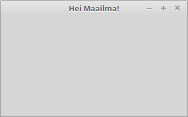

<text-box variant='learningObjectives' name='Oppimistavoitteet'>

- Tiedät mistä käyttöliittymät koostuvat ja osaat käynnistää graafisen käyttöliittymän.

</text-box>


Tutustutaan seuraavaksi graafisten käyttöliittymien luomiseen. Graafisia käyttöliittymiä luodessa hyödynnämme ensisijaisesti käyttöliittymäkirjastoja, jotka tarjoavat valmiita komponentteja kuten nappeja ja tekstikenttiä. Käyttöliittymäkirjastot hoitavat komponenttien piirtämisen puolestamme, eli meidän ei tarvitse piirtää jokaista käyttöliittymässä olevaa komponenttia ohjelmassamme -- riittää, että komponentit lisätään ohjelmaan.

Siinä missä tekstikäyttöliittymissä toiminnallisuus kytketään tietyn muotoiseen syötteeseen, graafisissa käyttöliittymissä toiminnallisuus lisätään käyttöliittymäkomponentteihin. Ohjelmoija esimerkiksi lisää käyttöliittymässä olevaan nappiin metodin, joka käsittelee napin painallukseen liittyvän tapahtuman.

Käytämme graafisten käyttöliittymien luomiseen Javan [JavaFx](https://en.wikipedia.org/wiki/JavaFX) käyttöliittymäkirjastoa. Toteuttamamme sovellukset ovat työpöytäsovelluksia.

<br/>

<text-box variant='hint' name='Graafiset käyttöliittymät ja tarvittavat kirjastot'>

Graafisten käyttöliittymien luomiseen käytetään JavaFX-nimistä kirjastoa. Linux-koneilla joudut -- riippuen Javan asennuksesta -- asentamaan myös openjfx-kirjaston. Tämän asentaminen onnistuu Ubuntussa (komentoriviltä) komennolla:

```bash
user@kone:~$ sudo apt-get install openjfx
```

Tehtäväpohjissa käytetään JavaFx-ohjelmien testaamiseen [TestFX](https://github.com/TestFX/TestFX/wiki)-nimistä apukirjastoa. Kirjasto tulee tehtäväpohjien mukana.

</text-box>

<text-box variant='hint' name='Tarvittavat oikeudet macOS:lla tehtävien testeihin'>

Tämän osan tehtävissä osa testeistä odottaa, että tmcbeans saa vapaasti liikuttaa kursoria näytöllä. macOS-käyttöjärjestelmällä (Apple-tietokoneet) tähän tarvitsee antaa erikseen tmcbeansille oikeus. Täältä löytyy ohjeet, miten oikeus myönnetään: [macOS ohjeet](/macos-ohjeet)

</text-box>

Yksinkertaisen ikkunan luominen onnistuu JavaFX:n avulla seuraavanlaisella ohjelmalla.


```java
package sovellus;

import javafx.application.Application;
import javafx.stage.Stage;

public class JavaFxSovellus extends Application {

    @Override
    public void start(Stage ikkuna) {
        ikkuna.setTitle("Hei Maailma!");
        ikkuna.show();
    }

    public static void main(String[] args) {
        launch(JavaFxSovellus.class);
    }
}
```


Kun ohjelman käynnistää, sovellus näyttää seuraavalta.





Mitä ohjelmassa oikein tapahtuu? Luokkamme JavaFxSovellus perii JavaFx-käyttöliittymäkirjaston luokan [Application](https://docs.oracle.com/javase/8/javafx/api/javafx/application/Application.html), joka tarjoaa rungon graafisten käyttöliittymien luomiseen. Sovellus käynnistetään Application-luokalta perittävällä metodilla [launch](https://docs.oracle.com/javase/8/javafx/api/javafx/application/Application.html#launch-java.lang.Class-java.lang.String...--), jolle annetaan parametrina käynnistettävän luokan nimi muodossa *LuokanNimi.class* -- yllä luokan nimi on JavaFxSovellus, joten metodille launch annetaan parametrina `JavaFxSovellus.class`.


Kun metodia launch kutsutaan, Application-luokassa sijaitseva metodi luo parametrina annetusta luokasta (tässä JavaFxSovellus) uuden olion ja kutsuu sen init-metodia. Metodi init on määritelty luokassa Application, ja sitä käytetään esimerkiksi ohjelmassa käytettävien olioiden alustamiseen. Metodin init kutsumisen jälkeen ohjelma kutsuu metodia start, joka saa parametrinaan ikkunaa kuvaavan [Stage](https://docs.oracle.com/javase/8/javafx/api/javafx/stage/Stage.html)-olion. Yllä tehdyssä start-metodin toteutuksessa parametrina saadulle Stage-tyyppiselle ikkunaoliolle asetetaan otsikko metodilla setTitle, jonka jälkeen kutsutaan ikkunan näyttämiseen johtavaa metodia show. Lopulta ohjelma jää kuuntelemaan käyttöliittymässä tapahtuvia tapahtumia kuten ikkunan sulkemista, joka johtaa sovelluksen sammumiseen.


<programming-exercise name='Sovellukseni' tmcname='osa13-Osa13_01.Sovellukseni'>

Luo tehtäväpohjassa olevaan luokkaan graafinen käyttöliittymä, jonka otsikkona on "Sovellukseni". Sovelluksen tulee käynnistyä kun main-metodi suoritetaan.

</programming-exercise>


## Käyttöliittymän rakenne

Graafiset käyttöliittymät koostuvat oleellisesti kolmesta osasta. Stage-olio toimii ohjelman ikkunana. Stage-oliolle asetetaan [Scene](https://docs.oracle.com/javase/8/javafx/api/javafx/scene/Scene.html)-olio, joka kuvastaa ikkunassa olevaa näkymää. Scene-olio taas sisältää näkymään liittyvien komponenttien asettelusta vastaavan olion (esim. FlowPane), joka taas sisältää konkreettiset käyttöliittymäkomponentit.

Alla oleva ohjelma luo käyttöliittymän, jossa on yksittäinen nappi.


```java
package sovellus;

import javafx.application.Application;
import javafx.scene.Scene;
import javafx.scene.control.Button;
import javafx.scene.layout.FlowPane;
import javafx.stage.Stage;

public class JavaFxSovellus extends Application {

    @Override
    public void start(Stage ikkuna) {
        Button nappi = new Button("Tämä on nappi");

        FlowPane komponenttiryhma = new FlowPane();
        komponenttiryhma.getChildren().add(nappi);

        Scene nakyma = new Scene(komponenttiryhma);

        ikkuna.setScene(nakyma);
        ikkuna.show();
    }

    public static void main(String[] args) {
        launch(JavaFxSovellus.class);
    }
}
```

Sovellus näyttää seuraavalta.


Käyttöliittymäkomponentit lisätään niiden asettelusta vastaavan olion -- edellä FlowPane -- "lapsiksi". Tämä liittyy JavaFx:n suunnittelussa tehtyyn päätökseen, missä jokainen käyttöliittymäkomponenttien asetteluun käytettävä olio voi sisältää muita käyttöliittymäkomponenttien asetteluun käytettäviä olioita sekä käyttöliittymäkomponentteja. Tämä mahdollistaa graafiset käyttöliittymät, joissa käyttöliittymäkomponenttien asettelutapa riippuu niiden paikasta käyttöliittymässä. Esimerkiksi käyttöliittymässä ylhäällä olevan valikon vaihtoehdot asetetaan yleensä vierekkäin, kun taas listattavat asiat allekkain.


Käyttöliittymän rakenne on siis lyhyesti seuraava. Ikkuna sisältää Scene-olion. Scene-olio sisältää käyttöliittymäkomponenttien asettelusta vastaavan olion. Käyttöliittymäkomponenttien asettelusta vastaava olio voi sisältää sekä käyttöliitymäkomponentteja, että käyttöliittymäkomponenttien asettelusta vastaavia olioita.
