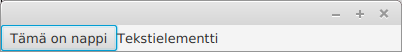
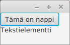
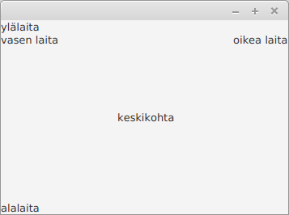
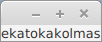
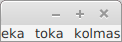
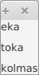
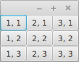
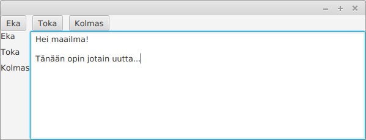

<text-box variant='learningObjectives' name='Oppimistavoitteet'>

- Tiedät mistä käyttöliittymät koostuvat ja osaat käynnistää graafisen käyttöliittymän.
- Tunnet muutamia käyttöliittymäkomponentteja ja osaat lisätä niitä käyttöliittymään.
- Tunnet menetelmiä käyttöliittymäkomponenttien asetteluun.

</text-box>


Graafisia käyttöliittymiä luodessa ohjelmoijat tyypillisesti hyödyntävät valmiiden käyttöliittymäkirjastojen tarjoamia osia sovellusten laatimiseen. Ohjelmoijan ei esimerkiksi kannata toteuttaa käyttöliittymän nappia tyhjästä (eli luoda luokkaa, joka piirtää napin sekä mahdollistaa siihen liittyvien toiminnallisuuksien käsittelyn), sillä vastaava komponentti löytyy yleensä käyttöliittymäkirjastoista valmiina. Tutustutaan seuraavaksi muutamaan käyttöliittymäkomponenttiin.


Tekstin näyttäminen tapahtuu [Label](https://docs.oracle.com/javase/8/javafx/api/javafx/scene/control/Label.html)-luokan avulla. Label tarjoaa käyttöliittymäkomponentin, jolle voi asettaa tekstiä ja jonka sisältämää tekstiä voi muokata metodien avulla. Näytettävä teksti asetetaan joko konstruktorissa tai erillisellä `setText`-metodilla.


```java
package sovellus;

import javafx.application.Application;
import javafx.scene.Scene;
import javafx.scene.control.Label;
import javafx.scene.layout.FlowPane;
import javafx.stage.Stage;

public class JavaFxSovellus extends Application {

    @Override
    public void start(Stage ikkuna) {
        Label tekstikomponentti = new Label("Tekstielementti");

        FlowPane komponenttiryhma = new FlowPane();
        komponenttiryhma.getChildren().add(tekstikomponentti);

        Scene nakyma = new Scene(komponenttiryhma);

        ikkuna.setScene(nakyma);
        ikkuna.show();
    }

    public static void main(String[] args) {
        launch(JavaFxSovellus.class);
    }
}
```


Käyttöliittymään saa painikkeita [Button](https://docs.oracle.com/javase/8/javafx/api/javafx/scene/control/Button.html)-luokan avulla. Napin lisääminen käyttöliittymään tapahtuu aivan kuten tekstikomponentin lisääminen.


```java
package sovellus;

import javafx.application.Application;
import javafx.scene.Scene;
import javafx.scene.control.Button;
import javafx.scene.layout.FlowPane;
import javafx.stage.Stage;

public class JavaFxSovellus extends Application {

    @Override
    public void start(Stage ikkuna) {
        Button nappikomponentti = new Button("Tämä on nappi");

        FlowPane komponenttiryhma = new FlowPane();
        komponenttiryhma.getChildren().add(nappikomponentti);

        Scene nakyma = new Scene(komponenttiryhma);

        ikkuna.setScene(nakyma);
        ikkuna.show();
    }

    public static void main(String[] args) {
        launch(JavaFxSovellus.class);
    }
}
```


Sovellukseen voi lisätä myös useampia käyttöliittymäelementtejä samaan aikaan. Alla käytössä on sekä nappi että tekstikomponentti.


```java
package sovellus;

import javafx.application.Application;
import javafx.scene.Scene;
import javafx.scene.control.Button;
import javafx.scene.control.Label;
import javafx.scene.layout.FlowPane;
import javafx.stage.Stage;

public class JavaFxSovellus extends Application {

    @Override
    public void start(Stage ikkuna) {
        Button nappikomponentti = new Button("Tämä on nappi");
        Label tekstikomponentti = new Label("Tekstielementti");

        FlowPane komponenttiryhma = new FlowPane();
        komponenttiryhma.getChildren().add(nappikomponentti);
        komponenttiryhma.getChildren().add(tekstikomponentti);

        Scene nakyma = new Scene(komponenttiryhma);

        ikkuna.setScene(nakyma);
        ikkuna.show();
    }

    public static void main(String[] args) {
        launch(JavaFxSovellus.class);
    }
}
```


Sovellus näyttää seuraavalta.





Osoitteessa [https://docs.oracle.com/javase/8/javafx/user-interface-tutorial/](https://docs.oracle.com/javase/8/javafx/user-interface-tutorial/) on listattuna joukko valmiita käyttöliittymäkomponentteja. Sivu tarjoaa myös esimerkkejä käyttöliittymäkomponenttien käytöstä.

Käyttöliittymäkomponentteja on huomattava määrä. Niiden opiskeluun kannattaa käyttää verkossa olevia valmiita oppaita kuten edellä mainittua verkkosivua. Käyttöliittymäkomponentteja kannattaa kokeilla aluksi erikseen siten, että kokeilee yhden komponentin lisäämistä ja tarkastelee sen toimintaa.

<quiz id='254bde42-2c3b-5a3b-a0c6-60df57d0cd46'></quiz>

Kun yksittäiset komponentit tulevat tutuksi, on niiden käyttäminen suoraviivaisempaa. Lähes kaikille komponenteille yhteistä on se, miten ne lisätään sovellukseen. Kun osaat lisätä yhden komponentin käyttöliittymään, osaat lisätä käytännössä lähes kaikki komponentit käyttöliittymään.

Ainoa merkittävä ero käyttöliittymäkomponenttien lisäämisessä liittyy siihen, että mihin kohtaan käyttöliittymää komponentin haluaa lisätä. Tarkastellaan käyttöliittymäkomponenttien asettelua kohta.


<programming-exercise name='Nappi ja tekstielementti' tmcname='osa13-Osa13_02.NappiJaTekstielementti'>

Luo edellistä esimerkkiä seuraten tehtäväpohjassa olevaan luokkaan käyttöliittymä, jossa on nappi (Button) ja tekstikomponentti (Label). Napin tulee olla tekstikomponentin vasemmalla puolella tai yläpuolella.

</programming-exercise>


<programming-exercise name='Nappi ja tekstikenttä' tmcname='osa13-Osa13_03.NappiJaTekstikentta'>

Luo tehtäväpohjassa olevaan luokkaan graafinen käyttöliittymä, jossa on nappi ja tekstikenttä. Tekstikentän saa toteutettua luokalla [TextField](https://docs.oracle.com/javase/8/javafx/api/javafx/scene/control/TextField.html). Napin tulee olla tekstikentän vasemmalla puolella tai yläpuolella.

</programming-exercise>


## Käyttöliittymäkomponenttien asettelu


Jokaisella käyttöliittymäkomponentilla on käyttöliittymässä sijainti. Komponentin sijainnin määrää käytössä oleva käyttöliittymäkomponenttien asetteluun käytettävä luokka.

Edellisissä esimerkeissä käytimme käyttöliittymäkomponenttien asetteluun [FlowPane](https://docs.oracle.com/javase/8/javafx/api/javafx/scene/layout/FlowPane.html)-nimistä luokkaa. FlowPanen avulla käyttöliittymään lisättävät komponentit tulevat vierekkäin. Jos ikkunan koko pienenee siten, että kaikki komponentit eivät mahdu vierekkäin, rivitetään komponentit automaattisesti. Alla olevassa kuvassa edellisen esimerkin tuottamaa sovellusta on kavennettu, jolloin komponentit ovat rivittyneet automaattisesti.




### BorderPane

[BorderPane](https://docs.oracle.com/javase/8/javafx/api/javafx/scene/layout/BorderPane.html)-luokan avulla käyttöliittymäkomponentit voidaan asetella viiteen pääkohtaan käyttöliittymässä: ylälaita, oikea laita, alalaita, vasen laita ja keskikohta. Perinteiset sovellukset, kuten käyttämäsi web-selain hyödyntävät tätä asettelua. Ylälaidassa on valikko sekä osoiterivi, ja keskellä on sivun sisältö.


```java
package sovellus;

import javafx.application.Application;
import javafx.scene.Scene;
import javafx.scene.control.Label;
import javafx.scene.layout.BorderPane;
import javafx.stage.Stage;

public class JavaFxSovellus extends Application {

    @Override
    public void start(Stage ikkuna) {
        BorderPane asettelu = new BorderPane();
        asettelu.setTop(new Label("ylälaita"));
        asettelu.setRight(new Label("oikea laita"));
        asettelu.setBottom(new Label("alalaita"));
        asettelu.setLeft(new Label("vasen laita"));
        asettelu.setCenter(new Label("keskikohta"));

        Scene nakyma = new Scene(asettelu);

        ikkuna.setScene(nakyma);
        ikkuna.show();
    }

    public static void main(String[] args) {
        launch(JavaFxSovellus.class);
    }
}
```




<programming-exercise name='BorderPane' tmcname='osa13-Osa13_04.BorderPane'>

Luo tehtäväpohjassa olevaan luokkaan graafinen käyttöliittymä, joka käyttää BorderPane-luokkaa käyttöliittymäkomponenttien asetteluun. Lisää ylälaitaan tekstikomponentti, jossa on teksti "NORTH", oikeaan laitaan tekstikomponentti, jossa on teksti "EAST", ja alalaitaan tekstikomponentti, jossa on teksti "SOUTH".

</programming-exercise>


### HBox

[HBox](https://docs.oracle.com/javase/8/javafx/api/javafx/scene/layout/HBox.html)-luokan avulla käyttöliittymäkomponentit asetellaan riviin.


```java
@Override
public void start(Stage ikkuna) {
    HBox asettelu = new HBox();

    asettelu.getChildren().add(new Label("eka"));
    asettelu.getChildren().add(new Label("toka"));
    asettelu.getChildren().add(new Label("kolmas"));

    Scene nakyma = new Scene(asettelu);

    ikkuna.setScene(nakyma);
    ikkuna.show();
}
```




Kuten edellisestä esimerkistä huomaa, HBox asettaa käyttöliittymäkomponentit oletuksena täysin toisiinsa kiinni. Metodin setSpacing avulla käyttöliittymäkomponenttien väliin saa tyhjää.


```java
@Override
public void start(Stage ikkuna) {
    HBox asettelu = new HBox();
    asettelu.setSpacing(10);

    asettelu.getChildren().add(new Label("eka"));
    asettelu.getChildren().add(new Label("toka"));
    asettelu.getChildren().add(new Label("kolmas"));

    Scene nakyma = new Scene(asettelu);

    ikkuna.setScene(nakyma);
    ikkuna.show();
}
```




Luokka [VBox](https://docs.oracle.com/javase/8/javafx/api/javafx/scene/layout/VBox.html) toimii vastaavasti, mutta asettelee käyttöliittymäkomponentit allekkain.





### GridPane

[GridPane](https://docs.oracle.com/javafx/2/api/javafx/scene/layout/GridPane.html)-luokan avulla käyttöliittymäkomponentit asetellaan ruudukkoon. Alla olevassa esimerkissä luodaan 3x3-kokoinen ruudukko, jossa jokaisessa ruudussa on nappi.


```java
@Override
public void start(Stage ikkuna) {
    GridPane asettelu = new GridPane();

    for (int x = 1; x <= 3; x++) {
        for (int y = 1; y <= 3; y++) {
            asettelu.add(new Button("" + x + ", " + y), x, y);
        }
    }

    Scene nakyma = new Scene(asettelu);

    ikkuna.setScene(nakyma);
    ikkuna.show();
}
```




### Useampi asettelija samassa

Käyttöliittymäkomponenttien asettelijoita voi myös yhdistellä. Tyypillinen ratkaisu on BorderPane-asettelun käyttäminen pohjalla, jonka sisälle asetetaan muita asetteluja. Alla olevassa esimerkissä BorderPanen ylälaidassa on samalle riville asetteluun käytetty HBox ja vasemmassa laidassa allekkain asetteluun käytetty VBox. Keskelle on laitettu tekstikenttä.


```java
package sovellus;

import javafx.application.Application;
import javafx.scene.Scene;
import javafx.scene.control.Button;
import javafx.scene.control.Label;
import javafx.scene.control.TextArea;
import javafx.scene.layout.BorderPane;
import javafx.scene.layout.HBox;
import javafx.scene.layout.VBox;
import javafx.stage.Stage;

public class JavaFxSovellus extends Application {

    @Override
    public void start(Stage ikkuna) {
        BorderPane asettelu = new BorderPane();

        HBox napit = new HBox();
        napit.setSpacing(10);
        napit.getChildren().add(new Button("Eka"));
        napit.getChildren().add(new Button("Toka"));
        napit.getChildren().add(new Button("Kolmas"));

        VBox tekstit = new VBox();
        tekstit.setSpacing(10);
        tekstit.getChildren().add(new Label("Eka"));
        tekstit.getChildren().add(new Label("Toka"));
        tekstit.getChildren().add(new Label("Kolmas"));

        asettelu.setTop(napit);
        asettelu.setLeft(tekstit);

        asettelu.setCenter(new TextArea(""));

        Scene nakyma = new Scene(asettelu);

        ikkuna.setScene(nakyma);
        ikkuna.show();
    }

    public static void main(String[] args) {
        launch(JavaFxSovellus.class);
    }
}
```




<programming-exercise name='Tekstitilastointia' tmcname='osa13-Osa13_05.Tekstitilastointia'>

Luo tehtäväpohjassa olevaan luokkaan sovellus, joka käyttää BorderPane-luokkaa asetteluun. Keskellä tulee olla TextArea-luokasta luotu tekstikenttä, ja alalaidassa kolme tekstikomponenttia. Aseta alalaidan tekstikomponentit HBox-olion sisään. Ensimmäisessä tekstikomponentissa tulee olla teksti "Kirjaimia: 0". Toisessa tekstikomponentissa tulee olla teksti "Sanoja: 0". Kolmannessa tekstikomponentissa tulee olla teksti "Pisin sana on:".


</programming-exercise>
