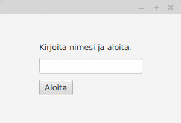
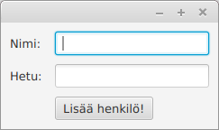
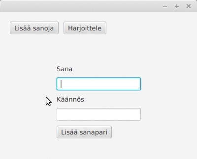

<text-box variant='learningObjectives' name='Oppimistavoitteet'>

- Harjoittelet useamman näkymän lisäämistä graafiseen käyttöliittymään.
- Tunnet näkymän vaihtamiseen käytettäviä menetelmiä.
- Tunnet menetelmiä sovelluslogiikan ja käyttöliittymälogiikan eriyttämiseen.

</text-box>


Tähän mennessä toteuttamamme graafiset käyttöliittymät ovat sisältäneet aina yhden näkymän. Tutustutaan seuraavaksi useampia näkymiä sisältäviin käyttöliittymiin.


Yleisesti ottaen näkymät luodaan Scene-olion avulla, joiden välillä siirtyminen tapahtuu sovellukseen kytkettyjen tapahtumien avulla. Alla olevassa esimerkissä on luotu kaksi erillistä Scene-oliota, joista kummallakin on oma sisältö sekä sisältöön liittyvä tapahtuma. Alla Scene-olioihin ei ole erikseen liitetty käyttöliittymän asetteluun käytettyä komponenttia (esim. BorderPane), vaan kummassakin Scene-oliossa on täsmälleen yksi käyttöliittymäkomponentti.


```java
package sovellus;

import javafx.application.Application;
import javafx.scene.Scene;
import javafx.scene.control.Button;
import javafx.stage.Stage;

public class EdesTakaisinSovellus extends Application {

  @Override
  public void start(Stage ikkuna) {

      Button edes = new Button("Edes ..");
      Button takaisin = new Button(".. takaisin.");

      Scene eka = new Scene(edes);
      Scene toka = new Scene(takaisin);

      edes.setOnAction((event) -> {
          ikkuna.setScene(toka);
      });

      takaisin.setOnAction((event) -> {
          ikkuna.setScene(eka);
      });

      ikkuna.setScene(eka);
      ikkuna.show();
  }

  public static void main(String[] args) {
      launch(EdesTakaisinSovellus.class);
  }
}
```


Edellä olevan sovelluksen käynnistäminen luo käyttöliittymän, jossa siirtyminen näkymästä toiseen onnistuu nappia painamalla.


<programming-exercise name='Useampi Näkymä' tmcname='osa13-Osa13_09.UseampiNakyma'>

Luo tehtäväpohjassa olevaan luokkaan UseampiNakyma sovellus, joka sisältää kolme erillistä näkymää. Näkymät ovat seuraavat:

- Ensimmäinen näkymä on aseteltu BorderPane-luokan avulla. Ylälaidassa on teksti "Eka näkymä!". Keskellä on nappi, jossa on teksti "Tokaan näkymään!", ja jota painamalla siirrytään toiseen näkymään.
- Toinen näkymä on aseteltu VBox-luokan avulla. Asettelussa tulee ensin nappi, jossa on teksti "Kolmanteen näkymään!", ja jota painamalla siirrytään kolmanteen näkymään. Nappia seuraa teksti "Toka näkymä!".
- Kolmas näkymä on aseteltu GridPane-luokan avulla. Asettelussa tulee koordinaatteihin (0,0) teksti "Kolmas näkymä!". Koordinaatteihin (1,1) tulee nappi, jossa on teksti "Ekaan näkymään!", ja jota painamalla siirrytään ensimmäiseen näkymään.

Sovelluksen tulee käynnistyessään näyttää ensimmäinen näkymä.

</programming-exercise>


## Oma asettelu jokaista näkymää varten


Tutustutaan seuraavaksi kaksi erillistä näkymää sisältävään esimerkkiin. Ensimmäisessä näkymässä käyttäjää pyydetään syöttämään salasana. Jos käyttäjä kirjoittaa väärän salasanan, väärästä salasanasta ilmoitetaan. Jos käyttäjä kirjoittaa oikean salasanan, ohjelma vaihtaa seuraavaan näkymään. Ohjelman toiminta on seuraavanlainen.


Näkymien välillä vaihtaminen tapahtuu kuten edellisessä esimerkissä. Konkreettinen vaihtotapahtuma on määritelty kirjautumisnappiin. Nappia painettaessa ohjelma tarkastaa salasanakenttään kirjoitetun salasanan -- tässä toivotaan, että käyttäjä kirjoittaa "salasana". Jos salasana on oikein, ikkunan näyttämä näkymä vaihdetaan. Esimerkissämme näkymä sisältää vain tekstin "Tervetuloa, tästä se alkaa!".


```java
package sovellus;

import javafx.application.Application;
import javafx.geometry.Insets;
import javafx.geometry.Pos;
import javafx.scene.Scene;
import javafx.scene.control.Button;
import javafx.scene.control.Label;
import javafx.scene.control.PasswordField;
import javafx.scene.layout.GridPane;
import javafx.scene.layout.StackPane;
import javafx.stage.Stage;

public class SalattuSovellus extends Application {

  @Override
  public void start(Stage ikkuna) throws Exception {

      // 1. Luodaan salasanan kysymiseen käytetty näkymä

      // 1.1 luodaan käytettävät komponentit
      Label ohjeteksti = new Label("Kirjoita salasana ja paina kirjaudu");
      PasswordField salasanakentta = new PasswordField();
      Button aloitusnappi = new Button("Kirjaudu");
      Label virheteksti = new Label("");

      // 1.2 luodaan asettelu ja lisätään komponentit siihen
      GridPane asettelu = new GridPane();

      asettelu.add(ohjeteksti, 0, 0);
      asettelu.add(salasanakentta, 0, 1);
      asettelu.add(aloitusnappi, 0, 2);
      asettelu.add(virheteksti, 0, 3);

      // 1.3 tyylitellään asettelua
      asettelu.setPrefSize(300, 180);
      asettelu.setAlignment(Pos.CENTER);
      asettelu.setVgap(10);
      asettelu.setHgap(10);
      asettelu.setPadding(new Insets(20, 20, 20, 20));

      // 1.4 luodaan itse näkymä ja asetetaan asettelu siihen
      Scene salasanaNakyma = new Scene(asettelu);


      // 2. Luodaan tervetuloa-tekstin näyttämiseen käytetty näkymä
      Label tervetuloaTeksti = new Label("Tervetuloa, tästä se alkaa!");

      StackPane tervetuloaAsettelu = new StackPane();
      tervetuloaAsettelu.setPrefSize(300, 180);
      tervetuloaAsettelu.getChildren().add(tervetuloaTeksti);
      tervetuloaAsettelu.setAlignment(Pos.CENTER);

      Scene tervetuloaNakyma = new Scene(tervetuloaAsettelu);


      // 3. Lisätään salasanaruudun nappiin tapahtumankäsittelijä
      //    näkymää vaihdetaan jos salasana on oikein
      aloitusnappi.setOnAction((event) -> {
          if (!salasanakentta.getText().trim().equals("salasana")) {
              virheteksti.setText("Tuntematon salasana!");
              return;
          }

          ikkuna.setScene(tervetuloaNakyma);
      });

      ikkuna.setScene(salasanaNakyma);
      ikkuna.show();
  }

  public static void main(String[] args) {
      launch(SalattuSovellus.class);
  }
}
```


Esimerkissä on hyödynnetty sekä GridPanen että StackPanen asettelussa niiden tarjoamia setPrefSize ja setAlignment-metodeja. Metodilla setPrefSize annetaan asettelulle toivottu koko, ja metodilla setAlignment kerrotaan miten asettelun sisältö tulee ryhmittää. Parametrilla Pos.CENTER toivotaan asettelua näkymän keskelle.


<programming-exercise name='Tervehtijä' tmcname='osa13-Osa13_10.Tervehtija'>

Luo tehtäväpohjassa olevaan luokkaan TervehtijaSovellus sovellus, jossa on kaksi näkymää. Ensimmäisessä näkymässä on tekstikenttä, jolla kysytään käyttäjän nimeä. Toisessa näkymässä käyttäjälle näytetään tervehdysteksti. Tervehdystekstin tulee olla muotoa "Tervetuloa nimi!", missä nimen paikalle tulee käyttäjän kirjoittama nimi.

Esimerkki sovelluksen toiminnasta:



</programming-exercise>


## Sama pääasettelu näkymillä

Riippuen sovelluksen käyttötarpeesta, joskus sovellukselle halutaan pysyvä näkymä, jonka osia vaihdetaan tarvittaessa. Jonkinlaisen valikon tarjoavat ohjelmat toimivat tyypillisesti tällä tavalla.

Alla olevassa esimerkissä on luotu sovellus, joka sisältää päävalikon sekä vaihtuvasisältöisen alueen. Vaihtuvasisältöisen alueen sisältö vaihtuu päävalikon nappeja painamalla.


```java
package sovellus;

import javafx.application.Application;
import javafx.geometry.Insets;
import javafx.geometry.Pos;
import javafx.scene.Scene;
import javafx.scene.control.Button;
import javafx.scene.control.Label;
import javafx.scene.layout.BorderPane;
import javafx.scene.layout.HBox;
import javafx.scene.layout.StackPane;
import javafx.stage.Stage;

public class EsimerkkiSovellus extends Application {

    @Override
    public void start(Stage ikkuna) throws Exception {

        // 1. Luodaan päätason asettelu
        BorderPane asettelu = new BorderPane();

        // 1.1. Luodaan päätason asettelun valikko
        HBox valikko = new HBox();
        valikko.setPadding(new Insets(20, 20, 20, 20));
        valikko.setSpacing(10);

        // 1.2. Luodaan valikon napit
        Button eka = new Button("Eka");
        Button toka = new Button("Toka");

        // 1.3. Lisätään napit valikkoon
        valikko.getChildren().addAll(eka, toka);

        asettelu.setTop(valikko);


        // 2. Luodaan alinäkymät ja kytketään ne valikon nappeihin
        // 2.1. Luodaan alinäkymät -- tässä asettelut
        StackPane ekaAsettelu = luoNakyma("Eka näkymä!");
        StackPane tokaAsettelu = luoNakyma("Toka näkymä!");

        // 2.2. Liitetään alinäkymät nappeihin. Napin painaminen vaihtaa alinäkymää.
        eka.setOnAction((event) -> asettelu.setCenter(ekaAsettelu));
        toka.setOnAction((event) -> asettelu.setCenter(tokaAsettelu));

        // 2.3. Näytetään aluksi ekaAsettelu
        asettelu.setCenter(ekaAsettelu);


        // 3. Luodaan päänäkymä ja asetetaan päätason asettelu siihen
        Scene nakyma = new Scene(asettelu);


        // 4. Näytetään sovellus
        ikkuna.setScene(nakyma);
        ikkuna.show();
    }

    private StackPane luoNakyma(String teksti) {

        StackPane asettelu = new StackPane();
        asettelu.setPrefSize(300, 180);
        asettelu.getChildren().add(new Label(teksti));
        asettelu.setAlignment(Pos.CENTER);

        return asettelu;
    }

    public static void main(String[] args) {
        launch(EsimerkkiSovellus.class);
    }
}
```


Sovellus toimii seuraavalla tavalla:


<programming-exercise name='Vitsi' tmcname='osa13-Osa13_11.Vitsi'>

Luo tehtäväpohjassa olevaan luokkaan VitsiSovellus sovellus, jota käytetään yhden vitsin selittämiseen. Sovellus tarjoaa kolme nappia sisältävän valikon sekä näitä nappeja painamalla näytettävät sisällöt. Ensimmäinen nappi (teksti "Vitsi") näyttää vitsiin liittyvän kysymyksen, toinen nappi (teksti "Vastaus") näyttää vitsin kysymykseen liittyvän vastauksen, ja kolmas nappi (teksti "Selitys") näyttää vitsin selityksen.

Oletuksena (kun sovellus käynnistyy) sovelluksen tulee näyttää vitsiin liittyvä kysymys. Käytä kysymyksenä merkkijonoa "What do you call a bear with no teeth?" ja vastauksena merkkijonoa "A gummy bear.". Saat päättää selityksen vapaasti.

</programming-exercise>


## Sovelluslogiikan ja käyttöliittymälogiikan eriyttäminen


Sovelluslogiikan (esimerkiksi ristinollan rivien tarkastamiseen tai vuorojen ylläpitoon liittyvä toiminnallisuus) ja käyttöliittymän pitäminen samassa luokassa tai samoissa luokissa on yleisesti ottaen huono asia. Se vaikeuttaa ohjelman testaamista ja muokkaamista huomattavasti ja tekee lähdekoodista myös vaikeammin luettavaa. Motto "Jokaisella luokalla pitäisi olla vain yksi selkeä vastuu" pätee hyvin tässäkin.


Tarkastellaan sovelluslogiikan erottamista käyttöliittymälogiikasta. Oletetaan, että käytössämme on seuraavan rajapinnan toteuttava olio ja haluamme toteuttaa käyttöliittymän henkilöiden tallentamiseen.


```java
public interface Henkilovarasto {
    void talleta(Henkilo henkilo);
    Henkilo hae(String henkilotunnus);

    void poista(Henkilo henkilo);
    void poista(String henkilotunnus);
    void poistaKaikki();

    Collection<Henkilo> haeKaikki();
}
```


Käyttöliittymää toteutettaessa hyvä aloitustapa on ensin käyttöliittymän piirtäminen, jota seuraa sopivien käyttöliittymäkomponenttien lisääminen käyttöliittymään. Henkilöiden tallennuksessa tarvitsemme kentät nimelle ja henkilötunnukselle sekä napin jolla henkilö voidaan lisätä. Käytetään luokkaa TextField nimen ja henkilötunnuksen syöttämiseen ja luokkaa Button napin toteuttamiseen. Luodaan käyttöliittymään lisäksi käyttöliittymän toiminnallisuutta selventävät Label-tyyppiset selitystekstit.


Käytetään käyttöliittymän asetteluun `GridPane`-asettelijaa. Rivejä käyttöliittymässä on 3, sarakkeita 2. Lisätään tapahtumien käsittelytoiminnallisuus myöhemmin. Käyttöliittymän alustusmetodi näyttää seuraavalta.


```java
@Override
public void start(Stage ikkuna) {

    Label nimiTeksti = new Label("Nimi: ");
    TextField nimiKentta = new TextField();
    Label hetuTeksti = new Label("Hetu: ");
    TextField hetuKentta = new TextField();

    Button lisaaNappi = new Button("Lisää henkilö!");

    GridPane komponenttiryhma = new GridPane();
    komponenttiryhma.add(nimiTeksti, 0, 0);
    komponenttiryhma.add(nimiKentta, 1, 0);
    komponenttiryhma.add(hetuTeksti, 0, 1);
    komponenttiryhma.add(hetuKentta, 1, 1);
    komponenttiryhma.add(lisaaNappi, 1, 2);

    // tyylittelyä: lisätään tyhjää tilaa reunoille ym
    komponenttiryhma.setHgap(10);
    komponenttiryhma.setVgap(10);
    komponenttiryhma.setPadding(new Insets(10, 10, 10, 10));

    Scene nakyma = new Scene(komponenttiryhma);

    ikkuna.setScene(nakyma);
    ikkuna.show();
}
```




Luodaan seuraavaksi ohjelmaan ActionEvent-rajapinnan toteuttava olio, joka lisää kenttien arvot Henkilovarasto-rajapinnalle.


```java
@Override
public void start(Stage ikkuna) {
    // ...

    lisaaNappi.setOnAction((event) -> {
        henkilovarasto.talleta(new Henkilo(nimiTeksti.getText(), hetuTeksti.getText());
    });
    // ...
}
```

Mutta. Mistä saamme konkreettisen Henkilovarasto-olion? Se luodaan esimerkiksi start-metodin alussa. Alla annettuna koko sovelluksen runko.


```java
// pakkaus

import javafx.application.Application;
import javafx.geometry.Insets;
import javafx.scene.Scene;
import javafx.scene.control.Button;
import javafx.scene.control.Label;
import javafx.scene.control.TextField;
import javafx.scene.layout.GridPane;
import javafx.stage.Stage;

public class HenkiloSovellus extends Application {

    @Override
    public void start(Stage ikkuna) {
        Henkilovarasto henkilovarasto = new OmaHenkilovarasto();

        Label nimiTeksti = new Label("Nimi: ");
        TextField nimiKentta = new TextField();
        Label hetuTeksti = new Label("Hetu: ");
        TextField hetuKentta = new TextField();

        Button lisaaNappi = new Button("Lisää henkilö!");
        lisaaNappi.setOnAction((event) -> {
            Henkilo lisattava = new Henkilo(nimiTeksti.getText(), hetuTeksti.getText());
            henkilovarasto.talleta(new Henkilo(lisattava);
        });

        GridPane komponenttiryhma = new GridPane();
        komponenttiryhma.add(nimiTeksti, 0, 0);
        komponenttiryhma.add(nimiKentta, 1, 0);
        komponenttiryhma.add(hetuTeksti, 0, 1);
        komponenttiryhma.add(hetuKentta, 1, 1);
        komponenttiryhma.add(lisaaNappi, 1, 2);

        // tyylittelyä: lisätään tyhjää tilaa reunoille ym
        komponenttiryhma.setHgap(10);
        komponenttiryhma.setVgap(10);
        komponenttiryhma.setPadding(new Insets(10, 10, 10, 10));

        Scene nakyma = new Scene(komponenttiryhma);

        ikkuna.setScene(nakyma);
        ikkuna.show();
    }

    public static void main(String[] args) {
        launch(HenkiloSovellus.class);
    }
}
```


## Hieman suurempi sovellus: Sanaston harjoittelua

Hahmotellaan vieraiden sanojen harjoitteluun tarkoitettua sovellusta. Sovellus tarjoaa käyttäjälle kaksi toimintoa: sanojen ja niiden käännösten syöttämisen sekä harjoittelun. Luodaan sovellusta varten neljä erillistä luokkaa: ensimmäinen luokka tarjoaa sovelluksen ydinlogiikkatoiminnallisuuden eli sanakirjan ylläpidon, toinen ja kolmas luokka sisältävät syöttönäkymän ja harjoittelunäkymän, ja neljäs luokka sovelluksen päävalikon sekä sovelluksen käynnistämiseen tarvittavan toiminnallisuuden.


### Sanakirja

Sanakirja toteutetaan hajautustaulun ja listan avulla. Hajautustaulu sisältää sanat ja niiden käännökset, ja listaa käytetään satunnaisesti kysyttävän sanan arpomiseen. Luokalla on metodit käännösten lisäämiseen, käännöksen hakemiseen sekä käännettävän sanan arpomiseen.


```java
package sovellus;

import java.util.ArrayList;
import java.util.HashMap;
import java.util.List;
import java.util.Map;
import java.util.Random;

public class Sanakirja {

    private List<String> sanat;
    private Map<String, String> kaannokset;

    public Sanakirja() {
        this.sanat = new ArrayList<>();
        this.kaannokset = new HashMap<>();

        lisaa("sana", "word");
    }

    public String hae(String sana) {
        return this.kaannokset.get(sana);
    }

    public void lisaa(String sana, String kaannos) {
        if (!this.kaannokset.containsKey(sana)) {
            this.sanat.add(sana);
        }

        this.kaannokset.put(sana, kaannos);
    }

    public String arvoSana() {
        Random satunnainen = new Random();
        return this.sanat.get(satunnainen.nextInt(this.sanat.size()));
    }
}
```


Sanakirjan voisi toteuttaa myös niin, että sanan arpominen loisi aina uduen listan kaannokset-hajautustaulun avaimista. Tällöin sanat-listalle ei olisi erillistä tarvetta. Tämä vaikuttaisi kuitenkin sovelluksen tehokkuuteen (tai, olisi ainakin vaikuttanut ennen vuosituhannen vaihdetta -- nykyään koneet ovat jo hieman nopeampia..).


### Sanojen syöttäminen


Luodaan seuraavaksi sanojen syöttämiseen tarvittava toiminnallisuus. Sanojen syöttämistä varten tarvitsemme viitteen sanakirja-olioon sekä tekstikentät sanalle ja käännökselle. GridPane-asettelu sopii hyvin kenttien asetteluun. Luodaan luokka Syottonakyma, joka tarjoaa metodin getNakyma, joka luo sanojen syöttämiseen tarvittavan näkymän. Metodi palauttaa viitteen [Parent](https://docs.oracle.com/javase/8/javafx/api/javafx/scene/Parent.html)-tyyppiseen olioon. Parent on muunmuassa asetteluun käytettävien luokkien yläluokka, joten mitä tahansa asetteluun käytettävää luokkaa voidaan esittää Parent-oliona.


Luokka määrittelee myös käyttöliittymään liittyvän napinpainallustoiminnallisuuden. Kun käyttäjä painaa nappia, sanapari lisätään sanakirjaan. Samalla myös tekstikentät tyhjennetään seuraavan sanan syöttämistä varten.


```java
package sovellus;

import javafx.geometry.Insets;
import javafx.geometry.Pos;
import javafx.scene.Parent;
import javafx.scene.control.Button;
import javafx.scene.control.Label;
import javafx.scene.control.TextField;
import javafx.scene.layout.GridPane;

public class Syottonakyma {

    private Sanakirja sanakirja;

    public Syottonakyma(Sanakirja sanakirja) {
        this.sanakirja = sanakirja;
    }

    public Parent getNakyma() {
        GridPane asettelu = new GridPane();

        Label sanaohje = new Label("Sana");
        TextField sanakentta = new TextField();
        Label kaannosohje = new Label("Käännös");
        TextField kaannoskentta = new TextField();

        asettelu.setAlignment(Pos.CENTER);
        asettelu.setVgap(10);
        asettelu.setHgap(10);
        asettelu.setPadding(new Insets(10, 10, 10, 10));

        Button lisaanappi = new Button("Lisää sanapari");

        asettelu.add(sanaohje, 0, 0);
        asettelu.add(sanakentta, 0, 1);
        asettelu.add(kaannosohje, 0, 2);
        asettelu.add(kaannoskentta, 0, 3);
        asettelu.add(lisaanappi, 0, 4);

        lisaanappi.setOnMouseClicked((event) -> {
            String sana = sanakentta.getText();
            String kaannos = kaannoskentta.getText();

            sanakirja.lisaa(sana, kaannos);

            sanakentta.clear();
            kaannoskentta.clear();
        });

        return asettelu;
    }
}
```


### Sanaharjoittelu


Luodaan tämän jälkeen harjoitteluun tarvittava toiminnallisuus. Harjoittelua varten tarvitsemme myös viitteen sanakirja-olioon, jotta voimme hakea harjoiteltavia sanoja sekä tarkastaa käyttäjän syöttämien käännösten oikeellisuuden. Sanakirjan lisäksi tarvitsemme tekstin, jonka avulla kysytään sanaa, sekä tekstikentän, johon käyttäjä voi syöttää käännöksen. Myös tässä GridPane sopii hyvin kenttien asetteluun.


Kullakin hetkellä harjoiteltava sana on luokalla oliomuuttujana. Oliomuuttujaa voi käsitellä ja muuttaa myös tapahtumankäsittelijän yhteyteen määrittelyssä metodissa.


```java
package sovellus;

import javafx.geometry.Insets;
import javafx.geometry.Pos;
import javafx.scene.Parent;
import javafx.scene.control.Button;
import javafx.scene.control.Label;
import javafx.scene.control.TextField;
import javafx.scene.layout.GridPane;

public class Harjoittelunakyma {

    private Sanakirja sanakirja;
    private String sana;

    public Harjoittelunakyma(Sanakirja sanakirja) {
        this.sanakirja = sanakirja;
        this.sana = sanakirja.arvoSana();
    }

    public Parent getNakyma() {
        GridPane asettelu = new GridPane();

        Label sanaohje = new Label("Käännä sana '" + this.sana + "'");
        TextField kaannoskentta = new TextField();

        asettelu.setAlignment(Pos.CENTER);
        asettelu.setVgap(10);
        asettelu.setHgap(10);
        asettelu.setPadding(new Insets(10, 10, 10, 10));

        Button lisaanappi = new Button("Tarkista");

        Label palaute = new Label("");

        asettelu.add(sanaohje, 0, 0);
        asettelu.add(kaannoskentta, 0, 1);
        asettelu.add(lisaanappi, 0, 2);
        asettelu.add(palaute, 0, 3);

        lisaanappi.setOnMouseClicked((event) -> {
            String kaannos = kaannoskentta.getText();
            if (sanakirja.hae(sana).equals(kaannos)) {
                palaute.setText("Oikein!");
            } else {
                palaute.setText("Väärin! Sanan '" + sana + "' käännös on '" + sanakirja.hae(sana) + "'.");
                return;
            }

            this.sana = this.sanakirja.arvoSana();
            sanaohje.setText("Käännä sana '" + this.sana + "'");
            kaannoskentta.clear();
        });

        return asettelu;
    }
}
```


### Harjoittelusovellus


Harjoittelusovellus sekä nitoo edellä toteutetut luokat yhteen että tarjoaa sovelluksen valikon. Harjoittelusovelluksen rakenne on seuraava.


```java
package sovellus;

import javafx.application.Application;
import javafx.geometry.Insets;
import javafx.scene.Scene;
import javafx.scene.control.Button;
import javafx.scene.layout.BorderPane;
import javafx.scene.layout.HBox;
import javafx.stage.Stage;

public class HarjoitteluSovellus extends Application {

    private Sanakirja sanakirja;

    @Override
    public void init() throws Exception {
        // 1. Luodaan sovelluksen käyttämä sanakirja
        this.sanakirja = new Sanakirja();
    }

    @Override
    public void start(Stage ikkuna) throws Exception {
        // 2. Luodaan näkymät ("alinäkymät")
        Harjoittelunakyma harjoittelunakyma = new Harjoittelunakyma(sanakirja);
        Syottonakyma syottonakyma = new Syottonakyma(sanakirja);

        // 3. Luodaan päätason asettelu
        BorderPane asettelu = new BorderPane();

        // 3.1. Luodaan päätason asettelun valikko
        HBox valikko = new HBox();
        valikko.setPadding(new Insets(20, 20, 20, 20));
        valikko.setSpacing(10);

        // 3.2. Luodaan valikon napit
        Button lisaanappi = new Button("Lisää sanoja");
        Button harjoittelenappi = new Button("Harjoittele");

        // 3.3. Lisätään napit valikkoon
        valikko.getChildren().addAll(lisaanappi, harjoittelenappi);
        asettelu.setTop(valikko);

        // 4. Liitetään alinäkymät nappeihin. Napin painaminen vaihtaa alinäkymää.
        lisaanappi.setOnAction((event) -> asettelu.setCenter(syottonakyma.getNakyma()));
        harjoittelenappi.setOnAction((event) -> asettelu.setCenter(harjoittelunakyma.getNakyma()));

        // 5. Näytetään ensin syöttönäkymä
        asettelu.setCenter(syottonakyma.getNakyma());

        // 6. Luodaan päänäkymä ja asetetaan päätason asettelu siihen
        Scene nakyma = new Scene(asettelu, 400, 300);

        // 7. Näytetään sovellus
        ikkuna.setScene(nakyma);
        ikkuna.show();
    }

    public static void main(String[] args) {
        launch(HarjoitteluSovellus.class);
    }
}
```

<programming-exercise name='Sanojen harjoittelua' tmcname='osa13-Osa13_12.SanojenHarjoittelu'>

Tässä tehtävässä laadit edellä olevaa materiaalia noudattaen sanojen harjoitteluun tarkoitetun sovelluksen. Sovelluksen tulee käynnistyä kun luokan SanaharjoitteluSovellus main-metodi suoritetaan.

Luo edellistä esimerkkiä noudattaen sanojen harjoitteluun tarkoitettu sovellus. Sanojen harjoitteluun tarkoitetun sovelluksen tulee tarjota kaksi näkymää. Ensimmäisessä näkymässä käyttäjä voi syöttää alkuperäisiä sanoja ja niiden käännöksiä. Toisessa näkymässä käyttäjältä kysytään sanojen käännöksiä. Harjoiteltavat sanat tulee aina arpoa kaikista syötetyistä sanoista.

Käyttöliittymästä tarkemmin. Sanojen syöttämisnäkymän näyttävän napin tekstin tulee olla "Lisää sanoja". Sanojen harjoittelunäkymän näyttävän napin tekstin tulee olla "Harjoittele". Sanoja syötettäessä ensimmäisen tekstikentän tulee olla sana alkuperäiskielellä, ja toisen tekstikentän tulee olla sana käännettynä. Syöttämiseen käytetyn napin tekstin tulee olla "Lisää sanapari". Harjoittelutilassa käyttäjältä kysytään aina sanoja alkuperäiskielellä ja hänen tulee kirjoittaa sanojen käännöksiä. Vastauksen tarkistamiseen käytetyn napin tekstin tulee olla "Tarkista". Jos vastaus on oikein, käyttöliittymässä näytetään teksti "Oikein!". Jos taas vastaus on väärin, käyttöliittymässä näytetään teksti "Väärin!" sekä tieto oikeasta vastausksesta.





Sovelluksessa ei ole automaattisia testejä -- palauta tehtävä kun sovellus toimii tehtävänannossa kuvatulla tavalla. Esimerkkiratkaisuun on hahmoteltu ensiaskeleita myös mahdollisesta tilastotoiminnallisuudesta, joka ei kuitenkaan ole oleellista tehtävän tavoitteiden kannalta.

</programming-exercise>


<programming-exercise name='Ristinolla (3 osaa)' tmcname='osa13-Osa13_13.Ristinolla'>

Tässä tehtävässä toteutat 3x3-kokoisen ristinollapelin. Tehtävä on jaettu kolmeen osaan: ensin luodaan käyttöliittymän osat, sitten nappien toiminnallisuus, ja lopuksi mahdollisuus pelin loppuun pelaamiseen.


Huom! Saat nappien merkit pysymään saman kokoisina sopivalla fontilla. Kuvakaappauksessa nappien käyttämä fontti on asetettu seuraavalla tavalla:

```java
Button nappi = new Button(" ");
nappi.setFont(Font.font("Monospaced", 40));
```


<h2>Käyttöliittymä</h2>

Muokkaa luokkaa RistinollaSovellus siten, että se käynnistää graafisen käyttöliittymän. Käytä käyttöliittymäkomponenttien asetteluun ensin BorderPane-luokkaa. Aseta BorderPanen ylälaitaan tekstikomponentti, joka sisältää tiedon vuorosta sekä pelin loppuessa tiedon pelin loppumisesta. Aseta BorderPanen keskelle GridPane, joka sisältää 9 nappia. GridPanessa tulee olla 3 riviä ja 3 saraketta, jolloin napit muodostavat 3x3-ruudukon.


<h2>Vuorojen vaihtaminen ja reilu peli</h2>

Pelissä pelaavat X ja O. Pelin aloittaa aina X. Lisää peliin toiminnallisuus, jossa nappia painamalla tilanne päivittyy siten, että nappiin asetetaan vuorossa olevan pelaajan merkki (jos on X:n vuoro, nappiin tulee teksti X). Tämän jälkeen vuoro siirtyy seuraavalle pelaajalle.

Pelin ylälaidassa olevan tekstikentän tulee kertoa aina vuorossa oleva pelaaja. Teksti on aluksi "Vuoro: X". Kun X pelaa vuoronsa, eli painaa jotain nappia, tekstiksi asetetaan "Vuoro: O". Tämän jälkeen kun O pelaa vuoronsa, tekstiksi asetetaan taas "Vuoro: X".

Huom! Jos pelaaja on jo pelannut tietyn ruudun, ei toinen pelaaja saa enää pelata sitä. Varmista, ettei vuoro muutu tilanteessa, jossa pelaaja yrittää pelata jo pelatun ruudun.

Huom2! Mahdollisesti kohtaamasi virhe "local variables referenced from a lambda expression must be final or effectively final" johtuu siitä, että rajapinnoista tehdyt oliot eivät voi käyttää metodin ulkopuolella määriteltyjä muuttujia. Voit "kiertää" virheen luomalla uudet muuttujat, joihin asetat ongelmalliset arvot juuri ennen niiden käyttöönottoa metodissa.


<h2>Pelin loppuun vieminen</h2>

Lisää peliin toiminnallisuus, jossa pelin voi pelata loppuun. Peli loppuu jos toinen pelaajista saa kolme samaa merkkiä riviin (pysty, vaaka, vino). Pelin loppuminen tulee ilmaista siten, että ylälaidassa on teksti "Loppu!". Tämän jälkeen pelin jatkaminen ei enää onnistu.

Tehtävän testit eivät ole kattavimmat. Pyri tekemään ohjelma ilman suurta testeihin tukeutumista.

</programming-exercise>
