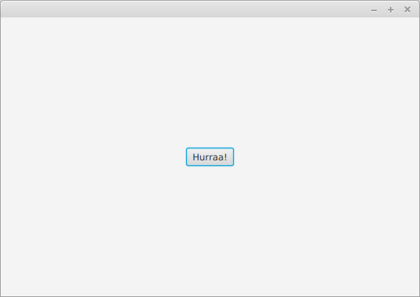

<text-box variant='learningObjectives' name='Oppimistavoitteet'>

- Tunnet menetelmiä multimedian käyttämiseen graafisissa käyttöliittymissä.
- Osaat piirtää graafiseen käyttöliittymään.
- Osaat näyttää kuvan graafisessa käyttöliittymässä.
- Osaat soittaa ääniä graafisessa käyttöliittymässä.

</text-box>


Tutustutaan seuraavaksi lyhyesti multimedian käyttöön JavaFX-sovelluksissa.


## Piirtäminen

JavaFX-käyttöliittymäkirjastossa piirtämiseen käytetään [Canvas](https://docs.oracle.com/javase/8/javafx/api/javafx/scene/canvas/Canvas.html)-oliota. Canvas-olio edustaa tyhjää taulua, johon voi piirtää. Piirtäminen tapahtuu Canvas-oliolta saatavalla [GraphicsContext](https://docs.oracle.com/javase/8/javafx/api/javafx/scene/canvas/GraphicsContext.html)-oliolla.


Alla olevassa esimerkissä on luotu yksinkertainen piirto-ohjelma. Ohjelmassa luodaan 640 pikseliä leveä ja 480 pikseliä korkea piirtoalusta, joka asetetaan BorderPane-asettelun keskelle. Tämän lisäksi luodaan piirtovärin valintaan käytettävä [ColorPicker](https://docs.oracle.com/javase/8/javafx/api/javafx/scene/control/ColorPicker.html)-olio, jolta saa tietoonsa kullakin hetkellä valittuna olevan värin. Värin valitsin asetetaan BorderPane-asettelun oikealle laidalle. Piirtoalustaan lisätään hiiren liikkumista kuunteleva tapahtuman käsittelijä. Kun hiirtä liikutetaan nappi pohjassa (onMouseDragged), kutsutaan GraphicsContext-olion värin asetusmetodia sekä piirretään hiiren kohtaan pieni ympyrä.

```java
// pakkaus

import javafx.application.Application;
import javafx.scene.Scene;
import javafx.scene.canvas.Canvas;
import javafx.scene.canvas.GraphicsContext;
import javafx.scene.control.ColorPicker;
import javafx.scene.layout.BorderPane;
import javafx.stage.Stage;

public class MiniPaint extends Application {

    @Override
    public void start(Stage ikkuna) {

        Canvas piirtoalusta = new Canvas(640, 480);
        GraphicsContext piirturi = piirtoalusta.getGraphicsContext2D();

        ColorPicker varinValitsin = new ColorPicker();

        BorderPane asettelu = new BorderPane();
        asettelu.setCenter(piirtoalusta);
        asettelu.setRight(varinValitsin);

        piirtoalusta.setOnMouseDragged((event) -> {
            double kohtaX = event.getX();
            double kohtaY = event.getY();
            piirturi.setFill(varinValitsin.getValue());
            piirturi.fillOval(kohtaX, kohtaY, 4, 4);
        });

        Scene nakyma = new Scene(asettelu);

        ikkuna.setScene(nakyma);
        ikkuna.show();
    }

    public static void main(String[] args) {
        launch(MiniPaint.class);
    }
}
```


Sovellus näyttää seuraavanlaiselta. Alla sovellusta on käytetty jo hieman piirtämiseen.


<programming-exercise name='Hymiö' tmcname='osa14-Osa14_06.Hymio'>

Luo tehtäväpohjassa olevaan luokkaan graafinen käyttöliittymä. Lisää graafiseen käyttöliittymään asettelusta vastaava BorderPane-olio. Lisää BorderPanen keskellä Canvas-olio. Piirrä tämän jälkeen Canvas-olioon liittyvän GraphicsContext-olion avulla hymiö. Käytä taustan värinä valkoista (Color.WHITE) ja hymiön värinä mustaa (Color.BLACK).

Tehtävän testit tarkastavat vain, että piirrät ikkunaan. Palauta tehtävä vasta kun saat hymiön piirtämisen toimimaan. Huomaa ettei tässä ole tarkoitus piirtää hymiötä esimerkiksi hiirellä -- käytä suoraan GraphicsContext-olion tarjoamia metodeja siten että kuva on piirrettynä heti ohjelman käynnistyessä.


</programming-exercise>


## Kuvat

Kuvan näyttämiseen osana sovellusta on useita tapoja. Eräs suoraviivainen lähestymistapa hyödyntää JavaFx:n [Image](https://docs.oracle.com/javafx/2/api/javafx/scene/image/Image.html) ja [ImageView](https://docs.oracle.com/javase/8/javafx/api/javafx/scene/image/ImageView.html) luokkia.

Image-luokalle annetaan parametrina avattavan kuvatiedoston nimi -- nimeä tulee edeltää etuliite `file:`, joka kertoo kuvan olevan tiedosto. Alla olevassa esimerkissä ladataan tiedosto `humming.jpg`, joka annetaan luotavalle ImageView-oliolle parametrina. Tämän jälkeen ImageView-olio asetetaan Pane-asetteluun -- Pane-asettelu ei ota mm. kantaa sen sisältävien elementtien sijaintiin. Lopulta asettelu asetetaan osaksi Scene-oliota ja se asetetaan näkyville.


```java
import javafx.application.Application;
import static javafx.application.Application.launch;
import javafx.scene.Scene;
import javafx.scene.image.Image;
import javafx.scene.image.ImageView;
import javafx.scene.layout.Pane;
import javafx.stage.Stage;

public class KuvaApplication extends Application {

    @Override
    public void start(Stage stage) {

        Image kuvatiedosto = new Image("file:humming.jpg");
        ImageView kuva = new ImageView(kuvatiedosto);

        Pane ruutu = new Pane();
        ruutu.getChildren().add(kuva);

        stage.setScene(new Scene(ruutu));
        stage.show();

    }

    public static void main(String[] args) {
        launch(args);
    }
}
```


Ohjelman suorittaminen luo seuraavanlaisen ikkunan. Tässä oletetaan, että tiedosto `humming.jpg` on olemassa, ja että se löytyy projektin juuresta (samasta kansiosta kuin tiedosto `pom.xml`).


Esimerkissä käytetään [Linda Tanner](https://www.flickr.com/photos/15323831@N05)in kuvaa osoitteesta [http://www.freestockphotos.biz/stockphoto/17874](http://www.freestockphotos.biz/stockphoto/17874). Kuva on lisensoitu [Creative Commons CC BY 2.0](https://creativecommons.org/licenses/by/2.0/)-lisenssillä.

ImageView-olio tarjoaa joukon menetelmiä kuvan (yksinkertaiseen käsittelyyn). Kuvaa voi muunmuassa kääntää, sen kokoa voi muuttaa, ja sitä voi siirtää ruudulla. Alla olevassa esimerkissä kuva on käännetty ympäri, sen koko on puolitettu, ja sitä on siirretty hieman oikealle.


```java
@Override
public void start(Stage stage) {

    Image kuvatiedosto = new Image("file:humming.jpg");
    ImageView kuva = new ImageView(kuvatiedosto);

    kuva.setRotate(180);
    kuva.setScaleX(0.5);
    kuva.setScaleY(0.5);

    kuva.setTranslateX(50);

    Pane ruutu = new Pane();
    ruutu.getChildren().add(kuva);

    stage.setScene(new Scene(ruutu));
    stage.show();
}
```


ImageView-luokka tarjoaa pääsyn kuvaan, mutta sen kautta ei pääse yksittäisiin pikseleihin (eli yksittäisiin yhtä väriä sisältäviin pieniin "ruutuihin", joista kuva koostuu). Kuvan yksittäisiä pikseleitä voi lukea Image-oliosta saatavan [PixelReader](https://docs.oracle.com/javafx/2/api/javafx/scene/image/PixelReader.html)-olion avulla. PixelReader-olion avulla voidaan käydä koko kuva läpi pikseli pikseliltä, samalla kuvaa erilliseen [WritableImage](https://docs.oracle.com/javafx/2/api/javafx/scene/image/WritableImage.html)-olioon kirjoittaen.

Alla olevassa esimerkissä kuva kopioidaan pikseli pikseliltä erilliselle WritableImage-oliolle, joka näytetään sovelluksessa.


```java
@Override
public void start(Stage stage) {

    Image kuvatiedosto = new Image("file:humming.jpg");

    PixelReader lukija = kuvatiedosto.getPixelReader();

    int leveys = (int) kuvatiedosto.getWidth();
    int korkeus = (int) kuvatiedosto.getHeight();

    WritableImage kohdeKuva = new WritableImage(leveys, korkeus);
    PixelWriter kirjoittaja = kohdeKuva.getPixelWriter();

    for (int y = 0; y < korkeus; y++) {
        for (int x = 0; x < leveys; x++) {

            Color vari = lukija.getColor(x, y);
            double punainen = vari.getRed();
            double vihrea = vari.getGreen();
            double sininen = vari.getBlue();
            double lapinakyvyys = vari.getOpacity();

            Color uusiVari = new Color(punainen, vihrea, sininen, lapinakyvyys);

            kirjoittaja.setColor(x, y, uusiVari);
        }
    }

    ImageView kuva = new ImageView(kohdeKuva);

    Pane pane = new Pane();
    pane.getChildren().add(kuva);

    stage.setScene(new Scene(pane));
    stage.show();
}
```

Kuvan ulkomuoto ei ole muuttunut lainkaan.


<programming-exercise name='Kollaasi (3 osaa)' tmcname='osa14-Osa14_07.Kollaasi'>

Andy Warhol tuli tutuksi kuvakollaaseista, joissa yksi tai useampi kuva toistui useampaan otteeseen esimerkiksi eri väreissä.

Matkitaan tässä tehtävässä hänen tyyliään ja luodaan Andy Warholmainen versio klassisesta Mona Lisasta. Valmis ohjelma näyttää Mona Lisan seuraavan näköisenä.


Aloitetaan.

<h2>Vasen yläkulma</h2>

Tehtäväpohjassa on ohjelma, joka lataa ja näyttää Mona Lisan. Tässä tehtävän osassa tavoitteenasi on luoda tilanne, missä Mona Lisa näkyy pienempänä kuvana vasemmassa yläkulmassa. Pienemmän kuvan koon tulee olla neljäsosa alkuperäisestä kuvasta.


Käytännössä siis koordinaattiin 0, 0 tulee kopioida koordinaatin 0, 0 arvo. Koordinaattiin 0, 1 koordinaatin 0, 2 arvo. Koordinaattiin 0, 2 koordinaatin 0, 4 arvo. Koordinaattiin 0, 3 koordinaatin 0, 6 arvo jne. Vastaavasti myös y-akselilla, eli esimerkiksi koordinaattiin 1, 1 koordinaatin 2, 2 arvo, ja koordinaattiin 1, 2 koordinaatin 2, 4 arvo.


<h2>Ruudukko</h2>

Muokkaa seuraavaksi ohjelmaa siten, että edellisessä osassa vasempaan yläkulmaan luotu kuva toistuu kuvassa neljään kertaan. Ensimmäisen kuvan vasemman yläkulman tulee olla koordinaatissa 0, 0. Toisen kuvan vasemman yläkulman tulee olla koordinaatissa (kuvan leveys / 2), 0. Kolmannen kuvan vasemman yläkulman tulee olla koordinaatissa 0, (kuvan korkeus / 2). Neljännen kuvan vasemman yläkulman tulee olla koordinaatissa (kuvan leveys / 2), (kuvan korkeus / 2).


<h2>Negatiivi</h2>

Kun olet saanut muodostettua ruudukon, muokkaa kuvaa vielä siten, että kuvassa näytetään negatiivi alkuperäisen kuvan sijaan. Negatiivin luominen onnistuu ottamalla jokaisen pikselin värin erotus luvusta yksi, esim. `punainen = 1.0 - punainen`.


*Tehtäväpohjan mukana tuleva Mona Lisa -kuva on noudettu Wikimedian osoitteesta [https://commons.wikimedia.org/wiki/Category:Mona_Lisa](https://commons.wikimedia.org/wiki/Category:Mona_Lisa). Käytetty kuva on vapaasti käytettävissä.*


</programming-exercise>


## Äänet

Äänitiedostojen käsittelyyn löytyy myös useampia menetelmiä, joista tässä käsitellään yksi tapa. Tapa liittyy äänitiedostojen käsittelyyn äänileikkeinä (audioclip), jotka ovat esimerkiksi ääniefektejä ym.


Esimerkissä käytetään Daniel Simionin [Creative Commons Attribution 3.0](https://creativecommons.org/licenses/by/3.0/)-lisenssillä julkaisemaa äänitiedostoa. Äänitiedoston voi kuunnella alla. Äänitiedosto on noudettu osoitteessa [http://soundbible.com/](http://soundbible.com/) olevasta palvelusta.

<br/>

<audio controls>
<source src="../img/front-desk-bells-daniel_simon.wav" type="audio/wav"/>
</audio>

Oletetaan, että tiedoston nimi on `bell.wav`, ja että se sijaitsee projektin juuressa. Yksinkertaisimmillaan äänen soittaminen tapahtuu seuraavasti.

```java
AudioClip leike = new AudioClip("file:bell.wav");
leike.play();
```

AudioClip-olion toiminta on riippuvainen JavaFx:n kirjastoista, joten äänitiedosto tulee käynnistää osana JavaFx-ohjelmaa. Allaoleva esimerkki etsii projektin juuresta tiedostoa `bell.wav` ja luo siitä äänileikkeen. Tämän jälkeen äänileike soitetaan, ja sovellukseen liittyvä (tyhjä) ikkuna avataan.


```java
import javafx.application.Application;
import static javafx.application.Application.launch;
import javafx.scene.media.AudioClip;
import javafx.stage.Stage;

public class AudioClipApplication extends Application {

    @Override
    public void start(Stage stage) {

        AudioClip leike = new AudioClip("file:bell.wav");
        leike.play();

        stage.show();
    }

    public static void main(String[] args) {
        launch(args);
    }

}
```

<programming-exercise name='Hurraa' tmcname='osa14-Osa14_08.Hurraa'>

Tehtäväpohjan juurikansiossa on tiedosto `Applause-Yannick_Lemieux.wav`, joka sisältää hurrausäänen. Tehtävänäsi on luoda sovellus, missä on "Hurraa"-nappi. Kun käyttäjä painaa nappia, sovelluksen tulee soittaa edellä mainittu äänitiedosto.



*Äänitiedosto on Yannick Lemieuxin nauhoittama. Tiedosto on lisensoitu Creative Commonsin Attribuutiolisenssillä [https://creativecommons.org/licenses/by/3.0/](https://creativecommons.org/licenses/by/3.0/).*


</programming-exercise>


<text-box variant='hint' name='Mediasoittimen luominen'>

Osoitteessa [https://examples.javacodegeeks.com/desktop-java/javafx/javafx-media-api/](https://examples.javacodegeeks.com/desktop-java/javafx/javafx-media-api/) on opas mediasoittimen luomiseen. Opas on varsin hyvä lähtökohta mikäli äänten soittaminen ja käsittely ohjelmallisesti kiinnostaa.

</text-box>
