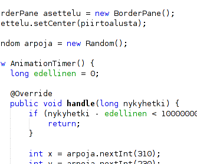
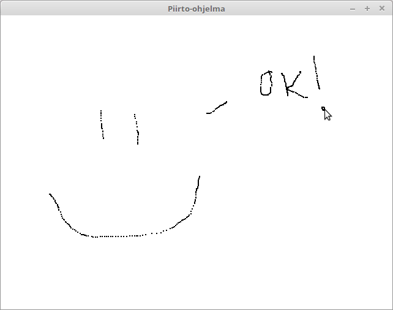
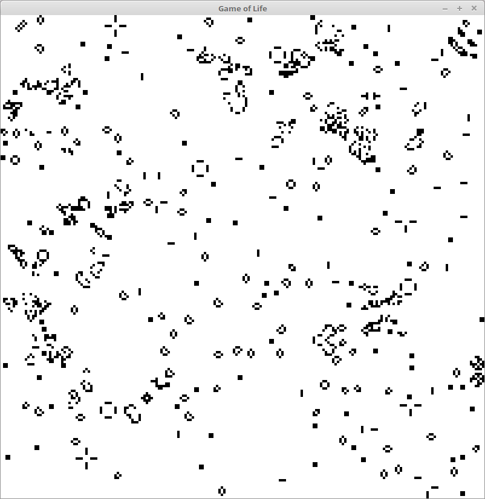
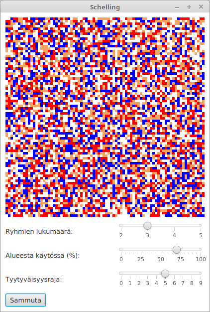
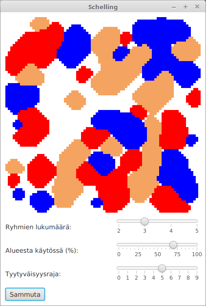
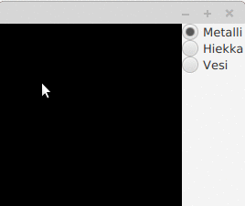
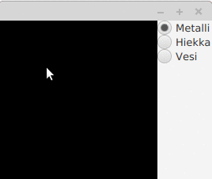
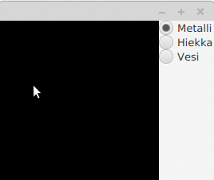

<text-box variant='learningObjectives' name='Oppimistavoitteet'>

- Tiedät mitä simulaatiot ovat.
- Kertaat kaksiulotteisten taulukoiden käyttöä.
- Harjoittelet piirtämistä Canvas-elementille.
- Osaat luoda kaksiulotteisiin taulukoihin perustuvia simulaatioita.
- Tunnet yleisiä sääntöjä simulaatioiden toteuttamiseen.

</text-box>

<quiznator id="5cb5c0ef06d26046c3ea28c8"></quiznator>


Tietokonesimulaatioita käytetään tosielämän ilmiöiden mallintamiseen tietokoneella. Simulaation toteutus sisältää ilmiötä kuvaavan mallin luomisen (esimerkiksi säämalli) sekä mallin ajamisen eli simuloinnin. Tutustumme tässä muutamaan klassiseen tietokonesimulaatioon, jotka käyttävät kaksiulotteista taulukkoa.


## Lyhyt kertaus kaksiulotteisista taulukoista


Kaksiulotteiset taulukot esitellään muuttujatyypin sekä sitä seuraavan kahden hakasulun avulla (esim `int[][]`). Tätä seuraa muuttujan nimi sekä konkreettinen taulukko-olion luonti, esim `int[][] taulukko = new int[rivit][sarakkeet]`, jossa rivit ja sarakkeet ovat kokonaisluja.

```java
double[][] taulukko = new double[5][10];
```

Yllä luomme viisirivisen ja kymmensarakkeisen taulukon, jonka jokainen solu sisältää liukuluvun. Taulukon läpikäynti onnistuu for-toistolauseella.


```java
double[][] taulukko = new double[5][10];
System.out.println("rivi, sarake, arvo");
for (int rivi = 0; rivi < taulukko.length; rivi++) {
    for (int sarake = 0; sarake < taulukko[rivi].length; sarake++) {
        double arvo = taulukko[rivi][sarake];
        System.out.println("" + rivi + ", " + sarake + ", " + arvo);
    }
}
```

Yllä näytetään miten taulukon arvoihin päästään käsiksi. Taulukon arvojen asetus tapahtuu samalla tavalla. Alla olevassa esimerkissä taulukkon rivin 1 sarakkeeseen 2 asetetaan arvo `4.2`.


```java
double[][] taulukko = new double[5][10];
taulukko[1][2] = 4.2;
```


## Piirtäminen ja Canvas


Canvas-luokka tarjoaa piirtoalustan, johon voi piirtää Canvas-oliosta saatavan GraphicsContext-olion avulla. Animaatioissa ja simulaatioissa halutaan tyypillisesti piirtää jatkuvasti. Jatkuvasti piirtäminen -- tai oikeammin tietyn aikavälin jälkeen uudelleen piirtäminen -- tapahtuu [AnimationTimer](https://docs.oracle.com/javase/8/javafx/api/javafx/animation/AnimationTimer.html)-luokan avulla. AnimationTimer-luokka määrittelee metodin [handle](https://docs.oracle.com/javase/8/javafx/api/javafx/animation/AnimationTimer.html#handle-long-), joka luokkaa käyttävän ohjelmoijan tulee toteuttaa. Metodi saa parametrina nykyhetken nanosekunteina, jonka avulla voidaan vaikuttaa piirtovälien pituuteen. Samaa kuvaa ei esimerkiksi kannata piirtää käyttäjälle tuhatta kertaa sekunnissa, mutta toisaalta nopeasti liikkuvan kuvan päivittäminen käyttäjälle esimerkiksi kerran sekunnissa ei sekään ole toivottua.

Alla olevassa esimerkissä on ohjelma, jossa piirretään satunnaiseen kohtaan piste kymmenen kertaa sekunnissa.


```java
// pakkaus..

import java.util.Random;
import javafx.animation.AnimationTimer;
import javafx.application.Application;
import javafx.scene.Scene;
import javafx.scene.canvas.Canvas;
import javafx.scene.canvas.GraphicsContext;
import javafx.scene.layout.BorderPane;
import javafx.scene.paint.Color;
import javafx.stage.Stage;

public class AnimaationAlku extends Application {

    @Override
    public void start(Stage ikkuna) {

        Canvas piirtoalusta = new Canvas(320, 240);
        GraphicsContext piirturi = piirtoalusta.getGraphicsContext2D();
        piirturi.setFill(Color.BLACK);

        BorderPane asettelu = new BorderPane();
        asettelu.setCenter(piirtoalusta);

        Random arpoja = new Random();

        new AnimationTimer() {
            long edellinen = 0;

            @Override
            public void handle(long nykyhetki) {
                if (nykyhetki - edellinen < 100000000) {
                    return;
                }

                int x = arpoja.nextInt(310);
                int y = arpoja.nextInt(230);

                piirturi.fillOval(x, y, 10, 10);

                this.edellinen = nykyhetki;
            }
        }.start();

        Scene nakyma = new Scene(asettelu);

        ikkuna.setScene(nakyma);
        ikkuna.show();
    }

    public static void main(String[] args) {
        launch(AnimaationAlku.class);
    }
}
```


Ohjelma toimii käynnistyessään seuraavasti. Huomaathan, että pisteet ovat satunnaisia, joten oma kokeilusi tuskin tuottaa täsmälleen samanlaista tulosta.




&nbsp;

<!-- <programming-exercise name='Piirto-ohjelma' tmcname='osa14-Osa14_01.PiirtoOhjelma'> -->

<programming-exercise name='Drawing application' tmcname='part14-Part14_01.DrawingApplication'>

<!-- Tehtäväpohjaan on toteutettu graafinen sovellus, joka sisältää kaksiulotteisen taulukon. Tehtävänäsi on muuttaa sovelluksen toimintaa siten, että kun käyttäjä painaa hiirtä sovelluksessa tai liikuttaa hiirtä kun nappi on pohjassa, ikkunaan piirretään. -->

In the exercise base there is a graphical application that contains a two-dimensional array. Your task is to modify the program so that when the user clicks on the mouse in the application window, or moves the mouse around when it is being pressed, the cursor draws in the window.

<!-- Tee tätä varten kaksi asiaa: (1) muuta sovelluksessa olevan taulukon "piirrettava" arvoja sopivasti kun käyttäjä käyttää hiirtä, ja (2) piirrä komentoa `piirturi.fillRect(x, y, 2, 2)` käyttäen ne alkiot, joiden arvo on 1. Käytä koordinaatteina x, y taulukon indeksejä. -->

For this, do two things: (1) change the values of the array "drawable" in the application in a suitable manner when the user uses the mouse, and (2) by using the command `drawer.fillRect(x, y, 2, 2)` to draw the elements whose value is 1. Use the indexes of the array as the coordinates.

<!-- Kun sovellus toimii, voit käyttää sitä vaikkapa seuraavanlaisen taideteoksen tekemiseen. -->

Once you have a working application, you can use to draw fine art like the following.



<!-- Tehtävässä ei ole testejä eli palauta se vasta kun sovellus toimii toivotulla tavalla. -->

There are no tests in the exercise, so only return your answer once the program works as instructed here.

</programming-exercise>

Silloin tällöin ohjelma halutaan toteuttaa siten, että uusi tila piirretään aina edellisen tilanteen päälle. Tällöin tapana on tyhjentää ruutu ennen uutta piirtämistä. Tämä onnistuu lisäämällä edelliseen ohjelmaan rivi `piirturi.clearRect(0, 0, 320, 240);` ennen handle-metodissa olevaa piirtokomentoa. Komento tyhjentäisi kohdasta (0, 0) lähtien 320 pikseliä leveän ja 240 pikseliä korkean suunnikkaan.


## Game of Life


[Game of Life](https://en.wikipedia.org/wiki/Conway's_Game_of_Life) on klassinen tietokonesimulaatio. Se toteutetaan kaksiulotteisen taulukon avulla, ja se noudattaa seuraavia sääntöjä:

1. Jos elävän solun naapureina on alle kaksi elävää solua, se kuolee alikansoituksen takia.
2. Jos elävän solun naapureina on kaksi tai kolme elävää solua, se jää henkiin.
3. Jos elävän solun naapureina on yli kolme elävää solua, se kuolee ylikansoituksen takia.
4. Jos kuolleen solun naapureina on tasan kolme elävää solua, se syntyy eli muuttuu eläväksi.

Naapurit ovat soluun koskettavia soluja. Naapuri koskettaa solua joko reunasta, (pohjoinen, itä, etelä, länsi) tai kulmasta (koillinen, kaakko, lounas, luode).

Game of Life ei sisällä liikkumissääntöjä, mutta se silti luo tilanteita, joissa erilaiset hahmot liikkuvat ruudulla. Alla olevalla videolla John Conway kertoo Game of Lifen kehittämisestä.

<youtube id="R9Plq-D1gEk"></youtube>


<programming-exercise name='Game of Life (2 osaa)' tmcname='osa14-Osa14_02.GameOfLife'>

Tässä tehtävässä toteutetaan oleellisilta osin Game of Life-pelin säännöt. Toteutusta varten tehtäväpohjassa on luokka GameOfLife, joka sisältää kaksiulotteisen taulukon, sekä luokka GameOfLifeSovellus, jota voidaan käyttää pelin visualisointiin.

<h2>Elossa olevien naapurien lukumäärä</h2>

Täydennä luokassa GameOfLife olevaa metodia `public int elossaOleviaNaapureita(int[][] taulukko, int x, int y)` siten, että se laskee annetun x, y -koordinaatin elossa olevien naapureiden lukumäärän. Naapuri on elossa jos sen arvo on 1.

Naapureita ovat kaikki ne alkiot, jotka ovat kulman tai sivun kautta yhteydessä alkioon.

Huomaa, että metodin tulee varoa `ArrayIndexOutOfBounds`-virhettä. Indeksissä -1 ei esimerkiksi voi olla ketään. Vastaavasti taulukon leveyden tai korkeuden yli ei voi mennä (esim. `taulukko[taulukko.length][0]` tai `taulukko[0][taulukko[0].length]`).

Voit kokeilla metodiasi muunmuassa seuraavilla esimerkeillä.


```java
GameOfLife gol = new GameOfLife(3, 3);

int[][] taulukko = new int[3][3];
taulukko[0][0] = 1;
taulukko[0][1] = 1;
taulukko[1][1] = 1;
taulukko[2][2] = 1;

System.out.println(gol.elossaOleviaNaapureita(taulukko, 0, 0));
System.out.println(gol.elossaOleviaNaapureita(taulukko, 1, 0));
System.out.println(gol.elossaOleviaNaapureita(taulukko, 1, 1));
System.out.println(gol.elossaOleviaNaapureita(taulukko, 2, 2));
```

<sample-output>

2
3
3
1

</sample-output>

```java
GameOfLife gol = new GameOfLife(4, 4);

int[][] taulukko = {{1, 1, 1, 1}, {1, 1, 1, 1}, {1, 0, 1, 0}, {0, 1, 0, 1}};

System.out.println(gol.elossaOleviaNaapureita(taulukko, 0, 0));
System.out.println(gol.elossaOleviaNaapureita(taulukko, 1, 1));
System.out.println(gol.elossaOleviaNaapureita(taulukko, 2, 2));
System.out.println(gol.elossaOleviaNaapureita(taulukko, 3, 3));
```

<sample-output>

3
7
5
1

</sample-output>


<h2>Kehittyminen</h2>

Täydennä seuraavaksi GameOfLife-luokan metodia `public void kehity()` siten, että se käy yhden Game of Life -pelin askeleen.

Toteuta toiminnallisuus niin, että luot toisen taulukon, jonka koko on sama kuin alkuperäisen taulukon. Käy tämän jälkeen alkuperäistä taulukkoa läpi alkio alkiolta siten, että seuraat seuraavia sääntöjä:

1. Jos alkuperäisen taulukon alkion arvo on 1 ja sillä on alle kaksi elävää naapuria, kopioon asetetaan alkion arvoksi 0.
2. Jos alkuperäisen taulukon alkion arvo on 1 ja sillä on kaksi tai kolme elävää naapuria, kopioon asetetaan alkion arvoksi 1.
3. Jos alkuperäisen taulukon alkion arvo on 1 ja sillä on yli kolme elävää naapuria, kopioon asetetaan alkion arvoksi 0.
4. Jos alkuperäisen taulukon alkion arvo on 0 ja sillä on tasan kolme elävää naapuria, kopioon asetetaan alkion arvoksi 1.

Käytä naapureiden lukumäärän selvittämisessä edellisessä osassa tehtyä metodia. Kun olet käynyt koko taulukon läpi, vaihda kopio taulukon paikalle.

Kokeile tämän jälkeen sovelluksen toimintaa graafisen käyttöliittymän kautta. Sovelluksen pitäisi käynnistyä -- yksi mahdollinen hetkellinen tila on seuraavanlainen.



</programming-exercise>


<text-box variant='hint' name='Miksi taulukosta tehtiin kopio?'>

Game of Life -tehtävässä taulukosta tehtiin kopio, johon laskettiin sääntöjä noudattaen Game of Life -simulaation seuraavan tilanteen arvot. Mikäli taulukosta ei olisi tehty kopiota ja laskenta olisi tapahtunut suoraan alkuperäiseen taulukkoon, muuttaisivat välitulokset ohjelman toimintaa.

</text-box>


## Schellingin malli

[Thomas Schelling](https://en.wikipedia.org/wiki/Thomas_Schelling) on yhdysvaltalainen taloustieteilijä, joka esitti samankaltaisuuden hyväksyntää (tai toisaalta syrjintää) selittävän mallin. Malli perustuu ajatukselle, että ihmiset pysyvät paikallaan mikäli heillä on naapureina tarpeeksi samanmielisiä ihmisiä -- käänteisesti, ihmiset muuttavat pois mikäli he eivät ole tyytyväisiä naapureihinsa.


Tutustutaan mallin toimintaan tehtävän avulla.


<programming-exercise name='Schelling (2 osaa)' tmcname='osa14-Osa14_03.Schelling'>

Tässä tehtävässä pohditaan Schellingin mallia sekä kehitetään siihen liittyvää simulaatio-ohjelmaa.

Simulaation suoritus alkaa tilanteesta, jossa ihmiset ovat asetettu satunnaisesti asumaan.



&nbsp;

Kun simulaatio etenee, päädytään ennen pitkää tilanteeseen, jossa samankaltaiset ihmiset ovat muuttaneet samankaltaisten ihmisten luo.



&nbsp;

Tehtäväpohjan mukana tulevasta ohjelmasta puuttuu muutamia oleellisia toiminnallisuuksia: (1) kartan tyhjennys, (2) tyhjien paikkojen etsiminen, sekä (3) tyytymättömien henkilöiden tunnistaminen. Tutustu tehtäväpohjan ohjelmaan ennen aloittamista.

Siinä missä Game of Life -tehtävässä maailmaa kuvaava taulukko oli upotettu osaksi mallia (luokka GameOfLife), tässä tehtävässä taulukko on eriytetty erilliseksi luokakseen.


<h2>Kartan tyhjentäminen ja tyhjien paikkojen etsiminen</h2>

Malli käyttää kaksiulotteista taulukkoa. Kohdassa (x, y) oleva arvo 0 kuvaa tyhjää paikkaa ja luvut 1-5 kuvaavat eri ryhmiä.

Toteuta ensin luokan `Eriytymismalli` metodiin `public void tyhjenna()` toiminnallisuus, joka asettaa jokaisen solun arvoksi 0.

Lisää tämän jälkeen metodiin `public ArrayList<Piste> tyhjatPaikat()` toiminnallisuus, joka tunnistaa tyhjät paikat (solut, joissa on arvo 0), luo jokaisesta Piste-olion, ja palauttaa ne listana. Huomaa, että käytössä olevassa hajautustaulussa ensimmäinen ulottuvuus kuvaa x-koordinaattia, ja toinen y-koordinaattia (taulukko.hae(x, y)).


<h2>Tyytymättömien hakeminen</h2>

Mallille voidaan asettaa parametri `tyytyvaisyysraja`. Tyytyväisyysrajalla kuvataan samaan ryhmään kuuluvien naapureiden minimimäärää, jonka täyttyessä henkilö on tyytyväinen sijaintiinsa. Jos ruudussa (x, y) olevan henkilön naapureista on samankaltaisia yhtä paljon tai yli `tyytyvaisyysraja`n, on henkilö tyytyväinen. Muissa tapauksissa henkilö on tyytymätön.

Naapureista tulee tarkastella kaikkia ruudun vieressä olevia ruutuja. Alueen ulkopuolella olevat ruudut (esim. -1, 0) tulee käsitellä tyhjänä ruutuna (ei samankaltainen).

Toteuta metodi `public ArrayList<Piste> haeTyytymattomat()`, joka palauttaa tyytymättömät listana.

*Vaikka karttamme on suorakulmio, voisi sen yhtä hyvin piirtää vaikkapa Helsingin muotoiseksi. Osa alueesta voisi olla myös esimerkiksi vettä, johon ei voisi muuttaa ymym.*

</programming-exercise>


## Yleisiä sääntöjä simulaation toteuttamiseen

Simulaatioita toteuttaessa on muutamia yleisiä sääntöjä. Simulaatio perustuu jonkinlaiseen malliin, joka on kuvaus (tosielämän) ilmiöstä. Tämä kuvaus on tyypillisesti vaillinainen, sillä ilmiön oleelliset osat pyritään irrottamaan muista oleellisista osista.

Kun ilmiötä mallinnetaan, kannattaa aloittaa muutamasta muuttujasta. Esimerkiksi rokotteiden hyötyjä ja haittoja voisi tarkastella ensin pitämällä kirjaa (1) rokotetuista, (2) rokottamattomista, ja (3) sairastuneista. Yksinkertaisessa mallissa rokottamattomista satunnaiset sairastuvat, jonka lisäksi sairastuneiden vieressä olevat saattavat sairastua jonkinlaisella todennäköisyydellä. Tämä todennäköisyys riippuu taudista, ja se kannattaisi määritellä parametrina mallille -- aivan kuten se, kuinka lähellä taudille altistuvan tulee olla jotta tauti voi tarttua.

Kun mallista on olemassa yksinkertainen versio, voi sitä täydentää. Rokotemallissa mukaan voisi tuoda tiedon tervehtymisestä -- sairaat tervehtyvät tietyllä todennäköisyydellä, sekä tiedon jälkitaudeista -- esimerkiksi noin 5% tuhkarokkoon sairastuneista saa keuhkokuumeen, joista osalla tauti saattaa johtaa kuolemaan. Mallia voisi jatkaa esimerkiksi lisäämällä tiedon henkilöiden iästä -- taudit vaikuttavat eri ikäisiin eri tavalla: luonnollisesti myös rokottamattomat vauvat ovat joillekin taudeille alttiimpia.

Rokotemallin totetus jääköön kuitenkin harrastuneisuuden varaan.

Yksinkertaisella mallilla aloittaminen sekä sen täydentäminen on ensimmäinen sääntö simulaatioiden toteuttamiseen. Toinen sääntö on käyttöliittymän ja mallin eriyttäminen. Edellä nähdyissä tehtävissä graafinen käyttöliittymä oli erillään mallista -- mikäli mallit olisivat olleet osana käyttöliittymää, olisi niiden ylläpito ja muokkaaminen ollut monimutkaisempaa.

Kolmas sääntö liittyy mallin jakamisen osiin tarvittaessa. Malleissa, joissa seuraava askel on riippuvainen edellisestä askeleesta on mahdollisuus siihen, että seuraavan vaiheen laskenta vaikuttaa edelliseen vaiheeseen. Esimerkiksi, mikäli Game of Lifessä olisi käytetty vain yhtä taulukkoa mallin ylläpitoon, ei sovellus toimisi halutulla tavalla sillä taulukkoon lisättävät uudet juuri lasketut arvot vaikuttaisivat niiden viereisten arvojen laskentaan.

Tarkemmin ottaen, edellä kuvatut säännöt eivät rajaudu simulaatioiden rakentamiseen vaan ne ovat yleisiä ohjelmistojen kehittämiseen liittyviä sääntöjä. Olemme koko kurssin ajan pyrkineet lähtemään liikenteeseen pienestä ratkaisten aina yhden ongelman kerrallaan. Vastaavasti olemme pyrkineet tilanteeseen, jossa sovelluslogiikka ja käyttöliittymä on erillään. Tämä mahdollistaa sekä sovelluslogiikan siirtämisen toiseen käyttöliittymään että käyttöliittymän helpomman muokkaamiseen. Samalla tavalla myös ohjelmistoja jaetaan pienempiin osiin, jolloin vältetään virheiden tekemistä ja helpotetaan sovellusten testaamista.


<!-- <programming-exercise name='Hiekkaranta (3 osaa)' tmcname='osa14-Osa14_04.Hiekkaranta'> -->

<programming-exercise name='Beach (3 parts)' tmcname='part14-Part14_04.Beach'>


<!-- Tässä tehtävässä luodaan [falling sand game](https://en.wikipedia.org/wiki/Falling-sand_game)-tyyppinen sovellus, jota käytetään erilaisten aineiden simulointiin. Ohjelmassamme simuloidaan hiekan ja veden käyttäytymistä. Lopullisen sovelluksen toiminta on seuraavanlainen. -->

In this exercise we are going to create an application that reminds the [falling sand game](https://en.wikipedia.org/wiki/Falling-sand_game), used to simulate different materials. Our program is going to simulate how sand and water behave. The finished program should work in the following manner.




<!-- *Tehtävässä käytetään `enum`-tyyppistä luokkaa `Tyyppi`. Javassa ohjelmoija voi määritellä rajatulle määrälle käsitteitä `enum`-tyyppisen luokan, jossa näille käsitteille annetaan nimi. Luokka on seuraavanlainen.* -->

*In the exercise we are going to use the `Material` class that has type `enum`. In Java the programmer may define an `enum` class for a number of different concepts, so that they can be named. The class in this exercise looks like the following.


<!-- ```java
package hiekkaranta;

public enum Tyyppi {
    TYHJA, METALLI, HIEKKA, VESI;
}
``` -->

```java
package beach;

public enum Material {
    EMPTY, METAL, SAND, WATER;
}
```

<!-- Enum-muuttujia käytetään esimerkiksi seuraavasti. -->

Enum variables are used like this.

<!-- ```java
Tyyppi t = Tyyppi.TYHJA;
if (t == Tyyppi.TYHJA) {
    System.out.println("Tyhjää täynnä.");
}

if (t == Tyyppi.HIEKKA) {
    System.out.println("Hiekalta näyttää.");
}

Tyyppi[] taulukko = new Tyyppi[10];
taulukko[0] = Tyyppi.VESI;
System.out.println(taulukko.length);
``` -->

```java
Material m = Material.EMPTY;
if (m == Material.EMPTY) {
    System.out.println("Hella empty.");
}

if (m == Material.SAND) {
    System.out.println("Looks like sand.");
}

Material[] array = new Material[10];
array[0] = Material.WATER;
System.out.println(array.length);
```

<!-- Tehtäväpohjassa on annettu valmiina käyttöliittymä simulaatiolle. Käyttöliittymä sisältää piirtoalustana käytetyn Canvas-olion sekä simulaatioon lisättävien elementtien valintaan käytetyt napit. -->

The exercise base already contains a user interface for the simulation. The user interface contains a Canvas object that is used to draw on, and the buttons that are used to choose the element that is added to the simulation.


<!-- <h2>Simulaation alkupalat</h2> -->

<h2>Buiding block of simulation</h2>

<!-- Täydennä pakkauksen hiekkaranta luokkaa Simulaatio seuraavasti. Luokalla Simulaatio tulee olla seuraavat konstruktorit ja metodit. Käytä luokassa hyödyksi valmista enum-luokkaa Tyyppi, ja toteuta simulaation sisäinen tiedon esitys kaksiulotteisena taulukkona `Tyyppi[][]`. -->

Complete the Simulation class in the beach package in the following matter. The Simulation class should have all the following constructors and methods. Use the existing enum class material in implementing the class, and implement the internal representation of data in the simulation as a two-dimensional array `Material[][]`.

<!-- - Konstruktori `public Simulaatio(int leveys, int korkeus)` luo annetun levyisen ja korkuisen simulaation. Jokaisen kohdan arvon tulee olla aluksi `Tyyppi.TYHJA`. -->

- Constructor `public Simulation(int width, int height)` creates a simulation with the specified width and height. Each value must be initialized as `Material.EMPTY`.

<!-- - Metodi `public void lisaa(int x, int y, Tyyppi tyyppi` asettaa annettuun kohtaan annetun tyyppisen elementin. Tyyppi on joko `Tyyppi.TYHJA`, `Tyyppi.METALLI`, `Tyyppi.HIEKKA` tai `Tyyppi.VESI`. -->

- Method `public void add(int x, int y, Material material)` adds an element of the given material in the specified position. The material is one of the following four: `Material.EMPTY`, `Material.METAL`, `Material.SAND`, or `Material.WATER`.

<!-- - Metodi `public Tyyppi sisalto(int x, int y)` palauttaa annetussa kohdassa olevan sisällön. Vastaus on joko Tyyppi.TYHJA, Tyyppi.METALLI, Tyyppi.HIEKKA tai Tyyppi.VESI. Jos kohtaan ei ole lisätty mitään arvoa, tyyppi on Tyyppi.TYHJA. Jos käyttäjä kysyy tietoa alueen ulkopuolelta, palauta Tyyppi.METALLI. -->

- Method `public Material contents(int x, int y)` returns the contents at the specified position. The answer is one of the following four: `Material.EMPTY`, `Material.METAL`, `Material.SAND`, or `Material.WATER`. If nothing has been added to the position, the method should return Material.EMPTY. If the user asks for contents of a position that lies ouside of the area, return Material.METAL.

<!-- - Metodi `public void paivita()` päivittää simulaatiota yhden askeleen. Päivitystoiminnallisuuden toteutus aloitetaan tehtävän myöhemmissä osassa. -->

- Method `public void update()` updates the simulation by one step. We are going to implement the update functionality in a later section.

<!-- Kun metodit toimivat, sovelluksen toiminta on seuraava. -->

Once all these methods work, the program should work like this.





<!-- <h2>Hiekka</h2> -->

<h2>Sand</h2>

<!-- Muokkaa Simulaatio-luokan metodia paivita. Metodin paivita tulee toimia siten, että se tarkistaa jokaiselle hiekkaa sisältävälle kohdalle kohdan alla olevat kolme vaihtoehtoa (lounas, etelä, kaakko). Jos joku vaihtoehdoista on tyhjä, hiekka siirretään alaspäin tyhjään kohtaan. Mikäli useampi kuin yksi em vaihtoehdoista on tyhjiä, tee valinta satunnaisesti tyhjien vaihtoehtojen välillä. -->

Modify the update method of the Simulation class. It should, for every position that contains sand, check the three positions below it (South-West, South, South-East). If one of these positions is empty, the sand is moved into the empty spot. If more than one of the three positions are empty, make the decision for the new position randomly.

<!-- Satunnaisuutta ohjelmaan saat `Random`-luokan avulla. -->

You can add the required randomness into the program with the help of the `Random` class.

<!-- Huom! Toteuta simulaatio siten, että y-koordinaatti on "käänteinen". Simulaation sisällä y-koordinaatin kasvatus tarkoittaa alaspäin menoa, ja toisaalta y-koordinaatin pienennys ylöspäin menoa. Tämä auttaa piirtämisessä, sillä piirtäessä y-koordinaatti kasvaa alaspäin mennessä. -->

NB! Implement the simulation so that the y-coordinate is "inverted". Inside the simulation a growing y-coordinate means moving downwards, and a decreasing y-coordinate means moving upwards. This will help with drawing, since when drawing the y coordinate increases as we move down.




<!-- <h2>Vesi</h2> -->

<h2>Water</h2>

<!-- Muokkaa tämän jälkeen Simulaatio-luokan metodia paivita siten, että se siirtää kutsun yhteydessä vettä alaspäin *jos* joku veden alapuolella olevista kohdista (lounas, etelä, kaakko) on tyhjä. Jos yksikään kohdista ei ole tyhjiä, mutta jommalla kummalla laidalla on sijaa, siirretään vettä sivulle. -->

After this, move the update method of the Simulation class to handle water. Water should be moved downward *if* one of the positions under it (South-West, South, South-East) is empty. If none of them are empty, but there is an empty position of one side of the water, the water is moved to the side.

<!-- Muokkaa loputa sovellusta siten, että hiekka syrjäyttää veden. Kun lisäät hiekkaa, veden tulee siis väistää hiekkaa. Toteuta väistäminen siten, että hiekka ja vesi vaihtaa paikkaansa. -->

Finally modify the application so that sand can replace water. So when you add sand, water should move out of the way of the sand. To implement this, make it so that sand and water can swap places.


<!-- Kun olet saanut kaikki neljännentoista osan tehtävät valmiiksi, voit palauta tähän tehtävään ja lähteä toteuttamaan uusia toiminnallisuuksia. Miten toteuttaisit esimerkiksi laavan? -->

Once you have finished all the sections of the exercise, you can return it and try to implement new features. For instance, how would you implement lava?

</programming-exercise>

