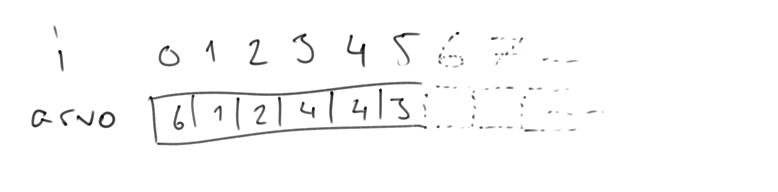
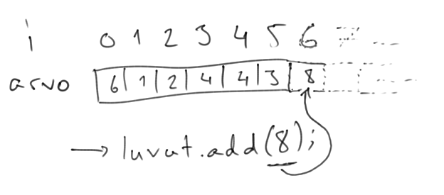

<!-- <text-box variant='learningObjectives' name='Oppimistavoitteet'> -->

<text-box variant='learningObjectives' name='Learning objectives'>


<!-- - Tunnet listarakenteen ja osaat käyttää listaa osana ohjelmia. -->
- You are familiar with the list structure and can use it in your programs
<!-- - Tunnet käsitteen indeksi, osaat lisätä arvoja listalle ja osaat hakea tietoa listan indeksistä. -->
- You are familiar with the concept of index, you can add values to a list, and you know how to retrieve information from a list's indices
<!-- - Osaat käydä listan läpi useammalla erilaisella toistolauseella. -->
- You can use several kinds of looping statements to iterate over a list
<!-- - Osaat tarkistaa onko arvo listalla ja osaat toisaalta poistaa arvoja listalta. -->
- You know how to check if a value exists in a list, and you can remove values from a list
<!-- - Tiedät, että lista on viittaustyyppinen muuttuja ja tutustut listan käyttöön metodin parametrina. -->
- You are aware that a list is a reference-type variable, and you will familiarize yourself with using lists as method parameters

</text-box>


<!-- Ohjelmoidessa tulee vastaan tilanteita, joissa haluamme käsitellä useita arvoja. Epäkäytännöllinen mutta tähän mennessä käytännössä ainoa tapa on ollut määritellä jokaiselle arvolle oma muuttuja. -->

We often encounter situations that call for handling of multiple values when programming. Before this,  the practically only means available to us has been to define a separate variable for storing each value. This method can easily become impractical.


<!-- ```java
String sana1;
String sana2;
String sana3;
// ...
String sana10;
``` -->

```java
String word1;
String word2;
String word3;
// ...
String word10;
```

<!-- Yllä esitetty ratkaisu on oikeastaan kelvoton -- ajattele ylläoleva esimerkki vaikkapa tuhannella sanalla. -->

The solution presented above is frankly useless -- consider the situation when there are thousands of words to store.

<!-- Ohjelmointikielet tarjoavat apuvälineitä, joiden avulla on helppo säilyttää useita arvoja. Tutustumme seuraavaksi Java-ohjelmointikielen ehkäpä eniten käytettyyn apuvälineeseen [ArrayListiin](https://docs.oracle.com/javase/8/docs/api/java/util/ArrayList.html), joka on useamman samankaltaisen arvon säilömiseen tarkoitettu lista. -->

Programming languages offer tools to assist in storing a number of values. We will next take a peek at perhaps the most used single tool the Java language, the [ArrayList](https://docs.oracle.com/javase/8/docs/api/java/util/ArrayList.html), which is used for storing many values of the same type.

<!-- ArrayList on Javan valmiiksi tarjoama työväline listojen käsittelyyn. Se tarjoaa metodit muunmuassa arvojen lisäämiseen listalle, arvojen poistamiseen listalta sekä arvojen hakemiseen tietystä listan kohdasta. Listan konkreettinen toiminta -- eli miten lista on oikeasti ohjelmoitu -- on abstrahoitu metodien taakse, jolloin listaa käyttävän ohjelmoijan ei tarvitse välittää listan sisäisestä toiminnallisuudesta. -->

ArrayList is a premade tool to help in handling lists. It offers methods for, among others, adding values to the list, removing values from the list, and getting a value from a specific place in the list. The concrete operation -- how the list is concretely programmed -- has beed abstracted behind these methods, so a programmer who uses a list need not concern themselves with its inner workings.


<!-- ## Listan käyttöönotto ja luominen -->

## Beginning to use lists and creating them

<!-- Jotta ArrayListiä voi käyttää, tulee se tuoda ohjelman käyttöön. Tämä onnistuu kirjoittamalla ohjelman ylälaitaan komento `import java.util.ArrayList;`. Alla on esimerkkiohjelma, missä ArrayList tuodaan ohjelman käyttöön. -->

In order to use ArrayList it must be imported in the program. This happens by writing the command `import java.util.ArrayList;` to the top of the program. In the example below ArrayList is imported into the program.

<!-- ```java
// tuodaan lista ohjelman käyttöön
import java.util.ArrayList;

public class Ohjelma {

    public static void main(String[] args) {
        // ei vielä mitään toiminnallisuutta
    }
}
``` -->

```java
// import the list so the program can use it
import java.util.ArrayList;

public class Program {

    public static void main(String[] args) {
        // the list isn't used yet
    }
}
```


<!-- Listan luominen tapahtuu sanomalla "`ArrayList<Tyyppi> lista = new ArrayList<>()`", missä _Tyyppi_ on listalle säilöttävien arvojen tyyppi, eli esimerkiksi `String`. Alla olevassa esimerkissä luodaan merkkijonojen säilömiseen tarkoitettu lista. -->

Creating a new list is done with the command `ArrayList<Type> list = new ArrayList<>()`, where _Type_ is the type of the values to be stored in the list (e.g. `String`). We create a list for storing integers in the example below.


<!-- ```java
// tuodaan lista ohjelman käyttöön
import java.util.ArrayList;

public class Ohjelma {

    public static void main(String[] args) {
        // luodaan lista
        ArrayList<String> lista = new ArrayList<>();

        // listalla ei vielä tehdä mitään
    }
}
``` -->

```java
// import the list so the program can use it
import java.util.ArrayList;

public class Program {

    public static void main(String[] args) {
        // create a list
        ArrayList<String> list = new ArrayList<>();

        // the list isn't used yet
    }
}
```


<!-- ArrayList-muuttujan tyyppi on `ArrayList`. Listamuuttujaa esiteltäessä muuttujan tyypin lisäksi listalle määritellään siihen säilöttävien arvojen tyyppi -- **kaikki samalle listalle lisättävät arvot ovat saman tyyppisiä**. Esimerkiksi merkkijonoja sisältävän ArrayListin tyyppi on `ArrayList<String>` ja kokonaislukuja sisältävän ArrayListin tyyppi on `ArrayList<Integer>`. Listan luominen tapahtuu  komennolla `new ArrayList<>();`. -->

The type of the `list` variable is `ArrayList`. When introducing a list variable, it is important to define also the type of the values to be stored, and not only the type of the list variable itself. **All the variables stored in one list have the same type**. The type of an ArrayList that stores strings is therefore `ArrayList<String>`. A new list is created with the command `new ArrayList<>();`.


<!-- ##  Listan sisältämien arvojen tyypin määrittely -->

## Defining the type of values that a list can store

<!-- Listan sisältämien arvojen tyyppien määrittelyssä muuttujista tulee käyttää niiden "isolla kirjaimella kirjoitettuja" versioita. Esimerkiksi int-tyyppisiä muuttujia sisältävä lista tulee määritellä muodossa `ArrayList<Integer>` ja double-tyyppisiä muuttujia sisältävä lista tulee määritellä muodossa `ArrayList<Double>`. -->

When defining the type of values that a list include, the "capitalized first letter" versions of types must be used. A list that includes int-type variables has to be defined in the form `ArrayList<Integer>`; a list that includes double-type variables similarly in the form `ArrayList<Double>`.

<!-- Tämä liittyy siihen, miten ArrayList on toteutettu. Javan muuttujat voidaan jakaa kahteen kategoriaan: alkeistyyppisiin muuttujiin ja viittaustyyppisiin muuttujiin. **Alkeistyyppiset** muuttujat kuten `int` ja `double` sisältävät niihin liittyvät arvot. **Viittaustyyppiset** muuttujat taas, kuten esimerkiksi `ArrayList` sisältävät viitteen paikkaan, joka sisältää muuttujaan liittyvät arvot. -->

The reason for this practice relates to the implementation of ArrayList. The variables in Java can be divided into two categories: value type (primitive) and reference type (reference type) variables. **Value type** variables such as `int` or `double` contain their values directly. **Reference type** variables such as `ArrayList`, in contrast, contain a reference to the location that contains the value(s) relating to that variable.

<!-- Alkeistyyppiset muuttujat pystyvät sisältämään vain rajatun määrän tietoa, kun taas viitteen taakse tietoa voi säilöä lähes rajattomasti. -->

Value type variables can hold a very limited amount of information, whereas references can be used to store a near limitless amount.

<!-- Alla on kuvattuna eri tyyppisiä arvoja sisältävien listojen luominen. -->

Below are examples of creating lists that contain different types of values.

<!-- ```java
ArrayList<Integer> lista = new ArrayList<>();
lista.add(1);
``` -->

```java
ArrayList<Integer> list = new ArrayList<>();
list.add(1);
```

<!-- ```java
ArrayList<Double> lista = new ArrayList<>();
lista.add(4.2);
``` -->

```java
ArrayList<Double> list = new ArrayList<>();
list.add(4.2);
```


<!-- ```java
ArrayList<Boolean> lista = new ArrayList<>();
lista.add(true);
``` -->

```java
ArrayList<Boolean> list = new ArrayList<>();
list.add(true);
```

<!-- ```java
ArrayList<String> lista = new ArrayList<>();
lista.add("String on viittaustyyppinen muuttuja");
``` -->

```java
ArrayList<String> list = new ArrayList<>();
lista.add("String is a reference type variable");
```


<!-- Kun lista on luotu, ArrayList olettaa, että sen sisältämät muuttujat ovat viittaustyyppisiä. Java muuntaa automaattisesti `int`-tyyppisen muuttujan `Integer`-tyyppiseksi kun se lisätään listalle, sama tapahtuu myös kun muuttuja haetaan listalta. Vastaava muunnos tapahtuu myös `double`-tyyppiselle muuttujalle, josta tulee `Double`-tyyppinen muuttuja. Tämä tarkoittaa sitä, että vaikka lista määritellään `Integer`-tyyppisiä arvoja sisältäväksi, voi siihen lisätä `int`-tyyppisiä arvoja. -->

Once a list is created, ArrayList assumes that all the variables in it are reference type. Java automatically converts an `int` type variable into `Integer` type when it is being added to a list, and the same occurs when a variable is retrieved from a list. The same conversion occurs to `double` type variables, which are converted to `Double`. In practice the result is that even though a list is defined to contain variables of type `Integer`, `int` type variables can also be added to it.


<!-- ```java
ArrayList<Integer> kokonaisluvut = new ArrayList<>();
int kokonaisluku = 1;
kokonaisluvut.add(kokonaisluku);

ArrayList<Double> liukuluvut = new ArrayList<>();
double liukuluku = 4.2;
liukuluvut.add(liukuluku);
``` -->

```java
ArrayList<Integer> integers = new ArrayList<>();
int integer = 1;
integers.add(integer);

ArrayList<Double> doubles = new ArrayList<>();
double d = 4.2;
doubles.add(d);
```

<!-- Palaamme teemaan jatkossakin, sillä tämä jako alkeis- ja viittaustyyppisiin muuttujiin vaikuttaa ohjelmiimme myös muilla tavoin. -->

We will return to discuss this matter of value and reference type variables, since the division has other effects on our programs, too.


<!-- ## Listalle lisääminen ja tietystä kohdasta hakeminen -->

## Adding to a list and retrieving a value from a specific place


<!-- Seuraavassa esimerkissä esitellään merkkijonoja säilövä ArrayList, johon lisätään muutama merkkijono. Lisääminen tapahtuu listan metodilla `add`, jolle annetaan parametrina listalle lisättävä arvo. Tämän jälkeen tulostetaan listan nollannessa kohdassa oleva arvo. Listan tietystä kohdasta haetaan arvo listan metodilla `get`, jolle annetaan parametrina kokonaislukutyyppinen arvo, joka kertoo kohdan mistä arvo haetaan. -->

The next example shows adding a few string into an ArrayList that contains string. Adding is done with the list method `add`, which takes the value to be added as a parameter. Then we print the value at position zero. To retrieve a value from a certain position, you use the list method `get`, which is given the place of retrieval as a parameter.

<!-- Listan metodeja kutsutaan kirjoittamalla ensin listaa kuvaavaan muuttujan nimi, sitten piste, ja sitten metodin nimi. -->

To call a list method you first write the name of the variable that describes the list, followed by a dot and the name of the method.


<!-- ```java
// tuodaan lista ohjelman käyttöön
import java.util.ArrayList;

public class SanalistaEsimerkki {

    public static void main(String[] args) {
        // luodaan merkkijonojen säilömiseen käytettävä sanalista
        ArrayList<String> sanalista = new ArrayList<>();

        // lisätään sanalistalle kaksi arvoa
        sanalista.add("Ensimmäinen");
        sanalista.add("Toinen");

        // haetaan arvo sanalistan kohdasta 0 ja tulostetaan se
        System.out.println(sanalista.get(0));
    }
}
``` -->

```java
// import list so that the program can use it
import java.util.ArrayList;

public class WordListExample {

    public static void main(String[] args) {
        // create the word list for storing strings
        ArrayList<String> wordList = new ArrayList<>();

        // add two values to the word list
        wordList.add("First");
        wordList.add("Second");

        // retrieve the value from position 0 of the word list, and print it
        System.out.println(wordList.get(0));
    }
}
```

<!-- <sample-output>

Ensimmäinen

</sample-output> -->

<sample-output>

First

</sample-output>


<!-- Kuten huomaat, metodilla `get` saa listan ensimmäisen arvon kun metodille antaa parametrina arvon `0`. Tämä johtuu siitä, että **listan kohtien laskeminen alkaa nollasta**. Listan ensimmäinena arvo löytyy kutsulla `sanalista.get(0)`, listan toinen arvo kohdasta `sanalista.get(1)` jne. -->

As you can see, the `get` method retrieves the first value from the list when it is given the parameter `0`. This is explained by that **counting positions in a list starts from zero**. The first value is found by `wordList.get(0)`, the second by `wordList.get(1)`, etc.


<!-- ```java
import java.util.ArrayList;

public class SanalistaEsimerkki {

    public static void main(String[] args) {
        ArrayList<String> sanalista = new ArrayList<>();

        sanalista.add("Ensimmäinen");
        sanalista.add("Toinen");

        System.out.println(sanalista.get(1));
    }
}
``` -->

```java
import java.util.ArrayList;

public class WordListExample {

    public static void main(String[] args) {
        ArrayList<String> wordList = new ArrayList<>();

        wordList.add("First");
        wordList.add("Second");

        System.out.println(wordList.get(1));
    }
}
```

<!-- <sample-output>

Toinen

</sample-output> -->

<sample-output>

Second

</sample-output>


<!-- <programming-exercise name='Kolmannen arvon tulostaminen' tmcname='osa03-Osa03_01.KolmannenArvonTulostaminen'> -->

<programming-exercise name='Printing the third value' tmcname='osa03-Osa03_01.KolmannenArvonTulostaminen'>


<!-- Ohjelmaan on toteutettu valmiina pohja, joka lukee käyttäjältä merkkijonoja ja lisää niitä listalle. Syötteiden lukeminen päätetään kun käyttäjä syöttää tyhjän merkkijonon. Ohjelma tulostaa tämän jälkeen listan ensimmäisen arvon. -->

The exercise contains a base that asks the user for strings and adds them to a list. The program stops reading when the user enters an empty string. The program then prints the first value on the list.


<!-- Muokkaa ohjelmaa siten, että ensimmäisen arvon sijaan tulostetaan kolmas arvo. Huomaa, että ohjelmoijat aloittavat laskemisen nollasta! Ohjelma saa rikkoutua mikäli listalla ei ole vähintään kolmea arvoa, eli tällaiseen tilanteeseen ei tarvitse varautua millään tavalla. -->

Your assignment is to modify the program so that instead of the first value, the third value on the list is printed. Remember that programmers start counting from zero! The program is allowed to malfunction if there are fewer than three entries on the list, so you don't need to prepare for such an event at all.


<!-- <sample-output>

**Terho**
**Elina**
**Aleksi**
**Mari**

Aleksi

</sample-output> -->

<sample-output>

**Tom**
**Emma**
**Alex**
**Mary**

Alex

</sample-output>

<!-- <sample-output>

**Elina**
**Aleksi**
**Mari**

Mari

</sample-output> -->

<sample-output>

**Emma**
**Alex**
**Mary**

Mary

</sample-output>

</programming-exercise>


<!-- <programming-exercise name='Toisen ja kolmannen summa' tmcname='osa03-Osa03_02.ToisenJaKolmannenSumma'> -->

<programming-exercise name='Sum of second and third' tmcname='osa03-Osa03_02.ToisenJaKolmannenSumma'>


<!-- Ohjelmaan on toteutettu valmiina pohja, joka lukee käyttäjältä kokonaistyyppisiä lukuja ja lisää niitä listalle. Lukeminen lopetetaan kun käyttäjä syöttää luvun 0. Ohjelma tulostaa tämän jälkeen listan ensimmäisen arvon. -->

In the exercise template there is a program that reads integers from the user and adds them to a list. The user entering the number 0 ends this. The program then prints the first value on the list.


<!-- Muokkaa ohjelmaa siten, että listan ensimmäisen arvon sijaan ohjelma tulostaa listan toisen ja kolmannen arvon summan. Ohjelma saa rikkoutua mikäli listalla ei ole vähintään kolmea arvoa, eli tällaiseen tilanteeseen ei tarvitse varautua millään tavalla. -->

Modify the program so that instead of the first value the program prints the sum of the second and third numbers. The program is allowed to malfunction if there are fewer than three entries on the list, so you don't need to prepare for such an event at all.

<sample-output>

**1**
**3**
**5**
**7**
**0**
8

</sample-output>

<sample-output>

**2**
**3**
**4**
**0**
7

</sample-output>

</programming-exercise>


<!-- ### Tiedon hakeminen "olemattomasta" kohdasta -->

## Retrieving information from a "nonexistent" place

<!-- Jos ArrayListiltä haetaan arvoa kohdasta, jota listalla ei ole, tulostaa ohjelma virheen `IndexOutOfBoundsException`. Alla olevassa esimerkissä on ohjelma, missä listalle lisätään kaksi arvoa, jonka jälkeen yritetään tulostaa arvoa listan kohdasta kaksi. -->

If you try to retrieve information from a place that the list doesn't have, the program prints the error `IndexOutOfBoundsException`. In the example below two values are added to a list, after which there is an attempt to print the value at place two on the list.


<!-- ```java
import java.util.ArrayList;

public class Esimerkki {

    public static void main(String[] args) {
        ArrayList<String> sanalista = new ArrayList<>();

        sanalista.add("Ensimmäinen");
        sanalista.add("Toinen");

        System.out.println(sanalista.get(2));
    }
}
``` -->

```java
import java.util.ArrayList;

public class Example {

    public static void main(String[] args) {
        ArrayList<String> wordList = new ArrayList<>();

        wordList.add("First");
        wordList.add("Second");

        System.out.println(wordList.get(2));
    }
}
```

<!-- Koska listalla olevien arvojen numerointi eli **indeksöinti** alkaa nollasta, ei ohjelma löydä arvoa kohdasta kaksi ja ohjelman suoritus päättyy virhetilanteeseen. Alla on kuvattuna yllä olevan ohjelman suorituksen aiheuttama virheviesti. -->

Since zero is the first value used in numbering the places (i.e. **indexing**), the program doesn't find anything at place two and its execution ends with an error. Below is captioned the error message caused by the program.

<sample-output>

**Exception in thread "main" java.lang.IndexOutOfBoundsException: Index: 2, Size: 2
  at java.util.ArrayList.rangeCheck(ArrayList.java:653)
  at java.util.ArrayList.get(ArrayList.java:429)
  at Esimerkki.main(Esimerkki.java:(rivi))
  Java Result: 1**

</sample-output>


<!-- Virheviesti antaa myös pientä vinkkiä ArrayList-olion kapseloimasta toteutuksesta. Se kertoo metodit, joita kutsuttaessa virhe tapahtui. Ensin ohjelmassa on kutsuttu ?`main`-metodia. Tämän jälkeen main-metodissa on kutsuttu ArrayListin `get`-metodia. Tämän jälkeen ArrayListin `get`-metodissa on kutsuttu ArrayListin `rangeCheck`-metodia, jossa virhe tapahtuu. Tässä on myös hyvä esimerkki metodien nimennästä. Vaikka emme olekaan ennen kuulleet metodista `rangeCheck`, voimme arvata, että se tarkastaa onko haettu kohta jollain halutulla alueella. Virhe johtunee siitä, että näin ei ollut. -->

The error message also hints at the capsulated implementation of an ArrayList object. It lists the methods that were called when the error occured. First the program called the `main` method. Then the main method called the `get` method of ArrayList. After this the `get` method in ArrayList called the `rangeCheck` method, in which the error occurred. This is also an instance of good naming of methods. Despite never hearing of the method `rangeCheck`, we can with good reason guess that it checks if a place is contained in the wanted range. The error likely occurred because this was not the case.


<programming-exercise name='IndexOutOfBoundsException' tmcname='osa03-Osa03_03.IndexOutOfBoundsException'>


<!-- Lista on erittäin hyödyllinen kun halutaan säilöä muuttujien arvoja myöhempää käsittelyä varten. Sillä on myös helpohko tehdä virheitä. -->

A list is very useful for storing variables for later use. Making mistakes is also easy with lists.

<!-- Tehtäväpohjassa on listaa käyttävä ohjelma. Muokkaa ohjelmaa siten, että sen suorittaminen tuottaa aina virheen `IndexOutOfBoundsException`. Ohjelman tulee olla sellainen, että käyttäjän ei tarvitse antaa koneelle syötettä (esim. näppäimistöltä). -->

There is a program that uses a list in the exercise template. Modify it so that its execution always produces the error `IndexOutOfBounds`. The user should not have to give any inputs to the program (e.g. write something on the keyboard).


<!-- Ohjelmassa näkyy myös tapa listan läpikäyntiin -- palaamme tähän tapaan myöhemmin. -->

You can also see a means for going through the values of a list -- we will return to this topic a bit later.

</programming-exercise>


<!-- <text-box variant='hint' name='Listan kohtaa kutsutaan indeksiksi'> -->

<text-box variant='hint' name='A place in list is called an index'>


<!-- Listan paikkojen numerointi eli indeksöinti alkaa aina nollasta. Listan ensimmäinen arvo on indeksissä 0, toinen arvo indeksissä 1, kolmas arvo indeksissä 2 ja niin edelleen. Ohjelmissa indeksiä merkitään usein yksinkertaisesti muuttujalla nimeltä `i`. -->

Numbering places i.e. indexing always begins with zero. The list's first value is located at index 0, the second value at index 1, the third value at index 2, and so on. In programs an index is denoted with a variable called `i`.


<div></div>


<!-- Ylläolevassa listassa ensimmäisenä on arvo 6 ja toisena arvo 1. Jos ylläolevaan listaan lisättäisiin uusi arvo kutsumalla `luvut`-listan metodia `add` parametrilla 8, menisi luku 8 listan indeksiin 6 eli seitsemänneksi luvuksi. -->

In the list above the first value is 6 and the second value 1. If a new value were added to the list by calling the `add` method of `numbers` with 8 as parameter, the number 8 would be placed at index 6. It would be the seventh number in the list.


<div></div>


<!-- Vastaavasti kutsumalla metodia `get` parametrilla 4, listalta haettaisiin viidettä lukua. -->

Similarly, by calling the method `get` with the parameter 4, the fifth number in the list would be retrieved.

</text-box>


<quiznator id="5c31fe3b017ffc13eddc4ebc"></quiznator>


<!-- <text-box variant='hint' name='Useamman Javan valmiin työvälineen tuominen ohjelmaan'> -->

<text-box variant='hint' name='Importing multiple premade Java tools into the program'>


<!-- Jokaisella Javan tarjoamalla työvälineellä on nimi ja sijainti. Valmiin työvälineen tuominen ohjelman käyttöön tapahtuu `import`-käskyllä. Käskylle kerrotaan luokan sijainti ja luokan nimi. Esimerkiksi ArrayListin käyttöönotto vaatii komennon `import java.util.ArrayList;` ohjelman ylälaitaan. -->

Each tool offered by Java has a name and location. The program can use a tool after it has been imported with the `import` command. The command is given the location and the name of the wanted class. For example,using ArrayList necessitates placing the command `import java.util.ArrayList;` to the top of the program.


<!-- ```java
import java.util.ArrayList;

public class ListaOhjelma {

    public static void main(String[] args) {
        ArrayList<String> sanalista = new ArrayList<>();

        sanalista.add("Ensimmäinen");
        sanalista.add("Toinen");
    }
}
``` -->

```java
import java.util.ArrayList;

public class ListProgram {

    public static void main(String[] args) {
        ArrayList<String> wordList = new ArrayList<>();

        wordList.add("First");
        wordList.add("Second");
    }
}
```


<!-- Sama pätee myös muillekin Javan luokille. Olemmekin jo aiemmin käyttäneet lukemiseen tarkoitettua Scanner-luokkaa, jonka on saanut käyttöön komennolla `import java.util.Scanner;` -->

The same is generally true for all Java classes. Indeed, we have already used the Scanner class used to read input earlier. To use it we have included the command `import java.util.Scanner;`.


<!-- Useamman apuvälineen käyttöönotto on helppoa. Käyttöön tuotavat apuvälineet listataan allekkain ohjelman ylälaitaan. -->

Taking advantage of multiple tools is straighforward. The tools to be imported are listed at the top of the program.

<!-- ```java
import java.util.ArrayList;
import java.util.Scanner;

public class ListaOhjelma {

    public static void main(String[] args) {
        Scanner lukija = new Scanner(System.in);
        ArrayList<String> sanalista = new ArrayList<>();

        sanalista.add("Ensimmäinen");
        sanalista.add(lukija.nextLine());
    }
}
``` -->

```java
import java.util.ArrayList;
import java.util.Scanner;

public class ListProgram {

    public static void main(String[] args) {
        Scanner scanner = new Scanner(System.in);
        ArrayList<String> wordList = new ArrayList<>();

        sanalista.add("First");
        sanalista.add(scanner.nextLine());
    }
}
```

</text-box>

<!-- ## Listan läpikäynti -->

## Going through a list

<!-- Tarkastellaan seuraavaksi menetelmiä listan läpikäyntiin. Aloitetaan suoraviivaisella esimerkillä neljä arvoa sisältävän listan tulostamiseen. Alla listalle lisätään neljä nimeä, jonka jälkeen listan sisältö tulostetaan. -->

Next we will examine methods that can be used to go through the values of a list. Let's start with a simple example where we print a list containing four values.


<!-- ```java
ArrayList<String> opettajat = new ArrayList<>();

opettajat.add("Sami");
opettajat.add("Samu");
opettajat.add("Anne");
opettajat.add("Anna");

System.out.println(opettajat.get(0));
System.out.println(opettajat.get(1));
System.out.println(opettajat.get(2));
System.out.println(opettajat.get(3));
``` -->

```java
ArrayList<String> teachers = new ArrayList<>();

teachers.add("Simon");
teachers.add("Samuel");
teachers.add("Ann");
teachers.add("Anna");

System.out.println(teachers.get(0));
System.out.println(teachers.get(1));
System.out.println(teachers.get(2));
System.out.println(teachers.get(3));
```

<!-- <sample-output>

Sami
Samu
Anne
Anna

</sample-output> -->

<sample-output>

Simon
Samuel
Ann
Anna

</sample-output>


<!-- Esimerkki on kömpelö. Entä jos listalla olisi enemmän arvoja? Tai vähemmän? Entäs jos emme tietäisi listalla olevien arvojen määrää? -->

The example is obviously cumbersome. What if there were more values on the list? Or fewer? How about if we didn't know the number of values on the list?


<!-- Listalla olevien arvojen lukumäärän saa selville listan tarjoamalla metodilla **size**, joka palauttaa listalla olevien arvojen lukumäärän. Lukumäärä on kokonaisluku (`int`) ja sitä voidaan käyttää osana lauseketta tai se voidaan asettaa kokonaislukumuuttujaan myöhempää käyttöä varten. -->

The number of values on a list is provided by the list method **size** that returns the number in question. The number is an integer (`int`), and it can be used as a part of an expression or stored in an integer variable for later use.


<!-- ```java
ArrayList<String> lista = new ArrayList<>();
System.out.println("Listalla arvoja: " + lista.size());

lista.add("Eka");
System.out.println("Listalla arvoja: " + lista.size());

int arvoja = lista.size();

lista.add("Toka");
System.out.println("Listalla arvoja: " + arvoja);
``` -->

```java
ArrayList<String> list = new ArrayList<>();
System.out.println("Number of values on the list: " + list.size());

lista.add("First");
System.out.println("Number of values on the list: " + list.size());

int values = list.size();

lista.add("Second");
System.out.println("Number of values on the list: " + values);
```

<!-- <sample-output>

Listalla arvoja: 0
Listalla arvoja: 1
Listalla arvoja: 1

</sample-output> -->


<sample-output>

Number of values on the list: 0
Number of values on the list: 1
Number of values on the list: 1

</sample-output>

<!-- <programming-exercise name='Listan koko' tmcname='osa03-Osa03_04.ListanKoko'> -->

<programming-exercise name='Size of list' tmcname='osa03-Osa03_04.ListanKoko'>


<!-- Tehtäväpohjassa on ohjelma, joka lukee käyttäjältä syötteitä. Muokkaa ohjelman toimintaa siten, että kun syötteiden lukeminen lopetetaan, ohjelma tulostaa listalla olevien arvojen lukumäärän. -->

In the exercise template there is a program that reads input from the user. Modify its operating so that when the program quits reading, the program prints the number of the values on the list.


<!-- <sample-output>

**Terho**
**Elina**
**Aleksi**
**Mari**

Yhteensä: 4

</sample-output> -->

<sample-output>

**Tom**
**Emma**
**Alex**
**Mary**

In total: 4

</sample-output>


<!-- <sample-output>

**Juno**
**Elizabeth**
**Mauri**
**Irene**
**Outi**
**Lauri**
**Iisa**
**Risto**
**Markus**
**Ville**
**Oskari**

Yhteensä: 11

</sample-output> -->

<sample-output>

**Juno**
**Elizabeth**
**Mason**
**Irene**
**Olivia**
**Liam**
**Ida**
**Christopher**
**Mark**
**Sylvester**
**Oscar**

In total: 11

</sample-output>

<!-- Huom! Käytä tässä listan valmiiksi tarjoamaa metodia `size`. -->

N.B.! Be sure to make the `size` method of the list.

</programming-exercise>


<!-- ### Listan läpikäynti -->

## Going through a list, vol 2

<!-- Tehdään aiemmasta kunkin indeksin manuaalisesti tulostavasta ohjelmasta uusi versio. Tässä välivaiheen versiossa pidetään tulostettavasta paikasta kirjaa muuttujan `indeksi` avulla: -->

Let's make a new version of the program that prints each index manually. In this example under construction we use the variable `index` to keep track of the place we use for printing.

<!-- ```java
ArrayList<String> opettajat = new ArrayList<>();

opettajat.add("Sami");
opettajat.add("Samu");
opettajat.add("Anne");
opettajat.add("Anna");

int indeksi = 0;

if (indeksi < opettajat.size()) {
    System.out.println(opettajat.get(indeksi)); // indeksi = 0
    indeksi = indeksi + 1; // indeksi = 1
}

if (indeksi < opettajat.size()) {
    System.out.println(opettajat.get(indeksi)); // indeksi = 1
    indeksi = indeksi + 1; // indeksi = 2
}

if (indeksi < opettajat.size()) {
    System.out.println(opettajat.get(indeksi)); // indeksi = 2
    indeksi = indeksi + 1; // indeksi = 3
}

if (indeksi < opettajat.size()) {
    System.out.println(opettajat.get(indeksi)); // indeksi = 3
    indeksi = indeksi + 1; // indeksi = 4
}

if (indeksi < opettajat.size()) {
    // tänne ei mennä sillä indeksi = 4 ja opettajat.size() = 4
    System.out.println(opettajat.get(indeksi));
    indeksi = indeksi + 1;
}
``` -->


```java
ArrayList<String> teachers = new ArrayList<>();

opettajat.add("Simon");
opettajat.add("Samuel");
opettajat.add("Ann");
opettajat.add("Anna");

int index = 0;

if (index < teachers.size()) {
    System.out.println(teachers.get(index)); // index = 0
    index = index + 1; // index = 1
}

if (index < teachers.size()) {
    System.out.println(teachers.get(index)); // index = 1
    index = index + 1; // index = 2
}

if (index < teachers.size()) {
    System.out.println(teachers.get(index)); // index = 2
    index = index + 1; // index = 3
}

if (index < teachers.size()) {
    System.out.println(teachers.get(index)); // index = 3
    index = index + 1; // index = 4
}

if (index < index.size()) {
    // this will not be executed since index = 4 and teachers.size() = 4
    System.out.println(teachers.get(index));
    index = index + 1;
}
```

<!-- Huomaamme, että ylläolevassa ohjelmassa on toistoa. -->

We notice slight repetition in the program above.

<!-- Voimme muuttaa `if`-lauseet `while`:ksi, jota toistetaan kunnes ehto `indeksi < opettajat.size()` ei enää päde (eli muuttujan `indeksi` arvo kasvaa liian suureksi). -->

We can turn the `if` statements into a `while` that is repeated until the condition `index < teachers.size()` no longer holds (i.e. the value of the variable `index` grows too great).

<!-- ```java
ArrayList<String> opettajat = new ArrayList<>();

opettajat.add("Sami");
opettajat.add("Samu");
opettajat.add("Anne");
opettajat.add("Anna");

int indeksi = 0;
// Toistetaan niin pitkään kuin muuttujan indeksi
// arvo on pienempi kuin opettajat-listan koko.
while (indeksi < opettajat.size()) {
    System.out.println(opettajat.get(indeksi));
    indeksi = indeksi + 1;
}
``` -->

```java
ArrayList<String> teachers = new ArrayList<>();

teachers.add("Simon");
teachers.add("Samuel");
teachers.add("Ann");
teachers.add("Anna");

int index = 0;
// Repeat for as long as the value of the variable `index`
// is smaller than the size of the teachers list
while (index < teachers.size()) {
    System.out.println(teachers.get(index));
    index = index + 1;
}
```


<!-- Nyt tulostus toimii riippumatta listalla olevien alkioiden määrästä. -->

With this method the printing works regardless of the number of elements.

<!-- Aiemmin tarkastelemamme for-toistolause, jota käytetään kun läpikäytäviä arvoja on tietty määrä, on tähän erittäin näppärä. Voimme muuttaa ylläolevan toistolauseen `for`-toistolauseeksi, jolloin ohjelma näyttää seuraavalta. -->

For repeat statement is used for going through a specific number of values, as we previousy learned. It comes in very handy with lists. We ca nturn the repeat statement above to use `for`, after which the program looks like this.

<!-- ```java
ArrayList<String> opettajat = new ArrayList<>();

opettajat.add("Sami");
opettajat.add("Samu");
opettajat.add("Anne");
opettajat.add("Anna");

for (int indeksi = 0; indeksi < opettajat.size(); indeksi++) {
    System.out.println(opettajat.get(indeksi));
}
``` -->

```java
ArrayList<String> opettajat = new ArrayList<>();

teachers.add("Simon");
teachers.add("Samuel");
teachers.add("Ann");
teachers.add("Anna");

for (int index = 0; index < teachers.size(); index++) {
    System.out.println(teachers.get(index));
}
```

<!-- <sample-output>

Sami
Samu
Anne
Anna

</sample-output> -->

<sample-output>

Simon
Samuel
Ann
Anna

</sample-output>

<!-- Tyypillisesti for-toistolauseilla indeksimuuttujan nimi on `i`: -->

Typically, the index variable of the for loop is called `i`:

```java
for (int i = 0; i < opettajat.size(); i++) {
    System.out.println(opettajat.get(i));
}
```

Tarkastellaan seuraavaksi listan käyttöä kokonaisluvuilla. Toiminnallisuus ei poikkea juurikaan edellisestä esimerkistä. Suurimmat erot liittyvät listan luomiseen -- listan sisältämien arvojen tyypiksi määritellään `Integer` ja listaa kuvaavan muuttujan nimeksi asetetaan `luvut`. Tämän lisäksi listalta get-metodilla haettava arvo asetetaan muuttujaan `luku` ennen tulostusta.


```java
ArrayList<Integer> luvut = new ArrayList<>();

luvut.add(1);
luvut.add(2);
luvut.add(3);
luvut.add(4);

for (int i = 0; i < luvut.size(); i++) {
    int luku = luvut.get(i);
    System.out.println(luku);
    // tai: System.out.println(luvut.get(i));
}
```

<sample-output>

1
2
3
4

</sample-output>


Listalla olevien arvojen tulostaminen käänteisessä järjestyksessä olisi myös suoraviivaista.


```java
ArrayList<Integer> luvut = new ArrayList<>();

luvut.add(1);
luvut.add(2);
luvut.add(3);
luvut.add(4);

int indeksi = luvut.size() - 1;
while (indeksi >= 0) {
    int luku = luvut.get(indeksi);
    System.out.println(luku);
    indeksi = indeksi - 1;
}
```


<sample-output>

4
3
2
1

</sample-output>


Alla oleva ohjelma visualisoi ohjelman suorituksen. Visualisaatio ei kuitenkaan näytä ArrayListin sisäistä tilaa (eli sen sisältämiä arvoja).


<code-states-visualizer input='{"code":"import java.util.ArrayList;\n\npublic class Toistolause {\n   public static void main(String[] args) {\n      ArrayList<Integer> luvut = new ArrayList<>();\n\n      luvut.add(1);\n      luvut.add(2);\n      luvut.add(3);\n      luvut.add(4);\n\n      int indeksi = luvut.size() - 1;\n      while (indeksi >= 0) {\n         int luku = luvut.get(indeksi);\n         System.out.println(luku);\n         indeksi = indeksi - 1;\n      }\n   }\n}","stdin":"","trace":[{"stdout":"","event":"call","line":5,"stack_to_render":[{"func_name":"main:5","encoded_locals":{},"ordered_varnames":[],"parent_frame_id_list":[],"is_highlighted":true,"is_zombie":false,"is_parent":false,"unique_hash":"1","frame_id":1}],"globals":{},"ordered_globals":[],"func_name":"main","heap":{}},{"stdout":"","event":"step_line","line":5,"stack_to_render":[{"func_name":"main:5","encoded_locals":{},"ordered_varnames":[],"parent_frame_id_list":[],"is_highlighted":true,"is_zombie":false,"is_parent":false,"unique_hash":"2","frame_id":2}],"globals":{},"ordered_globals":[],"func_name":"main","heap":{}},{"stdout":"","event":"step_line","line":7,"stack_to_render":[{"func_name":"main:7","encoded_locals":{"luvut":["REF",427]},"ordered_varnames":["luvut"],"parent_frame_id_list":[],"is_highlighted":true,"is_zombie":false,"is_parent":false,"unique_hash":"3","frame_id":3}],"globals":{},"ordered_globals":[],"func_name":"main","heap":{"427":["INSTANCE","java.util.ArrayList"]}},{"stdout":"","event":"step_line","line":8,"stack_to_render":[{"func_name":"main:8","encoded_locals":{"luvut":["REF",427]},"ordered_varnames":["luvut"],"parent_frame_id_list":[],"is_highlighted":true,"is_zombie":false,"is_parent":false,"unique_hash":"6","frame_id":6}],"globals":{},"ordered_globals":[],"func_name":"main","heap":{"427":["INSTANCE","java.util.ArrayList"]}},{"stdout":"","event":"step_line","line":9,"stack_to_render":[{"func_name":"main:9","encoded_locals":{"luvut":["REF",427]},"ordered_varnames":["luvut"],"parent_frame_id_list":[],"is_highlighted":true,"is_zombie":false,"is_parent":false,"unique_hash":"9","frame_id":9}],"globals":{},"ordered_globals":[],"func_name":"main","heap":{"427":["INSTANCE","java.util.ArrayList"]}},{"stdout":"","event":"step_line","line":10,"stack_to_render":[{"func_name":"main:10","encoded_locals":{"luvut":["REF",427]},"ordered_varnames":["luvut"],"parent_frame_id_list":[],"is_highlighted":true,"is_zombie":false,"is_parent":false,"unique_hash":"12","frame_id":12}],"globals":{},"ordered_globals":[],"func_name":"main","heap":{"427":["INSTANCE","java.util.ArrayList"]}},{"stdout":"","event":"step_line","line":12,"stack_to_render":[{"func_name":"main:12","encoded_locals":{"luvut":["REF",427]},"ordered_varnames":["luvut"],"parent_frame_id_list":[],"is_highlighted":true,"is_zombie":false,"is_parent":false,"unique_hash":"15","frame_id":15}],"globals":{},"ordered_globals":[],"func_name":"main","heap":{"427":["INSTANCE","java.util.ArrayList"]}},{"stdout":"","event":"step_line","line":13,"stack_to_render":[{"func_name":"main:13","encoded_locals":{"luvut":["REF",427],"indeksi":3},"ordered_varnames":["luvut","indeksi"],"parent_frame_id_list":[],"is_highlighted":true,"is_zombie":false,"is_parent":false,"unique_hash":"17","frame_id":17}],"globals":{},"ordered_globals":[],"func_name":"main","heap":{"427":["INSTANCE","java.util.ArrayList"]}},{"stdout":"","event":"step_line","line":14,"stack_to_render":[{"func_name":"main:14","encoded_locals":{"luvut":["REF",427],"indeksi":3},"ordered_varnames":["luvut","indeksi"],"parent_frame_id_list":[],"is_highlighted":true,"is_zombie":false,"is_parent":false,"unique_hash":"19","frame_id":19}],"globals":{},"ordered_globals":[],"func_name":"main","heap":{"427":["INSTANCE","java.util.ArrayList"]}},{"stdout":"","event":"step_line","line":15,"stack_to_render":[{"func_name":"main:15","encoded_locals":{"luku":4,"luvut":["REF",427],"indeksi":3},"ordered_varnames":["luvut","indeksi","luku"],"parent_frame_id_list":[],"is_highlighted":true,"is_zombie":false,"is_parent":false,"unique_hash":"23","frame_id":23}],"globals":{},"ordered_globals":[],"func_name":"main","heap":{"427":["INSTANCE","java.util.ArrayList"]}},{"stdout":"4\n","event":"step_line","line":16,"stack_to_render":[{"func_name":"main:16","encoded_locals":{"luku":4,"luvut":["REF",427],"indeksi":3},"ordered_varnames":["luvut","indeksi","luku"],"parent_frame_id_list":[],"is_highlighted":true,"is_zombie":false,"is_parent":false,"unique_hash":"26","frame_id":26}],"globals":{},"ordered_globals":[],"func_name":"main","heap":{"427":["INSTANCE","java.util.ArrayList"]}},{"stdout":"4\n","event":"step_line","line":17,"stack_to_render":[{"func_name":"main:17","encoded_locals":{"luvut":["REF",427],"indeksi":2},"ordered_varnames":["luvut","indeksi"],"parent_frame_id_list":[],"is_highlighted":true,"is_zombie":false,"is_parent":false,"unique_hash":"30","frame_id":30}],"globals":{},"ordered_globals":[],"func_name":"main","heap":{"427":["INSTANCE","java.util.ArrayList"]}},{"stdout":"4\n","event":"step_line","line":13,"stack_to_render":[{"func_name":"main:13","encoded_locals":{"luvut":["REF",427],"indeksi":2},"ordered_varnames":["luvut","indeksi"],"parent_frame_id_list":[],"is_highlighted":true,"is_zombie":false,"is_parent":false,"unique_hash":"32","frame_id":32}],"globals":{},"ordered_globals":[],"func_name":"main","heap":{"427":["INSTANCE","java.util.ArrayList"]}},{"stdout":"4\n","event":"step_line","line":14,"stack_to_render":[{"func_name":"main:14","encoded_locals":{"luvut":["REF",427],"indeksi":2},"ordered_varnames":["luvut","indeksi"],"parent_frame_id_list":[],"is_highlighted":true,"is_zombie":false,"is_parent":false,"unique_hash":"35","frame_id":35}],"globals":{},"ordered_globals":[],"func_name":"main","heap":{"427":["INSTANCE","java.util.ArrayList"]}},{"stdout":"4\n","event":"step_line","line":15,"stack_to_render":[{"func_name":"main:15","encoded_locals":{"luku":3,"luvut":["REF",427],"indeksi":2},"ordered_varnames":["luvut","indeksi","luku"],"parent_frame_id_list":[],"is_highlighted":true,"is_zombie":false,"is_parent":false,"unique_hash":"39","frame_id":39}],"globals":{},"ordered_globals":[],"func_name":"main","heap":{"427":["INSTANCE","java.util.ArrayList"]}},{"stdout":"4\n3\n","event":"step_line","line":16,"stack_to_render":[{"func_name":"main:16","encoded_locals":{"luku":3,"luvut":["REF",427],"indeksi":2},"ordered_varnames":["luvut","indeksi","luku"],"parent_frame_id_list":[],"is_highlighted":true,"is_zombie":false,"is_parent":false,"unique_hash":"42","frame_id":42}],"globals":{},"ordered_globals":[],"func_name":"main","heap":{"427":["INSTANCE","java.util.ArrayList"]}},{"stdout":"4\n3\n","event":"step_line","line":17,"stack_to_render":[{"func_name":"main:17","encoded_locals":{"luvut":["REF",427],"indeksi":1},"ordered_varnames":["luvut","indeksi"],"parent_frame_id_list":[],"is_highlighted":true,"is_zombie":false,"is_parent":false,"unique_hash":"46","frame_id":46}],"globals":{},"ordered_globals":[],"func_name":"main","heap":{"427":["INSTANCE","java.util.ArrayList"]}},{"stdout":"4\n3\n","event":"step_line","line":13,"stack_to_render":[{"func_name":"main:13","encoded_locals":{"luvut":["REF",427],"indeksi":1},"ordered_varnames":["luvut","indeksi"],"parent_frame_id_list":[],"is_highlighted":true,"is_zombie":false,"is_parent":false,"unique_hash":"48","frame_id":48}],"globals":{},"ordered_globals":[],"func_name":"main","heap":{"427":["INSTANCE","java.util.ArrayList"]}},{"stdout":"4\n3\n","event":"step_line","line":14,"stack_to_render":[{"func_name":"main:14","encoded_locals":{"luvut":["REF",427],"indeksi":1},"ordered_varnames":["luvut","indeksi"],"parent_frame_id_list":[],"is_highlighted":true,"is_zombie":false,"is_parent":false,"unique_hash":"51","frame_id":51}],"globals":{},"ordered_globals":[],"func_name":"main","heap":{"427":["INSTANCE","java.util.ArrayList"]}},{"stdout":"4\n3\n","event":"step_line","line":15,"stack_to_render":[{"func_name":"main:15","encoded_locals":{"luku":2,"luvut":["REF",427],"indeksi":1},"ordered_varnames":["luvut","indeksi","luku"],"parent_frame_id_list":[],"is_highlighted":true,"is_zombie":false,"is_parent":false,"unique_hash":"55","frame_id":55}],"globals":{},"ordered_globals":[],"func_name":"main","heap":{"427":["INSTANCE","java.util.ArrayList"]}},{"stdout":"4\n3\n2\n","event":"step_line","line":16,"stack_to_render":[{"func_name":"main:16","encoded_locals":{"luku":2,"luvut":["REF",427],"indeksi":1},"ordered_varnames":["luvut","indeksi","luku"],"parent_frame_id_list":[],"is_highlighted":true,"is_zombie":false,"is_parent":false,"unique_hash":"58","frame_id":58}],"globals":{},"ordered_globals":[],"func_name":"main","heap":{"427":["INSTANCE","java.util.ArrayList"]}},{"stdout":"4\n3\n2\n","event":"step_line","line":17,"stack_to_render":[{"func_name":"main:17","encoded_locals":{"luvut":["REF",427],"indeksi":0},"ordered_varnames":["luvut","indeksi"],"parent_frame_id_list":[],"is_highlighted":true,"is_zombie":false,"is_parent":false,"unique_hash":"62","frame_id":62}],"globals":{},"ordered_globals":[],"func_name":"main","heap":{"427":["INSTANCE","java.util.ArrayList"]}},{"stdout":"4\n3\n2\n","event":"step_line","line":13,"stack_to_render":[{"func_name":"main:13","encoded_locals":{"luvut":["REF",427],"indeksi":0},"ordered_varnames":["luvut","indeksi"],"parent_frame_id_list":[],"is_highlighted":true,"is_zombie":false,"is_parent":false,"unique_hash":"64","frame_id":64}],"globals":{},"ordered_globals":[],"func_name":"main","heap":{"427":["INSTANCE","java.util.ArrayList"]}},{"stdout":"4\n3\n2\n","event":"step_line","line":14,"stack_to_render":[{"func_name":"main:14","encoded_locals":{"luvut":["REF",427],"indeksi":0},"ordered_varnames":["luvut","indeksi"],"parent_frame_id_list":[],"is_highlighted":true,"is_zombie":false,"is_parent":false,"unique_hash":"67","frame_id":67}],"globals":{},"ordered_globals":[],"func_name":"main","heap":{"427":["INSTANCE","java.util.ArrayList"]}},{"stdout":"4\n3\n2\n","event":"step_line","line":15,"stack_to_render":[{"func_name":"main:15","encoded_locals":{"luku":1,"luvut":["REF",427],"indeksi":0},"ordered_varnames":["luvut","indeksi","luku"],"parent_frame_id_list":[],"is_highlighted":true,"is_zombie":false,"is_parent":false,"unique_hash":"71","frame_id":71}],"globals":{},"ordered_globals":[],"func_name":"main","heap":{"427":["INSTANCE","java.util.ArrayList"]}},{"stdout":"4\n3\n2\n1\n","event":"step_line","line":16,"stack_to_render":[{"func_name":"main:16","encoded_locals":{"luku":1,"luvut":["REF",427],"indeksi":0},"ordered_varnames":["luvut","indeksi","luku"],"parent_frame_id_list":[],"is_highlighted":true,"is_zombie":false,"is_parent":false,"unique_hash":"74","frame_id":74}],"globals":{},"ordered_globals":[],"func_name":"main","heap":{"427":["INSTANCE","java.util.ArrayList"]}},{"stdout":"4\n3\n2\n1\n","event":"step_line","line":17,"stack_to_render":[{"func_name":"main:17","encoded_locals":{"luvut":["REF",427],"indeksi":-1},"ordered_varnames":["luvut","indeksi"],"parent_frame_id_list":[],"is_highlighted":true,"is_zombie":false,"is_parent":false,"unique_hash":"78","frame_id":78}],"globals":{},"ordered_globals":[],"func_name":"main","heap":{"427":["INSTANCE","java.util.ArrayList"]}},{"stdout":"4\n3\n2\n1\n","event":"step_line","line":13,"stack_to_render":[{"func_name":"main:13","encoded_locals":{"luvut":["REF",427],"indeksi":-1},"ordered_varnames":["luvut","indeksi"],"parent_frame_id_list":[],"is_highlighted":true,"is_zombie":false,"is_parent":false,"unique_hash":"80","frame_id":80}],"globals":{},"ordered_globals":[],"func_name":"main","heap":{"427":["INSTANCE","java.util.ArrayList"]}},{"stdout":"4\n3\n2\n1\n","event":"step_line","line":18,"stack_to_render":[{"func_name":"main:18","encoded_locals":{"luvut":["REF",427],"indeksi":-1},"ordered_varnames":["luvut","indeksi"],"parent_frame_id_list":[],"is_highlighted":true,"is_zombie":false,"is_parent":false,"unique_hash":"83","frame_id":83}],"globals":{},"ordered_globals":[],"func_name":"main","heap":{"427":["INSTANCE","java.util.ArrayList"]}},{"stdout":"4\n3\n2\n1\n","event":"return","line":18,"stack_to_render":[{"func_name":"main:18","encoded_locals":{"luvut":["REF",427],"indeksi":-1,"__return__":["VOID"]},"ordered_varnames":["luvut","indeksi","__return__"],"parent_frame_id_list":[],"is_highlighted":true,"is_zombie":false,"is_parent":false,"unique_hash":"85","frame_id":85}],"globals":{},"ordered_globals":[],"func_name":"main","heap":{"427":["INSTANCE","java.util.ArrayList"]}}],"userlog":"Debugger VM maxMemory: 455M\n"}'></code-states-visualizer>

Kokeile saisitko edellisen esimerkin tehtyä myös for-toistolauseella!


<text-box variant='hint' name='Huomio seuraavista tehtävistä'>

Seuraavissa tehtävissä harjoitellaan listan ja indeksin käyttöä. Vaikka pystyisit tekemään tehtävät ilman listaa, keskity tehtävissä listan käytön harjoitteluun. Tehtävissä toivottu toiminnallisuus tulee toteuttaa lukujen lukemisen jälkeen.

</text-box>


<programming-exercise name='Listan viimeinen arvo' tmcname='osa03-Osa03_05.ListanViimeinenArvo'>

Tehtäväpohjassa on ohjelma, joka lukee käyttäjältä syötteitä ja lisää syötteet listalle. Syötteen lukeminen lopetetaan kun käyttäjä syöttää tyhjän merkkijonon.

Muokkaa ohjelmaa siten, että kun syötteiden lukeminen lopetetaan, ohjelma tulostaa viimeksi luetun arvon. Tulosta viimeksi luettu arvo listalta. Käytä tässä hyödyksi listan koon kertovaa metodia.

<sample-output>

**Terho**
**Elina**
**Aleksi**
**Mari**

Mari

</sample-output>


<sample-output>

**Juno**
**Elizabeth**
**Mauri**
**Irene**
**Outi**
**Lauri**
**Iisa**
**Risto**
**Markus**
**Ville**
**Oskari**

Oskari

</sample-output>

</programming-exercise>


<programming-exercise name='Ensimmäinen ja viimeinen arvo' tmcname='osa03-Osa03_06.EnsimmainenJaViimeinenArvo'>

Tehtäväpohjassa on ohjelma, joka lukee käyttäjältä syötteitä ja lisää syötteet listalle. Syötteen lukeminen lopetetaan kun käyttäjä syöttää tyhjän merkkijonon.

Muokkaa ohjelmaa siten, että kun syötteiden lukeminen lopetetaan, ohjelma tulostaa sekä ensiksi että viimeksi luetun arvon. Voit olettaa, että listalle luetaan vähintään kaksi arvoa.

<sample-output>

**Terho**
**Elina**
**Aleksi**
**Mari**

Terho
Mari

</sample-output>

<sample-output>

**Juno**
**Elizabeth**
**Mauri**
**Irene**
**Outi**
**Lauri**
**Iisa**
**Risto**
**Markus**
**Ville**
**Oskari**

Juno
Oskari

</sample-output>

</programming-exercise>


<programming-exercise name='Listan luvut' tmcname='osa03-Osa03_07.ListanLuvut'>

Ohjelmaan on toteutettu valmiina pohja, joka lukee käyttäjältä lukuja listalle. Syötteiden lukeminen päätetään kun käyttäjä syöttää luvun -1.

Lisää ohjelmaan toiminnallisuus, joka lukujen lukemisen jälkeen tulostaa käyttäjän syöttämät luvut. Syötteen lukemisen päättämisestä ilmoittavaa lukua ei tulosteta.

<sample-output>

**72**
**2**
**8**
**11**
**-1**

72
2
8
11

</sample-output>

</programming-exercise>


<programming-exercise name='Luvut rajatulla alueella' tmcname='osa03-Osa03_08.LuvutRajatullaAlueella'>

Ohjelmaan on toteutettu valmiina pohja, joka lukee käyttäjältä lukuja listalle. Syötteiden lukeminen päätetään kun käyttäjä syöttää luvun -1.

Lisää ohjelmaan toiminnallisuus, joka lukujen lukemisen jälkeen kysyy käyttäjältä alkuindeksiä ja loppuindeksiä. Tämän jälkeen ohjelman tulostaa listalla olevat luvut käyttäjän syöttämien indeksien välillä. Voit olettaa, että käyttäjä syöttää indeksit, jotka löytyvät listalta.

<sample-output>

**72**
**2**
**8**
**11**
**-1**

Mistä? **1**
Mihin? **2**
2
8

</sample-output>

<sample-output>

**72**
**2**
**8**
**11**
**-1**

Mistä? **0**
Mihin? **2**
72
2
8

</sample-output>

</programming-exercise>


<programming-exercise name='Listan suurin luku' tmcname='osa03-Osa03_09.ListanSuurinLuku'>

Ohjelmaan on toteutettu valmiina pohja, joka lukee käyttäjältä lukuja listalle. Syötteiden lukeminen päätetään kun käyttäjä syöttää luvun -1.

Lisää ohjelmaan toiminnallisuus, joka lukujen lukemisen jälkeen etsii listalta listan suurimman luvun ja tulostaa sen arvon. Ohjelman pitäisi toimia seuraavasti.

<sample-output>

**72**
**2**
**8**
**93**
**11**
**-1**

Listan suurin luku: 93

</sample-output>

Ota mallia allaolevasta pienintä lukua etsivästä lähdekoodista.

```java
// oletetaan, että käytössämme on lista, jossa on kokonaislukuja

int pienin = lista.get(0);

for(int i = 0; i < lista.size(); i++) {
    int luku = lista.get(i);
    if (pienin > luku) {
        pienin = luku;
    }
}

System.out.println("Listan pienin luku: " + pienin);
```

</programming-exercise>


<programming-exercise name='Kysytyn luvun indeksi' tmcname='osa03-Osa03_10.KysytynLuvunIndeksi'>

Ohjelmaan on toteutettu valmiina pohja, joka lukee käyttäjältä lukuja listalle. Syötteiden lukeminen päätetään kun käyttäjä syöttää luvun -1.

Lisää ohjelmaan toiminnallisuus, joka kysyy käyttäjältä lukua ja kertoo luvun indeksin. Mikäli lukua ei löydy, ohjelman ei tule kertoa siitä.

<sample-output>

**72**
**2**
**8**
**8**
**11**
**-1**

Mitä etsitään? **2**
Luku 2 on indeksissä 1

</sample-output>

<sample-output>

**72**
**2**
**8**
**8**
**11**
**-1**

Mitä etsitään? **8**
Luku 8 on indeksissä 2
Luku 8 on indeksissä 3

</sample-output>

</programming-exercise>


<programming-exercise name='Pienimmän luvun indeksi' tmcname='osa03-Osa03_11.PienimmanLuvunIndeksi'>

Toteuta ohjelma, joka lukee käyttäjältä lukuja. Kun käyttäjä syöttää luvun 9999, lukujen lukeminen lopetetaan. Ohjelma tulostaa tämän jälkeen pienimmän listalla olevan luvun sekä indeksit, joista pienin luku löytyy. Pienin luku voi siis esiintyä useamman kerran.


<sample-output>

**72**
**2**
**8**
**8**
**11**
**9999**

Pienin luku on 2
Pienin luku löytyy indeksistä 1

</sample-output>

<sample-output>

**72**
**44**
**8**
**8**
**11**
**9999**


Pienin luku on 8
Pienin luku löytyy indeksistä 2
Pienin luku löytyy indeksistä 3

</sample-output>

Vihje: yhdistele tässä tehtävissä "Listan suurin luku" ja "Kysytyn luvun indeksi" harjoittelemiasi ohjelmia. Etsi ensin pienin luku, ja etsi tämän jälkeen pienimmän luvun indeksi.

</programming-exercise>


### Listan läpikäynti for-each -toistolauseella

Mikäli listan arvojen läpikäynnissä ei tarvita tietoa indeksistä, voi listan läpikäyntiin käyttää **for-each** -toistolausetta. Se poikkeaa aiemmin käyttämistämme toistolauseista, sillä siinä ei ole erillistä toisto- tai kasvatusehtoa.


```java
ArrayList<String> opettajat = new ArrayList<>();

opettajat.add("Sami");
opettajat.add("Samu");
opettajat.add("Anne");
opettajat.add("Anna");

for (String opettaja: opettajat) {
    System.out.println(opettaja);
}
```

Yllä kuvattu for-each toistolause käytännössä piilottaa osan aiemmin harjoittelemastamme for-toistolauseesta. Edellä kuvattu for-each toistolause näyttäisi for-toistolauseella toteutettuna seuraavalta:

```java
ArrayList<String> opettajat = new ArrayList<>();

opettajat.add("Sami");
opettajat.add("Samu");
opettajat.add("Anne");
opettajat.add("Anna");

for (int i = 0; i < opettajat.size(); i++) {
    String opettaja = opettajat.get(i);
    // for-each -toistolauseen sisältö:
    System.out.println(opettaja);
}
```

Käytännössä for-each käy listan läpi yksi arvo kerrallaan. Lause määritellään muodossa `for (MuuttujanTyyppi muuttujanArvo: listanNimi)`, missä `MuuttujanTyyppi` on listalla olevien arvojen tyyppi ja `muuttujanArvo` on muuttuja, johon listan arvo asetetaan kunkin läpikäynnin yhteydessä.

<code-states-visualizer input='{"code":"import java.util.ArrayList;\n\npublic class Toistolause {\n    public static void main(String[] args) {\n        ArrayList<String> opettajat = new ArrayList<>();\n\n        opettajat.add(\"Sami\");\n        opettajat.add(\"Samu\");\n        opettajat.add(\"Anne\");\n        opettajat.add(\"Anna\");\n\n        for (String opettaja: opettajat) {\n            System.out.println(opettaja);\n        }\n    }\n}","stdin":"","trace":[{"stdout":"","event":"call","line":5,"stack_to_render":[{"func_name":"main:5","encoded_locals":{},"ordered_varnames":[],"parent_frame_id_list":[],"is_highlighted":true,"is_zombie":false,"is_parent":false,"unique_hash":"1","frame_id":1}],"globals":{},"ordered_globals":[],"func_name":"main","heap":{}},{"stdout":"","event":"step_line","line":5,"stack_to_render":[{"func_name":"main:5","encoded_locals":{},"ordered_varnames":[],"parent_frame_id_list":[],"is_highlighted":true,"is_zombie":false,"is_parent":false,"unique_hash":"2","frame_id":2}],"globals":{},"ordered_globals":[],"func_name":"main","heap":{}},{"stdout":"","event":"step_line","line":7,"stack_to_render":[{"func_name":"main:7","encoded_locals":{"opettajat":["REF",427]},"ordered_varnames":["opettajat"],"parent_frame_id_list":[],"is_highlighted":true,"is_zombie":false,"is_parent":false,"unique_hash":"3","frame_id":3}],"globals":{},"ordered_globals":[],"func_name":"main","heap":{"427":["INSTANCE","java.util.ArrayList"]}},{"stdout":"","event":"step_line","line":8,"stack_to_render":[{"func_name":"main:8","encoded_locals":{"opettajat":["REF",427]},"ordered_varnames":["opettajat"],"parent_frame_id_list":[],"is_highlighted":true,"is_zombie":false,"is_parent":false,"unique_hash":"6","frame_id":6}],"globals":{},"ordered_globals":[],"func_name":"main","heap":{"427":["INSTANCE","java.util.ArrayList"]}},{"stdout":"","event":"step_line","line":9,"stack_to_render":[{"func_name":"main:9","encoded_locals":{"opettajat":["REF",427]},"ordered_varnames":["opettajat"],"parent_frame_id_list":[],"is_highlighted":true,"is_zombie":false,"is_parent":false,"unique_hash":"9","frame_id":9}],"globals":{},"ordered_globals":[],"func_name":"main","heap":{"427":["INSTANCE","java.util.ArrayList"]}},{"stdout":"","event":"step_line","line":10,"stack_to_render":[{"func_name":"main:10","encoded_locals":{"opettajat":["REF",427]},"ordered_varnames":["opettajat"],"parent_frame_id_list":[],"is_highlighted":true,"is_zombie":false,"is_parent":false,"unique_hash":"12","frame_id":12}],"globals":{},"ordered_globals":[],"func_name":"main","heap":{"427":["INSTANCE","java.util.ArrayList"]}},{"stdout":"","event":"step_line","line":12,"stack_to_render":[{"func_name":"main:12","encoded_locals":{"opettajat":["REF",427]},"ordered_varnames":["opettajat"],"parent_frame_id_list":[],"is_highlighted":true,"is_zombie":false,"is_parent":false,"unique_hash":"15","frame_id":15}],"globals":{},"ordered_globals":[],"func_name":"main","heap":{"427":["INSTANCE","java.util.ArrayList"]}},{"stdout":"","event":"step_line","line":13,"stack_to_render":[{"func_name":"main:13","encoded_locals":{"opettaja":"Sami","opettajat":["REF",427]},"ordered_varnames":["opettajat","opettaja"],"parent_frame_id_list":[],"is_highlighted":true,"is_zombie":false,"is_parent":false,"unique_hash":"17","frame_id":17}],"globals":{},"ordered_globals":[],"func_name":"main","heap":{"427":["INSTANCE","java.util.ArrayList"]}},{"stdout":"Sami\n","event":"step_line","line":14,"stack_to_render":[{"func_name":"main:14","encoded_locals":{"opettajat":["REF",427]},"ordered_varnames":["opettajat"],"parent_frame_id_list":[],"is_highlighted":true,"is_zombie":false,"is_parent":false,"unique_hash":"20","frame_id":20}],"globals":{},"ordered_globals":[],"func_name":"main","heap":{"427":["INSTANCE","java.util.ArrayList"]}},{"stdout":"Sami\n","event":"step_line","line":12,"stack_to_render":[{"func_name":"main:12","encoded_locals":{"opettajat":["REF",427]},"ordered_varnames":["opettajat"],"parent_frame_id_list":[],"is_highlighted":true,"is_zombie":false,"is_parent":false,"unique_hash":"21","frame_id":21}],"globals":{},"ordered_globals":[],"func_name":"main","heap":{"427":["INSTANCE","java.util.ArrayList"]}},{"stdout":"Sami\n","event":"step_line","line":13,"stack_to_render":[{"func_name":"main:13","encoded_locals":{"opettaja":"Samu","opettajat":["REF",427]},"ordered_varnames":["opettajat","opettaja"],"parent_frame_id_list":[],"is_highlighted":true,"is_zombie":false,"is_parent":false,"unique_hash":"23","frame_id":23}],"globals":{},"ordered_globals":[],"func_name":"main","heap":{"427":["INSTANCE","java.util.ArrayList"]}},{"stdout":"Sami\nSamu\n","event":"step_line","line":14,"stack_to_render":[{"func_name":"main:14","encoded_locals":{"opettajat":["REF",427]},"ordered_varnames":["opettajat"],"parent_frame_id_list":[],"is_highlighted":true,"is_zombie":false,"is_parent":false,"unique_hash":"26","frame_id":26}],"globals":{},"ordered_globals":[],"func_name":"main","heap":{"427":["INSTANCE","java.util.ArrayList"]}},{"stdout":"Sami\nSamu\n","event":"step_line","line":12,"stack_to_render":[{"func_name":"main:12","encoded_locals":{"opettajat":["REF",427]},"ordered_varnames":["opettajat"],"parent_frame_id_list":[],"is_highlighted":true,"is_zombie":false,"is_parent":false,"unique_hash":"27","frame_id":27}],"globals":{},"ordered_globals":[],"func_name":"main","heap":{"427":["INSTANCE","java.util.ArrayList"]}},{"stdout":"Sami\nSamu\n","event":"step_line","line":13,"stack_to_render":[{"func_name":"main:13","encoded_locals":{"opettaja":"Anne","opettajat":["REF",427]},"ordered_varnames":["opettajat","opettaja"],"parent_frame_id_list":[],"is_highlighted":true,"is_zombie":false,"is_parent":false,"unique_hash":"29","frame_id":29}],"globals":{},"ordered_globals":[],"func_name":"main","heap":{"427":["INSTANCE","java.util.ArrayList"]}},{"stdout":"Sami\nSamu\nAnne\n","event":"step_line","line":14,"stack_to_render":[{"func_name":"main:14","encoded_locals":{"opettajat":["REF",427]},"ordered_varnames":["opettajat"],"parent_frame_id_list":[],"is_highlighted":true,"is_zombie":false,"is_parent":false,"unique_hash":"32","frame_id":32}],"globals":{},"ordered_globals":[],"func_name":"main","heap":{"427":["INSTANCE","java.util.ArrayList"]}},{"stdout":"Sami\nSamu\nAnne\n","event":"step_line","line":12,"stack_to_render":[{"func_name":"main:12","encoded_locals":{"opettajat":["REF",427]},"ordered_varnames":["opettajat"],"parent_frame_id_list":[],"is_highlighted":true,"is_zombie":false,"is_parent":false,"unique_hash":"33","frame_id":33}],"globals":{},"ordered_globals":[],"func_name":"main","heap":{"427":["INSTANCE","java.util.ArrayList"]}},{"stdout":"Sami\nSamu\nAnne\n","event":"step_line","line":13,"stack_to_render":[{"func_name":"main:13","encoded_locals":{"opettaja":"Anna","opettajat":["REF",427]},"ordered_varnames":["opettajat","opettaja"],"parent_frame_id_list":[],"is_highlighted":true,"is_zombie":false,"is_parent":false,"unique_hash":"35","frame_id":35}],"globals":{},"ordered_globals":[],"func_name":"main","heap":{"427":["INSTANCE","java.util.ArrayList"]}},{"stdout":"Sami\nSamu\nAnne\nAnna\n","event":"step_line","line":14,"stack_to_render":[{"func_name":"main:14","encoded_locals":{"opettajat":["REF",427]},"ordered_varnames":["opettajat"],"parent_frame_id_list":[],"is_highlighted":true,"is_zombie":false,"is_parent":false,"unique_hash":"38","frame_id":38}],"globals":{},"ordered_globals":[],"func_name":"main","heap":{"427":["INSTANCE","java.util.ArrayList"]}},{"stdout":"Sami\nSamu\nAnne\nAnna\n","event":"step_line","line":12,"stack_to_render":[{"func_name":"main:12","encoded_locals":{"opettajat":["REF",427]},"ordered_varnames":["opettajat"],"parent_frame_id_list":[],"is_highlighted":true,"is_zombie":false,"is_parent":false,"unique_hash":"39","frame_id":39}],"globals":{},"ordered_globals":[],"func_name":"main","heap":{"427":["INSTANCE","java.util.ArrayList"]}},{"stdout":"Sami\nSamu\nAnne\nAnna\n","event":"step_line","line":15,"stack_to_render":[{"func_name":"main:15","encoded_locals":{"opettajat":["REF",427]},"ordered_varnames":["opettajat"],"parent_frame_id_list":[],"is_highlighted":true,"is_zombie":false,"is_parent":false,"unique_hash":"41","frame_id":41}],"globals":{},"ordered_globals":[],"func_name":"main","heap":{"427":["INSTANCE","java.util.ArrayList"]}},{"stdout":"Sami\nSamu\nAnne\nAnna\n","event":"return","line":15,"stack_to_render":[{"func_name":"main:15","encoded_locals":{"opettajat":["REF",427],"__return__":["VOID"]},"ordered_varnames":["opettajat","__return__"],"parent_frame_id_list":[],"is_highlighted":true,"is_zombie":false,"is_parent":false,"unique_hash":"42","frame_id":42}],"globals":{},"ordered_globals":[],"func_name":"main","heap":{"427":["INSTANCE","java.util.ArrayList"]}}],"userlog":"Debugger VM maxMemory: 455M\n"}'></code-states-visualizer>


<programming-exercise name='Listan lukujen summa' tmcname='osa03-Osa03_12.ListanLukujenSumma'>

Ohjelmaan on toteutettu valmiina pohja, joka lukee käyttäjältä lukuja listalle. Syötteiden lukeminen päätetään kun käyttäjä syöttää luvun -1.

Lisää ohjelmaan toiminnallisuus, joka lukujen lukemisen jälkeen laskee ja tulostaa listalla olevien lukujen summan.

<sample-output>

**72**
**2**
**8**
**11**
**-1**

Summa: 93

</sample-output>

</programming-exercise>


<programming-exercise name='Listan lukujen keskiarvo' tmcname='osa03-Osa03_13.ListanLukujenKeskiarvo'>

Toteuta ohjelma, joka lukee käyttäjältä lukuja listalle. Syötteiden lukeminen päätetään kun käyttäjä syöttää luvun -1.

Kun lukujen lukeminen lopetetaan, laske listalla olevien lukujen keskiarvo ja tulosta se.

<sample-output>

**72**
**2**
**8**
**11**
**-1**

Keskiarvo: 23.25

</sample-output>

</programming-exercise>


## Listalta poistaminen ja arvon olemassaolon tarkistaminen


Listan metodi **remove** poistaa listalta parametrina annettuun indeksiin liittyvän arvon. Parametri annetaan kokonaislukuna.


```java
ArrayList<String> lista = new ArrayList<>();

lista.add("Eka");
lista.add("Toka");
lista.add("Kolmas");

lista.remove(1);

System.out.println("Paikka 0 eli ensimmäinen: " + lista.get(0));
System.out.println("Paikka 1 eli toinen: " + lista.get(1));
```


<sample-output>

Eka
Kolmas

</sample-output>


Jos parametri on listan sisältämien arvojen tyyppinen, mutta ei kokonaisluku (kokonaislukua käytetään paikasta poistamiseen), voidaan sitä käyttää arvon poistamiseen listalta suoraan.


```java
ArrayList<String> lista = new ArrayList<>();

lista.add("Eka");
lista.add("Toka");
lista.add("Kolmas");

lista.remove("Eka");

System.out.println("Paikka 0 eli ensimmäinen: " + lista.get(0));
System.out.println("Paikka 1 eli toinen: " + lista.get(1));
```

<sample-output>

Toka
Kolmas

</sample-output>


Jos lista sisältää kokonaislukuja, ei listalta voi poistaa lukua antamalla remove-metodille luvun `int`-tyyppisenä parametrina. Tämä poistaisi luvun annetusta indeksistä. Kokonaislukutyyppisten arvojen poistaminen tapahtuu muuttamalla arvot Integer-tyyppisiksi, eli kapseloimalla ne Integer-tyyppisiksi (viittaustyyppisiksi), Integer-luokan metodilla `valueOf`.


```java
ArrayList<String> lista = new ArrayList<>();

lista.add(15);
lista.add(18);
lista.add(21);
lista.add(24);

lista.remove(2);
lista.remove(Integer.valueOf(15));

System.out.println("Paikka 0 eli ensimmäinen: " + lista.get(0));
System.out.println("Paikka 1 eli toinen: " + lista.get(1));
```

<sample-output>

18
24

</sample-output>


<quiznator id="5c31fe69ddb6b814af31cd57"></quiznator>

<quiznator id="5c31fe883972a914740fdc81"></quiznator>


Arvon hakeminen listalta onnistuu listan metodilla **contains**. Metodi saa haettavan arvon parametrina ja palauttaa boolean-tyyppisen arvon (`true` tai `false`), joka kertoo löytyykö haettua arvoa listalta.


```java
ArrayList<String> lista = new ArrayList<>();

lista.add("Eka");
lista.add("Toka");
lista.add("Kolmas");

System.out.println("Löytyykö eka? " + lista.contains("Eka"));

boolean loytyiko = lista.contains("Toka");
if (loytyiko) {
    System.out.println("Toka löytyi");
}

// tai suoraviivaisesti
if (lista.contains("Toka")) {
    System.out.println("Toka löytyi yhä");
}
```

<sample-output>

Löytyykö eka? true
Toka löytyi
Toka löytyi yhä

</sample-output>


<programming-exercise name='Löytyykö listalta' tmcname='osa03-Osa03_14.LoytyykoListalta'>


Tehtäväpohjassa on ohjelma, joka lukee käyttäjältä syötteitä. Lisää ohjelmaan toiminnallisuus, missä syötteiden lukemisen jälkeen kysytään vielä yhtä merkkijonoa. Ohjelma kertoo tämän jälkeen löytyikö käyttäjän syöttämä merkkijono listalta vai ei.

<sample-output>

**Terho**
**Elina**
**Aleksi**
**Mari**

Ketä etsitään? **Mari**
Mari löytyi!

</sample-output>

<sample-output>

**Terho**
**Elina**
**Aleksi**
**Mari**

Ketä etsitään? **Leevi**
Leevi ei löytynyt!

</sample-output>

</programming-exercise>


## Lista metodin parametrina

Kuten muutkin muuttujat, myös listan voi asettaa metodin parametriksi. Kun lista määritellään metodin parametriksi, määritellään parametrin tyypiksi listan tyyppi sekä listan sisältämien arvojen tyyppi. Alla oleva metodi `tulosta` tulostaa listan arvot yksitellen.

```java
public static void tulosta(ArrayList<String> lista) {
    for (String arvo: lista) {
        System.out.println(arvo);
    }
}
```

Metodin kutsuminen on tuttua ja toimii samalla tavalla kuin edellisessä osassa toteuttamiemme metodien kohdalla. Alla olevassa esimerkissä käytetään edellä toteutettua metodia `tulosta`.

```java
ArrayList<String> merkkijonot = new ArrayList<>();

merkkijonot.add("Eka");
merkkijonot.add("Toka");
merkkijonot.add("Kolmas");

tulosta(merkkijonot);
```

<sample-output>

Eka
Toka
Kolmas

</sample-output>


Metodin määrittelyssä annettu parametrin nimi ei riipu metodikutsun yhteydessä metodille parametrina annettavasta listasta. Metodia `tulosta` kutsuvassa ohjelmassa listamuuttujan nimi on `merkkijonot`, mutta metodissa `tulosta` muuttujan nimi on `lista` -- tulostettavia arvoja sisältävää listaa kuvaavan muuttujan nimi voisi olla myös vaikkapa `tulostettavat`.

Metodille voidaan määritellä myös useampia muuttujia. Alla olevassa esimerkissä tulostetaan kaikki ne parametrina annetussa listassa olevat luvut, jotka ovat pienempiä kuin toisena parametrina annettu luku.


```java
public static void tulostaPienemmat(ArrayList<Integer> luvut, int raja) {
    for (int luku: luvut) {
        if (luku < raja) {
            System.out.println(luku);
        }
    }
}
```

```java
ArrayList<Integer> lista = new ArrayList<>();

lista.add(1);
lista.add(2);
lista.add(3);
lista.add(2);
lista.add(1);

tulostaPienemmat(lista, 3);
```

<sample-output>

1
2
2
1

</sample-output>


<programming-exercise name='Tulosta rajatut' tmcname='osa03-Osa03_15.TulostaRajatut'>

Luo tehtäväpohjaan metodi `public static void tulostaRajatutLuvut(ArrayList<Integer> luvut, int alaraja, int ylaraja)`. Metodin tulee tulostaa parametrina annetulta listalta ne luvut, joiden arvot ovat välillä [alaraja, ylaraja]. Alla on muutama esimerkki metodin toiminnasta.

```java
ArrayList<Integer> luvut = new ArrayList<>();
luvut.add(3);
luvut.add(2);
luvut.add(6);
luvut.add(-1);
luvut.add(5);
luvut.add(1);

System.out.println("Luvut välillä [0, 5]");
tulostaRajatutLuvut(luvut, 0, 5);

System.out.println("Luvut välillä [3, 10]");
tulostaRajatutLuvut(luvut, 3, 10);
```

<sample-output>

Luvut välillä [0, 5]
3
2
5
1
Luvut välillä [3, 10]
3
6
5

</sample-output>

</programming-exercise>


Kuten aiemmin, metodi voi myös palauttaa arvon. Arvon palauttavilla metodeilla on `void`-määreen sijaan palautettavan arvon tyyppi, jonka lisäksi arvon palauttaminen tapahtuu `return`-komennolla. Alla oleva metodi palauttaa listan koon.


```java
public static int koko(ArrayList<String> lista) {
    return lista.size();
}
```

Metodeihin voi myös määritellä omia muuttujia. Alla oleva metodi laskee listalla olevien lukujen keskiarvon. Mikäli lista on tyhjä, metodi palauttaa luvun -1.

```java
public static double keskiarvo(ArrayList<Integer> luvut) {
    if (luvut.size() == 0) {
        return -1.0;
    }

    int summa = 0;
    for (int luku: luvut) {
        summa = summa + luku;
    }

    return 1.0 * summa / luvut.size();
}
```


<programming-exercise name='Summa' tmcname='osa03-Osa03_16.Summa'>

Luo tehtäväpohjaan metodi `public static int summa(ArrayList<Integer> luvut)`. Metodin tulee palauttaa parametrina annetun listan lukujen summa.

```java
ArrayList<Integer> luvut = new ArrayList<>();
luvut.add(3);
luvut.add(2);
luvut.add(6);
luvut.add(-1);
System.out.println(summa(luvut));

luvut.add(5);
luvut.add(1);
System.out.println(summa(luvut));
```

<sample-output>

10
16

</sample-output>

</programming-exercise>


## Listan kopioitumisesta metodin parametriksi

Olemme aiemmin käyttäneet kokonaislukuja, liukulukuja ym. metodin parametrina. Kun muuttujia kuten `int` käytetään metodin parametrina, kopioituu muuttujan arvo metodin käyttöön. Täsmälleen sama asia tapahtuu myös listan tapauksessa.

Listat ja oikeastaan lähes kaikki muuttujat, joihin voi lisätä paljon tietoa, ovat _viittaustyyppisiä muuttujia_. Tämä tarkoittaa sitä, että muuttujan arvo on viite, joka osoittaa tiedon sisältämään paikkaan.

Kun lista tai oikeastaan mikä viittaustyyppinen muuttuja kopioidaan metodin käyttöön, kopioituu metodin käyttöön muuttujan arvo eli _viite_. Tällöin **metodin käyttöön tulee viite viittaustyyppisen muuttujan todelliseen arvoon**, ja metodissa voi muokata alkuperäistä viittaustyyppistä arvoa kuten listaa. Käytännössä siis metodin parametrina saatu lista on sama kuin mitä metodia kutsuvassa ohjelmassa käytetään.

Tarkastellaan tätä lyhyesti seuraavan metodin kautta.

```java
public static void poistaEka(ArrayList<Integer> luvut) {
    if (luvut.size() == 0) {
        return;
    }

    luvut.remove(0);
}
```


```java
ArrayList<Integer> luvut = new ArrayList<>();
luvut.add(3);
luvut.add(2);
luvut.add(6);
luvut.add(-1);

System.out.println(luvut);

poistaEka(luvut);

System.out.println(luvut);

poistaEka(luvut);
poistaEka(luvut);
poistaEka(luvut);

System.out.println(luvut);
```

<sample-output>
[3, 2, 6, -1]
[2, 6, -1]
[]
</sample-output>


<programming-exercise name='Poista viimeinen' tmcname='osa03-Osa03_17.PoistaViimeinen'>

Luo tehtäväpohjaan metodi `public static void poistaViimeinen(ArrayList<String> mjonot)`. Metodin tulee poistaa parametrina saadusta listasta viimeisin arvo. Mikäli lista on tyhjä, metodin ei tule tehdä mitään.

```java
ArrayList<String> merkkijonot = new ArrayList<>();

merkkijonot.add("Eka");
merkkijonot.add("Toka");
merkkijonot.add("Kolmas");

System.out.println(merkkijonot);

poistaViimeinen(merkkijonot);
poistaViimeinen(merkkijonot);

System.out.println(merkkijonot);
```

<sample-output>
[Eka, Toka, Kolmas]
[Eka]
</sample-output>

</programming-exercise>


## Yhteenveto listan metodeista

ArrayListillä on useita hyödyllisiä metodeja. Metodin toiminnallisuus suoritetaan aina sille listaoliolle, mihin liittyen metodia kutsutaan -- yhteys määritellään pisteellä. Alla oleva esimerkki näyttää, että listoja -- kuten muitakin muuttujia -- voi olla ohjelmassa useampia. Alla luodaan kaksi erillistä listaa, joita käsitellään.

```java
ArrayList<String> tehtavat1 = new ArrayList<>();
ArrayList<String> tehtavat2 = new ArrayList<>();

tehtavat1.add("Ada Lovelace");
tehtavat1.add("Hei Maailma! (Ja Mualima!)");
tehtavat1.add("Kuusi");

tehtavat2.add("Positiivisen luvun lisääminen");
tehtavat2.add("Työntekijän eläkevakuutus");

System.out.println("Listan 1 koko " + tehtavat1.size());
System.out.println("Listan 2 koko " + tehtavat2.size());

System.out.println("Ensimmäisen listan eka arvo " + tehtavat1.get(0));
System.out.println("Toisen listan vika arvo " + tehtavat2.get(tehtavat2.size() - 1));
```

<sample-output>

Listan 1 koko 3
Listan 2 koko 2
Ensimmäisen listan eka arvo Ada Lovelace
Toisen listan vika arvo Työntekijän eläkevakuutus

</sample-output>


Jokainen lista on oma erillinen kokonaisuutensa ja listan metodit käsittelevät aina sitä listaa, mille metodia kutsutaan. Alla on yhteenveto listan metodeista. Yhteenvedossa oletetaan, että luotava lista sisältää merkkijonotyyppisiä muuttujia.

* Listalle lisääminen tapahtuu metodilla `add`, jolle annetaan parametrina lisättävä arvo.
```java
ArrayList<String> lista = new ArrayList<>();
lista.add("hei maailma!");
```
* Listalla olevien alkioiden lukumäärän saa selville parametrittomalla metodilla `size`, joka palauttaa kokonaisuvun.
```java
ArrayList<String> lista = new ArrayList<>();
int koko = lista.size();
System.out.println(koko);
```
* Listan tietyssä indeksissä oleva arvo haetaan metodilla `get`, jolle annetaan parametrina indeksi mistä haetaan.
```java
ArrayList<String> lista = new ArrayList<>();
lista.add("hei maailma!");
String mjono = lista.get(0);
System.out.println(mjono);
```
* Listalta poistaminen tapahtuu metodilla `remove`, jolle annetaan joko poistettava arvo tai  poistettavan arvon indeksi.
```java
ArrayList<String> lista = new ArrayList<>();
// poistetaan merkkijono "hei maailma!"
lista.remove("hei maailma!");
 // poistetaan indeksissä 3 oleva arvo
lista.remove(3);
```
* Arvon olemassaolon tarkastaminen tapahtuu totuusarvon palauttavalla metodilla `contains`, joka saa parametrinaan haettavan arvon.
```java
ArrayList<String> lista = new ArrayList<>();
boolean oliko = lista.contains("hei maailma!");
```
