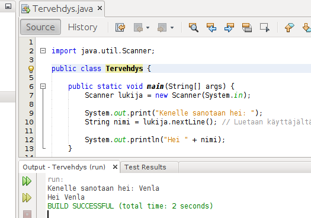

<text-box variant='learningObjectives' name='Oppimistavoitteet'>

- Kertaat merkkijonojen lukemista, tulostamista sekä vertailua.
- Osaat ottaa merkkijonosta osajonon sekä etsiä merkkijonosta toista merkkijonoa.
- Osaat pilkkoa merkkijonon useampaan osaan.

</text-box>


Tutustutaan seuraavaksi tarkemmin merkkijonoihin (`String`) sekä kerrataan hieman niihin liittyviä perusominaisuuksia. Merkkijonomuuttuja määritellään kertomalla sen tyyppi (String) sekä nimi. Tätä seuraa muuttujan arvo, joka on hipsujen sisällä olevaa tekstiä. Alla luodaan merkkijonomuuttuja `taikasana`, joka sisältää arvon `"abrakadabra"`.


```java
String taikasana = "abrakadabra";
```

Merkkijonomuuttujan antaminen tulostuskomennolle (tai oikeastaan mille tahansa metodille) parametrina onnistuu tutulla tavalla. Alla määritellään merkkijono, joka tulostetaan.


```java
String taikasana = "abrakadabra";
System.out.println(taikasana);
```

<sample-output>

abrakadabra

</sample-output>


## Merkkijonojen lukeminen ja tulostaminen

Kuten muistamme, merkkijonon lukeminen onnistuu tutun Scanner-apuvälineen tarjoamalla nextLine-metodilla. Alla oleva ohjelma lukee käyttäjän nimen ja tulostaa sen seuraavalla rivillä (esimerkissä käyttäjän syöttämä teksti on merkitty punaisella):


```java
Scanner lukija = new Scanner(System.in);

System.out.print("Mikä on nimesi? ");
// Luetaan käyttäjältä rivi tekstiä ja asetetaan se muuttujaan nimi
String nimi = lukija.nextLine();

System.out.println(nimi);
```

<sample-output>

Mikä on nimesi? **Venla**
Venla

</sample-output>


Merkkijonoja voi myös yhdistellä. Jos plus-operaatiota `+` sovelletaan kahden merkkijonon välille, syntyy uusi merkkijono, jossa kaksi merkkijonoa on yhdistetty. Huomaa nokkela välilyönnin käyttö lauseen "muuttujien" osana!


```java
String tervehdys = "Hei ";
String nimi = "Lilja";
String hyvastely = " ja näkemiin!";

String lause = tervehdys + nimi + hyvastely;

System.out.println(lause);
```

<sample-output>

Hei Lilja ja näkemiin!

</sample-output>


Jos toinen operaation `+` kohteista on merkkijono, muutetaan myös toinen operaation kohteista merkkijonoksi. Alla olevassa esimerkissä kokonaisluku `2` on muutettu merkkijonoksi "2", ja siihen on yhdistetty merkkijono.


```java
String teksti = "tuossa on kokonaisluku";
System.out.println(teksti + " --> " + 2);
System.out.println(2 + " <-- " + teksti);
```

<sample-output>

tuossa on kokonaisluku --> 2
2 <-- tuossa on kokonaisluku

</sample-output>


Aiemmin tutuksi tulleet laskusäännöt sekä sulkeiden noudattaminen pätee myös merkkijonoja käsiteltäessä.


```java
String teksti = " oho!";
System.out.println("Neljä: " + (2 + 2) + teksti);
System.out.println("Mutta! kaksikymmentäkaksi: " + 2 + 2 + teksti);
```

<sample-output>

Neljä: 4 oho!
Mutta! kaksikymmentäkaksi: 22 oho!

</sample-output>


Seuraavassa on ensimmäisestä osasta tuttu käyttäjää tervehtivä ohjelma pääohjelmarungon kanssa. Ohjelman nimi on _Tervehdys_.


```java
import java.util.Scanner;

public class Tervehdys {

    public static void main(String[] args) {
        Scanner lukija = new Scanner(System.in);

        System.out.print("Kenelle sanotaan hei: ");
        String nimi = lukija.nextLine();

        System.out.println("Hei " + nimi);
    }
}
```

Kun yllä oleva ohjelma ajetaan, pääset kirjoittamaan syötteen.  NetBeansin tulostusvälilehti näyttää ajetun ohjelman jälkeen seuraavalta (käyttäjä syöttää nimen "Venla").

<div></div>


<programming-exercise name='Tulostus kolmesti' tmcname='osa03-Osa03_23.TulostusKolmesti'>


Tee ohjelma joka lukee käyttäjältä merkkijonon ja tulostaa merkkijonon kolmesti peräkkäin.


<sample-output>

Mikä tulostetaan? **kukka**

kukkakukkakukka

</sample-output>


Huom! Ohjelma kysyy vain yhtä merkkijonoa. Älä käytä tässä toistolausetta.

</programming-exercise>


<text-box variant='hint' name='Merkkijonojen ja lukujen lukeminen'>


Käyttäjän kanssa keskustelevan ohjelman runko:


```java
import java.util.Scanner;

public class OhjelmanNimi {
    public static void main(String[] args) {
        Scanner lukija = new Scanner(System.in);

        // koodi tähän
    }
}
```

Merkkijonon lukeminen:


```java
String merkkijono = lukija.nextLine();
```

Kokonaisluvun lukeminen:


```java
int kokonaisluku = Integer.valueOf(lukija.nextLine());
```

</text-box>


## Merkkijonojen vertailu ja equals

Merkkijonoja ei voi vertailla yhtäsuuri kuin operaatiolla `==`.  Merkkijonojen vertailuun käytetään erillistä `equals`-komentoa, joka liittyy aina verrattavaan merkkijonoon.

```java
String teksti = "kurssi";

if (teksti.equals("marsipaani")) {
    System.out.println("Teksti-muuttujassa on teksti marsipaani.");
} else {
    System.out.println("Teksti-muuttujassa ei ole tekstiä marsipaani.");
}
```


Komento `equals` liitetään aina siihen verrattavaan tekstimuuttujaan, "tekstimuuttuja piste equals teksti". Tekstimuuttujaa voidaan myös verrata toiseen tekstimuuttujaan.


```java
String teksti = "kurssi";
String toinenTeksti = "pursi";

if (teksti.equals(toinenTeksti)) {
    System.out.println("Samat tekstit!");
} else {
    System.out.println("Eri tekstit!");
}
```


Merkkijonoja vertailtaessa on syytä varmistaa että verrattavalla tekstimuuttujalla on arvo. Jos muuttujalla ei ole arvoa, ohjelma tuottaa virheen _NullPointerException_, joka tarkoittaa ettei muuttujan arvoa ole asetettu tai se on tyhjä (_null_).


Seuraavassa käännetään `!`:n eli negaatio-operaation avulla ehdon arvo päinvastaiseksi:


```java
System.out.println("Eihän merkkijono ole 'maito'");
String merkkijono = "piimä";

if (!(merkkijono.equals("maito"))) {  // tosi jos ehto merkkijono.equals("maito") on epätosi
    System.out.println("ei ollut!");
} else {
    System.out.println("oli");
}
```

<sample-output>

ei ollut!

</sample-output>


Negaatio-operaatio, eli `!ehto`, kääntää siis totuusarvon ympäri.


```java
int eka = 1;
int toka = 3;

boolean onkoSuurempi = eka > toka;

if (!onkoSuurempi) {
    System.out.println("1 ei ole suurempi kuin 3");
}
```

<sample-output>

1 ei ole suurempi kuin 3

</sample-output>


<programming-exercise name='Onko totta' tmcname='osa03-Osa03_24.OnkoTotta'>


Tee ohjelma, joka pyytää käyttäjää kirjoittamaan merkkijonon. Jos käyttäjä kirjoittaa merkkijonon "totta", tulostetaan merkkijono "Oikein meni!", muulloin tulostetaan merkkijono "Koitappa uudelleen!".


<sample-output>

Kirjoita merkkijono: **totta**
Oikein meni!

</sample-output>

<sample-output>

Kirjoita merkkijono: **tottapa**
Koitappa uudelleen!

</sample-output>

</programming-exercise>


<programming-exercise name='Käyttäjätunnukset' tmcname='osa03-Osa03_25.Kayttajatunnukset'>


Tee ohjelma, joka tunnistaa seuraavat käyttäjät:

| tunnus  | salasana  |
|---------|-----------|
| aleksi  | tappara   |
| elina   | kissa     |


Ohjelma näyttää käyttäjälle henkilökohtaisen viestin tai ilmoittaa, jos tunnus tai salasana on väärin.


<sample-output>

Anna tunnus: **aleksi**
Anna salasana: **tappara**
Olet kirjautunut järjestelmään

</sample-output>

<sample-output>

Anna tunnus: **elina**
Anna salasana: **kissa**
Olet kirjautunut järjestelmään

</sample-output>

<sample-output>

Anna tunnus: **aleksi**
Anna salasana: **jokerit**
Virheellinen tunnus tai salasana!

</sample-output>


**HUOM:** muista, että merkkijonoja ei voi vertailla `==`-operaatiolla!


**HUOM:** Todellisuudessa kirjautumistoiminnallisuutta ei tule toteuttaa, eikä yleensä toteutetakkaan näin. Kirjautumistoiminnallisuuden toteuttamiseen tutustutaan mm. web-ohjelmointiin liittyvillä kursseilla.

</programming-exercise>


Merkkijonoilta voi kysyä niiden pituutta kirjoittamalla merkkijonon perään `.length()` eli kutsumalla merkkijonolle sen pituuden kertovaa metodia.


```java
String banaani = "banaani";
String kurkku = "kurkku";
String yhdessa = banaani + kurkku;

System.out.println("Banaanin pituus on " + banaani.length());
System.out.println("Kurkku pituus on " + kurkku.length());
System.out.println("Sanan " + yhdessa + " pituus on " + yhdessa.length());
```


Edellä kutsutaan metodia `length()` kolmelle eri merkkijonolle. Kutsu `banaani.length()` kutsuu nimenomaan merkkijonon `banaani` pituuden kertovaa metodia, kun taas `kurkku.length()` on merkkijonon `kurkku` pituuden kertovan metodin kutsu. Pisteen vasemman puoleinen osa kertoo _kenen_ metodia kutsutaan.


<programming-exercise name='Nimen pituus' tmcname='osa03-Osa03_26.NimenPituus'>


Tee ohjelma, joka kysyy käyttäjän nimen ja ilmoittaa, kuinka monta kirjainta siinä on. Toteuta merkkijonon pituuden selvittäminen erilliseen metodiin `public static int laskeKirjaimet(String merkkijono)`.


<sample-output>

Anna nimi: **Pekka**
Kirjainmäärä: 5

</sample-output>

<sample-output>

Anna nimi: **Katariina**
Kirjainmäärä: 9

</sample-output>

**Huom!** Rakenna ohjelmasi niin että laitat pituuden laskemisen omaan metodiinsa: `public static int laskeKirjaimet(String merkkijono)`. Testit testaavat sekä metodia `laskeKirjaimet` että koko ohjelman toimintaa.

</programming-exercise>


Toistolauseen käyttö merkkijonojen kanssa käy samalla tavalla kuin muiden muuttujien kanssa. Alla olevassa esimerkissä luetaan käyttäjältä merkkijonoja, kunnes käyttäjä syöttää tyhjän merkkijonon (eli painaa vain enteriä). Tämän jälkeen tulostetaan pisin merkkijono sekä pisimmän merkkijonon pituus.


```java
Scanner lukija = new Scanner(System.in);

String pisin = "";

while (true) {
    System.out.println("Syötä sana, tyhjä lopettaa.");
    String syote = lukija.nextLine();

    if (syote.equals("")) {
        break;
    }

    if (pisin.length() < syote.length()) {
        pisin = syote;
    }
}

if (pisin.length() > 0) {
    System.out.println("Pisin merkkijono: " + pisin + " (pituus: " + pisin.length() + ")");
} else {
    System.out.println("Ei järkeviä syötteitä...");
}
```


<programming-exercise name='Salasana' tmcname='osa03-Osa03_27.Salasana'>

Tässä tehtävässä luodaan ohjelma joka kyselee käyttäjältä salasanaa. Jos salasana menee oikein, nähdään salainen viesti.


<sample-output>

Anna salasana: **nauris**
Väärin!
Anna salasana: **lanttu**
Väärin!
Anna salasana: **porkkana**
Oikein!

Salaisuus on: znvavbfgv grugl!

</sample-output>

Ohjelmarunkoon on määritelty muuttuja `String salasana`, jolle on asetettu arvoksi `porkkana` -- älä muuta tätä salasanaa. Toteuta lisätoiminnallisuus, jossa ohjelma kysyy käyttäjältä salasanaa ja vertailee sitä muuttujassa `salasana` olevaan arvoon. Muista mitä erityistä merkkijonojen vertailussa on!

<sample-output>

Anna salasana: **nauris**
Väärin!

</sample-output>


<sample-output>

Anna salasana: **porkkana**
Oikein!

</sample-output>


<sample-output>

Anna salasana: **bataatti**
Väärin!

</sample-output>


Muokkaa tämän jälkeen ohjelmaa siten, että se kysyy salasanaa kunnes käyttäjä syöttää oikean salasanan. Toteuta salasanan jatkuva kysyminen `while (true) { ... }` -toistolausekkeen avulla. Toistolausekkeesta pääsee pois, jos ja vain jos käyttäjän syöttämä salasana on sama kuin muuttujassa `salasana` oleva arvo.


<sample-output>

Anna salasana: **nauris**
Väärin!
Anna salasana: **lanttu**
Väärin!
Anna salasana: **porkkana**
Oikein!

</sample-output>

Lisää ohjelmaan lopulta oma salainen viestisi joka näytetään kun käyttäjä kirjoittaa salasanan oikein. Se voi olla mitä tahansa!


<sample-output>

Anna salasana: **nauris**
Väärin!
Anna salasana: **lanttu**
Väärin!
Anna salasana: **porkkana**
Oikein!

Salaisuus on: znvavbfgv grugl!

</sample-output>


Ylläoleva salaisuus on salattu käyttäen <a href="http://fi.wikipedia.org/wiki/Rot13" target="_blank">Rot13</a>-algoritmia.


</programming-exercise>


## Merkkijonon osa


Merkkijonosta halutaan usein lukea jokin tietty osa. Tämä onnistuu mekkkijonojen eli String-luokan metodilla `substring`. Metodia `substring` voidaan käyttää kahdella tavalla: yksiparametrisenä palauttamaan merkkijonon loppuosa tai kaksiparametrisena palauttamaan parametrien määrittelemä osajono merkkijonosta:


```java
String kirja = "Kalavale";

System.out.println(kirja.substring(4));
System.out.println(kirja.substring(2, 6));
```

<sample-output>

vale
lava

</sample-output>

Koska `substring`-metodin _paluuarvo_ on `String`-tyyppinen, voidaan metodin paluuarvo ottaa talteen String-tyyppiseen muuttujaan loppuosa.


```java
String kirja = "8 veljestä";

String loppuosa = kirja.substring(2);
System.out.println("7 " + loppuosa); // tulostaa: 7 veljestä
```

<sample-output>
7 veljestä
</sample-output>


<programming-exercise name='Alkuosa' tmcname='osa03-Osa03_28.Alkuosa'>


Tee ohjelma, joka tulostaa sanan alkuosan. Ohjelma kysyy käyttäjältä sanan ja alkuosan pituuden. Käytä ohjelmassa metodia `substring`.


<sample-output>

Anna sana: **esimerkki**
Alkuosan pituus: **4**
Tulos: esim

</sample-output>

<sample-output>

Anna sana: **esimerkki**
Alkuosan pituus: **7**
Tulos: esimerk

</sample-output>

</programming-exercise>


<programming-exercise name='Loppuosa' tmcname='osa03-Osa03_29.Loppuosa'>


Tee ohjelma, joka tulostaa sanan loppuosan. Ohjelma kysyy käyttäjältä sanan ja loppuosan pituuden. Käytä ohjelmassa merkkijonon metodia `substring`.


<sample-output>

Anna sana: **esimerkki**
Loppuosan pituus: **4**
Tulos: rkki

</sample-output>


<sample-output>

Anna sana: **esimerkki**
Loppuosan pituus: **7**
Tulos: imerkki

</sample-output>

</programming-exercise>


## Merkkijonosta etsiminen

String-luokan metodit tarjoavat myös mahdollisuuden etsiä tekstistä tiettyä sanaa. Esimerkiksi sana "erkki" sisältyy tekstiin "merkki". Metodi `indexOf()` etsii sille parametrina annettua sanaa merkkijonosta. Jos sana löytyy, metodi `indexOf()` palauttaa sanan ensimmäisen kirjaimen indeksin, eli paikan (muista että paikkanumerointi alkaa nollasta!). Jos taas sanaa ei merkkijonosta löydy, metodi palauttaa arvon -1.


```java
String sana = "merkkijono";

int indeksi = sana.indexOf("erkki"); //indeksin arvoksi tulee 1
System.out.println(sana.substring(indeksi)); //tulostetaan "erkkijono"

indeksi = sana.indexOf("jono"); //indeksin arvoksi tulee 6
System.out.println(sana.substring(indeksi)); //tulostetaan "jono"

indeksi = sana.indexOf("kirja"); //sana "kirja" ei sisälly sanaan "merkkijono"
System.out.println(indeksi); // tulostetaan -1
System.out.println(sana.substring(indeksi)); // virhe!
```

<code-states-visualizer input='{"code":"public class Esimerkki {\n   public static void main(String[] args) {\n      String sana = \"merkkijono\";\n\n      int indeksi = sana.indexOf(\"erkki\");\n      System.out.println(sana.substring(indeksi));\n\n      indeksi = sana.indexOf(\"jono\");\n      System.out.println(sana.substring(indeksi));\n\n      indeksi = sana.indexOf(\"kirja\");\n      System.out.println(indeksi);\n      System.out.println(sana.substring(indeksi));\n   }\n}","stdin":"","trace":[{"stdout":"","event":"call","line":3,"stack_to_render":[{"func_name":"main:3","encoded_locals":{},"ordered_varnames":[],"parent_frame_id_list":[],"is_highlighted":true,"is_zombie":false,"is_parent":false,"unique_hash":"1","frame_id":1}],"globals":{},"ordered_globals":[],"func_name":"main","heap":{}},{"stdout":"","event":"step_line","line":3,"stack_to_render":[{"func_name":"main:3","encoded_locals":{},"ordered_varnames":[],"parent_frame_id_list":[],"is_highlighted":true,"is_zombie":false,"is_parent":false,"unique_hash":"2","frame_id":2}],"globals":{},"ordered_globals":[],"func_name":"main","heap":{}},{"stdout":"","event":"step_line","line":5,"stack_to_render":[{"func_name":"main:5","encoded_locals":{"sana":"merkkijono"},"ordered_varnames":["sana"],"parent_frame_id_list":[],"is_highlighted":true,"is_zombie":false,"is_parent":false,"unique_hash":"4","frame_id":4}],"globals":{},"ordered_globals":[],"func_name":"main","heap":{}},{"stdout":"","event":"step_line","line":6,"stack_to_render":[{"func_name":"main:6","encoded_locals":{"sana":"merkkijono","indeksi":1},"ordered_varnames":["sana","indeksi"],"parent_frame_id_list":[],"is_highlighted":true,"is_zombie":false,"is_parent":false,"unique_hash":"8","frame_id":8}],"globals":{},"ordered_globals":[],"func_name":"main","heap":{}},{"stdout":"erkkijono\n","event":"step_line","line":8,"stack_to_render":[{"func_name":"main:8","encoded_locals":{"sana":"merkkijono","indeksi":1},"ordered_varnames":["sana","indeksi"],"parent_frame_id_list":[],"is_highlighted":true,"is_zombie":false,"is_parent":false,"unique_hash":"12","frame_id":12}],"globals":{},"ordered_globals":[],"func_name":"main","heap":{}},{"stdout":"erkkijono\n","event":"step_line","line":9,"stack_to_render":[{"func_name":"main:9","encoded_locals":{"sana":"merkkijono","indeksi":6},"ordered_varnames":["sana","indeksi"],"parent_frame_id_list":[],"is_highlighted":true,"is_zombie":false,"is_parent":false,"unique_hash":"15","frame_id":15}],"globals":{},"ordered_globals":[],"func_name":"main","heap":{}},{"stdout":"erkkijono\njono\n","event":"step_line","line":11,"stack_to_render":[{"func_name":"main:11","encoded_locals":{"sana":"merkkijono","indeksi":6},"ordered_varnames":["sana","indeksi"],"parent_frame_id_list":[],"is_highlighted":true,"is_zombie":false,"is_parent":false,"unique_hash":"19","frame_id":19}],"globals":{},"ordered_globals":[],"func_name":"main","heap":{}},{"stdout":"erkkijono\njono\n","event":"step_line","line":12,"stack_to_render":[{"func_name":"main:12","encoded_locals":{"sana":"merkkijono","indeksi":-1},"ordered_varnames":["sana","indeksi"],"parent_frame_id_list":[],"is_highlighted":true,"is_zombie":false,"is_parent":false,"unique_hash":"22","frame_id":22}],"globals":{},"ordered_globals":[],"func_name":"main","heap":{}},{"stdout":"erkkijono\njono\n-1\n","event":"step_line","line":13,"stack_to_render":[{"func_name":"main:13","encoded_locals":{"sana":"merkkijono","indeksi":-1},"ordered_varnames":["sana","indeksi"],"parent_frame_id_list":[],"is_highlighted":true,"is_zombie":false,"is_parent":false,"unique_hash":"25","frame_id":25}],"globals":{},"ordered_globals":[],"func_name":"main","heap":{}},{"stdout":"erkkijono\njono\n-1\n","event":"exception","exception_msg":"java.lang.StringIndexOutOfBoundsException: String index out of range: -1","stack_to_render":[],"globals":{},"ordered_globals":[],"func_name":"runMain","heap":{}}],"userlog":"Debugger VM maxMemory: 455M\n"}'></code-states-visualizer>


<programming-exercise name='Sana sanassa' tmcname='osa03-Osa03_30.SanaSanassa'>

Tee ohjelma, joka kysyy käyttäjältä kaksi sanaa. Tämän jälkeen ohjelma kertoo onko toinen sana ensimmäisen sanan osana. Käytä ohjelmassa merkkijonon metodia `indexOf`.

<sample-output>

Anna 1. sana: **suppilovahvero**
Anna 2. sana: **ilo**
Sana 'ilo' on sanan 'suppilovahvero' osana.

</sample-output>

<sample-output>

Anna 1. sana: **suppilovahvero**
Anna 2. sana: **suru**
Sana 'suru' ei ole sanan 'suppilovahvero' osana.

</sample-output>

**Huom:** toteuta ohjelmasi tulostus täsmälleen samassa muodossa kuin esimerkin tulostus!

</programming-exercise>


Metodille `indexOf` voi antaa haettavan merkkijonon lisäksi parametrina myös indeksin, mistä lähtien merkkijonoa haetaan. Esimerkiksi


```java
String sana = "merkkijono";

int indeksi = sana.indexOf("erkki"); // indeksin arvoksi tulee 1
System.out.println(sana.substring(indeksi)); //tulostetaan "erkkijono"

indeksi = sana.indexOf("erkki", 2); // indeksin arvoksi tulee -1 sillä erkkiä ei löydy lopusta
System.out.println(sana.substring(indeksi)); // tapahtuu virhe!
```


<programming-exercise name='Montako kertaa merkkijonossa' tmcname='osa03-Osa03_31.MontakoKertaaMerkkijonossa'>


Tehtäväpohjassa tulee mukana ohjelma, joka kysyy käyttäjältä kahta merkkijonoa. Tämän jälkeen ohjelma tulostaa indeksit, joista toinen merkkijono löytyy ensimmäisessä merkkijonossa. Ohjelman esimerkkitulostus on seuraava:


<sample-output>

Mistä haetaan: **ski-bi dibby dib yo da dub dub**
Mitä haetaan: **dib**
Merkkijono dib löytyy kohdasta 7
Merkkijono dib löytyy kohdasta 13

</sample-output>


Muokaa ohjelmaa siten, että ohjelma ei tulosta esiintymiskohtia, mutta tulostaa esiintymiskertojen yhteislukumäärän. Ohjelman tulee muokkauksen jälkeen toimia seuraavasti:


<sample-output>

Mistä haetaan: **ski-bi dibby dib yo da dub dub**
Mitä haetaan: **dib**
Merkkijonon dib esiintymiskertoja: 2

</sample-output>


Voit olettaa, että haettava merkkijono ei itsessään sisällä toistuvaa hahmoa. Haettava ei siis voi olla esim. "voivoi" (mitä harmia tästä voisi tulla jos merkkijono olisi esimerkiksi "voivoivoivoi"?).

</programming-exercise>


## Merkkijonojen pilkkominen pienempiin osiin


Merkkijonon pilkkominen useampaan osaan tapahtuu merkkijonon tarjoamalla metodilla `split`, jolle annetaan parametrina merkkijono, jonka kohdalta käsiteltävä merkkijono jaetaan osiin. Metodi palauttaa taulukon, joka sisältää merkkijonoja. Taulukon indekseissä on pilkotun merkkijonon osat. Metodi toimii seuraavasti:


```java
String merkkijono = "eka toka kolmas neljäs";
String[] palat = merkkijono.split("\\s+");
System.out.println(palat[0]);
System.out.println(palat[1]);
System.out.println(palat[2]);
System.out.println(palat[3]);

int indeksi = 0;
while (indeksi < palat.length) {
    System.out.println(palat[indeksi]);
    indeksi = indeksi + 1;
}
```

<sample-output>

eka
toka
kolmas
neljäs
eka
toka
kolmas
neljäs

</sample-output>


Merkkijonojen pilkkominen on erityisesti hyödyllistä silloin kun käsitellään määrämuotoista tietoa. Määrämuotoisella tiedolla tarkoitetaan tietoa, joka noudattaa jotain tiettyä säännönmukaista muotoa. Tällaisia muotoja ovat esimerkiksi tab separated format (`tsv`) missä arvot ovat eritelty toisistaan sarkainmerkeillä, sekä comma separated format (`csv`) missä arvot on eritelty toisistaan pilkuilla. Alla on esimerkki csv-muotoisesta nimiä ja ikiä sisältävästä tiedosta. Ensimmäinen sarake sisältää nimen ja toinen iän. Sarakkeet on eroteltu toisistaan pilkuilla.


<sample-data>

etunimi,ika
anton,2
leevi,2
lilja,1

</sample-data>


Oletetaan, että käyttäjä syöttää yllä olevat tiedot ohjelmaan riveittäin. Syötteen lopettaminen lopetetaan tyhjällä merkkijonolla. Ohjelma, joka laskisi syötettyjen henkilöiden keski-iän voidaan toteuttaa seuraavasti.


```java
Scanner lukija = new Scanner(System.in);
int ikienSumma = 0;
int ikienLukumaara = 0;

while (true) {
    String luettu = lukija.nextLine();
    if (luettu.equals("")) {
        break;
    }

    String[] palat = luettu.split(",");
    ikienSumma = ikienSumma + Integer.valueOf(palat[1]);
    ikienLukumaara = ikienLukumaara + 1;
}

if (ikienLukumaara > 0) {
    System.out.println("Ikien keskiarvo: " + (1.0 * ikienSumma / ikienLukumaara));
} else {
    System.out.println("Ei syötteitä.");
}
```

<sample-output>

**leevi,2**
**lilja,1**
Ikien keskiarvo: 1.5

</sample-output>


Vastaavalla tavalla voisi myös toteuttaa ohjelman, joka eriyttää nimet luettavasta tiedosta. Alla olevassa esimerkissä nimet säilötään listaan, jonka sisältö tulostetaan ohjelman lopuksi.


```java
Scanner lukija = new Scanner(System.in);
ArrayList<String> nimet = new ArrayList<>();

while (true) {
    String luettu = lukija.nextLine();
    if (luettu.equals("")) {
        break;
    }

    String[] palat = luettu.split(",");
    nimet.add(palat[0]);
}

for (String nimi: nimet) {
    System.out.println(nimi);
}
```

<sample-output>

**anton,2**
**leevi,2**
**lilja,1**
anton
leevi
lilja

</sample-output>

<programming-exercise name='Sanat riveittäin' tmcname='osa03-Osa03_32.SanatRiveittain'>


Kirjoita ohjelma, joka lukee käyttäjältä merkkijonoja. Kun käyttäjä syöttää merkkijonon, ohjelma tarkastelee syötettyä merkkijonoa. Mikäli syötetty merkkijono on tyhjä, ohjelma lopettaa käyttäjältä lukemisen ja ohjelman suoritus päättyy. Mikäli merkkijono ei ole tyhjä, ohjelma pilkkoo syötetyn merkkijonon osiksi välilyöntien kohdalta ja tulostaa yksittäiset osat omille riveilleen.


<sample-output>

**olipa kerran**
olipa
kerran
**pieni ohjelma joka**
pieni
ohjelma
joka
**loppui**
loppui

</sample-output>

</programming-exercise>


<programming-exercise name='Joka toinen sana' tmcname='osa03-Osa03_33.JokaToinenSana'>


Kirjoita ohjelma, joka lukee käyttäjältä merkkijonoja. Kun käyttäjä syöttää merkkijonon, ohjelma tarkastelee syötettyä merkkijonoa. Mikäli syötetty merkkijono on tyhjä, ohjelma lopettaa käyttäjältä lukemisen ja ohjelman suoritus päättyy. Mikäli merkkijono ei ole tyhjä, ohjelma pilkkoo syötetyn merkkijonon osiksi välilyöntien kohdalta ja tulostaa joka toisen osan ensimmäisestä indeksistä lähtien.


<sample-output>

**olipa kerran pieni kuva**
kerran
kuva
**missä oli metsä**
oli
**loppu**
**oikeasti loppuu vasta kun syotetaan tyhja mjono**
loppuu
kun
tyhja

</sample-output>


</programming-exercise>


<programming-exercise name='Henkilötietojen tarkastelu' tmcname='osa03-Osa03_34.HenkilotietojenTarkastelu'>


Kirjoita ohjelma, joka lukee käyttäjältä comma separated values -muodossa olevia henkilötietoja. Tiedot sisältävät etunimen ja syntymävuoden pilkulla eroteltuna. TIetojen lukemista jatketaan kunnes käyttäjä syöttää tyhjän merkkijonon.


Kun lukeminen lopetetaan, ohjelma tulostaa pisimmän luetun etunimen sekä luettujen henkilöiden syntymävuosien keskiarvon. Mikäli pisimpiä etunimiä on useita, voit tulostaa niistä minkä tahansa. Voit olettaa, että käyttäjä syöttää aina vähintään yhden henkilötiedon.


<sample-output>

**leevi,2017**
**anton,2017**
**lilja,2017**
**venla,2014**
**gabriel,2009**

Pisin nimi: gabriel
Syntymävuosien keskiarvo: 2014.8

</sample-output>


<sample-output>

**sauli,1948**
**tarja,1943**
**martti,1936**
**mauno,1923**
**urho,1900**

Pisin nimi: martti
Syntymävuosien keskiarvo: 1930.0

</sample-output>


</programming-exercise>
