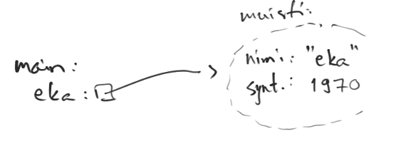
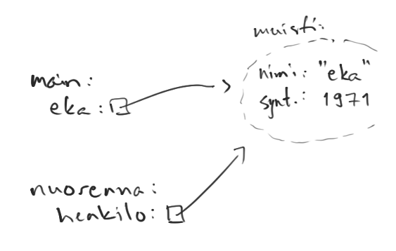
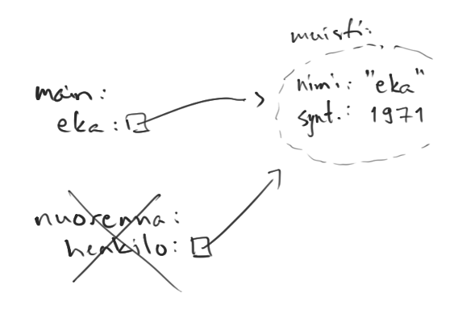
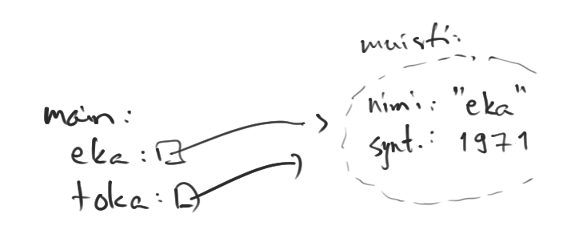
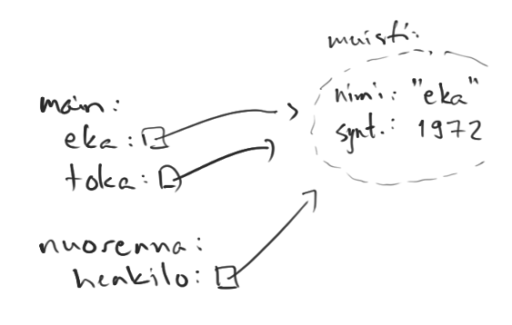

<text-box variant='learningObjectives' name='Oppimistavoitteet'>

- Tunnet käsitteet alkeistyyppinen muuttuja ja viittaustyyppinen muuttuja.
-  Tiedät minkälaisia alkeistyyppisiä muuttujia Javassa on, ja tiedät että erilaisia viittaustyyppisiä muuttujia voi olla käytännössä rajaton määrä.
-  Tiedät miten alkeis- ja viittaustyyppisten muuttujien käyttäytyminen eroaa toisistaan kun muuttujaan asetetaan arvoa ja kun muuttujaa käytetään metodin parametrina.

</text-box>


Javan muuttujat jaetaan alkeis- ja viittaustyyppisiin muuttujiin. Ohjelmoijan näkökulmasta alkeistyyppisten muuttujien tieto on tallennettu muuttujan arvoksi, kun taas viittaustyyppisten muuttujien arvona on viite muuttujaan liittyvään tietoon. Viittaustyyppiset muuttujat ovat Java-kielessä käytännössä aina olioita. Tarkastellaan näitä muuttujatyyppejä kahden esimerkin kautta.


```java
int arvo = 10;
System.out.println(arvo);
```

<sample-output>

10

</sample-output>


```java
public Nimi {
    private String nimi;

    public Nimi(String nimi) {
        this.nimi = nimi;
    }
}
```

```java
Nimi leevi = new Nimi("Leevi");
System.out.println(leevi);
```

<sample-output>

Nimi@4aa298b7

</sample-output>

Ensimmäisessä esimerkissä luodaan alkeistyyppinen `int`-muuttuja, jonka arvoksi kopioidaan luku `10`. Kun muuttuja annetaan `System.out.println`-metodille tulostettavaksi, tulostuu arvo `10`. Toisessa esimerkissä luodaan viittaustyyppinen `leevi`-niminen muuttuja, jonka arvoksi kopioidaan `Nimi`-luokassa määritellyn konstruktorin kutsun palauttama viite olioon. Kun muuttuja tulostetaan, tulostuu merkkijono `Nimi@4aa298b7`. Mistä tässä oikein on kyse?


Metodikutsu `System.out.println` tulostaa muuttujan arvon. Alkeistyyppistien muuttujien arvo on konkreettinen, kun taas viittaustyyppisten muuttujien arvo on viite. Kun viittaustyyppinen muuttuja tulostetaan, tulostuksena on muuttujan tyyppi sekä Javan muuttujalle luoma tunniste: merkkijono `Nimi@4aa298b7` kertoo, että kyse on `Nimi`-tyyppisestä muuttujasta, jonka tunniste on `4aa298b7`.


Edellinen esimerkki pätee silloin, jos ohjelmoija ei ole muuttanut olion oletustulostusmuotoa. Tulostusmuodon voi muuttaa määrittelemällä olion luokkaan metodi `toString`, jossa kerrotaan miltä olion tulostuksen tulee näyttää. Alla olevassa esimerkissä luokalle `Nimi` on määritelty metodi `public String toString()`, joka palauttaa oliomuuttujan `nimi`. Nyt, kun luokasta luotu olio tulostetaan `System.out.println`-komennolla, tulostustettava tieto on metodin `toString` palauttama merkkijono.


```java
public Nimi {
    private String nimi;

    public Nimi(String nimi) {
        this.nimi = nimi;
    }

    public String toString() {
        return this.nimi;
    }
}
```


```java
Nimi leevi = new Nimi("Leevi");
System.out.println(leevi); // sama kuin System.out.println(leevi.toString());
```

<sample-output>

Leevi

</sample-output>


## Alkeistyyppiset muuttujat


Javassa on kahdeksan alkeistyyppistä muuttujaa. Nämä ovat `boolean` (totuusarvo, joko `true` tai `false`), `byte` (8 bittiä sisältävä tavu, välillä `-128` ja `127`), `char` (yhtä kirjainmerkkiä kuvaava 16-bittiä sisältävä kirjainarvo), `short` (pientä kokonaislukua kuvaava 16 bittiä sisältävä arvo, välillä `-32768` ja `32767`), `int` (keskikokoista kokonaislukua kuvaava 32 bittiä sisältävä arvo, välillä <code class="language-text">-2<sup>31</sup></code> ja <code class="language-text">2<sup>31</sup>-1</code>), `long` (isohkoa kokonaislukua kuvaava 64 bittiä sisältävä arvo, välillä <code class="language-text">-2<sup>63</sup></code> ja <code class="language-text">2<sup>63</sup>-1</code>), `float` (32-bittiä käyttävä liukuluku) ja `double` (64-bittiä käyttävä liukuluku).


Olemme käyttäneet näistä ensisijaisesti totuusarvomuuttujia (`boolean`), kokonaislukumuuttujia (`int`), ja liukulukumuuttujia (`double`).


```java
boolean totuusarvo = false;
int kokonaisluku = 42;
double liukuluku = 4.2;

System.out.println(totuusarvo);
System.out.println(kokonaisluku);
System.out.println(liukuluku);
```

<sample-output>

false
42
4.2

</sample-output>


Alkeistyyppisillä muuttujilla muuttujan esittely varaa muistista muuttujan tyypin kokoisen muistipaikan, johon muuttujaan asetettava arvo kopioidaan. Alla olevassa esimerkissä luodaan kolme muuttujaa. Jokaisella muuttujalla on erillinen paikka muistissa, johon asetettava arvo kopioidaan.


```java
int eka = 10;
int toka = eka;
int kolmas = toka;
System.out.println(eka + " " + toka + " " + kolmas);
toka = 5;
System.out.println(eka + " " + toka + " " + kolmas);
```

```java
10 10 10
10 5 10
```


Muuttujan nimi kertoo paikan, missä muuttujan arvo sijaitsee. Muuttujan arvon asetus yhtäsuuruusmerkillä aiheuttaa arvon kopioimisen muuttujan nimen perusteella tunnistettavaan muistipaikkaan. Esimerkiksi lause `int eka = 10` varaa muuttujalle paikan nimeltä `eka` ja kopioi arvon `10` siihen.


Vastaavasti lause `int toka = eka;` varaa luotavalle muuttujalle paikan nimeltä `toka` ja kopioi siihen muuttujan `eka` paikan sisältämän arvon.


Muuttujien arvot kopioituvat myös metodikutsujen yhteydessä. Käytännössä tämä tarkoittaa sitä, että metodikutsun yhteydessä metodin parametriksi annetun muuttujan arvo ei muutu metodia kutsuvassa metodissa. Alla olevassa esimerkissä main-metodissa esitellään muuttuja luku, jonka arvo kopioidaan metodin kutsu parametriksi. Metodissa kutsu parametrina saatu arvo tulostetaan, jonka jälkeen arvoa kasvatetaan yhdellä, jonka jälkeen arvo tulostetaan vielä kerran. Lopulta metodin kutsu suoritus loppuu, ja palataan main-metodiin. Main-metodissa olevan luku-muuttujan arvo ei ole muuttunut, sillä se ei liity millään tavalla kutsu-metodin parametriksi määriteltyyn muuttujaan luku.


<code-states-visualizer input='{"code":"public class Esimerkki {\n    public static void main(String[] args) {\n        int luku = 1;\n        kutsu(luku);\n       \n        System.out.println(\"Luku vieläkin: \" + luku);\n    }\n   \n    public static void kutsu(int luku) {\n        System.out.println(\"Luku aluksi: \" + luku);\n        luku = luku + 1;\n        System.out.println(\"Luku lopuksi: \" + luku);\n    }\n}","stdin":"","trace":[{"stdout":"","event":"call","line":3,"stack_to_render":[{"func_name":"main:3","encoded_locals":{},"ordered_varnames":[],"parent_frame_id_list":[],"is_highlighted":true,"is_zombie":false,"is_parent":false,"unique_hash":"1","frame_id":1}],"globals":{},"ordered_globals":[],"func_name":"main","heap":{}},{"stdout":"","event":"step_line","line":3,"stack_to_render":[{"func_name":"main:3","encoded_locals":{},"ordered_varnames":[],"parent_frame_id_list":[],"is_highlighted":true,"is_zombie":false,"is_parent":false,"unique_hash":"2","frame_id":2}],"globals":{},"ordered_globals":[],"func_name":"main","heap":{}},{"stdout":"","event":"step_line","line":4,"stack_to_render":[{"func_name":"main:4","encoded_locals":{"luku":1},"ordered_varnames":["luku"],"parent_frame_id_list":[],"is_highlighted":true,"is_zombie":false,"is_parent":false,"unique_hash":"4","frame_id":4}],"globals":{},"ordered_globals":[],"func_name":"main","heap":{}},{"stdout":"","event":"call","line":10,"stack_to_render":[{"func_name":"kutsu:10","encoded_locals":{"luku":1},"ordered_varnames":["luku"],"parent_frame_id_list":[],"is_highlighted":true,"is_zombie":false,"is_parent":false,"unique_hash":"7","frame_id":7},{"func_name":"main:4","encoded_locals":{"luku":1},"ordered_varnames":["luku"],"parent_frame_id_list":[],"is_highlighted":false,"is_zombie":false,"is_parent":false,"unique_hash":"8","frame_id":8}],"globals":{},"ordered_globals":[],"func_name":"kutsu","heap":{}},{"stdout":"","event":"step_line","line":10,"stack_to_render":[{"func_name":"kutsu:10","encoded_locals":{"luku":1},"ordered_varnames":["luku"],"parent_frame_id_list":[],"is_highlighted":true,"is_zombie":false,"is_parent":false,"unique_hash":"9","frame_id":9},{"func_name":"main:4","encoded_locals":{"luku":1},"ordered_varnames":["luku"],"parent_frame_id_list":[],"is_highlighted":false,"is_zombie":false,"is_parent":false,"unique_hash":"10","frame_id":10}],"globals":{},"ordered_globals":[],"func_name":"kutsu","heap":{}},{"stdout":"Luku aluksi: 1\n","event":"step_line","line":11,"stack_to_render":[{"func_name":"kutsu:11","encoded_locals":{"luku":1},"ordered_varnames":["luku"],"parent_frame_id_list":[],"is_highlighted":true,"is_zombie":false,"is_parent":false,"unique_hash":"15","frame_id":15},{"func_name":"main:4","encoded_locals":{"luku":1},"ordered_varnames":["luku"],"parent_frame_id_list":[],"is_highlighted":false,"is_zombie":false,"is_parent":false,"unique_hash":"16","frame_id":16}],"globals":{},"ordered_globals":[],"func_name":"kutsu","heap":{}},{"stdout":"Luku aluksi: 1\n","event":"step_line","line":12,"stack_to_render":[{"func_name":"kutsu:12","encoded_locals":{"luku":2},"ordered_varnames":["luku"],"parent_frame_id_list":[],"is_highlighted":true,"is_zombie":false,"is_parent":false,"unique_hash":"17","frame_id":17},{"func_name":"main:4","encoded_locals":{"luku":1},"ordered_varnames":["luku"],"parent_frame_id_list":[],"is_highlighted":false,"is_zombie":false,"is_parent":false,"unique_hash":"18","frame_id":18}],"globals":{},"ordered_globals":[],"func_name":"kutsu","heap":{}},{"stdout":"Luku aluksi: 1\nLuku lopuksi: 2\n","event":"step_line","line":13,"stack_to_render":[{"func_name":"kutsu:13","encoded_locals":{"luku":2},"ordered_varnames":["luku"],"parent_frame_id_list":[],"is_highlighted":true,"is_zombie":false,"is_parent":false,"unique_hash":"27","frame_id":27},{"func_name":"main:4","encoded_locals":{"luku":1},"ordered_varnames":["luku"],"parent_frame_id_list":[],"is_highlighted":false,"is_zombie":false,"is_parent":false,"unique_hash":"28","frame_id":28}],"globals":{},"ordered_globals":[],"func_name":"kutsu","heap":{}},{"stdout":"Luku aluksi: 1\nLuku lopuksi: 2\n","event":"return","line":13,"stack_to_render":[{"func_name":"kutsu:13","encoded_locals":{"luku":2,"__return__":["VOID"]},"ordered_varnames":["luku","__return__"],"parent_frame_id_list":[],"is_highlighted":true,"is_zombie":false,"is_parent":false,"unique_hash":"29","frame_id":29},{"func_name":"main:4","encoded_locals":{"luku":1},"ordered_varnames":["luku"],"parent_frame_id_list":[],"is_highlighted":false,"is_zombie":false,"is_parent":false,"unique_hash":"30","frame_id":30}],"globals":{},"ordered_globals":[],"func_name":"kutsu","heap":{}},{"stdout":"Luku aluksi: 1\nLuku lopuksi: 2\n","event":"step_line","line":6,"stack_to_render":[{"func_name":"main:6","encoded_locals":{"luku":1},"ordered_varnames":["luku"],"parent_frame_id_list":[],"is_highlighted":true,"is_zombie":false,"is_parent":false,"unique_hash":"31","frame_id":31}],"globals":{},"ordered_globals":[],"func_name":"main","heap":{}},{"stdout":"Luku aluksi: 1\nLuku lopuksi: 2\nLuku vieläkin: 1\n","event":"step_line","line":7,"stack_to_render":[{"func_name":"main:7","encoded_locals":{"luku":1},"ordered_varnames":["luku"],"parent_frame_id_list":[],"is_highlighted":true,"is_zombie":false,"is_parent":false,"unique_hash":"36","frame_id":36}],"globals":{},"ordered_globals":[],"func_name":"main","heap":{}},{"stdout":"Luku aluksi: 1\nLuku lopuksi: 2\nLuku vieläkin: 1\n","event":"return","line":7,"stack_to_render":[{"func_name":"main:7","encoded_locals":{"luku":1,"__return__":["VOID"]},"ordered_varnames":["luku","__return__"],"parent_frame_id_list":[],"is_highlighted":true,"is_zombie":false,"is_parent":false,"unique_hash":"37","frame_id":37}],"globals":{},"ordered_globals":[],"func_name":"main","heap":{}}],"userlog":"Debugger VM maxMemory: 455M\n"}'></code-states-visualizer>


## Viittaustyyppiset muuttujat


Kaikki Javan valmiiksi tarjoamat muuttujat (paitsi edellä kuvatut kahdeksan alkeistyyppistä muuttujaa) ovat viittaustyyppisiä. Ohjelmoija voi myös luoda uusia viittaustyyppisiä muuttujatyyppejä määrittelemällä uusia luokkia. Käytännössä jokainen (mistä tahansa) luokasta luotu olio on viittaustyyppinen muuttuja.


Tarkastellaan alussa ollutta esimerkkiä, missä luotiin Nimi-tyyppinen muuttuja leevi.


```java
Nimi leevi = new Nimi("Leevi");
```

Kutsun osat ovat seuravat:

- Mitä tahansa uutta muuttujaa esiteltäessä tulee ensin kertoa esiteltävän muuttujan tyyppi. Alla esitellään muuttuja, jonka tyyppi on `Nimi`. Jotta ohjelman suorittaminen onnistuu, tulee käytössä olla luokka nimeltä `Nimi`.

```java
Nimi ...
```

- Muuttujan esittelyn yhteydessä kerrotaan muuttujan nimi. Muuttujan arvoon voi myöhemmin viitata muuttujan nimen perusteella. Alla muuttujan nimeksi on määritelty leevi.

```java
Nimi leevi ...
```

- Muuttujaan voidaan asettaa arvo. Luokista luodaan olioita kutsumalla konstruktoria, joka määrittelee luotavan olion oliomuuttujiin asetettavat arvot. Alla oletetaan, että luokassa `Nimi` on konstruktori, joka saa parametrikseen merkkijonon.

```java
... new Nimi("Leevi");
```

- Konstruktorikutsu palauttaa arvon, joka on viite luotuun olioon. Yhtäsuuruusmerkki kertoo ohjelmalle, että yhtäsuuruusmerkin oikealla puolella olevan lausekkeen arvo tulee kopioida yhtäsuuruusmerkin vasemmalla puolella olevan muuttujan arvoksi. Konstruktorikutsun palauttama viite juuri luotuun olioon kopioidaan muuttujan `leevi` arvoksi.

```java
Nimi leevi = new Nimi("Leevi");
```


Suurin ero alkeis- ja viittaustyyppisten muuttujien välillä on se, että alkeistyyppiset muuttujat (jotka ovat lähes poikkeuksetta numeroita) ovat muuttumattomia. Viittaustyyppisten muuttujien sisäistä tilaa taas voi tyypillisesti muuttaa. Tämä ilmiö liittyy siihen, että alkeistyyppisten muuttujien arvo on tallennettu suoraan muuttujaan, kun taas viittaustyyppisten muuttujien arvo on viite muuttujan tietoihin eli sisäiseen tilaan.


Alkeistyyppisille muuttujille löytyy laskuoperaatioita kuten plus, miinus, kerto jne -- nämä operaatiot eivät muuta alkuperäisten muuttujien arvoja. Laskuoperaatioiden avulla luodaan uusia arvoja, jotka varastoidaan muuttujiin tarvittaessa. Toisaalta, viittaustyyppisten muuttujien arvoa ei voi muuttaa plus, miinus, kerto ym. laskuoperaatioiden avulla.


Viittaustyyppisen muuttujan arvo -- eli viite -- osoittaa paikkaan, joka sisältää viittaustyyppiseen muuttujaan liittyvät tiedot. Oletetaan, että käytössä on luokka Henkilo, jossa on määritelty oliomuuttujaksi ika. Jos luokasta on luotu henkilö-olio, voi henkilö-olion viitettä seuraamalla päästä käsiksi muuttujaan ika, jonka arvoa voi tarvittaessa muuttaa.


## Alkeis- tai viittaustyyppinen muuttuja metodin parametrina


Totesimme aiemmin, että alkeistyyppisten muuttujien arvo on tallennettuna suoraan muuttujaan, kun taas viittaustyyppisten muuttujien arvo sisältää viitteen olioon. Totesimme myös, että muuttujan arvon asettaminen yhtäsuuruusmerkillä kopioi oikealla olevan (mahdollisesti muuttujan) arvon vasemmalla olevan muuttujan arvoksi.


Vastaavanlainen kopiointi tapahtuu metodikutsun yhteydessä. Riippumatta siitä, onko muuttuja alkeis- tai viittaustyyppinen, metodikutsun yhteydessä metodille parametrina annettava arvo kopioidaan metodin käyttöön. Alkeistyyppisillä muuttujilla metodin käyttöön tulee muuttujan arvo, viittaustyyppisillä muuttujilla metodin käyttöön tulee viite.


Tarkastellaan tätä käytännössä. Oletetaan, että käytössämme on seuraava luokka `Henkilo`.


```java
public class Henkilo {
    private String nimi;
    private int syntymavuosi;

    public Henkilo(String nimi) {
        this.nimi = nimi;
        this.syntymavuosi = 1970;
    }

    public int getSyntymavuosi() {
        return this.syntymavuosi;
    }

    public void setSyntymavuosi(int syntymavuosi) {
        this.syntymavuosi = syntymavuosi;
    }

    public String toString() {
        return this.nimi + " (" + this.syntymavuosi + ")";
    }
}
```

Tarkastellaan seuraavan ohjelman toimintaa askeleittain.


```java
public class Esimerkki {
    public static void main(String[] args) {
        Henkilo eka = new Henkilo("Eka");

        System.out.println(eka);
        nuorenna(eka);
        System.out.println(eka);

        Henkilo toka = eka;
        nuorenna(toka);

        System.out.println(eka);
    }

    public static void nuorenna(Henkilo henkilo) {
        henkilo.setSyntymavuosi(henkilo.getSyntymavuosi() + 1);
    }
}
```

<sample-output>

Eka (1970)
Eka (1971)
Eka (1972)

</sample-output>


Ohjelman suoritus alkaa main-metodin ensimmäiseltä riviltä. Main-metodin ensimmäisellä rivillä esitellään Henkilo-tyyppinen muuttuja eka, johon kopioidaan Henkilo-luokan konstruktorin palauttama arvo. Konstruktorissa luodaan olio, jonka syntymävuodeksi asetetaan 1970 ja jonka nimeksi asetetaan parametrina saatu arvo. Konstruktori palauttaa viitteen. Rivin suorituksen jälkeen ohjelman tilanne on seuraava -- ohjelman muistiin on luotu Henkilo-olio, johon on viittaus main-metodissa määritellystä eka-muuttujasta.


*Alla olevissa piirroksissa vasemmalla puolella on kutsupino, oikealla ohjelman muisti.*





Main-metodin kolmannella rivillä tulostetaan muuttujan eka arvo. Metodikutsu System.out.println etsii sille parametrina annetulta viittaustyyppiseltä muuttujalta toString-metodia. Henkilo-luokalla on metodi toString, joten metodia kutsutaan eka-muuttujan osoittamalle oliolle. Oliossa olevan muuttujan nimi arvo on "Eka" ja syntymävuoden arvo on 1970. Tulostukseksi tulee "Eka (1970)".


Neljännellä rivillä kutsutaan nuorenna-metodia, jolle annetaan parametriksi muuttuja eka. Metodia `nuorenna` kutsuttaessa sille parametrina annetun muuttujan arvo kopioituu metodin `nuorenna` käyttöön. Metodin `main` suoritus jää odottamaan kutsupinoon. Koska muuttuja eka on viittaustyyppinen, kopioituu metodin käyttöön aiemmin luotu viite. Metodin suorituksen lopussa tilanne on seuraava -- metodi kasvattaa parametrina saamansa olion syntymävuotta yhdellä.





Kun metodin nuorenna suoritus loppuu, palataan takaisin main-metodiin. Nuorenna-metodin suoritukseen liittyvät tiedot katoavat kutsupinosta.





Metodikutsusta palaamisen jälkeen suoritetaan taas muuttujan eka arvon tulostaminen. Muuttujan eka osoittamaa oliota on muutettu metodikutsun `nuorenna` yhteydessä: olion `syntymavuosi`-muuttujaa kasvatettiin yhdellä. Tulostukseksi tulee lopulta "Eka (1971)".


Tämän jälkeen ohjelmassa esitellään uusi Henkilo-tyyppinen muuttuja toka. Muuttujaan toka kopioidaan muuttujan eka arvo, eli muuttujan toka arvoksi tulee viite jo olemassaolevaan Henkilo-olioon.





Tämän jälkeen kutsutaan metodia nuorenna, jolle annetaan parametriksi muuttuja toka. Metodia kutsuttaessa parametriksi annetun muuttujan arvo kopioituu metodin arvoksi. Metodi saa siis käyttöönsä muuttujan toka sisältämän viitteen. Metodin suorituksen lopuksi metodin viittaaman olion syntymävuosi on kasvanut yhdellä.





Lopulta metodin suoritus päättyy, ja ohjelman suoritus palaa takaisin main-metodiin. Main-metodissa tulostetaan vielä kerran muuttujan eka arvo. Tulostukseksi tulee lopulta "Eka (1972)".


<quiznator id='5c534c84244fe21455cb6ef4'></quiznator>

<quiznator id='5c534ccfc41ed4148d96b340'></quiznator>


<text-box variant='learningObjectives' name='Muuttujat ja tietokoneen muisti'>


Tässä oppimateriaalissa oiotaan mutkia muuttujien ja tietokoneen muistin toiminnan kannalta. Materiaalissa käsitellään muistiin liittyviä asioita ohjelmoinnin oppimiseen sopivalla abstraktiotasolla. Esimerkiksi toteamus, lause `int luku = 5` varaa muuttujalle `luku` paikan muistista ja kopioi arvon 5 sinne, on tämän kurssin tavoitteiden kannalta sopiva.

Tietokoneen toiminnan näkökulmasta lauseen `int luku = 5` suorituksessa tapahtuu todellisuudessa enemmän. Lausetta suoritettaessa varataan muistista 32-bittinen paikka arvolle `5`, sekä 32-bittisen paikan muuttujalle luku. Paikan koko määräytyy muuttujan tyypin perusteella. Tämän jälkeen arvon 5 sisältämän muistipaikan sisältö kopioidaan muuttujan `luku`-muistipaikkaan.

Tämän lisäksi muuttuja `luku` ei suoranaisesti ole muistipaikka tai lokero. Muuttujan luku arvo on osoite muistissa -- muuttujaan liitetty tieto sen tyypistä kertoo kuinka paljon tietoa muuttujan osoitteesta luetaan. Esimerkiksi kokonaisluvun tapauksessa tämä määrä on 32 bittiä.

Palaamme tähän lyhyesti ohjelmoinnin jatkokurssilla; aihetta käsitellään enemmän kurssilla Tietokoneen toiminta.

</text-box>
