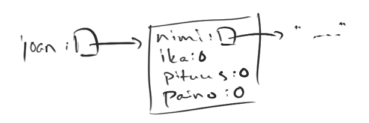
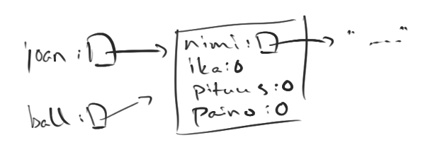
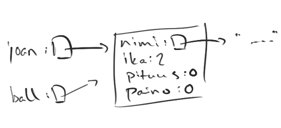
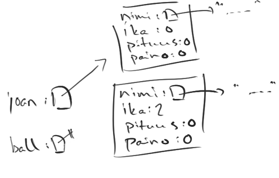
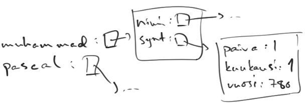

<!-- <text-box variant='learningObjectives' name='Oppimistavoitteet'> -->

<text-box variant='learningObjectives' name='Learning objectives'>


<!-- - Kertaat luokkien ja olioiden toimintaa. -->
- You will brush up on using classes and objects.
<!-- - Tiedät mikä on `null`-viite ja tiedät mistä virhe NullPointerException johtuu. -->
- You know what a `null` reference is, and what causes the NullPointerException error.
<!-- - Osaat käyttää olioita oliomuuttujana ja metodin parametrina. -->
- You can use an object as an object variable and a method parameter.
<!-- - Osaat luoda metodin, joka palauttaa olion. -->
- You can create a method that returns an object.
<!-- - Osaat luoda equals-metodin, jolla voi tarkastaa onko kaksi samantyyppistä oliota sisällöllisesti samat. -->
- You can create the method equals, which can be used to check if two objects of the same type have the same contents or state.

</text-box>


<!-- Jatketaan olioiden ja viitteiden parissa. Oletetaan, että käytössämme on alla oleva henkilöä kuvaava luokka. Henkilöllä on oliomuuttujat nimi, ikä, paino ja pituus, jonka lisäksi se tarjoaa metodin mm. painoindeksin laskemiseen. -->

Let's continue working with objects and references. Assume we can use the class that represents a person, shown below. Person has object variables name, age, weight, and height; additionally, it offers methods to calculate the body mass index, among other things.


<!-- ```java
public class Henkilo {

    private String nimi;
    private int ika;
    private int paino;
    private int pituus;

    public Henkilo(String nimi) {
        this(nimi, 0, 0, 0);
    }

    public Henkilo(String nimi, int ika, int pituus, int paino) {
        this.nimi = nimi;
        this.ika = ika;
        this.paino = paino;
        this.pituus = pituus;
    }

    // muita konstruktoreja ja metodeja

    public String getNimi() {
        return this.nimi;
    }

    public int getIka() {
        return this.ika;
    }

    public int getPituus() {
        return this.pituus;
    }

    public void vanhene() {
        this.ika = this.ika + 1;
    }

    public void setPituus(int uusiPituus) {
        this.pituus = uusiPituus;
    }

    public void setPaino(int uusiPaino) {
        this.paino = uusiPaino;
    }

    public double painoindeksi() {
        double pituusPerSata = this.pituus / 100.0;
        return this.paino / (pituusPerSata * pituusPerSata);
    }

    @Override
    public String toString() {
        return this.nimi + ", ikä " + this.ika + " vuotta";
    }
}
``` -->

```java
public class Person {

    private String name;
    private int age;
    private int weight;
    private int height;

    public Person(String name) {
        this(name, 0, 0, 0);
    }

    public Person(String name, int age, int height, int weight) {
        this.name = name;
        this.age = age;
        this.weight = weight;
        this.height = height;
    }

    // other constructors and methods

    public String getName() {
        return this.name;
    }

    public int getAge() {
        return this.age;
    }

    public int getHeight() {
        return this.height;
    }

    public void growOlder() {
        this.age = this.age + 1;
    }

    public void setHeight(int newHeight) {
        this.height = newHeight;
    }

    public void setWeight(int newWeight) {
        this.weight = newWeight;
    }

    public double bodyMassIndex() {
        double heightPerHundred = this.height / 100.0;
        return this.weight / (heightPerHundred * heightPerHundred);
    }

    @Override
    public String toString() {
        return this.name + ", age " + this.age + " years";
    }
}
```


<!-- Mitä oikein tapahtuu kun olio luodaan? -->

Precisely what happens when a new object is created?


<!-- ```java
Henkilo joan = new Henkilo("Joan Ball");
``` -->

```java
Person joan = new Person("Joan Ball");
```


<!-- Konstruktorikutsun `new` yhteydessä tapahtuu monta asiaa. Ensin tietokoneen muistista varataan tila oliomuuttujille. Tämän jälkeen oliomuuttujiin asetetaan oletus- tai alkuarvot (esimerkiksi `int`-tyyppisten muuttujien arvoksi tulee 0). Lopulta suoritetaan konstruktorissa oleva lähdekoodi. -->

Calling a constructor with the command `new` causes several things to happen. First, space is reserved in the computer memory for storing object variables. Then default or initial values are set to object variables (e.g. an `int` type variable receives an initial value of 0). Lastly, the source code in the constructor is executed.


<!-- Konstruktorikutsu palauttaa viitteen olioon. **Viite** on tieto olioon liittyvien tietojen paikasta. -->

A constructor call returns a reference to an object. A **reference** is information about the location of object data.





<!-- Muuttujan arvoksi asetetaan siis viite, eli tieto olioon liittyvien tietojen paikasta. Yllä oleva kuva paljastaa myös sen, että merkkijonot -- kuten henkilömme nimi -- ovat myös olioita. -->

So the value of the variable is set to be a reference, i.e. knowledge about the location of related object data. The image above also reveals that strings -- the name of our example person, for instance -- are objects, too.

<!-- ## Viittaustyyppisen muuttujan arvon asettaminen kopioi viitteen -->

## Assigning a reference type variable copies the reference


<!-- Lisätään ohjelmaan `Henkilo`-tyyppinen muuttuja `ball` ja annetaan sille alkuarvoksi `joan`. Mitä nyt tapahtuu? -->

Let's add a `Person` type variable called `ball` into the program, and assign `joan` as its initial value. What happens then?


<!-- ```java
Henkilo joan = new Henkilo("Joan Ball");
System.out.println(joan);

Henkilo ball = joan;
``` -->

```java
Person joan = new Person("Joan Ball");
System.out.println(joan);

Person ball = joan;
```

<!-- Lause `Henkilo ball = joan;` luo uuden henkilömuuttujan `ball`, jonka arvoksi kopioidaan muuttujan `joan` arvo. Tämä saa aikaan sen, että `ball` viittaa samaan olioon kuin `joan`. -->

The statement `Person ball = joan;` creates a new Person variable `call`, and copies the value of the variable `joan` as its value. As a result, `ball` refers to the same object as `joan`.





<!-- Tarkastellaan samaa esimerkkiä hieman pidemmälle. -->

Let's inspect the same example a little more thoroughly.


<!-- ```java
Henkilo joan = new Henkilo("Joan Ball");
System.out.println(joan);

Henkilo ball = joan;
ball.vanhene();
ball.vanhene();

System.out.println(joan);
``` -->

```java
Person joan = new Person("Joan Ball");
System.out.println(joan);

Person ball = joan;
ball.growOlder();
ball.growOlder();

System.out.println(joan);
```

<!-- <sample-output>

Joan Ball, ikä 0 vuotta
Joan Ball, ikä 2 vuotta

</sample-output> -->

<sample-output>

Joan Ball, age 0 years
Joan Ball, age 2 years

</sample-output>

<!-- Joan Ball -- eli henkilöolio, johon viite muuttujassa `joan` osoittaa -- on alussa 0-vuotias. Tämän jälkeen muuttujaan `ball` asetetaan (eli kopioidaan) muuttujan `joan` arvo. Henkilöoliota `ball` vanhennetaan kaksi vuotta ja sen seurauksena Joan Ball vanhenee! -->

Joan Ball -- i.e. the Person object that the reference in the `joan` variable points at -- starts as 0 years old. After this the value of the `joan` variable is assigned (so copied) to the `ball` variable. The Person object `ball` is aged by two years, and Joan Ball ages as a consequence!


<!-- Olion sisäinen tila ei kopioidu muuttujan arvoa asetettaessa. Lauseessa `Henkilo ball = joan;` ei luoda uutta oliota -- muuttujan ball arvoksi asetetaan kopio muuttujan joan arvosta, eli viite olioon. -->

An object's internal state is not copied when a variable's value is assigned. A new object is not being created in the statement `Person ball = joan;` -- the value of the variable ball is assigned to be the copy of  joan's value, i.e. a reference to an object.





<!-- Seuraavassa esimerkkiä on jatkettu siten, että `joan`-muuttujaa varten luodaan uusi olio, jonka viite asetetaan muuttujan arvoksi. Muuttuja `ball` viittaa yhä aiemmin luotuun olioon. -->

Next, the example is continued so that a new object is created for the `joan` variable, and a reference to it is assigned as the value of the variable. The variable `ball` still refers to the object that we created earlier.

<!-- ```java
Henkilo joan = new Henkilo("Joan Ball");
System.out.println(joan);

Henkilo ball = joan;
ball.vanhene();
ball.vanhene();

System.out.println(joan);

joan = new Henkilo("Joan B.");
System.out.println(joan);
``` -->

```java
Person joan = new Person("Joan Ball");
System.out.println(joan);

Person ball = joan;
ball.growOlder();
ball.growOlder();

System.out.println(joan);

joan = new Person("Joan B.");
System.out.println(joan);
```


<!-- Tulostuu: -->

The following is printed:


<!-- <sample-output>

Joan Ball, ikä 0 vuotta
Joan Ball, ikä 2 vuotta
Joan B., ikä 0 vuotta

</sample-output> -->

<sample-output>

Joan Ball, age 0 years
Joan Ball, age 2 years
Joan B., age 0 years

</sample-output>


<!-- Muuttujassa `joan` on siis alussa viite yhteen olioon, mutta lopussa sen arvoksi on kopioitu toisen muuttujan viite. Seuraavassa kuva tilanteesta viimeisen koodirivin jälkeen. -->

So in the beginning the variable `joan` contains a reference to one object, but in the end a reference to another object has been copied as its value. Here is a picture of the situation after the last line of code.


<!-- ## Viittaustyyppisen muuttujan arvo `null` -->

## `null` value of a reference variable


<!-- Jatketaan vielä esimerkkiä asettamalla viittaustyyppisen muuttujan `ball` arvoksi `null`, eli viite "ei mihinkään". Viitteen "ei mihinkään" (eli `null`-viitteen voi asettaa minkä tahansa viittaustyyppisen muuttujan arvoksi. -->

Let's extend the example further by setting  the value of the reference variable `ball` to `null`, i.e. a reference "to nothing". The `null` reference can be set as the value of any reference type variable.


<!-- ```java
Henkilo joan = new Henkilo("Joan Ball");
System.out.println(joan);

Henkilo ball = joan;
ball.vanhene();
ball.vanhene();

System.out.println(joan);

joan = new Henkilo("Joan B.");
System.out.println(joan);

ball = null;
``` -->

```java
Person joan = new Person("Joan Ball");
System.out.println(joan);

Person ball = joan;
ball.growOlder();
ball.growOlder();

System.out.println(joan);

joan = new Person("Joan B.");
System.out.println(joan);

ball = null;
```

<!-- Viimeisen rivin jälkeen ohjelman tila on seuraavanlainen. -->

The situation of the program after the last line is depicted below.




<!-- Olioon, jonka nimi on Joan Ball, ei enää viittaa kukaan. Oliosta on siis tullut "roska". Java-ohjelmointikielessä ohjelmoijan ei tarvitse huolehtia ohjelman käyttämästä muistista. Javan automaattinen roskienkerääjä käy siivoamassa roskaksi joutuneet oliot aika ajoin. Jos automaattista roskien keruuta ei tapahtuisi, jäisivät roskaksi joutuneet oliot varaamaan muistia ohjelman suorituksen loppuun asti. -->

The object whose name is Joan Ball is referred to by nobody. In other words, the object has become "garbage". In the Java programming language the programmer need not worry about the program's memory use. From time to time, the automatic garbage collector of the Java language cleans up the objects that have become garbage. If the garbage collection did not happen, the garbage objects would reserve a memory location until the end of the program execution.


<!-- Kokeillaan vielä mitä käy kun yritämme tulostaa muuttujaa, jonka arvona on viite "ei mihinkään" eli `null`. -->

Let's see what happens when we try to print a variable that references "nothing" i.e. `null`.


<!-- ```java
Henkilo joan = new Henkilo("Joan Ball");
System.out.println(joan);

Henkilo ball = joan;
ball.vanhene();
ball.vanhene();

System.out.println(joan);

joan = new Henkilo("Joan B.");
System.out.println(joan);

ball = null;
System.out.println(ball);
``` -->

```java
Person joan = new Person("Joan Ball");
System.out.println(joan);

Person ball = joan;
ball.growOlder();
ball.growOlder();

System.out.println(joan);

joan = new Person("Joan B.");
System.out.println(joan);

ball = null;
System.out.println(ball);
```

<!-- <sample-output>

Joan Ball, ikä 0 vuotta
Joan Ball, ikä 2 vuotta
Joan B., ikä 0 vuotta
null

</sample-output> -->

<sample-output>

Joan Ball, age 0 years
Joan Ball, age 2 years
Joan B., age 0 years
null

</sample-output>


<!-- Viitteen `null` tulostus tulostaa "null". Entäpä jos yritämme kutsua ei mihinkään viittaavan olion metodia, esimerkiksi metodia `vanhene`: -->

Printing a `null` reference prints "null". How about if we were to try and call a method, say `growOlder`, on an object that refers to nothing:


<!-- ```java
Henkilo joan = new Henkilo("Joan Ball");
System.out.println(joan);

joan = null;
joan.vanhene();
``` -->

```java
Person joan = new Person("Joan Ball");
System.out.println(joan);

joan = null;
joan.growOlder();
```

<!-- Tulos: -->

The result:


<sample-output>

Joan Ball, ikä 0 vuotta
**Exception in thread "main" java.lang.NullPointerException
  at Main.main(Main.java:(rivi))
  Java Result: 1**

</sample-output>

Joan Ball, age 0 years
**Exception in thread "main" java.lang.NullPointerException
  at Main.main(Main.java:(row))
  Java Result: 1**

</sample-output>


<!-- Käy huonosti. Tämä on ehkä ensimmäinen kerta kun näet tekstin **NullPointerException**. Ohjelmassa tapahtuu virhe, joka liittyy siihen, että olemme kutsuneet ei mihinkään viittaavan muuttujan metodia. -->

Bad things follow. This could be the first time you have seen the text **NullPointerException**. In the course of the program,there occured an error indicating that we called a method on a variable that refers to nothing.


<!-- Voimme luvata, että tulet näkemään edellisen virheen vielä uudelleen. Tällöin ensimmäinen askel on etsiä muuttujia, joiden arvona saattaisi olla `null`. Virheilmoitus on onneksi myös hyödyllinen: se kertoo millä rivillä virhe tapahtuu. Kokeile vaikka itse! -->

We promise that this is not the last time you will encounter the previous error. When you do, the first step is to look for variables whose value could be `null`. Fortunately, the error message is useful: it tells which row caused the error. Try it out yourself!


<!-- <programming-exercise name='NullPointerException' tmcname='osa05-Osa05_07.NullPointerException'> -->

<programming-exercise name='NullPointerException' tmcname='osa05-Osa05_07.NullPointerException'>


<!-- Toteuta ohjelma, jonka suorittaminen aiheuttaa virheen NullPointerException. Virheen tulee tapahtua heti kun ohjelma suoritetaan -- älä siis esimerkiksi lue käyttäjältä syötettä. -->

Implement a program that causes the NullPointerException error. The error should occur directly after starting the program -- don't wait to read input from the user, for instance.

</programming-exercise>


<!-- ##  Olio metodin parametrina -->

## Object as a method parameter


<!-- Olemme nähneet että metodien parametrina voi olla alkeis- ja viittaustyyppisiä muuttujia. Koska oliot ovat viittaustyyppisiä muuttujia, voi metodin parametriksi määritellä minkä tahansa tyyppisen olion. Demonstroidaan tätä esimerkillä. -->

We have seen both primitive and reference variables act as method parameters. Since objects are reference variables, any type of object can be defined to be a method parameter. Let's take a look at a practical demonstration.

<!-- Huvipuiston laitteisiin hyväksytään henkilöitä, joiden pituus ylittää annetun rajan. Kaikissa laitteissa raja ei ole sama. Tehdään huvipuiston laitetta vastaava luokka. Olioa luotaessa konstruktorille annetaan parametriksi laitteen nimi sekä pienin pituus, jolla laitteeseen pääsee. -->

Amusement park rides only permit people who are taller than a certain height. The limit is not the same for all attractions. Let's create a class representing an amusement park ride. When creating a new object, the constructor receives as parameters the name of the ride, and the smallest height that permits entry to the ride.


<!-- ```java
public class Huvipuistolaite {
    private String nimi;
    private int alinPituus;

    public Huvipuistolaite(String nimi, int alinPituus) {
        this.nimi = nimi;
        this.alinPituus = alinPituus;
    }

    public String toString() {
        return this.nimi + ", pituusalaraja: " + this.alinPituus;
    }
}
``` -->

```java
public class AmusementParkRide {
    private String name;
    private int lowestHeight;

    public AmusementParkRide(String name, int lowestHeight) {
        this.name = name;
        this.lowestHeight = lowestHeight;
    }

    public String toString() {
        return this.name + ", minimum height: " + this.lowestHeight;
    }
}
```

<!-- Tehdään seuraavaksi metodi, jonka avulla voidaan tarkastaa pääseekö tietty henkilö laitteen kyytiin, eli onko henkilö tarpeeksi pitkä. Metodi palauttaa `true` jos parametrina annettu henkilö hyväksytään, `false` jos ei. -->

Then let's write a method that can be used to check if a person is allowed to enter the ride, so if they are tall enough. The method returns `true` if the person given as the parameter is permitted access, and `false` otherwise.

<!-- Alla oletetaan, että henkilöllä metodi ``public int getPituus()`, joka palauttaa henkilön pituuden. -->

Below, it is assumed that Person has the method `public int getHeight()` that returns the height of the person.


<!-- ```java
public class Huvipuistolaite {
    private String nimi;
    private int alinPituus;

    public Huvipuistolaite(String nimi, int alinPituus) {
        this.nimi = nimi;
        this.alinPituus = alinPituus;
    }

    public boolean paaseeKyytiin(Henkilo henkilo) {
        if (henkilo.getPituus() < this.alinPituus) {
            return false;
        }

        return true;
    }

    public String toString() {
        return this.nimi + ", pituusalaraja: " + this.alinPituus;
    }
}
``` -->

```java
public class AmusementParkRide {
    private String name;
    private int lowestHeight;

    public AmusementParkRide(String name, int lowestHeight) {
        this.name = name;
        this.lowestHeight = lowestHeight;
    }

    public boolean allowedToRide(Person person) {
        if (person.getHeight() < this.lowestHeight) {
            return false;
        }

        return true;
    }

    public String toString() {
        return this.name + ", minimum height: " + this.lowestHeight;
    }
}
```

<!-- Huvipuistolaite-olion metodille `paaseeKyytiin` annetaan siis parametrina `Henkilo`-olio. Kuten aiemmin, muuttujan arvo -- eli tässä viite -- kopioituu metodin käyttöön. Metodissa käsitellään kopioitua viitettä ja kutsutaan parametrina saadun henkilön metodia `getPituus`. -->

So the method `allowedToRide` of an AmusementParkRide object is given a `Person` object as a parameter. Like earlier, the value of the variable -- in this case, a reference -- is copied for the method to use. The method handles a copied reference, and it calls the `getHeight` method of the person passed as a parameter.

<!-- Seuraavassa testipääohjelma jossa huvipuistolaitteen metodille annetaan ensin parametriksi henkilöolio `matti` ja sen jälkeen henkilöolio `juhana`: -->

Below is an example main program where the amusement park ride method is called twice: first the supplied parameter is a person object `matt`, and then a person object `jasper`:


<!-- ```java
Henkilo matti = new Henkilo("Matti");
matti.setPaino(86);
matti.setPituus(180);

Henkilo juhana = new Henkilo("Juhana");
juhana.setPaino(34);
juhana.setPituus(132);

Huvipuistolaite hurjakuru = new Huvipuistolaite("Hurjakuru", 140);

if (hurjakuru.paaseeKyytiin(matti)) {
    System.out.println(matti.getNimi() + " pääsee laitteeseen");
} else {
    System.out.println(matti.getNimi() + " ei pääse laitteeseen");
}

if (hurjakuru.paaseeKyytiin(juhana)) {
    System.out.println(juhana.getNimi() + " pääsee laitteeseen");
} else {
    System.out.println(juhana.getNimi() + " ei pääse laitteeseen");
}

System.out.println(hurjakuru);
``` -->

```java
Person matt = new Person("Matt");
matt.setWeight(86);
matt.setHeight(180);

Person jasper = new Person("Jasper");
jasper.setWeight(34);
jasper.setHeight(132);

AmusementParkRide waterTrack = new AmusementParkRide("Water track", 140);

if (waterTrack.allowedToRide(matt)) {
    System.out.println(matt.getName() + " may enter the ride");
} else {
    System.out.println(matt.getName() + " may not enter the ride");
}

if (waterTrack.allowedToRide(jasper)) {
    System.out.println(jasper.getName() + " may enter the ride");
} else {
    System.out.println(jasper.getName() + " may not enter the ride");
}

System.out.println(waterTrack);
```

<!-- Ohjelma tulostaa: -->

The output of the program is:

<!-- <sample-output>

Matti pääsee laitteeseen
Juhana ei pääse laitteeseen
Hurjakuru, pituusalaraja: 140

</sample-output> -->

<sample-output>

Matt may enter the ride
Jasper may not enter the ride
Water track, minimum height: 140

</sample-output>

<!-- Entäpä jos haluaisimme tietää kuinka moni on päässyt laitteen kyytiin? -->

What if we wanted to know how many people have taken the ride?

<!-- Lisätään huvipuistolaitteelle oliomuuttuja, joka pitää kirjaa kyytiin päässeiden henkilöiden lukumäärästä. -->

Let's add an object variable to the amusement park ride. It keeps track of the number of people that were permitted to enter.


<!-- ```java
public class Huvipuistolaite {
    private String nimi;
    private int alinPituus;
    private int kavijoita;

    public Huvipuistolaite(String nimi, int alinPituus) {
        this.nimi = nimi;
        this.alinPituus = alinPituus;
        this.kavijoita = 0;
    }

    public boolean paaseeKyytiin(Henkilo henkilo) {
        if (henkilo.getPituus() < this.alinPituus) {
            return false;
        }

        this.kavijoita++;
        return true;
    }

    public String toString() {
        return this.nimi + ", pituusalaraja: " + this.alinPituus +
            ", kävijöitä: " + this.kavijoita;
    }
}
``` -->

```java
public class AmusementParkRide {
    private String name;
    private int lowestHeight;
    private int visitors;

    public AmusementParkRide(String name, int lowestHeight) {
        this.name = name;
        this.lowestHeight = lowestHeight;
        this.visitors = 0;
    }

    public boolean allowedToRide(Person person) {
        if (person.getHeight() < this.lowestHeight) {
            return false;
        }

        this.visitors++;
        return true;
    }

    public String toString() {
        return this.name + ", minimum height: " + this.lowestHeight +
            ", visitors: " + this.visitors;
    }
}
```

<!-- Nyt aiemmin käyttämässämme esimerkkiohjelmassa pidetään kirjaa myös laitteen kävijöiden määrästä. -->

Now the previously used example program also keeps track of the number of visitors who have experienced the ride.

<!-- ```java
Henkilo matti = new Henkilo("Matti");
matti.setPaino(86);
matti.setPituus(180);

Henkilo juhana = new Henkilo("Juhana");
juhana.setPaino(34);
juhana.setPituus(132);

Huvipuistolaite hurjakuru = new Huvipuistolaite("Hurjakuru", 140);

if (hurjakuru.paaseeKyytiin(matti)) {
    System.out.println(matti.getNimi() + " pääsee laitteeseen");
} else {
    System.out.println(matti.getNimi() + " ei pääse laitteeseen");
}

if (hurjakuru.paaseeKyytiin(juhana)) {
    System.out.println(juhana.getNimi() + " pääsee laitteeseen");
} else {
    System.out.println(juhana.getNimi() + " ei pääse laitteeseen");
}

System.out.println(hurjakuru);
``` -->

```java
Person matt = new Person("Matt");
matt.setWeight(86);
matt.setHeight(180);

Person jasper = new Person("Jasper");
jasper.setWeight(34);
jasper.setHeight(132);

AmusementParkRide waterTrack = new AmusementParkRide("Water track", 140);

if (waterTrack.allowedToRide(matt)) {
    System.out.println(matt.getName() + " may enter the ride");
} else {
    System.out.println(matt.getName() + " may not enter the ride");
}

if (waterTrack.allowedToRide(jasper)) {
    System.out.println(jasper.getName() + " may enter the ride");
} else {
    System.out.println(jasper.getName() + " may not enter the ride");
}

System.out.println(waterTrack);
```

<!-- Ohjelma tulostaa: -->

The output of the program is:

<!-- <sample-output>

Matti pääsee laitteeseen
Juhana ei pääse laitteeseen
Hurjakuru, pituusalaraja: 140, kävijöitä: 1

</sample-output> -->

<sample-output>

Matt may enter the ride
Jasper may not enter the ride
Water track, minimum height: 140, visitors: 1

</sample-output>


<!-- <text-box variant='hint' name='Konstruktorien, getterien ja setterien avustettu luominen'> -->

<text-box variant='hint' name='Assisted creation of constructors, getters, and setters'>


<!-- Ohjelmointiympäristöt osaavat auttaa ohjelmoijaa. Jos luokalle on määriteltynä oliomuuttujat, onnistuu konstruktorien, getterien ja setterien luominen lähes automaattisesti. -->

Development environments can help the programmer. If you have created object variables for a class, creating constructors, getters, and setters can be done almost automatically.


<!-- Mene luokan koodilohkon sisäpuolelle mutta kaikkien metodien ulkopuolelle ja paina yhtä aikaa ctrl ja välilyönti. Jos luokallasi on esim. oliomuuttuja `saldo`, tarjoaa NetBeans mahdollisuuden generoida oliomuuttujalle getteri- ja setterimetodit sekä konstruktorin joka asettaa oliomuuttujalle alkuarvon. -->

Go inside the code block of the class, but outside of all the methods, and simultaneously press ctrl and space. If your class has e.g. an object variable `balance`, NetBeans offers the option to generate the getter and setter methods for the object variable, and a constuctor that assigns an initial value for that variable.


<!-- Joillain Linux-koneilla, kuten Kumpulassa olevilla koneilla, tämä saadaan aikaan painamalla yhtä aikaa ctrl, alt ja välilyönti. -->

On some Linux machines, like on the ones on the Kumpula campus (University of Helsinki), this feature is triggered by simultaneously pressing ctrl, alt, and space.


</text-box>


<!-- <programming-exercise name='Kasvatuslaitos (3 osaa)' tmcname='osa05-Osa05_09.Kasvatuslaitos'> -->

<programming-exercise name='Health institution (3 parts)' tmcname='osa05-Osa05_09.Kasvatuslaitos'>


<!-- Tehtäväpohjassasi on valmiina jo tutuksi tullut luokka `Henkilo` sekä runko luokalle `Kasvatuslaitos`. Kasvatuslaitosoliot käsittelevät ihmisiä eri tavalla, esim. punnitsevat ja syöttävät ihmisiä. Rakennamme tässä tehtävässä kasvatuslaitoksen. Luokan Henkilö koodiin ei tehtävässä ole tarkoitus koskea! -->

In the exercise base there is the class `Person`, which we are already quite familiar with. There is also an outline for the class `Health institution`. Health institution objects process people in different ways, they e.g. weigh and feed people. In this exercise we will construct a health institution. The code of the Person class should not be modified in this exercise!


<!-- <h2>Henkilöiden punnitseminen</h2> -->

<h2>Weighing people</h2>

<!-- Kasvatuslaitoksen luokkarungossa on valmiina runko metodille `punnitse`: -->

In the outline of the Health institution there is an outline for the method `weigh`:

<!-- ```java
public class Kasvatuslaitos {

    public int punnitse(Henkilo henkilo) {
        // palautetaan parametrina annetun henkilön paino
        return -1;
    }
}
``` -->

```java
public class HealthInstitution {

    public int weigh(Person person) {
        // return the weight of the person passed as the parameter
        return -1;
    }
}
```

<!-- Metodi saa parametrina henkilön ja metodin on tarkoitus palauttaa kutsujalleen parametrina olevan henkilön paino. Paino selviää kutsumalla parametrina olevan henkilön `henkilo` sopivaa metodia. **Eli täydennä metodin koodi!** -->

The method receives a person as a parameter, and it is meant to return to its caller the weight of that person. The weight information can be found by calling a suitable method of the person `person`. **So your task is to complete the code of the method!**

<!-- Seuraavassa on pääohjelma jossa kasvatuslaitos punnitsee kaksi henkilöä: -->

Here is a main program where a health institution weight two people:

<!-- ```java
public static void main(String[] args) {
    // esimerkkipääohjelma tehtävän ensimmäiseen kohtaan

    Kasvatuslaitos haaganNeuvola = new Kasvatuslaitos();

    Henkilo eero = new Henkilo("Eero", 1, 110, 7);
    Henkilo pekka = new Henkilo("Pekka", 33, 176, 85);

    System.out.println(eero.getNimi() + " paino: " + haaganNeuvola.punnitse(eero) + " kiloa");
    System.out.println(pekka.getNimi() + " paino: " + haaganNeuvola.punnitse(pekka) + " kiloa");
}
``` -->

```java
public static void main(String[] args) {
    // example main program for the first section of the exercise

    HealthInstitution childrensHospital = new HealthInstitution();

    Person ethan = new Henkilo("Ethan", 1, 110, 7);
    Person peter = new Henkilo("Peter", 33, 176, 85);

    System.out.println(ethan.getName() + " weight: " + childrensHospital.weigh(ethan) + " kilos");
    System.out.println(peter.getName() + " weight: " + childrensHospital.weigh(peter) + " kilos");
}
```


<!-- Tulostuksen pitäisi olla seuraava: -->

The output should be the following:

<sample-output>

Ethan's weight: 7 kilos
Peter's weight: 85 kilos

</sample-output>


<!-- <h2>Syöttäminen</h2> -->

<h2>Feeding</h2>


<!-- Parametrina olevan olion tilaa on mahdollista muuttaa. Tee kasvatuslaitokselle metodi `public void syota(Henkilo henkilo)` joka kasvattaa parametrina olevan henkilön painoa yhdellä. -->

It is possible to modify the state of the object that is received as a parameter. Write a method called `public void feed(Person person)` for the health institution. It should increase the weight of the parameter person by one.


<!-- Seuraavassa esimerkki, jossa henkilöt ensin punnitaan, ja tämän jälkeen neuvolassa syötetään eeroa kolme kertaa. Tämän jälkeen henkilöt taas punnitaan: -->

Following is an example where people are weighed first, and then ethan is fed three times in the children's hospital. After this the people are weighed again:

<!-- ```java
public static void main(String[] args) {
    Kasvatuslaitos haaganNeuvola = new Kasvatuslaitos();

    Henkilo eero = new Henkilo("Eero", 1, 110, 7);
    Henkilo pekka = new Henkilo("Pekka", 33, 176, 85);

    System.out.println(eero.getNimi() + " paino: " + haaganNeuvola.punnitse(eero) + " kiloa");
    System.out.println(pekka.getNimi() + " paino: " + haaganNeuvola.punnitse(pekka) + " kiloa");

    haaganNeuvola.syota(eero);
    haaganNeuvola.syota(eero);
    haaganNeuvola.syota(eero);

    System.out.println("");

    System.out.println(eero.getNimi() + " paino: " + haaganNeuvola.punnitse(eero) + " kiloa");
    System.out.println(pekka.getNimi() + " paino: " + haaganNeuvola.punnitse(pekka) + " kiloa");
}
``` -->

```java
public static void main(String[] args) {
    HealthInstitution childrensHospital = new HealthInstitution();

    Person ethan = new Health("Ethan", 1, 110, 7);
    Person peter = new Health("Peter", 33, 176, 85);

    System.out.println(ethan.getName() + " weight: " + childrensHospital.weigh(ethan) + " kilos");
    System.out.println(peter.getName() + " weight: " + childrensHospital.weigh(peter) + " kilos");

    childrensHospital.feed(ethan);
    childrensHospital.feed(ethan);
    haaganNeuvola.feed(ethan);

    System.out.println("");

    System.out.println(ethan.getName() + " weight: " + childrensHospital.weigh(ethan) + " kilos");
    System.out.println(peter.getName() + " weight: " + childrensHospital.weigh(peter) + " kilos");
}
```

<!-- Tulostuksen pitäisi paljastaa että Eeron paino on noussut kolmella: -->

The output should reveal that Ethan's weight has increased by three:

<!-- <sample-output>

Eero paino: 7 kiloa
Pekka paino: 85 kiloa

Eero paino: 10 kiloa
Pekka paino: 85 kiloa

</sample-output> -->

<sample-output>

Ethan weight: 7 kilos
Peter weight: 85 kilos

Ethan weight: 10 kilos
Peter weight: 85 kilos

</sample-output>


<!-- <h2>Punnitusten laskeminen</h2> -->

<h2>Counting weighings</h2>


<!-- Tee kasvatuslaitokselle metodi `public int punnitukset()` joka kertoo kuinka monta punnitusta kasvatuslaitos on ylipäätään tehnyt. *Huom! Tarvitset uuden oliomuuttujan punnitusten lukumäärän laskemiseen!* Testipääohjelma: -->

Create a new method called `public int weightings()` for the health institution. It should tell how many weightings the health institution has performed. *N.B.! You will need a new object variable for counting the number of weightings!*. Test main program:


<!-- ```java
public static void main(String[] args) {
    // esimerkkipääohjelma tehtävän ensimmäiseen kohtaan

    Kasvatuslaitos haaganNeuvola = new Kasvatuslaitos();

    Henkilo eero = new Henkilo("Eero", 1, 110, 7);
    Henkilo pekka = new Henkilo("Pekka", 33, 176, 85);

    System.out.println("punnituksia tehty " + haaganNeuvola.punnitukset());

    haaganNeuvola.punnitse(eero);
    haaganNeuvola.punnitse(pekka);

    System.out.println("punnituksia tehty " + haaganNeuvola.punnitukset());

    haaganNeuvola.punnitse(eero);
    haaganNeuvola.punnitse(eero);
    haaganNeuvola.punnitse(eero);
    haaganNeuvola.punnitse(eero);

    System.out.println("punnituksia tehty " + haaganNeuvola.punnitukset());
}
``` -->

```java
public static void main(String[] args) {

    HealthInstitution childrensHospital = new HealthInstitution();

    Person ethan = new Person("Ethan", 1, 110, 7);
    Person peter = new Person("Peter", 33, 176, 85);

    System.out.println("weightings performed: " + childrensHospital.weightings());

    childrensHospital.weigh(ethan);
    childrensHospital.weigh(peter);

    System.out.println("weightings performed: " + childrensHospital.weightings());

    childrensHospital.weigh(ethan);
    childrensHospital.weigh(ethan);
    childrensHospital.weigh(ethan);
    childrensHospital.weigh(ethan);

    System.out.println("weightings performed: " + childrensHospital.weightings());
}
```

<!-- Tulostuu: -->

The output is:

<!-- <sample-output>

punnituksia tehty 0
punnituksia tehty 2
punnituksia tehty 6

</sample-output> -->

<sample-output>

weightings performed: 0
weightings performed: 2
weightings performed: 6

</sample-output>

</programming-exercise>


<!-- <programming-exercise name='Maksukortti ja Kassapääte (4 osaa)' tmcname='osa05-Osa05_10.MaksukorttiJaKassapaate'> -->

<programming-exercise name='Payment card and POS terminal (4 sections)' tmcname='osa05-Osa05_10.MaksukorttiJaKassapaate'>


<!-- <h2>"Tyhmä" Maksukortti</h2> -->

<h2>"Dumb" payment card</h2>


<!-- Teimme edellisessä osassa luokan Maksukortti. Kortilla oli metodit edullisesti ja maukkaasti syömistä sekä rahan lataamista varten. -->

In a previous part we created a class called PaymentCard. The card had methods for eating affordably and heartily, and also for adding money to the card.

<!-- Edellisen osan tyylillä tehdyssä Maksukortti-luokassa oli kuitenkin ongelma. Kortti tiesi lounaiden hinnan ja osasi sen ansiosta vähentää saldoa oikean määrän. Entä kun hinnat nousevat? Tai jos myyntivalikoimaan tulee uusia tuotteita? Hintojen muuttaminen tarkoittaisi, että kaikki jo käytössä olevat kortit pitäisi korvata uusilla, uudet hinnat tuntevilla korteilla. -->

However, there was a problem with the PaymentCard class that is implemented in this fashion. The card knew the prices of the different lunches, and therefore was able to decrease the balance by the proper amount. What about if the prices are raised? Or new items are added to the list of offered products? A change in the pricing would mean that all the existing cards would have to be replaced with new cards that are aware of the new prices.

<!-- Parempi ratkaisu on tehdä kortit "tyhmiksi", hinnoista ja myytävistä tuotteista tietämättömiksi pelkän saldon säilyttäjiksi. Kaikki äly kannattaakin laittaa erillisiin olioihin, kassapäätteisiin. -->

An improved solution is to make the cards "dumb"; unaware of the prices and products that are sold, and only keeping track of their balance. All the intelligence is better placed in separate objects, point-of-sale terminals.

<!-- Toteutetaan ensin Maksukortista "tyhmä" versio. Kortilla on ainoastaan metodit saldon kysymiseen, rahan lataamiseen ja rahan ottamiseen. Täydennä alla (ja tehtäväpohjassa) olevaan luokkaan metodin `public boolean otaRahaa(double maara)` ohjeen mukaan: -->

Let's first implement the "dumb" version of the PaymentCard. The card only has methods for asking for the balance, adding money, and taking money. Complete the method `public boolean takeMoney(double amount)` in the class below (and found in the exercise template), using the following as a guide:


<!-- ```java
public class Maksukortti {
    private double saldo;

    public Maksukortti(double saldo) {
        this.saldo = saldo;
    }

    public double saldo() {
        return this.saldo;
    }

    public void lataaRahaa(double lisays) {
        this.saldo = this.saldo + lisays;
    }

    public boolean otaRahaa(double maara) {
        // toteuta metodi siten että se ottaa kortilta rahaa vain jos saldo on vähintään maara
        // onnistuessaan metodi palauttaa true ja muuten false
    }
}
``` -->

```java
public class PaymentCard {
    private double balance;

    public PaymentCard(double balance) {
        this.balance = balance;
    }

    public double balance() {
        return this.balance;
    }

    public void putMoney(double increase) {
        this.balance = this.balance + increase;
    }

    public boolean takeMoney(double amount) {
        // implement the method so that it only takes money from the card if
        // the balance is at least the amount parameter.
        // returns true if successful and false otherwise
    }
}
```

<!-- Testipääohjelma: -->

Test main program:

<!-- ```java
public class Paaohjelma {
    public static void main(String[] args) {
        Maksukortti pekanKortti = new Maksukortti(10);

        System.out.println("rahaa " + pekanKortti.saldo());
        boolean onnistuiko = pekanKortti.otaRahaa(8);
        System.out.println("onnistuiko otto: " + onnistuiko);
        System.out.println("rahaa " + pekanKortti.saldo());

        onnistuiko = pekanKortti.otaRahaa(4);
        System.out.println("onnistuiko otto: " + onnistuiko);
        System.out.println("rahaa " + pekanKortti.saldo());
    }
}
``` -->

```java
public class MainProgram {
    public static void main(String[] args) {
        PaymentCard petesCard = new PaymentCard(10);

        System.out.println("money " + petesCard.balance());
        boolean wasSuccessful = petesCard.takeMoney(8);
        System.out.println("successfully withdrew: " + wasSuccessful);
        System.out.println("money " + petesCard.balance());

        wasSuccessful = petesCard.takeMoney(4);
        System.out.println("successfully withdrew: " + wasSuccessful);
        System.out.println("money " + petesCard.balance());
    }
}
```

<!-- Tulostuksen kuuluisi olla seuraavanlainen -->

The output should be like below

<!-- <sample-output>

rahaa 10.0
onnistuiko otto: true
rahaa 2.0
onnistuiko otto: false
rahaa 2.0

</sample-output> -->

<sample-output>

money 10.0
successfully took: true
money 2.0
successfully took: false
money 2.0

</sample-output>


<!-- <h2>Kassapääte ja käteiskauppa</h2> -->

<h2>POS register and payments with cash</h2>


<!-- Unicafessa asioidessa asiakas maksaa joko käteisellä tai maksukortilla. Myyjä käyttää kassapäätettä kortin velottamiseen ja käteismaksujen hoitamiseen. Tehdään ensin kassapäätteestä käteismaksuihin sopiva versio. -->

When visiting a student cafeteria, the customer pays either with cash or with a payment card. The cashier uses a POS register to charge the card or to process the cash payment. First, let's create a POS register that's suitable for cash payments.


<!-- Kassapäätteen runko. Metodien kommentit kertovat halutun toiminnallisuuden: -->

The outline of the POS register. The comments inside the methods tell the wanted functionality:


<!-- ```java
public class Kassapaate {
    private double rahaa;  // kassassa olevan käteisen määrä
    private int edulliset; // myytyjen edullisten lounaiden määrä
    private int maukkaat;  // myytyjen maukkaiden lounaiden määrä

    public Kassapaate() {
        // kassassa on aluksi 1000 euroa rahaa
    }

    public double syoEdullisesti(double maksu) {
        // edullinen lounas maksaa 2.50 euroa.
        // kasvatetaan kassan rahamäärää edullisen lounaan hinnalla ja palautetaan vaihtorahat
        // jos parametrina annettu maksu ei ole riittävän suuri, ei lounasta myydä ja metodi palauttaa koko summan
    }

    public double syoMaukkaasti(double maksu) {
        // maukas lounas maksaa 4.30 euroa.
        // kasvatetaan kassan rahamäärää maukkaan lounaan hinnalla ja palautetaan vaihtorahat
        // jos parametrina annettu maksu ei ole riittävän suuri, ei lounasta myydä ja metodi palauttaa koko summan
    }

    public String toString() {
        return "kassassa rahaa " + rahaa + " edullisia lounaita myyty " + edulliset + " maukkaita lounaita myyty " + maukkaat;
    }
}
``` -->

```java
public class POSRegister {
    private double money;  // amount of cash in the register
    private int affordableMeals; // number of sold affordable meals
    private int heartyMeals;  // number of sold hearty meals

    public POSRegister() {
        // register initially has 1000 euros of money
    }

    public double eatAffordably(double payment) {
        // an affordable meal costs 2.50 euros
        // increase the amount of cash by the price of an affordable mean and return the change
        // if the payment parameter is not large enough, no meal is sold and the method should return the whole payment
    }

    public double eatHeartily(double payment) {
        // a hearty meal costs 4.30 euros
        // increase the amount of cash by the price of a hearty mean and return the change
        // if the payment parameter is not large enough, no meal is sold and the method should return the whole payment
    }

    public String toString() {
        return "money in the register: " + rahaa + ", number of sold afforable meals: " + affordableMeals + ", number of sold hearty meals: " + heartyMeals;
    }
}
```

<!-- Kassapäätteessä on aluksi rahaa 1000 euroa. Toteuta yllä olevan rungon metodit ohjeen ja alla olevan pääohjelman esimerkkitulosteen mukaan toimiviksi. -->

The register starts with 1000 euros in it. Implement the methods so they work correctly, using the basis above and the example prints of the main program below.

<!-- ```java
public class Paaohjelma {
    public static void main(String[] args) {
        Kassapaate unicafeExactum = new Kassapaate();

        double vaihtorahaa = unicafeExactum.syoEdullisesti(10);
        System.out.println("vaihtorahaa jäi " + vaihtorahaa);

        vaihtorahaa = unicafeExactum.syoEdullisesti(5);
        System.out.println("vaihtorahaa jäi " + vaihtorahaa);

        vaihtorahaa = unicafeExactum.syoMaukkaasti(4.3);
        System.out.println("vaihtorahaa jäi " + vaihtorahaa);

        System.out.println(unicafeExactum);
    }
}
``` -->

```java
public class MainProgram {
    public static void main(String[] args) {
        POSRegister unicafeExactum = new POSRegister();

        double change = unicafeExactum.eatAffordably(10);
        System.out.println("remaining change " + change);

        change = unicafeExactum.eatAffordably(5);
        System.out.println("remaining change " + change);

        change = unicafeExactum.eatHeartily(4.3);
        System.out.println("remaining change " + change);

        System.out.println(unicafeExactum);
    }
}
```

<!-- <sample-output>

vaihtorahaa jäi 7.5
vaihtorahaa jäi 2.5
vaihtorahaa jäi 0.0
kassassa rahaa 1009.3 edullisia lounaita myyty 2 maukkaita lounaita myyty 1

</sample-output> -->

<sample-output>

remaining change: 7.5
remaining change: 2.5
remaining change: 0.0
money in the register: 1009.3, number of sold afforable meals: 2, number of sold hearty meals: 1

</sample-output>


<!-- <h2>Kortilla maksaminen</h2> -->

<h2>Paying with card</h2>


<!-- Laajennetaan kassapäätettä siten että myös kortilla voi maksaa. Teemme kassapäätteelle siis metodit joiden parametrina kassapääte saa maksukortin jolta se vähentää valitun lounaan hinnan. Seuraavassa uusien metodien rungot ja ohje niiden toteuttamiseksi: -->

Let's extend our POS register to also support card payments. We are going to create new methods for the register. It receives a payment card as a parameter, and decreases its balance by the price of the meal that was purchased. Here are the outlines for the methods, and instructions for completing them.

<!-- ```java
public class Kassapaate {
    // ...

    public boolean syoEdullisesti(Maksukortti kortti) {
        // edullinen lounas maksaa 2.50 euroa.
        // jos kortilla on tarpeeksi rahaa, vähennetään hinta kortilta ja palautetaan true
        // muuten palautetaan false
    }

    public boolean syoMaukkaasti(Maksukortti kortti) {
        // maukas lounas maksaa 4.30 euroa.
        // jos kortilla on tarpeeksi rahaa, vähennetään hinta kortilta ja palautetaan true
        // muuten palautetaan false
    }

    // ...
}
``` -->

```java
public class POSRegister {
    // ...

    public boolean eatAffordably(PaymentCard card) {
        // an affordable meal costs 2.50 euros
        // if the payment card has enough money, the balance of the card is decreased by the price, and the method returns true
        // otherwise false is returned
    }

    public boolean eatHeartily(PaymentCard card) {
        // a hearty meal costs 4.30 euros
        // if the payment card has enough money, the balance of the card is decreased by the price, and the method returns true
        // otherwise false is returned
    }

    // ...
}
```


<!-- **Huom:** kortilla maksaminen ei lisää kassapäätteessä olevan käteisen määrää. -->

**N.B.:** card payments don't increase the amount of cash in the register


<!-- Seuraavassa testipääohjelma ja haluttu tulostus: -->

Below is a main program to test the classes, and the output that is desired:


<!-- ```java
public class Paaohjelma {
    public static void main(String[] args) {
        Kassapaate unicafeExactum = new Kassapaate();

        double vaihtorahaa = unicafeExactum.syoEdullisesti(10);
        System.out.println("vaihtorahaa jäi " + vaihtorahaa);

        Maksukortti antinKortti = new Maksukortti(7);

        boolean onnistuiko = unicafeExactum.syoMaukkaasti(antinKortti);
        System.out.println("riittikö raha: " + onnistuiko);
        onnistuiko = unicafeExactum.syoMaukkaasti(antinKortti);
        System.out.println("riittikö raha: " + onnistuiko);
        onnistuiko = unicafeExactum.syoEdullisesti(antinKortti);
        System.out.println("riittikö raha: " + onnistuiko);

        System.out.println(unicafeExactum);
    }
}
``` -->

```java
public class MainProgram {
    public static void main(String[] args) {
        POSRegister unicafeExactum = new POSRegister();

        double change = unicafeExactum.eatAffordably(10);
        System.out.println("remaining change: " + change);

        Maksukortti annesCard = new PaymentCard(7);

        boolean wasSuccessful = unicafeExactum.eatHeartily(annesCard);
        System.out.println("there was enough money: " + wasSuccessful);
        wasSuccessful = unicafeExactum.eatHeartily(annesCard);
        System.out.println("there was enough money: " + wasSuccessful);
        wasSuccessful = unicafeExactum.eatAffordably(annesCard);
        System.out.println("there was enough money: " + wasSuccessful);

        System.out.println(unicafeExactum);
    }
}
```

<!-- <sample-output>

vaihtorahaa jäi 7.5
riittikö raha: true
riittikö raha: false
riittikö raha: true
kassassa rahaa 1002.5 edullisia lounaita myyty 2 maukkaita lounaita myyty 1

</sample-output> -->

<sample-output>

remaining change: 7.5
there was enough money: true
there was enough money: false
there was enough money: true
money in the register: 1002.5, number of sold afforable meals: 2, number of sold hearty meals: 1

</sample-output>


<!-- <h2>Rahan lataaminen</h2> -->

<h2>Adding money</h2>


<!-- Lisätään vielä kassapäätteelle metodi jonka avulla kortille voidaan ladata lisää rahaa. Muista, että rahan lataamisen yhteydessä ladattava summa viedään kassapäätteeseen. Metodin runko: -->

Let's create a method for the register that can be used to add money to a payment card. Recall that the payment that is received when adding money to the card is stored in the register. The basis for the method:


<!-- ```java
public void lataaRahaaKortille(Maksukortti kortti, double summa) {
    // ...
}
``` -->

```java
public void addMoneyToCard(PaymentCard card, double sum) {
    // ...
}
```


<!-- Testipääohjelma ja esimerkkisyöte: -->

A main program to illustrate:


<!-- ```java
public class Paaohjelma {
    public static void main(String[] args) {
        Kassapaate unicafeExactum = new Kassapaate();
        System.out.println(unicafeExactum);

        Maksukortti antinKortti = new Maksukortti(2);

        System.out.println("kortilla rahaa " + antinKortti.saldo() + " euroa");

        boolean onnistuiko = unicafeExactum.syoMaukkaasti(antinKortti);
        System.out.println("riittikö raha: " + onnistuiko);

        unicafeExactum.lataaRahaaKortille(antinKortti, 100);

        onnistuiko = unicafeExactum.syoMaukkaasti(antinKortti);
        System.out.println("riittikö raha: " + onnistuiko);

        System.out.println("kortilla rahaa " + antinKortti.saldo() + " euroa");

        System.out.println(unicafeExactum);
    }
}
``` -->

```java
public class MainProgram {
    public static void main(String[] args) {
        POSRegister unicafeExactum = new POSRegister();
        System.out.println(unicafeExactum);

        PaymentCard annesCard = new PaymentCard(2);

        System.out.println("amount of money on the card is " + antinKortti.saldo() + " euros");

        boolean onnistuiko = unicafeExactum.syoMaukkaasti(antinKortti);
        System.out.println("there was enough money: " + onnistuiko);

        unicafeExactum.lataaRahaaKortille(antinKortti, 100);

        onnistuiko = unicafeExactum.syoMaukkaasti(antinKortti);
        System.out.println("there was enough money: " + onnistuiko);

        System.out.println("amount of money on the card is " + antinKortti.saldo() + " euros");

        System.out.println(unicafeExactum);
    }
}
```

<!-- <sample-output>

kassassa rahaa 1000.0 edullisia lounaita myyty 0 maukkaita lounaita myyty 0
kortilla rahaa 2.0 euroa
riittikö raha: false
riittikö raha: true
kortilla rahaa 97.7 euroa
kassassa rahaa 1100.0 edullisia lounaita myyty 0 maukkaita lounaita myyty 1

</sample-output> -->

<sample-output>

money in the register: 1000.0, number of sold afforable meals: 0, number of sold hearty meals: 0
amount of money on the card is 2.0 euros
there was enough money: false
there was enough money: true
amount of money on the card is 97.7 euros
money in the register: 1100.0, number of sold afforable meals: 0, number of sold hearty meals: 1

</sample-output>


</programming-exercise>


<!-- ## Olio oliomuuttujana -->

## Object as object variable


<!-- Oliot voivat sisältää viitteitä olioihin. -->

Objects may contain references to objects.

<!-- Jatketaan henkilöiden parissa ja lisätään henkilölle syntymäpäivä. Syntymäpäivä on luonnollista esittää `Paivays`-luokan avulla: -->

Let's keep working with people, and add a birthday to the person class. A natural way of representing a birthday is to use a `Date` class. We could use the classname `Date`, but for the sake of avoiding confusion with the [similarly named existing Java class](https://docs.oracle.com/javase/8/docs/api/java/util/Date.html), we will use `OwnDate` here.

<!-- ```java
public class Paivays {
    private int paiva;
    private int kuukausi;
    private int vuosi;

    public Paivays(int paiva, int kuukausi, int vuosi) {
        this.paiva = paiva;
        this.kuukausi = kuukausi;
        this.vuosi = vuosi;
    }

    public int getPaiva() {
        return this.paiva;
    }

    public int getKuukausi() {
        return this.kuukausi;
    }

    public int getVuosi() {
        return this.vuosi;
    }

    @Override
    public String toString() {
        return this.paiva + "." + this.kuukausi + "." + this.vuosi;
    }
}
``` -->

```java
public class OwnDate {
    private int day;
    private int month;
    private int year;

    public OwnDate(int day, int month, int year) {
        this.day = day;
        this.month = month;
        this.year = year;
    }

    public int getDay() {
        return this.day;
    }

    public int getMonth() {
        return this.month;
    }

    public int getYear() {
        return this.year;
    }

    @Override
    public String toString() {
        return this.day + "." + this.month + "." + this.year;
    }
}
```

<!-- Koska tiedämme syntymäpäivän, henkilön ikää ei tarvitse säilöä erillisenä oliomuuttujana. Henkilön ikä on pääteltävissä syntymäpäivästä. Oletetaan, luokassa `Henkilo` on nyt seuraavat muuttujat. -->

Since we know the birthday, there is no need to store that age of a person as a separate object variable. The age of the person can be inferred from their birthday. Let's assume that the class `Person` now has the following variables.

<!-- ```java
public class Henkilo {
    private String nimi;
    private Paivays syntymapaiva;
    private int paino = 0;
    private int pituus = 0;

// ...
``` -->

```java
public class Person {
    private String name;
    private OwnDate birthday;
    private int weight = 0;
    private int length = 0;

// ...
```

<!-- Tehdään henkilölle uusi konstruktori, joka mahdollistaa syntymäpäivän asettamisen: -->

Let's create a new Person constructor that allows for setting the birthday:

<!-- ```java
public Henkilo(String nimi, Paivays paivays) {
    this.nimi = nimi;
    this.syntymapaiva = paivays;
}
``` -->

```java
public Person(String name, OwnDate date) {
    this.name = name;
    this.birthday = date;
}
```

<!-- Edellisen konstruktorin lisäksi henkilölle voisi luoda myös konstruktorin, missä syntymäpäivä annettaisiin parametrina. -->

Along with the constructor above, we could give Person another constructor where the birthday was given as integers.

<!-- ```java
public Henkilo(String nimi, int paiva, int kuukausi, int vuosi) {
    this.nimi = nimi;
    this.syntymapaiva = new Paivays(paiva, kuukausi, vuosi);
}
``` -->

```java
public Person(String name, int day, int month, int year) {
    this.name = name;
    this.birthday = new OwnDate(day, month, year);
}
```

<!-- Konstruktorin parametrina annetaan erikseen päiväyksen osat (päivä, kuukausi, vuosi), niistä luodaan päiväysolio, ja lopulta päiväysolion viite kopioidaan oliomuuttujan `syntymapaiva` arvoksi. -->

The constructor receives as parameters the different parts of the date (day, month, year). They are used to create a date object, and finally the reference to that date is copied as the value of the object variable `birthday`.


<!-- Muokataan Henkilo-luokassa olevaa `toString`-metodia siten, että metodi palauttaa iän sijaan syntymäpäivän: -->

Let's modify the `toString` method of the Person class so that instead of age, the method returns the birthday:


<!-- ```java
public String toString() {
    return this.nimi + ", syntynyt " + this.syntymapaiva;
}
``` -->

```java
public String toString() {
    return this.name + ", born on " + this.syntymapaiva;
}
```

<!-- Kokeillaan miten uusittu Henkilöluokka toimii. -->

Let's see how the updated Person class works.

<!-- ```java
Paivays paivays = new Paivays(1, 1, 780);
Henkilo muhammad = new Henkilo("Muhammad ibn Musa al-Khwarizmi", paivays);
Henkilo pascal = new Henkilo("Blaise Pascal", 19, 6, 1623);

System.out.println(muhammad);
System.out.println(pascal);
``` -->

```java
OwnDate date = new OwnDate(1, 1, 780);
Henkilo muhammad = new Person("Muhammad ibn Musa al-Khwarizmi", date);
Henkilo pascal = new Person("Blaise Pascal", 19, 6, 1623);

System.out.println(muhammad);
System.out.println(pascal);
```

<!-- <sample-output>

Muhammad ibn Musa al-Khwarizmi, syntynyt 1.1.780
Blaise Pascal, syntynyt 19.6.1623

</sample-output> -->

<sample-output>

Muhammad ibn Musa al-Khwarizmi, born on 1.1.780
Blaise Pascal, born on 19.6.1623

</sample-output>


<!-- Henkilöoliolla on nyt oliomuuttujat `nimi` ja `syntymapaiva`. Muuttuja `nimi` on merkkijono, joka sekin on siis olio, ja muuttuja `syntymapaiva` on Päiväysolio. -->

Now a person object has object variables `name` and `birthday`. The variable `name` is a string, which itself is an object; the variable `birthday is an OwnDate object.


<!-- Molemmat muuttujat sisältävät arvon olioon. Henkilöolio sisältää siis kaksi viitettä. Alla olevassa kuvassa paino ja pituus on jätetty huomiotta. -->

Both variables contain a reference to an object. Therefore a person object contains two references. In the image below, weight and height are not considered at all.




<!-- Pääohjelmalla on nyt siis langan päässä kaksi Henkilö-olioa. Henkilöllä on nimi ja syntymäpäivä. Koska molemmat ovat olioita, ovat ne henkilöllä langan päässä. -->

So the main program has is connected to two Person objects by strands. A person has a name and a birthday. Since both variables are objects, these attributes exist at the other ends of the strands.


<!-- Syntymäpäivä vaikuttaa hyvältä laajennukselta Henkilö-luokkaan. Totesimme aiemmin, että oliomuuttuja `ika` voidaan laskea syntymäpäivästä, joten siitä hankkiuduttiin eroon. -->


Birthday appears to be a good extension to the Person class. Earlier we noted that the object variable `age` can be calculated with birthday, so it was removed.

<!-- <text-box variant='hint' name='Päivämäärän käyttö Java-ohjelmissa'> -->

<text-box variant='hint' name='Date in Java programs'>


<!-- Käytämme edellä omaa luokkaa `Paivays` päivämäärän esittämiseen, sillä sen avulla voi havainnollistaa ja harjoitella olioiden toimintaa. Mikäli omissa ohjelmissaan haluaa käsitellä päivämääriä, kannattaa tutustua Javan valmiiseen luokkaan [LocalDate](https://docs.oracle.com/javase/8/docs/api/java/time/LocalDate.html), joka sisältää merkittävän määrän päivämäärien käsittelyyn liittyvää toiminnallisuutta. -->

In the section above, we use our own class `OwnDate` to represent date, because it is suitable for illustrating and practising the operation of objects. If you want to handle dates in your own programs, it's worth reading about the premade Java class [LocalDate](https://docs.oracle.com/javase/8/docs/api/java/time/LocalDate.html). It contains a significant amount of functionality that can be used to handle dates.

<!-- Esimerkiksi nykyinen päivä selviää Javan valmiin `LocalDate`-luokan avulla seuraavasti: -->

For example, the current date can be used with the existing `LocalDate` class in the following manner:

<!-- ```java
import java.time.LocalDate;

public class Esimerkki {

    public static void main(String[] args) {

        LocalDate nyt = LocalDate.now();
        int vuosi = nyt.getYear();
        int kuukausi = nyt.getMonthValue();
        int paiva = nyt.getDayOfMonth();

        System.out.println("tänään on " + paiva + "." + kuukausi + "." + vuosi);

    }
}
``` -->

```java
import java.time.LocalDate;

public class Example {

    public static void main(String[] args) {

        LocalDate now = LocalDate.now();
        int year = now.getYear();
        int month = now.getMonthValue();
        int day = now.getDayOfMonth();

        System.out.println("today is  " + day + "." + month + "." + year);

    }
}
```

</text-box>


<!-- <programming-exercise name='Henkilö ja lemmikki' tmcname='osa05-Osa05_08.HenkiloJaLemmikki'> -->

<programming-exercise name='Person and pet' tmcname='osa05-Osa05_08.HenkiloJaLemmikki'>


<!-- Tehtäväpohjassa tulee kaksi luokkaa, `Henkilo` ja `Lemmikki`. Jokaisella henkilöllä on yksi lemmikki. Täydennä luokan `Henkilo` metodia `public String toString` siten, että metodi palauttaa merkkijonon, joka kertoo henkilön nimen lisäksi lemmikin nimen ja rodun. -->

Two classes, `Person` and `Pet`, are included in the exercise template. Each person has one pet. Modify the `public String toString` method of the `Person` class so that the string it returns tells the pet's name and race in addition to the person's own name.


<!-- ```java
Lemmikki hulda = new Lemmikki("Hulda", "sekarotuinen koira");
Henkilo leevi = new Henkilo("Leevi", hulda);

System.out.println(leevi);
``` -->

```java
Pet lucy = new Pet("Lucy", "mongrel dog");
Person leo = new Person("Leo", lucy);

System.out.println(leo);
```

<!-- <sample-output>

Leevi, kaverina Hulda, joka on sekarotuinen koira

</sample-output> -->

<sample-output>

Leo, has a friend called Lucy (mongrel dog)

</sample-output>

</programming-exercise>


<!-- ## Samantyyppinen olio metodin parametrina -->

## Object of same type as method parameter

<!-- Jatkamme luokan `Henkilo` parissa. Kuten muistamme, henkilöt tietävät syntymäpäivänsä: -->

We will continue working with the `Person` class. We recall that persons know their birthdays:

<!-- ```java
public class Henkilo {

    private String nimi;
    private Paivays syntymapaiva;
    private int pituus;
    private int paino;

    // ...
}
``` -->

```java
public class Person {

    private String name;
    private Paivays birthday;
    private int height;
    private int weight;

    // ...
}
```

<!-- Haluamme vertailla kahden henkilön ikää. Vertailu voidaan hoitaa usealla tavalla. Voisimme esimerkiksi toteuttaa Henkilo-luokkaan metodin `public int ikaVuosina()`, jolloin kahden henkilön iän vertailu tapahtuisi tällöin seuraavasti: -->

We would like to compare the ages of two people. The comparison can be done in multiple ways. We could, for instance, implement a method called `public int ageAsYears()` for the Person class; in that case, the comparison would happen in the following manner:

<!-- ```java
Henkilo muhammad = new Henkilo("Muhammad ibn Musa al-Khwarizmi", 1, 1, 780);
Henkilo pascal = new Henkilo("Blaise Pascal", 19, 6, 1623);

if (muhammad.ikaVuosina() > pascal.ikaVuosina()) {
    System.out.println(muhammad.getNimi() + " on vanhempi kuin " + pascal.getNimi());
}
``` -->

```java
Person muhammad = new Person("Muhammad ibn Musa al-Khwarizmi", 1, 1, 780);
Person pascal = new Person("Blaise Pascal", 19, 6, 1623);

if (muhammad.ageAsYears() > pascal.ageAsYears()) {
    System.out.println(muhammad.getName() + " is older than " + pascal.getName());
}
```

<!-- Opettelemme tässä hieman "oliohenkisemmän" tavan kahden henkilön ikävertailun tekemiseen. -->

We are now going to learn a more "object-oriented" way to compare the ages of people.

<!-- Teemme luokalle Henkilo metodin `boolean vanhempiKuin(Henkilo verrattava)`, jonka avulla tiettyä henkilö-olioa voi verrata parametrina annettuun henkilöön iän perusteella. -->

We are going to create a new method `boolean olderThan(Person compared)` for the Person class. It can be used to compare a certain person object to the person supplied as the parameter based on their ages.

<!-- Metodia on tarkoitus käyttää seuraavaan tyyliin: -->

The method is meant to be used like this:


<!-- ```java
Henkilo muhammad = new Henkilo("Muhammad ibn Musa al-Khwarizmi", 1, 1, 780);
Henkilo pascal = new Henkilo("Blaise Pascal", 19, 6, 1623);

if (muhammad.vanhempiKuin(pascal)) {  //  sama kun muhammad.vanhempiKuin(pascal)==true
    System.out.println(muhammad.getNimi() + " on vanhempi kuin " + pascal.getNimi());
} else {
    System.out.println(muhammad.getNimi() + " ei ole vanhempi kuin " + pascal.getNimi());
}
``` -->

```java
Person muhammad = new Person("Muhammad ibn Musa al-Khwarizmi", 1, 1, 780);
Person pascal = new Person("Blaise Pascal", 19, 6, 1623);

if (muhammad.olderThan(pascal)) {  //  same as muhammad.olderThan(pascal)==true
    System.out.println(muhammad.getName() + " is older than " + pascal.getName());
} else {
    System.out.println(muhammad.getName() + " is not older than " + pascal.getName());
}
```

<!-- Yllä oleva ohjelma kysyy onko al-Khwarizmi vanhempi kuin Pascal. Metodi `vanhempiKuin` palauttaa arvon `true` jos olio jonka kohdalla metodia kutsutaan (`olio.vanhempiKuin(parametrinaAnnettavaOlio)`) on vanhempi kuin parametrina annettava olio, ja `false` muuten. -->

The program above tells if al-Khwarizmi older than Pascal. The method `olderThan` returns `true` if the object that is used to call the method (`object.olderThan(objectGivenAsParameter)`) is older thatn the object given as the parameter, and `false` otherwise.

<!-- Käytännössä yllä kutsutaan "Muhammad ibn Musa al-Khwarizmia" vastaavan olion, johon muuttuja `muhammad` viittaa, metodia `vanhempiKuin`. Metodille annetaan parametriksi "Blaise Pascal" vastaavan olion viite `pascal`. -->

In practice, we call the `olderThan` method of the object that matches "Muhammad ibn Musa al-Khwarizmi", which is referred to by the variable `muhammad`. The reference `pascal`, matching the object "Blaise Pascal", is given as the parameter to that method.

<!-- Ohjelma tulostaa: -->

The program prints:

<!-- <sample-output>

Muhammad ibn Musa al-Khwarizmi on vanhempi kuin Blaise Pascal

</sample-output> -->

<sample-output>

Muhammad ibn Musa al-Khwarizmi is older than Blaise Pascal

</sample-output>

<!-- Metodille `vanhempiKuin` annetaan parametrina henkilöolio. Tarkemmin sanottuna metodin parametriksi määriteltyyn muuttujaan kopioituu parametrina annettavan muuttujan sisältämä arvo, eli viite olioon. -->

The method `olderThan` receives a person object as its parameter. More precisely, the variable that is defined as the method parameter receives a copy of the value contained by the given variable. That value is a reference to an object, in this case.

<!-- Metodin toteutus näyttää seuraavalta. Huomaa, että **metodi voi palauttaa arvon useammasta kohtaa** -- alla vertailu on pilkottu useampaan osaan vuoden, kuukauden ja päivän kohdalta: -->

The implementation of the method is illustrated below. Note that the **method may return a value in more than one place** -- here the comparison has been divided into multiple parts based on the years, the months, and the days:


<!-- ```java
public class Henkilo {
    // ...

    public boolean vanhempiKuin(Henkilo verrattava) {
        // 1. Verrataan ensin vuosia
        int omaVuosi = this.getSyntymapaiva().getVuosi();
        int verrattavanVuosi = verrattava.getSyntymapaiva().getVuosi();

        if (omaVuosi < verrattavanVuosi) {
            return true;
        }

        if (omaVuosi > verrattavanVuosi) {
            return false;
        }

        // 2. Syntymävuosi on sama, verrataan kuukausia
        int omaKuukausi = this.getSyntymapaiva().getKuukausi();
        int verrattavanKuukausi = verrattava.getSyntymapaiva().getKuukausi();

        if (omaKuukausi < verrattavanKuukausi) {
            return true;
        }

        if (omaKuukausi > verrattavanKuukausi) {
            return false;
        }

        // 3. Syntymävuosi ja kuukausi on sama, verrataan päiviä
        int omaPaiva = this.getSyntymapaiva().getPaiva();
        int verrattavanPaiva = verrattava.getSyntymapaiva().getPaiva();

        if (omaPaiva < verrattavanPaiva) {
            return true;
        }

        return false;
    }
}
``` -->

```java
public class Person {
    // ...

    public boolean olderThan(Person compared) {
        // 1. First compare years
        int ownYear = this.getBirthday().getYear();
        int comparedYear = compared.getBirthday().getYear();

        if (ownYear < comparedYear) {
            return true;
        }

        if (ownYear > comparedYear) {
            return false;
        }

        // 2. Same birthyear, compare months
        int ownMonth = this.getBirthday().getMonth();
        int comparedMonth = compared.getBirthday().getMonth();

        if (ownMonth < comparedMonth) {
            return true;
        }

        if (ownMonth > comparedMonth) {
            return false;
        }

        // 3. Same birth year and month, compare days
        int ownDay = this.getBirthday().getDay();
        int comparedDay = compared.getBirthday().getDay();

        if (ownDay < comparedDay) {
            return true;
        }

        return false;
    }
}
```


<!-- Mietitään hieman olio-ohjelmoinnin periatteiden abstrahointia. Abstrahoinnin ajatuksena on käsitteellistää ohjelmakoodia siten, että kullakin käsitteellä on omat selkeät vastuunsa. Kun pohdimme yllä esitettyä ratkaisua, huomaamme, että päivämäärien vertailutoiminnallisuus kuuluisi mielummin luokkaan `Paivays` luokan `Henkilo`-sijaan. -->

Let's pause for a moment to consider abstraction, one of the principles of object-oriented programming. The idea behind abstraction is to conceptualize the programming code so that each concept has its own clear responsibilities. When viewing the solution above, however, we notice that the comparison functionality would be better placed inside the `OwnDate` class instead of the `Person` class.

<!-- Luodaan luokalle `Paivays` metodi `public boolean aiemmin(Paivays verrattava)`. Metodi palauttaa arvon `true`, jos metodille parametrina annettu päiväys on kyseisen olion päiväyksen jälkeen. -->

We'll create a method called `public boolean before(OwnDate compared)` for the class `OwnDate`. The method returns the value `true` if the date given as the parameter is after (or on the same day as) the date of the object whose method is called.

<!-- ```java
public class Paivays {
    private int paiva;
    private int kuukausi;
    private int vuosi;

    public Paivays(int paiva, int kuukausi, int vuosi) {
        this.paiva = paiva;
        this.kuukausi = kuukausi;
        this.vuosi = vuosi;
    }

    public String toString() {
        return this.paiva + "." + this.kuukausi + "." + this.vuosi;
    }

    // metodilla tarkistetaan onko tämä päiväysolio (`this`) ennen
    // parametrina annettavaa päiväysoliota (`verrattava`)
    public boolean aiemmin(Paivays verrattava) {
        // ensin verrataan vuosia
        if (this.vuosi < verrattava.vuosi) {
            return true;
        }

        if (this.vuosi > verrattava.vuosi) {
            return false;
        }

        // jos vuodet ovat samat, verrataan kuukausia
        if (this.kuukausi < verrattava.kuukausi) {
            return true;
        }

        if (this.kuukausi > verrattava.kuukausi) {
            return false;
        }

        // vuodet ja kuukaudet samoja, verrataan päivää
        if (this.paiva < verrattava.paiva) {
            return true;
        }

        return false;
    }
}
``` -->

```java
public class OwnDate {
    private int day;
    private int month;
    private int year;

    public OwnDate(int day, int month, int year) {
        this.day = day;
        this.month = month;
        this.year = year;
    }

    public String toString() {
        return this.day + "." + this.month + "." + this.year;
    }

    // used to check if this date object (`this`) is before
    // the date object given as the parameter (`compared`)
    public boolean before(OwnDate compared) {
        // first compare years
        if (this.year < compared.year) {
            return true;
        }

        if (this.year > compared.year) {
            return false;
        }

        // years are same, compare months
        if (this.month < compared.month) {
            return true;
        }

        if (this.month > compared.month) {
            return false;
        }

        // years and months are same, compare days
        if (this.day < compared.day) {
            return true;
        }

        return false;
    }
}
```

<!-- Vaikka oliomuuttujat `vuosi`, `kuukausi` ja `paiva` ovat olion kapseloimia (`private`) oliomuuttujia, pystymme lukemaan niiden arvon kirjoittamalla `verrattava.*muuttujanNimi*`. Tämä johtuu siitä, että `private`-muuttujat ovat luettavissa kaikissa metodeissa, jotka kyseinen luokka sisältää. Huomaa, että syntaksi (kirjoitusasu) vastaa tässä jonkin olion metodin kutsumista. Toisin kuin metodia kutsuttaessa, viittaamme olion kenttään, jolloin metodikutsun osoittavia sulkeita ei kirjoiteta. -->

Even though the object variables `year`, `month`, and `day` are encapsulated (`private`) object variables, we can read their values by writing `compared.*variableName*`. This is because `private` variable can be accessed from all the methods contained by that class. Notice that the syntax here matches calling some object method. Unlike when calling a method, we refer to a field of an object, so the parentheses that indicate a method call are not written.

<!-- Metodin käyttöesimerkki: -->

An example of how to use the method:

<!-- ```java
public static void main(String[] args) {
    Paivays p1 = new Paivays(14, 2, 2011);
    Paivays p2 = new Paivays(21, 2, 2011);
    Paivays p3 = new Paivays(1, 3, 2011);
    Paivays p4 = new Paivays(31, 12, 2010);

    System.out.println(p1 + " aiemmin kuin " + p2 + ": " + p1.aiemmin(p2));
    System.out.println(p2 + " aiemmin kuin " + p1 + ": " + p2.aiemmin(p1));

    System.out.println(p2 + " aiemmin kuin " + p3 + ": " + p2.aiemmin(p3));
    System.out.println(p3 + " aiemmin kuin " + p2 + ": " + p3.aiemmin(p2));

    System.out.println(p4 + " aiemmin kuin " + p1 + ": " + p4.aiemmin(p1));
    System.out.println(p1 + " aiemmin kuin " + p4 + ": " + p1.aiemmin(p4));
}
``` -->

```java
public static void main(String[] args) {
    OwnDate d1 = new OwnDate(14, 2, 2011);
    OwnDate d2 = new OwnDate(21, 2, 2011);
    OwnDate d3 = new OwnDate(1, 3, 2011);
    OwnDate d4 = new OwnDate(31, 12, 2010);

    System.out.println(p1 + " is earlier than " + p2 + ": " + p1.before(p2));
    System.out.println(p2 + " is earlier than " + p1 + ": " + p2.before(p1));

    System.out.println(p2 + " is earlier than " + p3 + ": " + p2.before(p3));
    System.out.println(p3 + " is earlier than " + p2 + ": " + p3.before(p2));

    System.out.println(p4 + " is earlier than " + p1 + ": " + p4.before(p1));
    System.out.println(p1 + " is earlier than " + p4 + ": " + p1.before(p4));
}
```

<!-- <sample-output>

14.2.2011 aiemmin kuin 21.2.2011: true
21.2.2011 aiemmin kuin 14.2.2011: false
21.2.2011 aiemmin kuin 1.3.2011: true
1.3.2011 aiemmin kuin 21.2.2011: false
31.12.2010 aiemmin kuin 14.2.2011: true
14.2.2011 aiemmin kuin 31.12.2010: false

</sample-output> -->

<sample-output>

14.2.2011 is earlier than 21.2.2011: true
21.2.2011 is earlier than 14.2.2011: false
21.2.2011 is earlier than 1.3.2011: true
1.3.2011 is earlier than 21.2.2011: false
31.12.2010 is earlier than 14.2.2011: true
14.2.2011 is earlier than 31.12.2010: false

</sample-output>

<!-- Muunnetaan vielä henkilön metodia vanhempiKuin siten, että hyödynnämme jatkossa päivämäärän tarjoamaa vertailutoiminnallisuutta. -->

Let's tweak the method olderThan of the Person class so that from here on out, we take use of the comparison functionality that date objects provide.

<!-- ```java
public class Henkilo {
    // ...

    public boolean vanhempiKuin(Henkilo verrattava) {
        if (this.syntymapaiva.aiemmin(verrattava.getSyntymapaiva())) {
            return true;
        }

        return false;

        // tai suoraan:
        // return this.syntymapaiva.aiemmin(verrattava.getSyntymapaiva());
    }
}
``` -->

```java
public class Person {
    // ...

    public boolean olderThan(Person compared) {
        if (this.birthday.before(compared.getBirthday())) {
            return true;
        }

        return false;

        // or return more directly:
        // return this.birthday.before(compared.getBirthday());
    }
}
```

<!-- Nyt päivämäärän konkreettinen vertailu on toteutettu luokassa, johon se loogisesti (luokkien nimien perusteella) kuuluukin. -->

Now the concrete comparison of dates is implemented in the class that it logically (based on the class names) belongs to.


<!-- <programming-exercise name='Asuntovertailu (3 osaa)' tmcname='osa05-Osa05_11.Asuntovertailu'> -->

<programming-exercise name='Apartment comparison (3 sections)' tmcname='osa05-Osa05_11.Asuntovertailu'>


Asuntovälitystoimiston tietojärjestelmässä kuvataan myynnissä olevaa asuntoa seuraavasta luokasta tehdyillä olioilla:


```java
public class Asunto {
    private int huoneita;
    private int nelioita;
    private int neliohinta;

    public Asunto(int huoneita, int nelioita, int neliohinta) {
        this.huoneita = huoneita;
        this.nelioita = nelioita;
        this.neliohinta = neliohinta;
    }
}
```

Tehtävänä on toteuttaa muutama metodi, joiden avulla myynnissä olevia asuntoja voidaan vertailla.


<h2>Onko asunto suurempi</h2>

Tee metodi `public boolean suurempi(Asunto verrattava)` joka palauttaa true jos asunto-olio, jolle metodia kutsutaan, on pinta-alaltaan suurempi kuin verrattavana oleva asunto-olio.

Esimerkki metodin toiminnasta:


```java
Asunto eiraYksio = new Asunto(1, 16, 5500);
Asunto kallioKaksio = new Asunto(2, 38, 4200);
Asunto jakomakiKolmio = new Asunto(3, 78, 2500);

System.out.println(eiraYksio.suurempi(kallioKaksio));       // false
System.out.println(jakomakiKolmio.suurempi(kallioKaksio));  // true
```

<h2>Asuntojen hintaero</h2>


Tee metodi `public int hintaero(Asunto verrattava)` joka palauttaa asunto-olion jolle metodia kutsuttiin ja parametrina olevan asunto-olion hintaeron. Hintaero on asuntojen hintojen erotuksen (hinta lasketaan kertomalla neliöhinta neliöillä) itseisarvo.

Esimerkki metodin toiminnasta:

```java
Asunto eiraYksio = new Asunto(1, 16, 5500);
Asunto kallioKaksio = new Asunto(2, 38, 4200);
Asunto jakomakiKolmio = new Asunto(3, 78, 2500);

System.out.println(eiraYksio.hintaero(kallioKaksio));        // 71600
System.out.println(jakomakiKolmio.hintaero(kallioKaksio));   // 35400
```


<h2>Onko asunto kalliimpi</h2>


Tee metodi `public boolean kalliimpi(Asunto verrattava)` joka palauttaa true jos asunto-olio, jolle metodia kutsutaan on kalliimpi kuin verrattavana oleva asunto-olio.

Esimerkki metodin toiminnasta:

```java
Asunto eiraYksio = new Asunto(1, 16, 5500);
Asunto kallioKaksio = new Asunto(2, 38, 4200);
Asunto jakomakiKolmio = new Asunto(3, 78, 2500);

System.out.println(eiraYksio.kalliimpi(kallioKaksio));       // false
System.out.println(jakomakiKolmio.kalliimpi(kallioKaksio));   // true
```

</programming-exercise>


## Olioiden samankaltaisuuden vertailu (equals)

Opimme merkkijonojen käsittelyn yhteydessä, että merkkijonojen vertailu tulee toteuttaa `equals`-metodin avullla. Tämä tapahtuu seuraavasti.


```java
Scanner lukija = new Scanner(System.in);

System.out.println("Syötä kaksi sanaa, kumpikin omalle rivilleen.")
String eka = lukija.nextLine();
String toka = lukija.nextLine();

if (eka.equals(toka)) {
    System.out.println("Sanat olivat samat.");
} else {
    System.out.println("Sanat eivät olleet samat.");
}
```

Alkeistyyppisten muuttujien kuten `int` kanssa muuttujien vertailu on mahdollista kahden yhtäsuuruusmerkin avulla. Tämä johtuu siitä, että alkeistyyppisten muuttujien arvo sijaitsee "muuttujan lokerossa". Viittaustyyppisten muuttujien arvo on taas osoite viitattavaan olioon, eli viittaustyyppisten muuttujien "lokerossa" on viite muistipaikkaan. Kahden yhtäsuuruusmerkin avulla verrataan "muuttujan lokeron" sisällön yhtäsuuruutta -- viittaustyyppisillä muuttujilla vertailu tarkastelisi siis muuttujien viitteiden yhtäsuuruutta.

Metodi `equals` on samankaltainen metodi kuin `toString` siinä, että se on käytettävissä vaikkei metodia olisi luokkaan määritelty. Metodin oletustoteutus vertaa viitteiden yhtäsuuruutta. Tarkastellaan tätä aiemmin toteuttamamme `Paivays`-luokan avulla.

```java
Paivays eka = new Paivays(1, 1, 2000);
Paivays toka = new Paivays(1, 1, 2000);
Paivays kolmas = new Paivays(12, 12, 2012);
Paivays neljas = eka;

if (eka.equals(eka)) {
    System.out.println("Muuttujat eka ja eka ovat samat");
} else {
    System.out.println("Muuttujat eka ja eka eivät ole samat");
}

if (eka.equals(toka)) {
    System.out.println("Muuttujat eka ja toka ovat samat");
} else {
    System.out.println("Muuttujat eka ja toka eivät ole samat");
}

if (eka.equals(kolmas)) {
    System.out.println("Muuttujat eka ja kolmas ovat samat");
} else {
    System.out.println("Muuttujat eka ja kolmas eivät ole samat");
}

if (eka.equals(neljas)) {
    System.out.println("Muuttujat eka ja neljas ovat samat");
} else {
    System.out.println("Muuttujat eka ja neljas eivät ole samat");
}
```

<sample-output>

Muuttujat eka ja eka ovat samat
Muuttujat eka ja toka eivät ole samat
Muuttujat eka ja kolmas eivät ole samat
Muuttujat eka ja neljas ovat samat

</sample-output>


Esimerkkiohjelma näyttää ongelman. Vaikka kahdella päiväyksellä (eka ja toka) on täsmälleen samat oliomuuttujan arvot, ovat ne metodin `equals` oletustoteutuksen näkökulmasta toisistaan poikkeavat.


Mikäli haluamme pystyä vertailemaan kahta itse toteuttamaamme oliota equals-metodilla, tulee metodi määritellä luokkaan. Metodi equals määritellään boolean-tyyppisen arvon palauttavana metodina -- palautettu arvo kertoo ovatko oliot samat.


Metodi `equals` toteutetaan siten, että sen avulla voidaan vertailla nykyistä oliota mihin tahansa muuhun olioon. Metodi saa parametrinaan Object-tyyppisen olion -- kaikki oliot ovat oman tyyppinsä lisäksi Object-tyyppisiä. Metodissa ensin vertaillaan ovatko osoitteet samat: jos kyllä, oliot ovat samat. Tämän jälkeen tarkastellaan ovatko olion tyypit samat: jos ei, oliot eivät ole samat. Tämän jälkeen parametrina saatu Object-olio muunnetaan tyyppimuunnoksella tarkasteltavan olion muotoiseksi, ja oliomuuttujien arvoja vertaillaan. Alla vertailu on toteutettu Paivays-oliolle.


```java
public class Paivays {
    private int paiva;
    private int kuukausi;
    private int vuosi;

    public Paivays(int paiva, int kuukausi, int vuosi) {
        this.paiva = paiva;
        this.kuukausi = kuukausi;
        this.vuosi = vuosi;
    }

    public int getPaiva() {
        return this.paiva;
    }

    public int getKuukausi() {
        return this.kuukausi;
    }

    public int getVuosi() {
        return this.vuosi;
    }

    public boolean equals(Object verrattava) {
        // jos muuttujat sijaitsevat samassa paikassa, ovat ne samat
        if (this == verrattava) {
            return true;
        }

        // jos verrattava olio ei ole Paivays-tyyppinen, oliot eivät ole samat
        if (!(verrattava instanceof Paivays)) {
            return false;
        }

        // muunnetaan Object-tyyppinen verrattava-olio
        // Paivays-tyyppiseksi verrattavaPaivays-olioksi
        Paivays verrattavaPaivays = (Paivays) verrattava;

        // jos olioiden oliomuuttujien arvot ovat samat, ovat oliot samat
        if (this.paiva == verrattavaPaivays.paiva &&
            this.kuukausi == verrattavaPaivays.kuukausi &&
            this.vuosi == verrattavaPaivays.vuosi) {
            return true;
        }

        // muulloin oliot eivät ole samat
        return false;
    }

    @Override
    public String toString() {
        return this.paiva + "." + this.kuukausi + "." + this.vuosi;
    }
}
```

Vastaavan vertailutoiminnallisuuden rakentaminen onnistuu myös Henkilö-olioille. Alla vertailu on toteutettu Henkilo-oliolle, jolla ei ole erillista Paivays-oliota. Huomaa, että henkilöiden nimet ovat merkijonoja (eli olioita), joten niiden vertailussa käytetään equals-metodia.


```java
public class Henkilo {

    private String nimi;
    private int ika;
    private int paino;
    private int pituus;

    // konstruktorit ja metodit


    public boolean equals(Object verrattava) {
        // jos muuttujat sijaitsevat samassa paikassa, ovat ne samat
        if (this == verrattava) {
            return true;
        }

        // jos verrattava olio ei ole Henkilo-tyyppinen, oliot eivät ole samat
        if (!(verrattava instanceof Henkilo)) {
            return false;
        }

        // muunnetaan olio Henkilo-olioksi
        Henkilo verrattavaHenkilo = (Henkilo) verrattava;

        // jos olioiden oliomuuttujien arvot ovat samat, ovat oliot samat
        if (this.nimi.equals(verrattavaHenkilo.nimi) &&
            this.ika == verrattavaHenkilo.ika &&
            this.paino == verrattavaHenkilo.paino &&
            this.pituus == verrattavaHenkilo.pituus) {
            return true;
        }

        // muulloin oliot eivät ole samat
        return false;
    }

    // .. metodeja
}
```


<programming-exercise name='Kappale' tmcname='osa05-Osa05_12.Kappale'>

Tehtäväpohjassa on luokka `Kappale`, jonka perusteella voidaan luoda musiikkikappaleita esittäviä olioita. Lisää luokkaan kappale metodi `equals`, jonka avulla voidaan tarkastella musiikkikappaleiden samankaltaisuutta.


```java
Kappale jackSparrow = new Kappale("The Lonely Island", "Jack Sparrow", 196);
Kappale toinenSparrow = new Kappale("The Lonely Island", "Jack Sparrow", 196);

if (jackSparrow.equals(toinenSparrow)) {
    System.out.println("Kappaleet olivat samat.");
}

if (jackSparrow.equals("Toinen olio")) {
    System.out.println("Nyt on jotain hassua.");
}
```

<sample-output>

Kappaleet olivat samat.

</sample-output>

</programming-exercise>


<programming-exercise name='Henkilövertailu' tmcname='osa05-Osa05_13.Henkilovertailu'>

Tehtäväpohjassa on luokka `Henkilo`, johon liittyy `Paivays`-olio. Lisää luokalle Henkilo metodi `public boolean equals(Object verrattava)`, jonka avulla voidaan verrata henkilöiden samuutta. Vertailussa tulee verrata kaikkien henkilön muuttujien yhtäsuuruutta (ml. syntymäpäivä).

**Huom!** Muistathan, että et voi verrata syntymäpäivää-olioita yhtäsuuruusmerkillä!

Tehtäväpohjassa ei ole ohjelman oikeellisutta tarkastavia testejä. Palauta tehtävä vasta kun vertailu toimii oikein. Alla koodia ohjelman testaamiseen.


```java
Paivays pvm = new Paivays(24, 3, 2017);
Paivays pvm2 = new Paivays(23, 7, 2017);

Henkilo leevi = new Henkilo("Leevi", pvm, 62, 9);
Henkilo lilja = new Henkilo("Lilja", pvm2, 65, 8);

if (leevi.equals(lilja)) {
    System.out.println("Meniköhän nyt ihan oikein?");
}

Henkilo leeviEriPainolla = new Henkilo("Leevi", pvm, 62, 10);

if (leevi.equals(leeviEriPainolla)) {
    System.out.println("Meniköhän nyt ihan oikein?");
}
```

</programming-exercise>


<text-box variant='hint' name='Mikä ihmeen Object?'>

Jokainen luomamme luokka (ja Javan valmis luokka) perii luokan Object, vaikkei sitä erikseen ohjelmakoodissa näy. Tämän takia mistä tahansa luokasta tehty ilmentymä voidaan asettaa parametriksi metodiin, joka saa parametrina Object-tyyppisen muuttujan. Object-luokan periminen näkyy myös muissa asioissa: esimerkiksi metodi `toString` on olemassa vaikkei sitä erikseen toteuteta, aivan samalla tavalla kuin metodi `equals`.

Esimerkiksi seuraava lähdekoodi kääntyy, sillä `equals`-metodi löytyy kaikkien luokkien perimästä Object-luokasta.


```java
public class Lintu {
    private String nimi;

    public Lintu(String nimi) {
        this.nimi = nimi;
    }
}
```


```java
Lintu red = new Lintu("Red");
System.out.println(red);

Lintu chuck = new Lintu("Chuck");
System.out.println(chuck);

if (red.equals(chuck)) {
    System.out.println(red + " on sama kuin " + chuck);
}
```

</text-box>

## Olion samankaltaisuus ja listat

Tarkastellaan `equals`-metodin käyttöä vielä listojen yhteydessä. Oletetaan, että käytössämme on edellä kuvattu luokka `Lintu`, jolle ei ole määritelty `equals`-metodia.

```java
public class Lintu {
    private String nimi;

    public Lintu(String nimi) {
        this.nimi = nimi;
    }
}
```

Luodaan lista, johon lisätään lintu. Tarkastellaan tämän jälkeen linnun olemassaoloa listalla.

```java
ArrayList<Lintu> linnut = new ArrayList<>()
Lintu red = new Lintu("Red");

if (linnut.contains(red)) {
    System.out.println("Red on listalla.");
} else {
    System.out.println("Red ei ole listalla.");
}

linnut.add(red);
if (linnut.contains(red)) {
    System.out.println("Red on listalla.");
} else {
    System.out.println("Red ei ole listalla.");
}


System.out.println("Mutta!");

red = new Lintu("Red");
if (linnut.contains(red)) {
    System.out.println("Red on listalla.");
} else {
    System.out.println("Red ei ole listalla.");
}
```

<sample-output>

Red ei ole listalla.
Red on listalla.
Mutta!
Red ei ole listalla.

</sample-output>

Yllä olevasta esimerkistä huomaamme, että voimme etsiä listalta omia olioitamme. Aluksi kun lintua ei ole lisätty listalle, sitä ei löydy -- lisäämisen jälkeen se löytyy. Kun ohjelmassa `red`-olio vaihdetaan uudeksi täysin samansisältöiseksi olioksi, ei se enää vastaa listalla olevaa oliota, ja sitä ei löydy listalta.

Listan `contains`-metodi hyödyntää olioiden etsimiseen oliolle määriteltyä `equals`-metodia. Yllä olevassa esimerkissä luokalle `Lintu` ei tätä metodia ole määritelty, joten täysin samansisältöinen lintu, jonka viite on eri, ei listalta löydy.

Lisätään luokalle `Lintu` metodi `equals`. Metodi tarkastelee onko olioiden nimet samat -- mikäli nimet ovat samat, käsitellään ne samanlaisina.


```java
public class Lintu {
    private String nimi;

    public Lintu(String nimi) {
        this.nimi = nimi;
    }

    public boolean equals(Object verrattava) {
        // jos muuttujat sijaitsevat samassa paikassa, ovat ne samat
        if (this == verrattava) {
            return true;
        }

        // jos verrattava olio ei ole Lintu-tyyppinen, oliot eivät ole samat
        if (!(verrattava instanceof Lintu)) {
            return false;
        }

        // muunnetaan olio Lintu-olioksi
        Lintu verrattavaLintu = (Lintu) verrattava;

        // jos olioiden oliomuuttujien arvot ovat samat, ovat oliot samat
        return this.nimi.equals(verrattavaLintu.nimi);

        /*
        // yllä oleva nimen vertailu vastaa alla olevaa
        // koodia

        if (this.nimi.equals(verrattavaLintu.nimi)) {
            return true;
        }

        // muulloin oliot eivät ole samat
        return false;
        */
    }
}
```

Nyt listan contains-metodi tunnistaa samansisältöiset linnut.

```java
ArrayList<Lintu> linnut = new ArrayList<>()
Lintu red = new Lintu("Red");

if (linnut.contains(red)) {
    System.out.println("Red on listalla.");
} else {
    System.out.println("Red ei ole listalla.");
}

linnut.add(red);
if (linnut.contains(red)) {
    System.out.println("Red on listalla.");
} else {
    System.out.println("Red ei ole listalla.");
}


System.out.println("Mutta!");

red = new Lintu("Red");
if (linnut.contains(red)) {
    System.out.println("Red on listalla.");
} else {
    System.out.println("Red ei ole listalla.");
}
```

<sample-output>

Red ei ole listalla.
Red on listalla.
Mutta!
Red on listalla.

</sample-output>


<programming-exercise name='Kirjat' tmcname='osa05-Osa05_14.Kirjat'>

Tehtäväpohjassa on ohjelma, joka lukee käyttäjältä kirjoja ja lisää niitä listalle.

Muokkaa ohjelmaa siten, että listalle ei lisätä kirjoja, jotka ovat jo listalla. Kaksi kirjaa tulee käsittää samaksi mikäli niiden nimi ja julkaisuvuosi on sama.

Esimerkkitulostus:

<sample-output>

Syötä kirjan nimi, tyhjä lopettaa.
**Bossypants**
Syötä kirjan julkaisuvuosi.
**2013**
Syötä kirjan nimi, tyhjä lopettaa.
**Seriously...I'm Kidding**
Syötä kirjan julkaisuvuosi.
**2012**
Syötä kirjan nimi, tyhjä lopettaa.
**Seriously...I'm Kidding**
Syötä kirjan julkaisuvuosi.
**2012**
Kirja on jo listalla. Ei lisätä samaa kirjaa uudestaan.
Syötä kirjan nimi, tyhjä lopettaa.

Kiitos! Kirjoja lisätty: 2

</sample-output>

</programming-exercise>


<programming-exercise name='Keräilijän varasto (2 osaa)' tmcname='osa05-Osa05_15.KerailijanVarasto'>

Tässä tehtävässä toteutat ohjelman, jota käytetään keräilijän varaston käsittelyyn. Varastoon voi lisätä esineitä. Kun esineiden lisääminen lopetetaan, varastossa olevat esineet tulostetaan.

<h2>Esineiden lisääminen ja listaaminen</h2>

Ohjelman tulee lukea käyttäjältä esineitä. Kun kaikki käyttäjän esineet on luettu, ohjelma tulostaa esineiden tiedot.

Kustakin esineestä tulee lukea tunnus ja nimi. Mikäli syötetty tunnus tai nimi on tyhjä, ohjelma lopettaa syötteen pyytämisen ja tulostaa esineiden tiedot.

Esimerkkitulostus:

<sample-output>

Syötä esineen tunnus, tyhjä lopettaa.
**B07H8ND8HH**
Syötä esineen nimi, tyhjä lopettaa.
**He-Man hahmo**
Syötä esineen tunnus, tyhjä lopettaa.
**B07H8ND8HH**
Syötä esineen nimi, tyhjä lopettaa.
**He-Man**
Syötä esineen tunnus, tyhjä lopettaa.
**B07NQFMZYG**
Syötä esineen nimi, tyhjä lopettaa.
**He-Man hahmo**
Syötä esineen tunnus, tyhjä lopettaa.
**B07NQFMZYG**
Syötä esineen nimi, tyhjä lopettaa.
**He-Man hahmo**
Syötä esineen tunnus, tyhjä lopettaa.

==Esineet==
B07H8ND8HH: He-Man hahmo
B07H8ND8HH: He-Man
B07NQFMZYG: He-Man hahmo
B07NQFMZYG: He-Man hahmo

</sample-output>

Esineiden tulostusmuodon tulee olla `tunnus: nimi`.

Huom! Älä käytä kaksoispistettä ohjelman muussa tulostuksessa.


<h2>Kukin esine tulostetaan vain kerran</h2>

Muokkaa ohjelmaa siten, että esineiden syöttämisen jälkeen kukin esine tulostetaan korkeintaan kerran. Kaksi esinettä tulee käsittää samoina mikäli niiden tunnukset ovat samat (nimet voivat vaihdella esimerkiksi maittain).

Mikäli käyttäjä syöttää saman esineen useaan otteeseen, tulostuksessa käytetään ensimmäisenä syötettyä esinettä.

<sample-output>

Syötä esineen tunnus, tyhjä lopettaa.
**B07H8ND8HH**
Syötä esineen nimi, tyhjä lopettaa.
**He-Man hahmo**
Syötä esineen tunnus, tyhjä lopettaa.
**B07H8ND8HH**
Syötä esineen nimi, tyhjä lopettaa.
**He-Man**
Syötä esineen tunnus, tyhjä lopettaa.
**B07NQFMZYG**
Syötä esineen nimi, tyhjä lopettaa.
**He-Man hahmo**
Syötä esineen tunnus, tyhjä lopettaa.
**B07NQFMZYG**
Syötä esineen nimi, tyhjä lopettaa.
**He-Man hahmo**
Syötä esineen tunnus, tyhjä lopettaa.

==Esineet==
B07H8ND8HH: He-Man hahmo
B07NQFMZYG: He-Man hahmo

</sample-output>


Vinkki! Tämä kannattaa toteuttaa siten, että kukin esine lisätään listalle korkeintaan kerran -- vertaile esineiden samuutta niiden tunnuksien perusteella.

</programming-exercise>


## Olio metodin paluuarvona

Olemme nähneet metodeja jotka palauttavat totuusarvoja, lukuja ja merkkijonoja. On helppoa arvata, että metodi voi palauttaa minkä tahansa tyyppisen olion.

Seuraavassa esimerkissä on yksinkertainen laskuri, jolla on metodi `kloonaa`. Metodin avulla laskurista voidaan tehdä klooni, eli uusi laskurio-olio, jolla on luomishetkellä sama arvo kuin kloonattavalla laskurilla:


```java
public Laskuri {
    private int arvo;

    // esimerkki useamman konstruktorin käytöstä:
    // konstruktorista voi kutsua toista konstruktoria this-kutsulla
    // huomaa tosin, että this-kutsun tulee olla konstruktorin ensimmäisellä rivillä.
    public Laskuri() {
        this(0);
    }

    public Laskuri(int alkuarvo) {
        this.arvo = alkuarvo;
    }

    public void kasvata() {
        this.arvo = this.arvo + 1;
    }

    public String toString() {
        return "arvo: " + arvo;
    }

    public Laskuri kloonaa() {
        // luodaan uusi laskuriolio, joka saa alkuarvokseen kloonattavan laskurin arvon
        Laskuri klooni = new Laskuri(this.arvo);

        // palautetaan klooni kutsujalle
        return klooni;
    }
}
```


Seuraavassa käyttöesimerkki:


```java
Laskuri laskuri = new Laskuri();
laskuri.kasvata();
laskuri.kasvata();

System.out.println(laskuri);         // tulostuu 2

Laskuri klooni = laskuri.kloonaa();

System.out.println(laskuri);         // tulostuu 2
System.out.println(klooni);          // tulostuu 2

laskuri.kasvata();
laskuri.kasvata();
laskuri.kasvata();
laskuri.kasvata();

System.out.println(laskuri);         // tulostuu 6
System.out.println(klooni);          // tulostuu 2

klooni.kasvata();

System.out.println(laskuri);         // tulostuu 6
System.out.println(klooni);          // tulostuu 3
```


Kloonattavan ja kloonin sisältämä arvo on kloonauksen tapahduttua sama. Kyseessä on kuitenkin kaksi erillistä olioa, eli kun toista laskureista kasvatetaan, ei kasvatus vaikuta toisen arvoon millään tavalla.

Vastaavasti myös `Tehdas`-olio voisi luoda ja palauttaa uusia `Auto`-olioita. Alla on hahmoteltu tehtaan runkoa -- tehdas tietää myös luotavien autojen merkin.


```java
public class Tehdas {
    private String merkki;

    public Tehdas(String merkki) {
        this.merkki = merkki;
    }

    public Auto tuotaAuto() {
        return new Auto(this.merkki);
    }
}
```


<programming-exercise name='Päiväys (3 osaa)' tmcname='osa05-Osa05_16.Paivays'>

Tehtäväpohjan mukana tulee luokka `Paivays`, jossa päivämäärä talletetaan oliomuuttujien `vuosi`, `kuukausi`, ja `paiva` avulla:


```java
public class Paivays {
    private int paiva;
    private int kuukausi;
    private int vuosi;

    public Paivays(int paiva, int kuukausi, int vuosi) {
        this.paiva = paiva;
        this.kuukausi = kuukausi;
        this.vuosi = vuosi;
    }

    public String toString() {
        return this.paiva + "." + this.kuukausi + "." + this.vuosi;
    }

    public boolean aiemmin(Paivays verrattava) {
        // ensin verrataan vuosia
        if (this.vuosi < verrattava.vuosi) {
            return true;
        }

        // jos vuodet ovat samat, verrataan kuukausia
        if (this.vuosi == verrattava.vuosi && this.kuukausi < verrattava.kuukausi) {
            return true;
        }

        // vuodet ja kuukaudet samoja, verrataan päivää
        if (this.vuosi == verrattava.vuosi && this.kuukausi == verrattava.kuukausi &&
            this.paiva < verrattava.paiva) {
            return true;
        }

        return false;
    }
}
```

Tässä tehtäväsarjassa laajennetaan luokkaa.


<h2>Seuraava päivä</h2>

Toteuta metodi `public void etene()`, joka siirtää päiväystä yhdellä päivällä. Tässä tehtävässä oletetaan, että jokaisessa kuukaudessa on 30 päivää. Huom! Sinun tulee *tietyissä* tilanteissa muuttaa kuukauden ja vuoden arvoa.


<h2>Tietty määrä päiviä eteenpäin</h2>

Toteuta metodi `public void etene(int montakoPaivaa)`, joka siirtää päiväystä annetun päivien määrän verran. Käytä apuna edellisessä tehtävässä toteutettua metodia `etene()`.


<h2>Ajan kuluminen</h2>

Lisätään `Paivays`-olioon mahdollisuus edistää aikaa. Tee oliolle metodi `Paivays paivienPaasta(int paivia)`, joka luo **uuden** `Paivays`-olion, jonka päiväys on annetun päivien lukumäärän verran suurempi kuin oliolla, jolle sitä kutsuttiin. Voit edelleen olettaa, että jokaisessa kuukaudessa on 30 päivää. Huomaa, että vanhan päiväysolion on pysyttävä muuttumattomana!


Koska metodissa on luotava **uusi olio**, tulee rungon olla suunnilleen seuraavanlainen:


```java
public Paivays paivienPaasta(int paivia) {
    Paivays uusiPaivays = new Paivays( ... );

    // tehdään jotain...

    return uusiPaivays;
}
```

Ohessa on esimerkki metodin toiminnasta.

```java
public static void main(String[] args) {
    Paivays pvm = new Paivays(13, 2, 2015);
    System.out.println("Tarkistellun viikon perjantai on " + pvm);

    Paivays uusiPvm = pvm.paivienPaasta(7);
    int vk = 1;
    while (vk <= 7) {
        System.out.println("Perjantai " + vk + " viikon kuluttua on " + uusiPvm);
        uusiPvm = uusiPvm.paivienPaasta(7);

        vk = vk + 1;
    }


    System.out.println("Päivämäärä 790:n päivän päästä tarkistellusta perjantaista on ... kokeile itse!");
    //    System.out.println("Kokeile " + pvm.paivienPaasta(790));
}
```

Ohjelma tulostaa:

<sample-output>

Tarkistellun viikon perjantai on 13.2.2015
Perjantai 1 viikon kuluttua on 20.2.2015
Perjantai 2 viikon kuluttua on 27.2.2015
Perjantai 3 viikon kuluttua on 4.3.2015
Perjantai 4 viikon kuluttua on 11.3.2015
Perjantai 5 viikon kuluttua on 18.3.2015
Perjantai 6 viikon kuluttua on 25.3.2015
Perjantai 7 viikon kuluttua on 2.4.2015
Päivämäärä 790:n päivän päästä tarkistellusta perjantaista on ... kokeile itse!

</sample-output>


**Huom!** Sen sijaan, että muuttaisimme vanhan olion tilaa palautamme uuden olion. Kuvitellaan, että `Paivays`-luokalle on olemassa metodi `edista`, joka toimii vastaavasti kuin ohjelmoimamme metodi, mutta se muuttaa vanhan olion tilaa. Tällöin seuraava koodin pätkä tuottaisi ongelmia.


```java
Paivays nyt = new Paivays(13, 2, 2015);
Paivays viikonPaasta = nyt;
viikonPaasta.edista(7);

System.out.println("Nyt: " + nyt);
System.out.println("Viikon päästä: " + viikonPaasta);
```

Ohjelman tulostus olisi seuraavanlainen:

<sample-output>

Nyt 20.2.2015
Viikon päästä 20.2.2015

</sample-output>

Tämä johtuu siitä, että tavallinen sijoitus kopioi ainoastaan viitteen olioon. Siis itse asiassa ohjelman oliot `nyt` ja `viikonPaasta` viittavaat **yhteen ja samaan** `Paivays`-olioon.

</programming-exercise>


<programming-exercise name='Raha (3 osaa)' tmcname='osa05-Osa05_17.Raha'>


Maksukortti-tehtävässä käytimme rahamäärän tallettamiseen double-tyyppistä oliomuuttujaa. Todellisissa sovelluksissa näin ei kannata tehdä, sillä kuten jo olemme nähneet, doubleilla laskenta ei ole tarkkaa. Onkin järkevämpää toteuttaa rahamäärän käsittely oman luokkansa avulla. Seuraavassa on luokan runko:


```java
public class Raha {

    private final int euroa;
    private final int senttia;

    public Raha(int euroa, int senttia) {
        this.euroa = euroa;
        this.senttia = senttia;
    }

    public int eurot() {
        return euroa;
    }

    public int sentit() {
        return senttia;
    }

    public String toString() {
        String nolla = "";
        if (senttia <= 10) {
            nolla = "0";
        }

        return euroa + "." + nolla + senttia + "e";
    }
}
```


Määrittelyssä pistää silmään oliomuuttujien määrittelyn yhteydessä käytetty sana `final`, tällä saadaan aikaan se, että oliomuuttujien arvoa ei pystytä muuttamaan sen jälkeen kun ne on konstruktorissa asetettu. Raha-luokan oliot ovatkin muuttumattomia eli *immutaabeleita*, eli jos halutaan esim. kasvattaa rahamäärää, on luotava uusi olio, joka kuvaa kasvatettua rahasummaa.


Luomme seuraavassa muutaman operaation rahojen käsittelyyn.

<h2>Plus</h2>


Tee ensin metodi `public Raha plus(Raha lisattava)`, joka palauttaa uuden raha-olion, joka on arvoltaan yhtä suuri kuin se olio jolle metodia kutsuttiin ja parametrina oleva olio yhteensä.


Metodin runko on seuraavanlainen:


```java
public Raha plus(Raha lisattava) {
    Raha uusi = new Raha(...); // luodaan uusi Raha-olio jolla on oikea arvo

    // palautetaan uusi Raha-olio
    return uusi;
}
```

Seuraavassa esimerkkejä metodin toiminnasta


```java
Raha a = new Raha(10,0);
Raha b = new Raha(5,0);

Raha c = a.plus(b);

System.out.println(a);  // 10.00e
System.out.println(b);  // 5.00e
System.out.println(c);  // 15.00e

a = a.plus(c);          // HUOM: tässä syntyy uusi Raha-olio, joka laitataan "a:n langan päähän"
//       vanha a:n langan päässä ollut 10 euroa häviää ja Javan roskien kerääjä korjaa sen pois

System.out.println(a);  // 25.00e
System.out.println(b);  // 5.00e
System.out.println(c);  // 15.00e
```


<h2>Vähemmän</h2>

Tee metodi `public boolean vahemman(Raha verrattava)`, joka palauttaa true jos raha-olio jolle metodia kutsutaan on arvoltaan pienempi kuin raha-olio, joka on metodin parametrina.


```java
Raha a = new Raha(10, 0);
Raha b = new Raha(3, 0);
Raha c = new Raha(5, 0);

System.out.println(a.vahemman(b));  // false
System.out.println(b.vahemman(c));  // true
```


<h2>Miinus</h2>

Tee metodi `public Raha miinus(Raha vahentaja)`, joka palauttaa uuden raha-olion, jonka arvoksi tulee sen olion jolle metodia kutsuttiin ja parametrina olevan olion arvojen erotus. Jos erotus olisi negatiivinen, tulee luotavan raha-olion arvoksi 0.


Seuraavassa esimerkkejä metodin toiminnasta


```java
Raha a = new Raha(10, 0);
Raha b = new Raha(3, 50);

Raha c = a.miinus(b);

System.out.println(a);  // 10.00e
System.out.println(b);  // 3.50e
System.out.println(c);  // 6.50e

c = c.miinus(a);        // HUOM: tässä syntyy uusi Raha-olio, joka laitataan "c:n langan päähän"
//       vanha c:n langan päässä ollut 6.5 euroa häviää ja Javan roskien kerääjä korjaa sen pois

System.out.println(a);  // 10.00e
System.out.println(b);  // 3.50e
System.out.println(c);  // 0.00e
```

</programming-exercise>
