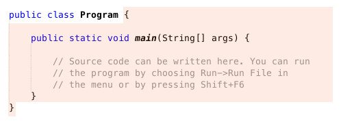
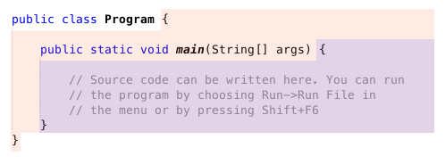
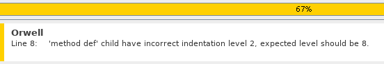
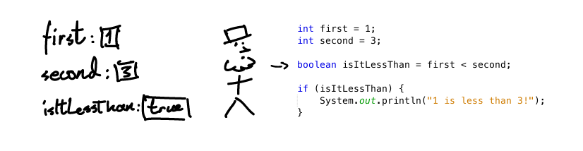

<text-box variant='learningObjectives' name='Learning objectives'>

<!-- - Tunnet käsitteen ehtolause ja osaat luoda ohjelmaan vaihtoehtoista toimintaa ehtolauseen avulla. -->
<!-- - Tunnet ehtolauseissa tyypillisesti käytettävät vertailuoperaattorit ja loogiset operaatiot. -->
<!-- - Osaat vertailla sekä lukuja että merkkijonoja, muistaen merkkijonoihin liittyvän equals-komennon. -->
<!-- - Tunnet ehtolauseen suoritusjärjestyksen ja tiedät, että ehtolauseiden läpikäynti lopetetaan ensimmäiseen ehtoon, jonka lauseke evaluoituu todeksi. -->

- get familiar with the idea of a conditional statement and know how to create a program containing optional operations through the use of conditional statements.

- get familiar with comparison and logical operators commonly used in conditional statements.

- know how to compare numbers as well as strings while remembering the equals-command for strings.

- get familiar with the order of execution for a conditional statement, and know that the parsing of a conditional statement stops at the first condition whose statement evaluates to true.

</text-box>


<!-- Ohjelmamme ovat tähän mennessä olleet lineaarisia eli ohjelmien suoritus on tapahtunut ylhäältä alaspäin ilman suuria yllätyksiä tai vaihtoehtoja. Ohjelmiin halutaan kuitenkin usein vaihtoehtoista toiminnallisuutta, eli toiminnallisuutta joka riippuu tavalla tai toisella ohjelmassa olevien muuttujien tilasta. -->

Until now, our programs have been linear, i.e., the execution of the program occurred from top to bottom without any significant surprises or options. However, we usually want alternative functionality in our programs. In other words, functionality that is in one way or another dependent on the state of the program's variables.

<!-- Jotta ohjelman suoritus voisi _haarautua_ esimerkiksi käyttäjän antaman syötteen perusteella, tarvitsemme käyttöömme **ehtolauseen**. Yksinkertaisin ehtolause on seuraavanlainen. -->

To branch the execution of a program based on e.g., user input, we need to use something known as a **conditional statement**. The simplest conditional statement looks something like this.

<!-- ```java
System.out.println("Hei maailma!");
if (true) {
    System.out.println("Et voi välttää tätä koodia!");
}
``` -->

```java
System.out.println("Hello, world!");
if (true) {
    System.out.println("This code is unavoidable!");
}
```

<sample-output>

Hello, world!
This code is unavoidable!

</sample-output>

<!-- Ehtolause alkaa avainsanalla `if`, jota seuraa sulut. Sulkujen sisälle asetetaan lauseke, joka evaluoidaan kun ehtolause saavutetaan. Evaluoinnin tulos on totuusarvo, yllä evaluointia ei tehty, vaan ehtolauseessa käytettiin suoraan totuusarvoa. -->

A conditional statement begins with the keyword `if` followed by parentheses. An expression is placed inside the parentheses, which is evaluated when the conditional statement is reached. The result of the evaluation is a boolean value. No evaluation occurred above. Instead, a boolean value was explicitly used in the conditional statement.

<!-- TODO: Lohkon sisällä oleva lähdekoodi !!! suoritetaan !!! mikäli sulkujen sisälle asetettu lauseke evaluoidaan todeksi (true). -->

<!-- Sulkuja seuraa lohko, joka määritellään avaavan aaltosulun `{` ja sulkevan aaltosulun `}` sisään. Lohkon sisällä oleva lähdekoodi mikäli sulkujen sisälle asetettu lauseke evaluoidaan todeksi (true). -->

The parentheses are followed by a block, which is defined inside opening- `{` and closing `}` curly brackets. The source code inside the block is executed if the expression inside the parentheses evaluates to *true*.

<!-- Tarkastellaan esimerkkiä, missä ehtolauseen lausekkeessa vertaillaan lukuja. -->

Let's look at an example where we compare numbers in the conditional statement.

<!-- ```java
int luku = 11;
if (luku > 10) {
    System.out.println("Luku oli suurempi kuin 10");
}
``` -->

```java
int number = 11;
if (number > 10) {
    System.out.println("The number was greater than 10");
}
```

<!-- Jos ehtolauseen lauseke evaluoidaan todeksi, yllä "jos muuttujassa luku oleva arvo on suurempi kuin 10", ohjelman suoritus siirtyy ehtolauseen määrittelemään lohkoon. Jos taas lauseke on epätotta, ohjelman suoritus siirtyy ehtolauseeseen liittyvän lohkon päättävän aaltosulun jälkeiseen lauseeseen. -->

If the expression in the conditional statement evaluates to true, in the case above "if the number contained in the variable is greater than 10", then the execution of the program progresses to the block defined by the conditional statement. On the other hand, if the expression evaluates to false, then the execution progresses to the statement after the closing curly bracket of the current conditional statement.

<!-- Huomaa, että `if` -lauseen perään ei tule puolipistettä, sillä lause ei lopu ehto-osan jälkeen. -->

 NB! An `if` -statement is not followed by a semicolon, since the statement doesn't end after the conditional part.

<!-- <programming-exercise name="Ylinopeussakko" tmcname='osa01-Osa01_24.Ylinopeussakko'> -->

<programming-exercise name="Speeding ticket" tmcname='part01-Part01_24.SpeedingTicket'>

<!-- Tee ohjelma, joka kysyy käyttäjältä kokonaisluvun ja tulostaa merkkijonon "Ylinopeussakko!" jos luku on suurempi kuin 120. -->

Write a program that asks the user for an integer and prints the string "Speeding ticket!" if the number is greater than 120.

<sample-output>

Give speed:
**15**

</sample-output>

<sample-output>

Give speed:
**135**
Speeding ticket!

</sample-output>

</programming-exercise>


<!-- ## Ohjelmakoodin sisennyksestä ja lohkoista -->
## Code Indentation and Block Statements

<!-- Lohkolla tarkoitetaan aaltosulkujen rajaamaa aluetta. Ohjelman sisältävä lähdekooditiedosto sisältää merkkijonon `public class`, jota seuraa ohjelman nimi ja lohkon avaava aaltosulku. Lohko päättyy sulkevaan aaltosulkuun. Alla olevassa kuvassa on näytettynä värjättynä ohjelman lohko. -->

A code block refers to a section enclosed by a pair of curly brackets. The source file containing the program includes the string `public class`, which is followed by the name of the program and the opening curly bracket of the block. The block ends in a closing curly bracket. In the picture below, the program block is highlighted.



<!-- Ohjelmissa toistuva rimpsu `public static void main(String[] args)` aloittaa oman lohkon, jonka sisällä oleva lähdekoodi suoritetaan kun ohjelma käynnistetään -- rimpsu on oikeastaan jokaisen ohjelman aloituskohta. Yllä olevassa esimerkissä on todellisuudessa kaksi lohkoa, kuten alla olevasta kuvasta huomaamme. -->

The recurring snippet `public static void main(String[] args)` in the programs begins a block, and the source code within it is executed when the program is run -- this snippet is, in fact, the starting point of all programs. We actually have two blocks in the example above, as can be seen from the image below.



<!-- Lohkot määrittelevät ohjelman rakennetta ja rajaavat ohjelmaa. Aaltosuluille tulee aina löytyä pari: koodi, josta josta puuttuu lohkon päättävä (tai aloittava) aaltosulku, on virheellinen. -->

Blocks define a program's structure and its bounds. A curly bracket must always have a matching pair: any code that's missing a closing (or opening) curly bracket is erroneous.

<!-- Myös ehtolause aloittaa lohkon. -->

A conditional statement also starts a new block.

<!-- Lohkoihin liittyy ohjelman rakenteen ja toiminnan määrittelyn lisäksi luettavuuteen liittyvä seikka. Lohkojen sisällä oleva koodi sisennetään. Esimerkiksi ehtolauseeseen liittyvän lohkon sisältämä lähdekoodi sisennetään neljä välilyöntiä sisemmälle kuin ehtolauseen aloittava `if`-komento. Neljä merkkiä saa myös tabulaattorimerkillä (q:n vasemmalla puolella oleva näppäin). Kun lohko sulkeutuu, eli tulee `}`-merkki, sisennys loppuu. `}`-merkki on samalla tasolla kuin ehtolauseen aloittanut `if`-komento. -->

In addition to the defining program structure and functionality, block statements also affect the readability of a program. Code living inside a block is indented. For example, source code inside the block of a conditional statement is indented four spaces deeper than the `if`-command that started the conditional statement. Four spaces can also be achieved by using a tab character (the key to the left of 'q'). When the block ends, i.e., we encounter a `}`-character, the indentation also ends. The `}`-character is at the same level of indentation as the `if`-command that started the conditional statement.

<!-- Alla oleva esimerkki on sisennetty väärin. -->

The example below is incorrectly indented.

<!-- ```java
if (luku > 10) {
luku = 9;
}
``` -->
```java
if (number > 10) {
number = 9;
}
```

<!-- Alla oleva esimerkki on sisennetty oikein. -->

The example below is correctly indented.

<!-- ```java
if (luku > 10) {
    luku = 9;
}
``` -->
```java
if (number > 10) {
    number = 9;
}
```

<!-- <text-box variant="hint" name="Automaattinen ohjelmakoodin sisentäminen"> -->
<text-box variant="hint" name="Automatic code indentation">

<!-- Javassa koodia sisennetään neljän välilyönnin tai yhden tabulaattorin verran jokaisen lohkon kohdalla. Käytä sisentämiseen joko välilyöntejä tai tabulaattoreita. Joissakin tapauksissa sisennys saattaa hajota mikäli käytät molempia. NetBeans auttaa tässä kun painat kirjainyhdistelmää "alt + shift + f" (macOS "control + shift + f"). -->

In Java, code is indented by four spaces or a single tab in each block. Use either spaces or tabs for indentation, not both. The indentation might break in some cases if you use both at the same time. NetBeans assists you in this if you use the key combination "alt + shift + f" (macOS "control + shift + f").

<!-- Jatkossa ohjelmakoodi tulee sisentää oikein myös tehtävissä. Jos sisennys on väärin, ei ohjelmointiympäristö hyväksy tehtävää. -->

Going forward, program code needs to be indented correctly in exercises too. If the indentation is incorrect, the development environment will not accept the solution. You will see indentation errors highlighted yellow in the test results.



The above error message says, that there should have been 8 spaces at the beginning of line 8, but there was only 2.
In this case we can fix the indentation by adding 6 more spaces to the beginning of line 8.


</text-box>

<!-- <programming-exercise name="Sisennys kuntoon" tmcname='osa01-Osa01_25.SisennysKuntoon'> -->
<programming-exercise name="Check your indentation" tmcname='part01-Part01_25.CheckYourIndentation'>

<!-- Tehtäväpohjassa on ehtolauseen käyttöä demonstroiva ohjelma. Ohjelma on kuitenkin sisennetty väärin. -->
The exercise template contains a program demonstrating the use of conditional statements. However, it's indented wrong.

<!-- Kokeile ajaa testit ennen kuin teet mitään. TMC näyttää sisennysvirheet eri lailla kuin ohjelmalogiikassa olevat virheet. -->
Try to run the tests before doing anything. TMC shows the indentation errors differently compared to errors in program logic.

<!-- Kun huomaat, miten sisennysvirheet merkitään, korjaa virheet. Opettele käyttämään automaattista ohjelmakoodin sisentämistä jo nyt. -->
When you notice how indentation errors are shown, correct them. Now would be a good time to give the automatic code formatting a try.

</programming-exercise>


<!-- ## Vertailuoperaattorit -->
## Comparison Operators

<!-- Vertailuoperaattoreita ovat seuraavat: -->


* `>` greater than
* `>=` greater than or equal to
* `<` less than
* `<=` less than or equal to
* `==` equal to
* `!=` not equal to

<!-- ```java
int luku = 55;

if (luku != 0) {
    System.out.println("Luku oli erisuuri kuin 0");
}

if (luku >= 1000) {
    System.out.println("Luku oli vähintään 1000");
}
``` -->

```java
int number = 55;

if (number != 0) {
    System.out.println("The number is not equal to 0");
}

if (number >= 1000) {
    System.out.println("The number is at least 1000");
}
```


<sample-output>

The number was not equal to 0

</sample-output>

<programming-exercise name="Orwell" tmcname='part01-Part01_26.Orwell'>

<!-- Tee ohjelma, joka kysyy käyttäjältä kokonaisluvun ja tulostaa merkkijonon "Orwell" jos luku on täsmälleen 1984. -->
Write a program that prompts the user for an integer and prints the string "Orwell" if the number is exactly 1984.

<sample-output>

Give a number:
**1983**

</sample-output>

<sample-output>

Give a number:
**1984**
Orwell

</sample-output>

</programming-exercise>


<!-- <programming-exercise name="Wanha" tmcname='osa01-Osa01_27.Wanha'> -->
<programming-exercise name="Ancient" tmcname='part01-Part01_27.Ancient'>

<!-- Tee ohjelma, joka kysyy käyttäjältä vuosilukua. Jos käyttäjä syöttää luvun, joka on pienempi kuin 2015, ohjelma tulostaa merkkijonon "Wanha!". -->
Write a program that prompts the user for a year. If the user inputs a number that is smaller than 2015, then the program prints the string "Ancient history!".

<sample-output>

Give a year:
**2017**

</sample-output>

<sample-output>

Give a year:
**2013**
Ancient history!

</sample-output>

</programming-exercise>


<!-- ## Muulloin eli else -->
## Else

<!-- Jos ehtolauseen sulkujen sisällä oleva lauseke evaluoituu epätodeksi, ohjelmakoodin suoritus siirtyy ehtolauseen lohkon lopettavan aaltosulun seuraavaan lauseeseen. Tämä ei aina ole toivottua, vaan usein halutaan luoda vaihtoehtoinen toiminta tilanteeseen, missä ehtolauseen lauseke on epätotta. -->

If the expression inside the parentheses of the conditional statement evaluates to false, then the execution of the code moves to the statement following the closing curly bracket of the current conditional statement. This is not always desired, and usually we want to create an alternative option for when the conditionals's expression is false.

<!-- Tämä onnistuu `if`-komennon yhteydessä käytettävän `else`-komennon avulla. -->

This can be done with the help of the `else`-command, which is used along with the `if`-command.

<!-- ```java
int luku = 4;

if (luku > 5) {
    System.out.println("Lukusi on suurempi kuin viisi!");
} else {
    System.out.println("Lukusi on viisi tai alle!");
}
``` -->

```java
int number = 4;

if (number > 5) {
    System.out.println("Your number is greater than five!");
} else {
    System.out.println("Your number is five or less!");
}
```

<sample-output>

Your number is five or less!

</sample-output>

<!-- Jos ehtolauseeseen on määritelty `else`-haara, suoritetaan else-haaran määrittelemä lohko jos ehtolauseen ehto ei ole totta. Komento `else` tulee samalle riville `if`-komennon määrittelemän lohkon lopettavan aaltosulun kanssa. -->

If an `else`-branch has been defined for the conditional statement, then the block defined by the else-branch is run if the condition of the conditional statement is not true. The `else`-command is placed on the same line as the closing bracket of the block defined by the `if`-command.

<!-- <programming-exercise name="Positiivinen luku" tmcname='osa01-Osa01_28.PositiivinenLuku'> -->
<programming-exercise name="Positivity" tmcname='part01-Part01_28.Positivity'>

<!-- Tee ohjelma, joka kysyy käyttäjältä kokonaisluvun ja kertoo, onko se positiivinen (eli suurempi kuin nolla) vai ei. -->
Write a program that prompts the user for an integer and informs the user whether or not it is positive (greater than zero).

<sample-output>

Give a number:
**5**
The number is positive.

</sample-output>

<sample-output>

Give a number:
**-2**
The number is not positive.

</sample-output>

</programming-exercise>


<!-- <programming-exercise name="Täysi-ikäisyys" tmcname='osa01-Osa01_29.TaysiIkaisyys'> -->
<programming-exercise name="Adulthood" tmcname='part01-Part01_29.Adulthood'>

<!-- Tee ohjelma, joka kysyy käyttäjän ikää ja kertoo, onko tämä täysi-ikäinen (eli 18-vuotias tai vanhempi). -->
Write a program that prompts the user for their age and tells them whether or not they are an adult (18 years old or older).

<sample-output>

How old are you?
**12**
You are not an adult

</sample-output>

<sample-output>

How old are you?
**32**
You are an adult

</sample-output>

</programming-exercise>


<!-- ## Lisää vaihtoehtoja: else if -->
## More Alternatives: else if

<!-- Jos vaihtoehtoja on useampia käytetään `else if`-komentoa. Komento `else if` on kuin `else`, mutta lisäehdolla. `else if` tulee `if`-ehdon jälkeen, ja niitä voi olla useita. -->

If there are multiple alternatives, we use the `else if`-command. The command `else if` is like `else`, but with an additional condition. `else if` follows the `if`-condition, and there can be many of them.
<!--
```java
int luku = 3;

if (luku == 1) {
    System.out.println("Luku on yksi");
} else if (luku == 2) {
    System.out.println("Lukuna on kaksi");
} else if (luku == 3) {
    System.out.println("Kolme lienee lukuna!");
} else {
    System.out.println("Jotain muuta!");
}
``` -->

```java
int number = 3;

if (number == 1) {
    System.out.println("The number is one");
} else if (number == 2) {
    System.out.println("The given number is two");
} else if (number == 3) {
    System.out.println("The number must be three!");
} else {
    System.out.println("Something else!");
}
```

<sample-output>

The number must be three!

</sample-output>

<!-- Luetaan yllä oleva esimerkki: 'Jos luku on yksi, tulosta "Luku on yksi", muuten jos luku on kaksi, tulosta "Lukuna on kaksi", muuten jos lukuna on kolme, tulosta "Kolme lienee lukuna!". Muulloin, tulosta "Jotain muuta!"'. -->

Let's read out the example above: 'If the number is one, then print "The number is one", else if the number is two, then print "The given number is two", else if the number is three, then print "The number must be three!". Otherwise, print "Something else!"'

<!-- Yllä olevan ohjelman askeleittainen visualisointi: -->
The visualization of the code above:

<code-states-visualizer input='{"code":"public class Esimerkki {\n  public static void main(String[] args) {\n    int luku = 3;\n    \n    if (luku == 1) {\n      System.out.println(\"Luku on yksi\");\n    } else if (luku == 2) {\n      System.out.println(\"Lukuna on kaksi\");\n    } else if (luku == 3) {\n      System.out.println(\"Kolme lienee lukuna!\");\n    } else {\n      System.out.println(\"Jotain muuta!\");\n    }\n  }\n}","stdin":"","trace":[{"stdout":"","event":"call","line":3,"stack_to_render":[{"func_name":"main:3","encoded_locals":{},"ordered_varnames":[],"parent_frame_id_list":[],"is_highlighted":true,"is_zombie":false,"is_parent":false,"unique_hash":"1","frame_id":1}],"globals":{},"ordered_globals":[],"func_name":"main","heap":{}},{"stdout":"","event":"step_line","line":3,"stack_to_render":[{"func_name":"main:3","encoded_locals":{},"ordered_varnames":[],"parent_frame_id_list":[],"is_highlighted":true,"is_zombie":false,"is_parent":false,"unique_hash":"2","frame_id":2}],"globals":{},"ordered_globals":[],"func_name":"main","heap":{}},{"stdout":"","event":"step_line","line":5,"stack_to_render":[{"func_name":"main:5","encoded_locals":{"luku":3},"ordered_varnames":["luku"],"parent_frame_id_list":[],"is_highlighted":true,"is_zombie":false,"is_parent":false,"unique_hash":"4","frame_id":4}],"globals":{},"ordered_globals":[],"func_name":"main","heap":{}},{"stdout":"","event":"step_line","line":7,"stack_to_render":[{"func_name":"main:7","encoded_locals":{"luku":3},"ordered_varnames":["luku"],"parent_frame_id_list":[],"is_highlighted":true,"is_zombie":false,"is_parent":false,"unique_hash":"8","frame_id":8}],"globals":{},"ordered_globals":[],"func_name":"main","heap":{}},{"stdout":"","event":"step_line","line":9,"stack_to_render":[{"func_name":"main:9","encoded_locals":{"luku":3},"ordered_varnames":["luku"],"parent_frame_id_list":[],"is_highlighted":true,"is_zombie":false,"is_parent":false,"unique_hash":"12","frame_id":12}],"globals":{},"ordered_globals":[],"func_name":"main","heap":{}},{"stdout":"","event":"step_line","line":10,"stack_to_render":[{"func_name":"main:10","encoded_locals":{"luku":3},"ordered_varnames":["luku"],"parent_frame_id_list":[],"is_highlighted":true,"is_zombie":false,"is_parent":false,"unique_hash":"16","frame_id":16}],"globals":{},"ordered_globals":[],"func_name":"main","heap":{}},{"stdout":"Kolme lienee lukuna!\n","event":"step_line","line":14,"stack_to_render":[{"func_name":"main:14","encoded_locals":{"luku":3},"ordered_varnames":["luku"],"parent_frame_id_list":[],"is_highlighted":true,"is_zombie":false,"is_parent":false,"unique_hash":"20","frame_id":20}],"globals":{},"ordered_globals":[],"func_name":"main","heap":{}},{"stdout":"Kolme lienee lukuna!\n","event":"return","line":14,"stack_to_render":[{"func_name":"main:14","encoded_locals":{"luku":3,"__return__":["VOID"]},"ordered_varnames":["luku","__return__"],"parent_frame_id_list":[],"is_highlighted":true,"is_zombie":false,"is_parent":false,"unique_hash":"21","frame_id":21}],"globals":{},"ordered_globals":[],"func_name":"main","heap":{}}],"userlog":"Debugger VM maxMemory: 455M\n"}'></code-states-visualizer>


<!-- <programming-exercise name="Suurempi tai yhtäsuuri" tmcname='osa01-Osa01_30.SuurempiTaiYhtasuuri'> -->
<programming-exercise name="Larger than or equal to" tmcname='part01-Part01_30.LargerThanOrEqualTo'>

<!-- Tee ohjelma, joka kysyy käyttäjältä kaksi kokonaislukua ja tulostaa niistä suuremman. Jos luvut ovat yhtä suuret, ohjelma huomaa myös tämän. -->

Write a program that prompts the user for two integers and prints the larger of the two. If the numbers are the same, then the program informs us about this as well.

<!-- Esimerkkitulostuksia: -->
Sample outputs:

<sample-output>

Give the first number:
**5**
Give the second number:
**3**
Larger number is: 5

</sample-output>

<sample-output>

Give the first number:
**5**
Give the second number:
**8**
Larger number is: 8

</sample-output>

<sample-output>

Give the first number; **5**
Give the second number: **5**
The numbers are equal!

</sample-output>

</programming-exercise>


<!-- ## Vertailujen suoritusjärjestys -->
## Order of Execution for Comparisons

<!-- Vertailut suoritetaan järjestyksessä ylhäältä alaspäin. Kun suorituksessa päästään ehtolauseeseen, jonka ehto on totta, suoritetaan lohko ja lopetetaan vertailu. -->

The comparisons are executed top down. When execution reaches a conditional statement whose condition is true, its block is executed and the comparison stops.

<!-- ```java
int luku = 5;

if (luku == 0) {
    System.out.println("Luku on nolla.");
} else if (luku > 0) {
    System.out.println("Luku on suurempi kuin nolla.");
} else if (luku > 2) {
    System.out.println("Luku on suurempi kuin kaksi.");
} else {
    System.out.println("Luku on pienempi kuin nolla.");
}
``` -->

```java
int number = 5;

if (number == 0) {
    System.out.println("The number is zero.");
} else if (number > 0) {
    System.out.println("The number is greater than zero.");
} else if (number > 2) {
    System.out.println("The number is greater than two.");
} else {
    System.out.println("The number is less than zero.");
}
```

<sample-output>

The number is greater than zero.

</sample-output>

<!-- Yllä oleva esimerkki tulostaa merkkijonon "Luku on suurempi kuin nolla." vaikka myös ehto `luku > 2` on totta. Vertailu lopetetaan ensimmäiseen valintakäskyyn, jonka ehto on totta. -->

The example above prints the string "The number is greater than zero." even if the condition `number > 2` is true. The comparing stops at the first condition that evaluates to true.

<!-- <programming-exercise name="Arvosanat ja pisteet" tmcname='osa01-Osa01_31.ArvosanatJaPisteet'> -->
<programming-exercise name="Grades and points" tmcname='part01-Part01_31.GradesAndPoints'>

<!-- Alla oleva taulukko kuvaa erään kurssin arvosanan muodostumista. Tee ohjelma, joka ilmoittaa kurssiarvosanan annetun taulukon mukaisesti. -->

The table below describes how the grade for a particular course is determined. Write a program that gives a course grade according to the provided table.

<!-- | pistemäärä   | arvosana     | -->
<!-- | ------------ | --------     | -->
<!-- | < 0          | mahdotonta!  | -->
<!-- | 0-49         | hylätty      | -->
<!-- | 50-59        | 1            | -->
<!-- | 60-69        | 2            | -->
<!-- | 70-79        | 3            | -->
<!-- | 80-89        | 4            | -->
<!-- | 90-100       | 5            | -->
<!-- | > 100        | uskomatonta! | -->

| points | grade       |
| ------ | ----------- |
| < 0    | impossible! |
| 0-49   | failed      |
| 50-59  | 1           |
| 60-69  | 2           |
| 70-79  | 3           |
| 80-89  | 4           |
| 90-100 | 5           |
| > 100  | incredible! |

<!-- Esimerkkitulostuksia: -->
Sample outputs:

<sample-output>

Give points [0-100]:
**37**
Grade: failed

</sample-output>

<sample-output>

Give points [0-100]:
**76**
Grade: 3

</sample-output>

<sample-output>

Give points [0-100]:
**95**
Grade: 5

</sample-output>

<sample-output>

Give points [0-100]:
**-3**
Grade: impossible!

</sample-output>

</programming-exercise>


<!-- ## Ehtolauseen lauseke ja totuusarvomuuttuja -->
## Conditional Statement Expression and the Boolean Variable

<!-- Ehtolauseen sulkuihin asetettavan arvon tulee olla lausekkeen evaluoinnin jälkeen totuusarvotyyppinen. Totuusarvomuuttujan tyyppi on `boolean` ja arvo _true_ tai _false_. -->

The value that goes between the parentheses of the conditional statement should be of type boolean after the evaluation. `boolean` type variables are either _true_ or _false_.

<!-- ```java
boolean onkoTotta = true;
System.out.println("Totuusarvomuuttujan arvo on " + onkoTotta);
``` -->

```java
boolean isItTrue = true;
System.out.println("The value of the boolean variable is " + isItTrue);
```

<sample-output>

The value of the boolean variable is true

</sample-output>

The conditional statement can also be done as follows:

<!-- ```java
boolean onkoTotta = true;
if (onkoTotta) {
    System.out.println("Aika vinhaa!");
}
``` -->
```java
boolean isItTrue = true;
if (isItTrue) {
    System.out.println("Pretty wild!");
}
```

<sample-output>

Pretty wild!

</sample-output>

<!-- Vertailuoperaattoreita voi käyttää myös ehtojen ulkopuolella. Tällöin vertailun tuloksena saatu totuusarvo asetetaan talteen totuusarvomuuttujaan myöhempää käyttöä varten. -->
Comparison operators can also be used outside of conditionals. In those cases, the boolean value resulting from the comparison is stored in a boolean variable for later use.

<!-- ```java
int eka = 1;
int toka = 3;
boolean onkoSuurempi = eka > toka;
``` -->

```java
int first = 1;
int second = 3;
boolean isGreater = first > second;
```

<!-- Yllä olevassa esimerkissä totuusarvomuuttuja `onkoSuurempi` sisältää nyt totuusarvon _false_. Yllä olevaa esimerkkiä voi myös jatkaa ja ottaa siihen mukaan ehtolauseen. -->

In the example above, the boolean variable `isGreater` now contains the boolean value _false_. We can extend the previous example by adding a conditional statement to it.

<!-- ```java
int eka = 1;
int toka = 3;
boolean onkoPienempi = eka < toka;

if (onkoPienempi) {
    System.out.println("1 on pienempi kuin 3!");
}
``` -->

```java
int first = 1;
int second = 3;
boolean isLessThan = first < second;

if (isLessThan) {
    System.out.println("1 is less than 3!");
}
```



<!-- Yllä olevassa kuvassa ohjelmakoodia on suoritettu niin pitkään, että ohjelman muuttujat on luotu ja niihin on asetettu arvot. Muuttujassa `onkoPienempi` on arvona `true`. Seuraavana suoritetaan vertailu `if (onkoPienempi)` -- muuttujaan `onkoPienempi` liittyvä arvo löytyy sen lokerosta, ja lopulta ohjelma tulostaa: -->

The code in the image above has been executed to the point where the program's variables have been created and assigned values. The variable `isLessThan` has `true` as its value. Next in the execution is the comparison `if (isLessThan)` -- the value for the variable `isLessThan` is found in its container, and the program finally prints:

<sample-output>

1 is less than 3!

</sample-output>


<!-- <text-box variant='hint' name='Jakojäännös'> -->
<text-box variant='hint' name='Remainder'>

<!-- Jakojäännös on hieman harvemmin käytetty operaatio, joka on kuitenkin varsin näppärä kun halutaan tarkistaa esimerkiksi luvun jaollisuutta. Jakojäännösoperaation merkki on `%`. -->

The modulo operator is a slightly less-used operator, which is, however, very handy when we want to check the divisibility of a number, for example. The symbol for the modulo operator is `%`.

<!-- ```java
int jakojaannos = 7 % 2;
System.out.println(jakojaannos); // tulostaa 1
System.out.println(5 % 3); // tulostaa 2
System.out.println(7 % 4); // tulostaa 3
System.out.println(8 % 4); // tulostaa 0
System.out.println(1 % 2); // tulostaa 1
``` -->

```java
int remainder = 7 % 2;
System.out.println(remainder); // prints 1
System.out.println(5 % 3); // prints 2
System.out.println(7 % 4); // prints 3
System.out.println(8 % 4); // prints 0
System.out.println(1 % 2); // prints 1
```

<!-- Jos haluamme tietää onko käyttäjän syöttämä luku jaollinen neljälläsadalla, tarkastamme onko syötetyn luvun jakojäännös neljänsadan suhteen nolla. -->

If we want to know whether the number given by the user is divisible by four hundred, we check if the remainder is zero after taking the modulo of the number and four hundred.

<!-- ```java
Scanner lukija = new Scanner(System.in);

int luku = Integer.valueOf(lukija.nextLine());
int jakojaannos = luku % 400;

if (jakojaannos == 0) {
    System.out.println("Luku " + luku + " on jaollinen neljälläsadalla.");
} else {
    System.out.println("Luku " + luku + " ei ole jaollinen neljälläsadalla.");
}
``` -->

```java
Scanner reader = new Scanner(System.in);

int number = Integer.valueOf(reader.nextLine());
int remainder = number % 400;

if (remainder == 0) {
    System.out.println("The number " + number + " is divisible by four hundred.");
} else {
    System.out.println("The number " + number + " is not divisible by four hundred.");
}
```

<!-- Koska jakojäännös on samanlainen operaatio kuin muutkin laskut, voi sen asettaa osaksi valintakäskyä. -->

Since the modulo is an operation just like other calculations, it can be a part of an expression in a conditional statement.

<!-- ```java
Scanner lukija = new Scanner(System.in);

int luku = Integer.valueOf(lukija.nextLine());

if (luku % 400 == 0) {
    System.out.println("Luku " + luku + " on jaollinen neljälläsadalla.");
} else {
    System.out.println("Luku " + luku + " ei ole jaollinen neljälläsadalla.");
}
``` -->

```java
Scanner reader = new Scanner(System.in);

int number = Integer.valueOf(reader.nextLine());

if (number % 400 == 0) {
    System.out.println("The number " + number + " is divisible by four hundred.");
} else {
    System.out.println("The number " + number + " is not divisible by four hundred.");
}
```

</text-box>


<!-- <programming-exercise name="Pariton vai parillinen" tmcname='osa01-Osa01_32.ParitonVaiParillinen'> -->
<programming-exercise name="Odd or even" tmcname='part01-Part01_32.OddOrEven'>

<!-- Tee ohjelma, joka kysyy käyttäjältä luvun ja ilmoittaa, onko syötetty luku parillinen vai pariton. -->
Write a program that prompts the user for a number and informs us whether it is even or odd.

<sample-output>

Give a number:
**2**
Number 2 is even.

</sample-output>

<sample-output>

Give a number:
**7**
Number 7 is odd.

</sample-output>

<!-- Vihje: Luvun jakojäännös 2:lla kertoo, onko luku parillinen vai pariton. Jakojäännös taas saadaan `%`-operaattorilla, tehtäväpohjassa on lisää ohjeita miten parittomuustarkastus hoituu jakojäännöksen avulla. -->

Hint: The remainder when dividing by 2 tells us whether the number is even or not. We get the remainder using the `%`-operator. The exercise template contains additional instructions on how to do the checking using the remainder.

</programming-exercise>

<!-- ## Ehtolauseet ja merkkijonojen vertailu -->
## Conditional Statements and Comparing Strings

<!-- Siinä missä kokonaislukujen, liukulukujen, ja totuusarvojen samuutta voi verrata kahdella yhtäsuuruusmerkillä (`muuttuja1 == muuttuja2`), ei merkkijonojen samuuden vertailu kahdella yhtäsuuruusmerkillä onnistu. -->

Even though we can compare integers, floating point numbers, and boolean values using two equals signs (`variable1 == variable2`), we cannot compare the equality of strings using two equals signs.

<!-- Voit kokeilla tätä seuraavalla ohjelmalla: -->
You can try this with the following program:

<!-- ```java
Scanner lukija = new Scanner(System.in);

System.out.println("Syötä ensimmäinen merkkijono");
String eka = lukija.nextLine();
System.out.println("Syötä toinen merkkijono");
String toka = lukija.nextLine();

if (eka == toka) {
    System.out.println("Merkkijonot olivat samat!");
} else {
    System.out.println("Merkkijonot olivat eri!");
}
``` -->

```java
Scanner reader = new Scanner(System.in);

System.out.println("Enter the first string");
String first = reader.nextLine();
System.out.println("Enter the second string");
String second = reader.nextLine();

if (first == second) {
    System.out.println("The strings were the same!");
} else {
    System.out.println("The strings were different!");
}
```

<sample-output>

Enter the first string
**same**
Enter the second string
**same**
The strings were different!

</sample-output>

<sample-output>

Enter the first string
**same**
Enter the second string
**different**
The strings were different!

</sample-output>

<!-- Tämä liittyy merkkijonojen sisäiseen toimintaan sekä siihen, miten muuttujien vertailu on Javassa toteutettu. Käytännössä vertailun toimintaan vaikuttaa se, kuinka paljon tietoa muuttuja voi sisältää -- merkkijonot voivat sisältää äärettömän määrän merkkejä, kun taas kokonaisluvut, liukuluvut ja totuusarvot sisältävät aina yhden luvun tai arvon. Muuttujia, jotka sisältävät aina vain yhden luvun tai arvon voi verrata yhtäsuuruusmerkillä, kun taas enemmän tietoa sisältävillä muuttujille tällainen vertailu ei toimi. Palaamme tähän tarkemmin myöhemmin tällä kurssilla. -->

This has to do with the internal workings of strings as well as how variable comparison is implemented in Java. In practice, the comparison is affected by how much information a variable can hold -- strings can hold a limitless amount of characters, whereas integers, floating-point numbers, and boolean values always contain a single number or value only. Variables that always contain only one number or value can be compared using an equals sign, whereas this doesn't work for variables containing more information. We will return to this topic later in this course.

<!-- Merkkijonojen vertailussa käytetään merkkijonomuuttujiin liittyvää `equals`-komentoa. Komento toimii seuraavalla tavalla: -->
When comparing strings we use the `equals`-command, which is related to string variables. The command works in the following way:

<!-- ```java
Scanner lukija = new Scanner(System.in);

System.out.println("Syötä merkkijono");
String syote = lukija.nextLine();

if (syote.equals("merkkijono")) {
    System.out.println("Luit ohjeet oikein, hyvä!");
} else {
    System.out.println("Metsään meni!");
}
``` -->

<!-- TODO: MAYBE A BETTER EXERCISE...? -->

```java
Scanner reader = new Scanner(System.in);

System.out.println("Enter a string");
String input = reader.nextLine();

if (input.equals("string")) {
    System.out.println("Great! You read the instructions correctly.");
} else {
    System.out.println("Missed the mark!");
}
```

<sample-output>

Enter a string
**ok!**
Missed the mark!

</sample-output>

<sample-output>

Enter a string
**a string**
Great! You read the instructions correctly.

</sample-output>

<!-- Komento equals kirjoitetaan merkkijonomuuttujan jälkeen siten, että se kiinnitetään pisteellä vertailtavaan muuttujaan. Komennolle annetaan parametrina merkkijono, johon muuttujaa vertaillaan. Mikäli merkkijonomuuttujaa vertaillaan suoraan merkkijonoon, voi merkkijonon asettaa hipsuilla merkittynä equals-komennon sulkujen sisään. Muulloin sulkujen sisään asetetaan sen merkkijonomuuttujan nimi, johon merkkijonomuuttujan sisältämää merkkijonoa verrataan. -->

<!-- TODO: Find a better way to translate -->
The equals command is written after a string by attaching it to the string to be compared with a dot. The command is given a parameter, which is the string that the variable will be compared against. If the string variable is being directly compared with a string, then the string can be placed inside the parentheses of the equals-command within quotation marks. Otherwise, the name of the string variable that holds the string to be compared is placed inside the parentheses.

<!-- Alla olevassa esimerkissä luetaan käyttäjältä kaksi merkkijonoa. Ensin tarkastetaan ovatko syötetyt merkkijonot samat, jonka jälkeen tarkastetaan onko syötettyjen merkkijonojen arvo "kaksi merkkijonoa". -->

In the example below the user is prompted for two strings. We first check to see if the provided strings are the same, after which we'll check if the value of either one of the two strings is "two strings".

<!-- ```java
Scanner lukija = new Scanner(System.in);

System.out.println("Syötä kaksi merkkijonoa");
String eka = lukija.nextLine();
String toka = lukija.nextLine();

if (eka.equals(toka)) {
    System.out.println("Merkkijonot olivat samat!");
} else {
    System.out.println("Merkkijonot olivat eri!");
}

if (eka.equals("kaksi merkkijonoa")) {
    System.out.println("Nokkelaa!");
}

if (toka.equals("kaksi merkkijonoa")) {
    System.out.println("Ovelaa!");
}
``` -->

```java
Scanner reader = new Scanner(System.in);

System.out.println("Input two strings");
String first = lukija.nextLine();
String second = lukija.nextLine();

if (first.equals(second)) {
    System.out.println("The strings were the same!");
} else {
    System.out.println("The strings were different!");
}

if (first.equals("two strings")) {
    System.out.println("Clever!");
}

if (second.equals("two strings")) {
    System.out.println("Sneaky!");
}
```

<sample-output>

Input two strings
**hello**
**world**
The strings were different!

</sample-output>

<sample-output>

Input two strings
**two strings**
**world**
The strings were different!
Clever!

</sample-output>

<sample-output>

Input two strings
**same**
**same**
The strings were the same!

</sample-output>


<!-- <programming-exercise name="Tunnussana" tmcname='osa01-Osa01_33.Tunnussana'> -->
<programming-exercise name="Password" tmcname='part01-Part01_33.Password'>

<!-- Tee ohjelma, joka kysyy käyttäjältä tunnussanaa. Mikäli tunnussana on "Caput Draconis", ohjelma tulostaa "Tervetuloa!". Muulloin ohjelman tulostus on "Hus siitä!". -->

Write a program that prompts the user for a password. If the password is "Caput Draconis" the program prints "Welcome!". Otherwise, the program prints "Off with you!"

<sample-output>

Password?
**Wattlebird**
Off with you!

</sample-output>

<sample-output>

Password?
**Caput Draconis**
Welcome!

</sample-output>

</programming-exercise>


<!-- <programming-exercise name="Samat sanat" tmcname='osa01-Osa01_34.SamatSanat'> -->
<programming-exercise name="Same" tmcname='part01-Part01_34.Same'>

<!-- Tee ohjelma, joka kysyy käyttäjältä kahta merkkijonoa. Mikäli merkkijonot ovat samat, ohjelma tulostaa "Samat sanat", muulloin ohjelma tulostaa "Ei sitten". -->

Write a program that prompts the user for two strings. If the strings are the same, then the program prints "Same". Otherwise, it prints "Different".

<!-- TODO: Better exercise for English...? -->

<sample-output>

Enter the first string:
**hello**
Enter the second string:
**hello**
Same

</sample-output>

<sample-output>

Enter the first string:
**hello**
Enter the second string:
**world**
Different

</sample-output>

</programming-exercise>


<!-- ## Loogiset operaatiot -->
## Logical Operators

<!-- Ehtolauseen lauseke voi koostua useammasta osasta, joissa käytetään loogisia operaatioita **ja** `&&`, **tai** `||`, sekä **ei** `!`. -->

The expression of a conditional statement may consist of multiple parts, in which the logical operators **and** `&&`, **or** `||`, and **not** `!` are used.

<!-- * Kahdesta lausekkeesta koostuva lauseke, joka yhdistetään ja-operaatiolla, on totta jos ja vain jos yhdistettävistä lausekkeista molemmat evaluoituvat todeksi. -->

* An expression consisting of two expressions combined using the and-operator is true, if and only if both of the combined expressions evaluate to true.

<!-- * Kahdesta lausekkeesta koostuva lauseke, joka yhdistetään tai-operaatiolla, on totta jos jompikumpi tai molemmat yhdistettävistä lausekkeista evaluoituvat todeksi. -->

* An expression consisting of two expressions combined using the or-operator is true if either one, or both, of the combined expressions evaluate to true.

<!-- * Loogista operaatiota ei käytetään totuusarvon muuntamiseen truesta falseksi tai falsesta trueksi. -->

* Logical operators are not used for changing the boolean value from true to false, or false to true.

<!-- Seuraavassa yhdistetään `&&`:lla eli ja-operaatiolla kaksi yksittäistä ehtoa. Koodilla tarkistetaan, onko muuttujassa oleva luku suurempi kuin 4 ja pienempi kuin 11, eli siis välillä 5-10: -->

In the next example we combine two individual conditions using `&&`, i.e., the and-operator. The code is used to check if the number in the variable is greater than 4 and less than 11. In other words, whether it's within the range of 5-10:

<!-- ```java
System.out.println("Onkohan luku väliltä 5-10: ");
int luku = 7;

if (luku >= 4 && luku <= 10) {
    System.out.println("On! :)");
} else {
    System.out.println("Ei ollut :(")
}
``` -->

```java
System.out.println("Is the number within the range 5-10: ");
int number = 7;

if (number >= 4 && number <= 10) {
    System.out.println("It is! :)");
} else {
    System.out.println("It is not :(")
}
```

<sample-output>

Is the number within the range 5-10:
It is! :)

</sample-output>

<!-- Seuraavassa annetaan `||`:n eli tai-operaation avulla kaksi vaihtoehtoa, onko luku pienempi kuin 0 tai suurempi kuin 100. Ehto toteutuu jos luku täyttää jommankumman ehdon: -->

In the next one we provide two conditions using `||`, i.e., the or-operator: is the number less than zero or greater than 100. The condition is fulfilled if the number fulfills either one of the two conditions:

<!-- ```java
System.out.println("Onkohan luku pienempi kuin 0 tai suurempi kuin 100");
int luku = 145;

if (luku < 0 || luku > 100) {
    System.out.println("On! :)");
} else {
    System.out.println("Ei ollut :(")
}
``` -->

```java
System.out.println("Is the number less than 0 or greater than 100");
int number = 145;

if (number < 0 || number > 100) {
    System.out.println("It is! :)");
} else {
    System.out.println("It is not :(")
}
```

<sample-output>

Is the number less than 0 or greater than 100
It is! :)

</sample-output>


<!-- Seuraavassa käännetään `!` ei-operaatiolla lausekkeen `luku > 4` tulos. Ei-operaatio merkitään lauseketta ennen niin, että käännettävä lauseke rajataan suluilla, ja ei-operaatio lisätään sulkuja ennen. -->

In this example we flip the result of the expression `number > 4` using `!`, i.e., the not-operator. The not-operator is notated in such a way that the expression to be flipped is wrapped in parentheses, and the not-operator is placed before the parentheses.

<!-- ```java
int luku = 7;

if (!(luku > 4)) {
    System.out.println("Luku ei ole suurempi kuin 4.");
} else {
    System.out.println("Luku on suurempi tai yhtäsuuri kuin 4.")
}
``` -->

```java
int number = 7;

if (!(number > 4)) {
    System.out.println("The number is not greater than 4.");
} else {
    System.out.println("The number is greater than or equal to 4.")
}
```

<sample-output>

The number is greater than or equal to 4.

</sample-output>

<!-- Alla on kuvattuna lausekkeiden toimintaa kun lausekkeissa on loogisia operaatioita. -->
Below is a table showing the operation of expressions containing logical operators.

| number | number > 0 | number < 10 | number > 0 && number < 10 | !(number > 0 && number < 10) | number > 0 \|\| number < 10 |
| ------ | ---------- | ----------- | ------------------------- | ---------------------------- | --------------------------- |
| -1     | false      | true        | false                     | true                         | true                        |
| 0      | false      | true        | false                     | true                         | true                        |
| 1      | true       | true        | true                      | false                        | true                        |
| 9      | true       | true        | true                      | false                        | true                        |
| 10     | true       | false       | false                     | true                         | true                        |


<!-- <programming-exercise name='Iän tarkistus' tmcname='osa01-Osa01_35.IanTarkistus'> -->

<programming-exercise name='Checking the age' tmcname='part01-Part01_35.CheckingTheAge'>

<!-- Tee ohjelma, joka kysyy käyttäjän iän ja tarkistaa, että se on mahdollinen (ainakin 0 ja korkeintaan 120). Käytä ohjelmassa vain yhtä `if`-komentoa. -->

Write a program that prompts the user to input their age and checks whether or not it is possible (at least 0 and at most 120). Only use a single `if`-command in your program.

<sample-output>

How old are you? **10**
OK

</sample-output>

<sample-output>

How old are you? **55**
OK

</sample-output>

<sample-output>

How old are you? **-3**
Impossible!

</sample-output>

<sample-output>

How old are you? **150**
Impossible!

</sample-output>

</programming-exercise>


<!-- ## Ehtolauseiden suoritusjärjestys -->
## Execution Order of Conditional Statements

<!-- Tutustutaan ehtolauseiden suoritusjärjestykseen klassisen ohjelmointiongelman kautta. -->
Let's familiarize ourselves with the execution order of conditional statements through a classic programming exercise.

<!-- _'Kirjoita ohjelma, joka kysyy käyttäjältä lukua yhden ja sadan väliltä ja tulostaa luvun. Jos luku on kolmella jaollinen, luvun sijaan tulostetaan "Fizz". Jos luku on viidellä jaollinen, luvun sijaan tulostetaan "Buzz". Jos luku on sekä kolmella että viidellä jaollinen, luvun sijaan tulostetaan "FizzBuzz"'._ -->

_'Write a program that prompts the user for a number between one and one hundred, and prints that number. If the number is divisible by three, then print "Fizz" instead of the number. If the number is divisible by five, then print "Buzz" instead of the number. If the number is divisible by both three and five, then print "FizzBuzz" instead of the number.'_

<!-- Ohjelmoija lähtee ratkaisemaan tehtävää lukemalla ongelmakuvauksen, ja luomalla ohjelmakoodia ongelmakuvausta seuraten. Koska ohjelman suoritusehdot esitellään ongelmassa annetussa järjestyksessä, muodostuu ohjelman rakenne järjestyksen perusteella. Ohjelman rakenne muodostuu seuraavien askelten perusteella: -->

The programmer begins solving the exercise by reading the exercise description and by writing code according to the description. The conditions for execution are presented in a given order by the description, and the initial structure for the program is formed based on that order. The structure is formed based on the following steps:

<!-- * Tee ohjelma, joka lukee luvun käyttäjältä ja tulostaa sen. -->

* Write a program that prompts the user for a number and prints that number.

<!-- * Jos luku on jaollinen kolmella, tulosta luvun sijaan merkkijono "Fizz". -->

* If the number is divisible by three, then print "Fizz" instead of the number.

<!-- * Jos luku on jaollinen viidellä, tulosta luvun sijaan merkkijono "Buzz". -->

* If the number is divisible by five, then print "Buzz" instead of the number.

<!-- * Jos luku on jaollinen kolmella ja viidellä, tulosta luvun sijan merkkijono "FizzBuzz". -->

* If the number is divisible by both three and five, then print "FizzBuzz" instead of the number.

<!-- Jos-tyyppiset ehdot on helppo toteuttaa `if - else if - else` -valintakäskyjen avulla. Alla oleva koodi on toteutettu yllä olevien askelten perusteella, mutta se ei kuitenkaan toimi oikein, kuten alla olevista esimerkeistä huomataan. -->

If-type conditions are easy to implement using `if - else if - else` -conditional statements. The code below was written based on the steps above, but it does not work correctly, which we can see from the example.

<!-- ```java
Scanner lukija = new Scanner(System.in);

int luku = Integer.valueOf(lukija.nextLine());

if (luku % 3 == 0) {
    System.out.println("Fizz");
} else if (luku % 5 == 0) {
    System.out.println("Buzz");
} else if (luku % 3 == 0 && luku % 5 == 0) {
    System.out.println("FizzBuzz");
} else {
    System.out.println(luku);
}
``` -->

```java
Scanner reader = new Scanner(System.in);

int number = Integer.valueOf(reader.nextLine());

if (number % 3 == 0) {
    System.out.println("Fizz");
} else if (number % 5 == 0) {
    System.out.println("Buzz");
} else if (number % 3 == 0 && number % 5 == 0) {
    System.out.println("FizzBuzz");
} else {
    System.out.println(number);
}
```

<sample-output>

**3**
Fizz

</sample-output>


<sample-output>

**4**
4

</sample-output>

<sample-output>

**5**
Buzz

</sample-output>

<sample-output>

**15**
Fizz

</sample-output>

<!-- Edellisessä lähestymistavassa ongelmana on se, että **ehtolauseiden läpikäynti lopetetaan ensimmäiseen ehtoon, jonka arvo on totta**. Esimerkiksi luvulla 15 tulostetaan merkkijono "Fizz", sillä luku on kolmella jaollinen (15 % 3 == 0). -->

The problem with the previous approach is that **the parsing of conditional statements stops at the first condition that is true**. E.g., with the value 15 the string "Fizz" is printed, since the number is divisible by three (15 % 3 == 0).

<!-- Yksi lähestymistapa yllä olevan ajatusketjun kehittämiseen on ensin etsiä **vaativin ehto** ja toteuttaa se. Tämän jälkeen toteutettaisiin muut ehdot. Yllä olevassa esimerkissä ehto "jos luku on jaollinen kolmella **ja** viidellä" vaatii kahden tapauksen toteutumista. Nyt ajatusketju olisi muotoa. -->

One approach for developing this train of thought would be to first find the **most demanding condition**,  and implement it. After that, we would implement the other conditions. In the example above, the condition "if the number is divisible by both three **and** five" requires two things to happen. Now the train of thought would be:

<!-- 1. Tee ohjelma, joka lukee luvun käyttäjältä. -->

1. Write a program that reads input from the user.

<!-- 2. Jos luku on jaollinen kolmella ja viidellä, tulosta luvun sijan merkkijono "FizzBuzz". -->

2. If the number is divisible by both three and five, then print "FizzBuzz" instead of the number.

<!-- 3. Jos luku on jaollinen kolmella, tulosta luvun sijaan merkkijono "Fizz". -->

3. If the number is divisible by three, then print "Fizz" instead of the number.

<!-- 4. Jos luku on jaollinen viidellä, tulosta luvun sijaan merkkijono "Buzz". -->

4. If the number is divisible by five, then print "Buzz" instead of the number.

<!-- 5. Muulloin ohjelma tulostaa käyttäjältä luetun luvun. -->

5. Otherwise the program prints the number given by the user.


<!-- Nyt ongelmakin tuntuu ratkeavan. -->
Now the problem seems to get solved.

<!-- ```java
Scanner lukija = new Scanner(System.in);

int luku = Integer.valueOf(lukija.nextLine());

if (luku % 3 == 0 && luku % 5 == 0) {
    System.out.println("FizzBuzz");
} else if (luku % 3 == 0) {
    System.out.println("Fizz");
} else if (luku % 5 == 0) {
    System.out.println("Buzz");
} else {
    System.out.println(luku);
}
``` -->

```java
Scanner reader = new Scanner(System.in);

int number = Integer.valueOf(reader.nextLine());

if (number % 3 == 0 && number % 5 == 0) {
    System.out.println("FizzBuzz");
} else if (number % 3 == 0) {
    System.out.println("Fizz");
} else if (number % 5 == 0) {
    System.out.println("Buzz");
} else {
    System.out.println(number);
}
```

<sample-output>

**2**
2

</sample-output>

<sample-output>

**5**
Buzz

</sample-output>

<sample-output>

**30**
FizzBuzz

</sample-output>


<!-- <programming-exercise name='Karkausvuosi' tmcname='osa01-Osa01_36.Karkausvuosi'> -->

<programming-exercise name='Leap year' tmcname='part01-Part01_36.LeapYear'>

<!-- Vuosi on karkausvuosi, jos se on jaollinen 4:llä. Kuitenkin jos vuosi on jaollinen 100:lla, se on karkausvuosi vain silloin, kun se on jaollinen myös 400:lla. -->

A year is a leap year if it is divisible by 4. However, if the year is divisible by 100, then it is a leap year only when it is also divisible by 400.

<!-- Tee ohjelma, joka lukee käyttäjältä vuosiluvun, ja tarkistaa, onko vuosi karkausvuosi. -->
Write a program that reads a year from the user, and checks whether or not it is a leap year.

<sample-output>

Give a year: **2011**
The year is not a leap year.

</sample-output>

<sample-output>

Give a year: **2012**
The year is a leap year.

</sample-output>

<sample-output>

Give a year: **1800**
The year is not a leap year.

</sample-output>

<sample-output>

Give a year: **2000**
The year is a leap year.

</sample-output>

<!-- Vihje 1: Jollain luvulla jaollisuuden voi tarkastaa jakojäännösoperaation `%` avulla seuraavasti. -->
Hint 1: The divisibility by a particular number can be checked using the modulo operator, aka `%`, in the following way.

<!-- ```java
int luku = 5;

if (luku % 5 == 0) {
    System.out.println("Luku on viidellä jaollinen!");
}

if (luku % 6 != 0) {
    System.out.println("Luku ei ole kuudella jaollinen!")
}
``` -->

```java
int number = 5;

if (number % 5 == 0) {
    System.out.println("The number is divisible by five!");
}

if (number % 6 != 0) {
    System.out.println("The number is not divisible by six!")
}
```

<sample-output>

The number is divisible by five!
The number is not divisible by six!

</sample-output>

<!-- TODO: Virhe suomenkielisessä tekstissä. "ohjelma ei ole karkausvuosi" -->
<!-- Vihje 2: mieti ongelmaa if, else if, else if, ... -vertailujen ketjuna ja aloita ohjelman rakentaminen tilanteesta, missä voit olla varma, että ohjelma ei ole karkausvuosi. -->

Hint 2: Think of the problem as a chain of if, else if, else if, ... -comparisons, and start building the program from a situation in which you can be certain that the year is not a leap year.

<!-- ```java
Scanner lukija = new Scanner(System.in);
int luku = Integer.valueOf(lukija.nextLine());

if (luku % 4 != 0) {
    System.out.println("Vuosi ei ole karkausvuosi.");
} else if (...) {
    ...
} ...
``` -->

```java
Scanner reader = new Scanner(System.in);
int number = Integer.valueOf(reader.nextLine());

if (number % 4 != 0) {
    System.out.println("The year is not a leap year.");
} else if (...) {
    ...
} ...
```

</programming-exercise>


<!-- <programming-exercise name='Lahjaverolaskuri' tmcname='osa01-Osa01_37.Lahjaverolaskuri'> -->

<programming-exercise name='Gift tax' tmcname='part01-Part01_37.GiftTax'>

<!-- [https://www.vero.fi/henkiloasiakkaat/omaisuus/lahja/](https://www.vero.fi/henkiloasiakkaat/omaisuus/lahja/): *Lahja tarkoittaa sitä, että omaisuus siirtyy toiselle henkilölle ilman korvausta. Lahjasta pitää maksaa lahjaveroa, jos samalta lahjanantajalta saatujen lahjojen arvo on kolmen vuoden aikana 5 000 euroa tai enemmän.* -->
[https://www.vero.fi/en/individuals/property/gifts/](https://www.vero.fi/en/individuals/property/gifts/): *A gift is a transfer of property to another person against no compensation or payment. If the total value of the gifts you receive from the same donor in the course of 3 years is €5,000 or more, you must pay gift tax.*

<!-- Kun lahja tulee lähimmiltä sukulaisilta, lahjaveron määrä määräytyy seuraavan taulukon mukaan (lähde [vero.fi](https://www.vero.fi/henkiloasiakkaat/omaisuus/lahja/lahjaverolaskuri/#lahjaverotaulukot)): -->
When a gift is given by a close relative or a family member, the amount of gift tax is determined by the following table (source [vero.fi](https://www.vero.fi/en/individuals/property/gifts/gift-tax-calculator/#gifttaxtables)):

| Value of gift         | Tax at the lower limit  | Tax rate(%) for exceeding part  |
|-----------------------|-------------------------|---------------------------------|
| 5 000 -- 25 000       | 100                     | 8                               |
| 25 000 -- 55 000      | 1 700                   | 10                              |
| 55 000 -- 200 000     | 4 700                   | 12                              |
| 200 000 -- 1 000 000  | 22 100                  | 15                              |
| 1 000 000 --          | 142 100                 | 17                              |

<!-- Esimerkiksi 6000 euron lahjasta tulee maksaa veroa 180 euroa (100 + (6000-5000) * 0.08), ja 75000 euron lahjasta tulee maksaa veroa 7100 euroa (4700 + (75000-55000) * 0.12). -->
For example 6000€ gift implies 180€ of gift tax (100 + (6000-5000)*0.08), and 75000€ gift implies 7100€ of gift tax (4700 + (75000-55000) * 0.12).

<!-- Tee ohjelma, joka laskee lahjaveron lähimmiltä sukulaisilta annetulle lahjalle. Alla on muutama esimerkki ohjelman toiminnasta. -->
Write a program that calculates the gift tax for a gift from a close relative or a family member.
This is how the program should work:

<sample-output>

Value of the gift?
**3500**
No tax!

</sample-output>


<sample-output>

Value of the gift?
**5000**
Tax: 100.0

</sample-output>

<sample-output>

Value of the gift?
**27500**
Tax: 1950.0

</sample-output>


</programming-exercise>
