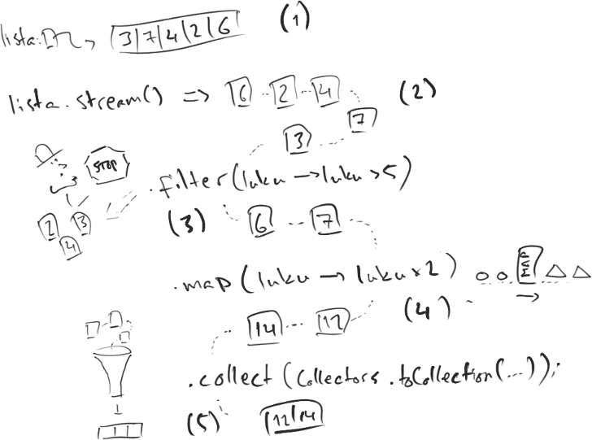

<!-- <text-box variant='learningObjectives' name='Oppimistavoitteet'> -->
<text-box variant='learningObjectives' name='Learning Objectives'>

<!-- - Osaat käsitellä tietokokoelmia virran avulla.
- Tiedät mitä lambda-lauseke tarkoittaa.
- Tunnet yleisimmät virran metodit ja osaat jaotella ne välioperaatioihin ja pääteoperaatioihin. -->
- You can handle collections using streams
- You know what a lambda-statement means
- You know the most common stream methods and are able to categorize them into intermediate and terminal operations.

</text-box>

<!-- Tutustutaan kokoelmien kuten listojen läpikäyntiin arvojen virtana (stream). Virta on menetelmä tietoa sisältävän kokoelman läpikäyntiin siten, että ohjelmoija määrittelee kullekin arvolle suoritettavan toiminnallisuuden. Indeksistä tai kullakin hetkellä käsiteltävästä muuttujasta ei pidetä kirjaa.

Virran avulla ohjelmoija määrittelee käytännössä tapahtumaketjun, joka suoritetaan jokaiselle tietokokoelman arvolle. Tapahtumaketju voi sisältää joidenkin arvojen pois pudottamisen, arvojen muuntamisen muodosta toiseen, ja vaikkapa arvojen laskemisen. Virta ei muuta alkuperäisen tietokokoelman arvoja, vaan se vain käsittelee niitä -- mikäli muunnokset halutaan talteen, tulee ne koota toiseen tietokokoelmaan.

Tutustutaan virran käyttöön konkreettisen esimerkin kautta. Tarkastellaan seuraavaa ongelmaa:

*Kirjoita ohjelma, joka lukee käyttäjältä syötteitä ja tulostaa niihin liittyen tilastoja. Kun käyttäjä syöttää merkkijonon "end", lukeminen lopetetaan. Muut syötteet ovat lukuja merkkijonomuodossa. Kun syötteiden lukeminen lopetetaan, ohjelma tulostaa kolmella jaollisten positiivisten lukujen lukumäärän sekä kaikkien lukujen keskiarvon.* -->
Let's get to know collections, such as lists, as streams of values. Stream is a way of going through a collection of data such that the programmer determines the operation to be performed on each value. No record is kept of the index or the variable being processed at any given time.

With streams, the programmer defines a sequence of events that is executed for each value in a collection. An event chain may include dumping some of the values, converting values ​​from one form to another, or calucations. A stream does not change the values ​​in the original data collection, but merely processes them. If you want to retain the transformations, they need to be compiled into another data collection.

Let's begin to understand the usage of streams through a concrete example. Consider the following problem:

  *Write a program that reads input from a user and prints statistics about those inputs. When the user enters the string "end", the reading is stopped. Other inputs are numbers in string format. When you stop reading inputs, the program prints the number of positive integers divisible by three, and the average of all values.*

<!-- ```java
// alustetaan lukija ja lista, johon syotteet luetaan
Scanner lukija = new Scanner(System.in);
List<String> syotteet = new ArrayList<>();

// luetaan syotteet
while (true) {
    String rivi = lukija.nextLine();
    if (rivi.equals("end")) {
        break;
    }

    syotteet.add(rivi);
}

// selvitetään kolmella jaollisten lukumaara
long kolmellaJaollistenLukumaara = syotteet.stream()
    .mapToInt(s -> Integer.valueOf(s))
    .filter(luku -> luku % 3 == 0)
    .count();

// selvitetään keskiarvo
double keskiarvo = syotteet.stream()
    .mapToInt(s -> Integer.valueOf(s))
    .average()
    .getAsDouble();

// tulostetaan tilastot
System.out.println("Kolmella jaollisia: " + kolmellaJaollistenLukumaara);
System.out.println("Lukujen keskiarvo: " + keskiarvo);
``` -->
```java
// We initialise the scanner and the list into which the input is read
Scanner scanner = new Scanner(System.in);
List<String> inputs = new ArrayList<>();

// reading inputs
while (true) {
    String row = scanner.nextLine();
    if (row.equals("end")) {
        break;
    }

    inputs.add(row);
}

// counting the number of values divisible by three
long numbersDivisibleByThree = inputs.stream()
    .mapToInt(s -> Integer.valueOf(s))
    .filter(number -> number % 3 == 0)
    .count();

// working out the average
double average = inputs.stream()
    .mapToInt(s -> Integer.valueOf(s))
    .average()
    .getAsDouble();

// printing out the statistics
System.out.println("Divisible by three " + numbersDivisibleByThree);
System.out.println("Average number: " + average);
```


<!-- Tarkastellaan tarkemmin yllä kuvatun ohjelman osaa, missä luettuja syötteitä käsitellään virtana. -->
Let's take a closer look at the part of the program above where the inputs are dealt as streams.

<!-- ```java
// selvitetään kolmella jaollisten lukumaara
long kolmellaJaollistenLukumaara = syotteet.stream()
    .mapToInt(s -> Integer.valueOf(s))
    .filter(luku -> luku % 3 == 0)
    .count();
``` -->
```java
// counting the number of values divisible by three
long numbersDivisibleByThree = inputs.stream()
    .mapToInt(s -> Integer.valueOf(s))
    .filter(number -> number % 3 == 0)
    .count();
```


<!-- Virta luodaan mistä tahansa <a href="https://docs.oracle.com/javase/8/docs/api/java/util/Collection.html" target="_blank" norel>Collection</a>-rajapinnan toteuttavasta oliosta (esim. ArrayList, HashSet, HashMap, ...) metodilla `stream()`. Tämän jälkeen merkkijonomuotoiset arvot muunnetaan ("map") kokonaislukumuotoon virran metodilla `mapToInt(arvo -> muunnos)` -- muunto toteutetaan `Integer`-luokan tarjoamalla `valueOf`-metodilla, jota olemme käyttäneet aiemminkin. Seuraavaksi rajaamme metodilla `filter(arvo -> rajausehto)` käsiteltäväksi vain ne luvut, jotka ovat kolmella jaollisia. Lopulta kutsumme virran metodia `count()`, joka laskee virran alkioiden lukumäärän ja palauttaa sen `long`-tyyppisenä muuttujana.


Tarkastellaan tämän jälkeen listan alkioiden keskiarvon laskemiseen tarkoitettua ohjelmaa. -->

A stream can be formed from any object that implements the <a href="https://docs.oracle.com/javase/8/docs/api/java/util/Collection.html" target="_blank" norel> Collection </a> interface (e.g., ArrayList, HashSet, HashMap, ...) with the `stream()` method. The string values ​​are then converted ("mapped") to integer form using the stream's `mapToInt(value -> conversion)` method. The conversion is implemented by the `valueOf` method of the `Integer` class, which we've used in the past. We then use the `filter (value -> filter condition)` method to filter out only those numbers that are divisible by three for further processing. Finally, we call the stream's `count()` method, which counts the number of elements in the stream and returns it as a `long` type variable.


Let's now look at the part of the program that calculates the average of the list elements.

<!-- ```java
// selvitetään keskiarvo
double keskiarvo = syotteet.stream()
    .mapToInt(s -> Integer.valueOf(s))
    .average()
    .getAsDouble();
``` -->
```java
// working out the average
double average = inputs.stream()
    .mapToInt(s -> Integer.valueOf(s))
    .average()
    .getAsDouble();
```

<!-- Keskiarvon laskeminen onnistuu virrasta, jolle on kutsuttu `mapToInt`-metodia. Kokonaislukuja sisältävällä virralla on metodi `average()`, joka palauttaa <a href="https://docs.oracle.com/javase/8/docs/api/java/util/OptionalDouble.html" target="_blank" norel>OptionalDouble</a>-tyyppisen olion. Oliolla on metodi `getAsDouble()`, joka palauttaa listan arvojen keskiarvon `double`-tyyppisenä muuttujana.

Lyhyt yhteenveto tähän mennessä tutuiksi tulleista virtaan liittyvistä metodeista. -->
Calculating the average is possible from a stream that has the `mapToInt` method called on it. A stream of integers has an `average` method that returns an <a href="https://docs.oracle.com/javase/8/docs/api/java/util/OptionalDouble.html" target="_blank" norel>OptionalDouble</a>-type object. The object has `getAsDouble()` method that returns the average of the list values as a type `double` varaible.

A brief summary of the stream methods we've encountered so far.

<!-- <table class="table">
  <tr>
    <th>
      Tarkoitus ja metodi
    </th>
    <th>
      Oletukset
    </th>
  </tr>

  <tr>
    <td>
      Virran luominen: `stream()`
    </td>
    <td>
      Metodia kutsutaan Collection-rajapinnan toteuttavalle kokoelmalle kuten ArrayList-oliolle. Luotavalle virralle tehdään jotain.
    </td>
  </tr>

  <tr>
    <td>
      Virran muuntaminen kokonaislukuvirraksi: `mapToInt(arvo -> toinen)`
    </td>
    <td>
      Virta muuntuu kokonaislukuja sisältäväksi virraksi. Merkkijonoja sisältävä muunnos voidaan tehdä esimerkiksi Integer-luokan valueOf-metodin avulla. Kokonaislukuja sisältävälle virralle tehdään jotain.
    </td>
  </tr>

  <tr>
    <td>
      Arvojen rajaaminen: `filter(arvo -> hyvaksymisehto)`
    </td>
    <td>
      Virrasta rajataan pois ne arvot, jotka eivät täytä hyväksymisehtoa. "Nuolen" oikealla puolella on lauseke, joka palauttaa totuusarvon. Jos totuusarvo on `true`, arvo hyväksytään virtaan. Jos totuusarvo on `false`, arvoa ei hyväksytä virtaan. Rajatuille arvoille tehdään jotain.
    </td>
  </tr>

  <tr>
    <td>
      Keskiarvon laskeminen: `average()`
    </td>
    <td>
      Palauttaa OptionalDouble-tyyppisen olion, jolla on `double` tyyppisen arvon palauttava metodi `getAsDouble()`. Metodin `average()` kutsuminen onnistuu kokonaislukuja sisältävälle virralle (luominen onnistuu `mapToInt`-metodilla.
    </td>
  </tr>

  <tr>
    <td>
      Virrassa olevien alkioiden lukumaara: `count()`
    </td>
    <td>
      Palauttaa virrassa olevien alkioiden lukumäärän `long`-tyyppisenä arvona.
    </td>
  </tr>

</table> -->

<table class="table">
  <tr>
    <th>
      Purpose and method
    </th>
    <th>
      Assumptions
    </th>
  </tr>

  <tr>
    <td>
      Stream formation: `stream()`
    </td>
    <td>
      The method is called on collection that implement the Collection interface, such as an ArrayList Object. Something is done on the created stream.
    </td>
  </tr>

  <tr>
    <td>
      Converting a stream into an integer stream: `mapToInt(value -> another)`
    </td>
    <td>
      The stream transforms into one containing integers.
      A stream containing strings can be converted using, for instance, the valueOf method of the Integer class.
      Something is done with the stream containing integers.
    </td>
  </tr>

  <tr>
    <td>
      Filtering values:
      `filter(value -> filter condition)`
    </td>
    <td>
      The elements that do not satisfy the filter condition are removed from the string.
      On the right side of the arrow is a statement that returns a boolean.
      If the boolean is `true`, the element is accepted into the stream. If the boolean evaluates to false, the value is not accepted into the stream. Something is done with the filtered values.
    </td>
  </tr>

  <tr>
    <td>
      Calculating the average: `average()`
    </td>
    <td>
      Returns a OptionalDouble-type object that has a method `getAsDouble()` that returns a value of type `double`. Calling the method `average()` works on streams that contain integers - they can be created with the `mapToInt` method.
    </td>
  </tr>

  <tr>
    <td>
      Counting the number of elements in a stream: `count()`
    </td>
    <td>
      Returns the number of elements in a stream as a `long`-type value.
    </td>
  </tr>

</table>


<programming-exercise name='Average of Numbers' tmcname='part10-Part10_01.AverageOfNumbers'>

<!-- Toteuta ohjelma, joka lukee käyttäjältä syötteitä. Jos käyttäjä syöttää merkkijonon "end", lukeminen lopetetaan. Muut syötteet ovat lukuja. Kun käyttäjä syöttää merkkijonon "end", ohjelman tulee tulostaa syötettyjen lukujen keskiarvo. -->
Implement a program, which reads user input. If the user input is "end", the program stops reading input. The rest of the input is numbers. When the user input is "end", the program prints the average of all of the numbers.

<!-- Toteuta keskiarvon laskeminen virran avulla! -->
Implement calculating the average using a stream!


<sample-output>

Input numbers, type "end" to stop.
**2**
**4**
**6**
**end**
average of the numbers: 4.0

</sample-output>


<sample-output>

Input numbers, type "end" to stop.
**-1**
**1**
**2**
**end**
average of the numbers: 0.6666666666666666

</sample-output>

</programming-exercise>


<programming-exercise name='Average of selected numbers' tmcname='part10-Part10_02.AverageOfSelectedNumbers'>

<!-- Toteuta ohjelma, joka lukee käyttäjältä syötteitä. Jos käyttäjä syöttää merkkijonon "end", lukeminen lopetetaan. Muut syötteet ovat lukuja. Kun käyttäjä syöttää merkkijonon "end", syötteiden lukeminen lopetetaan. -->
Implement a program, which reads user input. If the user input is "end", program stops reading input. The rest of the input is numbers.

<!-- Tämän jälkeen käyttäjältä kysytään tulostetaanko negatiivisten vai positiivisten lukujen keskiarvo (n vai p). Jos käyttäjä syöttää merkkijonon "n", tulostetaan negatiivisten lukujen keskiarvo, muulloin tulostetaan positiivisten lukujen keskiarvo. -->
Then user is asked if the program should print the average of all the positive numbers, or the average of all the negative numbers (n or p). If the user selects "n", the average of all the negative numbers is printed. Otherwise the average of all the positive numbers is printed.

<!-- Toteuta keskiarvon laskeminen sekä rajaus virran avulla! -->
Use streams to calculate the average and filter the numbers!


<sample-output>

Input numbers, type "end" to stop.
**-1**
**1**
**2**
**end**

Print the average of the negative numbers or the positive numbers? (n/p)
**n**
Average of the negative numbers: -1.0

</sample-output>

<sample-output>

Input numbers, type "end" to stop.
**-1**
**1**
**2**
**end**

Print the average of the negative numbers or the positive numbers? (n/p)
**p**
Average of the positive numbers: 1.5

</sample-output>

</programming-exercise>


<!-- ## Lambda-lauseke -->
## Lambda Expressions

<!-- Virran arvoja käsitellään virtaan liittyvillä metodeilla. Arvoja käsittelevät metodit saavat parametrinaan funktion, joka kertoo mitä kullekin arvolle tulee tehdä. Funktion toiminnallisuus on metodikohtaista: rajaamiseen käytetylle metodille `filter` annetaan funktio, joka palauttaa totuusarvoisen muuttujan arvon `true` tai `false`, riippuen halutaanko arvo säilyttää virrassa; muuntamiseen käytetylle metodille `mapToInt` annetaan funktio, joka muuntaa arvon kokonaisluvuksi, jne.

Miksi funktiot kirjoitetaan muodossa `luku -> luku > 5`?

Kyseinen kirjoitusmuoto, *lambda-lauseke*, on Javan tarjoama lyhenne ns. anonyymeille metodeille, joilla ei ole "omistajaa" eli ne eivät ole osa luokkaa tai rajapintaa. Funktio sisältää sekä parametrien määrittelyn että funktion rungon. Saman funktion voi kirjoittaa useammalla eri tavalla, kts. alla. -->
Stream values ​​are handled by methods related to streams. Methods that handle values ​​get a function as a parameter that determines what is done with each element. What the function does is specific to the method in question. For instance, the `filter` method used for filtering elements is provided a function which returns the a boolean `true` or `false`, depending on whether to keep the value in the stream or not. The `mapToInt` method used for transformation is, on the other hand, provided a function which converts the value to an integer, and so on.

Why are the functions written in the form `value -> value > 5`?

The expression above, i.e., a *lambda expression*, is shorthand provided by Java for anonymous methods that do not have an "owner", i.e., they are not part of a class or an interface. The function contains both the parameter definition and the function body. The same function can be written in several different ways. See below.


<!-- ```java
// alkuperäinen
*virta*.filter(luku -> luku > 5).*jatkokäsittely*

// on sama kuin
*virta*.filter((Integer luku) -> {
    if (luku > 5) {
        return true;
    }

    return false;
}).*jatkokäsittely*
``` -->
```java
// original
*stream*.filter(value -> value > 5).*furtherAction*

// is the same as
*stream*.filter((Integer value) -> {
    if (value > 5) {
        return true;
    }

    return false;
}).*furtherAction*
```


<!-- Saman voi kirjoittaa myös eksplisiittisesti niin, että ohjelmaan määrittelee staattisen metodin, jota hyödynnetään virralle parametrina annetussa funktiossa. -->

The same can be written explicitly so that a static method is defined in the program, which gets used within the function passed to the stream as a parameter.


<!-- ```java
public class Rajaajat {
    public static boolean vitostaSuurempi(int luku) {
        return luku > 5;
    }
}
``` -->
```java
public class Screeners {
    public static boolean greaterThanFive(int value) {
        return value > 5;
    }
}
```

<!-- ```java
// alkuperäinen
*virta*.filter(luku -> luku > 5).*jatkokäsittely*

// on sama kuin
*virta*.filter(luku -> Rajaajat.vitostaSuurempi(luku)).*jatkokäsittely*
``` -->
```java
// original
*stream*.filter(value -> value > 5).*furtherAction*

// is the same as
*stream*.filter(value -> Screeners.vitostaSuurempi(value)).*furtherAction*
```

<!-- Funktion voi antaa myös suoraan parametrina. Alla oleva syntaksi `Rajaajat::vitostaSuurempi` tarkoittaa "hyödynnä tässä `Rajaajat`-luokassa olevaa staattista metodia `vitostaSuurempi`". -->
The function can also be passed directly as a parameter. The syntax found below `Screeners::greaterThanFive` is saying: "use the static `greaterThanFive` method that's in the `Screeners` class".

<!-- ```java
// on sama kuin
*virta*.filter(Rajaajat::vitostaSuurempi).*jatkokäsittely*
``` -->
```java
// is the same as
*stream*.filter(Screeners::greaterThanFive).*furtherAction*
```

<!-- Virran arvoja käsittelevät funktiot eivät voi muuttaa funktion ulkopuolisten muuttujien arvoja. Kyse on käytännössä staattisten metodien käyttäytymisestä -- metodia kutsuttaessa metodin ulkopuolisiin muuttujiin ei pääse käsiksi. Funktioiden tilanteessa funktion ulkopuolisten muuttujien arvoja voi lukea olettaen, että luettavien muuttujien arvot eivät muutu lainkaan ohjelmassa.

Alla oleva ohjelma demonstroi tilannetta, missä funktiossa yritetään hyödyntää funktion ulkopuolista muuttujaa. Tämä ei toimi. -->
Functions thats handle stream elements ​​cannot change values ​​of variables outside of the function. This has to do with how static methods behave - during a method call, there is no access to any variables outside of the method. With  functions, the values ​​of variables outside the function can be read, assuming that those values of those variables do not change in the program.

The program below demonstrates the situation in which a function attempts to make use of a variable outside the function. It doesn't work.

<!-- ```java
// alustetaan lukija ja lista, johon syotteet luetaan
Scanner lukija = new Scanner(System.in);
List<String> syotteet = new ArrayList<>()

// luetaan syotteet
while (true) {
    String rivi = lukija.nextLine();
    if (rivi.equals("end")) {
        break;
    }

    syotteet.add(rivi);
}

int muunnettujaYhteensa = 0;

// selvitetään kolmella jaollisten lukumaara
long kolmellaJaollistenLukumaara = syotteet.stream()
    .mapToInt(s -> {
        // anonyymissä funktiossa ei voi käsitellä (tai tarkemmin muuttaa) funktion
        // ulkopuolella määriteltyä muuttujaa, joten tämä ei toimi
        muunnettujaYhteensa++;
        return Integer.valueOf(s);
    }).filter(luku -> luku % 3 == 0)
    .count();
``` -->
```java
// initializing a scanner and a list to which values are read
Scanner scanner = new Scanner(System.in);
List<String> inputs = new ArrayList<>()

// reading inputs
while (true) {
    String row = scanner.nextLine();
    if (row.equals("end")) {
        break;
    }

    inputs.add(row);
}

int numberOfMappedValues = 0;

// determining the number of values divisible by three
long numbersDivisibleByThree = inputs.stream()
    .mapToInt(s -> {
        // variables declared outside of an anonymous function cannot be used, so this won't work
        numberOfMappedValues++;
        return Integer.valueOf(s);
    }).filter(value -> value % 3 == 0)
    .count();
```


<!-- ## Virran metodit -->
## Stream Methods

<!-- Virran metodit voi jakaa karkeasti kahteen eri ryhmään: virran (1) arvojen käsittelyyn tarkoitettuihin välioperaatioihin sekä (2) käsittelyn lopettaviin pääteoperaatiohin. Edellisessä esimerkissä nähdyt metodit `filter` ja `mapToInt` ovat välioperaatioita. Välioperaatiot palauttavat arvonaan virran, jonka käsittelyä voi jatkaa -- käytännössä välioperaatioita voi olla käytännössä ääretön määrä ketjutettuna peräkkäin (pisteellä eroteltuna). Toisaalta edellisessä esimerkissä nähty metodi `average` on pääteoperaatio. Pääteoperaatio palauttaa käsiteltävän arvon, joka luodaan esimerkiksi virran arvoista.

Alla olevassa kuvassa on kuvattu virran toimintaa. Lähtötilanteena (1) on lista, jossa on arvoja. Kun listalle kutsutaan `stream()`-metodia, (2) luodaan virta listan arvoista. Arvoja käsitellään tämän jälkeen yksitellen. Virran arvoja voidaan (3) rajata metodilla `filter`. Tämä poistaa virrasta ne arvot, jotka ovat rajauksen ulkopuolella. Virran metodilla `map` voidaan (4) muuntaa virrassa olevia arvoja muodosta toiseen. Metodi `collect` (5) kerää virrassa olevat arvot arvot sille annettuun kokoelmaan, esim. listalle. -->
Stream methods can be roughly divided into two categories: (1) intermediate operations inteded for processing elements ​​and (2) terminal operations that end the processing of elements. Both of the `filter` and `mapToInt` methods shown in the previous example are intermediate operations. Intermediate operations return a value that can be further processed - you could, in practice, have an infinite number of intermediate operations chained sequentially (& separated by a dot). On the other hand, the `average` method seen in the previous example is a terminal operation. A terminal operation returns a value to be processed, which is formed from, for instance, stream elements.

The figure below illustrates how a stream works. The starting point (1) is a list with values. When the `stream()` method is called on a list, (2) a stream of list values ​​is created. The values ​​are then dealt with individually. The stream values ​​can be (3) filtered by the `filter` method, which removes values ​​that fail to meet the condition from the stream. The stream's `map` method (4) can be used to map values ​​in a stream from one form to another. The `collect` method (5) collects the values ​​in a stream into a collection  provided to it, such as a list.



&nbsp;

<!-- Alla vielä yllä olevan kuvan kuvaama esimerkki ohjelmakoodina. Esimerkissä virrasta luodaan uusi ArrayList-lista, johon arvot lisätään. Tämä tapahtuu viimeisellä rivillä `.collect(Collectors.toCollection(ArrayList::new));`. -->
Underneath is a program of the example  depicted in the image above. In this example stream, a new ArrayList list is created to which values ​​are added. This is done in the last line `.collect(Collectors.toCollection(ArrayList::new));`.


<!-- ```java
List<Integer> lista = new ArrayList<>();
lista.add(3);
lista.add(7);
lista.add(4);
lista.add(2);
lista.add(6);

ArrayList<Integer> luvut = lista.stream()
    .filter(luku -> luku > 5)
    .map(luku -> luku * 2)
    .collect(Collectors.toCollection(ArrayList::new));
``` -->
```java
List<Integer> list = new ArrayList<>();
list.add(3);
list.add(7);
list.add(4);
list.add(2);
list.add(6);

ArrayList<Integer> luvut = list.stream()
    .filter(value -> value > 5)
    .map(value -> value * 2)
    .collect(Collectors.toCollection(ArrayList::new));
```


<programming-exercise name='Positive Numbers' tmcname='part10-Part10_03.PositiveNumbers'>

<!-- Toteuta tehtäväpohjaan luokkametodi `public static List<Integer> positiiviset(List<Integer> luvut)`, joka saa parametrinaan lukulistan ja jonka tulee palauttaa uusi lukulista, joka sisältää parametrina saadun listan sisältämät positiiviset luvut.

Toteuta metodi virtaa hyödyntäen! Kokeile lukujen keräämisen `Collectors.toCollection(ArrayList::new)` lisäksi komentoa `Collectors.toList()`. -->

In the exercise template, implement the class method `public static List<Integer> positive(List<Integer> numbers)`, which receives an ArrayList of integers, and returns the positive integers from the list.

Implement the method using stream! For collecting the numbers try the command `Collectors.toList()` in addition to the `Collectors.toCollection(ArrayList::new)` command.

</programming-exercise>


<!-- ### Pääteoperaatiot -->
### Terminal Operations

<!-- Tarkastellaan tässä neljää pääteoperaatiota: listan arvojen lukumäärän selvittämistä `count`-metodin avulla, listan arvojen läpikäyntiä `forEach`-metodin avulla sekä listan arvojen keräämistä tietorakenteeseen `collect`-metodin avulla, sekä listan alkioiden yhdistämistä `reduce`-metodin avulla.

Metodi `count` kertoo virran alkioiden lukumäärän `long`-tyyppisenä muuttujana. -->

Let's take a look at four terminal operations: the `count` method for counting the number of values on a list ​​using the, the `forEach` method for going a through list values, the `collect` method for gathering the list values ​​into a data structure, and the `reduce` method for combining the list items.

The `count` method informs us of the number of values in the stream as a `long`-type variable.

<!-- ```java
List<Integer> luvut = new ArrayList<>();
luvut.add(3);
luvut.add(2);
luvut.add(17);
luvut.add(6);
luvut.add(8);

System.out.println("Lukuja: " + luvut.stream().count());
``` -->
```java
List<Integer> values = new ArrayList<>();
values.add(3);
values.add(2);
values.add(17);
values.add(6);
values.add(8);

System.out.println("Values: " + values.stream().count());
```

<!-- <sample-output>

Lukuja: 5

</sample-output> -->
<sample-output>

Values: 5

</sample-output>

<!-- Metodi `forEach` kertoo mitä kullekin listan arvolle tulee tehdä ja samalla päättää virran käsittelyn. Alla olevassa esimerkissä luodaan ensin numeroita sisältävä lista, jonka jälkeen tulostetaan vain kahdella jaolliset luvut. -->
The `forEach` method defines what is done to each list value and terminated the stream processing. In the example below, we first create a list of numbers, after which we only print the numbers that are divisible by two.


<!-- ```java
List<Integer> luvut = new ArrayList<>();
luvut.add(3);
luvut.add(2);
luvut.add(17);
luvut.add(6);
luvut.add(8);

luvut.stream()
    .filter(luku -> luku % 2 == 0)
    .forEach(luku -> System.out.println(luku));
``` -->
```java
List<Integer> values = new ArrayList<>();
values.add(3);
values.add(2);
values.add(17);
values.add(6);
values.add(8);

values.stream()
    .filter(value -> value % 2 == 0)
    .forEach(value -> System.out.println(value));
```

<sample-output>

2
6
8

</sample-output>


<!-- Virran arvojen kerääminen toiseen kokoelmaan onnistuu metodin `collect` avulla. Alla olevassa esimerkissä luodaan uusi lista annetun positiivisista arvoista. Metodille `collect` annetaan parametrina <a href="https://docs.oracle.com/javase/8/docs/api/java/util/stream/Collectors.html" target="_blank" norel>Collectors</a>-luokan avulla luotu olio, johon virran arvot kerätään -- esimerkiksi kutsu `Collectors.toCollection(ArrayList::new)` luo uuden ArrayList-olion, johon arvot kerätään. -->
You can use the `collect` method to collect stream values into another collection. The example below creates a new list containing only positive values. The `collect` method is given as a parameter to the <a href="https://docs.oracle.com/javase/8/docs/api/java/util/stream/Collectors.html" target="_blank" norel> Collectors </a> > object to which the stream values ​​are collected - for example, calling `Collectors.toCollection(ArrayList::new)` creates a new ArrayList object that holds the collected values.

<!-- ```java
List<Integer> luvut = new ArrayList<>();
luvut.add(3);
luvut.add(2);
luvut.add(-17);
luvut.add(-6);
luvut.add(8);

ArrayList<Integer> positiiviset = luvut.stream()
    .filter(luku -> luku > 0)
    .collect(Collectors.toCollection(ArrayList::new));

positiiviset.stream()
    .forEach(luku -> System.out.println(luku));
``` -->
```java
List<Integer> values = new ArrayList<>();
values.add(3);
values.add(2);
values.add(-17);
values.add(-6);
values.add(8);

ArrayList<Integer> positiiviset = values.stream()
    .filter(value -> value > 0)
    .collect(Collectors.toCollection(ArrayList::new));

positiiviset.stream()
    .forEach(value -> System.out.println(value));
```

<sample-output>

3
2
8

</sample-output>


<quiz id='d4b00724-e855-5657-b782-ddd619b841f4'></quiz>


<programming-exercise name='Divisible' tmcname='part10-Part10_04.Divisible'>

<!-- Tehtäväpohjassa on annettuna metodirunko `public static ArrayList<Integer> jaolliset(ArrayList<Integer> luvut)`. Toteuta metodirunkoon toiminnallisuus, joka kerää parametrina saadulta listalta kahdella, kolmella tai viidellä jaolliset luvut, ja palauttaa ne uudessa listassa. Metodille parametrina annetun listan ei tule muuttua. -->

The exercise template includes a template for the method `public static ArrayList<Integer> divisible(ArrayList<Integer> numbers)`. Implement a functionality there that gathers numbers divisible by two, three or five from the list it receives as a parameter, and returns them as a new list. The list received as a parameter must not be altered.
<!-- ```java
ArrayList<Integer> luvut = new ArrayList<>();
luvut.add(3);
luvut.add(2);
luvut.add(-17);
luvut.add(-5);
luvut.add(7);

ArrayList<Integer> jaolliset = jaolliset(luvut);

jaolliset.stream()
    .forEach(luku -> System.out.println(luku));
``` -->

```java
public static void main(String[] args) {
        ArrayList<Integer> numbers = new ArrayList<>();
        numbers.add(3);
        numbers.add(2);
        numbers.add(-17);
        numbers.add(-5);
        numbers.add(7);

        ArrayList<Integer> divisible = divisible(numbers);

        divisible.stream()
                .forEach(num -> System.out.println(num));
    }
```

<sample-output>

3
2
-5

</sample-output>

</programming-exercise>


<!-- Metodi `reduce` on hyödyllinen kun virrassa olevat alkiot halutaan yhdistää jonkinlaiseen toiseen muotoon. Metodin saamat parametrit ovat seuraavaa muotoa: `reduce(*alkutila*, (*edellinen*, *olio*) -> *mitä oliolla tehdään*)`.

Esimerkiksi kokonaislukuja sisältävän listan summan saa laskettua reduce-metodin avulla seuraavasti. -->

The `reduce` method is useful when you want to combine stream elements to some other form. The parameters accepted by the method have the following format: `reduce(*initialState*, (*previous*, *object*) -> *actions on the object*)`.

As an example, you can calculate the sum of an integer list using the reduce method as follows.

<!-- ```java
ArrayList<Integer> luvut = new ArrayList<>();
luvut.add(7);
luvut.add(3);
luvut.add(2);
luvut.add(1);

int summa = luvut.stream()
    .reduce(0, (edellinenSumma, luku) -> edellinenSumma + luku);
System.out.println(summa);
``` -->
```java
ArrayList<Integer> values = new ArrayList<>();
values.add(7);
values.add(3);
values.add(2);
values.add(1);

int sum = values.stream()
    .reduce(0, (previousSum, value) -> previousSum + value);
System.out.println(sum);
```

<sample-output>

13

</sample-output>

<!-- Vastaavasti merkkijonoista koostuvasta listasta saa luotua rivitetyn merkkijonon seuraavasti. -->
In the same way, we can form a combined row-separated string from a list of strings.

<!-- ```java
ArrayList<String> sanat = new ArrayList<>();
sanat.add("Eka");
sanat.add("Toka");
sanat.add("Kolmas");
sanat.add("Neljäs");

String yhdistetty = sanat.stream()
    .reduce("", (edellinenMjono, sana) -> edellinenMjono + sana + "\n");
System.out.println(yhdistetty);
``` -->
```java
ArrayList<String> words = new ArrayList<>();
words.add("First");
words.add("Second");
words.add("Third");
words.add("Fourth");

String combined = words.stream()
    .reduce("", (previousString, word) -> previousString + word + "\n");
System.out.println(combined);
```

<!-- <sample-output>

Eka
Toka
Kolmas
Neljäs

</sample-output> -->
<sample-output>

First
Second
Third
Fourth

</sample-output>


<!-- ### Välioperaatiot -->
### Imtermediate Operations

<!-- Virran välioperaatiot ovat metodeja, jotka palauttavat arvonaan virran. Koska palautettava arvo on virta, voidaan välioperaatioita kutsua peräkkäin. Tyypillisiä välioperaatioita ovat arvon muuntaminen muodosta toiseen `map` sekä sen erityistapaus `mapToInt` eli virran muuntaminen kokonaislukuvirraksi, arvojen rajaaminen `filter`, uniikkien arvojen tunnistaminen `distinct` sekä arvojen järjestäminen `sorted` (mikäli mahdollista).

Tarkastellaan näitä metodeja muutaman ongelman avulla. Oletetaan, että käytössämme on seuraava luokka Henkilo. -->
Intermediate stream operations are methods that return a stream. Since the value returned is a stream, we can call intermediate operations sequentially. Typical intermediate operations include converting a value from one form to another using `map` and its more specific form `mapToInt` used for converting a stream to an integer stream. Other ones include filtering values with `filter`,identifying unique values with `distinct`, and arranging values with `sorted` (if possible).

Let's look at these methods in action through a few problems. Say we have the following Person class.

<!-- ```java
public class Henkilo {
    private String etunimi;
    private String sukunimi;
    private int syntymavuosi;

    public Henkilo(String etunimi, String sukunimi, int syntymavuosi) {
        this.etunimi = etunimi;
        this.sukunimi = sukunimi;
        this.syntymavuosi = syntymavuosi;
    }

    public String getEtunimi() {
        return this.etunimi;
    }

    public String getSukunimi() {
        return this.sukunimi;
    }

    public int getSyntymavuosi() {
        return this.syntymavuosi;
    }
}
``` -->
```java
public class Person {
    private String firstName;
    private String lastName;
    private int birthYear;

    public Person(String firstName, String lastName, int birthYear) {
        this.firstName = firstName;
        this.lastName = lastName;
        this.birthYear = birthYear;
    }

    public String getFirstName() {
        return this.firstName;
    }

    public String getLastName() {
        return this.lastName;
    }

    public int getBirthYear() {
        return this.birthYear;
    }
}
```

<!-- *Ongelma 1: Saat käyttöösi listan henkilöitä. Tulosta ennen vuotta 1970 syntyneiden henkilöiden lukumäärä.*


Käytetään `filter`-metodia henkilöiden rajaamiseen niihin, jotka ovat syntyneet ennen vuotta 1970. Lasketaan tämän jälkeen henkilöiden lukumäärä metodilla `count`. -->
*Problem 1: You'll receive a list of persons. Print the number of persons born before the year 1970.*


We'll use the `filter` method for filtering through only those persons who were born before the year 1970. We then count their number using the method `count`.


```java
// oletetaan, että käytössämme on lista henkiloita
// ArrayList<Henkilo> henkilot = new ArrayList<>();

long lkm = henkilot.stream()
    .filter(henkilo -> henkilo.getSyntymavuosi() < 1970)
    .count();
System.out.println("Lukumäärä: " + lkm);
```

*Ongelma 2: Saat käyttöösi listan henkilöitä. Kuinka monen henkilön etunimi alkaa kirjaimella "A"?*

Käytetään `filter`-metodia henkilöiden rajaamiseen niihin, joiden etunimi alkaa kirjaimella "A". Lasketaan tämän jälkeen henkilöiden lukumäärä metodilla `count`.


```java
// oletetaan, että käytössämme on lista henkiloita
// ArrayList<Henkilo> henkilot = new ArrayList<>();

long lkm = henkilot.stream()
    .filter(henkilo -> henkilo.getEtunimi().startsWith("A"))
    .count();
System.out.println("Lukumäärä: " + lkm);
```

*Ongelma 3: Saat käyttöösi listan henkilöitä. Tulosta henkilöiden uniikit etunimet aakkosjärjestyksessä.*

Käytetään ensin `map`-metodia, jonka avulla henkilö-olioita sisältävä virta muunnetaan etunimiä sisältäväksi virraksi. Tämän jälkeen kutsutaan metodia `distinct`, joka palauttaa virran, jossa on uniikit arvot. Seuraavaksi kutsutaan metodia `sorted`, joka järjestää merkkijonot. Lopulta kutsutaan metodia `forEach`, jonka avulla tulostetaan merkkijonot.


```java
// oletetaan, että käytössämme on lista henkiloita
// ArrayList<Henkilo> henkilot = new ArrayList<>();

henkilot.stream()
    .map(henkilo -> henkilo.getEtunimi())
    .distinct()
    .sorted()
    .forEach(nimi -> System.out.println(nimi));
```

Yllä kuvattu `distinct`-metodi hyödyntää olioiden `equals`-metodia yhtäsuuruuden tarkasteluun. Metodi `sorted` taas osaa järjestää olioita, joilla on tieto siitä, miten olio tulee järjestää -- näitä ovat esimerkiksi luvut ja merkkijonot.


<!-- <programming-exercise name='Luettujen arvojen tulostaminen' tmcname='part10-Part10_05.LuettujenArvojenTulostaminen'> -->

<programming-exercise name='Printing User Input' tmcname='part10-Part10_05.PrintingUserInput'>

<!-- Kirjoita ohjelma, joka lukee käyttäjältä merkkijonoja. Lukeminen tulee lopettaa kun käyttäjä syöttää tyhjän merkkijonon. Tulosta tämän jälkeen käyttäjän syöttämät merkkijonot. -->

Write a program that reads the user's input as strings. When the user inputs an empty string (only presses enter), the input reading will be stopped and the program will print all the user inputs.


<!-- <sample-output>

**eka**
**toka**
**kolmas**

eka
toka
kolmas

</sample-output> -->

<sample-output>

**first**
**second**
**war is peace: 1984**

first
second
war is peace: 1984

</sample-output>

</programming-exercise>


<!-- <programming-exercise name='Rajatut luvut' tmcname='part10-Part10_06.RajatutLuvut'> -->

<programming-exercise name='Limited numbers' tmcname='part10-Part10_06.LimitedNumbers'>

<!-- Kirjoita ohjelma, joka lukee käyttäjältä lukuja. Kun käyttäjä syöttää negatiivisen luvun, lukeminen lopetetaan. Tulosta tämän jälkeen ne luvut, jotka ovat välillä 1-5. -->

Write a program that reads user input. When the user gives a negative number as an input, the input reading will be stopped. After this, print all the numbers the user has given as input that are between 1 and 5.

<sample-output>

**7**
**14**
**4**
**5**
**4**
**-1**
4
5
4

</sample-output>

</programming-exercise>


<!-- <programming-exercise name='Uniikit sukunimet' tmcname='part10-Part10_07.UniikitSukunimet'> -->

<programming-exercise name='Unique last names' tmcname='part10-Part10_07.UniqueLastNames'>

<!-- Tehtäväpohjaan on hahmoteltu ohjelmaa, joka lukee käyttäjältä syötteenä henkilötietoja. Täydennä ohjelmaa siten, että tietojen lukemisen jälkeen ohjelma tulostaa henkilöiden uniikit sukunimet aakkosjärjestyksessä. -->

The exercise template contains a scetch of a program that reads user given information about people. Expand the program so, that it will print all the unique last names of the user given people in alphabetical order.


<!-- <sample-output>

Syötetäänkö henkilöiden tietoja, "end" lopettaa:
Syötä etunimi: **Ada**
Syötä sukunimi: **Lovelace**
Syötä syntymävuosi: **1815**

Syötetäänkö henkilöiden tietoja, "end" lopettaa:
Syötä etunimi: **Grace**
Syötä sukunimi: **Hopper**
Syötä syntymävuosi: **1906**

Syötetäänkö henkilöiden tietoja, "end" lopettaa:
Syötä etunimi: **Alan**
Syötä sukunimi: **Turing**
Syötä syntymävuosi: **1912**

Syötetäänkö henkilöiden tietoja, "end" lopettaa: end -->

<sample-output>

Continue personal information input? "quit" ends:

Input first name: **Ada**
Input last name: **Lovelace**
Input the year of birth: **1815**

Continue personal information input? "quit" ends:

Input first name: **Grace**
Input last name: **Hopper**
Input the year of birth: **1906**

Continue personal information input? "quit" ends:

Input first name: **Alan**
Input last name: **Turing**
Input the year of birth: **1912**

Continue personal information input? "quit" ends:
**quit**

Unique last names in alphabetical order:
Hopper
Lovelace
Turing

</sample-output>

</programming-exercise>


<!-- ## Oliot ja virta -->
## Objects and Stream

<!-- Olioiden käsittely virran metodien avulla on luontevaa. Kukin virran metodi, missä käsitellään virran arvoja, mahdollistaa myös arvoihin liittyvän metodin kutsumisen. Tarkastellaan esimerkkiä, missä käytössämme on Kirjoja, joilla on kirjailijoita. Luokat `Henkilo` ja `Kirja` on annettu alla. -->

Handling objects using stream methods is natural. Each stream method that deals with the stream's values ​​also enables you to call methods related to values. Let's look at an example where we have books with authors. The classes `Person` and `Book` are provided below.

<!-- ```java
public class Henkilo {
    private String nimi;
    private int syntymavuosi;

    public Henkilo(String nimi, int syntymavuosi) {
        this.nimi = nimi;
        this.syntymavuosi = syntymavuosi;
    }

    public String getNimi() {
        return this.nimi;
    }

    public int getSyntymavuosi() {
        return this.syntymavuosi;
    }

    public String toString() {
        return this.nimi + " (" + this.syntymavuosi + ")";
    }
}
``` -->
```java
public class Person {
    private String name;
    private int birthYear;

    public Person(String name, int birthYear) {
        this.name = name;
        this.birthYear = birthYear;
    }

    public String getName() {
        return this.name;
    }

    public int getBirthYear() {
        return this.birthYear;
    }

    public String toString() {
        return this.name + " (" + this.birthYear + ")";
    }
}
```

<!-- ```java
public class Kirja {
    private Henkilo kirjailija;
    private String nimi;
    private int sivujenLukumaara;

    public Kirja(Henkilo kirjailija, String nimi, int sivuja) {
        this.kirjailija = kirjailija;
        this.nimi = nimi;
        this.sivujenLukumaara = sivuja;
    }

    public Henkilo getKirjailija() {
        return this.kirjailija;
    }

    public String getNimi() {
        return this.nimi;
    }

    public int getSivujenLukumaara() {
        return this.sivujenLukumaara;
    }
}
``` -->
```java
public class Book {
    private Person author;
    private String name;
    private int pages;

    public Book(Person author, String name, int pages) {
        this.author = author;
        this.name = name;
        this.pages = pages;
    }

    public Person getAuthor() {
        return this.author;
    }

    public String getName() {
        return this.name;
    }

    public int getPages() {
        return this.pages;
    }
}
```

<!-- Oletetaan, että käytössämme on lista kirjoja. Virran metodien avulla esimerkiksi kirjailijoiden syntymävuosien keskiarvon selvittäminen onnistuu luontevasti. Ensin muunnamme kirjoja sisältävän virran henkilöitä sisältäväksi virraksi ja tämän jälkeen muunnamme henkilöitä sisältävän virran syntymävuosia sisältäväksi virraksi. Lopulta pyydämme (kokonaislukuja sisältävältä) virralta keskiarvoa. -->

Say we have a list of books. Calculatin the average of authors' birth years can be done using stream methods in a way that feels natural. First, we convert the stream of books to a stream of persons, and then we convert the stream of person to a stream of birth years. Finally, we ask the (integer) stream for an average.


<!-- ```java
// oletetaan, että käytössämme on lista kirjoja
// List<Kirja> kirjat = new ArrayList<>();

double keskiarvo = kirjat.stream()
    .map(kirja -> kirja.getKirjailija())
    .mapToInt(kirjailija -> kirjailija.getSyntymavuosi())
    .average()
    .getAsDouble();

System.out.println("Kirjailijoiden syntymävuosien keskiarvo: " + keskiarvo);

// muunnoksen kirjasta kirjailijan syntymävuoteen pystyisi tekemään myös yhdellä map-kutsulla
// double keskiarvo = kirjat.stream()
//     .mapToInt(kirja -> kirja.getKirjailija().getSyntymavuosi())
//     ...
``` -->
```java
// let's assume that we have a list of books
// List<Book> books = new ArrayList<>();

double average = books.stream()
    .map(book -> book.getAuthor())
    .mapToInt(author -> author.getBirthYear())
    .average()
    .getAsDouble();

System.out.println("Average of authors' birth years: " + average);

// the mapping of a book to an authoe could also be done with a single map call
// double average = books.stream()
//     .mapToInt(book -> book.getUthor().getBirthYear())
//     ...
```

<!-- Vastaavasti kirjojen, joiden nimessä esiintyy sana "Potter", kirjailijoiden nimet saa selville seuraavasti. -->
Similarly, the names of the authors of books with the word "Potter" in their titles are outputted the following way.


<!-- ```java
// oletetaan, että käytössämme on lista kirjoja
// List<Kirja> kirjat = new ArrayList<>();

kirjat.stream()
    .filter(kirja -> kirja.getNimi().contains("Potter"))
    .map(kirja -> kirja.getKirjailija())
    .forEach(kirjailija -> System.out.println(kirjailija));
``` -->
```java
// let's assume that we have a list of books
// List<Book> books = new ArrayList<>();

books.stream()
    .filter(book -> book.getName().contains("Potter"))
    .map(book -> book.getAuthor())
    .forEach(author -> System.out.println(author));
```

<!-- Myös monimutkaisempien merkkijonoesitysten rakentaminen on virran avulla mahdollista. Alla olevassa esimerkissä tulostamme "Kirjailijan nimi: Kirja" -parit aakkosjärjestyksessä. -->
Streams can also be used to build more complex string representations. In the example below, we print "Author Name: Book" pairs arranged in alphabetical order.

<!-- ```java
// oletetaan, että käytössämme on lista kirjoja
// ArrayList<Kirja> kirjat = new ArrayList<>();

kirjat.stream()
    .map(kirja -> kirja.getKirjailija().getNimi() + ": " + kirja.getNimi())
    .sorted()
    .forEach(nimi -> System.out.println(nimi));
``` -->
```java
// let's assume that we have a list of books at our disposal
// ArrayList<Kirja> kirjat = new ArrayList<>();

books.stream()
    .map(book -> book.getAuthor().getName() + ": " + book.getName())
    .sorted()
    .forEach(name -> System.out.println(name));
```


<!-- <programming-exercise name='Painon laskemista (2 osaa)' tmcname='part10-Part10_08.PainonLaskemista'> -->

<programming-exercise name='Weighting (2 parts)' tmcname='part10-Part10_08.Weighting'>

<!-- Tehtäväpohjassa on tutuhko tehtävä "Tavara, Matkalaukku ja Lastiruuma". Tässä tehtävässä tarkoituksenasi on muuttaa toistolausetta käyttävät metodit virtaa käyttäviksi metodeiksi. Lopputuloksessa ei tule esiintyä `while (...)` tai `for (...)`-toistolauseita. -->

The exercise template includes the probably familiar-y project "Cargo hold". However, in this exercise you need to make the for-loop using methods to use streams. The final product should not have any `while (...)` or `for (...)`-loops.

</programming-exercise>


<!-- ## Tiedostot ja virta -->
## Files and Streams

<!-- Virta on myös erittäin näppärä tiedostojen käsittelyssä. Tiedoston lukeminen virtamuotoisena tapahtuu Javan valmiin <a href="https://docs.oracle.com/javase/8/docs/api/java/nio/file/Files.html" target="_blank" rel="noopener">Files</a>-luokan avulla. Files-luokan metodin `lines` avulla tiedostosta voidaan luoda syötevirta, jonka avulla tiedoston rivit voidaan käsitellä yksi kerrallaan. Metodi `lines` saa patametrikseen polun, joka luodaan luokan <a href="https://docs.oracle.com/javase/8/docs/api/java/nio/file/Paths.html" target="_blank" rel="noopener">Paths</a> tarjoamalla metodilla `get`, jolle annetaan parametrina tiedostopolkua kuvaava merkkijono.

Alla olevassa esimerkissä luetaan tiedoston "tiedosto.txt" kaikki rivit ja lisätään ne listaan. -->
Streams are also very handy in handling files. The file is read in stream form using Java's ready-made <a href="https://docs.oracle.com/javase/8/docs/api/java/nio/file/Files.html" target="_blank" rel="noopener">Files</a> class. The `lines` method in the files class allows you to create an input stream from a file, allowing you to process the rows one by one. The `lines` method gets a path as its parameter, which is created using the `get` method the <a href="https://docs.oracle.com/javase/8/docs/api/java/nio/file/Paths.html" target="_blank" rel="noopener">Paths</a> class. The `get` method is provided a string describing the file path.

The example below reads all the lines in "file.txt" and adds them to the list.

<!-- ```java
List<String> rivit = new ArrayList<>();

try {
    Files.lines(Paths.get("tiedosto.txt")).forEach(rivi -> rivit.add(rivi));
} catch (Exception e) {
    System.out.println("Virhe: " + e.getMessage());
}

// tee jotain luetuilla riveillä
``` -->
```java
List<String> rows = new ArrayList<>();

try {
    Files.lines(Paths.get("tiefiledosto.txt")).forEach(row -> rows.add(row));
} catch (Exception e) {
    System.out.println("Error: " + e.getMessage());
}

// do something with the read lines
```

<!-- Jos tiedosto löytyy ja sen lukeminen onnistuu, tulee ohjelman suorituksen lopussa tiedoston "tiedosto.txt" rivit olemaan listamuuttujassa `rivit`. Jos taas tiedostoa ei löydy, tai sen lukeminen epäonnistuu, ilmoitetaan tästä virheviestillä. Alla eräs mahdollisuus: -->
If the file is both found and read successfully, the lines of the "file.txt" file will be in the `rows` list variable at the end of the program. However, if a file cannot be found or read, an error message will be displayed. Below is one possibility:

<!-- <sample-output>

Virhe: tiedosto.txt (No such file or directory)

</sample-output> -->
<sample-output>

Error: file.txt (No such file or directory)

</sample-output>

<!-- <programming-exercise name='Tiedoston rivit' tmcname='part10-Part10_09.TiedostonRivit'> -->

<programming-exercise name='Reading Files Per Line' tmcname='part10-Part10_09.ReadingFilesPerLine'>

<!-- Toteuta tehtäväpohjaan staattinen metodi `public static List<String> lue(String tiedosto)`, joka lukee parametrina annetun merkkijonon nimisestä tiedostosta rivit ja palauttaa ne merkkijonolistana. -->

Implement the static method `public static List<String> read(String file)`, which reads the file with the filename of the parameter and returns the lines as a string list.

</programming-exercise>


<!-- Virran metodit tekevät määritellyn muotoisten tiedostojen lukemisesta melko suoraviivaista. Tarkastellaan tilannetta, missä tiedosto sisältää henkilöiden tietoja. Kukin henkilö on omalla rivillään, ensin tulee henkilön nimi, sitten puolipiste, sitten henkilön syntymävuosi. Tiedoston muoto on seuraava. -->
Stream methods make the reading of files that are of predefined format relatively straightforward. Let's look at a scenario where a file contains some personal information. Details of each person is on their own line, first the person's name, then the semicolon, then the person's Year of Birth. The file format is as follows.


<sample-output>

Kaarlo Juho Ståhlberg; 1865
Lauri Kristian Relander; 1883
Pehr Evind Svinhufvud; 1861
Kyösti Kallio; 1873
Risto Heikki Ryti; 1889
Carl Gustaf Emil Mannerheim; 1867
Juho Kusti Paasikivi; 1870
Urho Kaleva Kekkonen; 1900
Mauno Henrik Koivisto; 1923
Martti Oiva Kalevi Ahtisaari; 1937
Tarja Kaarina Halonen; 1943
Sauli Väinämö Niinistö; 1948

</sample-output>

<!-- Oletetaan, että tiedoston nimi on `presidentit.txt`. Henkilöiden lukeminen onnistuu seuraavasti. -->
Let's assume that the file is named `presidentit.txt`. Reading the details of the persons happens as follows.

<!-- ```java
List<Henkilo> presidentit = new ArrayList<>();
try {
    // luetaan tiedosto "presidentit.txt" riveittäin
    Files.lines(Paths.get("presidentit.txt"))
        // pilkotaan rivi osiin ";"-merkin kohdalta
        .map(rivi -> rivi.split(";"))
        // poistetaan ne pilkotut rivit, joissa alle 2 osaa
        // (haluamme että rivillä on aina nimi ja syntymävuosi)
        .filter(palat -> palat.length >= 2)
        // luodaan palojen perusteella henkilöitä
        .map(palat -> new Henkilo(palat[0], Integer.valueOf(palat[1])))
        // ja lisätään henkilöt lopulta listalle
        .forEach(henkilo -> presidentit.add(henkilo));
} catch (Exception e) {
    System.out.println("Virhe: " + e.getMessage());
}

// nyt presidentit ovat listalla henkilöolioina
``` -->
```java
List<Henkilo> presidents = new ArrayList<>();
try {
    // reading the "presidents.txt" file line by line
    Files.lines(Paths.get("presidents.txt"))
        // splitting the row into parts on the ";" character
        .map(row -> row.split(";"))
        // deleting the split rows that have less than two parts (we want the rows to always contain both the name and the birth year)
        .filter(parts -> parts.length >= 2)
        // creating persons from the parts
        .map(parts -> new Person(parts[0], Integer.valueOf(parts[1])))
        // and finally add the persons to the list
        .forEach(person -> presidents.add(person));
} catch (Exception e) {
    System.out.println("Error: " + e.getMessage());
}

// now the presidents are on the list as person objects
```

<!-- <programming-exercise name='Kirjat tiedostosta' tmcname='part10-Part10_10.KirjatTiedostosta' nocoins='true'> -->

<programming-exercise name='Books from file' tmcname='part10-Part10_10.BooksFromFile' nocoins='true'>

<!-- Toteuta tehtäväpohjaan luokkametodi `public static List<Kirja> lueKirjat(String tiedosto)`, joka lukee parametrina annetun tiedoston ja muodostaa tiedoston riveistä kirjoja. -->

Add the method `public static List<Book> readBooks(String file)` for the class `BooksFromFile`. It should read the file given as the parameter and forms book data from it.

<!-- Tehtäväpohjassa on valmiina luokka `Kirja`, jota käytetään kirjan kuvaamiseen. Oleta, että kirjoja sisältävä tiedosto on seuraavaa muotoa. -->

The exercise template contains the class `Book`, which is used for describing a book. You should presume that the book files are in the following format:

<!-- <pre>
nimi,julkaisuvuosi,sivujen lukumäärä,kirjoittaja
</pre> -->

<pre>

name,publishing year,page count,author

</pre>

<!-- Kirjan nimi ja kirjoittaja käsitellään merkkijonona, julkaisuvuosi ja sivujen lukumäärä kokonaislukuna. Alla vielä esimerkki tiedoston mahdollisesta sisällöstä. Esim. -->

The name and the author of the book are processed as strings, and the pulbishing year and the page count are processed as integers.
Example of contents of a book file:

<pre>

Do Androids Dream of Electric Sheep?,1968,210,Philip K. Dick
Love in the Time of Cholera,1985,348,Gabriel Garcia Marquez

</pre>
</programming-exercise>
