<text-box variant='learningObjectives' name='Learning objectives'>

<!-- - Tunnet luokkakaavioiden merkintätavan ja osaat merkitä luokkakaavioon luokat, attribuutit, konstruktorit, ja metodit. -->
<!-- - Tunnet luokkien väliset yhteydet ja osaat merkitä luokkakaavioon perinnän sekä rajapinnan toteutuksen. -->
<!-- - Osaat luoda luokkia luokkakaavioiden perusteella. -->
- Know how to draw class diagrams, and how to describe classes and their attributes, constructors and methods.
- Know how to describe connections between classes, and can describe inheritance and iplementing interfaces
- Can implement a class based on a class diagram

</text-box>


<!-- Luokkakaavio on ohjelmistojen suunnittelussa ja mallinnuksessa käytettävä kaavio, jonka avulla kuvataan luokkia ja niiden yhteyksiä. Luokkakaaviot mahdollistavat ohjelmien kuvaamisen korkealla abstraktiotasolla ilman lähdekoodin katsomista. -->
A class diagram is a diagram used in designing and modeling software to describe classes and their relationships. Class diagrams enable us to model software in high level of abstraction and without having to look at the source code.

<!-- Luokkaaviossa kuvattavat luokat vastaavat ohjelmakoodin luokkia. Kaavioissa kuvataan luokkien nimet, attribuutit, luokkien väliset yhteydet sekä mahdollisesti myös metodit. -->
Classes in a class diagram correspond with classes in the source code. The diagram shows the names and attributes of the classes, connections between the classes and sometimes also the methods of the classes.

<!-- Tutustumme seuraavaksi luokkakaavioiden merkintään ja tulkintaan. Opimme samalla <a href="https://en.wikipedia.org/wiki/Unified_Modeling_Language" target="_blank" norel>UML</a>-kielen luokkakaavioiden kuvaamiseen -- yhteisen kielen avulla eri ihmisten piirtämät luokkakaaviot ovat kaikkien ymmärrettävissä. -->
Next we will get familiar with creating and reading class diagrams using <a href="https://en.wikipedia.org/wiki/Unified_Modeling_Language" target="_blank" norel>UML</a>. Using an unified modeling language ensures that class diagrams drawn by different people can be read and understood by everyone familiar with the language.

<br/>

## Describing class and class attributes

<!-- Tutustutaan ensin luokan ja sen attribuuttien kuvaamiseen. Luodaan luokka nimeltä `Henkilo`, jolla on oliomuuttujat nimi ja ikä. -->
First we will describe one class and its attributes. Below is the source code for a class called `Person` which has two class attributes name and age.


```java
public class Person {
    private String name;
    private int age;
}
```

<!-- Luokkakaavioissa luokka kuvataan suorakulmiona, jonka ylälaidassa on luokan nimi. Luokan nimen alla on viiva, ja viivan alapuolella on attribuuttien eli oliomuuttujien nimet ja tyypit. Kukin oliomuuttuja kuvataan omalla rivillään. -->
In a class diagram a class is represented by a rectangle with the name of the class written on top.
A line below the name of the class divides the name from the list of attributes (names and types of the class variables). The attributes are written one attribute per line.

<!-- Luokkaakaaviossa luokkaan liittyvät oliomuuttujat määritellään muodossa "muuttujanNimi: muuttujanTyyppi". Muuttujien näkyvyysmääreet merkitään muuttujan nimeä edeltävällä miinuksella (private) tai plussalla (public). -->
In a class diagram, class attributes are written "attributeName: attributeType". + before the attribute name means the attribute is public, and - the attribute is private.

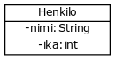


## Describing class constructor

<!-- Määrittellään luokalle seuraavaksi parametrillinen konstruktori. Konstruktori saa parametrinaan nimen. -->
Below we have the source code for a constructor for our Person class. The constructor gets the name of the person as a parameter.

```java
public class Person {
    private String name;
    private int age;

    public Person(String initialName) {
        this.name = initialName;
        this.age = 0;
    }
}
```

<!-- Luokkakaaviossa konstruktori (ja metodit) merkitään oliomuuttujien jälkeen. Oliomuuttujien alapuolelle lisätään viiva, jonka jälkeen tulee konstruktori (ja metodit). Konstruktori saa näkyvyysmääreen public takia eteen plussan, jonka lisäksi siitä merkitään nimi sekä parametrien nimet ja niiden tyypit. Yllä olevan luokan konstruktori merkitään muodossa `+ Henkilo(nimi: String)`. -->
In a class diagram we list the constructor (and all other methods) below the attributes. A line below the attributes list separates it from the method list.
Methods are written +/- (debending on the visibility of the method), method name, parameters and their types. The constructor above is written `+ Person(initialName:String)`

<!-- Parametrit noudattavat siis samaa määrittelymuotoa kuin oliomuuttujat, eli "muuttujanNimi: muuttujanTyyppi". -->
The parameters are written the same way class attributes were, "parameterName: parameterType".


## Describing class methods


<!-- Lisätään luokalle metodi, jonka palautustyyppi on void. -->
Below we have added a method printPerson() which returns void to the Person class.

```java
public class Person {
    private String name;
    private int age;

    public Person(String initialName) {
        this.name = initialName;
        this.age = 0;
    }

    public void printPerson() {
        System.out.println(this.name + ", age " +   this.age + " years");
    }
}
```

<!-- Luokkakaaviossa metodi merkitään konstruktorin kanssa samaan alueeseen -- konstruktorit listataan ennen metodeja. Toisin kuin konstruktorille, metodeille merkitään myös palautustyyppi. -->
In a class diagram we list all class methods with the constructors -- constructors are listed first and then all class methods.
We also write the return type of a method to the class diagram.

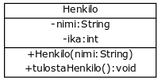


<text-box variant='hint' name='Luokkakaavio kertoo luokat, muuttujat, konstruktorit, ja metodit'>

<!-- Luokkakaaviossa kuvataan luokat, muuttujat, konstruktorit, ja metodit sekä luokkien väliset yhteydet. Luokkakaavio ei kuitenkaan kerro mitään konstruktorien ja metodien sisäisestä toteutuksesta. Luokkakaaviolla kerrotaan siis olioiden rakenteesta, mutta luokkakaaviot eivät itsessään määrittele toiminnallisuutta. -->
A class diagram describes classes and their attributes, constructors and methods as well as the connections between classes. However a class diagram tells us nothing about the implementation of the constructors or the methods. Therefore a class diagram describes the structure of an object but not its functionality.

<!-- Esimerkiksi metodi `tulostaHenkilo` hyödyntää oliomuuttujia `nimi` ja `ika`, mutta luokkakaaviossa tämä ei näy millään tavalla. -->
For example the method `printPerson` uses the class attributes `name` and `age`, but this cannot be seen from the class diagram.

</text-box>


<!-- Lisätään luokalle vielä nimen palauttava metodi `getNimi`. -->
Below we have added method `getName` to the Person class which returns the name of the Person.


```java
public class Person {
    private String name;
    private int age;

    public Person(String initialName) {
        this.name = initialName;
        this.age = 0;
    }

    public void printPerson() {
        System.out.println(this.name + ", age " +   this.age + " years");
    }

    public String getName() {
        return this.name;
    }
}
```

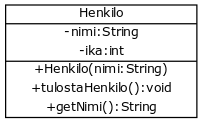


<!-- <programming-exercise name='Asiakas' tmcname='osa11-Osa11_01.Asiakas'> -->

<programming-exercise name='Customer' tmcname='part11-Part11_01.Customer'>

<!-- Alla olevassa luokkakaaviossa on kuvattuna luokka Asiakas. Toteuta luokka tehtäväpohjaan. -->

The class diagram below shows the class Customer. Implement the class in the exercise base.


</programming-exercise>

<programming-exercise name='Book and plane' tmcname='part11-Part11_02.ABookAndAPlane'>

<!-- Alla olevassa luokkakaaviossa on kuvattuna luokat Kirja ja Lentokone. Toteuta luokat tehtäväpohjaan. -->

The class diagram below depicts the classes Book and Plane. Implement the classes in the exercise base.


<!-- 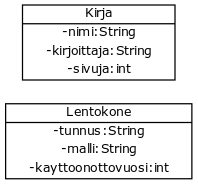 -->

</programming-exercise>


## Connections between classes

<!-- Luokkakaavioissa yhteydet merkitään viivoilla, joissa nuolet kuvaavat yhteyden suuntaa. Oletetaan, että käytössämme luokka Kirja. -->
In a class diagram, the connections between classes are shown as arrows. The arrows also show the direction of the connection.

Below we have a class Book.


```java
public class Book {
    private String name;
    private String publisher;

    // constructors and methods
}
```

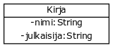


<!-- Jos luokalle kirja merkitään kirjoittaja, joka on tyyppiä Henkilo, ohjelmakoodissa oliomuuttuja merkitään muiden muuttujien seuraksi. -->
If we add a variable author, type of which is Person, in the source code the variable is declared like all other class variables.


```java
public class Book {
    private String name;
    private String publisher;
    private Person author;

    // constructors and methods
}
```

<!-- Luokkakaaviossa toisiin olioihin viittaavia muuttujia ei merkitä attribuutteihin, vaan ne merkitään yhteyksinä. Alla olevassa luokkakaaviossa on merkittynä luokat Henkilo ja Kirja, sekä näiden välinen yhteys. -->
In a class diagram variables which refer to other objects are not written with the rest of the class attributes, but are shown as connections between the classes. In the class diagram below we have the classes Person and Book, and the connection between them.


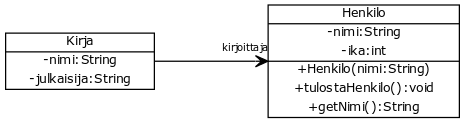[Henkilo]">

<!-- Nuoli kertoo "tietämyssuunnan". Yllä oleva yhteys kertoo, että kirja tietää kirjoittajansa, mutta henkilö ei tiedä mitään kirjoittamistaan kirjoista. Viivaan voi kirjoittaa myös tekstin, joka antaa lisätietoa yhteydestä. Yllä olevassa esimerkissä viivaan on kirjattu tieto siitä, että kirjaan liittyy "kirjoittaja". -->
The arrow shows the direction of the connection. The connection above shows that a Book knows its author but a Person does not know about books they are the author of.
We can also add a label to the arrow to describe the connection. In the above diagram the arrow has an accompanying label telling us that a Book has an author.

<!-- Mikäli kirjalla voi olla useita kirjoittajia, kirjoittajat merkitään luokkaan listana. -->
If a book can have multiple authors, the authors are saved to a list.

```java
public class Book {
    private String name;
    private String publisher;
    private ArrayList<Person> authors;

    // constructors and methods
}
```

<!-- Luokkakaaviossa tilanne merkitään yhteyden päätyyn asetettavalla tähdellä. Tähti kertoo, että kirjalla voi olla nollasta äärettömään kirjoittajaa. Alla olevassa esimerkissä yhteyteen ei ole merkitty yhteyttä kuvaavaa tekstiä "kirjoittajat", mutta se kannattaisi selkeyden takia lisätä kaavioon. -->
In a class diagram this situation is described by adding a star to the end of the arrow showing a connection between classes. The star tells us that a book can have between 0 and unlimited number of authors. Below we have not amended the label to describe the multiplicity of the connection, but it would be a good idea for the sake of clarity.

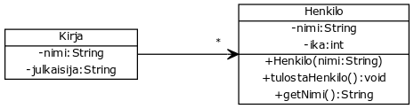[Henkilo]">


<!-- Metodit merkitään luokkakaavioon normaalisti. Alla luokkaan Kirja on lisätty metodit `getKirjoittajat` ja `lisaaKirjoittaja`. -->
Class methods are described just like we did before. Below we have added methods `getAuthors` and `addAuthor` to the Book class.


```java
public class Book {
    private String name;
    private String publisher;
    private ArrayList<Person> authors;

    // constructor

    public ArrayList<Person> getAuthors() {
        return this.authors;
    }

    public void addAuthor(Person author) {
        this.authors.add(author);
    }
}
```

[Henkilo]">


<!-- Ylläolevaan kaavioon voisi lisätä vielä ArrayListin sisältämien arvojen tyypin `ArrayList<Person>` sekä yhteyttä tarkentavan määreen "kirjoittajat". -->
We could add the type of the elements in the ArrayList `ArrayList<Person>` and a label describing the connection "authors" to the class diagram above.


<programming-exercise name='Show and ticket' tmcname='part11-Part11_03.ShowAndTicket'>

<!-- Alla on kuvattu kaksi luokkaa, Naytos ja Lippu, sekä niiden välinen yhteys. Alla olevassa kuvassa tähti on luokan Lippu-päädyssä -- tässä tapauksessa tähti antaa lisätietoa yhteydestä; vaikkei näytös tiedä näytökseen myydyistä lipuista, voi lippuja silti myydä näytökseen monia. -->

In the class diagram below, the classes Show and Ticket, and their connection, are depicted. The star is at the Ticket end of the connection -- in this case the star gives some extra information of the connection; even though a show doesn't know about the tickets that have been sold to it, you can still sell many tickets to one show.

<!-- Toteuta kuvatut luokat tehtäväpohjaan. -->

Implement the classes in the diagram in the exercise base.

<!-- 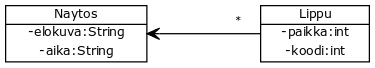 -->


</programming-exercise>


<!-- Mikäli luokkakaavioon ei merkitä nuolta, näkyy yhteys kummassakin oliossa. Alla esimerkki tilanteesta, missä kirja tietää kirjoittajansa ja henkilö tietää kirjoittamansa kirjan. -->
If there is no arrowhead in a connection, both classes know about each other. Below is an example where a book knows about its author and a person knows about a book they have written.


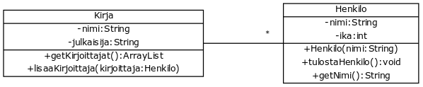


```java
public class Person {
    private String name;
    private int age;
    private Book book;

    // ...
}
```


```java
public class Book {
    private String name;
    private String publisher;
    private ArrayList<Person> authors;

    // ..
}
```

<!-- Kuten yllä huomaat, oletuksena -- eli kun viivan päätyyn ei merkitä tähteä -- kyse on yhdestä viitteestä. Yllä olevat luokat ovat mielenkiintoiset, sillä henkilöllä voi olla vain yksi kirja. -->
As you can see, by default -- if there is no star on the connection -- the connection is singular. The classes above are interesting, because a Person can only have one book.

<!-- Mikäli henkilöllä voi olla monta kirjaa ja kirjalla monta kirjoittajaa, merkitään tähti yhteyden kumpaankin päätyyn seuraavasti: -->
If a person can have multiple books and a book can have multiple authors, we add a star to both ends of the connection:


<!-- Nyt luokka Henkilo olisi muotoa: -->
Now the person class would be as follows:

```java
import java.util.ArrayList;

public class Person {
    private String name;
    private int age;
    private ArrayList<Book> books;

    // ...
}
```


<!-- <programming-exercise name='Opiskelija ja korkeakoulu' tmcname='osa11-Osa11_04.OpiskelijaJaKorkeakoulu'> -->

<programming-exercise name='StudentAndUniversity' tmcname='part11-Part11_04.StudentAndUniversity'>

<!-- Alla on kuvattu kaksi luokkaa, Opiskelija ja Korkeakoulu, sekä niiden välinen yhteys. Toteuta kuvatut luokat tehtäväpohjaan. -->

Two classes, Student and University, are depicted below, as well as the connection between them. Implement these classes in the exercise base.


</programming-exercise>


## Describing inheritance

<!-- Perintä merkitään luokkakaavioon kolmion muotoisella nuolella. Kolmio on perittävän luokan päädyssä. Alla olevassa esimerkissä luokka Moottori perii luokan Osa. -->
In a class diagram inheritance is described by an arrow with a triangle head. The triangle points to the class being inherited from. In the below example the Motor inherits the class Part.


<!-- Alla olevaan esimerkkiin on kirjoitettu auki muistavaa tuotevarastoa käsittelevän tehtävän luokkakaavio. Muistava tuotevarasto perii tuotevaraston, joka taas perii varaston. Muutoshistoria on erillinen luokka, jonka muistava tuotevarasto sisältää. Muistava tuotevarasto tietää muutoshistorian, mutta muutoshistoria ei tiedä muistavasta tuotevarastosta. -->
In the below example the class diagram describes the classes from the Product warehouse exercise. The ProductWarehouseWithHistory class inherits the ProductWarehouse class which in turn inherits the Warehouse class.
ChangeHistory is a separate class connected to the ProductWarehouse. ProductWarehouseWithHistory knows about the ChangeHistory but the ChangeHistory does now know about the ProductWarehouseWithHistory.


<!-- Abstraktien luokkien perintä toimii lähes samalla tavalla. Abstraktit luokat kuitenkin merkitään luokkakaavioon siten, että luokan nimen yläpuolella lukee `<<abstract>>`. Tämän lisäksi luokan nimi ja luokassa määritellyt abstraktit metodit kuvataan kursiivilla. -->
Inheritance of abstract classes is described almost the same way as regular classes. However we add the description `<<abstract>>` above the name of the class. The name of the class and its abstract methods are also written in cursive.


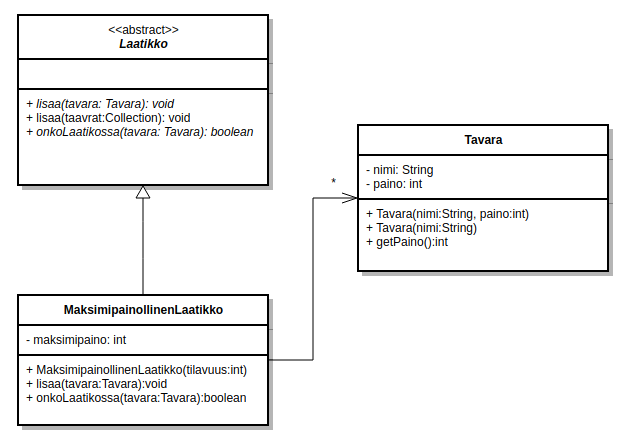


<programming-exercise name='Player and bot' nocoins='true' tmcname='part11-Part11_05.PlayerAndBot'>

<!-- Alla on kuvattu kaksi luokkaa, Pelaaja ja Tekoaly, sekä niiden välinen yhteys. Toteuta kuvatut luokat tehtäväpohjaan. -->

The classes Player and Bot and the connection between them are depicted in the class diagram below. Implement these classes in the exercise base.

<!-- 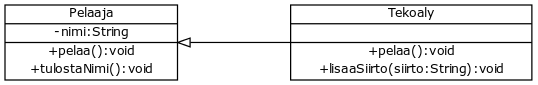 -->


<!-- Tähän tehtävään ei ole erillistä mallivastausta. -->

A model answer is not supplied for this exercise.

</programming-exercise>


## Describing interfaces

<!-- Rajapinnat merkitään luokkakaavioissa muodossa `<<interface>>` RajapintaLuokanNimi. Tarkastellaan esimerkkinä rajapintaa Luettava. -->
In class diagrams interfaces are written `<<interface>>` NameOfTheInterface. Below we describe an interface Readable.


```java
public interface Readable {

}
```

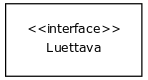

<!-- Metodit voidaan merkitä alle kuten luokkakaavioissa. -->
Methods are described just like they are for a class.

<!-- Rajapinnan toteuttaminen merkitään katkoviivalla ja kolmiolla. Alla on kuvattu tilanne, missä luokka Kirja toteuttaa rajapinnan Luettava. -->
Implementing an interface is shown as a dashed arrow with a triangle arrowhead. Below is described a situation where Book implements interface Readable.

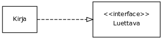> Luettava][Kirja]-.-^[<<interface>> Luettava]">


<programming-exercise name='Saveable person' tmcname='part11-Part11_06.SaveablePerson'>

<!-- Alla on kuvattuna rajapinta Tallennettava sekä luokka Henkilo. Toteuta luokkakaaviossa kuvattu sisältö tehtäväpohjaan. -->

Below you'll see the interface Saveable and the class Person. Implement the contents of this class diagram in the exercise base.

<!-- 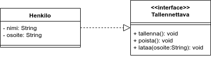> Tallennettava||+tallenna():void;+poista():void;+lataa(osoite:String):void]^-.-[Henkilo|-nimi:String;-osoite:String]"> -->

> Saveable ||+save():void;+delete():void;+load(address:String):void]^-.-[Person|-name:String;-address:String]">

</programming-exercise>


<text-box variant='hint' name='Miten näitä kannattaa piirtää?'>

<!-- Luokkakaaviot ovat erinomainen tapa kuvata ongelma-aluetta ja ongelman muotoa muille. Niiden käyttö on erittäin hyödyllistä myös silloin, kun ohjelmoija suunnittelee useammasta luokasta koostuvan ohjelman rakennetta. -->
Class diagrams are an excellent way to describe a problem and a problem-domain to others. They are particularily useful when a programmer is designing a program with multiple classes.


<!-- Luokkakaavioita piirretään ohjelman suunnitteluvaiheessa usein esimerkiksi valkotaulua tai isompaa paperiarkkia käyttäen. Luokkakaaviot kannattaa ajatella poisheitettävinä tuotoksina, jotka auttavat ohjelman rakennuksessa. Kaavion piirtämiseen -- eli tyylin oikeellisuuteen ja yksityiskohtiin -- ei kannata käyttää liian pitkään aikaa. Vastaavasti kaavio kannattaa piirtää sopivalla abstraktiotasolla. Esimerkiksi kymmeniä luokkia sisältävään luokkakaavioon ei kannata merkitä jokaisen luokan jokaista metodia ja muuttujaa: oleellista on, että kaaviosta saa luotua nopean yleiskuvan. -->
Often a class diagram is drawn on a whiteboard or a big sheet of paper during the design phase. They should be though of as helpful tools to build a program, which can be thrown away afterwards. You should not use too much energy to think about the correctness and details of the modeling language.
Class diagram should also be drawn in a suitable level of abstraction. For example if you have tens of classes, it might not be worth it to describe each attribute and each method of each class: getting a good overview of the program structure is the most important.


<!-- Materiaalissa käytetyt luokkakaaviot on piirretty <a href="https://yuml.me/" target="_blank" norel>yUML</a>:n, <a href="https://creately.com" target="_blank" norel>Creately</a>n, ja <a href="https://www.draw.io/" target="_blank" norel>draw.io</a>:n. Myös NetBeansiin löytyy välineitä luokkakaavioiden luomiseen -- esimerkiksi <a href="http://plugins.netbeans.org/plugin/55435/easyuml" target="_blank" norel>easyUML</a> mahdollistaa luokkakaavioiden luomisen suoraan projektin koodista. -->
The class diagrams in the material have been drawn using <a href="https://yuml.me/" target="_blank" norel>yUML</a>, <a href="https://creately.com" target="_blank" norel>Creately</a>, and <a href="https://www.draw.io/" target="_blank" norel>draw.io</a>.
NetBeans also has tools for drawing class diagrams -- for example the <a href="http://plugins.netbeans.org/plugin/55435/easyuml" target="_blank" norel>easyUML</a> draws class diagrams from the source code.

</text-box>


<!-- <programming-exercise name='Isompi luokkakaavio' tmcname='osa11-Osa11_07.IsompiLuokkakaavio'> -->
<programming-exercise name='Bigger class diagram' tmcname='part11-Part11_07.BiggerClassDiagram'>

<!-- Alla on kuvattuna isompi luokkakaavio, jossa on luokat A, B, C, D ja E, sekä rajapinnat IA, IB ja IC. Toteuta luokkakaavion kuvaama sisältö tehtäväpohjaan. -->

Below you'll see a somewhat larger class diagram. In it are the classes A, B, C, D, and E, as well as the interfaces IA, IB, and IC. Implement these contents in the exercise base.

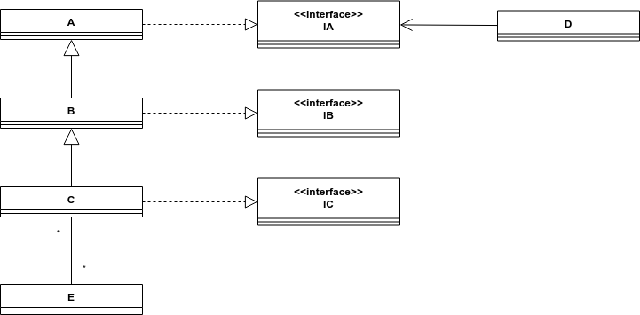>;IA][<<interface>>;IB][<<interface>>;IC][A]-.-^[<<interface>>;IA][B]-.-^[<<interface>>;IB][C]-.-^[<<interface>>;IC][D]->[<<interface>>;IA][E]*-*[C][C]-^[B][B]-^[A]">

</programming-exercise>


<quiz id="cc7eee4a-8e17-58bc-9f57-0f61fdfb6d9f"></quiz>
