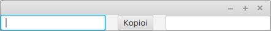
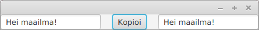
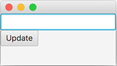
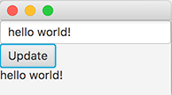
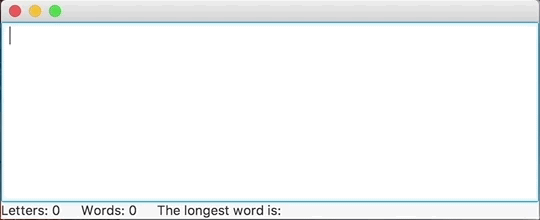

<!-- <text-box variant='learningObjectives' name='Oppimistavoitteet'> -->
<text-box variant='learningObjectives' name='Learning Objectives'>

<!-- - Tunnet käsitteen tapahtumankäsittelijä ja osaat käsitellä käyttöliittymän tapahtumia. -->
- You're familiar with the concept of an event handler and are able to handle user interface events.

</text-box>


<!-- Edellä toteuttamamme käyttöliittymät eivät reagoi käyttöliittymässä tehtyihin tapahtumiin. Reagoimattomuus ei johdu käyttöliittymäkomponenteista, vaan siitä että emme ole lisänneet käyttöliittymäkomponentteihin tapahtumien käsittelyyn tarvittavaa toiminnallisuutta. -->

The user interfaces we've previously implemented have not been able to react to events in the user interface. This inability to react is not due to the components of the interface themselves, but due to the fact that we've yet to added any functionality that handles component events.

<!-- Nappien painaminen käsitellään [EventHandler](https://docs.oracle.com/javase/8/javafx/api/javafx/event/EventHandler.html)-rajapinnan toteuttavalla luokalla. Tapahtuman tyyppi on tällöin [ActionEvent](https://docs.oracle.com/javase/8/javafx/api/javafx/event/ActionEvent.html). Rajapinnan toteutukseen määritellään *mitä tehdään* silloin, kun käyttäjä painaa nappia. -->

Button presses are handled using a class that implements the [EventHandler](https://docs.oracle.com/javase/8/javafx/api/javafx/event/EventHandler.html) interface. The type of the event in these cases is  [ActionEvent](https://docs.oracle.com/javase/8/javafx/api/javafx/event/ActionEvent.html). The interface implementation specifies *what is done* when a user presses a button.

<!-- ```java
Button nappi = new Button("Tämä on nappi");
nappi.setOnAction(new EventHandler<ActionEvent>() {
    @Override
    public void handle(ActionEvent event) {
        System.out.println("Painettu!");
    }
});
``` -->

```java
Button button = new Button("This is a button");
button.setOnAction(new EventHandler<ActionEvent>() {
    @Override
    public void handle(ActionEvent event) {
        System.out.println("Pressed!");
    }
});
```

<!-- Rajapinnan eksplisiittisen toteutuksen voi korvata halutessaan Lambda-lausekkeella. -->
If desired, the explicit implementation of the interface can be replaced by a Lambda expression.


<!-- ```java
Button nappi = new Button("Tämä on nappi");
nappi.setOnAction((event) -> {
    System.out.println("Painettu!");
});
``` -->

```java
Button button = new Button("This is a button");
button.setOnAction((event) -> {
    System.out.println("Pressed!");
});
```

<!-- Kun edellä olevaa nappi painetaan, konsoliin tulostetaan teksti "Painettu!". -->
When the button is pressed, the program prints the text "Pressed!" to the console.


<!-- Käyttöliittymäkomponentteihin liitetyt **tapahtumankäsittelijät** kuten edellä käytetty EventHandler liittyvät aina tiettyihin käyttöliittymäkomponentteihin. Aina kun käyttöliittymäkomponentille tehdään toiminto, esimerkiksi napille napin painaminen, jokaista kyseiseen käyttöliittymäkomponenttiin liitettyä tapahtumankäsittelijää kutsutaan, ja niihin liittyvä ohjelmakoodi suoritetaan. -->

**Event handlers** attached to user interface components, such as the EventHandler used previously, are always connected to specific user interface components. Whenever an action is performed on a user interface component, e.g., a button is pressed, each of the event handlers attached to that particular component is called and the functionality written for them is executed.

<!-- Haluamme usein että tapahtumankäsittelijä muokkaa jonkin olion tilaa. Päästäksemme olioon käsiksi, tulee tapahtumankäsittelijällä olla viite käsiteltävään olioon. Pohditaan seuraavaa käyttöliittymää jossa on kaksi tekstikenttää sekä nappi. -->

We often want an event handler to change the state of some object. To get hold of an object, the event handler needs a reference to it. Let's think about the following user interface which has two text fields and a button.

<!-- ```java
@Override
public void start(Stage ikkuna) {
    TextField vasenTeksti = new TextField();
    TextField oikeaTeksti = new TextField();
    Button nappi = new Button("Kopioi");

    HBox komponenttiryhma = new HBox();
    komponenttiryhma.setSpacing(20);
    komponenttiryhma.getChildren().addAll(vasenTeksti, nappi, oikeaTeksti);

    Scene nakyma = new Scene(komponenttiryhma);

    ikkuna.setScene(nakyma);
    ikkuna.show();
}
``` -->

```java
@Override
public void start(Stage window) {
    TextField leftText = new TextField();
    TextField rightText = new TextField();
    Button button = new Button("Copy");

    HBox componentGroup = new HBox();
    componentGroup.setSpacing(20);
    componentGroup.getChildren().addAll(leftText, button, rightText);

    Scene viewport = new Scene(componentGroup);

    window.setScene(viewport);
    window.show();
}
```

<!-- Käyttöliittymän vasemmassa ja oikeassa laidassa on tekstikenttä. Tekstikenttien lisäksi käyttöliittymän keskellä on nappi, jossa on teksti "Kopioi". -->
There is a text field on both the left and right hand sides of the user interface. In addition to these, there's a button in the middle with the text "Copy".

<!--  -->


<!-- Haluamme ohjelman, jossa vasemman tekstikentän sisältö kopioituu oikean kentän sisällöksi kun käyttäjä painaa nappia. Tämä onnistuu EventHandler-rajapinnan toteuttavan olion avulla. -->

We'd like to have an application where the content of the left text field is copied over to become the content of the right text field when the user presses the button. This can be done with the help of an object implementing the EventHandler interface.

<!-- ```java
@Override
public void start(Stage ikkuna) {
    TextField vasenTeksti = new TextField();
    TextField oikeaTeksti = new TextField();
    Button nappi = new Button("Kopioi");

    nappi.setOnAction((event) -> {
        oikeaTeksti.setText(vasenTeksti.getText());
    });

    HBox komponenttiryhma = new HBox();
    komponenttiryhma.setSpacing(20);
    komponenttiryhma.getChildren().addAll(vasenTeksti, nappi, oikeaTeksti);

    Scene nakyma = new Scene(komponenttiryhma);

    ikkuna.setScene(nakyma);
    ikkuna.show();
}
``` -->

```java
@Override
public void start(Stage window) {
    TextField leftText = new TextField();
    TextField rightText = new TextField();
    Button button = new Button("Copy");

    button.setOnAction((event) -> {
        rightText.setText(leftText.getText());
    });

    HBox componentGroup = new HBox();
    componentGroup.setSpacing(20);
    componentGroup.getChildren().addAll(leftText, button, rightText);

    Scene scene = new Scene(componentGroup);

    window.setScene(scene);
    window.show();
}
```


<!-- Nyt nappia painettaessa vasemman tekstikentän sisältö kopioituu oikealla olevaan tekstikenttään. -->

Now pressing the button results in the content of the left text field being copied to the text field on the right.

<!--  -->


<!-- Huom! Toteutettava metodi pystyy käyttämään metodin edellä määriteltyjä olioita, mikäli käytettävien olioiden arvoa ei aseteta ohjelmassa uudestaan yhtäsuuruusmerkillä (eli viitteet eivät muutu). -->

NB! The method implemented can use objects that were declared before the method definition, as long as the values of the objects being used are not reassigned using the equals operator, i.e., the references do not change.

<!-- <programming-exercise name='Ilmoitin' tmcname='osa13-Osa13_06.Ilmoitin'> -->
<programming-exercise name='Notifier' tmcname='part13-Part13_06.Notifier'>


<!-- Toteuta tehtäväpohjassa olevaan luokkaan käyttöliittymä, jossa on kolme käyttöliittymäkomponenttia. Ylin komponentti on tekstikenttä (TextField), keskimmäinen komponentti nappi (Button), ja alin komponentti tekstikomponentti (Label). Asettele komponentit VBox-luokan avulla. Käyttöliittymän tulee näyttää (esimerkiksi) seuraavalta. -->

Create a user interface in the class included in the exercise template. It should contain three user interface components. The topmost is a text field (TextField), the middle one is a button (Button), and component on the bottom is a text component (Label). Lay out the components using the VBox class. The user interface should look kind of like the following.




<!-- Lisää tämän jälkeen sovellukseen toiminnallisuus, jossa napin painaminen johtaa siihen, että tekstikentän teksti kopioituu tekstikomponentin arvoksi. Alla olevassa esimerkissä tekstikenttään on kirjoitettu teksti "hei mualima!", jonka jälkeen nappia on painettu. -->

Then add functionality to the application, where pressing the button leads to the text in the text field being copied as the value of the text component. In the example below we have written the message "hello world!" into the text field, after which we have pressed the button.




</programming-exercise>


<!-- Käytettävä tapahtumankäsittelijä riippuu käyttöliittymäkomponentista, johon tapahtumankäsittelijä kytketään. Jos haluaisimme seurata tekstikenttään tapahtuvia muutoksia merkki merkiltä, käyttäisimme rajapintaa [ChangeListener](https://docs.oracle.com/javafx/2/api/javafx/beans/value/ChangeListener.html).  Alla olevassa esimerkissä vasempaan tekstikenttään on kytketty rajapinnan ChangeListener toteuttava olio, joka sekä tulostaa muutokset tekstikonsoliin että asettaa aina uuden arvon oikealla olevaan tekstikenttään. -->

The eventhandler being used depends on what kind of user interface component we attach it to. If we want to listen to changes made to a text field character by character, then we would use the interface [ChangeListener](https://docs.oracle.com/javafx/2/api/javafx/beans/value/ChangeListener.html). In the example below we have attached an object implementing the ChangeListener interface to text field on the left. This object prints the changes in the text field to the console as well as sets the new value into the text field on the right.

<!-- ```java
vasenTeksti.textProperty().addListener(new ChangeListener<String>() {
    @Override
    public void changed(ObservableValue<? extends String> muutos,
            String vanhaArvo, String uusiArvo) {

        System.out.println(vanhaArvo + " -> " + uusiArvo);
        oikeaTeksti.setText(uusiArvo);
    }
});
``` -->

```java
leftText.textProperty().addListener(new ChangeListener<String>() {
    @Override
    public void changed(ObservableValue<? extends String> change,
            String oldValue, String newValue) {

        System.out.println(oldValue + " -> " + newValue);
        oikeaTeksti.setText(newValue);
    }
});
```


<!-- Edellä muutoksia havainnoidaan tekstikenttään liittyvästä tekstistä. Koska teksti on merkkijonomuotoista, on muutoksia käsittelevälle rajapinnalle annettu tyypiksi merkkijono. Kuten edellä, myös tässäkin esimerkissä ohjelmakoodi voidaan esittää lyhyemmässä muodossa. -->

In the previous example the changes being observed are in the text of the text field. Beacause text is in string format we have provided string as the type for the handler interface. As before, we can also express this code in a more compact form.


<!-- ```java
vasenTeksti.textProperty().addListener((muutos, vanhaArvo, uusiArvo) -> {
    System.out.println(vanhaArvo + " -> " + uusiArvo);
    rightText.setText(uusiArvo);
});
``` -->

```java
leftText.textProperty().addListener((change, oldValue, newValue) -> {
    System.out.println(oldValue + " -> " + newValue);
    rightText.setText(newValue);
});
```


<!-- Ohjelma voi tehdä myös tilastointia. Edellisessä tehtävässä luotujen tekstikenttien arvot saa laskettua melko suoraviivaisesti. Alla olevaa esimerkkiä noudattaen arvot päivittyisivät aina kun käyttäjä muuttaa tekstikentän sisältöä. -->

The program can also do statistics. Calculating the values for the text fields in the previous exercise is quite straightforward. Following the example below, the values would be updated every time the user changes the content of the text field.

<!-- ```java
vasenTeksti.textProperty().addListener((muutos, vanhaArvo, uusiArvo) -> {
    int merkkeja = uusiArvo.length();
    String[] palat = uusiArvo.split(" ");
    int sanoja = palat.length;
    String pisin = Arrays.stream(palat)
        .sorted((s1, s2) -> s2.length() - s1.length())
        .findFirst()
        .get();

    // asetetaan arvot tekstielementteihin
});
``` -->

```java
leftText.textProperty().addListener((change, oldValue, newValue) -> {
    int characters = newValue.length();
    String[] parts = newValue.split(" ");
    int words = parts.length;
    String longest = Arrays.stream(parts)
        .sorted((s1, s2) -> s2.length() - s1.length())
        .findFirst()
        .get();

    // set values of text elements
});
```


<!-- <programming-exercise name='Tekstitilastointia, osa II' tmcname='osa13-Osa13_07.TekstitilastointiaOsa2'> -->
<programming-exercise name='Text statistics, part II' tmcname='part13-Part13_07.TextStatisticsPart2'>


<!-- Kopioi tehtävässä Tekstitilastointia tekemäsi toteutus tehtäväpohjassa olevaan luokkaan ja liitä mukaan yllä olevassa esimerkissä oleva toiminnallisuus tilastojen laskemiseen. Lopputuloksena ohjelman pitäisi laskea kirjoitetusta tekstistä tilastoja, jotka päivittyvät automaattisesti sovellukseen. -->

Copy the work you did in the Text statistics exercise into the class included in the exercise template and add to it the functionality from the example above for calculating the statistics. The end result should an application that calculates statistics based on text that is input, which are updated automatically and displayed in the application.


<!--  -->


</programming-exercise>
