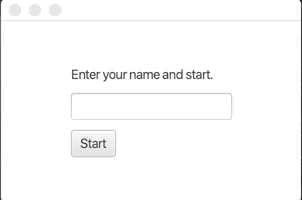
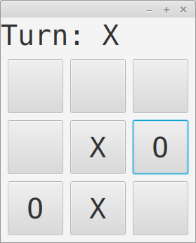

<!-- <text-box variant='learningObjectives' name='Oppimistavoitteet'> -->

<text-box variant='learningObjectives' name='Learning Objectives'>

<!--
- Harjoittelet useamman näkymän lisäämistä graafiseen käyttöliittymään.
- Tunnet näkymän vaihtamiseen käytettäviä menetelmiä.
- Tunnet menetelmiä sovelluslogiikan ja käyttöliittymälogiikan eriyttämiseen.
-->

<!-- Google Translate: -->
- Practice adding multiple views to the graphical user interface.
- You know the methods used to change the view.
- You know methods to differentiate between application logic and user interface logic.

</text-box>

<!-- Tähän mennessä toteuttamamme graafiset käyttöliittymät ovat sisältäneet aina yhden näkymän. Tutustutaan seuraavaksi useampia näkymiä sisältäviin käyttöliittymiin. -->

<!-- Google Translate: -->
The graphical user interfaces we have implemented so far have always included a single view. Next, let's take a look at user interfaces with multiple views.

<!-- Yleisesti ottaen näkymät luodaan Scene-olion avulla, joiden välillä siirtyminen tapahtuu sovellukseen kytkettyjen tapahtumien avulla. Alla olevassa esimerkissä on luotu kaksi erillistä Scene-oliota, joista kummallakin on oma sisältö sekä sisältöön liittyvä tapahtuma. Alla Scene-olioihin ei ole erikseen liitetty käyttöliittymän asetteluun käytettyä komponenttia (esim. BorderPane), vaan kummassakin Scene-oliossa on täsmälleen yksi käyttöliittymäkomponentti. -->

<!-- Google Translate: -->
In general, views are created using a Scene object, which is switched between events connected to the application. In the example below, two separate Scene objects have been created, each with its own content and a content-related event. Below, the Scene objects do not have a separately associated component used for the UI layout (e.g., BorderPane), but each Scene object has exactly one UI component.

<!-- ```java
package sovellus;

import javafx.application.Application;
import javafx.scene.Scene;
import javafx.scene.control.Button;
import javafx.stage.Stage;

public class EdesTakaisinSovellus extends Application {

  @Override
  public void start(Stage ikkuna) {

      Button edes = new Button("Edes ..");
      Button takaisin = new Button(".. takaisin.");

      Scene eka = new Scene(edes);
      Scene toka = new Scene(takaisin);

      edes.setOnAction((event) -> {
          ikkuna.setScene(toka);
      });

      takaisin.setOnAction((event) -> {
          ikkuna.setScene(eka);
      });

      ikkuna.setScene(eka);
      ikkuna.show();
  }

  public static void main(String[] args) {
      launch(EdesTakaisinSovellus.class);
  }
}
``` -->

<!-- Google Translate: -->
```java
package application;

import javafx.application.Application;
import javafx.scene.Scene;
import javafx.scene.control.Button;
import javafx.stage.Stage;

public class BackAndForthApplication extends Application {

  @Override
  public void start(Stage stage) {

      Button fort = new Button("Fort ..");
      Button back = new Button(".. back.");

      Scene first = new Scene(fort);
      Scene second = new Scene(back);

      fort.setOnAction((event) -> {
          stage.setScene(second);
      });

      back.setOnAction((event) -> {
          stage.setScene(first);
      });

      stage.setScene(first);
      stage.show();
  }

  public static void main(String[] args) {
      launch(BackAndForthApplication.class);
  }
}
```

<!-- Edellä olevan sovelluksen käynnistäminen luo käyttöliittymän, jossa siirtyminen näkymästä toiseen onnistuu nappia painamalla. -->

<!-- Google Translate: -->
Launching the above application creates an interface where you can switch from one view to another by pressing a button.

<!-- <programming-exercise name='Useampi Näkymä' tmcname='osa13-Osa13_09.UseampiNakyma'> -->

<programming-exercise name='Multiple views' tmcname='part13-Part13_09.MultipleViews'>

<!-- Luo tehtäväpohjassa olevaan luokkaan UseampiNakyma sovellus, joka sisältää kolme erillistä näkymää. Näkymät ovat seuraavat: -->

There is a class called MultipleViews in the exercise template. Create in it an application that contains three separate views. The views are as follows:

<!--
- Ensimmäinen näkymä on aseteltu BorderPane-luokan avulla. Ylälaidassa on teksti "Eka näkymä!". Keskellä on nappi, jossa on teksti "Tokaan näkymään!", ja jota painamalla siirrytään toiseen näkymään.
- Toinen näkymä on aseteltu VBox-luokan avulla. Asettelussa tulee ensin nappi, jossa on teksti "Kolmanteen näkymään!", ja jota painamalla siirrytään kolmanteen näkymään. Nappia seuraa teksti "Toka näkymä!".
- Kolmas näkymä on aseteltu GridPane-luokan avulla. Asettelussa tulee koordinaatteihin (0,0) teksti "Kolmas näkymä!". Koordinaatteihin (1,1) tulee nappi, jossa on teksti "Ekaan näkymään!", ja jota painamalla siirrytään ensimmäiseen näkymään.
-->

- The layout of the first view is done with the help of the BorderPane class. At the top there is the text "First view!". The center of the view contains a button with the text "To the second view!". By pressing that button the application swithces to the second view.
- The layout of the second view is done with the help of the VBox class. The first element in the layout is a button with the text "To the third view!" in it -- by pressing the button the application switches to the third view. The button is followed by the text "Second view!".
- The third view uses the GridPane class for its layout. At the coordinates (0, 0) there is a text that reads "Third view!". At coordinates (1, 1) there is a button with the text "To the first view!". Pressing this button brings back the first view.

<!-- Sovelluksen tulee käynnistyessään näyttää ensimmäinen näkymä. -->

When first started, the program should display the first view.

</programming-exercise>

<!-- ## Oma asettelu jokaista näkymää varten -->

<!-- Google Translate: -->
## Custom layout for each view

<!-- Tutustutaan seuraavaksi kaksi erillistä näkymää sisältävään esimerkkiin. Ensimmäisessä näkymässä käyttäjää pyydetään syöttämään salasana. Jos käyttäjä kirjoittaa väärän salasanan, väärästä salasanasta ilmoitetaan. Jos käyttäjä kirjoittaa oikean salasanan, ohjelma vaihtaa seuraavaan näkymään. Ohjelman toiminta on seuraavanlainen. -->

<!-- Google Translate: -->
Next, let's look at an example with two separate views. In the first view, the user is prompted to enter a password. If the user enters an incorrect password, the incorrect password will be reported. If the user enters the correct password, the program switches to the next view. The operation of the program is as follows.


<!-- Näkymien välillä vaihtaminen tapahtuu kuten edellisessä esimerkissä. Konkreettinen vaihtotapahtuma on määritelty kirjautumisnappiin. Nappia painettaessa ohjelma tarkastaa salasanakenttään kirjoitetun salasanan -- tässä toivotaan, että käyttäjä kirjoittaa "salasana". Jos salasana on oikein, ikkunan näyttämä näkymä vaihdetaan. Esimerkissämme näkymä sisältää vain tekstin "Tervetuloa, tästä se alkaa!". -->

<!-- Google Translate: -->
Switching between views is as in the previous example. A specific exchange event is defined on the login button. When the button is pressed, the program checks the password entered in the password field - here it is desired that the user enters a "password". If the password is correct, the view displayed in the window will change. In our example, the view only contains the text "Welcome, this is where it starts!".

<!-- ```java
package sovellus;

import javafx.application.Application;
import javafx.geometry.Insets;
import javafx.geometry.Pos;
import javafx.scene.Scene;
import javafx.scene.control.Button;
import javafx.scene.control.Label;
import javafx.scene.control.PasswordField;
import javafx.scene.layout.GridPane;
import javafx.scene.layout.StackPane;
import javafx.stage.Stage;

public class SalattuSovellus extends Application {

  @Override
  public void start(Stage ikkuna) throws Exception {

      // 1. Luodaan salasanan kysymiseen käytetty näkymä

      // 1.1 luodaan käytettävät komponentit
      Label ohjeteksti = new Label("Kirjoita salasana ja paina kirjaudu");
      PasswordField salasanakentta = new PasswordField();
      Button aloitusnappi = new Button("Kirjaudu");
      Label virheteksti = new Label("");

      // 1.2 luodaan asettelu ja lisätään komponentit siihen
      GridPane asettelu = new GridPane();

      asettelu.add(ohjeteksti, 0, 0);
      asettelu.add(salasanakentta, 0, 1);
      asettelu.add(aloitusnappi, 0, 2);
      asettelu.add(virheteksti, 0, 3);

      // 1.3 tyylitellään asettelua
      asettelu.setPrefSize(300, 180);
      asettelu.setAlignment(Pos.CENTER);
      asettelu.setVgap(10);
      asettelu.setHgap(10);
      asettelu.setPadding(new Insets(20, 20, 20, 20));

      // 1.4 luodaan itse näkymä ja asetetaan asettelu siihen
      Scene salasanaNakyma = new Scene(asettelu);


      // 2. Luodaan tervetuloa-tekstin näyttämiseen käytetty näkymä
      Label tervetuloaTeksti = new Label("Tervetuloa, tästä se alkaa!");

      StackPane tervetuloaAsettelu = new StackPane();
      tervetuloaAsettelu.setPrefSize(300, 180);
      tervetuloaAsettelu.getChildren().add(tervetuloaTeksti);
      tervetuloaAsettelu.setAlignment(Pos.CENTER);

      Scene tervetuloaNakyma = new Scene(tervetuloaAsettelu);


      // 3. Lisätään salasanaruudun nappiin tapahtumankäsittelijä
      //    näkymää vaihdetaan jos salasana on oikein
      aloitusnappi.setOnAction((event) -> {
          if (!salasanakentta.getText().trim().equals("salasana")) {
              virheteksti.setText("Tuntematon salasana!");
              return;
          }

          ikkuna.setScene(tervetuloaNakyma);
      });

      ikkuna.setScene(salasanaNakyma);
      ikkuna.show();
  }

  public static void main(String[] args) {
      launch(SalattuSovellus.class);
  }
}
``` -->

<!-- Google Translate: -->
```java
package application;

import javafx.application.Application;
import javafx.geometry.Insets;
import javafx.geometry.Pos;
import javafx.scene.Scene;
import javafx.scene.control.Button;
import javafx.scene.control.Label;
import javafx.scene.control.PasswordField;
import javafx.scene.layout.GridPane;
import javafx.scene.layout.StackPane;
import javafx.stage.Stage;

public class EncryptedApplication extends Application {

  @Override
  public void start(Stage window) throws Exception {

      // 1. Create the view used to ask for the password

      // 1.1 create the components to be used
      Label helpText = new Label("Enter password and press login");
      PasswordField passwordField = new PasswordField();
      Button startButton = new Button("Login");
      Label errorText = new Label("");

      // 1.2 create a layout and add components to it
      GridPane layout = new GridPane();

      layout.add(helpText, 0, 0);
      layout.add(passwordField, 0, 1);
      layout.add(startButton, 0, 2);
      layout.add(errorText, 0, 3);

      // 1.3 stylize the layout
      layout.setPrefSize(300, 180);
      layout.setAlignment(Pos.CENTER);
      layout.setVgap(10);
      layout.setHgap(10);
      layout.setPadding(new Insets(20, 20, 20, 20));

      // 1.4 create the view itself and set the layout on it
      Scene passwordView = new Scene(layout);

      // 2. Create the view used to display the welcome text
      Label welcomeText = new Label("Welcome, this is where it starts!");

      StackPane welcomeLayout = new StackPane();
      welcomeLayout.setPrefSize(300, 180);
      welcomeLayout.getChildren().add(welcomeText);
      welcomeLayout.setAlignment(Pos.CENTER);

      Scene welcomeView = new Scene(welcomeLayout);

      // 3. Add an event handler to the password box button
      //    the view is changed if the password is correct
      startButton.setOnAction((event) -> {
          if (!passwordField.getText().trim().equals("password")) {
              errorText.setText("Unknown password!");
              return;
          }

          window.setScene(welcomeView);
      });

      window.setScene(passwordView);
      window.show();
  }

  public static void main(String[] args) {
      launch(EncryptedApplication.class);
  }
}
```

<!-- Esimerkissä on hyödynnetty sekä GridPanen että StackPanen asettelussa niiden tarjoamia setPrefSize ja setAlignment-metodeja. Metodilla setPrefSize annetaan asettelulle toivottu koko, ja metodilla setAlignment kerrotaan miten asettelun sisältö tulee ryhmittää. Parametrilla Pos.CENTER toivotaan asettelua näkymän keskelle. -->

<!-- Google Translate: -->
The example utilizes the setPrefSize and setAlignment methods they provide in both the GridPane and StackPane layouts. The setPrefSize method gives the layout the desired size, and the setAlignment method tells you how to group the contents of the layout. The Pos.CENTER parameter is used to place the layout in the middle of the view.

<!-- <programming-exercise name='Tervehtijä' tmcname='osa13-Osa13_10.Tervehtija'> -->

<programming-exercise name='Greeter' tmcname='part13-Part13_10.Greeter'>

<!-- Luo tehtäväpohjassa olevaan luokkaan TervehtijaSovellus sovellus, jossa on kaksi näkymää. Ensimmäisessä näkymässä on tekstikenttä, jolla kysytään käyttäjän nimeä. Toisessa näkymässä käyttäjälle näytetään tervehdysteksti. Tervehdystekstin tulee olla muotoa "Tervetuloa nimi!", missä nimen paikalle tulee käyttäjän kirjoittama nimi. -->

In the exercise templare there is a class called GreeterApplication. Create in it an application with two views. The first view should have a text field that's used to ask for the user's name. The second view then shows the user a greeting text. The greeting should be of the form "Welcome name!" where the user's name is inserted in place of 'name'.

<!-- Esimerkki sovelluksen toiminnasta: -->

An example of how the program should work:

<!--  -->

!' appears"/>

</programming-exercise>

<!-- ## Sama pääasettelu näkymillä -->

<!-- Google Translate: -->
## Same main layout with views

<!-- Riippuen sovelluksen käyttötarpeesta, joskus sovellukselle halutaan pysyvä näkymä, jonka osia vaihdetaan tarvittaessa. Jonkinlaisen valikon tarjoavat ohjelmat toimivat tyypillisesti tällä tavalla. -->

<!-- Google Translate: -->
Depending on the need to use the application, sometimes a permanent view is desired for the application, parts of which are replaced as needed. Programs that provide some sort of menu typically work this way.

<!-- Alla olevassa esimerkissä on luotu sovellus, joka sisältää päävalikon sekä vaihtuvasisältöisen alueen. Vaihtuvasisältöisen alueen sisältö vaihtuu päävalikon nappeja painamalla. -->

<!-- Google Translate: -->
In the example below, an application has been created that includes a main menu as well as a variable content area. The contents of the variable content area change by pressing the buttons in the main menu.

<!-- ```java
package sovellus;

import javafx.application.Application;
import javafx.geometry.Insets;
import javafx.geometry.Pos;
import javafx.scene.Scene;
import javafx.scene.control.Button;
import javafx.scene.control.Label;
import javafx.scene.layout.BorderPane;
import javafx.scene.layout.HBox;
import javafx.scene.layout.StackPane;
import javafx.stage.Stage;

public class EsimerkkiSovellus extends Application {

    @Override
    public void start(Stage ikkuna) throws Exception {

        // 1. Luodaan päätason asettelu
        BorderPane asettelu = new BorderPane();

        // 1.1. Luodaan päätason asettelun valikko
        HBox valikko = new HBox();
        valikko.setPadding(new Insets(20, 20, 20, 20));
        valikko.setSpacing(10);

        // 1.2. Luodaan valikon napit
        Button eka = new Button("Eka");
        Button toka = new Button("Toka");

        // 1.3. Lisätään napit valikkoon
        valikko.getChildren().addAll(eka, toka);

        asettelu.setTop(valikko);


        // 2. Luodaan alinäkymät ja kytketään ne valikon nappeihin
        // 2.1. Luodaan alinäkymät -- tässä asettelut
        StackPane ekaAsettelu = luoNakyma("Eka näkymä!");
        StackPane tokaAsettelu = luoNakyma("Toka näkymä!");

        // 2.2. Liitetään alinäkymät nappeihin. Napin painaminen vaihtaa alinäkymää.
        eka.setOnAction((event) -> asettelu.setCenter(ekaAsettelu));
        toka.setOnAction((event) -> asettelu.setCenter(tokaAsettelu));

        // 2.3. Näytetään aluksi ekaAsettelu
        asettelu.setCenter(ekaAsettelu);

        // 3. Luodaan päänäkymä ja asetetaan päätason asettelu siihen
        Scene nakyma = new Scene(asettelu);


        // 4. Näytetään sovellus
        ikkuna.setScene(nakyma);
        ikkuna.show();
    }

    private StackPane luoNakyma(String teksti) {

        StackPane asettelu = new StackPane();
        asettelu.setPrefSize(300, 180);
        asettelu.getChildren().add(new Label(teksti));
        asettelu.setAlignment(Pos.CENTER);

        return asettelu;
    }

    public static void main(String[] args) {
        launch(EsimerkkiSovellus.class);
    }
}
``` -->

<!-- Google Translate: -->
```java
package application;

import javafx.application.Application;
import javafx.geometry.Insets;
import javafx.geometry.Pos;
import javafx.scene.Scene;
import javafx.scene.control.Button;
import javafx.scene.control.Label;
import javafx.scene.layout.BorderPane;
import javafx.scene.layout.HBox;
import javafx.scene.layout.StackPane;
import javafx.stage.Stage;

public class ExampleApplication extends Application {

    @Override
    public void start(Stage stage) throws Exception {

        // 1. Creating a main level layout
        BorderPane layout = new BorderPane();

        // 1.1. Creating a main layout menu
        HBox menu = new HBox();
        menu.setPadding(new Insets(20, 20, 20, 20));
        menu.setSpacing(10);

        // 1.2. Creating menu buttons
        Button first = new Button("First");
        Button second = new Button("Second");

        // 1.3. Add buttons to the menu
        menu.getChildren().addAll(first, second);

        layout.setTop(menu);

        // 2. Create subviews and connect them to menu buttons
        // 2.1. Creating subviews - here are the layouts
        StackPane firstLayout = createView("First View!");
        StackPane secondLayout = createView("Second View!");

        // 2.2. Attach subviews to buttons. Pressing the button changes the subview.
        first.setOnAction((event) -> layout.setCenter(firstLayout));
        second.setOnAction((event) -> layout.setCenter(secondLayout));

        // 2.3. The first layout is displayed first
        layout.setCenter(firstLayout);


        // 3. Creates the main view and sets the main level layout to it
        Scene view = new Scene(layout);


        // 4. The application is displayed
        stage.setScene(view);
        stage.show();
    }

    private StackPane createView(String text) {

        StackPane layout = new StackPane();
        layout.setPrefSize(300, 180);
        layout.getChildren().add(new Label(text));
        layout.setAlignment(Pos.CENTER);

        return layout;
    }

    public static void main(String[] args) {
        launch(ExampleApplication.class);
    }
}
```

<!-- Sovellus toimii seuraavalla tavalla: -->

<!-- Google Translate: -->
The application works as follows:

<!--  -->

<!-- Google Translate: -->


<!-- <programming-exercise name='Vitsi' tmcname='osa13-Osa13_11.Vitsi'> -->

<programming-exercise name='Joke' tmcname='part13-Part13_11.Joke'>

<!-- Luo tehtäväpohjassa olevaan luokkaan VitsiSovellus sovellus, jota käytetään yhden vitsin selittämiseen. Sovellus tarjoaa kolme nappia sisältävän valikon sekä näitä nappeja painamalla näytettävät sisällöt. Ensimmäinen nappi (teksti "Vitsi") näyttää vitsiin liittyvän kysymyksen, toinen nappi (teksti "Vastaus") näyttää vitsin kysymykseen liittyvän vastauksen, ja kolmas nappi (teksti "Selitys") näyttää vitsin selityksen. -->

Use the class JokeApplication that is provided with the exercise template to create a program that explains a joke. The application offers a menu consisting of three buttons, and the contents that can be changed by clicking on these buttons. The first button (containing the text "Joke") shows a question that is related to a joke. The second button (text "Answer") show the related answer. The third and the final button ("Explanation") brings up the explanation for the joke.

<!-- Oletuksena (kun sovellus käynnistyy) sovelluksen tulee näyttää vitsiin liittyvä kysymys. Käytä kysymyksenä merkkijonoa "What do you call a bear with no teeth?" ja vastauksena merkkijonoa "A gummy bear.". Saat päättää selityksen vapaasti. -->

By default (when it starts) the program should show a joke-related question. Use the following string as the question: "What do you call a bear with no teeth?". The answer should be "A gummy bear." You can come up with a suitable explanation by yourself.

</programming-exercise>

<!-- ## Sovelluslogiikan ja käyttöliittymälogiikan eriyttäminen -->

<!-- Google Translate: -->
## Distinguishing between application logic and user interface logic

<!-- Sovelluslogiikan (esimerkiksi ristinollan rivien tarkastamiseen tai vuorojen ylläpitoon liittyvä toiminnallisuus) ja käyttöliittymän pitäminen samassa luokassa tai samoissa luokissa on yleisesti ottaen huono asia. Se vaikeuttaa ohjelman testaamista ja muokkaamista huomattavasti ja tekee lähdekoodista myös vaikeammin luettavaa. Motto "Jokaisella luokalla pitäisi olla vain yksi selkeä vastuu" pätee hyvin tässäkin. -->

<!-- Google Translate: -->
Keeping the application logic (such as cross-zero line checking or shift maintenance functionality) and the user interface in the same class or classes is generally a bad thing. It makes it much more difficult to test and modify the program and also makes the source code more difficult to read. The motto “Each class should have only one clear responsibility” applies well here as well.

<!-- Tarkastellaan sovelluslogiikan erottamista käyttöliittymälogiikasta. Oletetaan, että käytössämme on seuraavan rajapinnan toteuttava olio ja haluamme toteuttaa käyttöliittymän henkilöiden tallentamiseen. -->

<!-- Google Translate: -->
Consider the separation of application logic from user interface logic. Suppose we have an object that implements the next interface and we want to implement an interface for storing people.

<!-- ```java
public interface Henkilovarasto {
    void talleta(Henkilo henkilo);
    Henkilo hae(String henkilotunnus);

    void poista(Henkilo henkilo);
    void poista(String henkilotunnus);
    void poistaKaikki();

    Collection<Henkilo> haeKaikki();
}
``` -->

<!-- Google Translate: -->
```java
public interface PersonnelWarehouse {
    void save(Henkilo person);
    Henkilo get(String ID);

    void remove(Henkilo person);
    void remove(String ID);
    void removeAlli();

    Collection<Henkilo> removeAll();
}
```

<!-- Käyttöliittymää toteutettaessa hyvä aloitustapa on ensin käyttöliittymän piirtäminen, jota seuraa sopivien käyttöliittymäkomponenttien lisääminen käyttöliittymään. Henkilöiden tallennuksessa tarvitsemme kentät nimelle ja henkilötunnukselle sekä napin jolla henkilö voidaan lisätä. Käytetään luokkaa TextField nimen ja henkilötunnuksen syöttämiseen ja luokkaa Button napin toteuttamiseen. Luodaan käyttöliittymään lisäksi käyttöliittymän toiminnallisuutta selventävät Label-tyyppiset selitystekstit. -->

<!-- Google Translate: -->
When implementing a user interface, a good way to get started is to first draw the user interface, followed by adding the appropriate user interface components to the user interface. When saving people, we need fields for the name and personal ID and a button to add the person. Use the TextField class to enter a name and ID and the Button class to implement the button. In addition, Label-type explanatory texts are created for the user interface to clarify the functionality of the user interface.

<!-- Käytetään käyttöliittymän asetteluun `GridPane`-asettelijaa. Rivejä käyttöliittymässä on 3, sarakkeita 2. Lisätään tapahtumien käsittelytoiminnallisuus myöhemmin. Käyttöliittymän alustusmetodi näyttää seuraavalta. -->

<!-- Google Translate: -->
Use the `GridPane` layout to layout the interface. There are 3 rows in the user interface, columns 2. Add the event handling functionality later. The interface initialization method looks like this.

<!-- ```java
@Override
public void start(Stage ikkuna) {

    Label nimiTeksti = new Label("Nimi: ");
    TextField nimiKentta = new TextField();
    Label hetuTeksti = new Label("Hetu: ");
    TextField hetuKentta = new TextField();

    Button lisaaNappi = new Button("Lisää henkilö!");

    GridPane komponenttiryhma = new GridPane();
    komponenttiryhma.add(nimiTeksti, 0, 0);
    komponenttiryhma.add(nimiKentta, 1, 0);
    komponenttiryhma.add(hetuTeksti, 0, 1);
    komponenttiryhma.add(hetuKentta, 1, 1);
    komponenttiryhma.add(lisaaNappi, 1, 2);

    // tyylittelyä: lisätään tyhjää tilaa reunoille ym
    komponenttiryhma.setHgap(10);
    komponenttiryhma.setVgap(10);
    komponenttiryhma.setPadding(new Insets(10, 10, 10, 10));

    Scene nakyma = new Scene(komponenttiryhma);

    ikkuna.setScene(nakyma);
    ikkuna.show();
}
``` -->

<!-- Google Translate: -->
```java
@Override
public void start(Stage stage) {

    Label nameText = new Label("Name: ");
    TextField nameField = new TextField();
    Label socialSecurityNumberText = new Label("Social security number: ");
    TextField socialSecurityNumberField = new TextField();

    Button addButton = new Button("Add person!");

    GridPane componentGroup = new GridPane();
    componentGroup.add(nameText, 0, 0);
    componentGroup.add(nameField, 1, 0);
    componentGroup.add(socialSecurityNumberText, 0, 1);
    componentGroup.add(socialSecurityNumberField, 1, 1);
    componentGroup.add(addButton, 1, 2);

    // styling: adding empty space to edges, etc.
    componentGroup.setHgap(10);
    componentGroup.setVgap(10);
    componentGroup.setPadding(new Insets(10, 10, 10, 10));

    Scene view = new Scene(componentGroup);

    stage.setScene(view);
    stage.show();
}
```

<!--  -->

<!-- Google Translate: -->


<!-- Luodaan seuraavaksi ohjelmaan ActionEvent-rajapinnan toteuttava olio, joka lisää kenttien arvot Henkilovarasto-rajapinnalle. -->

<!-- Google Translate: -->
Next, create an object that implements the ActionEvent interface in the program, which adds field values to the Personal Warehouse interface.

<!-- ```java
@Override
public void start(Stage ikkuna) {
    // ...

    lisaaNappi.setOnAction((event) -> {
        henkilovarasto.talleta(new Henkilo(nimiTeksti.getText(), hetuTeksti.getText());
    });
    // ...
}
``` -->

<!-- Google Translate: -->
```java
@Override
public void start(Stage stage) {
    // ...

    addButton.setOnAction((event) -> {
        repository.save(new Person(nameText.getText(), socialSecurityNumberText.getText());
    });
    // ...
}
```

<!-- Mutta. Mistä saamme konkreettisen Henkilovarasto-olion? Se luodaan esimerkiksi start-metodin alussa. Alla annettuna koko sovelluksen runko. -->

<!-- Google Translate: -->
But. Where do we get a concrete Personnel Warehouse object? For example, it is created at the beginning of the start method. Given below is the full body of the application.

<!-- ```java
// pakkaus

import javafx.application.Application;
import javafx.geometry.Insets;
import javafx.scene.Scene;
import javafx.scene.control.Button;
import javafx.scene.control.Label;
import javafx.scene.control.TextField;
import javafx.scene.layout.GridPane;
import javafx.stage.Stage;

public class HenkiloSovellus extends Application {

    @Override
    public void start(Stage ikkuna) {
        Henkilovarasto henkilovarasto = new OmaHenkilovarasto();

        Label nimiTeksti = new Label("Nimi: ");
        TextField nimiKentta = new TextField();
        Label hetuTeksti = new Label("Hetu: ");
        TextField hetuKentta = new TextField();

        Button lisaaNappi = new Button("Lisää henkilö!");
        lisaaNappi.setOnAction((event) -> {
            Henkilo lisattava = new Henkilo(nimiTeksti.getText(), hetuTeksti.getText());
            henkilovarasto.talleta(new Henkilo(lisattava);
        });

        GridPane komponenttiryhma = new GridPane();
        komponenttiryhma.add(nimiTeksti, 0, 0);
        komponenttiryhma.add(nimiKentta, 1, 0);
        komponenttiryhma.add(hetuTeksti, 0, 1);
        komponenttiryhma.add(hetuKentta, 1, 1);
        komponenttiryhma.add(lisaaNappi, 1, 2);

        // tyylittelyä: lisätään tyhjää tilaa reunoille ym
        komponenttiryhma.setHgap(10);
        komponenttiryhma.setVgap(10);
        komponenttiryhma.setPadding(new Insets(10, 10, 10, 10));

        Scene nakyma = new Scene(komponenttiryhma);

        ikkuna.setScene(nakyma);
        ikkuna.show();
    }

    public static void main(String[] args) {
        launch(HenkiloSovellus.class);
    }
}
``` -->

<!-- Google Translate: -->
```java
// packaging

import javafx.application.Application;
import javafx.geometry.Insets;
import javafx.scene.Scene;
import javafx.scene.control.Button;
import javafx.scene.control.Label;
import javafx.scene.control.TextField;
import javafx.scene.layout.GridPane;
import javafx.stage.Stage;

public class PersonApplication extends Application {

    @Override
    public void start(Stage stage) {
        PersonnelWarehouse personWarehouse = new OwnPersonnelWarehouse();

        Label nameText = new Label("Name: ");
        TextField nameField = new TextField();
        Label socialSecurityNumberText = new Label("Social security number: ");
        TextField socialSecurityNumberField = new TextField();

        Button addButton = new Button("Add a person!");
        addButton.setOnAction((event) -> {
            Person toAdd = new Person(nameText.getText(), socialSecurityNumberText.getText());
            personWarehouse.store(new Person(toAdd);
        });

        GridPane componentGroup = new GridPane();
        componentGroup.add(nameText, 0, 0);
        componentGroup.add(nameField, 1, 0);
        componentGroup.add(socialSecurityNumberText, 0, 1);
        componentGroup.add(socialSecurityNumberField, 1, 1);
        componentGroup.add(addButton, 1, 2);

        // tyylittelyä: lisätään tyhjää tilaa reunoille ym
        componentGroup.setHgap(10);
        componentGroup.setVgap(10);
        componentGroup.setPadding(new Insets(10, 10, 10, 10));

        Scene view = new Scene(componentGroup);

        stage.setScene(view);
        stage.show();
    }

    public static void main(String[] args) {
        launch(PersonApplication.class);
    }
}
```

<!-- ## Hieman suurempi sovellus: Sanaston harjoittelua -->

## A slightly larger application: Vocabulary practice

<!-- Hahmotellaan vieraiden sanojen harjoitteluun tarkoitettua sovellusta. Sovellus tarjoaa käyttäjälle kaksi toimintoa: sanojen ja niiden käännösten syöttämisen sekä harjoittelun. Luodaan sovellusta varten neljä erillistä luokkaa: ensimmäinen luokka tarjoaa sovelluksen ydinlogiikkatoiminnallisuuden eli sanakirjan ylläpidon, toinen ja kolmas luokka sisältävät syöttönäkymän ja harjoittelunäkymän, ja neljäs luokka sovelluksen päävalikon sekä sovelluksen käynnistämiseen tarvittavan toiminnallisuuden. -->

Let's outline an application that can be used to practise vocabulary of a foreign language. The application offers two features to the user: entering words and their translations, and practising with the stored words. We'll create four different classes for the application: the first class offers the core logic, i.e. maintaining a dictionary; second and third classes contain the entering view and the practice view; and the fourth class contains the main menu and the functionality required to start the application.


<!-- ### Sanakirja -->

### Dictionary

<!-- Sanakirja toteutetaan hajautustaulun ja listan avulla. Hajautustaulu sisältää sanat ja niiden käännökset, ja listaa käytetään satunnaisesti kysyttävän sanan arpomiseen. Luokalla on metodit käännösten lisäämiseen, käännöksen hakemiseen sekä käännettävän sanan arpomiseen. -->

The dictionary is going to be implemented with the help of a hash map and a list. The hash map contains the words and their translations, and the list is used to randomly choose the word for practice. The class has the necessary methods for adding a translation, for fetching a translation, and for drawing a random word.


<!-- ```java
package sovellus;

import java.util.ArrayList;
import java.util.HashMap;
import java.util.List;
import java.util.Map;
import java.util.Random;

public class Sanakirja {

    private List<String> sanat;
    private Map<String, String> kaannokset;

    public Sanakirja() {
        this.sanat = new ArrayList<>();
        this.kaannokset = new HashMap<>();

        lisaa("sana", "word");
    }

    public String hae(String sana) {
        return this.kaannokset.get(sana);
    }

    public void lisaa(String sana, String kaannos) {
        if (!this.kaannokset.containsKey(sana)) {
            this.sanat.add(sana);
        }

        this.kaannokset.put(sana, kaannos);
    }

    public String arvoSana() {
        Random satunnainen = new Random();
        return this.sanat.get(satunnainen.nextInt(this.sanat.size()));
    }
}
``` -->

```java
package application;

import java.util.ArrayList;
import java.util.HashMap;
import java.util.List;
import java.util.Map;
import java.util.Random;

public class Dictionary {

    private List<String> words;
    private Map<String, String> translations;

    public Dictionary() {
        this.words = new ArrayList<>();
        this.translations = new HashMap<>();

        lisaa("sana", "word");
    }

    public String get(String word) {
        return this.translations.get(word);
    }

    public void add(String word, String translation) {
        if (!this.translations.containsKey(word)) {
            this.words.add(word);
        }

        this.translations.put(word, translations);
    }

    public String getRandomWord() {
        Random random = new Random();
        return this.words.get(random.nextInt(this.words.size()));
    }
}
```


<!-- Sanakirjan voisi toteuttaa myös niin, että sanan arpominen loisi aina uduen listan kaannokset-hajautustaulun avaimista. Tällöin sanat-listalle ei olisi erillistä tarvetta. Tämä vaikuttaisi kuitenkin sovelluksen tehokkuuteen (tai, olisi ainakin vaikuttanut ennen vuosituhannen vaihdetta -- nykyään koneet ovat jo hieman nopeampia..). -->

You could also implement the Dictionary so that returning a random word would always generate a new list of words from the keys of the translations hash map. In such a case there would be no need to maintaing a separate list of words. However, this would have an effect on the performance of the program (or it would have had an effect before the turn of the millennium -- computers these days are a tad faster...).


<!-- ### Sanojen syöttäminen -->

### Entering new words


<!-- Luodaan seuraavaksi sanojen syöttämiseen tarvittava toiminnallisuus. Sanojen syöttämistä varten tarvitsemme viitteen sanakirja-olioon sekä tekstikentät sanalle ja käännökselle. GridPane-asettelu sopii hyvin kenttien asetteluun. Luodaan luokka Syottonakyma, joka tarjoaa metodin getNakyma, joka luo sanojen syöttämiseen tarvittavan näkymän. Metodi palauttaa viitteen [Parent](https://docs.oracle.com/javase/8/javafx/api/javafx/scene/Parent.html)-tyyppiseen olioon. Parent on muunmuassa asetteluun käytettävien luokkien yläluokka, joten mitä tahansa asetteluun käytettävää luokkaa voidaan esittää Parent-oliona. -->

Next we'll shape the functionality that's needed for entering words. In order for us to do that, we're going to need a reference to the dictionary object, and text fields for the word and its translation. The GridPane layout works well for the fields. Let's create a class called InputView. It contains the method getView that creates the view necessary for entering new words. This method should return a reference to a [Parent](https://docs.oracle.com/javase/8/javafx/api/javafx/scene/Parent.html) type object. Parent is a superclass to many classes, among them all the classes used for layouts. Therefore any layout class can be represented as a Parent object.


<!-- Luokka määrittelee myös käyttöliittymään liittyvän napinpainallustoiminnallisuuden. Kun käyttäjä painaa nappia, sanapari lisätään sanakirjaan. Samalla myös tekstikentät tyhjennetään seuraavan sanan syöttämistä varten. -->

The class also defines what happens when a button in the user interface is pressed. When the user clicks the button, the new word is added to the dictionary. The text fields are also cleared so that the next word can be entered.


<!-- ```java
package sovellus;

import javafx.geometry.Insets;
import javafx.geometry.Pos;
import javafx.scene.Parent;
import javafx.scene.control.Button;
import javafx.scene.control.Label;
import javafx.scene.control.TextField;
import javafx.scene.layout.GridPane;

public class Syottonakyma {

    private Sanakirja sanakirja;

    public Syottonakyma(Sanakirja sanakirja) {
        this.sanakirja = sanakirja;
    }

    public Parent getNakyma() {
        GridPane asettelu = new GridPane();

        Label sanaohje = new Label("Sana");
        TextField sanakentta = new TextField();
        Label kaannosohje = new Label("Käännös");
        TextField kaannoskentta = new TextField();

        asettelu.setAlignment(Pos.CENTER);
        asettelu.setVgap(10);
        asettelu.setHgap(10);
        asettelu.setPadding(new Insets(10, 10, 10, 10));

        Button lisaanappi = new Button("Lisää sanapari");

        asettelu.add(sanaohje, 0, 0);
        asettelu.add(sanakentta, 0, 1);
        asettelu.add(kaannosohje, 0, 2);
        asettelu.add(kaannoskentta, 0, 3);
        asettelu.add(lisaanappi, 0, 4);

        lisaanappi.setOnMouseClicked((event) -> {
            String sana = sanakentta.getText();
            String kaannos = kaannoskentta.getText();

            sanakirja.lisaa(sana, kaannos);

            sanakentta.clear();
            kaannoskentta.clear();
        });

        return asettelu;
    }
}
``` -->

```java
package applicatoin;

import javafx.geometry.Insets;
import javafx.geometry.Pos;
import javafx.scene.Parent;
import javafx.scene.control.Button;
import javafx.scene.control.Label;
import javafx.scene.control.TextField;
import javafx.scene.layout.GridPane;

public class InputView {

    private Dictionary dictionary;

    public InputView(Dictionary dictionary) {
        this.dictionary = dictionary;
    }

    public Parent getView() {
        GridPane layout = new GridPane();

        Label wordInstruction = new Label("Word");
        TextField wordField = new TextField();
        Label translationInstruction = new Label("Translation");
        TextField translationField = new TextField();

        layout.setAlignment(Pos.CENTER);
        layout.setVgap(10);
        layout.setHgap(10);
        layout.setPadding(new Insets(10, 10, 10, 10));

        Button addButton = new Button("Add the word pair");

        layout.add(wordInstruction, 0, 0);
        layout.add(wordField, 0, 1);
        layout.add(translationInstruction, 0, 2);
        layout.add(translationField, 0, 3);
        layout.add(addButton, 0, 4);

        addButton.setOnMouseClicked((event) -> {
            String word = wordField.getText();
            String translation = translationField.getText();

            dictionary.add(word, translation);

            wordField.clear();
            translationField.clear();
        });

        return layout;
    }
}
```


<!-- ### Sanaharjoittelu -->

### Vocabulary training


<!-- Luodaan tämän jälkeen harjoitteluun tarvittava toiminnallisuus. Harjoittelua varten tarvitsemme myös viitteen sanakirja-olioon, jotta voimme hakea harjoiteltavia sanoja sekä tarkastaa käyttäjän syöttämien käännösten oikeellisuuden. Sanakirjan lisäksi tarvitsemme tekstin, jonka avulla kysytään sanaa, sekä tekstikentän, johon käyttäjä voi syöttää käännöksen. Myös tässä GridPane sopii hyvin kenttien asetteluun. -->

Now we shall create the functionality to practise mastery of the stored words. We are going to need a reference to a dictionary object, so that we have a source for the words used for practice and so that we can check whether the translation is correct. In addition to the dictionary, we are going to need a text component that informs the user of which word to translate, and a text field where the translation can be placed. GridPane works well enough to handle the layout of the fields in this case, too.


<!-- Kullakin hetkellä harjoiteltava sana on luokalla oliomuuttujana. Oliomuuttujaa voi käsitellä ja muuttaa myös tapahtumankäsittelijän yhteyteen määrittelyssä metodissa. -->

The translated word at each time is an object variable of the class. The object variable can be used and changed also in the method that is defined in the context of an event handler.


<!-- ```java
package sovellus;

import javafx.geometry.Insets;
import javafx.geometry.Pos;
import javafx.scene.Parent;
import javafx.scene.control.Button;
import javafx.scene.control.Label;
import javafx.scene.control.TextField;
import javafx.scene.layout.GridPane;

public class Harjoittelunakyma {

    private Sanakirja sanakirja;
    private String sana;

    public Harjoittelunakyma(Sanakirja sanakirja) {
        this.sanakirja = sanakirja;
        this.sana = sanakirja.arvoSana();
    }

    public Parent getNakyma() {
        GridPane asettelu = new GridPane();

        Label sanaohje = new Label("Käännä sana '" + this.sana + "'");
        TextField kaannoskentta = new TextField();

        asettelu.setAlignment(Pos.CENTER);
        asettelu.setVgap(10);
        asettelu.setHgap(10);
        asettelu.setPadding(new Insets(10, 10, 10, 10));

        Button lisaanappi = new Button("Tarkista");

        Label palaute = new Label("");

        asettelu.add(sanaohje, 0, 0);
        asettelu.add(kaannoskentta, 0, 1);
        asettelu.add(lisaanappi, 0, 2);
        asettelu.add(palaute, 0, 3);

        lisaanappi.setOnMouseClicked((event) -> {
            String kaannos = kaannoskentta.getText();
            if (sanakirja.hae(sana).equals(kaannos)) {
                palaute.setText("Oikein!");
            } else {
                palaute.setText("Väärin! Sanan '" + sana + "' käännös on '" + sanakirja.hae(sana) + "'.");
                return;
            }

            this.sana = this.sanakirja.arvoSana();
            sanaohje.setText("Käännä sana '" + this.sana + "'");
            kaannoskentta.clear();
        });

        return asettelu;
    }
}
``` -->

```java
package application;

import javafx.geometry.Insets;
import javafx.geometry.Pos;
import javafx.scene.Parent;
import javafx.scene.control.Button;
import javafx.scene.control.Label;
import javafx.scene.control.TextField;
import javafx.scene.layout.GridPane;

public class PracticeView {

    private Dictionary dictionary;
    private String word;

    public PracticeView(Dictionary dictionary) {
        this.dictionary = dictionary;
        this.word = dictionary.getRandomWord();
    }

    public Parent getView() {
        GridPane layout = new GridPane();

        Label wordInstruction = new Label("Translate the word '" + this.word + "'");
        TextField translationField = new TextField();

        layout.setAlignment(Pos.CENTER);
        layout.setVgap(10);
        layout.setHgap(10);
        layout.setPadding(new Insets(10, 10, 10, 10));

        Button addButton = new Button("Check");

        Label feedback = new Label("");

        layout.add(wordInstruction, 0, 0);
        layout.add(translationField, 0, 1);
        layout.add(addButton, 0, 2);
        layout.add(feedback, 0, 3);

        addButton.setOnMouseClicked((event) -> {
            String translation = translationField.getText();
            if (dictionary.get(word).equals(translation)) {
                feedback.setText("Correct!");
            } else {
                feedback.setText("Incorrect! The translation fo the word '" + word + "' is '" + dictionary.get(word) + "'.");
                return;
            }

            this.word = this.dictionary.getRandomWord();
            wordInstruction.setText("Translate the word '" + this.word + "'");
            translationField.clear();
        });

        return layout;
    }
}
```


<!-- ### Harjoittelusovellus -->

### Practice application


<!-- Harjoittelusovellus sekä nitoo edellä toteutetut luokat yhteen että tarjoaa sovelluksen valikon. Harjoittelusovelluksen rakenne on seuraava. -->

The practice application both unites the previously created classes and offers the main menu of the application. The structure of the practice application is as follows.

<!-- ```java
package sovellus;

import javafx.application.Application;
import javafx.geometry.Insets;
import javafx.scene.Scene;
import javafx.scene.control.Button;
import javafx.scene.layout.BorderPane;
import javafx.scene.layout.HBox;
import javafx.stage.Stage;

public class HarjoitteluSovellus extends Application {

    private Sanakirja sanakirja;

    @Override
    public void init() throws Exception {
        // 1. Luodaan sovelluksen käyttämä sanakirja
        this.sanakirja = new Sanakirja();
    }

    @Override
    public void start(Stage ikkuna) throws Exception {
        // 2. Luodaan näkymät ("alinäkymät")
        Harjoittelunakyma harjoittelunakyma = new Harjoittelunakyma(sanakirja);
        Syottonakyma syottonakyma = new Syottonakyma(sanakirja);

        // 3. Luodaan päätason asettelu
        BorderPane asettelu = new BorderPane();

        // 3.1. Luodaan päätason asettelun valikko
        HBox valikko = new HBox();
        valikko.setPadding(new Insets(20, 20, 20, 20));
        valikko.setSpacing(10);

        // 3.2. Luodaan valikon napit
        Button lisaanappi = new Button("Lisää sanoja");
        Button harjoittelenappi = new Button("Harjoittele");

        // 3.3. Lisätään napit valikkoon
        valikko.getChildren().addAll(lisaanappi, harjoittelenappi);
        asettelu.setTop(valikko);

        // 4. Liitetään alinäkymät nappeihin. Napin painaminen vaihtaa alinäkymää.
        lisaanappi.setOnAction((event) -> asettelu.setCenter(syottonakyma.getNakyma()));
        harjoittelenappi.setOnAction((event) -> asettelu.setCenter(harjoittelunakyma.getNakyma()));

        // 5. Näytetään ensin syöttönäkymä
        asettelu.setCenter(syottonakyma.getNakyma());

        // 6. Luodaan päänäkymä ja asetetaan päätason asettelu siihen
        Scene nakyma = new Scene(asettelu, 400, 300);

        // 7. Näytetään sovellus
        ikkuna.setScene(nakyma);
        ikkuna.show();
    }

    public static void main(String[] args) {
        launch(HarjoitteluSovellus.class);
    }
}
``` -->

```java
package application;

import javafx.application.Application;
import javafx.geometry.Insets;
import javafx.scene.Scene;
import javafx.scene.control.Button;
import javafx.scene.layout.BorderPane;
import javafx.scene.layout.HBox;
import javafx.stage.Stage;

public class PracticeApplication extends Application {

    private Dictionary dictionary;

    @Override
    public void init() throws Exception {
        // 1. Create the dictionary that the application uses
        this.dictionary = new Dictionary();
    }

    @Override
    public void start(Stage stage) throws Exception {
        // 2. Create the views ("subviews")
        PracticeView practiceView = new PracticeView(dictionary);
        InputView inputView = new InputView(dictionary);

        // 3. Create the higher level layout
        BorderPane layout = new BorderPane();

        // 3.1. Create the menu for the general layout
        HBox menu = new HBox();
        menu.setPadding(new Insets(20, 20, 20, 20));
        menu.setSpacing(10);

        // 3.2. Create the menu buttons
        Button enterButton = new Button("Enter new words");
        Button practiceButton = new Button("Practice");

        // 3.3. Add the buttons to the menu
        menu.getChildren().addAll(enterButton, practiceButton);
        layout.setTop(menu);


        // 4. Connect the subviews with the buttons. Clicking menu buttons changes the subview.
        enterButton.setOnAction((event) -> layout.setCenter(inputView.getView()));
        practiceButton.setOnAction((event) -> layout.setCenter(practiceView.getView()));

        // 5. First show the input view
        layout.setCenter(inputView.getView());

        // 6. Create the main view and add the high level layout
        Scene view = new Scene(layout, 400, 300);

        // 7. Show the application
        stage.setScene(view);
        stage.show();
    }

    public static void main(String[] args) {
        launch(PracticeApplication.class);
    }
}
```

<!-- <programming-exercise name='Sanojen harjoittelua' tmcname='osa13-Osa13_12.SanojenHarjoittelu'> -->

<programming-exercise name='Vocabulary practice' tmcname='part13-Part13_12.VocabularyPractice'>

<!-- Tässä tehtävässä laadit edellä olevaa materiaalia noudattaen sanojen harjoitteluun tarkoitetun sovelluksen. Sovelluksen tulee käynnistyä kun luokan SanaharjoitteluSovellus main-metodi suoritetaan. -->

In this exercise you are going to create the previously described application to practise new vocabulary. The application should start when the main method of the VocabularyPracticeApplication is executed.

<!-- Luo edellistä esimerkkiä noudattaen sanojen harjoitteluun tarkoitettu sovellus. Sanojen harjoitteluun tarkoitetun sovelluksen tulee tarjota kaksi näkymää. Ensimmäisessä näkymässä käyttäjä voi syöttää alkuperäisiä sanoja ja niiden käännöksiä. Toisessa näkymässä käyttäjältä kysytään sanojen käännöksiä. Harjoiteltavat sanat tulee aina arpoa kaikista syötetyistä sanoista. -->

Follow the previous example and create an application for practising translations. The application should offer two views. In the first view the user can enter words and their translations into the program. In the second view the user is asked to translate different words. The words to be translated should be randomly selected from among all the words that have been entered into the program.

<!-- Käyttöliittymästä tarkemmin. Sanojen syöttämisnäkymän näyttävän napin tekstin tulee olla "Lisää sanoja". Sanojen harjoittelunäkymän näyttävän napin tekstin tulee olla "Harjoittele". Sanoja syötettäessä ensimmäisen tekstikentän tulee olla sana alkuperäiskielellä, ja toisen tekstikentän tulee olla sana käännettynä. Syöttämiseen käytetyn napin tekstin tulee olla "Lisää sanapari". Harjoittelutilassa käyttäjältä kysytään aina sanoja alkuperäiskielellä ja hänen tulee kirjoittaa sanojen käännöksiä. Vastauksen tarkistamiseen käytetyn napin tekstin tulee olla "Tarkista". Jos vastaus on oikein, käyttöliittymässä näytetään teksti "Oikein!". Jos taas vastaus on väärin, käyttöliittymässä näytetään teksti "Väärin!" sekä tieto oikeasta vastausksesta. -->

Let's discuss the user interface in more detail. The button that shows the input view should contain the text "Enter new words". The button that shows the practice view should contain the text "Practice". In the input view, the first text field should have the word in the original language, and the second text field should contain the translation of that word. The button that adds this word and the translation should read "Add the word pair". In the practice view the user is represented with a word in the original language, and their task is to write down the translation. If the answer is correct, the user interface displays the text "Correct!". If the answer is incorrect, the text that is displayed is "Incorrec!". In this case the correct translation is also shown.


<!-- Sovelluksessa ei ole automaattisia testejä -- palauta tehtävä kun sovellus toimii tehtävänannossa kuvatulla tavalla. Esimerkkiratkaisuun on hahmoteltu ensiaskeleita myös mahdollisesta tilastotoiminnallisuudesta, joka ei kuitenkaan ole oleellista tehtävän tavoitteiden kannalta. -->

There are no automatic tests in this project -- return your solution when the program works in the way described above. The model solution contains an initial sketch of a possible solution to create statistics. This is not essential for the purposes of this exercise, so there is no need to find these elements in your answer.

</programming-exercise>


<!-- <programming-exercise name='Ristinolla (3 osaa)' tmcname='osa13-Osa13_13.Ristinolla'> -->

<programming-exercise name='Tic-tac-toe (3 parts)' tmcname='part13-Part13_13.TicTacToe'>

<!-- Tässä tehtävässä toteutat 3x3-kokoisen ristinollapelin. Tehtävä on jaettu kolmeen osaan: ensin luodaan käyttöliittymän osat, sitten nappien toiminnallisuus, ja lopuksi mahdollisuus pelin loppuun pelaamiseen. -->

In this exercise you will create a tic-tac-toe game of size 3x3. The assignment has been divided into three parts: first we create the parts of the user interface, then the funcionality of the buttons, and finally the option to play the game to conclusion.

<!--  -->



<!-- Huom! Saat nappien merkit pysymään saman kokoisina sopivalla fontilla. Kuvakaappauksessa nappien käyttämä fontti on asetettu seuraavalla tavalla: -->

NB! You can make the characters in the buttons to be equally large with a suitable font selection. The font that the buttons in the screenshot use has been set in the following manner:

<!-- ```java
Button nappi = new Button(" ");
nappi.setFont(Font.font("Monospaced", 40));
``` -->

```java
Button btn = new Button(" ");
btn.setFont(Font.font("Monospaced", 40));
```


<!-- <h2>Käyttöliittymä</h2> -->

<h2>User interface</h2>

<!-- Muokkaa luokkaa RistinollaSovellus siten, että se käynnistää graafisen käyttöliittymän. Käytä käyttöliittymäkomponenttien asetteluun ensin BorderPane-luokkaa. Aseta BorderPanen ylälaitaan tekstikomponentti, joka sisältää tiedon vuorosta sekä pelin loppuessa tiedon pelin loppumisesta. Aseta BorderPanen keskelle GridPane, joka sisältää 9 nappia. GridPanessa tulee olla 3 riviä ja 3 saraketta, jolloin napit muodostavat 3x3-ruudukon. -->

Modify the TicTacToeApplication class so that it starts the graphical user interface. First, use the BorderPane class to create the layout of the UI components. The top of the BorderPane should continue a text component that includes the information about the turn, and at the end of the game the message that the game has ended. Set to the middle of the BorderPane a GridPane that contains 9 buttons. The GridPane should have 3 rows and 3 columns, so that the buttons form a 3x3 grid.

<!-- <h2>Vuorojen vaihtaminen ja reilu peli</h2> -->

<h2>Taking turns and fair play</h2>

<!-- Pelissä pelaavat X ja O. Pelin aloittaa aina X. Lisää peliin toiminnallisuus, jossa nappia painamalla tilanne päivittyy siten, että nappiin asetetaan vuorossa olevan pelaajan merkki (jos on X:n vuoro, nappiin tulee teksti X). Tämän jälkeen vuoro siirtyy seuraavalle pelaajalle. -->

The players of the game are X and O. X always takes the first turn. Add the following functionality to the buttons: when a button is pressed, the game updates so that symbol of the current player (X if it was X's turn when the button was pressed) is stored in the button. After this the other player gets their turn.

<!-- Pelin ylälaidassa olevan tekstikentän tulee kertoa aina vuorossa oleva pelaaja. Teksti on aluksi "Vuoro: X". Kun X pelaa vuoronsa, eli painaa jotain nappia, tekstiksi asetetaan "Vuoro: O". Tämän jälkeen kun O pelaa vuoronsa, tekstiksi asetetaan taas "Vuoro: X". -->

The text component at the top of the game must always show whose turn it is. The text begins as "Turn: X". Once X playes their turn, i.e. presses a button, the text should change to "Turn: O". After the player O has played their turn, the text turns once again into "Turn: X".

<!-- Huom! Jos pelaaja on jo pelannut tietyn ruudun, ei toinen pelaaja saa enää pelata sitä. Varmista, ettei vuoro muutu tilanteessa, jossa pelaaja yrittää pelata jo pelatun ruudun. -->

NB! If a player has already placed their symbol in a position, the other player cannot choose the same position. Make sure that the turn doesn't change if a player tries to choose a position that already contains a symbol.

<!-- Huom2! Mahdollisesti kohtaamasi virhe "local variables referenced from a lambda expression must be final or effectively final" johtuu siitä, että rajapinnoista tehdyt oliot eivät voi käyttää metodin ulkopuolella määriteltyjä muuttujia. Voit "kiertää" virheen luomalla uudet muuttujat, joihin asetat ongelmalliset arvot juuri ennen niiden käyttöönottoa metodissa. -->

NB!! You might encounter the following error: "local variables referenced from a lambda expression must be final or effectively final". This is because objects instanced of interfaces cannot use variables that are defined outside of the method. You can avoid the error by creating new variables that you set the problematic values to just before using them in the method.

<!-- <h2>Pelin loppuun vieminen</h2> -->

<h2>Finishing the game</h2>

<!-- Lisää peliin toiminnallisuus, jossa pelin voi pelata loppuun. Peli loppuu jos toinen pelaajista saa kolme samaa merkkiä riviin (pysty, vaaka, vino). Pelin loppuminen tulee ilmaista siten, että ylälaidassa on teksti "Loppu!". Tämän jälkeen pelin jatkaminen ei enää onnistu. -->

Add the possibility to finish the game to the program. The game ends if one player positions three of their symbols in a line (horizontally, vertically, or diagonally). The end of the game should be indicated by the text "The end!" at the top of the program. It is no longer possible to continue the game after this.

<!-- Tehtävän testit eivät ole kattavimmat. Pyri tekemään ohjelma ilman suurta testeihin tukeutumista. -->

The tests of this exercise are not the most detailed ones. Try to create the program without relying on the tests too much.

</programming-exercise>
