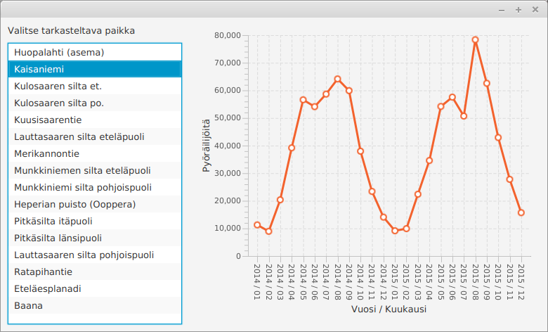
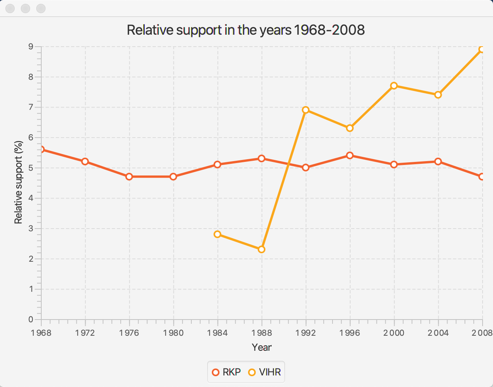
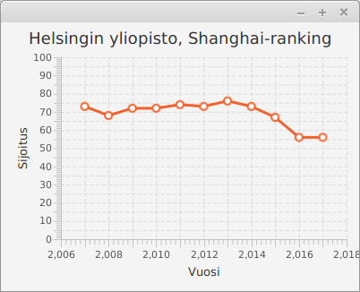
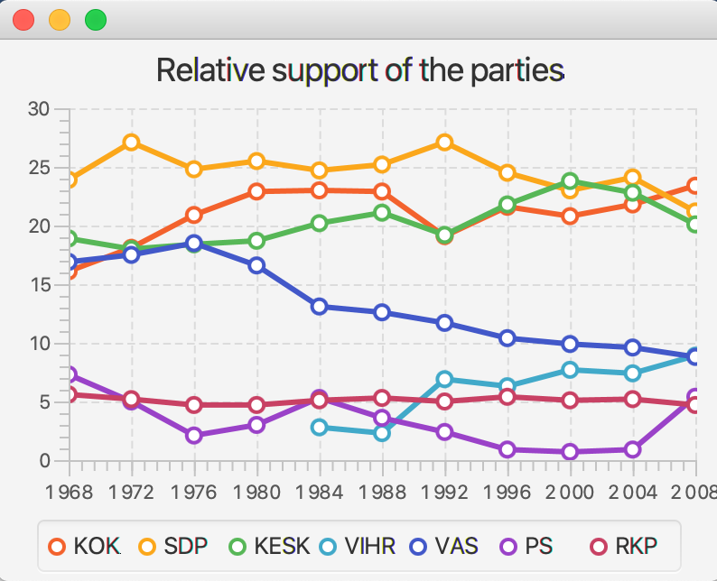
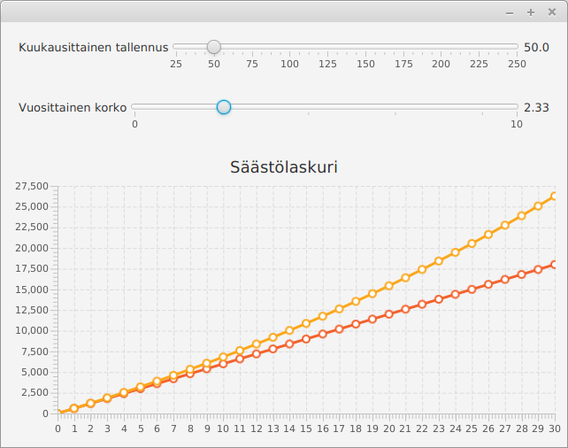
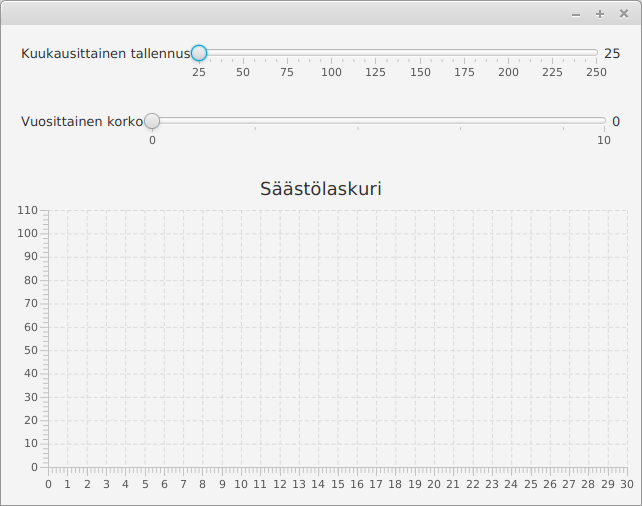
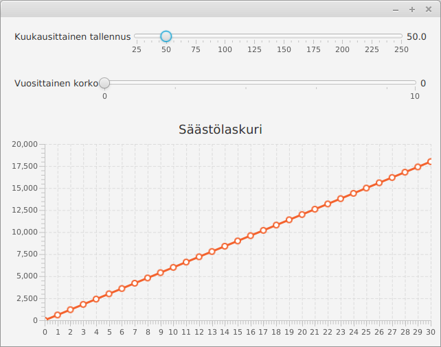
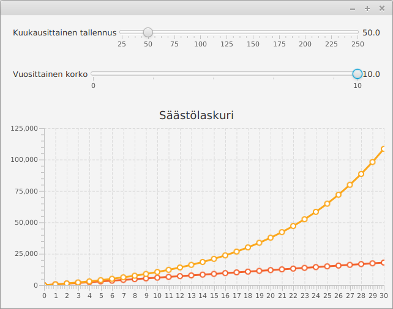
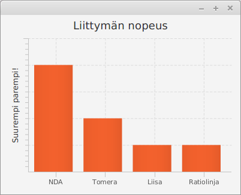
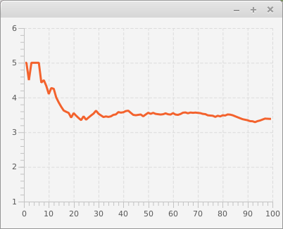

<!-- <text-box variant='learningObjectives' name='Oppimistavoitteet'> -->
<text-box variant='learningObjectives' name='Learning Objectives'>

<!-- - Tunnet menetelmiä tiedon visualisointiin.
- Osaat käyttää Javan valmiita tiedon visualisointiin tarkoitettuja käyttöliittymäkomponentteja.
- Tiedät tavan jatkuvasti muuttuvan tiedon visualisointiin -->
- You are aware of data visualizations methods.
- You know how to use Java's ready-made data visualization interface components.
- You know a way to visualize information that changes dynamically.

</text-box>


<!-- Sananlasku "a picture is worth a thousand words" eli "yksi kuva kertoo enemmän kuin tuhat sanaa" kuvaa hyvin tiedon visualisoinnin tavoitetta. Tiedon visualisoinnilla pyritään tilanteeseen, missä tieto esitetään tiiviissä mutta ymmärrettävässä muodossa. Visualisaatioilla voi korostaa tärkeitä asioita ja käyttäjälle voi esimerkiksi tehdä yhteenvetoja datasta.

Alla olevassa kuvassa on kuva sovelluksesta, joka mahdollistaa pyöräilijätilastojen tarkastelun. Käytetyt tilastot on noudettu osoitteessa [https://www.avoindata.fi/data/fi/dataset/helsingin-pyorailijamaarat](https://www.avoindata.fi/data/fi/dataset/helsingin-pyorailijamaarat) olevasta Helsingin kaupunkisuunnitteluviraston tietoaineistosta (CC-BY). -->
The adage "a picture is worth a thousand words" describes the goal of data visualization appropriately. Data visualization seeks to present information in a concise, yet comprehensible form. Visualizations can emphasize important points and provide the user with useful things, such as summaries of data.

The image below shows an application that allows you to view statistics of cyclists. The statistics used have been taken from the  the Helsinki City Planning Agency data set  (CC-BY) found at [https://www.avoindata.fi/data/en/dataset/helsingin-pyorailijamaarat](https://www.avoindata.fi/data/en/dataset/helsingin-pyorailijamaarat).
<br/>

<!--  -->


<!-- Kun vertaa kuvan näyttämää tilastoa tiedoston muotoon -- alla muutama rivi esimerkiksi -- edun huomaa hyvin. Alkuperäisessä datassa arvot on esitetty tuntikohtaisina, kun taas visualisaatiota varten datasta on luotu kuukausikohtaiset yhteenvedot. Alkuperäinen data sisältää myös kaikki tarkasteltavat paikat, kun taas visualisaatiossa käyttäjä voi valita tietyn pisteen. -->

When comparing the statistics shown in the image to file format - a few lines have been shown below as an example - the benefits are evident. In the original data set the values ​​are presented on an hourly basis, whereas monthly summaries have been generated from the data for the visualization. The original set also contains all of the the places of inspection, whereas in the visualization the user is able to select a specific point.

<pre>
Päivämäärä;Huopalahti (asema);Kaisaniemi;Kulosaaren silta et.;...
ke 1 tammi 2014 00:00;;1;;;;;;2;5;3;;11;;;7;8
ke 1 tammi 2014 01:00;;3;;;;;;6;5;1;;8;;;5;4
ke 1 tammi 2014 02:00;;3;;;;;;1;1;1;;14;;;2;11
ke 1 tammi 2014 03:00;;2;;;;;;0;2;0;;7;;;5;3
...
</pre>

<br/>

<!-- Yllä kuvatun muotoista dataa voi käsitellä merkkijonoja riveittäin. Rivit pilkotaan paloiksi, joita voidaan käsitellä listamuotoisen rakenteen kautta. Tämä tapahtuu -- esimerkiksi -- seuraavalla tavalla. -->
Data that's in the format shown above can be processed as strings row by row. The rows are split into pieces that can be processed using a list structure. One way of doing this is the following.

<!-- ```java
String rivi = "Päivämäärä;Huopalahti (asema);Kaisaniemi;Kulosaaren silta et.;..."
String[] palat = rivi.split(";");
for (int i = 0; i < palat.length; i++) {
    System.out.println(i + ": " + palat[i]);
}
``` -->
```java
String row = "Päivämäärä;Huopalahti (asema);Kaisaniemi;Kulosaaren silta et.;..."
String[] pieces = row.split(";");
for (int i = 0; i < pieces.length; i++) {
    System.out.println(i + ": " + pieces[i]);
}
```

<sample-output>
0: Päivämäärä
1: Huopalahti (asema)
2: Kaisaniemi
3: Kulosaaren silta et.
4: ...
</sample-output>


<!-- Tutustutaan tässä muutamaan tiedon visualisointiin käytettävään kaavioon sekä erääseen liikkuvan tiedon visualisointitapaan. -->
We'll familiarize ourselves with some patterns used in data visualization, and a technique for visualizing changing data.

<!-- ## Kaaviot -->

## Charts

<!-- Java tarjoaa [paljon valmiita luokkia](https://docs.oracle.com/javafx/2/api/javafx/scene/chart/package-summary.html) kaavioiden piirtämiseen. Kaaviotyypit sisältävät muunmuassa aluekaavion, pylväskaavion, viivakaavion sekä piirakkakaavion. -->

Java offers [lots of pre-made classes](https://docs.oracle.com/javafx/2/api/javafx/scene/chart/package-summary.html) for drawing different types of charts. The types of charts include, among others, area charts, bar charts, and line charts.

<!-- Tutustutaan tässä viivakaavion ja pylväskaavion käyttöön. Kannattaa myös tutustua osoitteessa [https://docs.oracle.com/javafx/2/charts/jfxpub-charts.htm](https://docs.oracle.com/javafx/2/charts/jfxpub-charts.htm) olevaan Oraclen oppaaseen aiheesta. -->

We are next going to take a look at using both a line and a bar chart. It might be worthwhile to also take a look at Oracle's guide on the subject, which can be found here: [https://docs.oracle.com/javafx/2/charts/jfxpub-charts.htm](https://docs.oracle.com/javafx/2/charts/jfxpub-charts.htm).

<br/>

<!-- ### Viivakaavio -->

### Line Chart

<!-- Viivakaaviota käytetään esimerkiksi ajan yli tapahtuvan muutoksen kuvaamiseen. Tieto kuvataan kaksiulotteisessa koordinaatistossa sijaitsevien pisteiden läpi piirretyllä viivalla, missä x-koordinaatti kuvaa ajanhetkeä ja y-koordinaatti muuttujan arvoa kullakin ajanhetkellä. Viivakaavio voi sisältää myös useampia muuttujia. -->

Line charts can be used to illustrate change that happens over time. The data is illustrated as a line that connects dots in a two-dimencional coordinate system, where the x-axis represents time, and the y-axis the value of the variable at each point in time. A line chart can also contain many different variables.

<!-- Viivakaaviota voi käyttää esimerkiksi Tilastokeskuksen tarjoaman puolueiden äänimääriä ja suhteellista kannatusta kunnallisvaaleissa vuosina 1968-2008 kuvaavan tiedon visualisointiin. Alkuperäinen data löytyy osoitteesta [https://tilastokeskus.fi/til/kvaa/2008/kvaa_2008_2010-07-30\_tau\_002.html](https://tilastokeskus.fi/til/kvaa/2008/kvaa_2008_2010-07-30_tau_002.html). Datasta on poimittu visualisointia varten muutama piste -- keskitymme tässä suhteelliseen kannatukseen. Käytössä oleva data on seuraavanlainen -- datan erottelussa on käytetty sarkainmerkkiä ('\t'). -->

Let's use a line chart on some real-world data. Statistics Finland offers data on the total votes and relative percentage of votes in the Finnish communal elections for the years 1968-2008. The original data can be found at [https://tilastokeskus.fi/til/kvaa/2008/kvaa_2008_2010-07-30_tau_002.html](https://tilastokeskus.fi/til/kvaa/2008/kvaa_2008_2010-07-30_tau_002.html). A few data points have been drawn from it for visualization purposes -- we'll be focusing on the relative share of the votes here. Our data below uses tabs for separation (i.e., the character '\t').

<br/>

<!-- <pre>
Puolue	1968	1972	1976	1980	1984	1988	1992	1996	2000	2004	2008
KOK	16.1	18.1	20.9	22.9	23.0	22.9	19.1	21.6	20.8	21.8	23.4
SDP	23.9	27.1	24.8	25.5	24.7	25.2	27.1	24.5	23.0	24.1	21.2
KESK	18.9	18.0	18.4	18.7	20.2	21.1	19.2	21.8	23.8	22.8	20.1
VIHR	-	-	-	-	2.8	2.3	6.9	6.3	7.7	7.4	8.9
VAS	16.9	17.5	18.5	16.6	13.1	12.6	11.7	10.4	9.9	9.6	8.8
PS	7.3	5.0	2.1	3.0	5.3	3.6	2.4	0.9	0.7	0.9	5.4
RKP	5.6	5.2	4.7	4.7	5.1	5.3	5.0	5.4	5.1	5.2	4.7
</pre> -->

<pre>
Party	1968	1972	1976	1980	1984	1988	1992	1996	2000	2004	2008
KOK	16.1	18.1	20.9	22.9	23.0	22.9	19.1	21.6	20.8	21.8	23.4
SDP	23.9	27.1	24.8	25.5	24.7	25.2	27.1	24.5	23.0	24.1	21.2
KESK	18.9	18.0	18.4	18.7	20.2	21.1	19.2	21.8	23.8	22.8	20.1
VIHR	-	-	-	-	2.8	2.3	6.9	6.3	7.7	7.4	8.9
VAS	16.9	17.5	18.5	16.6	13.1	12.6	11.7	10.4	9.9	9.6	8.8
PS	7.3	5.0	2.1	3.0	5.3	3.6	2.4	0.9	0.7	0.9	5.4
RKP	5.6	5.2	4.7	4.7	5.1	5.3	5.0	5.4	5.1	5.2	4.7
</pre>


<!-- Yksittäisen yllä kuvatun rivin voi pilkkoa seuraavasti. -->

It's possible to split one of the rows above in the following manner:


<!-- ```java
String rivi = "Puolue	1968	1972	1976	1980	1984	1988"
List<String> palat = Arrays.asList(rivi.split("\t"));
for (int i = 0; i < palat.size(); i++) {
    System.out.println(i + ": " + palat.get(i));
}
``` -->

```java
String row = "Party	1968	1972	1976	1980	1984	1988"
List<String> pieces = Arrays.asList(row.split("\t"));
for (int i = 0; i < pieces.size(); i++) {
    System.out.println(i + ": " + pieces.get(i));
}
```

<!-- <sample-output>

0: Puolue
1: 1968
2: 1972
3: 1976
4: 1980
5: 1984
6: 1988

</sample-output> -->

<sample-output>

0: Party
1: 1968
2: 1972
3: 1976
4: 1980
5: 1984
6: 1988

</sample-output>

<!-- Viivakaavion käyttö vaatii koordinaatiston akseleiden määrittelyn, koordinaatistoja käyttävän viivakaavion luomisen, sekä tiedon lisäämisen viivakaavioon. Ensimmäinen hahmotelma sovelluksesta on seuraava. Sovellus yrittää visualisoida RKP:n kannatusta vuosina 1968-2008. -->

Using a line chart requires that we define the axes of the coordinate system, create the line chart that uses those axes, and insert the data into the line chart. Our first conceptualization of the application is as follows. The progam attempts to visualize the support enjoyed by the RKP party in the years 1968-2008.

<!-- ```java
@Override
public void start(Stage ikkuna) {
    // luodaan kaaviossa käytettävät x- ja y-akselit
    NumberAxis xAkseli = new NumberAxis();
    NumberAxis yAkseli = new NumberAxis();

    // asetetaan akseleille nimet
    xAkseli.setLabel("Vuosi");
    yAkseli.setLabel("Suhteellinen kannatus (%)");

    // luodaan viivakaavio. Viivakaavion arvot annetaan numeroina
    // ja se käyttää aiemmin luotuja x- ja y-akseleita
    LineChart<Number, Number> viivakaavio = new LineChart<>(xAkseli, yAkseli);
    viivakaavio.setTitle("Suhteellinen kannatus vuosina 1968-2008");

    // luodaan viivakaavioon lisättävä datajoukko
    XYChart.Series rkpData = new XYChart.Series();
    rkpData.setName("RKP");
    // lisätään datajoukkoon yksittäisiä pisteitä
    rkpData.getData().add(new XYChart.Data(1968, 5.6));
    rkpData.getData().add(new XYChart.Data(1972, 5.2));
    rkpData.getData().add(new XYChart.Data(1976, 4.7));
    rkpData.getData().add(new XYChart.Data(1980, 4.7));
    rkpData.getData().add(new XYChart.Data(1984, 5.1));
    rkpData.getData().add(new XYChart.Data(1988, 5.3));
    rkpData.getData().add(new XYChart.Data(1992, 5.0));
    rkpData.getData().add(new XYChart.Data(1996, 5.4));
    rkpData.getData().add(new XYChart.Data(2000, 5.1));
    rkpData.getData().add(new XYChart.Data(2004, 5.2));
    rkpData.getData().add(new XYChart.Data(2008, 4.7));

    // lisätään datajoukko viivakaavioon
    viivakaavio.getData().add(rkpData);

    // näytetään viivakaavio
    Scene nakyma = new Scene(viivakaavio, 640, 480);
    ikkuna.setScene(nakyma);
    ikkuna.show();
}
``` -->

```java
@Override
public void start(Stage stage) {
    // create the x and y axes that the chart is going to use
    NumberAxis xAxis = new NumberAxis();
    NumberAxis yAxis = new NumberAxis();

    // set the titles for the axes
    xAxis.setLabel("Year");
    yAxis.setLabel("Relative support (%)");


    // create the line chart. The values of the chart are given as numbers
    // and it uses the axes we created earlier
    LineChart<Number, Number> lineChart = new LineChart<>(xAxis, yAxis);
    lineChart.setTitle("Relative support in the years 1968-2008");

    // create the data set that is going to be added to the line chart
    XYChart.Series rkpData = new XYChart.Series();
    rkpData.setName("RKP");
    // and single points into the data set
    rkpData.getData().add(new XYChart.Data(1968, 5.6));
    rkpData.getData().add(new XYChart.Data(1972, 5.2));
    rkpData.getData().add(new XYChart.Data(1976, 4.7));
    rkpData.getData().add(new XYChart.Data(1980, 4.7));
    rkpData.getData().add(new XYChart.Data(1984, 5.1));
    rkpData.getData().add(new XYChart.Data(1988, 5.3));
    rkpData.getData().add(new XYChart.Data(1992, 5.0));
    rkpData.getData().add(new XYChart.Data(1996, 5.4));
    rkpData.getData().add(new XYChart.Data(2000, 5.1));
    rkpData.getData().add(new XYChart.Data(2004, 5.2));
    rkpData.getData().add(new XYChart.Data(2008, 4.7));

    // add the data set to the line chart
    lineChart.getData().add(rkpData);

    // display the line chart
    Scene view = new Scene(lineChart, 640, 480);
    stage.setScene(view);
    stage.show();
}
```

<!-- Kun käynnistämme sovelluksen, huomaamme muutamia ongelmia (kokeile sovellusta ja katso miltä data näyttää). Koordinaatiston akseleiden luomiseen käytetty luokka [NumberAxis](https://docs.oracle.com/javase/8/javafx/api/javafx/scene/chart/NumberAxis.html) tarjoaa onneksemme myös toisenlaisen konstruktorin. NumberAxin-luokan konstruktorille voi määritellä myös ala- ja yläraja sekä välien määrän näytettyjen numeroiden välillä. Määritellään alarajaksi 1968, ylärajaksi 2008, ja välien määräksi 4. -->

When we start the program, we notice a few problems (try it out and see what the data looks like). The class that we've used to create the axes, [NumberAxis](https://docs.oracle.com/javase/8/javafx/api/javafx/scene/chart/NumberAxis.html), happens to offer another constructor as well. You can give the lower and upper bounds as parameters to the constructor, as well as the number of ticks betwen them. Let's set the lower bound as 1968, the upper bound as 2008, and the number of ticks as 4.

<br/>

<!-- ```java
@Override
public void start(Stage ikkuna) {
    // luodaan kaaviossa käytettävät x- ja y-akselit
    NumberAxis xAkseli = new NumberAxis(1968, 2008, 4);
    // .. muu ohjelmakoodi pysyy samana
``` -->


```java
@Override
public void start(Stage stage) {
    // create the x and y axis
    NumberAxis xAxis= new NumberAxis(1968, 2008, 4);
    // .. the rest of the code stays the same
```

<!-- Toisen puolueen kannatuksen lisääminen onnistuu ohjelmaan vastaavasti. Alla olevassa esimerkissä kaavioon on lisätty Vihreät, joilla on ollut toimintaa vuodesta 1984 lähtien. -->

Adding the numbers of support for another party to the program can be done in a similar manner. In the example below, we add the party VIHR to the chart -- the party has been active since the year 1984.


<!-- ```java
@Override
public void start(Stage ikkuna) {
    // luodaan kaaviossa käytettävät x- ja y-akselit
    NumberAxis xAkseli = new NumberAxis(1968, 2008, 4);
    NumberAxis yAkseli = new NumberAxis();

    // asetetaan akseleille nimet
    xAkseli.setLabel("Vuosi");
    yAkseli.setLabel("Suhteellinen kannatus (%)");

    // luodaan viivakaavio. Viivakaavion arvot annetaan numeroina
    // ja se käyttää aiemmin luotuja x- ja y-akseleita
    LineChart<Number, Number> viivakaavio = new LineChart<>(xAkseli, yAkseli);
    viivakaavio.setTitle("Suhteellinen kannatus vuosina 1968-2008");

    // luodaan viivakaavioon lisättävä datajoukko
    XYChart.Series rkpData = new XYChart.Series();
    rkpData.setName("RKP");
    // lisätään datajoukkoon yksittäisiä pisteitä
    rkpData.getData().add(new XYChart.Data(1968, 5.6));
    rkpData.getData().add(new XYChart.Data(1972, 5.2));
    rkpData.getData().add(new XYChart.Data(1976, 4.7));
    rkpData.getData().add(new XYChart.Data(1980, 4.7));
    rkpData.getData().add(new XYChart.Data(1984, 5.1));
    rkpData.getData().add(new XYChart.Data(1988, 5.3));
    rkpData.getData().add(new XYChart.Data(1992, 5.0));
    rkpData.getData().add(new XYChart.Data(1996, 5.4));
    rkpData.getData().add(new XYChart.Data(2000, 5.1));
    rkpData.getData().add(new XYChart.Data(2004, 5.2));
    rkpData.getData().add(new XYChart.Data(2008, 4.7));

    // lisätään datajoukko viivakaavioon
    viivakaavio.getData().add(rkpData);

    // luodaan toinen viivakaavioon lisättävä datajoukko
    XYChart.Series vihreatData = new XYChart.Series();
    vihreatData.setName("VIHR");
    // lisätään datajoukkoon yksittäisiä pisteitä
    vihreatData.getData().add(new XYChart.Data(1984, 2.8));
    vihreatData.getData().add(new XYChart.Data(1988, 2.3));
    vihreatData.getData().add(new XYChart.Data(1992, 6.9));
    vihreatData.getData().add(new XYChart.Data(1996, 6.3));
    vihreatData.getData().add(new XYChart.Data(2000, 7.7));
    vihreatData.getData().add(new XYChart.Data(2004, 7.4));
    vihreatData.getData().add(new XYChart.Data(2008, 8.9));

    // lisätään datajoukko viivakaavioon
    viivakaavio.getData().add(vihreatData);

    // näytetään viivakaavio
    Scene nakyma = new Scene(viivakaavio, 640, 480);
    ikkuna.setScene(nakyma);
    ikkuna.show();
}
``` -->

```java
@Override
public void start(Stage stage) {
    // create the x and y axes that the chart is going to use
    NumberAxis xAxis = new NumberAxis();
    NumberAxis yAxis = new NumberAxis();

    // set the titles for the axes
    xAxis.setLabel("Year");
    yAxis.setLabel("Relative support (%)");


    // create the line chart. The values of the chart are given as numbers
    // and it uses the axes we created earlier
    LineChart<Number, Number> lineChart = new LineChart<>(xAxis, yAxis);
    lineChart.setTitle("Relative support in the years 1968-2008");

    // create the data set that is going to be added to the line chart
    XYChart.Series rkpData = new XYChart.Series();
    rkpData.setName("RKP");
    // and single points into the data set
    rkpData.getData().add(new XYChart.Data(1968, 5.6));
    rkpData.getData().add(new XYChart.Data(1972, 5.2));
    rkpData.getData().add(new XYChart.Data(1976, 4.7));
    rkpData.getData().add(new XYChart.Data(1980, 4.7));
    rkpData.getData().add(new XYChart.Data(1984, 5.1));
    rkpData.getData().add(new XYChart.Data(1988, 5.3));
    rkpData.getData().add(new XYChart.Data(1992, 5.0));
    rkpData.getData().add(new XYChart.Data(1996, 5.4));
    rkpData.getData().add(new XYChart.Data(2000, 5.1));
    rkpData.getData().add(new XYChart.Data(2004, 5.2));
    rkpData.getData().add(new XYChart.Data(2008, 4.7));

    // add the data set to the line chart
    lineChart.getData().add(rkpData);

    // create another data set that's going to be added to the chart
    XYChart.Series vihrData = new XYChart.Series();
    vihrData.setName("VIHR");
    // and single data points into the data set
    vihrData.getData().add(new XYChart.Data(1984, 2.8));
    vihrData.getData().add(new XYChart.Data(1988, 2.3));
    vihrData.getData().add(new XYChart.Data(1992, 6.9));
    vihrData.getData().add(new XYChart.Data(1996, 6.3));
    vihrData.getData().add(new XYChart.Data(2000, 7.7));
    vihrData.getData().add(new XYChart.Data(2004, 7.4));
    vihrData.getData().add(new XYChart.Data(2008, 8.9));

    // add the data set to the line chart
    lineChart.getData().add(vihrData);

    // display the line chart
    Scene view = new Scene(lineChart, 640, 480);
    stage.setScene(view);
    stage.show();
}
```

<!-- Ohjelma näyttää käynnistyessään seuraavalta. -->

The program should look like this when started.




<!-- Edellä jokainen kaavion piste lisättiin ohjelmakoodiin manuaalisesti -- olemme ohjelmoijia, joten tämä tuntuu hieman hölmöltä. Ratkaisu on tiedon lukeminen sopivaan tietorakenteeseen, jota seuraa tietorakenteen läpikäynti ja tiedon lisääminen kaavioon. Sopiva tietorakenne on esimerkiksi puolueiden nimiä avaimena käyttävä hajautustaulu, jonka arvona on hajautustaulu -- tämä hajautustaulu sisältää numeropareja, jotka kuvaavat vuotta ja kannatusta. Nyt datan lisääminen kaavioon on suoraviivaisempaa. -->

Each data point was manually added above to the program code -- given that we're programmers, this approach feels clumsy. The solution is to read the data into a suitable data structure, after which we can go through the structure and add the data contained in it to the chart. A good candidate for this data structure is a hash map that uses the names of the parties as its keys. The values of the hash table are pairs of numbers that represent the year and the corresponding support number. It's now much more straightforward to add data into the chart.


<!-- ```java
// akselit ja viivakaavio luotu aiemmin

// data luettu aiemmin -- datan sisältää seuraava olio
Map<String, Map<Integer, Double>> arvot = // luotu muualla

// käydään puolueet läpi ja lisätään ne kaavioon
arvot.keySet().stream().forEach(puolue -> {
    // jokaiselle puolueelle luodaan oma datajoukko
    XYChart.Series data = new XYChart.Series();
    data.setName(puolue);

    // datajoukkoon lisätään puolueen pisteet
    arvot.get(puolue).entrySet().stream().forEach(pari -> {
        data.getData().add(new XYChart.Data(pari.getKey(), pari.getValue()));
    });

    // ja datajoukko lisätään kaavioon
    viivakaavio.getData().add(data);
});
``` -->

```java
// the axes and the line chart created previously

// data has been read earlier -- the following object contains the data
Map<String, Map<Integer, Double>> values = // created elsewhere

// go through the parties and add them to the chart
values.keySet().stream().forEach(party -> {
    // a different data set for every party
    XYChart.Series data = new XYChart.Series();
    data.setName(party);

    // add the party's support numbers to the data set
    values.get(party).entrySet().stream().forEach(pair -> {
        data.getData().add(new XYChart.Data(pair.getKey(), pair.getValue()));
    });

    // and add the data set to the chart
    lineChart.getData().add(data);
});
```

<!-- <programming-exercise name='Shanghai' tmcname='osa14-Osa14_01.Shanghai'> -->

<programming-exercise name='Shanghai' tmcname='part14-Part14_01.Shanghai'>

<!-- Yliopistoja vertaillaan vuosittain. Eräs kansainvälisesti tunnistettu arvioijataho on Shanghai Ranking Consultancy, joka julkaisee vuosittain listan kansainvälisesti tunnistetuista yliopistoista. Lista sisältää myös yliopiston sijan maailmanlaajuisessa vertailussa. Helsingin yliopiston sijoitus on vuosina 2007-2017 ollut seuraava: -->

Universities are compared yearly. One internationally respected comparer is the Shanghai Ranking Consultancy, which published a yearly comparison list of internationally famous universities. The list also includes the rank for each university. The University of Helsinki has obtained the following ranks in the years 2007-2017:

<pre>
2007 73
2008 68
2009 72
2010 72
2011 74
2012 73
2013 76
2014 73
2015 67
2016 56
2017 56
</pre>

<!-- Luo tehtäväpohjassa olevaan luokkaan `ShanghaiSovellus` ohjelma, joka näyttää Helsingin yliopiston sijoituksen kehityksen viivakaaviona. Huom! Älä käytä sovelluksessa mitään asettelua, eli anna viivakaavio-olio suoraan Scene-oliolle konstruktorin parametrina. Huomaa myös, että Scenelle tulee tällöin antaa näytettävän alueen leveys ja korkeus. -->

You will find the class `ShangaiApplication` in the exercise base. Create in it a program that shows how the University of Helsinki's ranking has varied during these years. NB! Don't use any layout in the application -- give the line chart object directly as the Scene object's constructor parameter. Also take notice that the Scene also needs the width and height of the displayed area as parameters.

<!-- Sovelluksen tuottama tulos näyttää esimerkiksi seuraavanlaiselta: -->

The result drawn by the application could like the following example:



</programming-exercise>


<!-- <programming-exercise name='Puolueet' tmcname='osa14-Osa14_02.Puolueet'> -->

<programming-exercise name='Finnish parties' tmcname='part14-Part14_02.FinnishParties'>

<!-- Luo tehtäväpohjassa olevaan luokkaan PuolueetSovellus ohjelma, joka näyttää puolueiden suhteellisen kannatuksen vuosina 1968-2008. Käytössä on edellisissä esimerkeissä käytetty data, joka löytyy tiedostosta "puoluedata.tsv". -->

The exercise base contains the class PartiesApplication. Create in it an application that displays the relative support of the major Finnish parties during the years 1968-2008. The project contains the raw data that has been used in the previous examples, and it can be found in the file "partiesdata.tsv".

<!-- Suhteellinen kannatus tulee näyttää puoluekohtaisesti siten, että jokaista puoluetta kuvaa viivakaaviossa erillinen viiva. Aseta aina viivan luomiseen käytettävän XYChart.Series-olion nimeksi (metodi setName) datasta löytyvä puolueen nimi. -->

The relative support must be displayed for each party so that a separate line represents each of them in the line chart. Always set the name of the XYChart.Series object to be the party name that can be found in the data (with the help of the setName method).

<!-- Kun viivakaavion käyttämää x-akselia luo, kannattaa huomioida myös se, että ensimmäinen tilaston sisältämä tieto on vuodelta 1968. -->

When creating the x axis that the line chart uses, take notice that the first year that the statistics cover is the year of 1968.

<!-- Sarkainmerkillä erotellun merkkijonon saa pilkottua osiin seuraavasti: -->

Tab-separated string can be split into parts in the following manner:

<!-- ```java
String merkkijono = "KOK	16.1	18.1	20.9";
String[] palat = merkkijono.split("\t");
System.out.println(palat[0]);
System.out.println(palat[1]);
System.out.println(palat[2]);
System.out.println(palat[3]);
``` -->

```java
String string = "KOK    16.1    18.1    20.9";
String[] pieces = string.split("\t");
System.out.println(pieces[0]);
System.out.println(pieces[1]);
System.out.println(pieces[2]);
System.out.println(pieces[3]);
```

<sample-output>

KOK
16.1
18.1
20.9

</sample-output>


<!-- Merkkijonomuodossa olevan desimaaliluvun muuntaminen desimaaliluvuksi onnistuu luokan Double metodilla valueOf. Esim. `Double.valueOf("16.1");` -->

To create a floating point number of a string that contains a floating point number, you can use the valueOf method of the Double class. So for instance `Double.valueOf("16.1");`

<!-- Sovelluksen tuottaman visualisaation tulee näyttää kutakuinkin seuraavanlaiselta: -->

The visualization created by the application should look something like this:



&nbsp;


<!-- *Dataa vastaaviin kaavioihin löytyy muunmuassa Tilastokeskuksen [PX-Web-tietokannoista](https://pxnet2.stat.fi/PXWeb/pxweb/fi/StatFin/).* -->

*Data for similar charts can be found in the [PX-Web databases](https://pxnet2.stat.fi/PXWeb/pxweb/fi/StatFin/) of Statistics Finland*

</programming-exercise>


<programming-exercise name='Savings calculator (3 parts)' tmcname='part14-Part14_03.SavingsCalculator'>

<!-- Toteutetaan tässä tehtävässä sovellus, jota käytetään säästämiseen liittyvien mahdollisten tuottojen tarkasteluun. Laskuri tarjoaa mahdollisuuden sekä kuukausittaisen säästön määrittelyyn että vuosittaisen koron määrittelyyn, ja näyttää säästösumman kasvun kolmenkymmenen vuoden aikana yli. -->
In this exercise you will implement a program for calculating and displaying the sum in a savings account. User can give the calculator a sum to save each month and the yearly interest rate, and the calculator will display how the savings will increase over 30 years.




<h2>User interface</h2>


<!-- Toteuta ensin sovelluksen käyttöliittymä. Sovelluksen komponentteja hallinnoidaan BorderPanen avulla. BorderPanen keskellä on viivakaavio (LineChart), joka sisältää kaksi numeerista akselia (NumberAxis). BorderPanen ylälaidassa on VBox-asettelu. VBox-asettelu sisältää kaksi BorderPanea. Ensimmäisessä (ylemmässä) BorderPanessa on vasemmalla teksti "Kuukausittainen tallennus", keskellä liukuri (Slider), ja oikealla liukurin arvoa kuvaava teksti. Toisessa (alemmassa) BorderPanessa on vasemmalla teksti "Vuosittainen", keskellä liukuri (Slider), ja oikealla liukurin arvoa kuvaava teksti. -->
First implement the user interface of the program. The components of the application can be managed using a BorderPane.
In the middle of the BorderPane add a line chart (LineChart), which has two numerical axis (NumberAxis). On the top of the BorderPane add a VBox component which contains two BorderPanes. The first BorderPane (on top) contains the text "Monthly savings" on the left, a slider in the middle and a text describing the slider on the right.
The second BorderPane (below the first one) has the text "Yearly interest rate" on the left, a slider in the middle and a text describing the slider on the right.


<!-- Löydät vinkkejä Slider-luokan käyttöön hakemalla Googlesta avainsanoilla "javafx slider". -->
You can find tips for using the Slider -class by googling "javafx slider".


<!-- Määrittele Sliderit siten, että kuukausittaista tallennusta kuvaavan Sliderin minimiarvo on 25 ja maksimiarvo on 250. Vuosittaisen koron minimiarvo on 0 ja maksimiarvo on 10. Kaavion x-akselin tulee näyttää arvon nollasta kolmeenkymmeneen, jotka kuvaavat vuosien kehitystä. Y-akselin arvojen tulee mukautua näytettäviin arvoihin. -->
Define the Sliders so, that the minimum monthly savings is 25 and the maximum is 250.
The minimum yearly interest rate is 0 and the maximum is 10.
The x-axis of the line chart displays years from 0-30. The y-axis must adapt to the values being shown.

<!-- Sovellus näyttää tämän vaiheen jälkeen seuraavalta. -->
In this phase the application should look like so:




<h2>Displaying the savings</h2>

<!-- Kun käyttöliittymän rakenne ja ulkoasu on kohdallaan, aloitetaan laskurin toiminnallisuuden toteuttaminen. -->
After the user interface is complete, start implementing the functionality of the program.

<!-- Muokkaa käyttöliittymää siten, että kun käyttäjä siirtää kuukausittaiseen tallennukseen liittyvää liukuria (ylempi liukureista), kaavion näyttämä tallennuksen kasvua vuosien yli kuvaava kaavio päivittyy ja näyttää tallennuksen kasvun. Esimerkiksi kun kuukausittainen tallennus on 50, tulee kaaviossa olla viiva, joka näyttää arvot [(0, 0), (1, 600), (2, 1200), (3, 1800), ...] -->
Modify the user interface so, that when user changes the sum to save each month (by moving the uppermost slider), the line chart updates to display the savings amount of the new monthly sum. For example when the monthly savings amount is 50, the line chart should have a line showing the values [(0,0), (1,600), (2,1200),(3,1800),...].

<!-- Sovellus näyttää tämän vaiheen jälkeen (esimerkiksi) seuraavalta. Alla kuukausittaisen tallennuksen arvoksi on valittu 50. -->
In this phase the application should look like so (when the monthly sum to save is 50):




<h2>Displaying the savings and the interest rate</h2>

<!-- Muokkaa käyttöliittymää siten, että koron näyttäminen sovelluksessa toimii. Tämän jälkeen sovelluksen tulee näyttää kaksi viivaa, yksi viivoista näyttää pelkän talletuksen, ja toinen viiva näyttää talletuksen korkoineen. -->
Modify the user interface so, that it shows the interest rate as well. The line chart should have two lines, one for showing just the monthly savings, and one for showing the monthly savings and the interest rate.

<!-- Laske korko vuosittain vuoden lopussa olevan tallennuksen perusteella (eli hieman optimistisesti). Esimerkiksi kun kuukausittainen tallennus on 50 ja vuosikorko 5%, tulee vuosittaisten summien korkoineen olla [(0, 0), (1, 630), (2, 1291.5), (3, 1986.075), ...] -->
Calculate the interest rate yearly according to the expected  savings at the end of the year. For example when the monthly savings sum is 50 and the yearly interest rate is 5%, the line chart should have a line showing the values [(0,0), (1, 630), (2, 1291.5), (3, 1986,075), ...].

<!-- Sovellus näyttää tämän vaiheen jälkeen (esimerkiksi) seuraavalta. Alla kuukausittaisen tallennuksen arvoksi on valittu 50 ja koroksi 10 (eli 10% korko). -->
In this phase the application should look like so (when the monthly sum to save is 50 and the yearly interest rate is 10%):




<!-- Kuvassa huomaamme ns. "korkoa korolle"-efektin, joskin hyvin optimistiselle korolle. Kun olet saanut sovelluksen toimimaan ja olet palauttanut sen, voit tarkastella esimerkiksi miten 25 euron kuukausittainen tallennus 4% vuosikorolla kasvaa 50 vuoden aikana. -->
In the chart we see the compound interest of our savings, although with a very optimistic interest rate. When you have completed the application and returned it, you can for example calculate how saving 25 euros a month with 4% yearly interest rate grows over 50 years.

</programming-exercise>


<!-- ### Pylväskaaviot -->

### Bar Charts

<!-- Pylväskaavioita käytetään kategorisen datan visualisointiin. Tieto kuvataan pylväinä, missä jokainen pylväs kuvaa tiettyä kategoriaa, ja pylvään korkeus (tai pituus) kategoriaan liittyvää arvoa. Pylväskaavioilla kuvattavasta datasta esimerkkejä ovat esimerkiksi maiden asukasluvut tai kauppojen tai tuotteiden markkinaosuudet. -->

Bar charts are used to visualize categorical data. The data is represented as bars --  each bar represents a certain category, and its height (or length) represents the value associated with the category. Examples of data that could well be illustrated with bar charts are populations of countries or the market shares of stores or products.

<!-- Tarkastellaan pylväskaavion käyttöä pohjoismaiden asukaslukujen visualisointiin. Käytetty data on Wikipedian pohjoismaita kuvaavasta artikkelista osoitteesta [https://fi.wikipedia.org/wiki/Pohjoismaat](https://fi.wikipedia.org/wiki/Pohjoismaat) (noudettu 10.4.2017, asukasluvut ovat vuoden 2015 arvioita). -->

Let's take a look at using a bar chart to visualize the population figures of the Nordic countries. The used data is from [the Wikipedia article on the Nordic countries](https://en.wikipedia.org/wiki/Nordic_countries) (retrieved 6.12.2019, populations are estimates from the year 2018).

<br/>

<!-- <pre>
Islanti, 329100
Norja, 5165800
Ruotsi, 9801616
Suomi, 5483533
Tanska, 5678348
</pre> -->

<pre>
Iceland, 343518
Norway, 5372191
Sweden, 10313447
Finland, 5537364
Denmark, 5809502
</pre>


<!-- Pylväskaavio luodaan JavaFx:n luokan [BarChart](https://docs.oracle.com/javase/8/javafx/api/javafx/scene/chart/BarChart.html) avulla. Kuten viivakaavion käyttö, myös pylväskaavion käyttö vaatii käytettävien koordinaatistojen määrittelyn sekä tiedon lisäämisen kaavioon. Toisin kuin viivakaavioesimerkissä, tässä käytämme x-akselin määrittelyssä kategorista kategorista [CategoryAxis](https://docs.oracle.com/javase/8/javafx/api/javafx/scene/chart/CategoryAxis.html)-luokkaa. Kun käytössä on CategoryAxis-luokka, kaavion akselin arvojen tyyppi on String, mikä tulee näkyä myös kaavioon lisättävässä datassa. -->

We'll use the JavaFx [BarChart] class (https://docs.oracle.com/javase/8/javafx/api/javafx/scene/chart/BarChart.html). As with line charts, the axes have to be defined and data has to be added to the chart. In this case, however, we're going to take advantage of the categorical [CategoryAxis](https://docs.oracle.com/javase/8/javafx/api/javafx/scene/chart/CategoryAxis.html) class to define the x axis. With the CategoryAxis class, the type of the axis values is String. This must also be accounted for in the data that is going to be added to the chart.

<br/>

<!-- ```java
@Override
public void start(Stage ikkuna) {
    CategoryAxis xAkseli = new CategoryAxis();
    NumberAxis yAkseli = new NumberAxis();
    BarChart<String, Number> pylvaskaavio = new BarChart<>(xAkseli, yAkseli);

    pylvaskaavio.setTitle("Pohjoismaiden asukasluvut");
    pylvaskaavio.setLegendVisible(false);

    XYChart.Series asukasluvut = new XYChart.Series();
    asukasluvut.getData().add(new XYChart.Data("Ruotsi", 9801616));
    asukasluvut.getData().add(new XYChart.Data("Tanska", 5678348));
    asukasluvut.getData().add(new XYChart.Data("Suomi", 5483533));
    asukasluvut.getData().add(new XYChart.Data("Norja", 5165800));
    asukasluvut.getData().add(new XYChart.Data("Islanti", 329100));

    pylvaskaavio.getData().add(asukasluvut);
    Scene nakyma = new Scene(pylvaskaavio, 640, 480);
    ikkuna.setScene(nakyma);
    ikkuna.show();
}
``` -->

<pre>
Iceland, 343518
Norway, 5372191
Sweden, 10313447
Finland, 5537364
Denmark, 5809502
</pre>

```java
@Override
public void start(Stage stage) {
    CategoryAxis xAxis = new CategoryAxis();
    NumberAxis yAxis = new NumberAxis();
    BarChart<String, Number> barChart = new BarChart<>(xAxis, yAxis);

    barChart.setTitle("Populations of the Nordic countries");
    barChart.setLegendVisible(false);

    XYChart.Series populations = new XYChart.Series();
    populations.getData().add(new XYChart.Data("Sweden", 10313447));
    populations.getData().add(new XYChart.Data("Denmark", 5809502));
    populations.getData().add(new XYChart.Data("Finland", 5537364));
    populations.getData().add(new XYChart.Data("Norway", 5372191));
    populations.getData().add(new XYChart.Data("Iceland", 343518));

    barChart.getData().add(populations);
    Scene view = new Scene(barChart, 640, 480);
    stage.setScene(view);
    stage.show();
}
```

<quiz id="798b180b-25c9-5c93-a666-dbe97b15d6fd"></quiz>

<!-- Edellinen lähdekoodi tuottaa seuraavanlaisen kaavion. -->

The source code above produces the following chart.


<!-- Kuten huomaat, kun x-akseli on määritelty luokan CategoryAxis avulla, kaavio noudattaa sitä järjestystä, missä kategoriat annetaan sovellukselle. Edellisessä esimerkissä maat on järjestetty asukaslukumäärien mukaan. Kokeile muokata sovellusta siten, että pohjoismaat on järjestetty maan nimen mukaan kaaviossa. Ymmärrät mahdollisesti sovelluksen käynnistettyäsi miksei kyseistä visualisaatiota näytetä tällaisessa järjestyksessä lähes missään... -->

As you notice, since the x-axis is defined with the CategoryAxis class, the chart follows the order in which the categories are supplied to the program. In the previous example, the countries were ordered by population. Try to modify the program so that the chart orders the Nordic countries by name. After launching the application you may be able to understand why this form of visualization is hardly used...


<programming-exercise name='Unfair Advertisement' tmcname='part14-Part14_04.UnfairAdvertisement'>

<!-- Sanonnan "Vale, emävale, tilasto" mukaan mikään ei valehtele kuin tilasto. Sanonta ei ehkäpä ole täysin väärässä, sillä tilastoja luodaan silloin tällöin tahallisesti epäselviksi. -->
According to the old saying "There are three kinds of lies: lies, damned lies and statistics.", nothing lies like a statistic. The saying might not be completely wrong, as some statistics are purposefully made difficult to read.
<!-- Tehtäväpohjassa oleva sovellus käynnistää erään kuvitteellisen yrityksen mainonnassa käytetyn visualisaation. Visualisaatio kuvaa mobiiliyhteyden nopeutta, ja näyttää merkittävän eron kilpailijoihin verrattuna. -->
The application in the exercise template opens a visualization used for marketing for an imaginary company. The visualization displays the speed of their internet, and shows a remarkable difference to their competitors.




<!-- Vertailu ei kuitenkaan ole kovin reilu ja se antaa väärän kuvan todellisesta tilanteesta. Muunna ohjelmaa siten, että vertailu on reilumpi. -->
The comparison however is not really fair, and gives the wrong impression on the situation. Modify the program so, that the comparison is fairer.

<!-- Tässä tehtävässä ei ole automaattisia testejä eikä mallivastausta, joten voit määritellä reilun vertailun hieman vapaammin. -->
This exercise has no automatic tests or model answer, so you can define the comparison with some freedom.

</programming-exercise>


<!-- <programming-exercise name='Pyöräilijätilastot' tmcname='osa14-Osa14_05.Pyorailijatilastot'> -->

<programming-exercise name='Cycling statistics' tmcname='part14-Part14_05.CyclingStatistics'>

<!-- Tehtäväpohjassa tulee mukana valmis sovellus, jota on käytetty pyöräilijätilastojen näyttöön viivakaaviona. Muokkaa sovellusta siten, että sovellus käyttää viivakaavion sijaan  pylväskaaviota. Kaikki viitteet viivakaavioon tulee poistaa muokkauksen yhteydessä. -->

In the exercise base there is a ready application that illustrates cycling statistics as a line chart. Modify the program so that it uses a bar chart instead of the line chart. All the references to line charts must be removed in the course of the editing.

</programming-exercise>


<!-- ## Jatkuvasti muuttuvan tiedon visualisointi -->
## Visualizing Dynamic Data


<!-- Ohjelmistoja käytetään myös jatkuvasti muuttuvan tiedon visualisaatioon. Esimerkiksi osakekurssien seurantaan käytetyt ohjelmistot hakevat jatkuvasti uusinta tietoa osakekursseista ja näyttävät tietoa käyttäjälle. Vastaavasti sääohjelmistot hakevat mittausasemien tietoja, ja näyttävät viimeisimmän tiedon käyttäjälle. Samalla tavoin toimivat myös palvelinohjelmistojen seurantaan kehitetyt ohjelmistot, jotka tietyin aikavälein tarkastavat vastaako palvelinohjelmisto pyyntöihin.


Luokkaa [AnimationTimer](https://docs.oracle.com/javase/8/javafx/api/javafx/animation/AnimationTimer.html) voidaan hyödyntää myös jatkuvasti muuttuvan tiedon visualisoinnissa. AnimationTimer-luokan avulla voidaan luoda sovellus, joka hakee tai luo uutta tietoa ajoittain sovellukseen. -->
Software is also used to visualize contunually changing information. As an example, the software used to track share prices is constantly searching for the latest share prices and displaying that information to the user. Similarly, weather software retrieves data from stations and displays the most recent information to the user. Software developed for monitoring server-side software works in the same way by pinging the various parts of the server-side software at certain intervals to check for responses.


The [AnimationTimer](https://docs.oracle.com/javase/8/javafx/api/javafx/animation/AnimationTimer.html) class can also be used to visualize dynamic data. The AnimationTimer class can be used to create an application that periodically retrieves or creates new information for the application.
<br/>


<!-- Alla olevassa esimerkissä havainnollistetaan [suurten lukujen lakia](https://fi.wikipedia.org/wiki/Suurten_lukujen_laki). Suurten lukujen laki on todennäköisyyslaskentaan liittyvä ilmiö, joka kertoo, erttä satunnaismuuttujan keskiarvo lähestyy satunnaismuuttujan odotusarvoa kun toistojen määrä kasvaa. Käytännössä esimerkiksi kuusisivuisen nopan heittojen keskiarvo lähestyy heittojen lukumäärän kasvaessa lukua 3.5. Vastaavasti kolikkoa heitettäessä kruunien ja klaavojen suhde lähestyy "fifti-fifti"-jakoa kun kolikonheittojen määrä kasvaa. -->
The example below illustrates [the large numbers law](https://en.wikipedia.org/wiki/Larger_numbers_Law). This law is a phenomenon related to probability calculus, which says that the average of a random variable approaches the expected value of the random variable as the number of iterations increases. In practice, for example, the average of rolls of a six-sided dice approaches 3.5 as the number of rolls increases. In the same way, when a coin is thrown the heads-to-tails ratio approaches a "fifty-fifty" split as the number of coin throws increases.
<br/>


<!-- ```java
@Override
public void start(Stage ikkuna) {
    // Luokkaa Random käytetään nopan heittojen arpomiseen
    Random arpoja = new Random();

    NumberAxis xAkseli = new NumberAxis();
    // y-akseli kuvaa nopanheittojen keskiarvoa. Keskiarvo on aina välillä [1-6]
    NumberAxis yAkseli = new NumberAxis(1, 6, 1);

    LineChart<Number, Number> viivakaavio = new LineChart<>(xAkseli, yAkseli);
    // kaaviosta poistetaan mm. pisteisiin liittyvät ympyrät
    viivakaavio.setLegendVisible(false);
    viivakaavio.setAnimated(false);
    viivakaavio.setCreateSymbols(false);

    // luodaan dataa kuvaava muuttuja ja lisätään se kaavioon
    XYChart.Series keskiarvo = new XYChart.Series();
    viivakaavio.getData().add(keskiarvo);

    new AnimationTimer() {
        private long edellinen;
        private long summa;
        private long lukuja;

        @Override
        public void handle(long nykyhetki) {
            if (nykyhetki - edellinen < 100_000_000L) {
                return;
            }

            edellinen = nykyhetki;

            // heitetään noppaa
            int luku = arpoja.nextInt(6) + 1;

            // kasvatetaan summaa ja lukujen määrää
            summa += luku;
            lukuja++;

            // lisätään dataan uusi piste
            keskiarvo.getData().add(new XYChart.Data(lukuja, 1.0 * summa / lukuja));
        }
    }.start();

    Scene nakyma = new Scene(viivakaavio, 400, 300);
    ikkuna.setScene(nakyma);
    ikkuna.show();
}
``` -->
```java
@Override
public void start(Stage stage) {
    // The class Random is used to randomize the dice rolls
    Random random = new Random();

    NumberAxis xAxis = new NumberAxis();
    // y-axes represents the average of the rolls. The average is always between [1-6]
    NumberAxis yAxis = new NumberAxis(1, 6, 1);

    LineChart<Number, Number> lineChart = new LineChart<>(xAxis, yAxis);
    // removing elements of the chart, e.g. circles on points
    lineChart.setLegendVisible(false);
    lineChart.setAnimated(false);
    lineChart.setCreateSymbols(false);

    // we create a variable representing the data and add it to the chart
    XYChart.Series average = new XYChart.Series();
    lineChart.getData().add(average);

    new AnimationTimer() {
        private long previous;
        private long sum;
        private long count;

        @Override
        public void handle(long current) {
            if (current - previous < 100_000_000L) {
                return;
            }

            previous = current;

            // roll the dice
            int number = random.nextInt(6) + 1;

            // we grow the sum and increment the count
            sum += number;
            count++;

            // we add a new data point to the chart
            average.getData().add(new XYChart.Data(count, 1.0 * sum / count));
        }
    }.start();

    Scene scene = new Scene(lineChart, 400, 300);
    stage.setScene(scene);
    stage.show();
}
```

<!-- Alla olevassa kuvassa on esimerkki sovelluksen toiminnassa. Kuvassa noppaa on heitetty lähes 100 kertaa. -->
The image below shows an example of the application in use. The dice has been rolled nearly a 100 times in it.




<!-- Tarkkasilmäiset lukijat saattoivat huomata, että sovelluksen lähdekoodissa kaaviota ei piirretty uudestaan datan lisäämisen yhteydessä. Mitä ihmettä?

Kaaviot kuten LineChart ja BarChart käyttävät sisäisen tiedon säilömiseen [ObservableList](https://docs.oracle.com/javase/8/javafx/api/javafx/collections/ObservableList.html)-rajapinnan toteuttavaa tietorakennetta. ObservableList-rajapinnan toteuttavat kokoelmat tarjoavat mahdollisuuden kokoelmissa tapahtuvien muutosten kuunteluun. Kun listalle lisätään uusi tietue, esimerkiksi uusi keskiarvoa kuvaava piste, kertoo lista muutoksesta kaikille listan muutoksia kuunteleville olioille. Kaavioiden kuten LineChart ja BarChart sisäinen toteutus on tehty siten, että ne kuuntelevat muutoksia niiden näyttämään tietoon. Jos tieto muuttuu, päivittyy kaavio automaattisesti.

Joissain tilanteissa jatkuvasti muuttuvasta datasta halutaan näkyville esimerkiksi vain viimeiset 100 havaintoa. Tämä onnistuisi edellisessä esimerkissä asettamalla x-akselia kuvaavan NumberAxis-olion arvojen arvailu pois päältä (metodi setAutoRanging(false)) sekä lisäämällä seuraavan tarkistuksen AnimationTimer-luokan handle-metodin loppuun.
 -->
Eagle-eyed readers may have noticed that the application's source code did not re-draw the chart as data was added. What on earth?

Charts such as LineChart and BarChart use a data structure that implements the [ObservableList](https://docs.oracle.com/javase/8/javafx/api/javafx/collections/ObservableList.html) interface to store internal data. Collections that implement the ObservableList interface provide the ability to listen to changes in collections. When a new record is added to the list, such as a new data point for the mean, the list informs all of the objects listening to changes on the list of this change. Charts such as LineChart and BarChart are constructed internally in a way that they listen to changes in the information that they display. If the data changes, the chart is updated automatically.

In some situations we may only want to display the 100 most recent observations of the dynamically changing data. This can be done in the previous example by turning off the random value generation representing the x-axis of the NumberAxis object (the method setAutoRanging(false)), and by adding the following check to the end of the handle method of the AnimationTimer class.

<!-- ```java
if (keskiarvo.getData().size() > 100) {
    keskiarvo.getData().remove(0);
    xAkseli.setLowerBound(xAkseli.getLowerBound() + 1);
    xAkseli.setUpperBound(xAkseli.getUpperBound() + 1);
}
``` -->
```java
if (average.getData().size() > 100) {
    average.getData().remove(0);
    xAxis.setLowerBound(xAxis.getLowerBound() + 1);
    xAxis.setUpperBound(xAxis.getUpperBound() + 1);
}
```

<!-- Nyt sovellus näyttää käyttäjälle aina vain viimeiset 100 arvoa. -->
The application now only displays the last 100 observations to the user.
