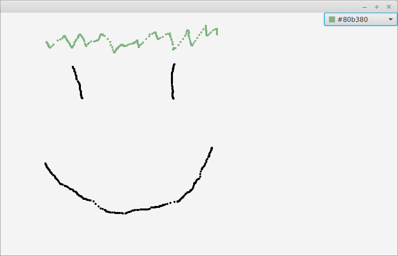
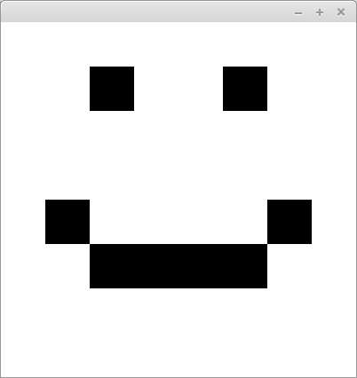
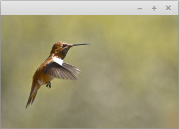
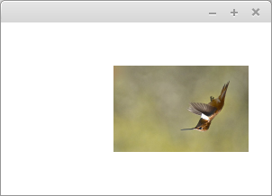
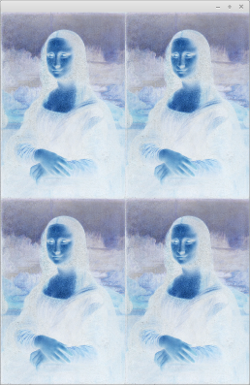
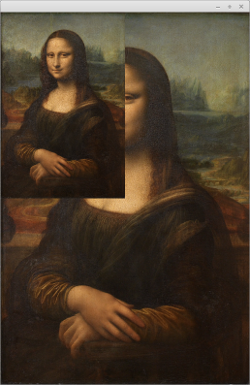
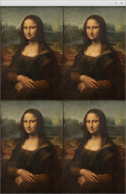

<text-box pixelColorant='learningObjectives' name='Learning Objectives'>

- Know ways to use multimedia as a part of graphical UI.
- Can draw a graphical UI.
- Can display images on a graphical UI.
- Can play sound from a graphical UI.

</text-box>


<!-- Tutustutaan seuraavaksi lyhyesti multimedian käyttöön JavaFX-sovelluksissa. -->
This part servers as a short introduction to using multimedia in JavaFX applications.

<!-- ## Piirtäminen -->
## Drawing

<!-- JavaFX-käyttöliittymäkirjastossa piirtämiseen käytetään [Canvas](https://docs.oracle.com/javase/8/javafx/api/javafx/scene/canvas/Canvas.html)-oliota. Canvas-olio edustaa tyhjää taulua, johon voi piirtää. Piirtäminen tapahtuu Canvas-oliolta saatavalla [GraphicsContext](https://docs.oracle.com/javase/8/javafx/api/javafx/scene/canvas/GraphicsContext.html)-oliolla. -->
The JavaFX interface library uses a [Canvas](https://docs.oracle.com/javase/8/javafx/api/javafx/scene/canvas/Canvas.html) object for drawing.
A Canvas object can be thought of as a empty canvas we can draw on.
We use a [GraphicsContext](https://docs.oracle.com/javase/8/javafx/api/javafx/scene/canvas/GraphicsContext.html) object provided by a Canvas object to draw on it.


<!-- Alla olevassa esimerkissä on luotu yksinkertainen piirto-ohjelma. Ohjelmassa luodaan 640 pikseliä leveä ja 480 pikseliä korkea paintingCanvas, joka asetetaan BorderPane-paintingLayoutn keskelle. Tämän lisäksi luodaan piirtovärin valintaan käytettävä [ColorPicker](https://docs.oracle.com/javase/8/javafx/api/javafx/scene/control/ColorPicker.html)-olio, jolta saa tietoonsa kullakin hetkellä valittuna olevan värin. Värin valitsin asetetaan BorderPane-paintingLayoutn oikealle laidalle. Piirtoalustaan lisätään hiiren liikkumista kuunteleva tapahtuman käsittelijä. Kun hiirtä liikutetaan nappi pohjassa (onMouseDragged), kutsutaan GraphicsContext-olion värin asetusmetodia sekä piirretään hiiren kohtaan pieni ympyrä. -->
Below we have created a simple drawing application.
The application creates a 640 pixels wide and 480 pixels tall canvas, which is then placed to the middle of a BorderPane object.
It also creates a [ColorPicker](https://docs.oracle.com/javase/8/javafx/api/javafx/scene/control/ColorPicker.html) object for selecting the color to draw with. ColorPicker can also tell us the currently selected color.
The ColorPicker is placed to the right side of the BorderPane.
We have added a event handler to the Canvas. The event handler listens to mouse movements. When user moves the mouse while pressing the right mouse button (onMouseDragged), the event handler calls the color selector method of the GraphicContext object, and draws a small circle to the cursor location.


```java
// packages

import javafx.application.Application;
import javafx.scene.Scene;
import javafx.scene.canvas.Canvas;
import javafx.scene.canvas.GraphicsContext;
import javafx.scene.control.ColorPicker;
import javafx.scene.layout.BorderPane;
import javafx.stage.Stage;

public class MiniPaint extends Application {

    @Override
    public void start(Stage window) {

        Canvas paintingCanvas = new Canvas(640, 480);
        GraphicsContext painter = paintingCanvas.getGraphicsContext2D();

        ColorPicker colorPalette = new ColorPicker();

        BorderPane paintingLayout = new BorderPane();
        paintingLayout.setCenter(paintingCanvas);
        paintingLayout.setRight(colorPalette);

        paintingCanvas.setOnMouseDragged((event) -> {
            double xLocation = event.getX();
            double yLocation = event.getY();
            painter.setFill(colorPalette.getValue());
            painter.fillOval(xLocation, yLocation, 4, 4);
        });

        Scene view = new Scene(paintingLayout);

        window.setScene(view);
        window.show();
    }

    public static void main(String[] args) {
        launch(MiniPaint.class);
    }
}
```


<!-- Sovellus näyttää seuraavanlaiselta. Alla sovellusta on käytetty jo hieman piirtämiseen. -->
The application looks like so. In the image below we have already drawn something with the application.




<!-- <programming-exercise name='Hymiö' tmcname='osa14-Osa14_06.Hymio'> -->

<programming-exercise name='Smiley' tmcname='part14-Part14_06.Smiley'>

<!-- Luo tehtäväpohjassa olevaan luokkaan graafinen käyttöliittymä. Lisää graafiseen käyttöliittymään paintingLayoutsta vastaava BorderPane-olio. Lisää BorderPanen keskellä Canvas-olio. Piirrä tämän jälkeen Canvas-olioon liittyvän GraphicsContext-olion avulla hymiö. Käytä taustan värinä valkoista (Color.WHITE) ja hymiön värinä mustaa (Color.BLACK). -->

Create a graphical user interface into the class that is supplied with the exercise base. Add a BorderPane into the GUI to be responsible for the application's layout. Add a Canvas object in the middle of the BorderPane. After doing this, use the GraphicsContext object of the Canvas object to draw a smiley. Use white (Color.WHITE) as the background color, and black (Color.BLACK) as the color of the smiley.

<!-- Tehtävän testit tarkastavat vain, että piirrät windowan. Palauta tehtävä vasta kun saat hymiön piirtämisen toimimaan. Huomaa ettei tässä ole tarkoitus piirtää hymiötä esimerkiksi hiirellä -- käytä suoraan GraphicsContext-olion tarjoamia metodeja siten että image on piirrettynä heti ohjelman käynnistyessä. -->

The tests in this exercise only check that you draw into the window. Before returning, make sure that drawing the smiley works correctly. Notice that the purpose here is NOT to manually draw the smiley with the mouse -- use the methods of the GraphicsContext object so that the picture is already drawn when the program is first started.



</programming-exercise>


## Images

<!-- Kuvan näyttämiseen osana sovellusta on useita tapoja. Eräs suoraviivainen lähestymistapa hyödyntää JavaFx:n [Image](https://docs.oracle.com/javafx/2/api/javafx/scene/image/Image.html) ja [ImageView](https://docs.oracle.com/javase/8/javafx/api/javafx/scene/image/ImageView.html) luokkia. -->
There are many ways to display an image as a part of application's interface.
One straightforward way is to use the [Image](https://docs.oracle.com/javafx/2/api/javafx/scene/image/Image.html) and [ImageView](https://docs.oracle.com/javase/8/javafx/api/javafx/scene/image/ImageView.html) classes from JavaFX.

<!-- Image-luokalle annetaan parametrina avattavan imageFilen nimi -- nimeä tulee edeltää etuliite `file:`, joka kertoo imagen olevan tiedosto. Alla olevassa esimerkissä ladataan tiedosto `humming.jpg`, joka annetaan luotavalle ImageView-oliolle parametrina. Tämän jälkeen ImageView-olio asetetaan Pane-paintingLayoutun -- Pane-paintingLayout ei ota mm. kantaa sen sisältävien elementtien sijaintiin. Lopulta paintingLayout asetetaan osaksi Scene-oliota ja se asetetaan näkyville. -->
We pass the name of the image file to the Image class as an argument. The file name must be preceded with the prefix `file:`, with which we tell the application the image is a file in the file system.
In the example below we first load the file `humming.jpg` and then pass it to a ImageView object we create as an argument.
The ImageView object is then placed to a Pane object. Note that Pane is not used to arrange layout items -- it does not care how items within it are placed on a screen.

Finally we place the Pane to a Scene object, and display the Scene.


```java
import javafx.application.Application;
import static javafx.application.Application.launch;
import javafx.scene.Scene;
import javafx.scene.image.Image;
import javafx.scene.image.ImageView;
import javafx.scene.layout.Pane;
import javafx.stage.Stage;

public class ImageApplication extends Application {

    @Override
    public void start(Stage stage) {

        Image imageFile = new Image("file:humming.jpg");
        ImageView image = new ImageView(imageFile);

        Pane frame = new Pane();
        frame.getChildren().add(image);

        stage.setScene(new Scene(frame));
        stage.show();

    }

    public static void main(String[] args) {
        launch(args);
    }
}
```


<!-- Ohjelman suorittaminen luo seuraavanlaisen windown. Tässä oletetaan, että tiedosto `humming.jpg` on olemassa, ja että se löytyy projektin juuresta (samasta kansiosta kuin tiedosto `pom.xml`). -->
Below you can see the window that opens when the program is run.

Here we expect that the file `humming.jpg` exists and is located at the root of the project (the same directory as for example `pom.xml`).





<!-- Esimerkissä käytetään [Linda Tanner](https://www.flickr.com/photos/15323831@N05)in imagea osoitteesta [http://www.freestockphotos.biz/stockphoto/17874](http://www.freestockphotos.biz/stockphoto/17874). Kuva on lisensoitu [Creative Commons CC BY 2.0](https://creativecommons.org/licenses/by/2.0/)-lisenssillä. -->
In the example we use an image by [Linda Tanner](https://www.flickr.com/photos/15323831@N05) from [http://www.freestockphotos.biz/stockphoto/17874](http://www.freestockphotos.biz/stockphoto/17874). The image has a [Creative Commons CC BY 2.0](https://creativecommons.org/licenses/by/2.0/) lisence.

<!-- ImageView-olio tarjoaa joukon menetelmiä imagen (yksinkertaiseen käsittelyyn). Kuvaa voi muunmuassa kääntää, sen kokoa voi muuttaa, ja sitä voi siirtää ruudulla. Alla olevassa esimerkissä image on käännetty ympäri, sen koko on puolitettu, ja sitä on siirretty hieman oikealle. -->
ImageView object has a punch of methods available for (simple) image processing tasks. We can for example change the size of an image, flip it around or move it on the screen.
Below we have flipped the image, halved its size and moved it a bit to the right.


```java
@Override
public void start(Stage stage) {

    Image imageFile = new Image("file:humming.jpg");
    ImageView image = new ImageView(imageFile);

    image.setRotate(180);
    image.setScaleX(0.5);
    image.setScaleY(0.5);

    image.setTranslateX(50);

    Pane frame = new Pane();
    frame.getChildren().add(image);

    stage.setScene(new Scene(frame));
    stage.show();
}
```




<!-- ImageView-luokka tarjoaa pääsyn imagean, mutta sen kautta ei pääse yksittäisiin pikseleihin (eli yksittäisiin yhtä väriä sisältäviin pieniin "frameihin", joista image koostuu). Kuvan yksittäisiä pikseleitä voi lukea Image-oliosta saatavan [PixelReader](https://docs.oracle.com/javafx/2/api/javafx/scene/image/PixelReader.html)-olion avulla. PixelReader-olion avulla voidaan käydä koko image läpi pikseli pikseliltä, samalla imagea erilliseen [WritableImage](https://docs.oracle.com/javafx/2/api/javafx/scene/image/WritableImage.html)-olioon kirjoittaen. -->
We can access an image trough the ImageView class, but it does not let us access separate pixels (the small "frames" containing a single color an Image is formed off of) within it.

We can access the separate pixels of an image using a [PixelReader](https://docs.oracle.com/javafx/2/api/javafx/scene/image/PixelReader.html) object available from the Image class.
PixelReader object can be used to go trough an image pixel by pixel, simultaneously writing a new image to a separate [WritableImage](https://docs.oracle.com/javafx/2/api/javafx/scene/image/WritableImage.html) object.

<!-- Alla olevassa esimerkissä image kopioidaan pikseli pikseliltä erilliselle WritableImage-oliolle, joka näytetään sovelluksessa. -->
Below we copy an image pixel by pixel to a separate WritableImage object, and display it in the application.

```java
@Override
public void start(Stage stage) {

    Image imageFile = new Image("file:humming.jpg");

    PixelReader pixels = imageFile.getPixelReader();

    int width = (int) imageFile.getWidth();
    int height = (int) imageFile.getHeight();

    WritableImage targetImage = new WritableImage(width, height);
    PixelWriter writer = targetImage.getPixelWriter();

    for (int y = 0; y < height; y++) {
        for (int x = 0; x < width; x++) {

            Color pixelColor = pixels.getColor(x, y);
            double red = pixelColor.getRed();
            double green = pixelColor.getGreen();
            double blue = pixelColor.getBlue();
            double opacity = pixelColor.getOpacity();

            Color newColor = new Color(red, green, blue, opacity);

            writer.setColor(x, y, newColor);
        }
    }

    ImageView image = new ImageView(targetImage);

    Pane pane = new Pane();
    pane.getChildren().add(image);

    stage.setScene(new Scene(pane));
    stage.show();
}
```

<!-- Kuvan ulkomuoto ei ole muuttunut lainkaan. -->
The image looks just like it did before copying.


<!-- <programming-exercise name='Kollaasi (3 osaa)' tmcname='osa14-Osa14_07.Kollaasi'> -->

<programming-exercise name='Collage (3 parts)' tmcname='part14-Part14_07.Collage'>

<!-- Andy Warhol tuli tutuksi imagekollaaseista, joissa yksi tai useampi image toistui useampaan otteeseen esimerkiksi eri väreissä. -->

Andy Warhol was famous for his photo collages where one or more pictures are repeated multiple times with different colors, for instance.

<!-- Matkitaan tässä tehtävässä hänen tyyliään ja luodaan Andy Warholmainen versio klassisesta Mona Lisasta. Valmis ohjelma näyttää Mona Lisan seuraavan näköisenä. -->

In this exercise we are going to imitate his style and create an Andy Warhol-ish interpretation of the famous Mona Lisa. The finished program will show Mona Lisa looking like this:



<!-- Aloitetaan. -->

Let's begin.

<!-- <h2>Vasen yläkulma</h2> -->

<h2>Top left corner</h2>

<!-- Tehtäväpohjassa on ohjelma, joka lataa ja näyttää Mona Lisan. Tässä tehtävän osassa tavoitteenasi on luoda tilanne, missä Mona Lisa näkyy pienempänä imagena vasemmassa yläkulmassa. Pienemmän imagen koon tulee olla neljäsosa alkuperäisestä imagesta. -->

In the exercise base there is a program that loads and displays the Mona Lisa. In this section your goal is to create a situation where the Mona Lisa is displayed as a smaller image in the top left corner. The size of the smaller image should be one fourth of the original image.



<!-- Käytännössä siis koordinaattiin 0, 0 tulee kopioida koordinaatin 0, 0 arvo. Koordinaattiin 0, 1 koordinaatin 0, 2 arvo. Koordinaattiin 0, 2 koordinaatin 0, 4 arvo. Koordinaattiin 0, 3 koordinaatin 0, 6 arvo jne. Vastaavasti myös y-akselilla, eli esimerkiksi koordinaattiin 1, 1 koordinaatin 2, 2 arvo, ja koordinaattiin 1, 2 koordinaatin 2, 4 arvo. -->

So in practice the point (0, 0) should contain the value at the coordinates (0, 0). The coordinates at (0, 1) should contain the value at coordinates (0, 2). Similarly, the point (0, 2) should contain the value at the point (0, 4), the point (0, 3) the value at (0, 6), etc. The same holds true with the y-axis, so point (1, 1) should have the value of (2, 2), the point (1, 2) the value of (2, 4), etc.

<!-- <h2>Ruudukko</h2> -->

<h2>Grid</h2>

<!-- Muokkaa seuraavaksi ohjelmaa siten, että edellisessä osassa vasempaan yläkulmaan luotu image toistuu imagessa neljään kertaan. Ensimmäisen imagen vasemman yläkulman tulee olla koordinaatissa 0, 0. Toisen imagen vasemman yläkulman tulee olla koordinaatissa (imagen width / 2), 0. Kolmannen imagen vasemman yläkulman tulee olla koordinaatissa 0, (imagen height / 2). Neljännen imagen vasemman yläkulman tulee olla koordinaatissa (imagen width / 2), (imagen height / 2). -->

Then modify the program so that the small image at the top left corner is repeated four times in the whole collage. The top-left corner of the first image should be at the coordinates (0, 0). The top-left corner of the second image should be at the point (width of image / 2, 0). The top-left corner of the third image should be at (0, height of image / 2), and the top-left corner of the fourth image should be at (width of image / 2, height of image / 2).




<!-- <h2>Negatiivi</h2> -->

<h2>Negative</h2>

<!-- Kun olet saanut muodostettua ruudukon, muokkaa imagea vielä siten, että imagessa näytetään negatiivi alkuperäisen imagen sijaan. Negatiivin luominen onnistuu ottamalla jokaisen pikselin värin erotus luvusta yksi, esim. `red = 1.0 - red`. -->

You've come this far, and now you can display a grid of four small images. Next, modify the image so that the negative of the original is displayed. You can create a negative by assigning to each pixel, the following color values: the subtraction of the original color from 1. So for the red color this would be `red = 1.0 - red`.


<!-- *Tehtäväpohjan mukana tuleva Mona Lisa -image on noudettu Wikimedian osoitteesta [https://commons.wikimedia.org/wiki/Category:Mona_Lisa](https://commons.wikimedia.org/wiki/Category:Mona_Lisa). Käytetty image on vapaasti käytettävissä.* -->

*The Mona Lisa image included in the exercise base has been downloaded from the Wikimedia path [https://commons.wikimedia.org/wiki/Category:Mona_Lisa](https://commons.wikimedia.org/wiki/Category:Mona_Lisa). It can be used freely.*

</programming-exercise>


## Sounds

<!-- Äänitiedostojen käsittelyyn löytyy myös useampia menetelmiä, joista tässä käsitellään yksi tapa. Tapa liittyy äänitiedostojen käsittelyyn äänileikkeinä (audioclip), jotka ovat esimerkiksi ääniefektejä ym. -->
There are multiple ways to handle sound files, and here we will go trough one of them.
We will handle sound files as audio clips, which can be for example sound effects.


<!-- Esimerkissä käytetään Daniel Simionin [Creative Commons Attribution 3.0](https://creativecommons.org/licenses/by/3.0/)-lisenssillä julkaisemaa äänitiedostoa. Äänitiedoston voi kuunnella alla. Äänitiedosto on noudettu osoitteessa [http://soundbible.com/](http://soundbible.com/) olevasta palvelusta. -->
In the example we use a sound file by Daniel Simionin, which has a
[Creative Commons Attribution 3.0](https://creativecommons.org/licenses/by/3.0/) lisence.
The file has been downloaded from [http://soundbible.com/](http://soundbible.com/).
<br/>

<audio controls>
<source src="../img/front-desk-bells-daniel_simon.wav" type="audio/wav"/>
</audio>

<!-- Oletetaan, että tiedoston nimi on `bell.wav`, ja että se sijaitsee projektin juuressa. Yksinkertaisimmillaan äänen soittaminen tapahtuu seuraavasti. -->
We expect the file is called `bell.wav` and is located at the root of the project.
The simplest way to play a sound is as follows:

```java
AudioClip sound = new AudioClip("file:bell.wav");
sound.play();
```

<!-- AudioClip-olion toiminta on riippuvainen JavaFx:n kirjastoista, joten äänitiedosto tulee käynnistää osana JavaFx-ohjelmaa. Allaoleva esimerkki etsii projektin juuresta tiedostoa `bell.wav` ja luo siitä äänileikkeen. Tämän jälkeen äänileike soitetaan, ja sovellukseen liittyvä (tyhjä) window avataan. -->
AudioClip object is dependent on the JavaFX library, so the sound file must be played as a part of a JavaFX application.
The example below searches for the file `bell.wav` from the root of the project, and creates an audio clip from it. Then the audio clip is played, and the application window (currently empty) opens.


```java
import javafx.application.Application;
import static javafx.application.Application.launch;
import javafx.scene.media.AudioClip;
import javafx.stage.Stage;

public class AudioClipApplication extends Application {

    @Override
    public void start(Stage stage) {

        AudioClip sound = new AudioClip("file:bell.wav");
        sound.play();

        stage.show();
    }

    public static void main(String[] args) {
        launch(args);
    }

}
```

<!-- <programming-exercise name='Hurraa' tmcname='osa14-Osa14_08.Hurraa'> -->

<programming-exercise name='Hurray' tmcname='part14-Part14_08.Hurray'>

<!-- Tehtäväpohjan juurikansiossa on tiedosto `Applause-Yannick_Lemieux.wav`, joka sisältää hurrausäänen. Tehtävänäsi on luoda sovellus, missä on "Hurraa"-nappi. Kun käyttäjä painaa nappia, sovelluksen tulee soittaa edellä mainittu äänitiedosto. -->

In the root folder of the exercise base there is a file called `Applause-Yannick_Lemieux.wav`. The file contains a hurray sound. Your task is to create a program that contains a "Hurray!" button. When the user clicks the button, the program should play the audio file included in the project.


<!-- *Äänitiedosto on Yannick Lemieuxin nauhoittama. Tiedosto on lisensoitu Creative Commonsin Attribuutiolisenssillä [https://creativecommons.org/licenses/by/3.0/](https://creativecommons.org/licenses/by/3.0/).* -->

*The audio file is recorded by Yannick Lemieux. It is licensed with the Creative Commons attribution license [https://creativecommons.org/licenses/by/3.0/](https://creativecommons.org/licenses/by/3.0/).*


</programming-exercise>


<text-box pixelColorant='hint' name='Creating a media player'>

<!-- Osoitteessa [https://examples.javacodegeeks.com/desktop-java/javafx/javafx-media-api/](https://examples.javacodegeeks.com/desktop-java/javafx/javafx-media-api/) on opas mediasoittimen luomiseen. Opas on varsin hyvä lähtökohta mikäli äänten soittaminen ja käsittely ohjelmallisesti kiinnostaa. -->

You can find a guide for creating a media player from [https://examples.javacodegeeks.com/desktop-java/javafx/javafx-media-api/](https://examples.javacodegeeks.com/desktop-java/javafx/javafx-media-api/).
The guide is a very good starting point if playing and processing sound programmatically interests you.

</text-box>
