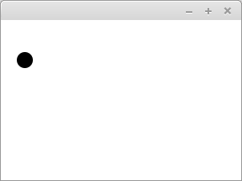
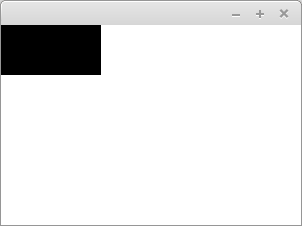
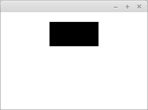
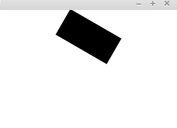
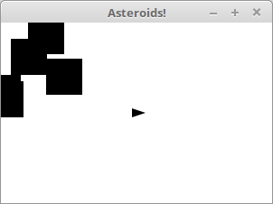
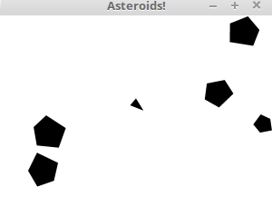
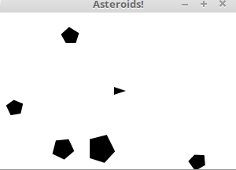
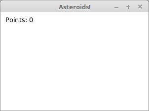
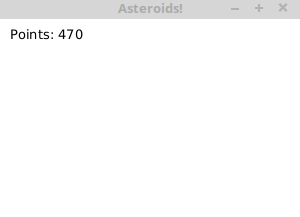
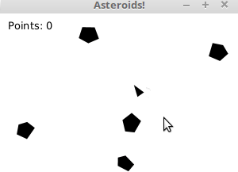

<!-- <text-box variant='learningObjectives' name='Oppimistavoitteet'> -->
<text-box variant='learningObjectives' name='Learning objectives'>

<!-- - Tiedät tavan interaktiivisen pelin toteuttamiseen. -->
<!-- - Näet miten laajempi sovellus rakentuu askel askeleelta. -->
<!-- - Harjoittelet askeleittaisten ohjeiden seuraamista laajemman sovelluksen rakentamiseksi. -->

- You know a way of implementing an interactive game.
- You are able to picture how a larger application is built on step by step.
- You practice following step by step instructions for building a larger application.

</text-box>

<!-- [Asteroids](https://en.wikipedia.org/wiki/Asteroids_(video_game)) on [Atari](https://en.wikipedia.org/wiki/Atari,_Inc.)n kehittämä ja vuonna 1979 julkaisema tietokonepeliklassikko. Pelissä pelaaja ohjaa kolmionmuotoista avaruusalusta, ja pelin tavoitteena on tuhota asteroideja niitä ampuen. -->

[Asteroids](https://en.wikipedia.org/wiki/Asteroids_(video_game)) developed by [Atari](https://en.wikipedia.org/wiki/Atari,_Inc.) and self published in the year 1979 is a video game classic. The gameplay consists of the player steering a triangular spaceship, with the goal of destroying asteroids by shooting them.

<!-- Seuraavaksi tehdään laajempi esimerkki, missä toteutetaan osa Asteroids-pelistä. Peli on myös kurssin tehtävänä -- tee peli esimerkkiä seuraten annettuun tehtäväpohjaan (esimerkin lopussa). -->

What follows is a larger scale example, where we create a part of the Asteroids game. The game is also an exercise in the course -- write the game into the provided template (at the end of the example) by following the example.

<!-- Peli koostetaan useammassa osassa, jotka ovat seuraavat: -->
The game is constructed in multiple parts, which are the following:

<!-- - Peliruudun luominen -->
- Creating the game window

<!-- - Aluksen luominen -->
- Creating the ship

<!-- - Aluksen kääntäminen -->
- Turning the ship

<!-- - Aluksen liikuttaminen -->
- Moving the ship

<!-- - Asteroidin luominen -->
- Creating an asteroid

<!-- - Aluksen ja asteroidin törmääminen -->
- The collision between the ship and an asteroid

<!-- - Useampi asteroidi -->
- Multiple asteroids

<!-- - Ruudussa pysyminen -->
- Staying within the window

<!-- - Ammukset -->
- Projectiles

<!-- - Pisteiden lisääminen -->
- Adding points

<!-- - Asteroidien jatkuva lisääminen -->
- Continuous adding of asteroids

<!-- Aloitetaan ohjelman luominen peliruudun luomisesta. -->

Let's begin making the application by creating the game window

<!-- ## Peliruudun luominen -->
## Creating the game window

<!-- Rakennetaan ohjelma niin, että ohjelman ruutu voi sisältää vapaavalintaisen määrän elementtejä, joiden sijaintiin käytettävä asettelu ei ota kantaa. Tähän sopii hyvin luokka [Pane](https://docs.oracle.com/javase/8/javafx/api/javafx/scene/layout/Pane.html). Luokka Pane sisältää edellisestä [ObservableList](https://docs.oracle.com/javase/8/javafx/api/javafx/collections/ObservableList.html)-tyyppisen listan lapsielementtejä. Listaan pääsee käsiksi Pane-luokan metodin `getChildren`-kautta. -->

We will build the application such that the game window may contain an arbitrary amount of elements, the positions of which will be ignored by the layout used. This task fits the [Pane](https://docs.oracle.com/javase/8/javafx/api/javafx/scene/layout/Pane.html) class. The Pane class contains a list of type [ObservableList](https://docs.oracle.com/javase/8/javafx/api/javafx/collections/ObservableList.html) containing child elements. The list can be accessed using the `getChildren` method of the Pane class.

<!-- Alla olevassa esimerkissä on ohjelma, joka luo 300 pikseliä leveän ja 200 pikseliä korkean ruudun. Ruudussa on kohdassa 30, 50 ympyrä, jonka säde on 10 pikseliä. Tietokoneohjelmissa koordinaatiston origo on tyypillisesti ikkunan vasemmassa yläkulmassa. Lisäksi y-koordinaatin arvo kasvaa alaspäin mennessä. -->

The program shown below creates a window that is 300 pixels wide and 200 pixels tall. At the point 30, 50 in the window is a circle with a radius of 10 pixels. In computer programs it is typical for the origin of the coordinate system is placed at the top left corner of the window. Additionally the value of the y-coordinate increases when moving down.

<!-- ```java
import javafx.application.Application;
import javafx.scene.Scene;
import javafx.scene.layout.Pane;
import javafx.scene.shape.Circle;
import javafx.stage.Stage;

public class PaneEsimerkki extends Application {

    @Override
    public void start(Stage stage) throws Exception {
        Pane ruutu = new Pane();
        ruutu.setPrefSize(300, 200);
        ruutu.getChildren().add(new Circle(30, 50, 10));

        Scene scene = new Scene(ruutu);
        stage.setScene(scene);
        stage.show();
    }

    public static void main(String[] args) {
        launch(args);
    }
}
``` -->

```java
import javafx.application.Application;
import javafx.scene.Scene;
import javafx.scene.layout.Pane;
import javafx.scene.shape.Circle;
import javafx.stage.Stage;

public class PaneExample extends Application {

    @Override
    public void start(Stage stage) throws Exception {
        Pane pane = new Pane();
        pane.setPrefSize(300, 200);
        pane.getChildren().add(new Circle(30, 50, 10));

        Scene scene = new Scene(pane);
        stage.setScene(scene);
        stage.show();
    }

    public static void main(String[] args) {
        launch(args);
    }
}
```




<!-- Kutsutaan ohjelmaamme AsteroidsSovellukseksi. AsteroidsSovellus mukailee yllä olevaa esimerkkiä. Sovelluksessa ei aseteta ruutuun ympyrää, mutta sovellukselle on asetettu otsikko. Ikkunan leveys on 600 pikseliä ja korkeus 400 pikseliä. -->

We call our application `AsteroidsApplication`. AsteroidsApplication applies the above example. The application does not add a circle to the window, but we have provided a title for the application. The width of the window is 600 pixels and the height is 400 pixels.

<!-- ```java
import javafx.application.Application;
import javafx.scene.Scene;
import javafx.scene.layout.Pane;
import javafx.stage.Stage;

public class AsteroidsApplication extends Application {

    @Override
    public void start(Stage stage) throws Exception {
        Pane ruutu = new Pane();
        ruutu.setPrefSize(600, 400);

        Scene scene = new Scene(ruutu);
        stage.setTitle("Asteroids!");
        stage.setScene(scene);
        stage.show();
    }

    public static void main(String[] args) {
        launch(args);
    }
}
``` -->

```java
import javafx.application.Application;
import javafx.scene.Scene;
import javafx.scene.layout.Pane;
import javafx.stage.Stage;

public class AsteroidsApplication extends Application {

    @Override
    public void start(Stage stage) throws Exception {
        Pane pane = new Pane();
        pane.setPrefSize(600, 400);

        Scene scene = new Scene(pane);
        stage.setTitle("Asteroids!");
        stage.setScene(scene);
        stage.show();
    }

    public static void main(String[] args) {
        launch(args);
    }
}
```

<!-- ## Aluksen luominen -->
## Creating the ship


<!-- Luodaan ohjelmaan seuraavaksi alus. Asteroidsissa alus on kolmio. Kolmion esittäminen onnistuu monikulmiota kuvaavan [Polygon](https://docs.oracle.com/javase/8/javafx/api/javafx/scene/shape/Polygon.html)-luokan avulla. Monikulmion kulmat asetetaan Polygon-oliolle joko konstruktorin parametrina tai Polygon-luokan sisältämään listaan. Listaan pääsee käsiksi metodilla `getPoints`. -->

Next we create the ship. In Asteroids the ship is a triangle. The display of the triangle is possible using the [Polygon](https://docs.oracle.com/javase/8/javafx/api/javafx/scene/shape/Polygon.html) class, which is used to represent polygons. The corners of the polygon are set for the Polygon object, either as parameters of the constructor or into the list contained within the Polygon class.

<!-- Alla olevassa esimerkissä ruutuun on lisätty 100 pikseliä leveä ja 50 pikseliä korkea suunnikas, joka on luotu Polygon-luokan avulla. -->

In the example below we have added a parallelogram that is 100 pixels wide and 50 pixels tall using the Polygon class.

<!-- ```java
@Override
public void start(Stage stage) throws Exception {
    Pane ruutu = new Pane();
    ruutu.setPrefSize(300, 200);

    Polygon suunnikas = new Polygon(0, 0, 100, 0, 100, 50, 0, 50);
    ruutu.getChildren().add(suunnikas);

    Scene scene = new Scene(ruutu);
    stage.setScene(scene);
    stage.show();
}
``` -->

```java
@Override
public void start(Stage stage) throws Exception {
    Pane pane = new Pane();
    pane.setPrefSize(300, 200);

    Polygon parallelogram = new Polygon(0, 0, 100, 0, 100, 50, 0, 50);
    pane.getChildren().add(parallelogram);

    Scene scene = new Scene(pane);
    stage.setScene(scene);
    stage.show();
}
```




<!-- Polygon-olion siirtäminen sopivampaan paikkaan onnistuu sen tarjoamien `setTranslateX` ja `setTranslateY`-metodien avulla. Alla olevassa esimerkissä luodaan edellistä esimerkkiä vastaava suunnikas, mutta nyt suunnikasta on siirretty 100 pikseliä oikealle ja 20 pikseliä alas. -->

Moving the polygon into a more fitting position can be done with the provided methods `setTranslateX` and `setTranslateY` of the Polygon class. In the example below we create a parallelogram just like before, but now the parallelogram has been moved 100 pixels to the right and 20 pixels down.

<!-- ```java
@Override
public void start(Stage stage) throws Exception {
    Pane ruutu = new Pane();
    ruutu.setPrefSize(300, 200);

    Polygon suunnikas = new Polygon(0, 0, 100, 0, 100, 50, 0, 50);
    suunnikas.setTranslateX(100);
    suunnikas.setTranslateY(20);

    ruutu.getChildren().add(suunnikas);

    Scene scene = new Scene(ruutu);
    stage.setScene(scene);
    stage.show();
}
``` -->

```java
@Override
public void start(Stage stage) throws Exception {
    Pane pane = new Pane();
    pane.setPrefSize(300, 200);

    Polygon parallelogram = new Polygon(0, 0, 100, 0, 100, 50, 0, 50);
    parallelogram.setTranslateX(100);
    parallelogram.setTranslateY(20);

    pane.getChildren().add(parallelogram);

    Scene scene = new Scene(pane);
    stage.setScene(scene);
    stage.show();
}
```




<!-- Luodaan alusta kuvaava kolmio ja lisätään se aiempaan AsteroidsSovellukseemme. Siirretään hahmo ruudun keskelle -- koska ruudun leveys on 600 pikseliä ja ruudun korkeus on 400 pikseliä, hahmoa siirretään 300 pikseliä oikealla ja 200 pikseliä alas. -->

Let's create a triangle representing the ship and add it to our AsteroidsApplication. We set the triangle at the center of the screen -- because the width of the screen is 600 pixels and the height is 400 pixels, we move the triangle 300 pixels to the right and 200 pixels down.

<!-- ```java
import javafx.application.Application;
import javafx.scene.Scene;
import javafx.scene.layout.Pane;
import javafx.scene.shape.Polygon;
import javafx.stage.Stage;

public class AsteroidsSovellus extends Application {

    @Override
    public void start(Stage stage) throws Exception {
        Pane ruutu = new Pane();
        ruutu.setPrefSize(600, 400);

        Polygon alus = new Polygon(-5, -5, 10, 0, -5, 5);
        alus.setTranslateX(300);
        alus.setTranslateY(200);

        ruutu.getChildren().add(alus);

        Scene scene = new Scene(ruutu);
        stage.setTitle("Asteroids!");
        stage.setScene(scene);
        stage.show();
    }

    public static void main(String[] args) {
        launch(args);
    }
}
``` -->

```java
import javafx.application.Application;
import javafx.scene.Scene;
import javafx.scene.layout.Pane;
import javafx.scene.shape.Polygon;
import javafx.stage.Stage;

public class AsteroidsApplication extends Application {

    @Override
    public void start(Stage stage) throws Exception {
        Pane pane = new Pane();
        pane.setPrefSize(600, 400);

        Polygon ship = new Polygon(-5, -5, 10, 0, -5, 5);
        ship.setTranslateX(300);
        ship.setTranslateY(200);

        pane.getChildren().add(ship);

        Scene scene = new Scene(pane);
        stage.setTitle("Asteroids!");
        stage.setScene(scene);
        stage.show();
    }

    public static void main(String[] args) {
        launch(args);
    }
}
```

<!-- ## Aluksen kääntäminen: Näppäimistön kuuntelija, osa 1 -->
## Turning the ship: Keyboard listener, part 1

<!-- Luokat kuten Polygon ja Circle perivät JavaFx:n [Node](https://docs.oracle.com/javase/8/javafx/api/javafx/scene/Node.html)-luokan. Node-luokalla on valmiina muuttuja `rotate`, joka kuvaa esineen käännöstä asteina. Minkä tahansa Node-luokan perivän olion kääntäminen on siis melko suoraviivaista -- tarvitsee vain käyttää valmista metodia `setRotate`. Metodille annetaan parametrina käännöksen asteluku. -->

Classes like Polygon and Circle inherit the [Node](https://docs.oracle.com/javase/8/javafx/api/javafx/scene/Node.html) class of JavaFx. The Node class has a variable `rotate`, which describes the rotation of the node in degrees. Turning any object inheriting the Node class is therefore quite straightforward -- you just use the existing method `setRotate`. The method is given the amount to turn in degrees as its parameter.

<br/>

<!-- Alla olevassa esimerkissä edellä nähtyä esimerkkiä on muunnettu siten, että alusta on käännetty 30 astetta. -->
In the example below we have modified a previous example such that the parallelogram is rotated 30 degrees.

<!-- ```java
@Override
public void start(Stage stage) throws Exception {
    Pane ruutu = new Pane();
    ruutu.setPrefSize(600, 400);

    Polygon alus = new Polygon(-5, -5, 10, 0, -5, 5);
    alus.setTranslateX(300);
    alus.setTranslateY(200);
    alus.setRotate(30);

    ruutu.getChildren().add(alus);

    Scene scene = new Scene(ruutu);
    stage.setScene(scene);
    stage.show();
}
``` -->

```java
@Override
public void start(Stage stage) throws Exception {
    Pane pane = new Pane();
    pane.setPrefSize(600, 400);

    Polygon ship = new Polygon(-5, -5, 10, 0, -5, 5);
    ship.setTranslateX(300);
    ship.setTranslateY(200);
    ship.setRotate(30);

    pane.getChildren().add(ship);

    Scene scene = new Scene(pane);
    stage.setScene(scene);
    stage.show();
}
```

<!-- Todellisuudessa emme kuitenkaan halua tilannetta, missä alus kääntyy vain kerran, vaan tilanteen, missä alusta voi ohjata pelin käynnissäollessa. Tarvitsemme siis tapahtumankuuntelijan, joka kuuntelee näppäimistöä ja kääntää alusta näppäimistön painalluksen yhteydessä. -->

In reality we don't want a situation where the ship only turns once, but one in which we can steer the ship while the game is running.

<!-- Ikkunan sisältöä kuvaava `Scene`-olio tarjoaa metodin `setOnKeyPressed`, jolle voidaan antaa parametrina tapahtumia käsittelevä olio. Luodaan tapahtumankäsittelijä, joka reagoi näppäimistöön. Näppäimistötapahtumiin liittyy enumeroitu muuttuja `KeyCode`, joka kertoo painetun napin. Olemme kiinnostuneita napeista vasen (LEFT) ja oikea (RIGHT). -->

The `Scene` object describing the content of the window provides a method `setOnKeyPressed`, which can be given an object for handling events as its parameter. Let's create an event handler, which reacts to events on the keyboard. Keyboard events have an enumerated variable `KeyCode`, which tells us the key that was pressed. We are interested in the keys left (LEFT) and right (RIGHT).

<!-- Tehdään ensin testiversio, missä aluksen käännös on yksinkertainen. Jos käyttäjä painaa nuolta vasemmalle, asteeksi asetetaan -30. Jos taas käyttäjä painaa nuolta oikealle, asteeksi asetetaan 30. -->

First we make a test version, in which the turning of the ship is simple. If the user presses the left arrow, the degrees are set to -30. Then again, if the user presses the right key, then the degrees are set to 30.

<!-- ```java
scene.setOnKeyPressed(event -> {
    if (event.getCode() == KeyCode.LEFT) {
        alus.setRotate(-30);
    }

    if (event.getCode() == KeyCode.RIGHT) {
        alus.setRotate(30);
    }
});
``` -->

```java
scene.setOnKeyPressed(event -> {
    if (event.getCode() == KeyCode.LEFT) {
        ship.setRotate(-30);
    }

    if (event.getCode() == KeyCode.RIGHT) {
        ship.setRotate(30);
    }
});
```

<!-- Jos aluksen sijaan käytössä olisi suunnikas, ohjelman toiminta näyttäisi seuraavanlaiselta. -->

If the ship was a parallelogram the functionality would look as follows:


<!-- Käännöksen saa tasaiseksi hyödyntämällä tietoa olemassaolevasta käännöksestä. Alla olevassa esimerkissä alus kääntyy viisi astetta kerrallaan. -->

The turning can be made smoother by utilizing existing information about the rotation. In the next example the ship turns five degrees at a time.

<!-- ```java
scene.setOnKeyPressed(event -> {
    if (event.getCode() == KeyCode.LEFT) {
        alus.setRotate(alus.getRotate() - 5);
    }

    if (event.getCode() == KeyCode.RIGHT) {
        alus.setRotate(alus.getRotate() + 5);
    }
});
``` -->

```java
scene.setOnKeyPressed(event -> {
    if (event.getCode() == KeyCode.LEFT) {
        ship.setRotate(ship.getRotate() - 5);
    }

    if (event.getCode() == KeyCode.RIGHT) {
        ship.setRotate(ship.getRotate() + 5);
    }
});
```

<!-- Alla kuvattuna vastaava esimerkki, missä aluksen sijaan käännetään suunnikasta. -->

Below is pictured an equivalent example, where instead of rotating the ship we rotate a parallelogram.




<!-- ## Aluksen kääntäminen: Näppäimistön kuuntelija, osa 2 -->
## Turning the ship: Keyboard listener, part 2

<!-- Edellä kuvattu lähestymistapa mahdollistaa "ihan ok"-tyyppisen kääntämisen. Lähestymistavassa on samalla ongelma -- liike ei ole sulavaa. Kun nappia painaa, alus kääntyy, pitää pienen tauon, ja jatkaa vasta tämän jälkeen kääntymistä. -->

The previous approach enables a "kind of OK"-way to turn a node. There is an issue with the approach -- the movement is not smooth. When the key is pressed, the ship rotates, then takes a short break, after which it continues rotating.

<!-- Tämä liittyy siihen, miten ohjelmat oletuksena käsittelevät näppäinten painalluksen. Jos ohjelma käsittelisi näppäimen painalluksen useana tapahtumana heti kun näppäintä painetaan, muuttuisi esimerkiksi tekstin kirjoittaminen paljon hankalammaksi, sillä hieman pidemmät painallukset tuottaisivat heti useampia merkkejä. -->

This is related to how programs handle keyboard events by default. If the program would handle the keypress as multiple events immediately as the key is pressed, then, for example, writing text would become quite difficult, since even slightly longer keypresses would immediately generate multiple characters.

<!-- Muutetaan näppäinten käsittelyä siten, että pidämme kirjaa pohjassa olevista napeista. Tämä onnistuu (esimerkiksi) hajautustaulun avulla. Hajautustaulu sisältää avaimena KeyCode-olion, eli nappia kuvaavan olion, ja arvona Boolean-tyyppisen muuttujan. Jos tiettyyn nappiin liittyvän boolean-muuttujan arvo on `true`, nappi on pohjassa, muulloin nappi ei ole pohjassa. -->

Let's change the handling of keyboard event, such that we keep a record of pressed keys. This can be done, for example, using a hash table. The hash table contains the KeyCode object, i.e. the object representing the key, as the key and a Boolean variable as the value. If the value of the boolean variable of a particular key is `true`, then the key is pressed, otherwise the key is not pressed.

<!-- Nyt huomioidaan myös napin nostaminen, eli `onKeyReleased`-tapahtuma. -->
Now we also consider depressing the key, i.e. the `onKeyReleased` event.

<!-- ```java
Map<KeyCode, Boolean> painetutNapit = new HashMap<>();

scene.setOnKeyPressed(event -> {
    painetutNapit.put(event.getCode(), Boolean.TRUE);
});

scene.setOnKeyReleased(event -> {
    painetutNapit.put(event.getCode(), Boolean.FALSE);
});
``` -->

```java
Map<KeyCode, Boolean> pressedKeys = new HashMap<>();

scene.setOnKeyPressed(event -> {
    pressedKeys.put(event.getCode(), Boolean.TRUE);
});

scene.setOnKeyReleased(event -> {
    pressedKeys.put(event.getCode(), Boolean.FALSE);
});
```

<!-- Mutta! Eihän tuolla mikään nyt käännä alusta. -->

But! Nothing is currently turning the ship.

<!-- Ei niin. Tarvitsemme vielä kääntämistoiminnallisuuden. Otetaan käyttöön animaatioiden luomiseen tarkoitettu AnimationTimer-luokka, ja annetaan sen vastuulle aluksen kääntäminen mikäli vasen tai oikea nappi on pohjassa. -->

Indeed. We still need functionality for rotation. We will start using the AnimationTimer class, which is meant for creating animations, and assign it the responsibility of turning the the ship in case the left or right key is pressed.


<!-- ```java
Map<KeyCode, Boolean> painetutNapit = new HashMap<>();

scene.setOnKeyPressed(event -> {
    painetutNapit.put(event.getCode(), Boolean.TRUE);
});

scene.setOnKeyReleased(event -> {
    painetutNapit.put(event.getCode(), Boolean.FALSE);
});

new AnimationTimer() {

    @Override
    public void handle(long nykyhetki) {
        if(painetutNapit.getOrDefault(KeyCode.LEFT, false)) {
            alus.setRotate(alus.getRotate() - 5);
        }

        if(painetutNapit.getOrDefault(KeyCode.RIGHT, false)) {
            alus.setRotate(alus.getRotate() + 5);
        }
    }
}.start();
``` -->

```java
Map<KeyCode, Boolean> pressedKeys = new HashMap<>();

scene.setOnKeyPressed(event -> {
    pressedKeys.put(event.getCode(), Boolean.TRUE);
});

scene.setOnKeyReleased(event -> {
    pressedKeys.put(event.getCode(), Boolean.FALSE);
});

new AnimationTimer() {

    @Override
    public void handle(long now) {
        if(pressedKeys.getOrDefault(KeyCode.LEFT, false)) {
            ship.setRotate(ship.getRotate() - 5);
        }

        if(pressedKeys.getOrDefault(KeyCode.RIGHT, false)) {
            ship.setRotate(ship.getRotate() + 5);
        }
    }
}.start();
```

<!-- AnimationTimer-luokan maetodia `handle` kutsutaan noin 60 kertaa sekunnissa. Nyt kääntyminen on paljon sulavampaa (tosin, sitä ei alla olevasta gif-kuvasta taida huomata...). -->

The `handle` method of the AnimationTimer class is called approximately 60 times per second. Now the rotation is much smoother (however, it is not very apparent in the gif below...).


<!-- ## Aluksen liikuttaminen: Ensimmäinen yritys -->
## Moving the ship: First attempt

<!-- Alustamme pystyy nyt kääntämään. Lisätään seuraavaksi mahdollisuus liikkumiseen. Alus voi liikkua mihin tahansa ilmansuuntaan, eli liikkeen kuvaamiseen tarvitaan sekä x- että y-koordinaatin arvo. Konkreettinen liikkuminen tapahtuu muuntamalla alusta kuvaavan polygonin sijaintia ohjelman edetessä. -->

It's now possible to rotate the ship. Next, we'll add the possibility to move around. The ship should be able to move in any cardinal direction, which means that we need values for both x and y coordinates to represent movement. The concrete implementation of the movement is to modify the position of the polygon that represents the ship while the program is running.

<!-- Hyödynnetään Javan valmista [Point2D](https://docs.oracle.com/javase/8/javafx/api/javafx/geometry/Point2D.html)-luokkaa liikkeen kuvaamiseen -- luokalla on sekä x- että y-koordinaatti. -->

Let's make use of the existing [Point2D](https://docs.oracle.com/javase/8/javafx/api/javafx/geometry/Point2D.html) Java class to represent movement -- the class has both x and y coordinates.

<!-- Ensimmäinen testiversio on liike-muuttujan luominen sekä sen lisääminen AnimationTimer-luokan handle-metodiin. -->

The first test version is to create a movement variable and adding it to the AnimationTimer class's handle method.

<!-- ```java
Point2D liike = new Point2D(1, 0);
```

```java
new AnimationTimer() {

    @Override
    public void handle(long nykyhetki) {
        if(painetutNapit.getOrDefault(KeyCode.LEFT, false)) {
            alus.setRotate(alus.getRotate() - 5);
        }

        if(painetutNapit.getOrDefault(KeyCode.RIGHT, false)) {
            alus.setRotate(alus.getRotate() + 5);
        }

        alus.setTranslateX(alus.getTranslateX() + liike.getX());
    }
}.start();
``` -->

```java
Point2D movement = new Point2D(1, 0);
```

```java
new AnimationTimer() {

    @Override
    public void handle(long now) {
        if(pressedKeys.getOrDefault(KeyCode.LEFT, false)) {
            ship.setRotate(ship.getRotate() - 5);
        }

        if(pressedKeys.getOrDefault(KeyCode.RIGHT, false)) {
            ship.setRotate(ship.getRotate() + 5);
        }

        ship.setTranslateX(ship.getTranslateX() + movement.getX());
    }
}.start();
```

<!-- Huraa! Alus liikkuu (ja sitä voi kääntää). Se tosin katoaa aika nopeasti.. -->

Hurray! The ship is moving (and it can be rotated). Although it disappears quite quickly...


<!-- Valitsemamme Point2D luokka muistuttaa hieman String-luokkaa siinä, että se on *immutaabeli* eli muuttumaton. Emme voi muuttaa olemassaolevan pisteen arvoja, vaan pisteen metodien kutsuminen palauttaa aina uuden arvon. Tämä on hieman ongelmallista, sillä olioiden arvoja ei saa asettaa uudestaan metodien sisällä -- emme siis voi tehdä esimerkiksi seuraavasti. -->

The class that we chose, Point2D, is like the String class in some regards -- namely, it is *immutable* so it cannot be modified. We cannot change the values of an existing point, and calling the methods of a point always returns a new point value. This poses something of a problem, since we cannot set the values of the objects to something else inside methods. The following solution is therefore ruled out.

<!-- ```java
new AnimationTimer() {

    @Override
    public void handle(long nykyhetki) {
        // .. ei toimi ..
        if(painetutNapit.getOrDefault(KeyCode.UP, false)) {
            liike = liike.add(new Point2D(1, 1));
        }
        // ..
    }
}.start();
``` -->

```java
new AnimationTimer() {

    @Override
    public void handle(long now) {
        // .. does not work ..
        if(pressedKeys.getOrDefault(KeyCode.UP, false)) {
            movement = movement.add(new Point2D(1, 1));
        }
        // ..
    }
}.start();
```

<!-- Metodikutsut ovat kuitenkin sallittuja. Taitaa olla aika refaktoroinnille, eli ohjelman rakenteen selkeyttämiselle.. -->

However, method calls are allowed. Looks like it's time for refactoring and clearing up the structure of the program...

<!-- ## Aluksen liikuttaminen: Ohjelman refaktorointi -->

## Moving the ship: Refactoring

<!-- Luodaan luokka Alus, joka sisältää Polygon-olion sekä Point2D-olion. Polygon-olio kuvaa alusta, ja Point2D-olio aluksen liikettä. Alus saa konstruktorin parametrina aluksen x- ja y-koordinaatit, jonka lisäksi alusta voi kääntää vasemmalle ja oikealle. -->

Let's create a class called Ship, which contains a Polygon object and a Point2D object. The Polygon object represents the ship, and the Point2D object represents the movement of the ship. The ship receives the x and y coordinates of the ship as its constructor parameters. The ship can be rotated left or right.

<!-- ```java
import javafx.geometry.Point2D;
import javafx.scene.shape.Polygon;

public class Alus {

    private Polygon hahmo;
    private Point2D liike;

    public Alus(int x, int y) {
        this.hahmo = new Polygon(-5, -5, 10, 0, -5, 5);
        this.hahmo.setTranslateX(x);
        this.hahmo.setTranslateY(y);

        this.liike = new Point2D(0, 0);
    }

    public Polygon getHahmo() {
        return hahmo;
    }

    public void kaannaVasemmalle() {
        this.hahmo.setRotate(this.hahmo.getRotate() - 5);
    }

    public void kaannaOikealle() {
        this.hahmo.setRotate(this.hahmo.getRotate() + 5);
    }

    public void liiku() {
        this.hahmo.setTranslateX(this.hahmo.getTranslateX() + this.liike.getX());
        this.hahmo.setTranslateY(this.hahmo.getTranslateY() + this.liike.getY());
    }
}
``` -->

```java
import javafx.geometry.Point2D;
import javafx.scene.shape.Polygon;

public class Ship {

    private Polygon character;
    private Point2D movement;

    public Ship(int x, int y) {
        this.character = new Polygon(-5, -5, 10, 0, -5, 5);
        this.character.setTranslateX(x);
        this.character.setTranslateY(y);

        this.movement = new Point2D(0, 0);
    }

    public Polygon getCharacter() {
        return character;
    }

    public void turnLeft() {
        this.character.setRotate(this.character.getRotate() - 5);
    }

    public void turnRight() {
        this.character.setRotate(this.character.getRotate() + 5);
    }

    public void move() {
        this.character.setTranslateX(this.character.getTranslateX() + this.movement.getX());
        this.character.setTranslateY(this.character.getTranslateY() + this.movement.getY());
    }
}
```


<!-- Refaktoroinnin johdosta sovellusta tulee muuttaa muutamasta kohtaa. Liikettä kuvaavan pisteen sijaan ja alusta kuvaavan monikulmion sijaan luodaan Alus. Tämän lisäksi Pane-oliolle annetaan alukseen liittyvä Polygon-olio, mutta ei itse alus-oliota. -->

This refactoring leads to changes in the program in a couple of places. Instead of the point to represent movement and a polygon to represent the ship, we will create a Ship. In addition, the Pane object is given the Polygon object of the ship, but not the Ship object itself.


<!-- ```java
Alus alus = new Alus(150, 100);

ruutu.getChildren().add(alus.getHahmo());
``` -->

```java
Ship ship = new Ship(150, 100);

pane.getChildren().add(ship.getCharacter());
```

<!-- Myös AnimationTimer-olion metodia tulee päivittää siten, että metodissa hyödynnetään aluksen metodeja. -->

The method in the AnimationTimer object should also be updated to use the methods of the ship.

<!-- ```java
new AnimationTimer() {

    @Override
    public void handle(long nykyhetki) {
        if(painetutNapit.getOrDefault(KeyCode.LEFT, false)) {
            alus.kaannerent timings you should create a dedicated class for that. If each of them runs at a different speed, yo
        }

        if(painetutNapit.getOrDefault(KeyCode.RIGHT, false)) {
            alus.kaannaOikealle();
        }

        alus.liiku();
    }

}.start();
``` -->

```java
new AnimationTimer() {

    @Override
    public void handle(long now) {
        if(pressedKeys.getOrDefault(KeyCode.LEFT, false)) {
            ship.turnLeft();
        }

        if(pressedKeys.getOrDefault(KeyCode.RIGHT, false)) {
            ship.turnRight();
        }

        ship.move();
    }

}.start();
```

<!-- ## Aluksen liikuttaminen: Toinen yritys -->

## Moving the ship: Second attempt

<!-- Alus liikkuu, mutta aluksen liikettä ei voi vielä muuttaa. Lisätään alukselle kiihdytystoiminnallisuus. Kiihdytyksen tulee toimia niin, että aluksen nopeus kiihtyy aluksen osoittamaan suuntaan. Saamme kiihdytyksen monikulmion asteesta, jonka saa selville metodilla `getRotate()`. Olemme käyttäneet tätä jo paljon alusta kääntäessä. -->

The ship moves, but it's not possible to affect the movement yet. Let's add an acceleration functionality to the shpi. The ship should accelerate so that the speed accelerates to the direction that the ship points to. We can get the acceleration information from the rotation degree, which we can use the `getRotate()` method. We have already become well acquainted with it in rotating the ship.

<!-- Kiihdytyksen suunta saadaan selville sini- ja kosinifunktion avulla. Nämä löytyvät Javan valmiista [Math](https://docs.oracle.com/javase/8/docs/api/java/lang/Math.html)-luokasta. Metodit saavat parametrina asteen radiaaneina, joten joudumme hyödyntämään myös Math-luokan asteiden radiaaneiksi muuttavaa metodia. -->

The direction of the acceleration can be figured out with sine and cosine functions. The existing Java [Math](https://docs.oracle.com/javase/8/docs/api/java/lang/Math.html) class contains the relevant methods. The methods assume their parameters to be in radians, so we are also going to need the Math class method that converts degrees into radians.

<!-- ```java
double muutosX = Math.cos(Math.toRadians(*kulmaAsteina*));
double muutosY = Math.sin(Math.toRadians(*kulmaAsteina*));
``` -->

```java
double changeX = Math.cos(Math.toRadians(*angle in degrees*));
double changeY = Math.sin(Math.toRadians(*angle in degrees*));
```

<!-- Luokan Alus kiihdyta-metodin ensimmäinen versio on seuraavanlainen. -->

The first version of the accelerate method of the Ship class looks like this.

<!-- ```java
public void kiihdyta() {
    double muutosX = Math.cos(Math.toRadians(this.hahmo.getRotate()));
    double muutosY = Math.sin(Math.toRadians(this.hahmo.getRotate()));

    this.liike = this.liike.add(muutosX, muutosY);
}
``` -->

```java
public void accelerate() {
    double changeX = Math.cos(Math.toRadians(this.character.getRotate()));
    double changeY = Math.sin(Math.toRadians(this.character.getRotate()));

    this.movement = this.movement.add(changeX, changeY);
}
```

<!-- Lisätään sovellukseen vielä kiihdytystoiminnallisuus. Kiihdytysmetodia kutsutaan kun käyttäjä painaa ylös-nappia. -->

Let's add the possibility to accelerate into the application. The accelerate method is called when the user is pressing the up button.

<!-- ```java
new AnimationTimer() {

    @Override
    public void handle(long nykyhetki) {
        if(painetutNapit.getOrDefault(KeyCode.LEFT, false)) {
            alus.kaannaVasemmalle();
        }

        if(painetutNapit.getOrDefault(KeyCode.RIGHT, false)) {
            alus.kaannaOikealle();
        }

        if(painetutNapit.getOrDefault(KeyCode.UP, false)) {
            alus.kiihdyta();
        }

        alus.liiku();
    }
}.start();
``` -->

```java
new AnimationTimer() {

    @Override
    public void handle(long now) {
        if(pressedKeys.getOrDefault(KeyCode.LEFT, false)) {
            ship.turnLeft();
        }

        if(pressedKeys.getOrDefault(KeyCode.RIGHT, false)) {
            ship.turnRight();
        }

        if(pressedKeys.getOrDefault(KeyCode.UP, false)) {
            ship.accelerate();
        }

        ship.move();
    }
}.start();
```


<!-- Kuten huomaamme, alus kiihtyy. Kiihtyvyys on tosin aika kova, joten sitä on hyvä korjata hieman. Muokataan aluksen kiihdyta-metodia siten, että muutos on vain 5% edellisestä. -->

As can be seen, the ship accelerates, indeed. The amount of acceleration is quite high, so it should be tweaked somewhat. Let's modify the accelerate mehtod of the ship so that the change is only 5% of the previous value.


<!-- ```java
public void kiihdyta() {
    double muutosX = Math.cos(Math.toRadians(this.hahmo.getRotate()));
    double muutosY = Math.sin(Math.toRadians(this.hahmo.getRotate()));

    muutosX *= 0.05;
    muutosY *= 0.05;

    this.liike = this.liike.add(muutosX, muutosY);
}
``` -->

```java
public void accelerate() {
    double changeX = Math.cos(Math.toRadians(this.character.getRotate()));
    double changeY = Math.sin(Math.toRadians(this.character.getRotate()));

    changeX *= 0.05;
    changeY *= 0.05;

    this.movement = this.movement.add(changeX, changeY);
}
```

<!-- Nyt aluksen ohjaus on jotenkuten mahdollista. -->

Now it's more or less possible to steer the ship.


<!-- ## Asteroidin luominen -->
## Creating an asteroid

<!-- Luodaan seuraavaksi asteroidi. Asteroidilla on muoto, sijainti ja liike. -->

Next up, we are going to create an asteroid. An asteroid has a shape, position, and movement.

Hmm..

<!-- Oikeastaan lähes täysin samat asiat kuin mitä aluksella on -- vain muoto on erilainen. Tässä kohtaa on hyvä hetki *yleistämiselle*. Luodaan *abstrakti luokka* Hahmo, joka saa parametrina muodon ja sijainnin. Huomaat, että toiminnallisuus on lähes täysin kopioitu luokasta `Alus`. -->

Come to think of it, these are almost exactly the same things that a ship needs -- the only difference is in the shape. This is a good moment to *generalize*. We'll create an *abstract class* called Character, which receives a polygon and position as its constructor parameters. Notice that the functionality is almost entirely copied from the class `Ship`.

<!-- ```java
import javafx.geometry.Point2D;
import javafx.scene.shape.Polygon;

public abstract class Hahmo {

    private Polygon hahmo;
    private Point2D liike;

    public Hahmo(Polygon monikulmio, int x, int y) {
        this.hahmo = monikulmio;
        this.hahmo.setTranslateX(x);
        this.hahmo.setTranslateY(y);

        this.liike = new Point2D(0, 0);
    }

    public Polygon getHahmo() {
        return hahmo;
    }

    public void kaannaVasemmalle() {
        this.hahmo.setRotate(this.hahmo.getRotate() - 5);
    }

    public void kaannaOikealle() {
        this.hahmo.setRotate(this.hahmo.getRotate() + 5);
    }

    public void liiku() {
        this.hahmo.setTranslateX(this.hahmo.getTranslateX() + this.liike.getX());
        this.hahmo.setTranslateY(this.hahmo.getTranslateY() + this.liike.getY());
    }

    public void kiihdyta() {
        double muutosX = Math.cos(Math.toRadians(this.hahmo.getRotate()));
        double muutosY = Math.sin(Math.toRadians(this.hahmo.getRotate()));

        muutosX *= 0.05;
        muutosY *= 0.05;

        this.liike = this.liike.add(muutosX, muutosY);
    }
}
``` -->

```java
import javafx.geometry.Point2D;
import javafx.scene.shape.Polygon;

public abstract class Character {

    private Polygon character;
    private Point2D movement;

    public Character(Polygon polygon, int x, int y) {
        this.character = polygon;
        this.character.setTranslateX(x);
        this.character.setTranslateY(y);

        this.movement = new Point2D(0, 0);
    }

    public Polygon getCharacter() {
        return character;
    }

    public void turnLeft() {
        this.character.setRotate(this.character.getRotate() - 5);
    }

    public void turnRight() {
        this.character.setRotate(this.character.getRotate() + 5);
    }

    public void move() {
        this.character.setTranslateX(this.character.getTranslateX() + this.movement.getX());
        this.character.setTranslateY(this.character.getTranslateY() + this.movement.getY());
    }

    public void accelerate() {
        double changeX = Math.cos(Math.toRadians(this.character.getRotate()));
        double changeY = Math.sin(Math.toRadians(this.character.getRotate()));

        changeX *= 0.05;
        changeY *= 0.05;

        this.movement = this.movement.add(changeX, changeY);
    }
}
```

<!-- Muokataan luokkaa Alus siten, että se perii luokan Hahmo. -->

Then let's change the class Ship to inherit from the Character class.


<!-- ```java
import javafx.scene.shape.Polygon;

public class Alus extends Hahmo {

    public Alus(int x, int y) {
        super(new Polygon(-5, -5, 10, 0, -5, 5), x, y);
    }
}
``` -->

```java
import javafx.scene.shape.Polygon;

public class Ship extends Character {

    public Ship(int x, int y) {
        super(new Polygon(-5, -5, 10, 0, -5, 5), x, y);
    }
}
```

<!-- Aika suoraviivaista. -->

Pretty straighforward stuff.

<!-- Lisätään seuraavaksi luokka Asteroidi. Tehdään ensimmäisestä toteutuksesta suorakulmio ja palataan asteroidin muotoon myöhemmin. -->

Then let's create the Asteroid class. The first draft is going to be a rectangle -- we'll return to worry about the shape of the asteroid at a later stage.

<!-- ```java
import javafx.scene.shape.Polygon;

public class Asteroidi extends Hahmo {

    public Asteroidi(int x, int y) {
        super(new Polygon(20, -20, 20, 20, -20, 20, -20, -20), x, y);
    }
}
``` -->

```java
import javafx.scene.shape.Polygon;

public class Asteroid extends Character {

    public Asteroid(int x, int y) {
        super(new Polygon(20, -20, 20, 20, -20, 20, -20, -20), x, y);
    }
}
```

<quiz id="45be5a68-eedb-5d8e-8b70-c98999509a33"></quiz>

Testataan vielä, että asteroidin voi lisätä sovellukseen.

Then let's make sure that you can also add an asteroid to the application.

<!-- ```java
Pane ruutu = new Pane();
// koon asetus ..

Alus alus = new Alus(150, 100);
Asteroidi asteroidi = new Asteroidi(50, 50);

ruutu.getChildren().add(alus.getHahmo());
ruutu.getChildren().add(asteroidi.getHahmo());

asteroidi.kaannaOikealle();
asteroidi.kaannaOikealle();
asteroidi.kiihdyta();
asteroidi.kiihdyta();
``` -->

```java
Pane pane = new Pane();
// setting the size ..

Ship ship = new Ship(150, 100);
Asteroid asteroid = new Asteroid(50, 50);

pane.getChildren().add(ship.getCharacter());
pane.getChildren().add(asteroid.getCharacter());

asteroid.turnRight();
asteroid.turnRight();
asteroid.accelerate();
asteroid.accelerate();
```

<!-- Jotta asteroidi liikkuisi, tulee siihen liittyvää liiku-metodia kutsua animaatiossa. -->

In order for an asteroid to move, the related move method must be called in the animation.


<!-- ```java
new AnimationTimer() {

    @Override
    public void handle(long nykyhetki) {
        if (painetutNapit.getOrDefault(KeyCode.LEFT, false)) {
            alus.kaannaVasemmalle();
        }

        if (painetutNapit.getOrDefault(KeyCode.RIGHT, false)) {
            alus.kaannaOikealle();
        }

        if (painetutNapit.getOrDefault(KeyCode.UP, false)) {
            alus.kiihdyta();
        }

        alus.liiku();
        asteroidi.liiku();
    }
}.start();
``` -->

```java
new AnimationTimer() {

    @Override
    public void handle(long now) {
        if (pressedKeys.getOrDefault(KeyCode.LEFT, false)) {
            ship.turnLeft();
        }

        if (pressedKeys.getOrDefault(KeyCode.RIGHT, false)) {
            ship.turnRight();
        }

        if (pressedKeys.getOrDefault(KeyCode.UP, false)) {
            ship.accelerate();
        }

        ship.move();
        asteroid.move();
    }
}.start();
```

<!-- Sovelluksessamme on nyt sekä alus että asteroidi. -->

Now the application contains both a ship and an asteroid.


<!-- ## Aluksen ja asteroidin törmääminen -->
## The collision between the ship and an asteroid

<!-- Toteutetaan seuraavaksi aluksen ja asteroidin törmäämisen tarkistaminen. Jos alus törmää asterodiin, kutsutaan AnimationTimer-olion metodia `stop`, joka lopettaa animaation. -->
Next we will implement collision between a ship and an asteroid. If a ship collides with an asteroid, the `stop` method of an AnimationTimer -object is called, and the animation stops.

<!-- Sekä alus että asteroidi ovat hahmoja. Lisätään luokalle `Hahmo` metodi, jota käytetään törmäyksen tarkastamiseen. Metodin ensimmäinen versio on sellainen, että hahmo ei koskaan törmää toiseen hahmoon. -->
Both a ship and an asteroid are characters. Add a method for checking if two characters collide to the  `Character` class. For now two characters never collide.


<!-- ```java
public boolean tormaa(Hahmo toinen) {
    return false;
}
``` -->

```java
public boolean collide(Character other) {
    return false;
}
```

<!-- Luokalla [Shape](https://docs.oracle.com/javase/8/javafx/api/javafx/scene/shape/Shape.html), jonka Polygon *myös* perii, on törmäyksen tarkastamista varten varsin näppärä metodi. Metodi [public static Shape intersect(Shape shape1, Shape shape2)](https://docs.oracle.com/javase/8/javafx/api/javafx/scene/shape/Shape.html#intersect-javafx.scene.shape.Shape-javafx.scene.shape.Shape-) palauttaa kahden Shape-tyyppisen olion leikkausalueen. -->
The [Shape](https://docs.oracle.com/javase/8/javafx/api/javafx/scene/shape/Shape.html) class, which the Polygon class inherits, has a handy method for checking for collision. The method [public static Shape intersect(Shape shape1, Shape shape2)](https://docs.oracle.com/javase/8/javafx/api/javafx/scene/shape/Shape.html#intersect-javafx.scene.shape.Shape-javafx.scene.shape.Shape-) returns the intersection of two Shape objects.

<!-- Jos alue on tyhjä, törmäystä ei ole tapahtunut. Muokataan törmäysten tarkistamista siten, että se hyödyntää edellä mainittua metodia. -->If the intersection is zero, there is no collision.
Let's modify the collide method so, that it uses the intersect method.

<!-- ```java
public boolean tormaa(Hahmo toinen) {
    Shape tormaysalue = Shape.intersect(this.hahmo, toinen.getHahmo());
    return tormaysalue.getBoundsInLocal().getWidth() != -1;
}
``` -->

```java
public boolean collide(Character other) {
    Shape collisionArea = Shape.intersect(this.character, other.getCharacter());
    return collisionArea.getBoundsInLocal().getWidth() != -1;
}
```

<!-- Lisätään ohjelmaan vielä toiminnallisuus, joka lopettaa sovelluksen törmäyksen yhteydessä. -->
Let's also add functionality that stops the application if a collision happens.


<!-- ```java
new AnimationTimer() {

    @Override
    public void handle(long nykyhetki) {
        if (painetutNapit.getOrDefault(KeyCode.LEFT, false)) {
            alus.kaannaVasemmalle();
        }

        if (painetutNapit.getOrDefault(KeyCode.RIGHT, false)) {
            alus.kaannaOikealle();
        }

        if (painetutNapit.getOrDefault(KeyCode.UP, false)) {
            alus.kiihdyta();
        }

        alus.liiku();
        asteroidi.liiku();

        if (alus.tormaa(asteroidi)) {
            stop();
        }
    }
}.start();
``` -->

```java
new AnimationTimer() {

    @Override
    public void handle(long now) {
        if (pressedKeys.getOrDefault(KeyCode.LEFT, false)) {
            ship.turnLeft();
        }

        if (pressedKeys.getOrDefault(KeyCode.RIGHT, false)) {
            ship.turnRight();
        }

        if (pressedKeys.getOrDefault(KeyCode.UP, false)) {
            ship.accelerate();
        }

        ship.move();
        asteroid.move();

        if (ship.collide(asteroid)) {
            stop();
        }
    }
}.start();
```

<!-- Nyt sovellus pysähtyy aluksen ja asteroidin törmätessä. -->
Now the application stops if a ship and an asteroid collide.


<!-- ## Useampi asteroidi -->
## Multiple asteroids

<!-- Muokataan sovellusta seuraavaksi siten, että sovelluksessa on useampia asteroideja. Asteroidit on hyvä esittää listana. Alla olevassa esimerkissä luodaan ensin alus, jonka jälkeen sovellukseen lisätään viisi asteroidia. -->
Now we will add more asteroids. We can represent the asteroids as a list.
In the example below we first create a ship and then add five asteroids.


<!-- ```java
Alus alus = new Alus(150, 100);
List<Asteroidi> asteroidit = new ArrayList<>();
for (int i = 0; i < 5; i++) {
    Random rnd = new Random();
    Asteroidi asteroidi = new Asteroidi(rnd.nextInt(100), rnd.nextInt(100));
    asteroidit.add(asteroidi);
}

ruutu.getChildren().add(alus.getHahmo());
asteroidit.forEach(asteroidi -> ruutu.getChildren().add(asteroidi.getHahmo()));
``` -->

```java
Ship ship = new Ship(150, 100);
List<Asteroid> asteroids = new ArrayList<>();
for (int i = 0; i < 5; i++) {
    Random rnd = new Random();
    Asteroid asteroid = new Asteroid(rnd.nextInt(100), rnd.nextInt(100));
    asteroids.add(asteroid);
}

pane.getChildren().add(ship.getCharacter());
asteroids.forEach(asteroid -> pane.getChildren().add(asteroid.getCharacter()));
```

<!-- Muokataan vielä asteroidien piirtämistä ja törmäystoiminnallisuutta siten, että yksittäisen asteroidin sijaan käydään lista läpi. -->
Let's modify drawing asteroids and checking for collision so that they work with multiple asteroids.


<!-- ```java
new AnimationTimer() {

    @Override
    public void handle(long nykyhetki) {
        if (painetutNapit.getOrDefault(KeyCode.LEFT, false)) {
            alus.kaannaVasemmalle();
        }

        if (painetutNapit.getOrDefault(KeyCode.RIGHT, false)) {
            alus.kaannaOikealle();
        }

        if (painetutNapit.getOrDefault(KeyCode.UP, false)) {
            alus.kiihdyta();
        }

        alus.liiku();
        asteroidit.forEach(asteroidi -> asteroidi.liiku());

        asteroidit.forEach(asteroidi -> {
            if (alus.tormaa(asteroidi)) {
                stop();
            }
        });

    }
}.start();
``` -->

```java
new AnimationTimer() {

    @Override
    public void handle(long now) {
        if (pressedKeys.getOrDefault(KeyCode.LEFT, false)) {
            ship.turnLeft();
        }

        if (pressedKeys.getOrDefault(KeyCode.RIGHT, false)) {
            ship.turnRight();
        }

        if (pressedKeys.getOrDefault(KeyCode.UP, false)) {
            ship.accelerate();
        }

        ship.move();
        asteroids.forEach(asteroid -> asteroid.move());

        asteroids.forEach(asteroid -> {
            if (ship.collide(asteroid)) {
                stop();
            }
        });

    }
}.start();
```

<!-- Ohjelman käynnistyessä siinä on nyt useampia asteroideja. -->
Now when the application starts we see multiple asteroids.




<!-- Tällä hetkellä jokainen asteroidi näyttää samalta ja liikkuu samalla tavalla. Olisi hienoa, jos asteroideissa olisi vähän vaihtelua. Muokataan Asteroidi-luokkaa siten, että luokalla on erillinen metodi asteroidin rakenteen arpomiseen. Sovitaan, että asteroidit ovat aina viisikulmaisia, ja että niiden perusmuoto on viisikulmio. Luodaan vaihtelua asteroideihin muokkaamalla niiden kulmien sijainteja hieman. -->
At the moment every asteroid looks the same and moves the same way. It would be nice if there was some variance between the asteroids. Let's modify the Asteroid -class so, that it has a method for randomly assigning attributes to asteroids.
We can decide that asteroids always have five corners, and their basic shape is always a pentagon. We can add variance to their shapes by moving the locations of the corners a little.

<!-- Viisikulmion kulmien laskemiseen saa apua osoitteesta [http://mathworld.wolfram.com/Pentagon.html](http://mathworld.wolfram.com/Pentagon.html). Alla on sovellettu linkin takana olevaa kaavaa, jonka lisäksi monikulmion koko on vaihteleva sekä monikulmion kulmien sijainnit voivat vaihdella hieman. -->
You can find the formula for calculating the angles of the corners of a pentagon from [http://mathworld.wolfram.com/Pentagon.html](http://mathworld.wolfram.com/Pentagon.html).
Below we have used the formula, and added some variance to the size of the asteroids and the locations of an asteroids corners.

<!-- ```java
import java.util.Random;
import javafx.scene.shape.Polygon;

public class MonikulmioTehdas {

    public Polygon luoMonikulmio() {
        Random rnd = new Random();

        double koko = 10 + rnd.nextInt(10);

        Polygon monikulmio = new Polygon();
        double c1 = Math.cos(Math.PI * 2 / 5);
        double c2 = Math.cos(Math.PI / 5);
        double s1 = Math.sin(Math.PI * 2 / 5);
        double s2 = Math.sin(Math.PI * 4 / 5);

        monikulmio.getPoints().addAll(
            koko, 0.0,
            koko * c1, -1 * koko * s1,
            -1 * koko * c2, -1 * koko * s2,
            -1 * koko * c2, koko * s2,
            koko * c1, koko * s1);

        for (int i = 0; i < monikulmio.getPoints().size(); i++) {
            int muutos = rnd.nextInt(5) - 2;
            monikulmio.getPoints().set(i, monikulmio.getPoints().get(i) + muutos);
        }

        return monikulmio;
    }
}
``` -->

```java
import java.util.Random;
import javafx.scene.shape.Polygon;

public class PolygonFactory {

    public Polygon createPolygon() {
        Random rnd = new Random();

        double size = 10 + rnd.nextInt(10);

        Polygon polygon = new Polygon();
        double c1 = Math.cos(Math.PI * 2 / 5);
        double c2 = Math.cos(Math.PI / 5);
        double s1 = Math.sin(Math.PI * 2 / 5);
        double s2 = Math.sin(Math.PI * 4 / 5);

        polygon.getPoints().addAll(
            size, 0.0,
            size * c1, -1 * size * s1,
            -1 * size * c2, -1 * size * s2,
            -1 * size * c2, size * s2,
            size * c1, size * s1);

        for (int i = 0; i < polygon.getPoints().size(); i++) {
            int change = rnd.nextInt(5) - 2;
            polygon.getPoints().set(i, polygon.getPoints().get(i) + change);
        }

        return polygon;
    }
}
```

<!-- Muokataan luokkaa Asteroidi siten, että se hyödyntää yllä kuvattua monikulmioiden luomiseen tarkoitettua luokkaa. -->
Let's modify the Asteroid class so that it uses the PolygonFactory class to create polygons.

<!-- ```java
public class Asteroidi extends Hahmo {

    public Asteroidi(int x, int y) {
        super(new MonikulmioTehdas().luoMonikulmio(), x, y);
    }

}
``` -->

```java
public class Asteroid extends Character {

    public Asteroid(int x, int y) {
        super(new PolygonFactory().createPolygon(), x, y);
    }

}
```

<!-- Nyt asteroidit ovat monipuolisempia. -->
Now the asteroids look a bit more varied.


<!-- Lisätään asteroideille vielä liike ja suunta. Liike ja suunta on osittain määriteltynä luokassa Hahmo, mutta haluamme toimintaan hieman satunnaisuutta. Kun asteroidi luodaan, sen suunnan tulee olla satunnainen luku välillä [0, 360[. Tämän lisäksi asteroidi liikkuu hieman -- liike määritetään satunnaisena määränä kiihdytyskutsuja hahmon luonnin yhteydessä. Lopuksi asteroidilla on myös pieni pyörimisliike. Aina kun asteroidi liikkuu, se myös pyörii hieman. -->
We will also add movement and direction to the asteroids.
Movement and direction have been partially defined in the Character class, but we want to add some randomness to the movement.
When an asteroid is created, it's direction should be a random number between [0, 360]. Asteroids also move a little -- the movement is defined as a random number of acceleration calls when the character is created.
Finally an asteroid also rotates. Each time an asteroid moves, it also rotates a little.


<!-- ```java
import java.util.Random;

public class Asteroidi extends Hahmo {

    private double pyorimisliike;

    public Asteroidi(int x, int y) {
        super(new MonikulmioTehdas().luoMonikulmio(), x, y);

        Random rnd = new Random();

        super.getHahmo().setRotate(rnd.nextInt(360));

        int kiihdytystenMaara = 1 + rnd.nextInt(10);
        for (int i = 0; i < kiihdytystenMaara; i++) {
            kiihdyta();
        }

        this.pyorimisliike = 0.5 - rnd.nextDouble();
    }

    @Override
    public void liiku() {
        super.liiku();
        super.getHahmo().setRotate(super.getHahmo().getRotate() + pyorimisliike);
    }
}
``` -->

```java
import java.util.Random;

public class Asteroid extends Character {

    private double rotationalMovement;

    public Asteroid(int x, int y) {
        super(new PolygonFactory().createPolygon(), x, y);

        Random rnd = new Random();

        super.getCharacter().setRotate(rnd.nextInt(360));

        int accelerationAmount = 1 + rnd.nextInt(10);
        for (int i = 0; i < accelerationAmount; i++) {
            accelerate();
        }

        this.rotationalMovement = 0.5 - rnd.nextDouble();
    }

    @Override
    public void move() {
        super.move();
        super.getCharacter().setRotate(super.getCharacter().getRotate() + rotationalMovement);
    }
}
```

<!-- Yllä olevassa esimerkissä hyödynnetään perintää myös metodissa `liiku`. Kun Asteroidin liiku-metodia kutsutaan, metodi kutsuu ensin yläluokassa Hahmo määriteltyä metodia liiku. Tämän jälkeen hahmoa käännetään pyörimisliikkeen verran. Lopputuloksena asteroidilla on pieni pyörimisliike. -->
In the example below we use inheritance in the `move` method.
When the move method is called, it first calls the move method from the Character class. Then the character is rotated. The final product is an asteroid with some rotational movement.


<!-- ## Ruudussa pysyminen -->
## Staying within the window

<!-- Sovellus on hieman tylsä, sillä asteroidit ja alus voivat siirtyä pois ruudusta. Muokataan sovellusta siten, että asteroidit ja alus pysyvät jatkuvasti ruudussa. Tämä onnistuu muokkaamalla niiden liikkumista siten, että oikealta laidalta poistuttaessa hahmo tulee takaisin vasemmalta laidalta ja toisinpäin. Vastaava toiminnallisuus tarvitaan myös yläkautta ja alakautta poistumiselle. -->
The application is a bit boring, because the asteroids and the ship can leave the screen. Let's modify it so, that the characters stay on screen.

<!-- Määritellään AsteroidsSovellukselle vakioarvoiset muuttujat leveys ja korkeus. Luokille voidaan määritellä luokkakohtaisia arvoja avainsanan `static` avulla. Alla määritellään muuttujat `LEVEYS` ja `KORKEUS`, joihin voidaan viitata muualta ohjelmasta. -->
We will define constants width and height for the AsteroidsApplication. Each class can have class specific values using the keyword `static`. Below we define variables `WIDTH` and `HEIGHT`, which can be referenced elsewhere in the program code.

<!-- ```java
public class AsteroidsSovellus extends Application {

    public static int LEVEYS = 300;
    public static int KORKEUS = 200;

    @Override
    public void start(Stage stage) throws Exception {
        Pane ruutu = new Pane();
        ruutu.setPrefSize(LEVEYS, KORKEUS);

        Alus alus = new Alus(LEVEYS / 2, KORKEUS / 2);
        List<Asteroidi> asteroidit = new ArrayList<>();
        for (int i = 0; i < 5; i++) {
            Random rnd = new Random();
            Asteroidi asteroidi = new Asteroidi(rnd.nextInt(LEVEYS / 3), rnd.nextInt(KORKEUS));
            asteroidit.add(asteroidi);
        }

        ruutu.getChildren().add(alus.getHahmo());
        asteroidit.forEach(asteroidi -> ruutu.getChildren().add(asteroidi.getHahmo()));

    // ...
``` -->

```java
public class AsteroidsApplication extends Application {

    public static int WIDTH = 300;
    public static int HEIGHT = 200;

    @Override
    public void start(Stage stage) throws Exception {
        Pane pane = new Pane();
        pane.setPrefSize(WIDTH, HEIGHT);

        Ship ship = new Ship(WIDTH / 2, HEIGHT / 2);
        List<Asteroid> asteroids = new ArrayList<>();
        for (int i = 0; i < 5; i++) {
            Random rnd = new Random();
            Asteroid asteroid = new Asteroid(rnd.nextInt(WIDTH / 3), rnd.nextInt(HEIGHT));
            asteroids.add(asteroid);
        }

        pane.getChildren().add(ship.getCharacter());
        asteroids.forEach(asteroid -> pane.getChildren().add(asteroid.getCharacter()));

    // ...
```


<!-- Muuttujat, jotka on määritelty avainsanalla `static`, eivät liity luokasta tehtäviin olioihin. Jos `static`-muuttujalla on määre `public` -- kuten yllä -- voi muuttujaan viitata myös muista luokista. Muokataan luokan Hahmo liiku-metodia siten, että se hyödyntää AsteroidsSovelluksen *staattisia muuttujia* eli luokkamuuttujia LEVEYS ja KORKEUS. Alla oleva liiku-metodi tarkastaa, että hahmo on jatkuvasti näkyvillä. -->
Variables with the keyword `static` are not part of objects made from the class. If a `static` variable is also `public` --like above -- the variable can be referenced by other classes.
Let's modify the move method of the Character class so that it uses the *static variables* of the AsteroidApplication, the class variables WIDTH and HEIGHT.
The move method below checks that the character stays on screen.


<!-- ```java
public void liiku() {
    this.hahmo.setTranslateX(this.hahmo.getTranslateX() + this.liike.getX());
    this.hahmo.setTranslateY(this.hahmo.getTranslateY() + this.liike.getY());

    if (this.hahmo.getTranslateX() < 0) {
        this.hahmo.setTranslateX(this.hahmo.getTranslateX() + AsteroidsSovellus.LEVEYS);
    }

    if (this.hahmo.getTranslateX() > AsteroidsSovellus.LEVEYS) {
        this.hahmo.setTranslateX(this.hahmo.getTranslateX() % AsteroidsSovellus.LEVEYS);
    }

    if (this.hahmo.getTranslateY() < 0) {
        this.hahmo.setTranslateY(this.hahmo.getTranslateY() + AsteroidsSovellus.KORKEUS);
    }

    if (this.hahmo.getTranslateY() > AsteroidsSovellus.KORKEUS) {
        this.hahmo.setTranslateY(this.hahmo.getTranslateY() % AsteroidsSovellus.KORKEUS);
    }
}
``` -->

```java
public void move() {
    this.character.setTranslateX(this.character.getTranslateX() + this.movement.getX());
    this.character.setTranslateY(this.character.getTranslateY() + this.movement.getY());

    if (this.character.getTranslateX() < 0) {
        this.character.setTranslateX(this.character.getTranslateX() + AsteroidsApplication.LEVEYS);
    }

    if (this.character.getTranslateX() > AsteroidsApplication.LEVEYS) {
        this.character.setTranslateX(this.character.getTranslateX() % AsteroidsApplication.LEVEYS);
    }

    if (this.character.getTranslateY() < 0) {
        this.character.setTranslateY(this.character.getTranslateY() + AsteroidsApplication.KORKEUS);
    }

    if (this.character.getTranslateY() > AsteroidsApplication.KORKEUS) {
        this.character.setTranslateY(this.character.getTranslateY() % AsteroidsApplication.KORKEUS);
    }
}
```

<!-- Nyt hahmot pysyvät ruudussa. -->
Now the characters stay on screen.



<!-- Emme ole yllä kuvattuun versioon täysin tyytyväisiä, sillä hahmot saattavat "hypätä" ruudun laidalta toiselle. Hahmon kokoa ei huomioida yllä kuvatussa liikkumistoiminnossa, jolloin hahmon x- tai y-koordinaatti voi olla ulkona ruudusta, vaikka osa hahmosta olisi vielä näkyvissä. Tähän löytyy -- mahdollisesti -- ratkaisu Node-luokalta löytyvästä getBoundsInParent-metodista. Emme tarkastele tätä kuitenkaan sen enempää. -->
We are not quite satisfied with this version of the application, because characters sometimes "jump" from one side of the screen to the other. The size of the character is not taken into account, so its x- or y -coordinates can be outside of the screen, even if part of the character stays visible.
We can --probably-- solve this problem with the getBoundsInParent-method of the Node -class. However we will not go more into it here.


<!-- ## Ammukset -->
## Projectiles

<!-- Asteroids ilman ammuksia olisi pelkkää väistelyä. Lisätään asteroidsiin seuraavaksi ammukset. Ammuksilla on muoto, suunta ja liike. Voimme käyttää Hahmoa myös Ammusten luomiseen. Luodaan Ammus-luokan ensimmäinen versio, missä ammusta kuvataan neliön avulla. -->
Playing asteroids without projectiles would be just dodging asteroids.
Next we will add projectiles. Projectiles have a shape, a direction and movement. We can use the Character class for creating projectiles.
Let's create the first version of the Projectile-class. For now all projectiles are squares.


<!-- ```java
import javafx.scene.shape.Polygon;

public class Ammus extends Hahmo {

    public Ammus(int x, int y) {
        super(new Polygon(2, -2, 2, 2, -2, 2, -2, -2), x, y);
    }

}
``` -->

```java
import javafx.scene.shape.Polygon;

public class Projectile extends Character {

    public Projectile(int x, int y) {
        super(new Polygon(2, -2, 2, 2, -2, 2, -2, -2), x, y);
    }

}
```


<!-- Toisin kuin hahmojen ja asteroidien tapauksessa, emme halua että pelin alkutilassa on ammuksia. Määritellään ammuksia varten lista, mutta jätetään se aluksi tyhjäksi. -->
Contrary to ships and asteroids, we don't want any projectiles on screen when the application starts. We will declare a list for projectiles, but leave it empty for now.


<!-- ```java
List<Ammus> ammukset = new ArrayList<>();
``` -->

```java
List<Projectile> projectiles = new ArrayList<>();
```

<!-- Ammus luodaan kun käyttäjä painaa välilyöntiä. Ammuksen luomisen yhteydessä sen suunnaksi asetetaan aluksen suunta. Luodaan ampumisesta ensimmäinen versio. -->
A projectile is created when the user presses the spacebar. When a projectile is created its direction is the same as the ship's direction.
Let's make the first version of shooting projectiles.

<!-- ```java
if (painetutNapit.getOrDefault(KeyCode.SPACE, false)) {
    // ammutaan
    Ammus ammus = new Ammus((int) alus.getHahmo().getTranslateX(), (int) alus.getHahmo().getTranslateY());
    ammus.getHahmo().setRotate(alus.getHahmo().getRotate());
    ammukset.add(ammus);

    ruutu.getChildren().add(ammus.getHahmo());
}
``` -->

```java
if (pressedKeys.getOrDefault(KeyCode.SPACE, false)) {
    // we shoot
    Projectile projectile = new Projectile((int) ship.getCharacter().getTranslateX(), (int) ship.getCharacter().getTranslateY());
    projectile.getCharacter().setRotate(ship.getCharacter().getRotate());
    projectiles.add(projectile);

    pane.getChildren().add(projectile.getCharacter());
}
```

<!-- Ensimmäisessä versiossa alus ampuu kun käyttäjä painaa välilyöntiä, mutta ammukset eivät liiku. Ammukset eivät myöskään törmää muihin hahmoihin. -->
Now the ship shoots a projectile when the user presses the spacebar, but the projectiles do not move. The projectiles do not hit other characters either.


<!-- Haluamme, että ammuksen liikettä voidaan muokata. Tällä hetkellä Hahmon muuttuja `liike` on kuitenkin määritelty private-tyyppiseksi, eikä siihen ole pääsyä minkään metodin kautta. Lisätään luokalle `Hahmo` metodit `getLiike` ja `setLiike`. -->
We want to be able to modify the movement of a projectile. However, currently the `move` method of a Character is `private`, and we have to access to it through other methods. Let's add `getMovement` and `setMovement` to the `Character` class.

<!-- Tämän jälkeen ammuksen nopeuden asettaminen on suoraviivaista. Kiihdytetään ammuksen nopeutta hieman (jottei ammus jää koskaan paikalleen), normalisoidaan nopeus (käytännössä nopeutta käsitellään vektorina, jonka pituudeksi asetetaan 1), jonka jälkeen nopeutta kasvatetaan hieman. Tässä nopeus kerrotaan kolmella. -->
Now setting the speed of a projectile is straightforwards. We accelerate the speed of a projectile a bit (so it never stays put) and  normalize the speed (in practice we handle the speed as a vector with the length of 1). Here the speed is multiplied by three.

<!-- ```java
if (painetutNapit.getOrDefault(KeyCode.SPACE, false)) {
    // ammutaan
    Ammus ammus = new Ammus((int) alus.getHahmo().getTranslateX(), (int) alus.getHahmo().getTranslateY());
    ammus.getHahmo().setRotate(alus.getHahmo().getRotate());
    ammukset.add(ammus);

    ammus.kiihdyta();
    ammus.setLiike(ammus.getLiike().normalize().multiply(3));

    ruutu.getChildren().add(ammus.getHahmo());
}
``` -->

```java
if (pressedKeys.getOrDefault(KeyCode.SPACE, false)) {
    // we shoot
    Projectile projectile = new Projectile((int) ship.getCharacter().getTranslateX(), (int) ship.getCharacter().getTranslateY());
    projectile.getCharacter().setRotate(ship.getCharacter().getRotate());
    projectiles.add(projectile);

    projectile.accelerate();
    projectile.setMovement(projectile.getMovement().normalize().multiply(3));

    pane.getChildren().add(projectile.getCharacter());
}
```

<!-- Lisätään vielä ammusten liikkuminen muiden hahmojen liikkumisen yhteyteen. -->

Finally we add moving the projectiles to moving all other characters.
<!-- ```java
alus.liiku();
asteroidit.forEach(asteroidi -> asteroidi.liiku());
ammukset.forEach(ammus -> ammus.liiku());
``` -->

```java
ship.move();
asteroids.forEach(asteroid -> asteroid.move());
projectiles.forEach(projectile -> projectile.move());
```

<!-- Nyt ammukset liikkuvat. Ne eivät kuitenkaan vielä törmää mihinkään, ja niitä on aika.. paljon. Rajataan ammusten määrää ensin hieman -- sovitaan, että ammuksia saa olla kerrallaan korkeintaan 3. -->
Now the projectiles move. They do not yet hit anything, and there are quite a lot of them... Let's limit the number of projectiles a bit -- we can decide that there can only be 3 projectiles at once.

<!-- ```java
if (painetutNapit.getOrDefault(KeyCode.SPACE, false) && ammukset.size() < 3) {
    // ammutaan
    Ammus ammus = new Ammus((int) alus.getHahmo().getTranslateX(), (int) alus.getHahmo().getTranslateY());
    ammus.getHahmo().setRotate(alus.getHahmo().getRotate());
    ammukset.add(ammus);

    ammus.kiihdyta();
    ammus.setLiike(ammus.getLiike().normalize().multiply(3));

    ruutu.getChildren().add(ammus.getHahmo());
}
``` -->

```java
if (pressedKeys.getOrDefault(KeyCode.SPACE, false) && projectiles.size() < 3) {
    // we shoot
    Projectile projectile = new Projectile((int) ship.getCharacter().getTranslateX(), (int) ship.getCharacter().getTranslateY());
    projectile.getCharacter().setRotate(ship.getCharacter().getRotate());
    projectiles.add(projectile);

    projectile.accelerate();
    projectile.setMovement(projectile.getMovement().normalize().multiply(3));

    pane.getChildren().add(projectile.getCharacter());
}
```

<!-- Lisätään tämän jälkeen ammuksille törmäystoiminnallisuus. Ammukset voivat törmätä asteroideihin. Jos ammus törmää asteroidiin, asteroidi poistetaan sekä piirrettävistä asteroideista että asteroidilistasta. -->
Let's also add functionality for hitting asteroids.
Projectiles can hit asteroids. If a projectile hits an asteroid, the asteroid is removed from the asteroid list and is not drawn.

<!-- ```java
ammukset.forEach(ammus -> {
    List<Asteroidi> tormatyt = asteroidit.stream()
                                                .filter(asteroidi -> asteroidi.tormaa(ammus))
                                                .collect(Collectors.toList());

    tormatyt.stream().forEach(tormatty -> {
        asteroidit.remove(tormatty);
        ruutu.getChildren().remove(tormatty.getHahmo());
    });
});
``` -->

```java
projectiles.forEach(projectile -> {
    List<Asteroid> collisions = asteroids.stream()
                                                .filter(asteroid -> asteroid.collide(projectile))
                                                .collect(Collectors.toList());

    collisions.stream().forEach(collided -> {
        asteroids.remove(collided);
        pane.getChildren().remove(collided.getCharacter());
    });
});
```


<!-- Ammukset eivät kuitenkaan poistu törmäyksen yhteydessä. Eräs tapa poistaa myös ammukset on esitelty seuraavassa esimerkissä. -->
The projectiles do not however disappear when they hit an asteroid. One way to remove the projectiles after a hit is described below.

<!-- ```java
List<Ammus> poistettavatAmmukset = ammukset.stream().filter(ammus -> {
    List<Asteroidi> tormatyt = asteroidit.stream()
                                                .filter(asteroidi -> asteroidi.tormaa(ammus))
                                                .collect(Collectors.toList());

    if(tormatyt.isEmpty()) {
        return false;
    }

    tormatyt.stream().forEach(tormatty -> {
        asteroidit.remove(tormatty);
        ruutu.getChildren().remove(tormatty.getHahmo());
    });

    return true;
}).collect(Collectors.toList());

poistettavatAmmukset.forEach(ammus -> {
    ruutu.getChildren().remove(ammus.getHahmo());
    ammukset.remove(ammus);
});
``` -->

```java
List<Projectile> projectilesToRemove = projectiles.stream().filter(projectile -> {
    List<Asteroidi> collisions = asteroids.stream()
                                                .filter(asteroid -> asteroid.collide(projectile))
                                                .collect(Collectors.toList());

    if(collisions.isEmpty()) {
        return false;
    }

    collisions.stream().forEach(collided -> {
        asteroids.remove(collided);
        pane.getChildren().remove(collided.getCharacter());
    });

    return true;
}).collect(Collectors.toList());

projectilesToRemove.forEach(projectile -> {
    pane.getChildren().remove(projectile.getCharacter());
    projectiles.remove(projectile);
});
```

<!-- Vaikka lähestymistapa toimii, voisi sitä ehkäpä parantaa hieman. Kyseessä on käytännössä hahmon "pelissä olemisen" määrittely. Hahmolle voisi esimerkiksi määritellä ominaisuuden "elossa", jota voisi hyödyntää edellä olevan selkeyttämiseen. Kyseisen muuttujan avulla ohjelma selkiytyy hieman. -->
It works, but we can improve it a bit. In practice this is declaring wether a Character is "in the game" or not. We could for example add an attribute "alive", which we could use to make things clearer.
Using this attribute the code improves a bit.

<!-- ```java
ammukset.forEach(ammus -> {
    asteroidit.forEach(asteroidi -> {
        if(ammus.tormaa(asteroidi)) {
            ammus.setElossa(false);
            asteroidi.setElossa(false);
        }
    });
});

ammukset.stream()
    .filter(ammus -> !ammus.isElossa())
    .forEach(ammus -> ruutu.getChildren().remove(ammus.getHahmo()));
ammukset.removeAll(ammukset.stream()
                        .filter(ammus -> !ammus.isElossa())
                        .collect(Collectors.toList()));

asteroidit.stream()
        .filter(asteroidi -> !asteroidi.isElossa())
        .forEach(asteroidi -> ruutu.getChildren().remove(asteroidi.getHahmo()));
asteroidit.removeAll(asteroidit.stream()
                            .filter(asteroidi -> !asteroidi.isElossa())
                            .collect(Collectors.toList()));
``` -->

```java
projectiles.forEach(projectile -> {
    asteroids.forEach(asteroid -> {
        if(projectile.collide(asteroid)) {
            projectile.setAlive(false);
            asteroid.setAlive(false);
        }
    });
});

projectiles.stream()
    .filter(projectile -> !projectile.isAlive())
    .forEach(projectile -> pane.getChildren().remove(projectile.getCharacter()));
projectiles.removeAll(projectiles.stream()
                        .filter(projectile -> !projectile.isAlive())
                        .collect(Collectors.toList()));

asteroids.stream()
        .filter(asteroid -> !asteroid.isAlive())
        .forEach(asteroid -> pane.getChildren().remove(asteroid.getCharacter()));
asteroids.removeAll(asteroids.stream()
                            .filter(asteroid -> !asteroid.isAlive())
                            .collect(Collectors.toList()));
```

<!-- Lopun riviparit ovat myös käytännössä identtiset -- kummatkin käsittelevät hahmoja. Ehkäpä tässä olisi lisäkohta refaktoroinnille. -->
The lines at the end are almost identical -- both are handling characters. Maybe we could refactor this a bit.




<!-- ## Pisteiden lisääminen -->
## Adding points

<!-- Lähes jokaiseen Asteroids-peliin kuuluu pisteiden seuraaminen. Pisteet kirjoitetaan ohjelmaan teksti-oliona, jonka arvoa muutetaan aina pisteiden muuttuessa. Sovitaan, että käyttäjä saa aina 1000 pistettä kun hän saa tuhottua asteroidin. -->
Asteroids games almost always have a some sort of a points system. The points are displayed as text-objects, value of which changes when the number of points changes.
We can decide that a player gets 1000 points every time they destroy an asteroid.

<!-- Javan tarjoama -luokka on tähän tarkoitukseen mainio. Tekstioliolle määritellään koordinaatti sekä sisältö. Alla olevassa esimer<a href="https://docs.oracle.com/javase/8/javafx/api/javafx/scene/text/Text.html" target="_blank">Text</a>kissä pisteet ovat aina 0. -->
The Java <a href="https://docs.oracle.com/javase/8/javafx/api/javafx/scene/text/Text.html" target="_blank">Text</a> -class is great for this purpose.
A Text object has coordinates and content. In the example below the player always has 0 points.

<br/>

<!-- ```java
@Override
public void start(Stage stage) throws Exception {
    Pane ruutu = new Pane();
    Text text = new Text(10, 20, "Points: 0");
    ruutu.getChildren().add(text);

    Scene scene = new Scene(ruutu);
    stage.setTitle("Asteroids!");
    stage.setScene(scene);
    stage.show();
}
``` -->

```java
@Override
public void start(Stage stage) throws Exception {
    Pane pane = new Pane();
    Text text = new Text(10, 20, "Points: 0");
    pane.getChildren().add(text);

    Scene scene = new Scene(pane);
    stage.setTitle("Asteroids!");
    stage.setScene(scene);
    stage.show();
}
```



<!-- Yllä olevassa esimerkissä pisteet ovat aina 0. Haluamme kuitenkin muuttuvat pisteet. Yksi näppärä väline tähän on luokka [AtomicInteger](https://docs.oracle.com/javase/8/docs/api/java/util/concurrent/atomic/AtomicInteger.html), joka tarjoaa kokonaisluvun kapseloituna oliona. AtomicInteger mahdollistaa myös pisteiden kasvattamisen metodikutsun yhteydessä. -->
However we want to be able to increase the number of points.
One handy tool for this is the [AtomicInteger](https://docs.oracle.com/javase/8/docs/api/java/util/concurrent/atomic/AtomicInteger.html)-class, which offers integers as encapsulated objects. AtomicInteger also enables us to increase the points when a method is called.


<!-- ```java
@Override
public void start(Stage stage) throws Exception {
    Pane ruutu = new Pane();
    Text text = new Text(10, 20, "Points: 0");
    ruutu.getChildren().add(text);

    AtomicInteger pisteet = new AtomicInteger();

    Scene scene = new Scene(ruutu);
    stage.setTitle("Asteroids!");
    stage.setScene(scene);
    stage.show();


    new AnimationTimer() {

        @Override
        public void handle(long nykyhetki) {
            text.setText("Pisteet: " + pisteet.incrementAndGet());
        }
    }.start();
}
``` -->

```java
@Override
public void start(Stage stage) throws Exception {
    Pane pane = new Pane();
    Text text = new Text(10, 20, "Points: 0");
    pane.getChildren().add(text);

    AtomicInteger points = new AtomicInteger();

    Scene scene = new Scene(pane);
    stage.setTitle("Asteroids!");
    stage.setScene(scene);
    stage.show();


    new AnimationTimer() {

        @Override
        public void handle(long now) {
            text.setText("Points: " + points.incrementAndGet());
        }
    }.start();
}
```



<!-- Saamme siis pisteet näkyville ja pisteet kasvamaan. Kytketään pisteiden laskenta asteroids-peliin siten, että pisteitä tulee aina kun pelaajan ammus osuu asteroidiin. -->
Now we can display the number of points and increase it.
Let's connect the points to the game so, that the number of points increases every time player's projectile hits an asteroid.

<!-- Tämän voi toteuttaa osana ammusten ja asteroidien törmäystä. -->
This can be done as a part of collision between a projectile and an asteroid.

<!-- ```java
ammukset.forEach(ammus -> {
    asteroidit.forEach(asteroidi -> {
        if(ammus.tormaa(asteroidi)) {
            ammus.setElossa(false);
            asteroidi.setElossa(false);
        }
    });

    if(!ammus.isElossa()) {
        text.setText("Points: " + pisteet.addAndGet(1000));
    }
});
``` -->

```java
projectiles.forEach(projectile -> {
    asteroids.forEach(asteroid -> {
        if(projectile.collide(asteroid)) {
            projectile.setAlive(false);
            asteroid.setAlive(false);
        }
    });

    if(!projectile.isAlive()) {
        text.setText("Points: " + points.addAndGet(1000));
    }
});
```

<!-- Nyt, olettaen että pisteiden kasvatus on poistettu animationtimerin alusta, pisteitä saa aina asteroidiin osuttaessa. -->
Now, if the increasing of points has been removed from the start of the animation timer, player gets points when they hit an asteroid.




<!-- ## Asteroidien jatkuva lisääminen -->
## Continuous adding of asteroids

<!-- Kun osumme asteroideihin, ne katoavat ja ammuttava loppuu kesken. Tämä ei ole hyväksyttävää! -->
When we hit an asteroid, they disappear, and soon there is nothing to shoot. This is not acceptable!

<!-- Lisätään ohjelmaan arpomistoiminnallisuus, mikä lisää asteroideja pelin edetessä. Asteroideja lisätään puolen prosentin todennäköisyydellä AnimationTimer-olion kutsujen yhteydessä. Tämän lisäksi uusi asteroidi lisätään vain mikäli se ei heti törmää alukseen. -->
We will add a function which adds asteroids throughout the game. A new asteroid is added with the probability of 0.5% each time the AnimationTimer-object is called. A new asteroid is added only if it does not collide with a ship immediately.

<!-- AnimationTimer-olion metodia handle kutsutaan noin 60 kertaa sekunnissa, joten uusia asteroideja tulee kymmenessä sekunnissa muutamia. Kutsu lisätään AnimationTimer-olion handle-metodin loppuun. -->
The handle method of an AnimationTimer-object is called approximately 60 times a second, so in ten seconds a few asteroids are added. We add the call to the end of the handle -method.


<!-- ```java
if(Math.random() < 0.005) {
    Asteroidi asteroidi = new Asteroidi(LEVEYS, KORKEUS);
    if(!asteroidi.tormaa(alus)) {
        asteroidit.add(asteroidi);
        ruutu.getChildren().add(asteroidi.getHahmo());
    }
}
``` -->

```java
if(Math.random() < 0.005) {
    Asteroid asteroid = new Asteroid(WIDTH, HEIGHT);
    if(!asteroid.collide(ship)) {
        asteroids.add(asteroid);
        pane.getChildren().add(asteroid.getCharacter());
    }
}
```


<!-- <programming-exercise name='Asteroids (4 osaa)' tmcname='osa14-Osa14_09.Asteroids' nocoins='true'> -->
<programming-exercise name='Asteroids (4 parts)' tmcname='part14-Part14_09.Asteroids' nocoins='true'>

<!-- Tehtäväpohjassa on tyhjä ohjelmapohja. Toteuta tehtävään edellistä laajempaa esimerkkiä seuraten Asteroids-peli. -->

The exercise template contains an empty program template. Create the Asteroids game by following the preceding example of a large application.

<!-- Sitä mukaa kun toteutat peliä tehtäväpohjaan, päivitä luokan `AsteroidsSovellus` metodia `osiaToteutettu` palauttamaan valmiiksi saamasi tehtävän osan numero. Voit palauttaa tehtävän vaikket tekisikään kaikkia osia, jolloin saat pisteitä tehtävän niistä osista, jotka olet tehnyt. -->

While you are creating the game, remember to update the method `partsCompleted` in the `AsteroidsApplication` class such that it returns the number of the part you have completed. You may submit the exercise even if you don't complete all of the parts, in which case you will receive points for the parts you have completed.

<!-- Kun saat tehtävän valmiiksi, saat toki jatkaa. Peliin voi lisätä esimerkisi ääniä ja erilaisia hahmoja -- miten esimerkiksi Ufot toimisivat pelissä? Voisivatko ne yrittää ampua hahmon alusta? -->

When you have completed the exercise you may keep going if you like. E.g. you could add sounds and different characters -- how would, for example, aliens work in the game? Would they try to shoot the ship of the player?

<!-- <h2>Osa 1</h2> -->
<h2>Part 1</h2>

<!-- Toteuta Asteroids-peliä varten materiaalin alussa esitellyt askeleet (1) peliruudun luominen, (2) aluksen luominen, ja (3) aluksen kääntäminen. -->

Implement the steps presented at the start of the material (1) creating the game window, (2) creating the ship, and (3) turning the ship.

<!-- Kun olet saanut nämä osat toimimaan, aseta luokan `AsteroidsSovellus` metodin `osiaToteutettu` palauttamaksi arvoksi `1`. -->

When you have these parts working, set the return value of the `partsCompleted` method of the `AsteroidsApplication` class to `1`.

<!-- <h2>Osa 2</h2> -->
<h2>Part 2</h2>

<!-- Täydennä Asteroids-peliä lisäämällä peliin materiaalissa esitellyt askeleet, jotka mahdollistavat aluksen liikuttamisen. -->

Add functionality for moving the ship to the Asteroids game as presented in the material.

<!-- Kun olet saanut nämä ja edelliset osat toimimaan, aseta luokan `AsteroidsSovellus` metodin `osiaToteutettu` palauttamaksi arvoksi `2`. -->

When you have these, and the previous parts working, set the return value of the `partsCompleted` method of the `AsteroidsApplication` class to `2`.

<!-- <h2>Osa 3</h2> -->
<h2>Part 3</h2>

<!-- Täydennä Asteroids-peliä lisäämällä peliin (1) asteroidin luominen, (2) aluksen ja asteroidin törmääminen, ja (3) useamman asteroidin lisääminen. -->

Extend the Asteroids game with (1) creating an asteroid, (2) the collision between ship and asteroid, and (3) adding multiple asteroids.

<!-- Kun olet saanut nämä ja edelliset osat toimimaan, aseta luokan `AsteroidsSovellus` metodin `osiaToteutettu` palauttamaksi arvoksi `3`. -->

When you have these, and the previous parts working, set the return value of the `partsCompleted` method of the `AsteroidsApplication` class to `3`.

<!-- <h2>Osa 4</h2> -->
<h2>Part 4</h2>

<!-- Täydennä Asteroids-peliä lisäämällä peliin loput osat, eli (1) ruudussa pysyminen, (2) ammukset, (3) pisteiden lisääminen, ja (4) uusien asteroidien lisäämisen. -->

Extend the Asteroids game by adding the rest of the game functionality, i.e. (1) staying within the window, (2) projectiles, (3) adding points, and (4) adding new asteroids.

<!-- Kun olet saanut nämä ja edelliset osat toimimaan, aseta luokan `AsteroidsSovellus` metodin `osiaToteutettu` palauttamaksi arvoksi `4`. -->

When you have these, and the previous parts working, set the return value of the `partsCompleted` method of the `AsteroidsApplication` class to `4`.

<!-- *Tehtävässä ei ole esimerkkiratkaisua. Tehtävä on tarkoitettu toteutettavaksi materiaalin esimerkkiä askel askeleelta noudattaen.* -->
*The exercise does not have a model solution. The exercise is meant to be done by following the example in the material step by step.*

</programming-exercise>
