<!-- <text-box variant='learningObjectives' name='Oppimistavoitteet'> -->

<text-box variant='learningObjectives' name='Learning Objectives'>

<!-- - Tunnet käsitteet luokka, olio, konstruktori, olion metodit ja olion muuttujat (eli oliomuuttujat).
- Ymmärrät että luokka määrää olion muuttujat ja metodit, ja tiedät että oliomuuttujien arvot ovat oliokohtaisia.
- Osaat luoda luokkia ja olioita ja osaat käyttää olioita osana ohjelmia. -->

- You're familiar with the concepts of class, object, constructor, object methods, and object variables.

- You understand that a class defines an object's methods and that the values of instance (object) variables are object-specific.

- You know how to create classes and objects, and know how to use objects in your programs.

</text-box>

<!-- Aloitamme nyt matkan olio-ohjelmoinnin pariin. Aluksi keskiössä on käsitteiden ja tiedon kuvaaminen luokkien ja olioiden avulla, jonka jälkeen tutustumme toiminnallisuuden eli metodien lisäämiseen. -->

We'll now begin our journey in to the world of object-oriented programming. We'll start with focusing on describing concepts and data using objects. From there on, we'll learn how to add functionality, i.e., methods to our program.

<!-- Olio-ohjelmoinnissa on kyse ratkaistavassa ongelmassa esiintyvien käsitteiden eristämisestä omiksi kokonaisuuksikseen sekä näiden kokonaisuuksien käyttämistä ongelman ratkaisemisessa. Kun ongelmaan liittyvät käsitteet on tunnistettu, niistä voidaan myös keskustella. Toisin ajatellen, ratkaistavasta ongelmasta muodostetaan abstraktioita, joiden avulla ongelmaa on helpompi käsitellä. -->

Object-oriented programming is concerned with isolating concepts of a problem domain into separate entities and then using those entities to solve problems. Concepts related to a problem can only be considered once they've been identified. In other words, we can form abstractions from problems that make those problem easier to approach.

<!-- Kun ongelmasta tunnistetaan käsitteitä, voidaan niitä vastaavia rakenteita luoda myös ohjelmaan. Näitä rakenteita ja niistä luotavia yksittäisiä ilmentymiä eli olioita käytetään ongelman ratkaisemisessa. Nyt ehkä käsittämättömältä tuntuva lausahdus **ohjelma rakennetaan pienistä selkeistä yhteistoiminnassa olevista olioista** alkaa hiljalleen kurssin edetessä tuntua järkeenkäyvältä ja jopa itsestäänselvältä. -->

Once concepts related to a given problem have been identified, we can also begin to build constructs that represent them them into programs. These constructs, and the individual instances that are formed from them, i.e., objects, are used in solving the problem. The statement "programs are built from small, clear, and cooperative objects" may not make much sense yet. However, it will appear more sensible as we progress through the course, perhaps even self-evident.

<!-- ##  Luokka ja Olio -->

## Classes and Objects

<!-- Olemme käyttäneet jo joitakin Javan tarjoamia luokkia ja olioita. **Luokka** määrittelee olioiden ominaisuudet eli niihin liittyvät tiedot eli oliomuuttujat ja niiden tarjoamat komennot eli metodit. Oliomuuttujien arvot määrittelevät yksittäisen olion sisäisen tilan ja metodit taas olion tarjoamat toiminnallisuudet. **Olio** luodaan luokkaan kirjoitetun määrittelyn perusteella. Samasta luokasta voidaan luoda useampia olioita, joilla jokaisella on eri tila eli jokaisella on omat oliomuuttujien arvot. Jokaisella oliolla on myös metodit, jotka olion luomiseen käytetyssä luokassa on määritelty. -->

We've already used some of the classes and objects provided by Java. A **class** defines the attributes of objects, i.e., the information related to them (instance variables), and their commands, i.e., their methods. The values of instance (i.e., object) variables define the internal state of an individual object, whereas methods define the functionality it offers.

<!-- **Metodi** on luokkaan kirjoitettu lähdekoodista koostuva kokonaisuus, jolle on annettu nimi, ja jota voidaan kutsua. Metodi liittyy aina tiettyyn luokkaan, ja sitä käytetään usein luokasta tehdyn olion sisäisen tilan muokkaamiseen. -->

A **Method** is a piece of source code written inside a class that's been named and has the ability to be called. A method is always part of some class and is often used to modify the internal state of an object instantiated from a class.

<!-- Esimerkiksi `ArrayList` on Javan tarjoama luokka, josta luotuja olioita olemme hyödyntäneet ohjelmissamme. Alla ohjelmassa luodaan `ArrayList`-olio nimeltä `luvut`, johon lisätään kokonaislukuja. -->

As an example, `ArrayList` is a class offered by Java, and we've made use of objects instantiated from it in our programs. Below, an `ArrayList` object named `integers` is created and some integers are added to it.

<!--
```java
// luodaan ArrayList-luokasta olio, jonka nimeksi tulee luvut
ArrayList<Integer> luvut = new ArrayList<>();

// lisätään luvut-olioon arvot 15, 34, 65, 111
luvut.add(15);
luvut.add(34);
luvut.add(65);
luvut.add(111);

// tulostetaan luvut-olion koko
System.out.println(luvut.size());
``` -->

```java
// we create an object from the ArrayList class named integers
ArrayList<Integer> integers = new ArrayList<>();

// let's add the values 15, 34, 65, 111 to the integers object
integers.add(15);
integers.add(34);
integers.add(65);
integers.add(111);

// we print the size of the integers object
System.out.println(integers.size());
```

<!--
Luokasta luodaan olio aina kutsumalla olion luovaa metodia eli **konstruktoria** komennon `new` avulla. Esimerkiksi yllä `ArrayList`-luokasta luodaan uusi kokonaislukuja hyväksyvä ilmentymä eli olio kun kutsutaan `new ArrayList<Integer>()`. Konstruktorit voivat saada parametreja kuten muutkin metodit. -->

An object is always instantiated by calling a method that created an object, i.e., a **constructor** by using the `new` keyword.

<!-- <text-box variant='hint' name='Luokan ja olion suhde'> -->
<text-box variant='hint' name='The Relationship Between a Class and an Object'>

<!-- Luokka kuvaa siitä luotavien olioiden "rakennuspiirustukset". Otetaan analogia tietokoneiden ulkopuoleisesta maailmasta. Rintamamiestalot lienevät monille tuttuja. Voidaan ajatella, että jossain on olemassa piirustukset jotka määrittelevät minkälainen rintamamiestalo on. Piirrustukset ovat luokka, eli ne määrittelevät minkälaisia olioita luokasta voidaan luoda: -->

A class lays out a blueprint for any objects that are instantiated from it. Let's draw from an analogy from outside the world of computers. Detached houses are most likely familiar to most, and we can safely assume the existence of drawings somewhere that determine what exactly a detached house is to be like. A class is a blueprint. In other words, it specifies what kinds of objects can be instantiated from it:


<!-- Yksittäiset oliot eli rintamamiestalot on tehty samojen piirustusten perusteella, eli ne ovat saman luokan ilmentymiä. Yksittäisten olioiden tila eli ominaisuudet (esim. seinien väri, katon rakennusmateriaali ja väri, kivijalan väri, ovien rakennusmateriaali ja väri, ...) vaihtelevat. Seuraavassa yksi "rintamamiestalo-luokan olio": -->

Individual objects, detached houses in this case, are all created based on the same blueprints - they're instances of the same class. The states of individual objects, i.e., their attributes (such as the wall color, the building material of the roof, the color of its foundations, the doors' materials and color, ...) may all vary, however. The following is an "object of a detached-house class":


</text-box>

<!-- <programming-exercise name='Ensimmäinen tilisi' tmcname='osa04-Osa04_01.EnsimmainenTilisi'> -->

<programming-exercise name='Your first account' tmcname='part04-Part04_01.YourFirstAccount'>

<!-- Tehtäväpohjan mukana tulee valmis luokka `Tili`. Luokan `Tili` olio esittää pankkitiliä, jolla on saldo (eli jossa on jokin määrä rahaa). Tilejä käytetään näin: -->

The exercise template comes with a ready-made class named `Account`. The `Account` object represents a bank account that has balance (i.e. one that has some amount of money in it). The accounts are used as follows:

<!--
```java
Tili artonTili = new Tili("Arton tili", 100.00);
Tili artonSveitsilainenTili = new Tili("Arton tili Sveitsissä", 1000000.00);

System.out.println("Alkutilanne");
System.out.println(artonTili);
System.out.println(artonSveitsilainenTili);

artonTili.otto(20);
System.out.println("Arton tilin saldo on nyt: " + artonTili.saldo());
artonSveitsilainenTili.pano(200);
System.out.println("Arton toisen tilin saldo on nyt: " + artonSveitsilainenTili.saldo());

System.out.println("Lopputilanne");
System.out.println(artonTili);
System.out.println(artonSveitsilainenTili);
``` -->

```java
Account artosAccount = new Account("Arto's account", 100.00);
Account artosSwissAccount = new Account("Arto's account in Switzerland", 1000000.00);

System.out.println("Intial state");
System.out.println(artosAccount);
System.out.println(artosSwissAccount);

artosAccount.withdraw(20);
System.out.println("The balance of Arto's account is now: " + artosAccount.balance());
artosSwissAccount.deposit(200);
System.out.println("The balance of Arto's other account is now: " + artosSwissAccount.balance());

System.out.println("End state");
System.out.println(artosAccount);
System.out.println(artosSwissAccount);
```

<!-- Tee ohjelma, joka luo tilin jonka saldo on 100.0, panee tilille 20.0 ja tulostaa tilin. **Huom!** tee kaikki nämä operaatiot täsmälleen tässä järjestyksessä. -->

Write a program that creates an account with a balance of 100.0, deposits 20.0 in it, and finally prints the balance. **NB!** Perform all the operations in this exact order.

</programming-exercise>

<!-- <programming-exercise name='Ensimmäinen tilisiirtosi' tmcname='osa04-Osa04_02.EnsimmainenTilisiirtosi'> -->
<programming-exercise name='Your first bank transfer' tmcname='part04-Part04_02.YourFirstBankTransfer'>

<!-- Tässäkin tehtävässä on käytössä edellisessä tehtävässä mukana ollut luokka `Tili`.

Tee ohjelma joka:

1. Luo tilin nimeltä `"Matin tili"` saldolla 1000
2. Luo tilin nimeltä `"Oma tili"` saldolla 0
3. Nostaa matin tililtä 100.0
4. Panee omalle tilille 100.0
5. Tulostaa molemmat tilit -->

The `Account` from the previous exercise class is also available in this exercise.

Write a program that:

1. Creates an account named `"Matti's account"` with the balance 1000
2. Creates an account named `"Personal account"` with the balance 0
3. Withdraws 100.0 from Matti's account
4. Deposits 100.0 to its own personal account
5. Prints both the accounts

</programming-exercise>

<quiz id='777bb8c9-f46f-5a2d-ae99-768f3c2d3671'></quiz>

<!-- ## Luokan luominen -->

## Creating Classes

<!-- **Luokka määrittelee** minkälaisia luokasta luotavat oliot ovat:

- **olion muuttujat** määrittelevät minkälainen olion sisäinen tila on
- **olion metodit** määrittelevät mitä toiminnallisuuksia olio tarjoaa

Tutustutaan nyt oman luokan luomiseen sekä luokkaan liittyvien oliomuuttujien määrittelyyn.

Luokka määritellään kuvaamaan jotain mielekästä kokonaisuutta. Usein "mielekäs kokonaisuus" kuvaa jotain reaalimaailman asiaa tai käsitettä. Jos tietokoneohjelman pitää käsitellä henkilötietoja, voisi olla mielekästä määritellä erillinen luokka `Henkilo` joka kokoaa yhteen henkilöön liittyvät metodit ja ominaisuudet.

Aloitetaan. Oletetaan että meillä on projektirunko jossa on tyhjä pääohjelma: -->

A class specifies what the objects instantiated from it are like.

- The **object's variables (instance variables)** specify the internal state of the object
- The **object's methods** specify what the object does

We'll now familiarize ourselves with creating our own classes and defining the variable that belong to them.

A class is defined to represent some meaningful entity, where a "meaningful entity" often refers to a real-world object or concept. If a computer program had to process personal information, it would perhaps be meaningful to define a seperate class `Person` consisting of methods and attributes related to an individual.

Let's begin. We'll assume that we have a project template that has an empty main program:

```java
public class Main {

    public static void main(String[] args) {

    }
}
```

<!-- <text-box variant='hint' name='Uuden luokan luominen'> -->
<text-box variant='hint' name='Creating a New Class'>

<!-- Uuden luokan luominen NetBeansissa tapahtuu valitsemalla vasemmalta *projects*-kohdasta hiiren oikealla napilla *new* ja *java class*. Avautuvaan dialogiin annetaan luokalle nimi. -->

<!-- Kuten muuttujien ja metodien nimien, myös luokan nimen on aina oltava mahdollisimman kuvaava. Usein ohjelmoinnin edetessä luokka elää ja muuttaa muotoaan, joten on myös mahdollista että luokka nimetään uudelleen.

*Luokkien, muuttujien ja metodien nimissä ei tyypillisesti käytetä ääkkösiä. Vältä niiden käyttöä myös tässä.* -->

In NetBeans, a new class can be created by going to the _projects_ section located on the left, right-clicking _new_, and then _java class_. The class is provided a name in the dialog that opens.

As with variables and methods, the name of a class should be as descriptive as possible. It's usual for a class to live on and take on a different form as a program develops. As such, the class may have to be renamed at some later point.

</text-box>

<!-- Luodaan luokka nimeltä `Henkilo`. Luokkaa varten luodaan erillinen tiedosto nimeltä `Henkilo.java`. Ohjelmamme koostuu nyt siis kahdesta erillisestä tiedostosta, sillä myös pääohjelma on omassa tiedostossaan. Aluksi Henkilo.java -tiedosto sisältää luokan määrittelyn **public class Henkilo** sekä luokan sisällön rajaavat aaltosulut. -->

Let's create a class named `Person`. For this class, we create a separate file named `Person.java`. Our program now consists of two separate files since the main program is also in its own file. The `Person.java` file initially contains the class definition **public class Person** and the curly brackets that confine the contents of the class.

<!-- ```java
public class Henkilo {

}
``` -->

```java
public class Person {

}
```

<!-- NetBeansissa uuden tiedoston luomisen jälkeinen tilanne näyttää seuraavalta. Alla olevassa kuvassa Hiekkalaatikkotehtävään on lisätty luokka `Henkilo`. -->

After creating a new file in NetBeans, the current state is as follows. In the image below, the class `Person` has been added to the SandboxExercise.

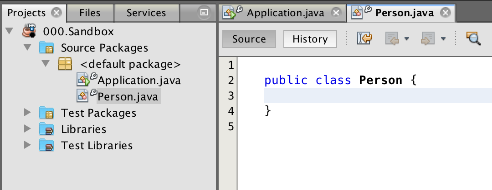

<!-- Luokkaa kuvaamaan voi piirtää myös luokkakaavion, jonka merkintätekniikkaan tutustutaan tässä samalla. Henkilo-niminen luokka, jossa ei ole mitään sisällä näyttää seuraavalta: -->

You can also draw a class diagram to depict a class. We'll become familiar with its notations as we go along. An empty person-named class looks like this:


<!-- Luokka määrittelee luokasta luotavien olioiden ominaisuudet ja toiminnallisuudet. Päätetään, että jokaisella henkilöoliolla on nimi ja ikä. Nimi on luonnollista esittää merkkijonona, eli Stringinä, ja ikä taas kokonaislukuna. Lisätään nämä rakennuspiirustuksiimme: -->

A class defines the attributes and behaviors of objects that are created from it. Let's decide that each person object has a name and an age. It's natural to represent the name as a string, and the age as an integer. We'll go ahead and add these to our blueprint:

<!--
```java
public class Henkilo {
    private String nimi;
    private int ika;
}
``` -->

```java
public class Person {
    private String name;
    private int age;
}
```

<!-- Määrittelemme yllä että jokaisella `Henkilo`-luokasta luotavalla oliolla on `nimi` ja `ika`. Luokan sisälle määriteltyjä muuttujia kutsutaan **oliomuuttujiksi** tai olion kentiksi tai olion attribuuteiksi. Muitakin nimiä tuntuu löytyvän.

Oliomuuttujat kirjoitetaan luokan määrittelyä `public class Henkilo {` seuraaville riveille. Jokaisen muuttujan eteen asetetaan avainsana private. Avainsana **private** tarkoittaa sitä, että muuttujat ovat "piilossa" olion sisällä. Tätä kutsutaan **kapseloinniksi**.

Luokkaakaaviossa luokkaan liittyvät muuttujat määritellään muodossa "muuttujanNimi: muuttujanTyyppi". Miinusmerkki ennen muuttujan nimeä kertoo, että muuttuja on kapseloitu (sillä on avainsana private). -->

We specify above that each object created from the `Person` class has a `name` and an `age`. Variables defined inside a class are called **instance variables**, or object fields or object attributes. Other names also seem to exist.

Instance variables are written on the lines following the class definition `public class Person {`. Each variable is preceded by the keyword private. The keyword **private** means that the variables are "hidden" inside the object. This is known as **encapsulation**.

In the class diagram, the variables associated with the class are defined as "variableName: variableType". The minus sign before the variable name indicates that the variable is encapsulated (it has the keyword private).

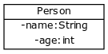

<!-- Olemme nyt määritelleet rakennuspiirustukset -- luokan -- henkilöoliolle. Jokaisella uudella henkilöolioilla on muuttujat `nimi` ja `ika`, joissa voi olla oliokohtainen arvo. Henkilöiden "tila" koostuu niiden nimeen ja ikään asetetuista arvoista. -->

We have now defined a blueprint -- a class -- for the person object. Each new person object has the variables `name` and `age`, which are able to hold object-specific values. The "state" of a person consists of the values assigned to their name and age.

<!-- <programming-exercise name='Koiran ominaisuudet' tmcname='osa04-Osa04_03.KoiranOminaisuudet'> -->
<programming-exercise name='Dog attributes' tmcname='part04-Part04_03.DogAttributes'>

<!-- Tässä tehtävässä harjoittelet luokan luomista.

Uuden luokan saa lisättyä NetBeansissa seuraavasti: Ruudun vasemmalla reunalla on projektilistaus (Projects). Paina projektin nimen kohdalla hiiren oikeaa nappia. Projektin nimi on tämän tehtävän tapauksessa `Osa04_03.KoiranOminaisuudet`. Valitse avautuvasta valikosta *New* ja *Java Class*. Tämän jälkeen NetBeans kysyy luokan nimeä.

Anna tässä tehtävässä luokan nimeksi (Class Name) `Koira` ja paina Finish-nappia.

Olet nyt luonut luokan nimeltä `Koira`. Lisää luokalle oliomuuttujat `private String nimi`, `private String rotu` ja `private int ika`. Luokkakaaviona luokka näyttää seuraavalta: -->

In this exercise, you'll practice creating a class.

A new class can be added in NetBeans the following way: On the left side of the screen is the Projects list. Right-click on the project's name, which for this exercise is `Part04_03.DogAttributes`. From the drop-down menu, select _New_ and _Java Class_. NetBeans will then ask for the class name.

Name the class `Dog` in this exercise, and press the finish button.

You have now created a class called `Dog`. Add the variables `private String name`,`private String breed` and `private int age` to the class. As a class diagram, the class looks like this:

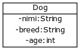

<!-- Luokalla ei vielä oikeastaan tee mitään, mutta tämän askeleen harjoittelusta on hyötyä myöhempää ajatellen. -->

The class doesn't do much yet. However, practicing this step is valuable for what is to come.

</programming-exercise>

<!-- ## Konstruktorin määrittely -->

## Defining a Constructor

<!-- Luotavalle oliolle halutaan asettaa alkutila. Itse määritellyn olion luominen tapahtuu hyvin samaan tapaan kuin olioiden luominen Javan valmiista luokista kuten `ArrayList`istä. Olio luodaan `new`-komennolla. Olion luomisen yhteydessä on kätevää pystyä antamaan arvot luotavan olion muuttujille. Esimerkiksi uutta henkilö-oliota luotaessa olisi kätevää pystyä antamaan oliolle nimi: -->

We want to set an initial state for an object that's created. Custom objects are created the same way as objects from pre-made Java classes, such as `ArrayList`, using the `new` keyword. It'd be convenient to pass values ​​to the variables of that object as it's being created. For example, when creating a new person object, it's useful to be able to provide it with a name:

<!-- ```java
public static void main(String[] args) {
    Henkilo ada = new Henkilo("Ada");
    // ...
}
``` -->

```java
public static void main(String[] args) {
    Person ada = new Person("Ada");
    // ...
}
```

<!-- Tämä onnistuu määrittelemällä olion luova metodi eli **konstruktori**. Konstruktori määritellään oliomuuttujien jälkeen. Seuraavassa esimerkissä Henkilo-luokalle on määritelty konstruktori, jota voidaan käyttää uuden Henkilo-olion luomiseen. Konstruktori asettaa luotavan olion iäksi 0 ja nimeksi konstruktorin parametrina annettavan merkkijonon: -->

This is achieved by defining the method that creates the object, i.e., its constructor. The constructor is defined after the instance variables. In the following example, a constructor is defined for the Person class, which can be used to create a new Person object. The constructor sets the age of the object being created to 0, and the string passed to the constructor as a parameter as its name:

<!--
```java
public class Henkilo {
    private String nimi;
    private int ika;

    public Henkilo(String nimiAlussa) {
        this.ika = 0;
        this.nimi = nimiAlussa;
    }
}
``` -->

```java
public class Person {
    private String name;
    private int age;

    public Person(String initialName) {
        this.age = 0;
        this.name = initialName;
    }
}
```

<!-- Konstruktorin nimi on aina sama kuin luokan nimi. Yllä luokka (*class*) on Henkilo, joten konstruktorin nimeksi tulee Henkilo. Konstruktorille annetaan lisäksi parametrina luotavan henkilööolion nimi. Parametri asetetaan sulkuihin konstruktorin nimen perään. Parametreja mahdollisesti sisältävien sulkujen jälkeen tulee aaltosulut, joiden sisälle määritellään lähdekoodi, jonka ohjelma suorittaa konstruktorikutsun (esim. `new Henkilo("Ada")`) yhteydessä. -->

<!-- Oliot luodaan aina konstruktorin avulla.

Muutama huomio: konstruktorin sisällä on lauseke `this.ika = 0`. Lausekkeessa asetetaan juuri luotavan olion (eli "tämän" olion) oliomuuttujan ika arvoksi 0. Toinen lauseke `this.nimi = nimiAlussa;` taas asettaa juuri tämän olion sisäiselle muuttujalle `nimi` arvoksi parametrina annetun merkkijonon.

Koska oliomuuttujat on määritelty konstruktorin aaltosulkujen ulkopuolella, voi niitä käyttää myös konstruktorin sisällä.

Nyt luokkakaavioon on merkitty luokan nimen ja muuttujien lisäksi myös konstruktori. Konstruktori saa public-näkyvyysmääreen takia eteen plussan, jonka lisäksi siitä merkitään sen nimi ja parametrin tyypit (tässä `+ Henkilo(String)`). -->

The constructor's name is always the same as the class name. The class in the example above is named Person, so the constructor will also have to be named Person. The constructor is also provided,  as a parameter, the name of the person object to be created. The parameter is enclosed in parentheses and follows the constructor's name. The parentheses that contain optional parameters are followed by curly brackets. In between these brackets is the source code that the program executes when the constructor is called (e.g., `new Person ("Ada")`).

Objects are always created using a constructor.

A few things to note: the constructor contains the expression `this.age = 0`. This expression sets the instance variable `age` of the newly created object (i.e., "this" object's age) to 0. The second expression `this.name = initialName` likewise assigns the string passed as a parameter to the instance variable `name` of the object created.

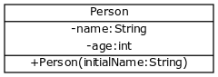

<!-- <programming-exercise name='Huone' tmcname='osa04-Osa04_04.Huone'> -->
<programming-exercise name='Room' tmcname='part04-Part04_04.Room'>

<!-- Luo luokka nimeltä `Huone`. Lisää luokalle oliomuuttujat `private String koodi` ja `private int istumapaikat`. Luo tämän jälkeen konstruktori `public Huone(String luokanKoodi, int istumapaikkojenMaara)`, jonka avulla oliomuuttujiin asetetaan arvot.

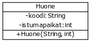

Tälläkään luokalla ei vielä oikeastaan tee mitään, mutta seuraavassa tehtävässä luokastamme tehty olio osaa jo tulostaa tekstiä. -->

Create a class named `Room`. Add the variables `private String code` and `private int seats` to the class. Then create a constructor `public Room(String classCode, int numberOfSeats)` through which values are assigned to the instance variables.

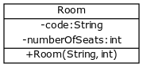

This class doesn't do much either. However,in the following exercise the object instantiated from our class is already capable of printing text.

</programming-exercise>

<!-- <text-box variant='hint' name='Oletuskonstruktori'> -->

<text-box variant='hint' name='Default Constructor'>

<!-- Mikäli ohjelmoija ei tee luokalle konstruktoria, tekee Java automaattisesti luokalle oletuskonstruktorin. Oletuskonstruktori on konstruktori joka ei tee mitään muuta kuin luo olion. Olion muuttujat jäävät alustamattomiksi (yleisesti ottaen viittaustyyppisten muuttujien arvoksi tulee `null`, eli ei viitettä mihinkään, ja alkeistyyppisten muuttujien arvoksi `0`).

Esimerkiksi alla olevasta luokasta voidaan luoda olio kutsulla `new Henkilo()`. -->

If the programmer does not define a constructor for a class, Java automatically creates a default one for it. A default constructor is a constructor that doesn't do anything apart from creating the object. The object's variables remain uninitialized (generally, the value of any object references will be `null`, meaning that they do not point to anything, and the values of primitives will be `0`)

For example, an object can be created from the class below by making the call `new Person()`

<!--
```java
public class Henkilo {
    private String nimi;
    private int ika;
}
``` -->

```java
public class Person {
    private String name;
    private int age;
}
```

<!-- Mikäli luokalle on määritelty konstruktori, oletuskonstruktoria ei ole olemassa. Alla olevalla luokalla kutsu `new Henkilo()` aiheuttaisi virhetilanteen, sillä Java ei löydä luokasta konstruktoria, jolla ei ole yhtäkään parametria. -->

If a constructor has been defined for a class, no default constructor exists. For the class below, calling `new Person` would cause an error, as Java cannot find a constructor in the class that has no parameters.

<!-- ```java
public class Henkilo {
    private String nimi;
    private int ika;

    public Henkilo(String nimiAlussa) {
        this.ika = 0;
        this.nimi = nimiAlussa;
    }
}
``` -->

```java
public class Person {
    private String name;
    private int age;

    public Person(String initialName) {
        this.age = 0;
        this.name = initialName;
    }
}
```

</text-box>

<!-- ## Metodien määrittely olioille -->

## Defining Methods For an Object

<!-- Osaamme luoda olion ja alustaa olion muuttujat. Toimintaan pystyäkseen olioilla on oltava myös metodeja. Kuten olemme jo oppineet, **metodi** on luokkaan kirjoitettu lähdekoodista koostuva kokonaisuus, jolle on annettu nimi, ja jota voidaan kutsua.

Tehdään luokalle Henkilo metodi, jota käytetään olion tietojen tulostamiseen. -->

We know how to create an object and initialize its variables. However, an object also needs methods to be able to do anything. As we've learned, a **method** is a named section of source code inside a class which can be invoked.

<!-- ```java
public class Henkilo {
    private String nimi;
    private int ika;

    public Henkilo(String nimiAlussa) {
        this.ika = 0;
        this.nimi = nimiAlussa;
    }

    public void tulostaHenkilo() {
        System.out.println(this.nimi + ", ikä " + this.ika + " vuotta");
    }
}
``` -->

```java
public class Person {
    private String name;
    private int age;

    public Person(String initialName) {
        this.age = 0;
        this.name = initialName;
    }

    public void printPerson() {
        System.out.println(this.name + ", age " + this.age + " years");
    }
}
```

<!-- Metodi kirjoitetaan luokan sisälle konstruktorin alapuolelle. Metodin nimen eteen tulee `public void` sillä metodin on tarkoitus näkyä ulkomaailmalle (`public`) ja metodi ei palauta arvoa (`void`). -->

A method is written inside of the class beneath the constructor. The method name is preceded by `public void`, since the method is intended to be visible to the outside world (`public`), and it does not return a value (`void`).

<!-- <text-box variant='hint' name='Oliot ja määre static'> -->
<text-box variant='hint' name='Objects and the Static Modifier'>

<!--
Aiemmin toteuttamissamme metodeissa on ollut käytössä määre `static`. Määre `static` viittaa siihen, että metodi ei liity olioon ja sen avulla ei voi käsitellä oliolle määriteltyjä muuttujia.

Metodeistamme puuttuu jatkossa määre `static` mikäli ne käsittelevät kyseisestä luokasta luotujen olioiden tietoa. Mikäli metodi saa parametrina kaikki muuttujat, joiden arvoja se käsittelee, voi metodissa olla `static`-määre. -->

We've used the modifier `static` in some of the methods that we've written. The `static` modifier indicates that the method in question does not belong to an object and thus cannot be used to access any variables that belong to objects.

Going forward, our methods will not include the `static` keyword if they're used to process information about objects created form a given class. If a method receives as parameters all the variables whose values ​​it uses, it can have `static` modifier.

</text-box>

<!-- Luokkakaavioon on merkitty luokan nimen, oliomuuttujien ja konstruktorin lisäksi nyt myös metodi `tulostaHenkilo`. Koska metodilla on `public`-määre, tulee sille alkuun plus, jota seuraa metodin nimi. Metodille ei ole määritelty parametreja, joten ei myöskään piirretä metodin sulkujen sisälle. Metodille merkitään myös tieto siitä, että se ei palauta arvoa, tässä `void`. -->

In addition to the class name, instance variables, and constructor, the class diagram now also includes the method `printPerson`. Since the method comes with the `public` modifier, the method name is prefixed with a plus sign. No parameters are defined for the method, so nothing is put inside the method's parentheses. The method is also marked with information indicating that it does not return a value, here `void`.

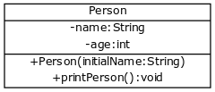

<!-- Metodin `tulostaHenkilo` sisällä on yksi koodirivi joka käyttää hyväkseen oliomuuttujia `nimi` ja `ika` -- luokkakaavio ei kerro sisäisestä toteutuksesta. Olion sisäisiin muuttujiin viitataan etuliitteellä `this`. Kaikki olion muuttujat ovat siis näkyvillä ja käytettävissä metodin sisällä.

Luodaan pääohjelmassa kolme henkilöä ja pyydetään niitä tulostamaan itsensä: -->

The method `printPerson` contains one line of code that makes use of the instance variables `name` and `age` -- the class diagram says nothing about its internal implementations. Instance variables are referred to with the prefix `this`. All of the object's variables are visible and available from within the method.

Let's create three persons in the main program and request them to print themselves:

<!-- ```java
public class Main {

    public static void main(String[] args) {
        Henkilo ada = new Henkilo("Ada");
        Henkilo antti = new Henkilo("Antti");
        Henkilo martin = new Henkilo("Martin");

        ada.tulostaHenkilo();
        antti.tulostaHenkilo();
        martin.tulostaHenkilo();
    }
}
``` -->

```java
public class Main {

    public static void main(String[] args) {
        Person ada = new Person("Ada");
        Person antti = new Person("Antti");
        Person martin = new Person("Martin");

        ada.printPerson();
        antti.printPerson();
        martin.printPerson();
    }
}
```

<!-- Tulostuu: -->

Prints:

<!-- <sample-output>

Ada, ikä 0 vuotta
Antti, ikä 0 vuotta
Martin, ikä 0 vuotta

</sample-output> -->

<sample-output>

Ada, age 0 years
Antti, age 0 years
Martin, age 0 years

</sample-output>

<!-- Sama screencastina: -->

This as a screencast:

<youtube id='fWwXQ5n2gYo'></youtube>

&nbsp;

<!-- <programming-exercise name='Pilli' tmcname='osa04-Osa04_05.Pilli'> -->

<programming-exercise name='Whistle' tmcname='part04-Part04_05.Whistle'>

<!-- Luo luokka nimeltä `Pilli`. Lisää luokalle oliomuuttuja `private String aani`. Luo tämän jälkeen konstruktori `public Pilli(String pillinAani)`, jonka avulla luodaan uusi pilli, jolle annetaan ääni.

Lisää pillille vielä metodi `public void soi()`, joka tulostaa pillin äänen.

Pillin tulee toimia seuraavasti. -->

Create a class named `Whistle`. Add the variable `private String sound` to the class. After that, create the constructor `public Whistle(String whistleSound)`, which is used to create a new whistle that's given a sound.

<!-- ```java
Pilli sorsapilli = new Pilli("Kvaak");
Pilli kukkopilli = new Pilli("Peef");

sorsapilli.soi();
kukkopilli.soi();
sorsapilli.soi();
``` -->

```java
Whistle duckWhistle = new Whistle("Kvaak");
Whistle roosterWhistle = new Whistle("Peef");

duckWhistle.sound();
roosterWhistle.sound();
duckWhistle.sound();
```

<sample-output>

Kvaak
Peef
Kvaak

</sample-output>

</programming-exercise>

<!-- <programming-exercise name='Ovi' tmcname='osa04-Osa04_06.Ovi'>

Luo luokka nimeltä `Ovi`. Ovella ei ole oliomuuttujia. Luo sille parametriton konstruktori (tai käytä oletuskonstruktoria).  Luo tämän jälkeen ovelle metodi `public void koputa()`, jota kutsuttaessa tulostuu viesti "Who's there?".

Oven tulee toimia seuraavasti. -->

<programming-exercise name='Door' tmcname='part04-Part04_06.Door'>

Create a class named `Door`. The door does not have any variables. Create for it a constructor with no parameters (or use the default constructor). After that, create a `public void knock()` method for the door that prints the message "Who's there?" when called.

The door should work as follows.

<!-- ```java
Ovi alexander = new Ovi();

alexander.koputa();
alexander.koputa();
```

<sample-output>

Who's there?
Who's there?

</sample-output> -->

```java
Door alexander = new Door();

alexander.knock();
alexander.knock();
```

<sample-output>

Who's there?
Who's there?

</sample-output>

</programming-exercise>

<!-- <programming-exercise name='Tuote' tmcname='osa04-Osa04_07.Tuote'>

Luo luokka `Tuote`, joka esittää kaupan tuotetta. Tuotteella tulee olla hinta (double), lukumäärä (int) ja nimi (String).

Luokalla tulee olla:

-Konstruktori `public Tuote(String nimiAlussa, double hintaAlussa, int maaraAlussa)`
-Metodi `public void tulostaTuote()` joka tulostaa tuotteen tiedot tässä muodossa:

<sample-output>

Banaani, hinta 1.1, 13 kpl

</sample-output>

Yllä oleva tulostus olettaa, että tuotteen nimeksi on annettu `banaani`, hinnaksi on annettu `1.1`, ja määräksi on annettu `13`.

</programming-exercise> -->

<programming-exercise name='Product' tmcname='part04-Part04_07.Product'>

Create a class `Product` that represents a store product. The product should have a price (double), a quantity (int) and a name (String).

The class should have:

- the constructor `public Item (String nameAlbum, double priceAlbum, int rateAlbum)`
- a method `public void printProduct()` that prints product information in the following format:

<sample-output>

Banana, price 1.1, 13 pcs

</sample-output>

The output above is based on the product being assigned the name `banana`, with a price of `1.1`, and a quantity of `13` .

</programming-exercise>

<!-- ## Oliomuuttujan arvon muuttaminen metodissa -->

## Changing an Instance Variable's Value in a Method

<!-- Lisätään aiemmin rakentamallemme Henkilo-luokalle metodi, joka kasvattaa henkilön ikää vuodella: -->

Let's add a method to the previously created person class that increments the age of the person by a year.

<!-- ```java
public class Henkilo {
    private String nimi;
    private int ika;

    public Henkilo(String nimiAlussa) {
        this.ika = 0;
        this.nimi = nimiAlussa;
    }

    public void tulostaHenkilo() {
        System.out.println(this.nimi + ", ikä " + this.ika + " vuotta");
    }

    // lisätty metodi vanhene
    public void vanhene() {
        this.ika = this.ika + 1;
    }
}
``` -->

```java
public class Person {
    private String name;
    private int age;

    public Person(String initialName) {
        this.age = 0;
        this.name = initialName;
    }

    public void printPerson() {
        System.out.println(this.name + ", age " + this.age + " years");
    }

    // growOlder() method has been added
    public void growOlder() {
        this.age = this.age + 1;
    }
}
```

<!--
Metodi kirjoitetaan `tulostaHenkilo`-metodin tapaan luokan `Henkilo` sisälle. Metodissa kasvatetaan oliomuuttujan `ika` arvoa yhdellä.

Myös luokkakaavio päivittyy. -->

The method is written inside the `Person` class just as the `printPerson` method was. The method increments the value of the instance variable `age` by one.

The class diagram also gets an update.

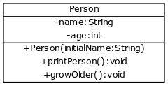

<!-- Kutsutaan metodia ja katsotaan mitä tapahtuu:

```java
public class Main {

    public static void main(String[] args) {
        Henkilo ada = new Henkilo("Ada");
        Henkilo antti = new Henkilo("Antti");

        ada.tulostaHenkilo();
        antti.tulostaHenkilo();

        System.out.println("");

        ada.vanhene();
        ada.vanhene();

        ada.tulostaHenkilo();
        antti.tulostaHenkilo();
    }
}
```

Ohjelman tulostus on seuraava: -->

Let's call the method and see what happens:

```java
public class Main {

    public static void main(String[] args) {
        Person ada = new Person("Ada");
        Person antti = new Person("Antti");

        ada.printPerson();
        antti.printPerson();
        System.out.println("");

        ada.growOlder();
        ada.growOlder();

        ada.printPerson();
        antti.printPerson();
    }
}
```

<!-- Ohjelman tulostus on seuraava: -->

The program's print output is as follows:

<sample-output>

Ada, age 0 years
Antti, age 0 years

Ada, age 2 years
Antti, age 0 years

</sample-output>

<!-- Eli "syntyessään" molemmat oliot ovat nollavuotiaita (konstruktorissa suoritetaan mm. rivi `this.ika = 0;`). Olion `ada` metodia `vanhene` kutsutaan kaksi kertaa. Kuten tulostus näyttää, tämä saa aikaan sen että Adan ikä on vanhenemisen jälkeen 2 vuotta. Kutsumalla metodia Adaa vastaavalle oliolle, toisen henkilöolion ikä ei muutu, sillä jokaiselle luokasta luotavalle oliolle luodaan myös omat oliomuuttujat.

Metodin sisään voi lisätä myös ehto- ja toistolauseita. Alla olevaa vanhene-metodia käytettäessä kenestäkään ei tulisi yli 30-vuotiasta. -->

That is to say that when the two objects are "born" they're both zero-years old (`this.age = 0;` is executed in the constructor). The `ada` object's `growOlder` method is called twice. As the print output demonstrates, the age of Ada is 2 years after growing older. Calling the method on an object corresponding to Ada has no impact on the age of the other person object since each object instantiated form a class has its own instance variables.

The method can also contain conditional statements and loops. The growOlder method below limits aging to 30 years.

<!-- ```java
public class Henkilo {
    private String nimi;
    private int ika;

    public Henkilo(String nimiAlussa) {
        this.ika = 0;
        this.nimi = nimiAlussa;
    }

    public void tulostaHenkilo() {
        System.out.println(this.nimi + ", ikä " + this.ika + " vuotta");
    }

    // kukaan ei tule olemaan yli 30-vuotias
    public void vanhene() {
        if (this.ika < 30) {
            this.ika = this.ika + 1;
        }
    }
}
``` -->

```java
public class Person {
    private String name;
    private int age;

    public Person(String initialName) {
        this.age = 0;
        this.name = initialName;
    }

    public void printPerson() {
        System.out.println(this.name + ", age " + this.age + " years");
    }

    // no one exceeds the age of 30
    public void growOlder() {
        if (this.age < 30) {
            this.age = this.age + 1;
        }
    }
}
```

<!-- <programming-exercise name='Vähenevä laskuri (3 osaa)' tmcname='osa04-Osa04_08.VahenevaLaskuri'> -->
<programming-exercise name='Decreasing counter (3 parts)' tmcname='part04-Part04_08.DecreasingCounter'>

<!-- Tässä tehtävässä on useampi osa. Jokainen osa vastaa yhtä tehtäväpistettä.

Tehtäväpohjan mukana tulee osittain valmiiksi toteutettu luokka `VahenevaLaskuri`: -->

This exercise consists of multiple parts. Each part corresponds to one exercise point.

The exercise template comes with a partially executed class `decreasingCounter`:

<!-- ```java
public class VahenevaLaskuri {
    private int arvo;   // oliomuuttuja joka muistaa laskurin arvon

    public VahenevaLaskuri(int arvoAlussa) {
        this.arvo = arvoAlussa;
    }

    public void tulostaArvo() {
        System.out.println("arvo: " + this.arvo);
    }

    public void vahene() {
        // kirjoita tänne metodin toteutus
        // laskurin arvon on siis tarkoitus vähentyä yhdellä
    }

    // ja tänne muut metodit
}
``` -->

```java
public class DecreasingCounter {
    private int value;   // a variable that remembers the value of the counter

    public DecreasingCounter(int initialValue) {
        this.value = initialValue;
    }

    public void printValue {
        System.out.println("value: " + this.value);
    }

    public void decrement() {
        // write the method implementation here
        // the aim is to decrement the value of the counter by one
    }

    // and the other methods go here
}
```

<!-- Seuraavassa esimerkki miten pääohjelma käyttää vähenevää laskuria: -->

The following is an example of how the main program uses the decreasing counter:

<!-- ```java
public class Paaohjelma {
    public static void main(String[] args) {
        VahenevaLaskuri laskuri = new VahenevaLaskuri(10);

        laskuri.tulostaArvo();

        laskuri.vahene();
        laskuri.tulostaArvo();

        laskuri.vahene();
        laskuri.tulostaArvo();
    }
}
``` -->

```java
public class MainPorgram {
    public static void main(String[] args) {
        DecreasingCounter counter = new DecreasingCounter(10);

        counter.printValue();

        counter.decrement();
        counter.printValue();

        counter.decrement();
        counter.printValue();
    }
}
```

<!-- Yllä olevalla ohjelmalla tulostuksen pitäisi olla seuraava. -->

The program above should have the following print output.

<!-- <sample-output>

arvo: 10
arvo: 9
arvo: 8

</sample-output> -->

<sample-output>

value: 10
value: 9
value: 8

</sample-output>

<!-- `VahenevaLaskuri`-luokan konstruktorille annetaan parametrina alkuarvo. Esimerkin oliota `laskuri` luodessa laskurille välitetään parametrina arvo `10`. Esimerkin `laskuri`-olioon liittyvään oliomuuttujaan `arvo` asetetaan siis aluksi arvo `10`. Laskurin arvon voi tulostaa metodilla `tulostaArvo()`. Laskurilla tulee myös olla metodi `vahene()` joka vähentää laskurin arvoa yhdellä. -->

<!-- <h2>Metodin vahene() toteutus</h2> -->
<h2>Implementation of the decrement() method</h2>

<!-- Täydennä luokan runkoon metodin `vahene()` toteutus sellaiseksi, että se vähentää kutsuttavan olion oliomuuttujan `arvo` arvoa yhdellä. Kun olet toteuttanut metodin `vahene()`, edellisen esimerkin pääohjelman tulee toimia esimerkkitulosteen mukaan. -->

Implement the `decrement()` method in the class body in such a way that it decrements the `value` variable of the object it's being called on by one. Once you're done with the `decrement()` method, the main program of the previous example should work to produce the example output.

<!-- <h2>Laskurin arvo ei saa olla negatiivinen</h2> -->
<h2>The counter's value cannot be negative</h2>

<!-- Täydennä metodin `vahene()` toteutus sellaiseksi, ettei laskurin arvo mene koskaan negatiiviseksi. Eli jos laskurin arvo on jo 0, ei vähennys sitä enää vähennä. Ehtolause auttaa tässä. -->

Implement the `decrement()` in such a way that the counter's value never becomes negative. This means that if the value of the counter is 0, it cannot be decremented. A conditional statement is useful here.

<!--
```java
public class Paaohjelma {
    public static void main(String[] args) {
        VahenevaLaskuri laskuri = new VahenevaLaskuri(2);

        laskuri.tulostaArvo();

        laskuri.vahene();
        laskuri.tulostaArvo();

        laskuri.vahene();
        laskuri.tulostaArvo();

        laskuri.vahene();
        laskuri.tulostaArvo();
    }
}
``` -->

```java
public class MainProgram {
    public static void main(String[] args) {
        DecreasingCounter counter = new DecreasingCounter(2);

        counter.printValue();

        counter.decrement();
        counter.printValue();

        counter.decrement();
        counter.printValue();

        counter.decrement();
        counter.printValue();
    }
}
```

<!-- Tulostuu: -->

Prints:

<!-- <sample-output>

arvo: 2
arvo: 1
arvo: 0
arvo: 0

</sample-output> -->

<sample-output>

value: 2
value: 1
value: 0
value: 0

</sample-output>

<!-- <h2>Laskurin arvon nollaus</h2> -->
<h2>Resetting the counter value</h2>

<!-- Tee laskurille metodi `public void nollaa()` joka nollaa laskurin arvon, esim: -->

Create the method `public void reset()` for the counter that resets the value of the counter to 0. For example:

<!-- ```java
public class Paaohjelma {
    public static void main(String[] args) {
        VahenevaLaskuri laskuri = new VahenevaLaskuri(100);

        laskuri.tulostaArvo();

        laskuri.nollaa();
        laskuri.tulostaArvo();

        laskuri.vahene();
        laskuri.tulostaArvo();
    }
}
``` -->

```java
public class MainProgram {
    public static void main(String[] args) {
        DecreasingCounter counter = new DecreasingCounter(100);

        counter.printValue();

        counter.reset();
        counter.printValue();

        counter.decrement();
        counter.printValue();
    }
}
```

<!-- Tulostuu: -->

Prints:

<!-- <sample-output>

arvo: 100
arvo: 0
arvo: 0

</sample-output> -->

<sample-output>

value: 100
value: 0
value: 0

</sample-output>

</programming-exercise>

<!-- <programming-exercise name='Velka' tmcname='osa04-Osa04_09.Velka'> -->
<programming-exercise name='Debt' tmcname='part04-Part04_09.Debt'>

<!--
Luo luokka `Velka`, jolla on double-tyyppiset oliomuuttujat `saldo` ja `korkokerroin`. Saldo ja korkokerroin annetaan konstruktorin parametrina `public Velka(double saldoAlussa, double korkokerroinAlussa)`.

Luo luokalle myös metodit `public void tulostaSaldo()` sekä `public void odotaVuosi()`. Metodi tulostaSaldo tulostaa tämän hetkisen saldon, ja metodi odotaVuosi kasvattaa velan määrää.

Velan määrän kasvattaminen tapahtuu kertomalla saldo korkokertoimella.

Luokan tulee toimia seuraavasti: -->

Create the class `Debt` that has double-typed instance variables of `balance` and `interestRate`. The balance and the interest rate are passed to the constructor as parameters `public Debt(double initialBalance, double initialInterestRate)`.

In addition, create the methods `public void printBalance()` and `public void waitOneyear()` for the class. The method printBalance prints the current balance, and the waitOneYear method grows the debt amount.

The debt is increased by multiplying the balance by the interest rate.

The class should do the following:

<!-- ```java
public class Paaohjelma {
    public static void main(String[] args) {

        Velka asuntolaina = new Velka(120000.0, 1.01);
        asuntolaina.tulostaSaldo();

        asuntolaina.odotaVuosi();
        asuntolaina.tulostaSaldo();

        int vuosia = 0;

        while (vuosia < 20) {
            asuntolaina.odotaVuosi();
            vuosia = vuosia + 1;
        }

        asuntolaina.tulostaSaldo();
    }
}
``` -->

```java
public class MainProgram {
    public static void main(String[] args) {

        Debt mortgage = new Debt(120000.0, 1.01);
        mortgage.tulostaSaldo();

        mortgage.odotaVuosi();
        mortgage.tulostaSaldo();

        int years = 0;

        while (years < 20) {
            mortgage.waitOneYear();
            years = years + 1;
        }

        mortgage.printBalance();
    }
}
```

<!-- Ylläolevassa esimerkissä havainnollistetaan asuntolainan kehitystä prosentin korolla.

Tulostus: -->

The example above illustrates the development of a mortgage with an interest rate of one percent.

Prints:

<sample-output>

120000.0
121200.0
147887.0328416936

</sample-output>

<!-- Kun saat ohjelman toimimaan, tarkastele edelläolevaa esimerkkiä myös 1990-luvun alkupuolen laman korkokertoimilla. Tällöin korko oli jopa 15-20 prosenttia -- muuta yllä olevan esimerkin korkokertoimeksi `1.20` ja katso miten käy. -->

When you've managed to get the program to work, check the previous example with the early 1900s recession interest rates as well.

Once you get the program to work, try out the previous example with the interest rates of the early 1990s recession when the interest rates were as high as 15-20% - try swapping the interest rate in the example above with `1.20` and see what happens.

</programming-exercise>

<!-- ## Arvon palauttaminen metodista -->

## Returning a Value From a Method

<!-- Metodi voi palauttaa arvon. Tähän mennessä olioihin luomamme metodit eivät palauttaneet mitään. Tämä on merkitty kirjoittamalla metodin määrittelyyn avainsana *void*. -->

A method can return a value. The methods we've created in our objects haven't so far returned anything. This has been marked by typing the keyword _void_ in the method definition.

<!-- ```java
public class Ovi {
    public void koputa() {
        // ...
    }
}
``` -->

```java
public class Door {
    public void knock() {
        // ...
    }
}
```

<!-- Avainsana **void** tarkoittaa että metodi ei palauta arvoa.

Jos haluamme, että metodi palauttaa arvon, tulee avainsanan `void` paikalle asettaa palautettavan muuttujan tyyppi. Seuraavassa esimerkissä näkyvälle luokalle Opettaja on määritelty metodi `arvostele`, joka palauttaa aina kokonaislukutyyppisen (`int`) muuttujan (tässä arvo 10). Arvon palauttaminen tapahtuu aina komennolla **return**: -->

The keyword **void** means that the method does not return a value.

If we want the method to return a value, we need to replace the `void` keyword with the type of the variable to be returned. In the following example, the Teacher class has a  method `grade` that always returns an integer-type (`int`) variable (in this case, the value 10). The value is always returned with the  **return** command:

<!-- ```java
public class Opettaja {
    public int arvostele() {
        return 10;
    }
}
``` -->

```java
public class Teacher {
    public int grade() {
        return 10;
    }
}
```

<!-- Ylläoleva metodi siis palauttaa sitä kutsuttaessa `int`-tyyppisen arvon `10`. Jotta metodin palauttamaa arvoa voisi käyttää, tulee se ottaa talteen muuttujaan. Tämä tapahtuu samalla tavalla kuin normaali muuttujan arvon asetus, eli yhtäsuuruusmerkillä: -->
<!--  -->

The method above returns an `int` type variable of value 10 when called. For the return value to be used, it needs to be assigned to a variable. This happens the same way as regular value assignment, i.e., by using the equals sign:

<!-- ```java
public static void main(String[] args) {
    Opettaja opettaja = new Opettaja();

    int arvostelu = opettaja.arvostele();

    System.out.println("Arvosanaksi tuli " + arvostelu);
}
``` -->

```java
public static void main(String[] args) {
    Teacher teacher = new Teacher();

    int grading = teacher.grade();

    System.out.println("The grade received is " + grading);
}
```

<!-- <sample-output>

Arvosanaksi tuli 10

</sample-output> -->

<sample-output>

The grade received is 10

</sample-output>

<!-- Metodin paluuarvo sijoitetaan `int`-tyyppiseen muuttujaan aivan kuin mikä tahansa muukin int-arvo. Paluuarvo voi toimia myös osana mitä tahansa lauseketta: -->

The method's return value is assigned to a variable of type `int` value just as any other int value would be. The return value could also be used to form part of an expression.

<!-- ```java
public static void main(String[] args) {
    Opettaja eka = new Opettaja();
    Opettaja toka = new Opettaja();
    Opettaja kolmas = new Opettaja();

    double keskiarvo = (eka.arvostele() + toka.arvostele() + kolmas.arvostele()) / 3.0;

    System.out.println("Arvostelujen keskiarvo " + keskiarvo);
}
``` -->

```java
public static void main(String[] args) {
    Teacher first = new Teacher();
    Teacher second = new Teacher();
    Teacher third = new Teacher();

    double average = (first.grade() + second.grade() + third.grade()) / 3.0;

    System.out.println("Grading average " + average);
}
```

<!-- <sample-output>

Arvostelujen keskiarvo 10.0

</sample-output> -->

<sample-output>

Grading average 10.0

</sample-output>

<!-- Kaikki tähän mennessä näkemämme muuttujatyypit voidaan myös palauttaa metodista. Yhteenveto: -->

All the variables we've encountered so far can also be returned by a method. To sum:

<!-- - Metodilla, joka ei palauta mitään, on `void`-määre palautettavan muuttujan tyyppinä.
```java
public void metodiJokaEiPalautaMitaan() {
    // metodin runko - TODO: miksi tämä (ja seuraavat) ei ole sisennetty oikein?
}
``` -->

- A method that returns nothing has the `void` modifier as the type of variable to be returned.

```java
public void methodThatReturnsNothing() {
    // the method body
}
```

<!-- - Metodilla, joka palauttaa kokonaislukutyyppisen muuttujan, on `int`-määre palautettavan muuttujan tyyppinä.
```java
public int metodiJokaPalauttaaKokonaisLuvun() {
    // metodin runko, tarvitsee return-komennon
}
``` -->

- A method that returns an integer variable has the `int` modifier as the type of variable to be returned.

```java
public int methodThatReturnsAnInteger() {
    // the method body, requires a return statement
}
```

<!-- - Metodilla, joka palauttaa merkkijonotyyppisen muuttujan, on `String`-määre palautettavan muuttujan tyyppinä.
```java
public String metodiJokaPalauttaaTekstin() {
    // metodin runko, tarvitsee return-komennon
}
``` -->

- A method that returns a string has the `String` modifier as the type of the variable to be returned

```java
public int methodThatReturnsAString() {
    // the method body, requires a return statement
}
```

<!--
- Metodilla, joka palauttaa liukulukutyyppisen muuttujan, on `double`-määre palautettavan muuttujan tyyppinä.
```java
public double metodiJokaPalauttaaLiukuluvun() {
    // metodin runko, tarvitsee return-komennon
}
``` -->

- A method that returns a double-precision number has the `double` modifier as the type of the variable to be returned.

```java
public double methodThatReturnsADouble() {
    // the method body, requires a return statement
}
```

<!-- Jatketaan nyt henkilön parissa ja lisätään henkilölle iän palauttava metodi `palautaIka`. -->

Let's continue with the Person class and add a `returnAge` method that returns the person's age.

<!-- ```java

public class Henkilo {
    private String nimi;
    private int ika;

    public Henkilo(String nimiAlussa) {
        this.ika = 0;
        this.nimi = nimiAlussa;
    }

    public void tulostaHenkilo() {
        System.out.println(this.nimi + ", ikä " + this.ika + " vuotta");
    }

    public void vanhene() {
        if (this.ika < 30) {
            this.ika = this.ika + 1;
        }
    }

    // juuri lisätty metodi
    public int palautaIka() {
        return this.ika;
    }
}
``` -->

```java
public class Person {
    private String name;
    private int age;

    public Person(String initialName) {
        this.age = 0;
        this.name = initialName;
    }

    public void printPerson() {
        System.out.println(this.name + ", age " + this.age + " years");
    }

    public void growOlder() {
        if (this.age < 30) {
            this.age = this.age + 1;
        }
    }
    // the added method
    public int returnAge() {
        return this.age;
    }

```

<!-- Luokka kokonaisuudessaan: -->

The class in its entirety:

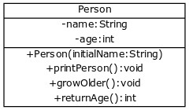

<!-- Havainnollistetaan metodin toimintaa: -->

Let's illustrate how the method works:

<!-- ```java
public class Main {

    public static void main(String[] args) {
        Henkilo pekka = new Henkilo("Pekka");
        Henkilo antti = new Henkilo("Antti");

        pekka.vanhene();
        pekka.vanhene();

        antti.vanhene();

        System.out.println("Pekan ikä: " + pekka.palautaIka());
        System.out.println("Antin ikä: " + antti.palautaIka());

        int yht = pekka.palautaIka() + antti.palautaIka();

        System.out.println("Pekka ja Antti yhteensä " + yht + " vuotta");
    }
}
``` -->

```java
public class Main {

    public static void main(String[] args) {
        Person pekka = new Person("Pekka");
        Person antti = new Person("Antti");

        pekka.growOlder();
        pekka.growOlder();

        antti.growOlder();

        System.out.println("Pekka's age: " + pekka.returnAge());
        System.out.println("Antti's age: " + antti.returnAge())
        int combined = pekka.returnAge() + antti.returnAge();

        System.out.println("Pekka's and Antti's combined age " + combined + " years");
    }
}
```

<!-- <sample-output>

Pekan ikä 2
Antin ikä 1

Pekka ja Antti yhteensä 3 vuotta

</sample-output> -->

<sample-output>

Pekka's age 2
Antti's age 1

Pekka's and Antti's combined age 3 years

</sample-output>

<quiz id='518e4a90-d954-50dd-a8a0-bd14da4331e6'></quiz>

<!-- <programming-exercise name='Musiikkikappale' tmcname='osa04-Osa04_10.Musiikkikappale'> -->
<programming-exercise name='Music song' tmcname='part04-Part04_10.MusicSong'>

<!-- Luo luokka nimeltä `Musiikkikappale`. Musiikkikappaleella on oliomuuttujat `nimi` (merkkijono) ja `pituus` sekunteina (kokonaisluku). Molemmat asetetaan konstruktorissa `public Musiikkikappale(String kappaleenNimi, int kappaleenPituus)`. Lisää oliolle myös metodit `public String nimi()`, joka palauttaa kappaleen nimen, ja `public int pituus()`, joka palauttaa kappaleen pituuden.

Luokan tulee toimia seuraavasti. -->

Create a class called `Song`. The song has the instance variables `name` (string) and `length` in seconds (integer). Both are set in the `public Song(String name, int length)` constructor. Also, add to the object the methods `public String name()`, which returns the name of the song, and `public int length()`, which returns the length of the song.

The class should work as follows.

<!--
```java
Musiikkikappale garden = new Musiikkikappale("In The Garden", 10910);
System.out.println("Kappaleen " + garden.nimi() + " pituus on " + garden.pituus() + " sekuntia.");
``` -->

```java
Song garden = new Song("In The Garden", 10910);
System.out.println("The song " + garden.name() + " has a length of " + garden.length() + " seconds.");
```

<sample-output>

The song In The Garden has a length of 10910 seconds.

</sample-output>

</programming-exercise>

<!-- <programming-exercise name='Elokuva' tmcname='osa04-Osa04_11.Elokuva'> -->
<programming-exercise name='Film' tmcname='part04-Part04_11.Film'>

<!-- Luo luokka Elokuva, jolla on oliomuuttujat `nimi` (String) ja `ikaraja` (int). Tee luokalle konstruktori `public Elokuva(String elokuvanNimi, int elokuvanIkaraja)` sekä metodit `public String nimi()` ja `public int ikaraja()`. Ensimmäinen palauttaa elokuvan nimen ja toinen elokuvan ikärajan.

Esimerkki luokan käytöstä. -->

Create a film class with the instance variables `name` (String) and `ageRating` (int). Write the constructor `public Film(String filmName, int filmAgeRating)` for the class, and also the methods `public String name()` and `public int ageRating()`. The first of these returns the film title and the second returns its rating.

Below is an example use case of the class.

<!-- ```java
Elokuva chipmunks = new Elokuva("Alvin and the Chipmunks: The Squeakquel", 0);

Scanner lukija = new Scanner(System.in);

System.out.println("Minkä ikäinen olet?");
int ika = Integer.valueOf(lukija.nextLine());

System.out.println();
if (ika >= chipmunks.ikaraja()) {
    System.out.println("Saat katsoa elokuvan " + chipmunks.nimi());
} else {
    System.out.println("Et saa katsoa elokuvaa " + chipmunks.nimi());
} -->

```java
Film chipmunks = new Film("Alvin and the Chipmunks: The Squeakquel", 0);

Scanner reader = new Scanner(System.in);

System.out.println("How old are you");
int age = Integer.valueOf(reader.nextLine());

System.out.println();
if (age >= chipmunks.ageRating()) {
    System.out.println("You may watch the film " + chipmunks.name());
} else {
    System.out.println("You may not watch the film " + chipmunks.name());
}
```

<!-- <sample-output>

Minkä ikäinen olet?
**7**

Saat katsoa elokuvan Alvin and the Chipmunks: The Squeakquel

</sample-output> -->

<sample-output>

How old are you?
**7**

You may not watch the film Alvin and the Chipmunks: The Squeakquel

</sample-output>

</programming-exercise>

<!-- Kuten aiemmin huomasimme, metodit voivat sisältää lähdekoodia aivan samalla tavalla kuin muutkin ohjelmamme osat. Metodeissa voi olla ehtolauseita tai toistolauseita, ja metodeista voi kutsua myös muita metodeja.

Tehdään seuraavaksi henkilölle metodi, jonka avulla voidaan selvittää onko henkilö täysi-ikäinen. Metodi palauttaa totuusarvon -- joko `true` tai `false`: -->

As we came to notice, methods can contain source code in the same way as other parts of our program. Methods can have conditionals or loops, and other methods can also be called from them.

Let's now write a method for the person that determines if the person is of legal age. The method returns a boolean - either `true` or `false`:

<!-- ```java
public class Henkilo {
    // ...

    public boolean taysiIkainen() {
        if (this.ika < 18) {
            return false;
        }

        return true;
    }

    /*
    huom. metodin voisi kirjoittaa lyhyemmin seuraavasti:

    public boolean taysiIkainen() {
        return this.ika >= 18;
    }
    */
}
``` -->

```java
public class Person {
    // ...

    public boolean isOfLegalAge() {
        if (this.age < 18) {
            return false;
        }

        return true;
    }

    /*
     The method could have been written more succintly in the following way:

    public boolean isOfLegalAge() {
        return this.age >= 18;
    }
    */
}
```

<!-- Ja testataan: -->

And let's test it out:

<!-- ```java
public static void main(String[] args) {
    Henkilo pekka = new Henkilo("Pekka");
    Henkilo antti = new Henkilo("Antti");

    int i = 0;
    while (i < 30) {
        pekka.vanhene();
        i = i + 1;
    }

    antti.vanhene();

    System.out.println("");

    if (antti.taysiIkainen()) {
        System.out.print("täysi-ikäinen: ");
        antti.tulostaHenkilo();
    } else {
        System.out.print("alaikäinen: ");
        antti.tulostaHenkilo();
    }

    if (pekka.taysiIkainen()) {
        System.out.print("täysi-ikäinen: ");
        pekka.tulostaHenkilo();
    } else {
        System.out.print("alaikäinen: ");
        pekka.tulostaHenkilo();
    }
}
``` -->

```java
public static void main(String[] args) {
    Person pekka = new Person("Pekka");
    Person antti = new Person("Antti");

    int i = 0;
    while (i < 30) {
        pekka.growOlder();
        i = i + 1;
    }

    antti.growOlder();

    System.out.println("");

    if (antti.isOfLegalAge()) {
        System.out.print("of legal age: ");
        antti.printPerson();
    } else {
        System.out.print("underage: ");
        antti.printPerson();
    }

    if (pekka.isOfLegalAge()) {
        System.out.print("of legal age: ");
        pekka.printPerson();
    } else {
        System.out.print("underage: ");
        pekka.printPerson();
    }
}
```

<!-- <sample-output>

alaikäinen: Antti, ikä 1 vuotta
täysi-ikäinen: Pekka, ikä 30 vuotta

</sample-output> -->

<sample-output>

underage: Antti, age 1 years
of legal age: Pekka, age 30 years

</sample-output>

<!-- Viritellään ratkaisua vielä hiukan. Nyt henkilön pystyy "tulostamaan" ainoastaan siten, että nimen lisäksi tulostuu ikä. On tilanteita, joissa haluamme tietoon pelkän olion nimen. Eli tehdään tarkoitusta varten oma metodi: -->

Let's fine-tune the solution a bit more. In its current form, a person can only be "printed" in a way that includes both the name and the age. Situations exist, however, where we may only want to know the name of an object. Let's write a separate method for this use case:

<!-- ```java
public class Henkilo {
    // ...

    public String getNimi() {
        return this.nimi;
    }
}
``` -->

```java
public class Person {
    // ...

    public String getName() {
        return this.name;
    }
}
```

<!-- Metodi `getNimi` palauttaa oliomuuttujan `nimi` kutsujalle. Metodin nimi on hieman erikoinen. Javassa on usein tapana nimetä oliomuuttujan palauttava metodi juuri näin, eli `getMuuttujanNimi`. Tälläisiä metodeja kutsutaan usein "gettereiksi".

Luokka kokonaisuudessaan: -->

The `getName` method returns the instance variable `name` to the caller. The name of this method is somewhat strange. It is the convention in Java to name a method that returns an instance variable exactly this way, i.e., `getVariableName`. Such methods are often referred to as "getters".

The class as a whole:

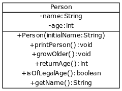

<!-- Muotoillaan pääohjelma käyttämään uutta "getteri"-metodia: -->

Let's mould the main program to use the new "getter" method:

<!-- ```java
public static void main(String[] args) {
    Henkilo pekka = new Henkilo("Pekka");
    Henkilo antti = new Henkilo("Antti");

    int i = 0;
    while (i < 30) {
        pekka.vanhene();
        i = i + 1;
    }

    antti.vanhene();

    System.out.println("");

    if (antti.taysiIkainen()) {
        System.out.println(antti.getNimi() + " on täysi-ikäinen");
    } else {
        System.out.println(antti.getNimi() + " on alaikäinen");
    }

    if (pekka.taysiIkainen()) {
        System.out.println(pekka.getNimi() + " on täysi-ikäinen");
    } else {
        System.out.println(pekka.getNimi() + " on alaikäinen ");
    }
}
``` -->

```java
public static void main(String[] args) {
    Person pekka = new Person("Pekka");
    Person antti = new Person("Antti");

    int i = 0;
    while (i < 30) {
        pekka.growOlder();
        i = i + 1;
    }

    antti.growOlder();

    System.out.println("");

    if (antti.isOfLegalAge()) {
        System.out.println(antti.getName() + " is of legal age");
    } else {
        System.out.println(antti.getName() + " is underage");
    }

    if (pekka.isOfLegalAge()) {
        System.out.println(pekka.getName() + " is of legal age");
    } else {
        System.out.println(pekka.getName() + " is underage ");
    }
}
```

<!-- Tulostus alkaa olla jo aika siisti: -->

The print output is starting to turn out quit neat:

<!-- <sample-output>

Antti on alaikäinen
Pekka on täysi-ikäinen

</sample-output> -->

<sample-output>

Antti is underage
Pekka is of legal age

</sample-output>

<!-- <programming-exercise name='Mittari' tmcname='osa04-Osa04_12.Mittari'> -->
<programming-exercise name='Gauge' tmcname='part04-Part04_12.Gauge'>

<!-- Luo luokka `Mittari`. Mittarilla on oliomuuttuja `private int mitta`, parametriton konstruktori (asettaa muuttujan mitta alkuarvoksi 0), sekä seuraavat neljä metodia:

- Metodi `public void lisaa()` kasvattaa oliomuuttujan `mitta` arvoa yhdellä. Ei kasvata arvoa yli viiden.
- Metodi `public void vahenna()` vähentää oliomuuttujan `mitta` arvoa yhdellä. Ei vähennä arvoa negatiiviseksi.
- Metodi `public int mitta()` palauttaa oliomuuttujan `mitta` arvon.
- Metodi `public boolean taynna()` palauttaa `true` mikäli oliomuuttujan `mitta` on viisi, palauttaa muulloin false.

Esimerkki luokan käytöstä. -->

Create the class `Gauge`. The gauge has the instance variable `private int value`, a constructor without parameters (sets the initial value of the meter variable to 0), and also the following four methods:

- Method `public void increase()` grows the `value` instance variable's value by one. It does not grow the value beyond five.
- Method `public void decrease()` decreases the `value` instance variable's value by one. It does not decrease the value to negative numbers.
- Method `public int value()` returns the `value` variable's value.
- Method `public boolean full()` returns `true` if the instance variable `value` has the value five. Otherwise, it returns false.

An example of the class in use.

<!-- ```java
Mittari m = new Mittari();

while(!m.taynna()) {
    System.out.println("Ei täynnä! Mitta: " + m.mitta());
    m.lisaa();
}

System.out.println("Täynnä! Mitta: " + m.mitta());
m.vahenna();
System.out.println("Ei täynnä! Mitta: " + m.mitta());

``` -->

```java
Gauge g = new Gauge();

while(!g.full()) {
    System.out.println("Not full! Value: " + g.value());
    g.increase();
}

System.out.println("Full! Value: " + g.value());
g.decrease();
System.out.println("Not full! Value: " + g.value());

```

<!-- <sample-output>

Ei täynnä! Mitta: 0
Ei täynnä! Mitta: 1
Ei täynnä! Mitta: 2
Ei täynnä! Mitta: 3
Ei täynnä! Mitta: 4
Täynnä! Mitta: 5
Ei täynnä! Mitta: 4

</sample-output> -->

<sample-output>

Not full! Value: 0
Not full! Value: 1
Not full! Value: 2
Not full! Value: 3
Not full! Value: 4
Full! Value: 5
Not full! Value: 4

</sample-output>

</programming-exercise>

<!-- ## Olion merkkijonoesitys ja toString-metodi -->

## A string representation of an object and the toString-method

<!-- Olemme syyllistyneet osittain huonoon ohjelmointityyliin tekemällä metodin jonka avulla olio tulostetaan, eli metodin `tulostaHenkilo`. Suositeltavampi tapa on määritellä oliolle metodi jonka palauttaa olion "merkkijonoesityksen". Merkkijonoesityksen palauttavan metodin nimi on Javassa aina `toString`. Määritellään seuraavassa henkilölle tämä metodi: -->

We are guilty of programming in a somewhat poor style by creating a method for printing the object, i.e., the `printPerson` method. A preferred way is to define a method for the object that returns a "string representation" of the object. The method returning the string representation is always `toString` in Java. Let's define this method for the person in the following example:

<!-- ```java
public class Henkilo {
    // ...

    public String toString() {
        return this.nimi + ", ikä " + this.ika + " vuotta";
    }
}
``` -->

```java
public class Person {
    // ...

    public String toString() {
        return this.name + ", age " + this.age + " years";
    }
}
```

<!-- Metodi `toString` toimii kuten `tulostaHenkilo`, mutta se ei itse tulosta mitään vaan palauttaa merkkijonoesityksen, jota metodin kutsuja voi halutessaan suorittaa tulostamisen.

Metodia käytetään hieman yllättävällä tavalla: -->

The `toString` functions as `printPerson` does. However, it doesn't itself print anything but instead returns a string representation, which the calling method can execute for printing as needed.

The method is used in a somewhat surprising way:

<!-- ```java
public static void main(String[] args) {
    Henkilo pekka = new Henkilo("Pekka");
    Henkilo antti = new Henkilo("Antti");

    int i = 0;
    while (i < 30) {
        pekka.vanhene();
        i = i + 1;
    }

    antti.vanhene();

    System.out.println(antti); // sama kun System.out.println(antti.toString());
    System.out.println(pekka); // sama kun System.out.println(pekka.toString());
}
``` -->
<!-- ```java
public static void main(String[] args) {
    Henkilo pekka = new Henkilo("Pekka");
    Henkilo antti = new Henkilo("Antti");

    int i = 0;
    while (i < 30) {
        pekka.vanhene();
        i = i + 1;
    }

    antti.vanhene();

    System.out.println(antti); // sama kun System.out.println(antti.toString());
    System.out.println(pekka); // sama kun System.out.println(pekka.toString());
}
``` -->

```java
public static void main(String[] args) {
    Person pekka = new Person("Pekka");
    Person antti = new Person("Antti");

    int i = 0;
    while (i < 30) {
        pekka.growOlder();
        i = i + 1;
    }

    antti.growOlder();

    System.out.println(antti); // same as System.out.println(antti.toString());
    System.out.println(pekka); // same as System.out.println(pekka.toString());
}
```

<!-- Periaatteena on, että `System.out.println`-metodi pyytää olion merkkijonoesityksen ja tulostaa sen. Merkkijonoesityksen palauttavan `toString`-metodin kutsua ei tarvitse kirjoittaa itse, sillä Java lisää sen automaattisesti. Ohjelmoijan kirjoittaessa: -->

In principle, the `System.out.println` method requests the object's string representation and prints it. The call to the `toString` method returning the string representation does not have to be written explicitly, as Java adds it automatically. When a programmer writes:

```java
System.out.println(antti);
```

<!-- Java täydentää suorituksen aikana kutsun muotoon: -->

Java extends the call at run time to the following form:

```java
System.out.println(antti.toString());
```

<!-- Kutsu `System.out.println(antti)` kutsuu siis `antti`-olion `toString`-metodia ja tulostaa sen palauttaman merkkijonon.

Voimme nyt poistaa luokasta Henkilo turhaksi käyneen `tulostaHenkilo`-metodin.

Olioscreencastin toinen osa: -->

As such, the call `System.out.println(antti)` calls the `toString` method of the `antti` object and prints the string returned by it.

We can remove the now obsolete `printPerson` method from the Person class.

The second part of the screencast:

<youtube id='d-56AxspStE'><youtube>

&nbsp;

<!-- <programming-exercise name='Agentti' tmcname='osa04-Osa04_13.Agentti'>**** -->

<programming-exercise name='Agent' tmcname='part04-Part04_13.Agent'>

<!-- Tehtäväpohjassa on määriteltynä luokka Agentti, jolla on etunimi ja sukunimi. Luokalle on määritelty metodi `tulosta`, joka luo seuraavanlaisen merkkijonoesityksen. -->

The exercise template defines an Agent class, having a first name and last name. A `print` method is defined for the class that creates the following string representation.

<!--
```java
Agentti bond = new Agentti("James", "Bond");
bond.tulosta();
``` -->

```java
Agent bond = new Agent("James", "Bond");
bond.print();
```

<sample-output>

My name is Bond, James Bond

</sample-output>

<!-- Poista luokan metodi `tulosta` ja luo luokalle metodi `public String toString()`, joka palauttaa edellämainitun merkkijonoesityksen.

Luokan tulee toimia jatkossa seuraavasti. -->

Remove the class' `print` method, and create a `public String toString()` method for it, which returns the string representation shown above.

The class should function as follows.

<!-- ```java
Agentti bond = new Agentti("James", "Bond");

bond.toString(); // ei tulosta mitään
System.out.println(bond);

Agentti ionic = new Agentti("Ionic", "Bond");
System.out.println(ionic);
``` -->

```java
Agent bond = new Agent("James", "Bond");

bond.toString(); // prints nothing
System.out.println(bond);

Agent ionic = new Agent("Ionic", "Bond");
System.out.println(ionic);
```

<sample-output>

My name is Bond, James Bond
My name is Bond, Ionic Bond

</sample-output>

</programming-exercise>

<!-- ## Metodin parametrit -->

## Method parameters

<!-- Jatketaan taas `Henkilo`-luokan parissa. Päätetään että haluamme laskea henkilöiden painoindeksejä. Tätä varten teemme henkilölle metodit pituuden ja painon asettamista varten, sekä metodin joka laskee painoindeksin. Henkilön uudet ja muuttuneet osat seuraavassa: -->

Let's continue with the `Person` class once more. We've decided that we want to calculate people's body mass indexes. To do this, we write methods for the person to set both the height and the weight, and also a method to calculate the body mass index. The new and changed parts of the Person object are as follows:

<!-- ```java
public class Henkilo {
    private String nimi;
    private int ika;
    private int paino;
    private int pituus;

    public Henkilo(String nimiAlussa) {
        this.ika = 0;
        this.paino = 0;
        this.pituus = 0;
        this.nimi = nimiAlussa;
    }

    public void setPituus(int uusiPituus) {
        this.pituus = uusiPituus;
    }

    public void setPaino(int uusiPaino) {
        this.paino = uusiPaino;
    }

    public double painoindeksi() {
        double pituusPerSata = this.pituus / 100.0;
        return this.paino / (pituusPerSata * pituusPerSata);
    }

    // ...
}
``` -->

```java
public class Person {
    private String name;
    private int age;
    private int weight;
    private int height;

    public Person(String initialName) {
        this.age = 0;
        this.weight = 0;
        this.height = 0;
        this.name = initialName;
    }

    public void setHeight(int newHeight) {
        this.height = newHeight;
    }

    public void setWeight(int newWeight) {
        this.weight = newWeight;
    }

    public double bodyMassIndex() {
        double heigthPerHundred = this.height / 100.0;
        return this.weight / (heigthPerHundred * heigthPerHundred);
    }

    // ...
}
```

<!-- Eli henkilölle lisättiin oliomuuttujat `pituus` ja `paino`. Näille voi asettaa arvon metodeilla `setPituus` ja `setPaino`. Jälleen käytössä Javaan vakiintunut nimeämiskäytäntö, eli jos metodin tehtävänä on ainoastaan asettaa arvo oliomuuttujaan, on metodi tapana nimetä `setMuuttujanNimi`:ksi. Arvon asettavia metodeja kutsutaan usein "settereiksi". Seuraavassa käytämme uusia metodeja: -->

The instance variables `height` and`weight` were added to the person. Values for these can be set using the `setHeight` and `setWeight` methods. Java's standard naming convention is used once again, that is, if the method's only purpose is to set a value to an instance variable, then it's named as `setVariableName`. Value-setting methods are often called "setters". The new methods are put to use in the following case:

<!-- ```java
public static void main(String[] args) {
    Henkilo matti = new Henkilo("Matti");
    Henkilo juhana = new Henkilo("Juhana");

    matti.setPituus(180);
    matti.setPaino(86);

    juhana.setPituus(175);
    juhana.setPaino(64);

    System.out.println(matti.getNimi() + ", painoindeksisi on " + matti.painoindeksi());
    System.out.println(juhana.getNimi() + ", painoindeksisi on " + juhana.painoindeksi());
}
``` -->

```java
public static void main(String[] args) {
    Person matti = new Person("Matti");
    Person juhana = new Person("Juhana");

    matti.setHeight(180);
    matti.setWeight(86);

    juhana.setHeight(175);
    juhana.setWeight(64);

    System.out.println(matti.getName() + ", body mass index is " + matti.bodyMassIndex());
    System.out.println(juhana.getName() + ", body mass index is " + juhana.bodyMassIndex());
}
```

<!-- Tulostus: -->

Prints:

<!-- <sample-output>

Matti, painoindeksisi on 26.54320987654321
Juhana, painoindeksisi on 20.897959183673468

</sample-output> -->

<sample-output>

Matti, body mass index is 26.54320987654321
Juhana, body mass index is 20.897959183673468

</sample-output>

<!-- ## Parametrilla ja oliomuuttujalla sama nimi! -->

## A parameter and instance variable having the same name!

<!--
Edellä metodissa `setPituus` asetetaan oliomuuttujaan `pituus` parametrin `uusiPituus` arvo: -->

In the preceding example, the `setHeight` method sets the value of the parameter `newHeight` to the instance variable `height`:

<!-- ```java
public void setPituus(int uusiPituus) {
    this.pituus = uusiPituus;
}
``` -->

```java
public void setHeight(int newHeight) {
    this.height = newHeight;
}
```

<!-- Parametrin nimi voisi olla myös sama kuin oliomuuttujan nimi, eli seuraava toimisi myös: -->

The parameter's name could also be the same as the instance variable's, so the following would also work:

<!-- ```java
public void setPituus(int pituus) {
    this.pituus = pituus;
}
``` -->

```java
public void setHeight(int height) {
    this.height = height;
}
```

<!-- Nyt metodissa `pituus` tarkottaa nimenomaan *pituus*-nimistä parametria ja `this.pituus` saman nimistä oliomuuttujaa. Esim. seuraava ei toimisi sillä koodi ei viittaa ollenkaan oliomuuttujaan *pituus* -- koodi käytännössä asettaa parametrina saadulle `pituus`-muuttujalle siinä jo olevan arvon: -->

In this case, `height` in the method refers specifically to a parameter named _height_ and `this.height` to an instance variable of the same name. For example, the following example would not work as the code does not refer to the instance variable _height_ at all. What the code does in effect is set the `height` variable received as a parameter to the value it already contains:

<!-- ```java
public void setPituus(int pituus) {
    // ÄLÄ TEE NÄIN!!!
    pituus = pituus;
}
```

```java
public void setPituus(int pituus) {
    // VAAN NÄIN!!!
    this.pituus = pituus;
}
``` -->

```java
public void setHeight(int height) {
    // DON'T DO THIS!!!
    height = height;
}
```

```java
public void setHeight(int height) {
    // DO THIS INSTEAD!!!
    this.height = height;
}
```

<!-- <programming-exercise name='Kertoja' tmcname='osa04-Osa04_14.Kertoja'> -->
<programming-exercise name='Multiplier' tmcname='part04-Part04_14.Multiplier'>

<!-- Luo luokka `Kertoja` jolla on:

- Konstruktori `public Kertoja(int luku)`.
- Metodi `public int kerro(int luku)` joka palauttaa sille annetun luvun `luku` kerrottuna konstruktorille annetulla luvulla `luku`.

Tarvinnet tässä myös oliomuuttujan...

Esimerkki luokan käytöstä: -->

Create a class Multiplier that has a:

- Constructor `public Multiplier(int number)`.
- Method `public int multiply(int number)` which returns the value `number` passed to it multiplied by the `number` provided to the constructor.

You also need to create an instance variable in this exercise.

An example of the class in use:

<!-- ```java
Kertoja kolmellaKertoja = new Kertoja(3);

System.out.println("kolmellaKertoja.kerro(2): " + kolmellaKertoja.kerro(2));

Kertoja neljallaKertoja = new Kertoja(4);

System.out.println("neljallaKertoja.kerro(2): " + neljallaKertoja.kerro(2));
System.out.println("kolmellaKertoja.kerro(1): " + kolmellaKertoja.kerro(1));
System.out.println("neljallaKertoja.kerro(1): " + neljallaKertoja.kerro(1));
``` -->

```java
Multiplier multiplyByThree = new Multiplier(3);

System.out.println("multiplyByThree.multiply(2): " + multiplyByThree.multiply(2));

Multiplier multiplyByFour = new Multiplier(4);

System.out.println("multiplyByFour.multiply(2): " + multiplyByFour.multiply(2));
System.out.println("multiplyByThree.multiply(1): " + multiplyByThree.multiply(1));
System.out.println("multiplyByFour.multiply(1): " + multiplyByFour.multiply(1));
```

<!-- Tulostus -->

Output

<!-- <sample-output>

kolmellaKertoja.kerro(2): 6
neljallaKertoja.kerro(2): 8
kolmellaKertoja.kerro(1): 3
neljallaKertoja.kerro(1): 4

</sample-ouptput> -->

<sample-output>

multiplyByThree.multiply(2): 6
multiplyByFour.multiply(2): 8
multiplyByThree.multiply(1): 3
multiplyByFour.multiply(1): 4

</sample-output>

</programming-exercise>

<!-- ## Oman metodin kutsu -->

## Calling an internal method

<!-- Olio voi kutsua myös omia metodeitaan. Jos esim. halutaan, että toString-metodin palauttama merkkijonoesitys kertoisi myös henkilön painoindeksin, kannattaa `toString`:istä kutsua olion omaa metodia `painoIndeksi`: -->

The object may also call its methods. For example, if we wanted the string representation returned by toString to also tell of a person's body mass index, the object's own `bodyMassIndex` method should be called in the `toString` method:

<!--
```java
public String toString() {
    return this.nimi + ", ikä " + this.ika + " vuotta, painoindeksini on " + this.painoindeksi();
}
``` -->

```java
public String toString() {
    return this.name + ", age " + this.age + " years, my body mass index is " + this.bodyMassIndex();
}
```

<!-- Eli kun olio kutsuu omaa metodiaan, riittää etuliite this ja pelkkä metodin nimi. Vaihtoehtoinen tapa on tehdä oman metodin kutsu muodossa `painoindeksi()` jolloin ei korosteta, että kutsutaan "olion itsensä" metodia painoindeksi: -->

So, when an object calls an internal method, the name of the method and this prefix suffice. An alternative way is to call the object's own method in the form `bodyMassIndex()`, whereby no emphasis is placed on the fact that the object's own bodyMassIndex method is being called:

<!-- ```java
public String toString() {
    return this.nimi + ", ikä " + this.ika + " vuotta, painoindeksini on " + painoindeksi();
}
``` -->

```java
public String toString() {
    return this.name + ", age " + this.age + " years, my body mass index is " + bodyMassIndex();
}
```

<!-- Olioscreencastin kolmas osa: -->

The screencast's third part:

<youtube id='YKwzIGuCLn8'></youtube>

&nbsp;

<!-- <programming-exercise name='Lukutilasto (4 osaa)' tmcname='osa04-Osa04_15.Lukutilasto'> -->
<programming-exercise name='Statistics (4 parts)' tmcname='part04-Part04_15.NumberStatistics'>

<!-- <h2>Lukujen määrä</h2> -->
<h2>Count</h2>

<!-- Tee luokka `Lukutilasto` (tiedosto luomaasi luokkaa varten on tehtäväpohjassa valmiina), joka tuntee seuraavat toiminnot:

- metodi `lisaaLuku` lisää uuden luvun tilastoon
- metodi `haeLukujenMaara` kertoo lisättyjen lukujen määrän

Luokan ei tarvitse tallentaa mihinkään lisättyjä lukuja, vaan riittää muistaa niiden määrä. Metodin `lisaaLuku` ei tässä vaiheessa tarvitse edes ottaa huomioon, mikä luku lisätään tilastoon, koska ainoa tallennettava asia on lukujen määrä.

Luokan runko on seuraava: -->

Create a class `Statistics` that has the following functionality(the file for the class is provided in the in the exercise template):

- a method `addNumber` adds a new number to the statistics
- a method `getCount` tells the number of added numbers

The class does not need to store the added numbers anywhere, it is enough for it to remember their count. At this stage, the `addNumber` method can even neglect the numbers being added to the statistics, since the only thing being stored is the count of numbers added.

The method's body is the following:

<!--
```java
public class Lukutilasto {
    private int lukujenMaara;

    public Lukutilasto() {
        // alusta tässä muuttuja lukujenMaara
    }

    public void lisaaLuku(int luku) {
        // kirjoita koodia tähän
    }

    public int haeLukujenMaara() {
        // kirjoita koodia tähän
    }
}
``` -->

```java
public class Statistics {
    private int count;

    public NumberStatistics() {
        // initialize the variable numberCount here
    }

    public void addNumber(int number) {
        // write code here
    }

    public int getCount() {
        // write code here
    }
}
```

<!-- Seuraava ohjelma esittelee luokan käyttöä: -->

The following program introduces the class' use:

<!-- ```java
public class Paaohjelma {
    public static void main(String[] args) {
        Lukutilasto tilasto = new Lukutilasto();
        tilasto.lisaaLuku(3);
        tilasto.lisaaLuku(5);
        tilasto.lisaaLuku(1);
        tilasto.lisaaLuku(2);
        System.out.println("Määrä: " + tilasto.haeLukujenMaara());
    }
}
``` -->

```java
public class MainProgram {
    public static void main(String[] args) {
        Statistics statistics = new Statistics();
        statistics.addNumber(3);
        statistics.addNumber(5);
        statistics.addNumber(1);
        statistics.addNumber(2);
        System.out.println("Count: " + statistics.getCount());
    }
}
```

<!-- Ohjelman tulostus on seuraava: -->

The program prints the following:

<!-- <sample-output>

Määrä: 4

</sample-output> -->

<sample-output>

Count: 4

</sample-output>

<!-- <h2>Summa ja keskiarvo</h2> -->
<h2>Sum and average</h2>

<!-- Laajenna luokkaa seuraavilla toiminnoilla:

- metodi `summa` kertoo lisättyjen lukujen summan (tyhjän lukutilaston summa on 0)
- metodi `keskiarvo` kertoo lisättyjen lukujen keskiarvon (tyhjän lukutilaston keskiarvo on 0)

Luokan runko on seuraava: -->

Expand the class with the following functionality:

- the `sum` method tells the sum of the numbers added (the sum of an empty number statistics object is 0)
- the `average` method tells the average of the numbers added (the average of an empty number statistics object is 0

The class' template is the following:

<!-- ```java
public class Lukutilasto {
    private int lukujenMaara;
    private int summa;

    public Lukutilasto() {
        // alusta tässä muuttujat maara ja summa
    }

    public void lisaaLuku(int luku) {
        // kirjoita koodia tähän
    }

    public int haeLukujenMaara() {
        // kirjoita koodia tähän
    }

    public int summa() {
        // kirjoita koodia tähän
    }

    public double keskiarvo() {
        // kirjoita koodia tähän
    }
}
``` -->

```java
public class Statistics {
    private int count;
    private int sum;

    public Statistics() {
        // initialize the variables count and sum here
    }

    public void addNumber(int number) {
        // write code here
    }

    public int getCount() {
        // write code here
    }

    public int sum() {
        // write code here
    }

    public double average() {
        // write code here
    }
}
```

<!-- Seuraava ohjelma esittelee luokan käyttöä: -->

The following program demonstrates the class' use:

<!-- ```java
public class Main {
    public static void main(String[] args) {
        Lukutilasto tilasto = new Lukutilasto();
        tilasto.lisaaLuku(3);
        tilasto.lisaaLuku(5);
        tilasto.lisaaLuku(1);
        tilasto.lisaaLuku(2);
        System.out.println("Määrä: " + tilasto.haeLukujenMaara());
        System.out.println("Summa: " + tilasto.summa());
        System.out.println("Keskiarvo: " + tilasto.keskiarvo());
    }
}
``` -->

```java
public class Main {
    public static void main(String[] args) {
        NumberStatistics statistics = new NumberStatistics();
        statistics.addNumber(3);
        statistics.addNumber(5);
        statistics.addNumber(1);
        statistics.addNumber(2);
        System.out.println("Count: " + statistics.getCount());
        System.out.println("Sum: " + statistics.sum());
        System.out.println("Average: " + statistics.average());
    }
}
```

<!-- Ohjelman tulostus on seuraava: -->

The program prints the following:

<!-- <sample-output>

Määrä: 4
Summa: 11
Keskiarvo: 2.75

</sample-output> -->

<sample-output>

Count: 4
Sum: 11
Average: 2.75

</sample-output>

<!-- <h2>Summa käyttäjältä</h2> -->
<h2>Sum of user input</h2>

<!-- Tee ohjelma, joka kysyy lukuja käyttäjältä, kunnes käyttäjä antaa luvun -1. Sitten ohjelma ilmoittaa lukujen summan.

Ohjelmassa tulee käyttää `Lukutilasto`-olioa summan laskemiseen.

**HUOM:** Älä muuta tässä osassa luokka Lukutilasto, vaan toteuta sitä hyödyntäen summan laskemiseen käytetty ohjelma. -->

Write a program that asks the user for numbers until the user enters -1. The program will then provide the sum of the numbers.

The program should use a `NumberStatistics` object to calculate the sum.

**NOTE:** Do not modify the NumberStatistics class in this part. Instead, implement the program for calculating the sum by making use of it.

<!-- <sample-output>

Anna lukuja:
**4**
**2**
**5**
**4**
**-1**
Summa: 15

</sample-output> -->

<sample-output>

Enter numbers:
**4**
**2**
**5**
**4**
**-1**
Sum: 15

</sample-output>

<!-- <h2>Monta summaa</h2> -->
<h2>Multiple sums</h2>

<!-- Muuta edellistä ohjelmaa niin, että ohjelma laskee myös parillisten ja parittomien lukujen summaa.

**HUOM**: Määrittele ohjelmassa *kolme* Lukutilasto-olioa ja laske ensimmäisen avulla kaikkien lukujen summa, toisen avulla parillisten lukujen summa ja kolmannen avulla parittomien lukujen summa.

**Jotta testi toimisi, on oliot luotava pääohjelmassa edellä mainitussa järjestyksessä (eli ensin kaikkien summan laskeva olio, toisena parillisten summan laskeva ja viimeisenä parittomien summan laskeva olio)!**

**HUOM:** älä muuta Lukutilasto-luokaa millään tavalla!

Ohjelman tulee toimia seuraavasti: -->

Change the previous program so that it also calculates the sum of even and odd numbers.

**NOTE**: Define _three_ Statistics objects in the program. Use the first to calculate the sum of all numbers, the second to calculate the sum of even numbers, and the third to calculate the sum of odd numbers.

**For the test to work, the objects must be created in the main program in the order they were mentioned above (i.e., first the object that sums all the numbers, then the one that sums the even ones, and then finally the one that sums the odd numbers)!**

**NOTE:** Do not change the Statistics class in any way!

The program should work as follows:

<!-- Anna lukuja:
**4**
**2**
**5**
**2**
**-1**
Summa: 13
Parillisten summa: 8
Parittomien summa: 5

</sample-output> -->

<sample-output>

Enter numbers:
**4**
**2**
**5**
**2**
**-1**
Sum: 13
Sum of even numbers: 8
Sum of odd numbers: 5

</sample-output>

</programming-exercise>

<!-- <programming-exercise name='Maksukortti (6 osaa)' tmcname='osa04-Osa04_16.Maksukortti'> -->
<programming-exercise name='Payment Card (6 parts)' tmcname='part04-Part04_16.PaymentCard'>

<!-- Helsingin Yliopiston opiskelijaruokaloissa eli Unicafeissa opiskelijat maksavat lounaansa käyttäen maksukorttia. Lopullinen Maksukortti tulee näyttämään luokkakaaviona seuraavalta: -->

At the University of Helsinki student canteen, i.e. Unicafe, students pay for their lunch using a payment card. The final PaymentCard will look like the following as a class diagram:

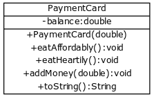

<!-- Tässä tehtäväsäsarjassa tehdään luokka `Maksukortti`, jonka tarkoituksena on jäljitellä Unicafeissa tapahtuvaa maksutoimintaa. -->

In this exercise series, a class called `PaymentCard` is created which aims to mimic Unicafe's payment process

<!-- <h2>Luokan runko</h2> -->
<h2>The class template</h2>

<!-- Projektiin tulee kuulumaan kaksi kooditiedostoa:

Tehtäväpohjan mukana tulee kooditiedosto `Paaohjelma` jonka sisällä on `main`-metodi.

Lisää projektiin uusi luokka nimeltä `Maksukortti`. Uuden luokan saa lisättyä seuraavasti: Ruudun vasemmalla reunalla on projektilistaus. Paina projektin nimen kohdalla hiiren oikeaa nappia. Valitse avautuvasta valikosta *New* ja *Java Class*. Anna luokan nimeksi (Class Name) `Maksukortti`.

Tee ensin `Maksukortti`-olion konstruktori, jolle annetaan kortin alkusaldo ja joka tallentaa sen olion sisäiseen muuttujaan. Tee sitten `toString`-metodi, joka palauttaa kortin saldon muodossa "Kortilla on rahaa X euroa".

Seuraavassa on luokan `Maksukortti` runko: -->

The project will include two code files:

The exercise template comes with a code file called `Main`, which contains the `main` method.

Add a new class to the project called `PaymentCard`. Here's how to add a new class: On the left side of the screen is the list of projects. Right-click on the project name. Select _New_ and _Java Class_ from the drop-down menu. Name the class as "Payment Card".

First, create the `PaymentCard` object's constructor, which is passed the opening balance of the card, and which then stores that balance in the object's internal variable. Then, write the `toString` method, which will return the card's balance in the form "The card has a balance of X euros".

The following is the template of the `PaymentCard` class:

<!-- ```java
public class Maksukortti {
    private double saldo;

    public Maksukortti(double alkusaldo) {
        // kirjoita koodia tähän
    }

    public String toString() {
        // kirjoita koodia tähän
    }
}
``` -->

```java
public class PaymentCard {
    private double balance;

    public PaymentCard(double openingBalance) {
        // write code here
    }

    public String toString() {
        // write code here
    }
}
```

<!-- Seuraava pääohjelma testaa luokkaa: -->

The following main program tests the class:

<!-- ```java
public class Paaohjelma {
    public static void main(String[] args) {
        Maksukortti kortti = new Maksukortti(50);
        System.out.println(kortti);
    }
}
``` -->

```java
public class MainProgram {
    public static void main(String[] args) {
        PaymentCard card = new PaymentCard(50);
        System.out.println(card);
    }
}
```

<!-- Ohjelman tulisi tuottaa seuraava tulostus: -->

The program should print the following:

<!-- <sample-output>

Kortilla on rahaa 50.0 euroa

</sample-output> -->

<sample-output>

The card has a balance of 50.0 euros

</sample-output>

<!-- <h2>Kortilla maksaminen</h2> -->
<h2>Making transactions</h2>

<!--
Täydennä `Maksukortti`-luokkaa seuraavilla metodeilla: -->

Complement the `PaymentCard` class with the follwing methods:

<!-- ```java
public void syoEdullisesti() {
    // kirjoita koodia tähän
}

public void syoMaukkaasti() {
    // kirjoita koodia tähän
}
``` -->

```java
public void eatAffordably() {
    // write code here
}

public void eatHeartily() {
    // write code here
}
```

<!-- Metodin `syoEdullisesti` tulisi vähentää kortin saldoa 2.60 eurolla ja metodin `syoMaukkaasti` tulisi vähentää kortin saldoa 4.60 eurolla.

Seuraava pääohjelma testaa luokkaa: -->

The method `eatAffordably` should reduce the card's balance by € 2.60, and the method `eatHeartily` should reduce the card's balance by € 4.60.

The following main program tests the class:

<!-- ```java
public class Paaohjelma {
    public static void main(String[] args) {
        Maksukortti kortti = new Maksukortti(50);
        System.out.println(kortti);

        kortti.syoEdullisesti();
        System.out.println(kortti);

        kortti.syoMaukkaasti();
        kortti.syoEdullisesti();
        System.out.println(kortti);
    }
}
``` -->

```java
public class MainProgram {
    public static void main(String[] args) {
        PaymentCard card = new PaymentCard(50);
        System.out.println(card);

        card.eatAffordably();
        System.out.println(card);

        card.eatHeartily();
        card.eatAffordably();
        System.out.println(card);
    }
}
```

<!-- Ohjelman tulisi tuottaa kutakuinkin seuraava tulostus: -->

The program should print approximately the following:

<!-- <sample-output>

Kortilla on rahaa 50.0 euroa
Kortilla on rahaa 47.4 euroa
Kortilla on rahaa 40.199999999999996 euroa

</sample-output> -->

<sample-output>

The card has a balance of 50.0 euros
The card has a balance of 47.4 euros
The card has a balance of 40.199999999999996 euros

</sample-output>

<!-- <h2>Ei-negatiivinen saldo</h2> -->
<h2>Non-negative balance</h2>

<!-- Mitä tapahtuu, jos kortilta loppuu raha kesken? Ei ole järkevää, että saldo muuttuu negatiiviseksi. Muuta metodeita `syoEdullisesti` ja `syoMaukkaasti` niin, että ne eivät vähennä saldoa, jos saldo menisi negatiiviseksi.

Seuraava pääohjelma testaa luokkaa: -->

What happens if the card runs out of money? It doesn't make sense in this case for the balance to turn negative. Change the methods `eatAffordably` and `eatHeartily` so that they don't reduce the balance should it turn negative.

The following main program tests the class:

<!-- ```java
public class Paaohjelma {
    public static void main(String[] args) {
        Maksukortti kortti = new Maksukortti(5);
        System.out.println(kortti);

        kortti.syoMaukkaasti();
        System.out.println(kortti);

        kortti.syoMaukkaasti();
        System.out.println(kortti);
    }
} -->

```java
public class MainProgram {
    public static void main(String[] args) {
        PaymentCard card = new PaymentCard(5);
        System.out.println(card);

        card.eatHeartily();
        System.out.println(card);

        card.eatHeartily();
        System.out.println(card);
    }
}
```

<!-- Ohjelman tulisi tuottaa seuraava tulostus: -->

The program should print the following:

<!-- <sample-output>

Kortilla on rahaa 5.0 euroa
Kortilla on rahaa 0.40000000000000036
Kortilla on rahaa 0.40000000000000036

</sample-output> -->

<sample-output>

The card has a balance 5.0 euros
The card has a balance 0.40000000000000036 euros
The card has a balance 0.40000000000000036 euros

</sample-output>

<!-- Yllä toinen metodin `syoMaukkaasti` kutsu ei vaikuttanut saldoon, koska saldo olisi mennyt negatiiviseksi. -->

The second call to the method `eatHeartily` above did not affect the balance, since the balance would have otherwise become negative.

<!-- <h2>Kortin lataaminen</h2> -->
<h2>Topping up the card</h2>

<!-- Lisää `Maksukortti`-luokkaan seuraava metodi: -->

Add the following method to the `PaymentCard` class:

<!-- ```java
public void lataaRahaa(double rahamaara) {
    // kirjoita koodia tähän
}
``` -->

```java
public void addMoney(double amount) {
    // write code here
}
```

<!-- Metodin tarkoituksena on kasvattaa kortin saldoa parametrina annetulla rahamäärällä. Kuitenkin kortin saldo saa olla korkeintaan 150 euroa, joten jos ladattava rahamäärä ylittäisi sen, saldoksi tulisi tulla silti tasan 150 euroa.

Seuraava pääohjelma testaa luokkaa: -->

The purpose of the method is to increase the card's balance by the amount of money given as a parameter. However, the card's balance may not exceed 150 euros. As such, if the amount to be topped up exceeds this limit, the balance should, in any case, become exactly 150 euros.

The following main program tests the class:

<!-- ```java
public class Paaohjelma {
    public static void main(String[] args) {
        Maksukortti kortti = new Maksukortti(10);
        System.out.println(kortti);

        kortti.lataaRahaa(15);
        System.out.println(kortti);

        kortti.lataaRahaa(10);
        System.out.println(kortti);

        kortti.lataaRahaa(200);
        System.out.println(kortti);
    }
}
``` -->

```java
public class MainProgram {
    public static void main(String[] args) {
        PaymentCard card = new PaymentCard(10);
        System.out.println(card);

        card.addMoney(15);
        System.out.println(card);

        card.addMoney(10);
        System.out.println(card);

        card.addMoney(200);
        System.out.println(card);
    }
}
```

<!-- Ohjelman tulisi tuottaa seuraava tulostus: -->

The program should print the following:

<!-- <sample-output>

Kortilla on rahaa 10.0 euroa
Kortilla on rahaa 25.0 euroa
Kortilla on rahaa 35.0 euroa
Kortilla on rahaa 150.0 euroa

</sample-output> -->

<sample-output>

The card has a balance of 10.0 euros
The card has a balance of 25.0 euros
The card has a balance of 35.0 euros
The card has a balance of 150.0 euros

</sample-output>

<!-- <h2>Kortin lataus negatiivisella arvolla</h2> -->
<h2>Topping up the card with a negative value</h2>

<!-- Muuta metodia `lataaRahaa` vielä siten, että jos yritetään ladata negatiivinen rahamäärä, ei kortilla oleva arvo muutu.

Seuraava pääohjelma testaa luokkaa: -->

Change the `addMoney` method further, so that if there is an attempt to top it up with a negative amount, the value on the card will not change.

The following main program tests the class:

<!-- ```java
public class Paaohjelma {
    public static void main(String[] args) {
        Maksukortti kortti = new Maksukortti(10);
        System.out.println("Pekka: " + kortti);
        kortti.lataaRahaa(-15);
        System.out.println("Pekka: " + kortti);
    }
}
``` -->

```java
public class MainProgram {
    public static void main(String[] args) {
        PaymentCard card = new PaymentCard(10);
        System.out.println("Paul: " + card);
        card.addMoney(-15);
        System.out.println("Paul: " + card);
    }
}
```

<!-- Ohjelman tulisi tuottaa seuraava tulostus: -->

The program should print the following:

<!-- <sample-output>

Pekka: Kortilla on rahaa 10.0 euroa
Pekka: Kortilla on rahaa 10.0 euroa

</sample-output> -->

<sample-output>

Paul: The card has a balance of 10.0 euros
Paul: The card has a balance of 10.0 euros

</sample-output>

<!-- <h2>Monta korttia</h -->
<h2>Multiple cards</h2>

<!-- Tee luokan `Paaohjelma` `main`-metodiin koodi, joka sisältää seuraavan tapahtumasarjan:

- Luo Pekan kortti. Kortin alkusaldo on 20 euroa
- Luo Matin kortti. Kortin alkusaldo on 30 euroa
- Pekka syö maukkaasti
- Matti syö edullisesti
- Korttien arvot tulostetaan (molemmat omalle rivilleen, rivin alkuun kortin omistajan nimi)
- Pekka lataa rahaa 20 euroa
- Matti syö maukkaasti
- Korttien arvot tulostetaan (molemmat omalle rivilleen, rivin alkuun kortin omistajan nimi)
- Pekka syö edullisesti
- Pekka syö edullisesti
- Matti lataa rahaa 50 euroa
- Korttien arvot tulostetaan (molemmat omalle rivilleen, rivin alkuun kortin omistajan nimi)


Pääohjelman runko on seuraava: -->

Write code in the `main` method of the `MainProgram` class that contains the following sequence of events:

- Create Paul's card. The opening balance of the card is 20 euros
- Create Matt's card. The opening balance of the card is 30 euros
- Paul eats heartily
- Matt eats affordably
- The cards' values ​​are printed (each on its own line, with the cardholder name at the beginning of it)
- Paul tops up 20 euros
- Matt eats heartily
- The cards' values ​​are printed (each on its own line, with the cardholder name at the beginning of it)
- Paul eats affordably
- Paul eats affordably
- Matt tops up 50 euros
- The cards' values ​​are printed (each on its own line, with the cardholder name at the beginning of it)

The main program's template is as follows:

<!-- ```java
public class Main {
    public static void main(String[] args) {
        Maksukortti pekanKortti = new Maksukortti(20);
        Maksukortti matinKortti = new Maksukortti(30);

        // kirjoita koodia tähän
    }
}
``` -->

```java
public class Main {
    public static void main(String[] args) {
        PaymentCard paulsCard = new PaymentCard(20);
        PaymentCard mattsCard = new PaymentCard(30);

        // write code here
    }
}
```

<!-- Ohjelman tulisi tuottaa seuraava tulostus: -->

The program should produce the following print output:

<!-- <sample-output>

Pekka: Kortilla on rahaa 15.4 euroa
Matti: Kortilla on rahaa 27.4 euroa
Pekka: Kortilla on rahaa 35.4 euroa
Matti: Kortilla on rahaa 22.799999999999997 euroa
Pekka: Kortilla on rahaa 30.199999999999996 euroa
Matti: Kortilla on rahaa 72.8 euroa

</sample-output> -->

<sample-output>

Paul: The card has a balance of 15.4 euros
Matti: The card has a balance of 27.4 euros
Paul: The card has a balance of 35.4 euros
Matt: The card has a balance of 22.799999999999997 euros
Paul: The card has a balance of 30.199999999999996 euros
Matt: The card has a balance of 72.8 euros

</sample-output>

</programming-exercise>

<!-- <text-box variant='hint' name='Pyöristysvirheet'> -->
<text-box variant='hint' name='Rounding errors'>

<!-- Huomasit todennäköisesti, että osassa luvuista ilmenee pyöristysvirheitä. Esimerkiksi edellisessä tehtävässä Pekan saldo 30.7 saattaa tulostua muodossa `30.700000000000003`. Tämä liittyy siihen, että liukuluvut kuten `double` tallennetaan oikeasti binäärimuodossa, eli nollina ja ykkösinä vain rajattua määrää lukuja käyttäen.

Koska liukulukuja on ääretön määrä -- (mikäli mietit "miten niin ääretön?" mieti kuinka monta liuku- tai desimaalilukua mahtuu vaikkapa lukujen 5 ja 6 väliin), ei kaikkia liukulukuja yksinkertaisesti voi esittää rajatulla määrällä nollia ja ykkösiä. Tietokone joutuu siis rajoittamaan tallennustarkkuutta.

Normaalisti esimerkiksi tilien saldot tallennetaan kokonaislukuina siten, että arvo 1 vastaa esimerkiksi yhtä senttiä. -->

You probably noticed that some of the figures have rounding errors. In the previous exercise, for example, Pekka's balance of 30.7 may be printed as `30.700000000000003`. This is because floating-point numbers, such as `double`, are actually stored in binary form. That is, in zeros and ones using only a limited number of numbers.
As the number of floating-point numbers is infinite -- (in case you're wondering "how infinite?", think how many floating-point or decimal values fit between the numbers 5 and 6 for instance). All of the floating-point numbers simply cannot be represented by a finite number of zeros and ones. Thus, the computer must place a limit on the accuracy of stored numbers.

Normally, account balances, for instance, are saved as integers such that, say, the value 1 represents one cent.

</text-box>
