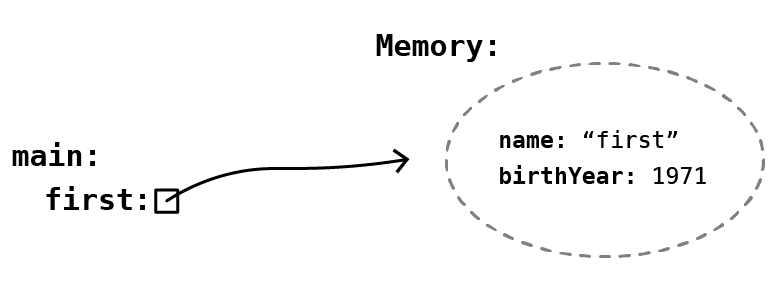
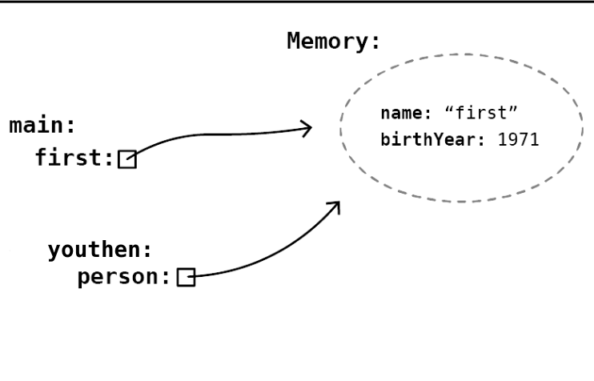
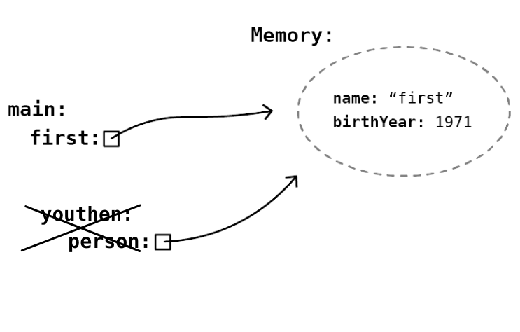
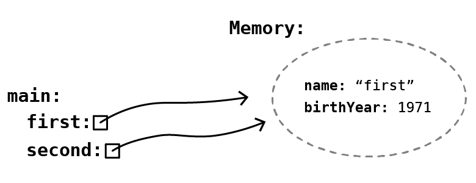
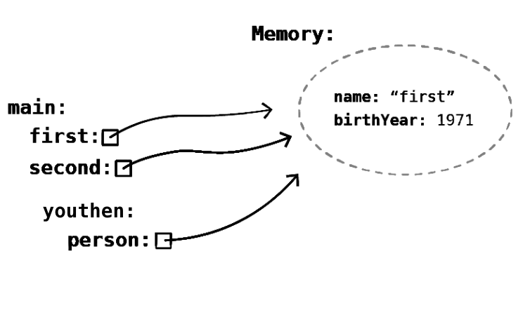

<!-- <text-box variant='learningObjectives' name='Oppimistavoitteet'> -->

<text-box variant='learningObjectives' name='Learning objectives'>


<!-- - Tunnet käsitteet alkeistyyppinen muuttuja ja viittaustyyppinen muuttuja. -->

- You are familiar with the terms primitive and reference variable.

<!-- - Tiedät minkälaisia alkeistyyppisiä muuttujia Javassa on, ja tiedät että erilaisia viittaustyyppisiä muuttujia voi olla käytännössä rajaton määrä. -->

- You know what kinds of primitive variables exist in Java, and also that there can be practically an inifinite number of different reference type variables.

<!-- - Tiedät miten alkeis- ja viittaustyyppisten muuttujien käyttäytyminen eroaa toisistaan kun muuttujaan asetetaan arvoa ja kun muuttujaa käytetään metodin parametrina. -->

- You know the differences between primitive and reference variables when a value is stored into them, or they are used as method parameters.

</text-box>


<!-- Javan muuttujat jaetaan alkeis- ja viittaustyyppisiin muuttujiin. Ohjelmoijan näkökulmasta alkeistyyppisten muuttujien tieto on tallennettu muuttujan arvoksi, kun taas viittaustyyppisten muuttujien arvona on viite muuttujaan liittyvään tietoon. Viittaustyyppiset muuttujat ovat Java-kielessä käytännössä aina olioita. Tarkastellaan näitä muuttujatyyppejä kahden esimerkin kautta. -->

The variables in Java are classified into primitive and reference type variables. From the programmer's point of view, the data in a primitive variable is stored as the value of that variable, whereas the value of a reference type varible is a reference to the data. Reference type variables are practically always object in Java. Let's examine these different types with two examples.


<!-- ```java
int arvo = 10;
System.out.println(arvo);
``` -->

```java
int value = 10;
System.out.println(value);
```

<sample-output>

10

</sample-output>


<!-- ```java
public Nimi {
    private String nimi;

    public Nimi(String nimi) {
        this.nimi = nimi;
    }
}
``` -->

```java
public Name {
    private String name;

    public Name(String name) {
        this.name = name;
    }
}
```

<!-- ```java
Nimi leevi = new Nimi("Leevi");
System.out.println(leevi);
``` -->

```java
Name luke = new Name("Luke");
System.out.println(luke);
```

<!-- <sample-output>

Nimi@4aa298b7

</sample-output> -->

<sample-output>

Name@4aa298b7

</sample-output>

<!-- Ensimmäisessä esimerkissä luodaan alkeistyyppinen `int`-muuttuja, jonka arvoksi kopioidaan luku `10`. Kun muuttuja annetaan `System.out.println`-metodille tulostettavaksi, tulostuu arvo `10`. Toisessa esimerkissä luodaan viittaustyyppinen `leevi`-niminen muuttuja, jonka arvoksi kopioidaan `Nimi`-luokassa määritellyn konstruktorin kutsun palauttama viite olioon. Kun muuttuja tulostetaan, tulostuu merkkijono `Nimi@4aa298b7`. Mistä tässä oikein on kyse? -->

In the first example we create a primitive `int` variable, and the number 10 is stored as its value. When we pass the variable to the `System.out.println` method, the value `10` is printed. In the second example we create a reference type variable named `luke`. A reference to an object, returned by the constructor of the `Name` class when we call it, is stored as the value of the variable. When this latter variable is printed, the string `Name@4aa298b7` is what ends up being printed. What is the cause for this?


<!-- Metodikutsu `System.out.println` tulostaa muuttujan arvon. Alkeistyyppistien muuttujien arvo on konkreettinen, kun taas viittaustyyppisten muuttujien arvo on viite. Kun viittaustyyppinen muuttuja tulostetaan, tulostuksena on muuttujan tyyppi sekä Javan muuttujalle luoma tunniste: merkkijono `Nimi@4aa298b7` kertoo, että kyse on `Nimi`-tyyppisestä muuttujasta, jonka tunniste on `4aa298b7`. -->

The method call `System.out.println` prints the value of the variable. The value of a primitive variable is concrete, whereas the value of a reference type variable is a reference. In the case of a reference type variable, what is printed is the type of the variable and an identifier created by Java for the variable: the string `Name@4aa298b7` tells that the variable in question is of type `Name` and its identifier is `4aa298b7`.


<!-- Edellinen esimerkki pätee silloin, jos ohjelmoija ei ole muuttanut olion oletustulostusmuotoa. Tulostusmuodon voi muuttaa määrittelemällä olion luokkaan metodi `toString`, jossa kerrotaan miltä olion tulostuksen tulee näyttää. Alla olevassa esimerkissä luokalle `Nimi` on määritelty metodi `public String toString()`, joka palauttaa oliomuuttujan `nimi`. Nyt, kun luokasta luotu olio tulostetaan `System.out.println`-komennolla, tulostustettava tieto on metodin `toString` palauttama merkkijono. -->

The previous example is the case when the programmer has not changed a variable's default print format. You can change the default print by defining the method `toString` in the class of the object in question. The method indicates what string should be printed when an instance of the class is printed. In the example below, we have defined the method `public String toString()` in the class `Name`: it returns the instance variable `name`. Now when we print an object that is an instance of `Name` with the `System.out.println` command, what is printed is the string returned by the `toString` method.


<!-- ```java
public Nimi {
    private String nimi;

    public Nimi(String nimi) {
        this.nimi = nimi;
    }

    public String toString() {
        return this.nimi;
    }
}
``` -->

```java
public Name {
    private String name;

    public Name(String name) {
        this.name = name;
    }

    public String toString() {
        return this.name;
    }
}
```

<!--
```java
Nimi leevi = new Nimi("Leevi");
System.out.println(leevi); // sama kuin System.out.println(leevi.toString());
``` -->


```java
Name luke = new Name("Luke");
System.out.println(luke); // equal to System.out.println(leevi.toString());
```

<!-- <sample-output>

Leevi

</sample-output> -->


<sample-output>

Luke

</sample-output>

<!-- ## Alkeistyyppiset muuttujat -->

## Primitive variables

<!-- Javassa on kahdeksan alkeistyyppistä muuttujaa. Nämä ovat `boolean` (totuusarvo, joko `true` tai `false`), `byte` (8 bittiä sisältävä tavu, välillä `-128` ja `127`), `char` (yhtä kirjainmerkkiä kuvaava 16-bittiä sisältävä kirjainarvo), `short` (pientä kokonaislukua kuvaava 16 bittiä sisältävä arvo, välillä `-32768` ja `32767`), `int` (keskikokoista kokonaislukua kuvaava 32 bittiä sisältävä arvo, välillä <code class="language-text">-2<sup>31</sup></code> ja <code class="language-text">2<sup>31</sup>-1</code>), `long` (isohkoa kokonaislukua kuvaava 64 bittiä sisältävä arvo, välillä <code class="language-text">-2<sup>63</sup></code> ja <code class="language-text">2<sup>63</sup>-1</code>), `float` (32-bittiä käyttävä liukuluku) ja `double` (64-bittiä käyttävä liukuluku). -->

Java includes eight different primitive variables. These are: `boolean` (a truth value: either `true` or `false`), `byte` (a byte containing 8 bits, between the values `-128` and `127`), `char` (a 16-bit value representing a single character), `short` (a 16-bit value that represents a small integer, between the values `-32768` and `32767`), `int` (a 32-bit value that represents a medium-sized integer, between the values <code class="language-text">-2<sup>31</sup></code> and <code class="language-text">2<sup>31</sup>-1</code>), `long` (a 64-bit value that represents a large integer, between values <code class="language-text">-2<sup>63</sup></code> and <code class="language-text">2<sup>63</sup>-1</code>), `float` (a floating point number that uses 32 bits), and `double` (a floating point number that uses 64 bits).

<!-- Olemme käyttäneet näistä ensisijaisesti totuusarvomuuttujia (`boolean`), kokonaislukumuuttujia (`int`), ja liukulukumuuttujia (`double`). -->

We have primarily used the truth value variable (`boolean`), integer variables (`int`) and floating point variables (`double`).


<!-- ```java
boolean totuusarvo = false;
int kokonaisluku = 42;
double liukuluku = 4.2;

System.out.println(totuusarvo);
System.out.println(kokonaisluku);
System.out.println(liukuluku);
``` -->

```java
boolean truthValue = false;
int integer = 42;
double floatingPointNumber = 4.2;

System.out.println(truthValue);
System.out.println(integer);
System.out.println(floatingPointNumber);
```

<sample-output>

false
42
4.2

</sample-output>


<!-- Alkeistyyppisillä muuttujilla muuttujan esittely varaa muistista muuttujan tyypin kokoisen muistipaikan, johon muuttujaan asetettava arvo kopioidaan. Alla olevassa esimerkissä luodaan kolme muuttujaa. Jokaisella muuttujalla on erillinen paikka muistissa, johon asetettava arvo kopioidaan. -->

Introducing a primitive variable reserves a memory location of fixed size from the memory. The size is determined by the type of the primitive, and the memory location is where the value of the variable stored at. In the example below we create three variables. Each one has its own memory location, to where the assigned value is copied.


<!-- ```java
int eka = 10;
int toka = eka;
int kolmas = toka;
System.out.println(eka + " " + toka + " " + kolmas);
toka = 5;
System.out.println(eka + " " + toka + " " + kolmas);
``` -->

```java
int first = 10;
int second = first;
int third = second;
System.out.println(first + " " + second + " " + third);
second = 5;
System.out.println(first + " " + second + " " + third);
```

```java
10 10 10
10 5 10
```


<!-- Muuttujan nimi kertoo paikan, missä muuttujan arvo sijaitsee. Muuttujan arvon asetus yhtäsuuruusmerkillä aiheuttaa arvon kopioimisen muuttujan nimen perusteella tunnistettavaan muistipaikkaan. Esimerkiksi lause `int eka = 10` varaa muuttujalle paikan nimeltä `eka` ja kopioi arvon `10` siihen. -->

The name of the variable tells the memory location where its value is stored. When you assign a value to a primitive variable with an equality sign, the value on the right side is copied to the memory location indicated by the name of the variable. For example, the statement `int first = 10` reserves a location called `first` for the variable, and then copies to value `10` into it.


<!-- Vastaavasti lause `int toka = eka;` varaa luotavalle muuttujalle paikan nimeltä `toka` ja kopioi siihen muuttujan `eka` paikan sisältämän arvon. -->

Similarly, the statement `int second = first;` reserves a location called `second` for the created variable, and then copies the value stored in the location of `first` into it.

<!-- Muuttujien arvot kopioituvat myös metodikutsujen yhteydessä. Käytännössä tämä tarkoittaa sitä, että metodikutsun yhteydessä metodin parametriksi annetun muuttujan arvo ei muutu metodia kutsuvassa metodissa. Alla olevassa esimerkissä main-metodissa esitellään muuttuja luku, jonka arvo kopioidaan metodin kutsu parametriksi. Metodissa kutsu parametrina saatu arvo tulostetaan, jonka jälkeen arvoa kasvatetaan yhdellä, jonka jälkeen arvo tulostetaan vielä kerran. Lopulta metodin kutsu suoritus loppuu, ja palataan main-metodiin. Main-metodissa olevan luku-muuttujan arvo ei ole muuttunut, sillä se ei liity millään tavalla kutsu-metodin parametriksi määriteltyyn muuttujaan luku. -->

The values of variables are also copied when they are used in method calls. In practice this means that the value of a variable that is passed as a method parameter is not changed in the method that did the passing / called the other method. In the example below, we introduce the variable number in the main method, and its value is copied to serve as the parameter of the call method. In the call method we print the received value, after which its value is incremented by one. Then the value of the variable is printed one more time, and the execution of the program returns to the main method. The value of the number variable in the main has not changed, since it has no relation to the number variable defined as the parameter of the call method.


<!-- <code-states-visualizer input='{"code":"public class Esimerkki {\n    public static void main(String[] args) {\n        int luku = 1;\n        kutsu(luku);\n       \n        System.out.println(\"Luku vieläkin: \" + luku);\n    }\n   \n    public static void kutsu(int luku) {\n        System.out.println(\"Luku aluksi: \" + luku);\n        luku = luku + 1;\n        System.out.println(\"Luku lopuksi: \" + luku);\n    }\n}","stdin":"","trace":[{"stdout":"","event":"call","line":3,"stack_to_render":[{"func_name":"main:3","encoded_locals":{},"ordered_varnames":[],"parent_frame_id_list":[],"is_highlighted":true,"is_zombie":false,"is_parent":false,"unique_hash":"1","frame_id":1}],"globals":{},"ordered_globals":[],"func_name":"main","heap":{}},{"stdout":"","event":"step_line","line":3,"stack_to_render":[{"func_name":"main:3","encoded_locals":{},"ordered_varnames":[],"parent_frame_id_list":[],"is_highlighted":true,"is_zombie":false,"is_parent":false,"unique_hash":"2","frame_id":2}],"globals":{},"ordered_globals":[],"func_name":"main","heap":{}},{"stdout":"","event":"step_line","line":4,"stack_to_render":[{"func_name":"main:4","encoded_locals":{"luku":1},"ordered_varnames":["luku"],"parent_frame_id_list":[],"is_highlighted":true,"is_zombie":false,"is_parent":false,"unique_hash":"4","frame_id":4}],"globals":{},"ordered_globals":[],"func_name":"main","heap":{}},{"stdout":"","event":"call","line":10,"stack_to_render":[{"func_name":"kutsu:10","encoded_locals":{"luku":1},"ordered_varnames":["luku"],"parent_frame_id_list":[],"is_highlighted":true,"is_zombie":false,"is_parent":false,"unique_hash":"7","frame_id":7},{"func_name":"main:4","encoded_locals":{"luku":1},"ordered_varnames":["luku"],"parent_frame_id_list":[],"is_highlighted":false,"is_zombie":false,"is_parent":false,"unique_hash":"8","frame_id":8}],"globals":{},"ordered_globals":[],"func_name":"kutsu","heap":{}},{"stdout":"","event":"step_line","line":10,"stack_to_render":[{"func_name":"kutsu:10","encoded_locals":{"luku":1},"ordered_varnames":["luku"],"parent_frame_id_list":[],"is_highlighted":true,"is_zombie":false,"is_parent":false,"unique_hash":"9","frame_id":9},{"func_name":"main:4","encoded_locals":{"luku":1},"ordered_varnames":["luku"],"parent_frame_id_list":[],"is_highlighted":false,"is_zombie":false,"is_parent":false,"unique_hash":"10","frame_id":10}],"globals":{},"ordered_globals":[],"func_name":"kutsu","heap":{}},{"stdout":"Luku aluksi: 1\n","event":"step_line","line":11,"stack_to_render":[{"func_name":"kutsu:11","encoded_locals":{"luku":1},"ordered_varnames":["luku"],"parent_frame_id_list":[],"is_highlighted":true,"is_zombie":false,"is_parent":false,"unique_hash":"15","frame_id":15},{"func_name":"main:4","encoded_locals":{"luku":1},"ordered_varnames":["luku"],"parent_frame_id_list":[],"is_highlighted":false,"is_zombie":false,"is_parent":false,"unique_hash":"16","frame_id":16}],"globals":{},"ordered_globals":[],"func_name":"kutsu","heap":{}},{"stdout":"Luku aluksi: 1\n","event":"step_line","line":12,"stack_to_render":[{"func_name":"kutsu:12","encoded_locals":{"luku":2},"ordered_varnames":["luku"],"parent_frame_id_list":[],"is_highlighted":true,"is_zombie":false,"is_parent":false,"unique_hash":"17","frame_id":17},{"func_name":"main:4","encoded_locals":{"luku":1},"ordered_varnames":["luku"],"parent_frame_id_list":[],"is_highlighted":false,"is_zombie":false,"is_parent":false,"unique_hash":"18","frame_id":18}],"globals":{},"ordered_globals":[],"func_name":"kutsu","heap":{}},{"stdout":"Luku aluksi: 1\nLuku lopuksi: 2\n","event":"step_line","line":13,"stack_to_render":[{"func_name":"kutsu:13","encoded_locals":{"luku":2},"ordered_varnames":["luku"],"parent_frame_id_list":[],"is_highlighted":true,"is_zombie":false,"is_parent":false,"unique_hash":"27","frame_id":27},{"func_name":"main:4","encoded_locals":{"luku":1},"ordered_varnames":["luku"],"parent_frame_id_list":[],"is_highlighted":false,"is_zombie":false,"is_parent":false,"unique_hash":"28","frame_id":28}],"globals":{},"ordered_globals":[],"func_name":"kutsu","heap":{}},{"stdout":"Luku aluksi: 1\nLuku lopuksi: 2\n","event":"return","line":13,"stack_to_render":[{"func_name":"kutsu:13","encoded_locals":{"luku":2,"__return__":["VOID"]},"ordered_varnames":["luku","__return__"],"parent_frame_id_list":[],"is_highlighted":true,"is_zombie":false,"is_parent":false,"unique_hash":"29","frame_id":29},{"func_name":"main:4","encoded_locals":{"luku":1},"ordered_varnames":["luku"],"parent_frame_id_list":[],"is_highlighted":false,"is_zombie":false,"is_parent":false,"unique_hash":"30","frame_id":30}],"globals":{},"ordered_globals":[],"func_name":"kutsu","heap":{}},{"stdout":"Luku aluksi: 1\nLuku lopuksi: 2\n","event":"step_line","line":6,"stack_to_render":[{"func_name":"main:6","encoded_locals":{"luku":1},"ordered_varnames":["luku"],"parent_frame_id_list":[],"is_highlighted":true,"is_zombie":false,"is_parent":false,"unique_hash":"31","frame_id":31}],"globals":{},"ordered_globals":[],"func_name":"main","heap":{}},{"stdout":"Luku aluksi: 1\nLuku lopuksi: 2\nLuku vieläkin: 1\n","event":"step_line","line":7,"stack_to_render":[{"func_name":"main:7","encoded_locals":{"luku":1},"ordered_varnames":["luku"],"parent_frame_id_list":[],"is_highlighted":true,"is_zombie":false,"is_parent":false,"unique_hash":"36","frame_id":36}],"globals":{},"ordered_globals":[],"func_name":"main","heap":{}},{"stdout":"Luku aluksi: 1\nLuku lopuksi: 2\nLuku vieläkin: 1\n","event":"return","line":7,"stack_to_render":[{"func_name":"main:7","encoded_locals":{"luku":1,"__return__":["VOID"]},"ordered_varnames":["luku","__return__"],"parent_frame_id_list":[],"is_highlighted":true,"is_zombie":false,"is_parent":false,"unique_hash":"37","frame_id":37}],"globals":{},"ordered_globals":[],"func_name":"main","heap":{}}],"userlog":"Debugger VM maxMemory: 455M\n"}'></code-states-visualizer> -->


<code-states-visualizer input='{"code":"public class Example {\n    public static void main(String[] args) {\n        int number = 1;\n        call(number);\n       \n        System.out.println(\"Number still: \" + number);\n    }\n   \n    public static void call(int number) {\n        System.out.println(\"Number in the beginning: \" + number);\n        number = number + 1;\n        System.out.println(\"Number in the end: \" + number);\n    }\n}","stdin":"","trace":[{"stdout":"","event":"call","line":3,"stack_to_render":[{"func_name":"main:3","encoded_locals":{},"ordered_varnames":[],"parent_frame_id_list":[],"is_highlighted":true,"is_zombie":false,"is_parent":false,"unique_hash":"1","frame_id":1}],"globals":{},"ordered_globals":[],"func_name":"main","heap":{}},{"stdout":"","event":"step_line","line":3,"stack_to_render":[{"func_name":"main:3","encoded_locals":{},"ordered_varnames":[],"parent_frame_id_list":[],"is_highlighted":true,"is_zombie":false,"is_parent":false,"unique_hash":"2","frame_id":2}],"globals":{},"ordered_globals":[],"func_name":"main","heap":{}},{"stdout":"","event":"step_line","line":4,"stack_to_render":[{"func_name":"main:4","encoded_locals":{"number":1},"ordered_varnames":["number"],"parent_frame_id_list":[],"is_highlighted":true,"is_zombie":false,"is_parent":false,"unique_hash":"4","frame_id":4}],"globals":{},"ordered_globals":[],"func_name":"main","heap":{}},{"stdout":"","event":"call","line":10,"stack_to_render":[{"func_name":"call:10","encoded_locals":{"number":1},"ordered_varnames":["number"],"parent_frame_id_list":[],"is_highlighted":true,"is_zombie":false,"is_parent":false,"unique_hash":"7","frame_id":7},{"func_name":"main:4","encoded_locals":{"number":1},"ordered_varnames":["number"],"parent_frame_id_list":[],"is_highlighted":false,"is_zombie":false,"is_parent":false,"unique_hash":"8","frame_id":8}],"globals":{},"ordered_globals":[],"func_name":"call","heap":{}},{"stdout":"","event":"step_line","line":10,"stack_to_render":[{"func_name":"call:10","encoded_locals":{"number":1},"ordered_varnames":["number"],"parent_frame_id_list":[],"is_highlighted":true,"is_zombie":false,"is_parent":false,"unique_hash":"9","frame_id":9},{"func_name":"main:4","encoded_locals":{"number":1},"ordered_varnames":["number"],"parent_frame_id_list":[],"is_highlighted":false,"is_zombie":false,"is_parent":false,"unique_hash":"10","frame_id":10}],"globals":{},"ordered_globals":[],"func_name":"call","heap":{}},{"stdout":"Number in the beginning: 1\n","event":"step_line","line":11,"stack_to_render":[{"func_name":"call:11","encoded_locals":{"number":1},"ordered_varnames":["number"],"parent_frame_id_list":[],"is_highlighted":true,"is_zombie":false,"is_parent":false,"unique_hash":"15","frame_id":15},{"func_name":"main:4","encoded_locals":{"number":1},"ordered_varnames":["number"],"parent_frame_id_list":[],"is_highlighted":false,"is_zombie":false,"is_parent":false,"unique_hash":"16","frame_id":16}],"globals":{},"ordered_globals":[],"func_name":"call","heap":{}},{"stdout":"Number in the beginning: 1\n","event":"step_line","line":12,"stack_to_render":[{"func_name":"call:12","encoded_locals":{"number":2},"ordered_varnames":["number"],"parent_frame_id_list":[],"is_highlighted":true,"is_zombie":false,"is_parent":false,"unique_hash":"17","frame_id":17},{"func_name":"main:4","encoded_locals":{"number":1},"ordered_varnames":["number"],"parent_frame_id_list":[],"is_highlighted":false,"is_zombie":false,"is_parent":false,"unique_hash":"18","frame_id":18}],"globals":{},"ordered_globals":[],"func_name":"call","heap":{}},{"stdout":"Number in the beginning: 1\nNumber in the end: 2\n","event":"step_line","line":13,"stack_to_render":[{"func_name":"call:13","encoded_locals":{"number":2},"ordered_varnames":["number"],"parent_frame_id_list":[],"is_highlighted":true,"is_zombie":false,"is_parent":false,"unique_hash":"27","frame_id":27},{"func_name":"main:4","encoded_locals":{"number":1},"ordered_varnames":["number"],"parent_frame_id_list":[],"is_highlighted":false,"is_zombie":false,"is_parent":false,"unique_hash":"28","frame_id":28}],"globals":{},"ordered_globals":[],"func_name":"call","heap":{}},{"stdout":"Number in the beginning: 1\nNumber in the end: 2\n","event":"return","line":13,"stack_to_render":[{"func_name":"call:13","encoded_locals":{"number":2,"__return__":["VOID"]},"ordered_varnames":["number","__return__"],"parent_frame_id_list":[],"is_highlighted":true,"is_zombie":false,"is_parent":false,"unique_hash":"29","frame_id":29},{"func_name":"main:4","encoded_locals":{"number":1},"ordered_varnames":["number"],"parent_frame_id_list":[],"is_highlighted":false,"is_zombie":false,"is_parent":false,"unique_hash":"30","frame_id":30}],"globals":{},"ordered_globals":[],"func_name":"call","heap":{}},{"stdout":"Number in the beginning: 1\nNumber in the end: 2\n","event":"step_line","line":6,"stack_to_render":[{"func_name":"main:6","encoded_locals":{"number":1},"ordered_varnames":["number"],"parent_frame_id_list":[],"is_highlighted":true,"is_zombie":false,"is_parent":false,"unique_hash":"31","frame_id":31}],"globals":{},"ordered_globals":[],"func_name":"main","heap":{}},{"stdout":"Number in the beginning: 1\nNumber in the end: 2\nNumber still: 1\n","event":"step_line","line":7,"stack_to_render":[{"func_name":"main:7","encoded_locals":{"number":1},"ordered_varnames":["number"],"parent_frame_id_list":[],"is_highlighted":true,"is_zombie":false,"is_parent":false,"unique_hash":"36","frame_id":36}],"globals":{},"ordered_globals":[],"func_name":"main","heap":{}},{"stdout":"Number in the beginning: 1\nNumber in the end: 2\nNumber still: 1\n","event":"return","line":7,"stack_to_render":[{"func_name":"main:7","encoded_locals":{"number":1,"__return__":["VOID"]},"ordered_varnames":["number","__return__"],"parent_frame_id_list":[],"is_highlighted":true,"is_zombie":false,"is_parent":false,"unique_hash":"37","frame_id":37}],"globals":{},"ordered_globals":[],"func_name":"main","heap":{}}],"userlog":"Debugger VM maxMemory: 455M\n"}'></code-states-visualizer>


<!-- ## Viittaustyyppiset muuttujat -->

## Reference variables


<!-- Kaikki Javan valmiiksi tarjoamat muuttujat (paitsi edellä kuvatut kahdeksan alkeistyyppistä muuttujaa) ovat viittaustyyppisiä. Ohjelmoija voi myös luoda uusia viittaustyyppisiä muuttujatyyppejä määrittelemällä uusia luokkia. Käytännössä jokainen (mistä tahansa) luokasta luotu olio on viittaustyyppinen muuttuja. -->

All the readymade Java variables (excluding the eight primitive variables discussed above) are reference type. The programmer is also free to create their own variable types by defining new classes. In practice any object instanced from a class is a reference variable


<!-- Tarkastellaan alussa ollutta esimerkkiä, missä luotiin Nimi-tyyppinen muuttuja leevi. -->

Let's reexamine the example at the beginning of the chapter, where we created a variable called luke of type Name.

<!-- ```java
Nimi leevi = new Nimi("Leevi");
``` -->

```java
Name luke = new Name("Luke");
```

<!-- Kutsun osat ovat seuravat: -->

The call consists of the following parts:

<!-- - Mitä tahansa uutta muuttujaa esiteltäessä tulee ensin kertoa esiteltävän muuttujan tyyppi. Alla esitellään muuttuja, jonka tyyppi on `Nimi`. Jotta ohjelman suorittaminen onnistuu, tulee käytössä olla luokka nimeltä `Nimi`. -->

- When introducing any new variable, we must first define the type of that variable. Below we introduce a variable of type `Name`. In order for the execution of the program to succeed, there must be a class called `Name` available.

<!-- ```java
Nimi ...
``` -->

```java
Name ...
```

<!-- - Muuttujan esittelyn yhteydessä kerrotaan muuttujan nimi. Muuttujan arvoon voi myöhemmin viitata muuttujan nimen perusteella. Alla muuttujan nimeksi on määritelty leevi. -->

- In the introduction of a variable its name must be included. You can later use the name of the variable to reference its value. Below, the variable name is defined as luke.

<!-- ```java
Nimi leevi ...
``` -->

```java
Name luke...
```

<!-- - Muuttujaan voidaan asettaa arvo. Luokista luodaan olioita kutsumalla konstruktoria, joka määrittelee luotavan olion oliomuuttujiin asetettavat arvot. Alla oletetaan, että luokassa `Nimi` on konstruktori, joka saa parametrikseen merkkijonon. -->

- You can store a value in a variable. You can create an instance object from a class by calling the class constructor, which defines the values that are placed in the instance variables of the object that is created. Below we assume that the class `Name` has a constructor that takes a string as parameter.

<!-- ```java
... new Nimi("Leevi");
``` -->

```java
... new Name("Luke");
```

<!-- - Konstruktorikutsu palauttaa arvon, joka on viite luotuun olioon. Yhtäsuuruusmerkki kertoo ohjelmalle, että yhtäsuuruusmerkin oikealla puolella olevan lausekkeen arvo tulee kopioida yhtäsuuruusmerkin vasemmalla puolella olevan muuttujan arvoksi. Konstruktorikutsun palauttama viite juuri luotuun olioon kopioidaan muuttujan `leevi` arvoksi. -->

- The constructor call returns a value that is a reference to the created object. The equality signs tells the program that the value of the right-side expression is to be copied as the value of the variable on the left side. The reference to the newly-created object, which is returned by the constructor call, is copied as the value of the `luke` variable.

<!-- ```java
Nimi leevi = new Nimi("Leevi");
``` -->

```java
Name luke = new Name("Luke");
```


<!-- Suurin ero alkeis- ja viittaustyyppisten muuttujien välillä on se, että alkeistyyppiset muuttujat (jotka ovat lähes poikkeuksetta numeroita) ovat muuttumattomia. Viittaustyyppisten muuttujien sisäistä tilaa taas voi tyypillisesti muuttaa. Tämä ilmiö liittyy siihen, että alkeistyyppisten muuttujien arvo on tallennettu suoraan muuttujaan, kun taas viittaustyyppisten muuttujien arvo on viite muuttujan tietoihin eli sisäiseen tilaan. -->

The greatest difference between primitive and reference varibales is that the primitive ones (almost without exception number) are unchanging. Conversely, the inner state of reference variables can typically be changed. This phenomenon is explained by the fact that the value of a primitive variable is directly stored in the variable, whereas the value of a reference variable is a reference to the variable data, i.e. the variable's internal state.

<!-- Alkeistyyppisille muuttujille löytyy laskuoperaatioita kuten plus, miinus, kerto jne -- nämä operaatiot eivät muuta alkuperäisten muuttujien arvoja. Laskuoperaatioiden avulla luodaan uusia arvoja, jotka varastoidaan muuttujiin tarvittaessa. Toisaalta, viittaustyyppisten muuttujien arvoa ei voi muuttaa plus, miinus, kerto ym. laskuoperaatioiden avulla. -->

Arithmetic operations, such as addition, subtraction, multiplication, can be used with primitive variables -- these operations do not change the original values of the variables. Arithmetic expressions create new values, which are stored into variables when needed. Notice that the values of reference variables cannot be changed by these arithmetic expressions.

<!-- Viittaustyyppisen muuttujan arvo -- eli viite -- osoittaa paikkaan, joka sisältää viittaustyyppiseen muuttujaan liittyvät tiedot. Oletetaan, että käytössä on luokka Henkilo, jossa on määritelty oliomuuttujaksi ika. Jos luokasta on luotu henkilö-olio, voi henkilö-olion viitettä seuraamalla päästä käsiksi muuttujaan ika, jonka arvoa voi tarvittaessa muuttaa. -->

The value of a reference variable -- i.e. a reference -- points to a location that contains the information  that relates to that variable. Let's assume we have the class Person available, and it contains a definition for the instance variable age. If a person object has been instanced of the class, you can find the variable age by following the object's reference. The value of this age variable can be changed, if so needed.


<!-- ## Alkeis- tai viittaustyyppinen muuttuja metodin parametrina -->

## Primitive or reference type variable as a method parameter

<!-- Totesimme aiemmin, että alkeistyyppisten muuttujien arvo on tallennettuna suoraan muuttujaan, kun taas viittaustyyppisten muuttujien arvo sisältää viitteen olioon. Totesimme myös, että muuttujan arvon asettaminen yhtäsuuruusmerkillä kopioi oikealla olevan (mahdollisesti muuttujan) arvon vasemmalla olevan muuttujan arvoksi. -->

We stated earlier that the value of a primitive variable is directly stored in that variable, whereas the value of a reference variable contains the reference to an object. We also mentioned that assigning a value with the equality sign copies the value on the right (possibly the value of some variable), and stores it as the value of the left-side variable.

<!-- Vastaavanlainen kopiointi tapahtuu metodikutsun yhteydessä. Riippumatta siitä, onko muuttuja alkeis- tai viittaustyyppinen, metodikutsun yhteydessä metodille parametrina annettava arvo kopioidaan metodin käyttöön. Alkeistyyppisillä muuttujilla metodin käyttöön tulee muuttujan arvo, viittaustyyppisillä muuttujilla metodin käyttöön tulee viite. -->

A similar copying occurs when a method is called. Regardless of whether the variable is primitive or reference type, the value given as a method parameter is copied for the method to use. In the case of primitive variables, the value of the variable is given to the method; with reference type variables, the method receives a reference.


<!-- Tarkastellaan tätä käytännössä. Oletetaan, että käytössämme on seuraava luokka `Henkilo`. -->

Let's take a practical look at the phenomenon. Let's assume we have the following `Person` class available.

<!-- ```java
public class Henkilo {
    private String nimi;
    private int syntymavuosi;

    public Henkilo(String nimi) {
        this.nimi = nimi;
        this.syntymavuosi = 1970;
    }

    public int getSyntymavuosi() {
        return this.syntymavuosi;
    }

    public void setSyntymavuosi(int syntymavuosi) {
        this.syntymavuosi = syntymavuosi;
    }

    public String toString() {
        return this.nimi + " (" + this.syntymavuosi + ")";
    }
}
``` -->

```java
public class Person {
    private String name;
    private int birthYear;

    public Person(String name) {
        this.name = name;
        this.birthYear = 1970;
    }

    public int getBirthYear() {
        return this.birthYear;
    }

    public void setBirthYear(int birthYear) {
        this.birthYear = birthYear;
    }

    public String toString() {
        return this.name + " (" + this.birthYear + ")";
    }
}
```

<!-- Tarkastellaan seuraavan ohjelman toimintaa askeleittain. -->

Let's take a look at the operation of the program step by step.

<!-- ```java
public class Esimerkki {
    public static void main(String[] args) {
        Henkilo eka = new Henkilo("Eka");

        System.out.println(eka);
        nuorenna(eka);
        System.out.println(eka);

        Henkilo toka = eka;
        nuorenna(toka);

        System.out.println(eka);
    }

    public static void nuorenna(Henkilo henkilo) {
        henkilo.setSyntymavuosi(henkilo.getSyntymavuosi() + 1);
    }
}
``` -->

```java
public class Example {
    public static void main(String[] args) {
        Person first = new Person("First");

        System.out.println(first);
        makeYounger(first);
        System.out.println(first);

        Person second = first;
        makeYounger(second);

        System.out.println(first);
    }

    public static void makeYounger(Person person) {
        person.setBirthYear(person.getBirthYear() + 1);
    }
}
```

<!-- <sample-output>

Eka (1970)
Eka (1971)
Eka (1972)

</sample-output> -->

<sample-output>

First (1970)
First (1971)
First (1972)

</sample-output>

<!-- Ohjelman suoritus alkaa main-metodin ensimmäiseltä riviltä. Main-metodin ensimmäisellä rivillä esitellään Henkilo-tyyppinen muuttuja eka, johon kopioidaan Henkilo-luokan konstruktorin palauttama arvo. Konstruktorissa luodaan olio, jonka syntymävuodeksi asetetaan 1970 ja jonka nimeksi asetetaan parametrina saatu arvo. Konstruktori palauttaa viitteen. Rivin suorituksen jälkeen ohjelman tilanne on seuraava -- ohjelman muistiin on luotu Henkilo-olio, johon on viittaus main-metodissa määritellystä eka-muuttujasta. -->

The execution of the program begins on the first line of the main method. On the first row of the main, a Person type variable first is introduced, and the value returned by the constructor of the Person class is copied as its value. The constructor creates an object whose birth year is set as 1970, and whose name is set to be the value received as the paramter. After the execution of this first row the state of the program is the following -- a Person object has been created in the memory, and there is a reference to it from the first variable defined in the main method.


<!-- *Alla olevissa piirroksissa vasemmalla puolella on kutsupino, oikealla ohjelman muisti.* -->

*In the illustrations below, the call stack is on the left, and the memory of the program is on the right.





<!-- Main-metodin kolmannella rivillä tulostetaan muuttujan eka arvo. Metodikutsu System.out.println etsii sille parametrina annetulta viittaustyyppiseltä muuttujalta toString-metodia. Henkilo-luokalla on metodi toString, joten metodia kutsutaan eka-muuttujan osoittamalle oliolle. Oliossa olevan muuttujan nimi arvo on "Eka" ja syntymävuoden arvo on 1970. Tulostukseksi tulee "Eka (1970)". -->

On the third row of the main method we print the value of the variable first. The method call System.out.prinln searches for the method toString from the reference variable that it is given as the parameter. The Person class has the method toString, so that method is called on the object that is referenced by the first variable. The value of the name variable in that object is "First", and the value of the birth year variable is 1970. What is printed is the string "First (1970)".


<!-- Neljännellä rivillä kutsutaan nuorenna-metodia, jolle annetaan parametriksi muuttuja eka. Metodia `nuorenna` kutsuttaessa sille parametrina annetun muuttujan arvo kopioituu metodin `nuorenna` käyttöön. Metodin `main` suoritus jää odottamaan kutsupinoon. Koska muuttuja eka on viittaustyyppinen, kopioituu metodin käyttöön aiemmin luotu viite. Metodin suorituksen lopussa tilanne on seuraava -- metodi kasvattaa parametrina saamansa olion syntymävuotta yhdellä. -->

On the fourth row the program calls the makeYounger method, and the variable first is passed as a parameter to it. When the method `makeYounger` is called, the value of the variable passed as the parameter is copied for the method `makeYounger` to use. The execution of the `main` method remains waiting in the call stack. As the variable first is reference type, the reference created earlier is copied for the method's use. At the end of the method execution the situation is the following -- the method increments by one the birth year of the object it receives as a parameter.





<!-- Kun metodin nuorenna suoritus loppuu, palataan takaisin main-metodiin. Nuorenna-metodin suoritukseen liittyvät tiedot katoavat kutsupinosta. -->

When the execution of the method makeYounger ends, we return back to the main method. The information related to the execution of the makeYounger disappear from the call stack.




<!-- Metodikutsusta palaamisen jälkeen suoritetaan taas muuttujan eka arvon tulostaminen. Muuttujan eka osoittamaa oliota on muutettu metodikutsun `nuorenna` yhteydessä: olion `syntymavuosi`-muuttujaa kasvatettiin yhdellä. Tulostukseksi tulee lopulta "Eka (1971)". -->

After returning from the method call we again execute the printing of the variable first. The object pointed at by the variable first has been modified in the course of executing the method call `makeYounger`: the `birthYear` variable of the object was incremented by one. The final value that is printed is "First (1971)".

<!-- Tämän jälkeen ohjelmassa esitellään uusi Henkilo-tyyppinen muuttuja toka. Muuttujaan toka kopioidaan muuttujan eka arvo, eli muuttujan toka arvoksi tulee viite jo olemassaolevaan Henkilo-olioon. -->

Then the program introduces a new Person type variable called second. The value of the variable first is copied into the variable second: in other words, the value of the variable second is a reference to the already existing Person object.





<!-- Tämän jälkeen kutsutaan metodia nuorenna, jolle annetaan parametriksi muuttuja toka. Metodia kutsuttaessa parametriksi annetun muuttujan arvo kopioituu metodin arvoksi. Metodi saa siis käyttöönsä muuttujan toka sisältämän viitteen. Metodin suorituksen lopuksi metodin viittaaman olion syntymävuosi on kasvanut yhdellä. -->

After this the program calls the method makeYounger, which is given the variable second as the parameter. The value of the given variable is copied as the value of a method variable when the method is called. At the end of the method execution there has been an increment of one in the object referenced by the method variable.




<!-- Lopulta metodin suoritus päättyy, ja ohjelman suoritus palaa takaisin main-metodiin. Main-metodissa tulostetaan vielä kerran muuttujan eka arvo. Tulostukseksi tulee lopulta "Eka (1972)". -->

Finally the method execution ends and the program returns to the main method. In the main method the value of the variable first is printed one more time. The final result of the print is"First(1972)".

<quiz id='aedb9a67-73e0-5b34-b13c-bb84a6c59a0b'></quiz>

<quiz id='1aa0ccc3-2de4-59ba-99af-186c26e5eece'></quiz>


<!-- <text-box variant='hint' name='Muuttujat ja tietokoneen muisti'> -->

<text-box variant='hint' name='Variables and computer memory'>


<!-- Tässä oppimateriaalissa oiotaan mutkia muuttujien ja tietokoneen muistin toiminnan kannalta. Materiaalissa käsitellään muistiin liittyviä asioita ohjelmoinnin oppimiseen sopivalla abstraktiotasolla. Esimerkiksi toteamus, lause `int luku = 5` varaa muuttujalle `luku` paikan muistista ja kopioi arvon 5 sinne, on tämän kurssin tavoitteiden kannalta sopiva. -->

In the course material the concrete details concerning variables and computer memory are presented simplistically. We introduce memory-related topics on the suitable abstaction level for learning how to program. For instance, from the point of view of the course goals, the following sentence is good enough: statement `int number = 5` reserves a location for the variable `number` in the memory, and copies the value 5 into it.

<!-- Tietokoneen toiminnan näkökulmasta lauseen `int luku = 5` suorituksessa tapahtuu todellisuudessa enemmän. Lausetta suoritettaessa varataan muistista 32-bittinen paikka arvolle `5`, sekä 32-bittinen paikan muuttujalle luku. Paikan koko määräytyy muuttujan tyypin perusteella. Tämän jälkeen arvon 5 sisältävän muistipaikan sisältö kopioidaan muuttujan `luku`-muistipaikkaan. -->

From the point of view of the computer operation, there are a great deal more occuring during the execution of the statement `int number = 5`. The execution calls for reserving a 32-bit location from the memory for the value `5`, and another 32-bit location for the variable number. The size of the location is determined by the variable type. After this the contents of the memory location that includes the value 5 are copied into the memory location of the variable `number`.

<!-- Tämän lisäksi muuttuja `luku` ei suoranaisesti ole muistipaikka tai lokero. Muuttujan luku arvo on osoite muistissa -- muuttujaan liitetty tieto sen tyypistä kertoo kuinka paljon tietoa muuttujan osoitteesta luetaan. Esimerkiksi kokonaisluvun tapauksessa tämä määrä on 32 bittiä. -->

In addition to the above, the variable `number` is not a straightforward memory location or a box. The value of the variable `number` is a memory address -- the information about the variable type, included in the variable, tells how much data should be retrieved from the specified address. In the case of an integer this amount is 32 bits, for instance.

<!-- Palaamme tähän lyhyesti ohjelmoinnin jatkokurssilla; aihetta käsitellään enemmän kurssilla Tietokoneen toiminta. -->

We will return to discuss the issue briefly on the advanced programming course. A more in-depth study is reserved for the course Computer Organization.

</text-box>
