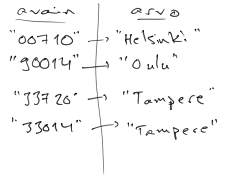

<!-- <text-box variant='learningObjectives' name='Oppimistavoitteet'> -->
<text-box variant='learningObjectives' name='Learning Objectives'>

<!-- - Tunnet käsitteen hajautustaulu ja tiedät pääpiirteittäin miten hajautustaulu toimii.
- Osaat käyttää Javan hajautustaulua: osaat luoda hajautustaulun, osaat lisätä hajautustauluun tietoa, ja osaat hakea hajautustaulusta tietoa.
- Osaat kertoa tilanteita, joissa hajautustaulun käytöstä voi olla hyötyä.
- Osaat käyttää hajautustaulua oliomuuttujana.
- Osaat käydä hajautustaulun avaimet ja arvot läpi for-each -toistolausetta käyttäen. -->

- You're familiar with the concept of a hash table and know how one works.
- You know how to use Java's hash table: you know how to create one, add information to it and retrieve information from it.
- You can describe situations where using a hash table could be useful.
- You know how to use a hash table as an instance variable.
- You know how to go through keys and values of a hash table using the for-each loop.

</text-box>

<!-- [Hajautustaulu](http://docs.oracle.com/javase/8/docs/api/java/util/HashMap.html) eli HashMap on ArrayListin lisäksi eniten käytettyjä Javan valmiiksi tarjoamia tietorakenteita. Hajautustaulua käytetään kun tietoa käsitellään avain-arvo -pareina, missä avaimen perusteella voidaan lisätä, hakea ja poistaa arvo.

Alla olevassa esimerkissä on luotu HashMap-olio kaupunkien hakemiseen postinumeron perusteella, jonka jälkeen HashMap-olioon on lisätty neljä postinumero-kaupunki -paria. Lopulta hajautustaulusta haetaan postinumeroa "00710". Sekä postinumero että kaupunki on esitetty merkkijonona. -->

A [HashMap] (http://docs.oracle.com/javase/8/docs/api/java/util/HashMap.html) is, in addition to ArrayList, one of the most widely used Java's pre-built data structures. The hash table is used whenever data is stored as key-value pairs, where values can be added, retrieved, and deleted using keys.

In the example below, a HashMap object has been created to search for cities by their postal codes, after which four postal code-city pairs have been added to the HashMap object. At the end of it, the postal code "00710" is retrieved from the hash table. Both the postal code and the city are represented as strings.


<!-- ```java
HashMap<String, String> postinumerot = new HashMap<>();
postinumerot.put("00710", "Helsinki");
postinumerot.put("90014", "Oulu");
postinumerot.put("33720", "Tampere");
postinumerot.put("33014", "Tampere");

System.out.println(postinumerot.get("00710"));
``` -->
```java
HashMap<String, String> postalCodes = new HashMap<>();
postalCodes.put("00710", "Helsinki");
postalCodes.put("90014", "Oulu");
postalCodes.put("33720", "Tampere");
postalCodes.put("33014", "Tampere");

System.out.println(postalCodes.get("00710"));
```

<sample-output>

Helsinki

</sample-output>


<!-- Sisäisesti yllä luotavan hajautustaulun sisäinen tila näyttää seuraavalta. Kukin avain viittaa arvoon. -->
The internal state of the hash table created above looks like this. Each key refers to some value.



<!-- Mikäli hajautustaulussa ei ole haettavaa avainta, palauttaa hajautustaulun metodi `get` `null`-viitteen. -->
If the hash table does not contained the key used for the search, its `get` method returns a `null` reference.

<!-- ```java
HashMap<String, String> numerot = new HashMap<>();
numerot.put("Yksi", "Uno");
numerot.put("Kaksi", "Dos");

String kaannos = numerot.get("Yksi");
System.out.println(kaannos);

System.out.println(numerot.get("Kaksi"));
System.out.println(numerot.get("Kolme"));
System.out.println(numerot.get("Uno"));
``` -->
```java
HashMap<String, String> numbers = new HashMap<>();
numbers.put("One", "Uno");
numbers.put("Two", "Dos");

String kaannos = numbers.get("One");
System.out.println(kaannos);

System.out.println(numbers.get("Two"));
System.out.println(numbers.get("Three"));
System.out.println(numbers.get("Uno"));
```

<sample-output>

Uno
Dos
null
null

</sample-output>

<quiz id='f7de1258-acbb-5b76-850e-258b25fbc03b'></quiz>


<!-- Hajautustaulun käyttöönotto vaatii luokan alkuun rivin `import java.util.HashMap;`.

Hajautustaulua luodessa tarvitaan kaksi tyyppiparametria, avainmuuttujan tyyppi ja lisättävän arvon tyyppi. Mikäli hajautustaulussa on avaimena merkkijono (String) ja arvona luku (Integer) luodaan hajautustaulu komennolla `HashMap<String, Integer> hashmap = new HashMap<>();`

Hajautustauluun lisääminen tapahtuu kaksiparametrisella metodilla `put(*avain*, *arvo*)`, joka saa parametrinaan avaimen ja arvon. Hajautustaulusta hakeminen onnistuu metodilla `get(*avain*)`, joka saa parametrinaan avaimen ja palauttaa arvon. -->
Using a hash table requires the  `import java.util.HashMap;` statement at the beginning of the class.

Two type parameters are required when creating a hash table - the type of the key and the type of the value added. If the keys of the hash table are of type string, and the values of type integer, the hash table is created with the following statement `HashMap<String, Integer> hashmap = new HashMap<>();`

Adding to the hash table is done through the `put(*key*, *value*)` method that has two parameters, one for the key, the other for the value. Retrieving from a hash table happens with the help of the `get(*key*)` method that is passed the key as a parameter and returns a value.

<programming-exercise name='Nicknames' tmcname='part08-Part08_06.Nicknames'>

<!-- Luo `main`-metodissa uusi `HashMap<String,String>`-olio. Tallenna luomaasi olioon seuraavien henkilöiden nimet ja lempinimet niin, että nimi on avain ja lempinimi on arvo. Käytä pelkkiä pieniä kirjaimia. -->
In the `main`-method create a new `HashMap<String,String>` object. Store the names and nicknames of the following people in this hashmap so, that the name is the key and the nickname is the value. Use only lower case letters.

<!-- - matin lempinimi on mage -->
<!-- - mikaelin lempinimi on mixu -->
<!-- - arton lempinimi on arppa -->
 -  matthew's nickname is matt
 -  michael's nickname is mix
 - arthur's nickname is artie

<!-- Tämän jälkeen hae HashMapistä mikaelin lempinimi ja tulosta se. -->
Then get Matthew's nickname from the hashmap, and print it.

<!-- Tehtävässä ei ole automaattisia testejä. Palauta tehtävä kun se toimii mielestäsi oikein. -->
There is no automated tests for this exercise. Just submit the exercise when you think it works as it should.

</programming-exercise>


<!-- ## Hajautustaulun avaimeen liittyy korkeintaan yksi arvo -->
## Hash Table Keys Correspond to a Single Value at Most

<!-- Hajautustaulussa on jokaista avainta kohden korkeintaan yksi arvo. Mikäli hajautustauluun lisätään uusi avain-arvo -pari, missä avain on jo aiemmin liittynyt toiseen hajautustauluun tallennettuun arvoon, vanha arvo katoaa hajautustaulusta. -->
The hash table has a maximum of one value per key. If a new key-value pair is added to the hash table, but the key has already been associated with some other value stored in the hash table, the old value will vanish from the hash table.

<!-- ```java

HashMap<String, String> numerot = new HashMap<>();
numerot.put("Uno", "Yksi");
numerot.put("Dos", "Zwei");
numerot.put("Uno", "Ein");

String kaannos = numerot.get("Uno");
System.out.println(kaannos);

System.out.println(numerot.get("Dos"));
System.out.println(numerot.get("Tres"));
System.out.println(numerot.get("Uno"));
``` -->
```java

HashMap<String, String> numbers = new HashMap<>();
numbers.put("Uno", "One");
numbers.put("Dos", "Zwei");
numbers.put("Uno", "Ein");

String translation = numbers.get("Uno");
System.out.println(translation);

System.out.println(numbers.get("Dos"));
System.out.println(numbers.get("Tres"));
System.out.println(numbers.get("Uno"));
```

<sample-output>

Ein
Zwei
null
Ein

</sample-output>


<!-- ## Viittaustyyppinen muuttuja hajautustaulun arvona -->
## A Reference Type Variable as a Hash Table Value

<!-- Tutkitaan hajautustaulun toimintaa kirjastoesimerkin avulla. Bookstosta voi hakea kirjoja kirjan nimen perusteella. Jos haetulla nimellä löytyy kirja, palauttaa kirjasto kirjan viitteen. Luodaan ensin esimerkkiluokka `Book`, jolla on oliomuuttujina nimi, kirjaan liittyvä sisältö sekä kirjan julkaisuvuosi. -->
Let's take a look at how a spreadsheet works using a library example. You can search for books by book title. If a book is found with the given search term, the library returns a reference to the book. Let's begin by creating an example class `Book` that has its name, content and the year of publication as instance variables.


<!-- ```java
public class Book {
    private String nimi;
    private String sisalto;
    private int julkaisuvuosi;

    public Book(String nimi, int julkaisuvuosi, String sisalto) {
        this.nimi = nimi;
        this.julkaisuvuosi = julkaisuvuosi;
        this.sisalto = sisalto;
    }

    public String getNimi() {
        return this.nimi;
    }

    public void setNimi(String nimi) {
        this.nimi = nimi;
    }

    public int getJulkaisuvuosi() {
        return this.julkaisuvuosi;
    }

    public void setJulkaisuvuosi(int julkaisuvuosi) {
        this.julkaisuvuosi = julkaisuvuosi;
    }

    public String getSisalto() {
        return this.sisalto;
    }

    public void setSisalto(String sisalto) {
        this.sisalto = sisalto;
    }

    public String toString() {
        return "Nimi: " + this.nimi + " (" + this.julkaisuvuosi + ")\n"
            + "Sisältö: " + this.sisalto;

}
``` -->
```java
public class Book {
    private String name;
    private String content;
    private int published;

    public Book(String name, int published, String content) {
        this.name = name;
        this.published = published;
        this.content = content;
    }

    public String getName() {
        return this.name;
    }

    public void setName(String name) {
        this.name = name;
    }

    public int getPublished() {
        return this.published;
    }

    public void setPublished(int published) {
        this.published = published;
    }

    public String getContent() {
        return this.content;
    }

    public void setContent(String content) {
        this.content = content;
    }

    public String toString() {
        return "Name: " + this.name + " (" + this.published + ")\n"
            + "Content: " + this.content;
    }
}
```

<!-- Luodaan seuraavaksi hajautustaulu, joka käyttää avaimena kirjan nimeä eli String-tyyppistä oliota, ja arvona edellä luomaamme kirjaa. -->
Let's create a hash table that uses the book's name as a key, i.e., a String-type object, and the book we've just created as the value.

<!-- ```java
HashMap<String, Book> hakemisto = new HashMap<>();
``` -->
```java
HashMap<String, Book> directory = new HashMap<>();
```

<!-- Yllä oleva hajautustaulu käyttää avaimena `String`-oliota. Laajennetaan esimerkkiä siten, että hakemistoon lisätään kaksi kirjaa, `"Järki ja tunteet"` ja `"Ylpeys ja ennakkoluulo"`. -->
The hash table above uses a`String` object as a key. Let's expand the example so that two books are added to the directory, `"Sense and Sensibility"` and `"Pride and Predujice"`.

<!-- ```java
Book jarkiJaTunteet = new Book("Järki ja tunteet", 1811, "...");
Book ylpeysJaEnnakkoluulo = new Book("Ylpeys ja ennakkoluulo", 1813, "....");

HashMap<String, Book> hakemisto = new HashMap<>();
hakemisto.put(jarkiJaTunteet.getNimi(), jarkiJaTunteet);
hakemisto.put(ylpeysJaEnnakkoluulo.getNimi(), ylpeysJaEnnakkoluulo);
``` -->
```java
Book senseAndSensibility = new Book("Sense and Sensibility", 1811, "...");
Book prideAndPredujice = new Book("Pride and Prejudice", 1813, "....");

HashMap<String, Book> hakemisto = new HashMap<>();
hakemisto.put(senseAndSensibility.getNimi(), senseAndSensibility);
hakemisto.put(prideAndPredujice.getNimi(), prideAndPredujice);
```

<!-- Hakemistosta voi hakea kirjoja kirjan nimellä. Haku kirjalla `"Viisasteleva sydän"` ei tuota osumaa, jolloin hajautustaulu palauttaa `null`-viitteen. Book "Ylpeys ja ennakkoluulo" kuitenkin löytyy. -->
Books can be retrieved from the directory by book name. A search for `"Persuasion"` will not produce any results, in which case the hash table returns a `null`-reference. The book "Pride and Prejudice" is found, however.


<!-- ```java
Book kirja = hakemisto.get("Viisasteleva sydän");
System.out.println(kirja);
System.out.println();
kirja = hakemisto.get("Ylpeys ja ennakkoluulo");
System.out.println(kirja);
``` -->
```java
Book book = directory.get("Persuasion");
System.out.println(book);
System.out.println();
book = directory.get("Pride and Predujice");
System.out.println(book);
```

<!-- <sample-output>

null

Nimi: Ylpeys ja ennakkoluulo (1813)
Sisältö: ...

</sample-output> -->
<sample-output>

null

Name: Pride and Prejudice(1813)
Content: ...

</sample-output>

<!-- Hajautustauluun lisättäessä avain-arvo -parin arvo voi olla käytännössä mitä tahansa. Arvo voi olla kokonaisluku, lista, tai vaikkapa toinen hajautustaulu. -->


<quiz id='553b5c66-fd43-5f23-8d45-bc2cc34c8d5f'></quiz>


<!-- ## Milloin hajautustaulua oikein tulisi käyttää? -->
## When Should Hash Tables Be Used?

<!-- Hajautustaulu on toteutettu sisäisesti siten, että haku avaimen perusteella on hyvin nopeaa. Käytännössä hajautustaulu luo avaimen perusteella "hajautusarvon" eli koodin, jonka perusteella arvo tallennetaan tiettyyn paikkaan. Kun hajautustaulusta haetaan tietoa avaimen perusteella, tämä sama koodi tunnistaa paikan, missä avaimeen liittyvä arvo sijaitsee. Käytännössä avainta etsittäessä hajautustaulusta ei tarvitse käydä läpi kaikkia avain-arvo -pareja, vaan tarkasteltava joukko on merkittävästi pienempi. Hajautustaulun sisäiseen toteutukseen syvennytään tarkemmin kursseilla Ohjelmoinnin jatkokurssi ja Tietorakenteet ja algoritmit.


Tarkastellaan edellä esitettyä kirjastoesimerkkiä. Koko ohjelman olisi aivan yhtä hyvin voinut toteuttaa listan avulla. Tällöin kirjat olisivat hakemiston sijaan listalla, ja kirjan etsiminen tapahtuisi listaa läpikäyden.

Alla olevassa esimerkissä kirjat on tallennettu listaan ja niiden etsiminen tapahtuu listaa läpikäyden. -->

The hash table is implemented internally in such a way that searching by a key is very fast. The hash table generates a "hash value" from the key, i.e., a piece of code, which is used to store the value a specific location. When a key is used to retrieve information from a hash table, this particular code identifies the location where the value associated with the key is. In practice, it's not necessary to go through all the key-value pairs in the hash table when searching for a key; the set that's checked is significantly smaller. We'll be taking a deeper look into the implementation of a hash table in the Advanced Programming and Data Structures and Algorithms courses.


Consider the library example that was introduced above. The whole program could just as well have been implemented using a list. In that case, the books would be placed on the list instead of the directory, and the book search would happen by iterating over the list.

In the example below, the books have been stored in a list and searching for them is done by going through the list.


<!-- ```java
ArrayList<Book> kirjat = new ArrayList<>();
Book jarkiJaTunteet = new Book("Järki ja tunteet", 1811, "...");
Book ylpeysJaEnnakkoluulo = new Book("Ylpeys ja ennakkoluulo", 1813, "....");
kirjat.add(jarkiJaTunteet);
kirjat.add(ylpeysJaEnnakkoluulo);

// etsitään kirja nimeltä Järki ja tunteet
Book haettava = null;
for (Book kirja: kirjat) {
    if (kirja.getNimi().equals("Järki ja tunteet")) {
        haettava = kirja;
        break;
    }
}

System.out.println(haettava);
System.out.println();

// etsitään kirja nimeltä Viisasteleva sydän
haettava = null;
for (Book kirja: kirjat) {
    if (kirja.getNimi().equals("Viisasteleva sydän")) {
        haettava = kirja;
        break;
    }
}

System.out.println(haettava);
``` -->
```java
ArrayList<Book> books = new ArrayList<>();
Book senseAndSensibility = new Book("Sense and Sensibility", 1811, "...");
Book prideAndPrejudice = new Book("Pride and Prejudice", 1813, "....");
books.add(senseAndSensibility);
books.add(prideAndPrejudice);

// searching for a book named Sense and Sensibility
Book match = null;
for (Book book: books) {
    if (book.getName().equals("Sense and Sensibility") {
        match = book;
        break;
    }
}

System.out.println(match);
System.out.println();

// searching for a book named Persuasion
match = null;
for (Book book: books) {
    if (book.getName().equals("Persuasion")) {
        match = book;
        break;
    }
}

System.out.println(match);
```

<!-- <sample-output>

Nimi: Järki ja tunteet (1811)
Sisältö: ...

null

</sample-output> -->
<sample-output>

Name: Sense and Sensibility (1811)
Content: ...

null

</sample-output>

<!-- Yllä olevaa ohjelmaa varten voisi luoda erillisen luokkametodin `hae`, jolle annetaan parametrina lista sekä haettavan kirjan nimi. Metodi palauttaa nimen perusteella löytyvän kirjan mikäli sellainen on olemassa, muulloin metodi palauttaa `null`-viitteen. -->

For the program above, you could create a separate class method `get` that is provided a list and the name of the book to be fetched as parameters. The method returns a book found by the given name if one exists. Otherwise, the method returns a `null` reference.

<!-- ```java
public static Book hae(ArrayList<Book> kirjat, String nimi) {

    for (Book kirja: kirjat) {
        if (kirja.getNimi().equals(nimi)) {
            return kirja;
        }
    }

    return null;
}
``` -->
```java
public static Book get(ArrayList<Book> books, String name) {

    for (Book book: books) {
        if (book.getName().equals(name)) {
            return book;
        }
    }

    return null;
}
```

<!-- Nyt ohjelma on hieman selkeämpi. -->
Now the program is a bit more clear.

<!-- ```java
ArrayList<Book> kirjat = new ArrayList<>();
Book jarkiJaTunteet = new Book("Järki ja tunteet", 1811, "...");
Book ylpeysJaEnnakkoluulo = new Book("Ylpeys ja ennakkoluulo", 1813, "....");
kirjat.add(jarkiJaTunteet);
kirjat.add(ylpeysJaEnnakkoluulo);

System.out.println(hae(kirjat, "Järki ja tunteet"));

System.out.println();

System.out.println(hae(kirjat, "Viisasteleva sydän"));
``` -->
```java
ArrayList<Book> books = new ArrayList<>();
Book senseAndSensibility = new Book("Sense and Sensibility", 1811, "...");
Book prideAndPrejudice = new Book("Pride and Prejudice", 1813, "....");
books.add(senseAndSensibility);
books.add(prideAndPrejudice);

System.out.println(hae(books, "Sense and Sensibility"));

System.out.println();

System.out.println(hae(books, "Persuasion"));
```

<!-- <sample-output>

Nimi: Järki ja tunteet (1811)
Sisältö: ...

null

</sample-output> -->
<sample-output>

Name: Sense and Sensibility (1811)
Content: ...

null

</sample-output>

<!-- Ohjelma toimisi nyt täysin samoin kuin hajautustaululla toteutettu ohjelma, eikö niin?

Toiminnallisuuden näkökulmasta kyllä. Tarkastellaan ohjelma vielä tehokkuuden kannalta. Javan valmis metodi `System.nanoTime()` palauttaa tietokoneen ajan nanosekunteina. Lisätään edellä tarkasteltuun ohjelmaan toiminnallisuus, jonka perusteella voidaan laskea kuinka paljon aikaa kirjojen hakemiseen meni. -->
The program would now work in the same way as the program implemented with the hash table, right?

Functionally, yes. Let's, however, consider the performance of the program. Java's `System.nanoTime ()` method returns the time of the computer in nanoseconds. We'll add functionality to the program considered above to calculate how long it took to retrieve the books.

<!-- ```java
ArrayList<Book> kirjat = new ArrayList<>();

// lisätään kirjalistalle kymmenen miljoonaa kirjaa

long alku = System.nanoTime();
System.out.println(hae(kirjat, "Järki ja tunteet"));

System.out.println();

System.out.println(hae(kirjat, "Viisasteleva sydän"));
long loppu = System.nanoTime();
double kestoMillisekunteina = 1.0 * (loppu - alku) / 1000000;

System.out.println("Kirjojen etsimiseen meni " + kestoMillisekunteina + " millisekuntia.");
``` -->
```java
ArrayList<Book> books = new ArrayList<>();

// adding ten million books to the list

long start = System.nanoTime();
System.out.println(get(books, "Sense and Sensibility"));

System.out.println();

System.out.println(get(books, "Persuasion"));
long end = System.nanoTime();
double durationInMilliseconds = 1.0 * (end - start) / 1000000;

System.out.println("The book search took " + durationInMilliseconds + " milliseconds.");
```

<!-- <sample-output>

Nimi: Järki ja tunteet (1811)
Sisältö: ...

null
Kirjojen etsimiseen meni 881.3447 millisekuntia.

</sample-output> -->
<sample-output>

Name: Sense and Sensibility (1811)
Content: ...

null
The book search took  881.3447 milliseconds.

</sample-output>

<!-- Kun kirjoja on kymmenen miljoonaa, kestää kokeilumme mukaan kahden kirjan etsiminen lähes sekunnin. Tässä vaikuttaa toki se, minkälaisessa järjestyksessä lista on. Mikäli haettava kirja olisi listan ensimmäisenä, olisi ohjelma nopeampi. Toisaalta mikäli kirjaa ei listalla ole, tulee ohjelman käydä kaikki listan kirjat läpi ennen kuin se voi todeta, ettei kirjaa ole.

Tarkastellaan samaa ohjelmaa hajautustaulua käyttäen. -->

With ten million books, it takes almost a second to find two books. Of course, the way in which the list is ordered has an effect. If the book being searched was first on the list, the program would be faster. On the other hand, if the book were not on the list, the program would have to go through all of the books in the list before determining that such book does not exist.

Let's consider the same program using a hash table.

<!-- ```java
HashMap<String, Book> hakemisto = new HashMap<>();

// lisätään hajautustauluun kymmenen miljoonaa kirjaa

long alku = System.nanoTime();
System.out.println(hakemisto.get("Järki ja tunteet"));

System.out.println();

System.out.println(hakemisto.get("Viisasteleva sydän"));
long loppu = System.nanoTime();
double kestoMillisekunteina = 1.0 * (loppu - alku) / 1000000;

System.out.println("Kirjojen etsimiseen meni " + kestoMillisekunteina + " millisekuntia.");
``` -->
```java
HashMap<String, Book> directory = new HashMap<>();

// adding ten million books to the list

long start = System.nanoTime();
System.out.println(directory.get("Sense and Sensibility"));

System.out.println();

System.out.println(directory.get("Persuasion"));
long end = System.nanoTime();
double durationInMilliseconds = 1.0 * (end - start) / 1000000;

System.out.println("The book search took " + durationInMilliseconds + " milliseconds.");
```

<!-- <sample-output>

Nimi: Järki ja tunteet (1811)
Sisältö: ...

null
Kirjojen etsimiseen meni 0.411458 millisekuntia.

</sample-output> -->
<sample-output>

Name: Sense and Sensibility (1811)
Content: ...

null
The book search took 0.411458 milliseconds.

</sample-output>
<!--
Hajautustaululla kahden kirjan etsimiseen kymmenestä miljoonasta kirjasta meni noin 0.4 millisekuntia. Tehokkusero esimerkissämme on yli tuhatkertainen.

Tämä tehokkuusero liittyy siihen, että kun listalta etsitään kirjaa, tulee huonoimmassa tapauksessa käydä kaikki listan kirjat läpi. Hajautustaulussa kaikkia kirjoja ei tarvitse tarkastella, sillä avain määrää kirjan paikan hajautustaulussa. Tehokkuuserot riippuvat kirjojen määrästä -- esimerkiksi kymmenellä kirjalla tehokkuuserot ovat mitättömiä, mutta miljoonilla kirjoilla tehokkuuserot näkyvät selkeästi.

Tarkoittaako tämä sitä, että jatkossa käytämme vain hajautustauluja? Ei tietenkään. Hajautustaulut toimivat silloin, kun tiedämme täsmälleen mitä olemme etsimässä. Mikäli haluamme tunnistaa ne kirjat, joiden sanassa esiintyy tietty merkkijono, ei hajautustaulusta ole juurikaan hyötyä.

Hajautustauluilla ei ole myöskään sisäistä järjestystä, eikä hajautustaulun läpikäynti indeksien perusteella ole mahdollista. Listalla alkiot alkiot ovat siinä järjestyksessä missä ne on listalle lisättynä.

Tyypillisesti hajautustauluja ja listoja käytetäänkin yhdessä. Hajautustaulun avulla tarjotaan nopea mahdollisuus hakuun tietyn tai tiettyjen avainten perusteella, kun taas listaa käytetään esimerkiksi järjestyksen ylläpitämiseen. -->
It took about 0.4 milliseconds to search for two books out of ten million books with the hash table. The difference in performace in our example is over a thousandfold.

The difference in performance is due to the fact that when a book is searched for in a list, the worst-case scenario involves going through all the books in the list. In a hash table, it isn't necessary to check all of the books as the key determines the location of a given book in a hash table. The difference in performance depends on the number of books - for example, the performance differences are negligible for 10 books. However, for millions of books, the performance differences are clearly visible.

Does this mean that we'll only be using hash tables going forward? Of course not. Hash tables work well when we know exactly what we are looking for. If we wanted to identify books whose title contains a particular string, the hash table would be of little use.

The hash tables also have no internal order, and it is not possible to search the hash table based on the indexes. The items in a list are in the order they were added to the list.

Typically, hash tables and lists are used together. The hash table provides quick access to a specific key or keys, while the list is used,for instance, to maintain order.

<!-- ## Hajautustaulu oliomuuttujana -->
##  Hash Table as an Instance Variable

<!-- Edellä käsitellyn kirjojen tallentamiseen liittyvän esimerkin ongelma on se, että kirjan kirjoitusmuoto tulee muistaa täsmälleen oikein. Joku saattaa etsiä kirjaa pienellä alkukirjaimella ja joku toinen saattaa vaikkapa painaa välilyöntiä nimen kirjoituksen aluksi. Tarkastellaan seuraavaksi erästä tapaa hieman sallivampaan kirjan nimen perusteella tapahtuvaan hakemiseen.

Hyödynnämme hakemisessa String-luokan tarjoamia välineitä merkkijonojen käsittelyyn. Metodi `toLowerCase()` luo merkkijonosta uuden merkkijonon, jonka kaikki kirjaimet on muunnettu pieniksi. Metodi `trim()` taas luo merkkijonosta uuden merkkijonon, jonka alusta ja lopusta on poistettu tyhjät merkit kuten välilyönnit. -->
The example considered above on storing books is problematic in that the book's spelling format must be remembered accurately. Someone may search for a book with a lowercase letter, another may, for example, enter a space to begin typing a name. Let's take a look at a slightly more forgiving search by book title.

We make use of the tools provided by the String-class to handle strings. The `toLowerCase()` method creates a new string with all letters converted to lowercase. The `trim()` method, on the other hand, creates a new string where empty characters such as spaces at the beginning and end have been removed.


<!-- ```java
String text = "Ylpeys ja ennakkoluulo ";
text = text.toLowerCase(); // text nyt "ylpeys ja ennakkoluulo "
text = text.trim(); // text nyt "ylpeys ja ennakkoluulo"
``` -->
```java
String text = "Pride and Prejudice ";
text = text.toLowerCase(); // text currently "Pride and Prejudice "
text = text.trim(); // text now "Pride and Prejudice"
```

<!-- Edellä kuvatun merkkijonon muunnoksen johdosta kirja löytyy, vaikka käyttäjä kirjoittaisi kirjan nimen pienillä kirjaimilla.

Luodaan luokka `Library`, joka kapseloi kirjat sisältävän hajautustaulun ja mahdollistaa kirjoitusasusta riippumattoman kirjojen haun. Lisätään luokalle `Library` metodit lisäämiseen, hakemiseen ja poistamiseen. Jokainen näistä tapahtuu siistityn nimen perusteella -- siistiminen sisältää nimen muuntamisen pienellä kirjoitetuksi sekä ylimääräisten alussa ja lopussa olevien välilyöntien poistamisen.

Hahmotellaan ensin lisäämismetodia. Book lisätään hajautustauluun siten, että kirjan nimi on avaimena ja kirja arvona. Koska haluamme, että pienet kirjoitusvirheet kuten isot tai pienet merkkijonot tai alussa ja lopussa olevat välilyönnit sallitaan, avain -- eli kirjan nimi -- muunnetaan pienellä kirjoitetuksi ja sen alusta ja lopusta poistetaan välilyönnit. -->

The conversion of the string described above will result in the book being found, even if the user happens to type the title of the book with lower-case letters.

Let's create a `Library` class that encapsulates a hash table containing books, and enables you to case-independent search for books. We'll add methods for adding, retrieving and deleting to the `Library` class. Each of these is based on a sanitized name - this involves converting the name to lowercase and removing extrenous spaces from the beginning and end.

Let's first outline the method for adding. The book is added to the hash table with the book name as the key and the book itself as the value. Since we want to allow for minor misspellings, such as capitalized or lower-cased strings, or ones with spaces at the beginning and/or end, the key - the title of the book - is converted to lowercase, and spaces at the beginning and end are removed.

<!-- ```java
public class Library {
    private HashMap<String, Book> hakemisto;

    public Library() {
        this.hakemisto = new HashMap<>();
    }

    public void lisaaBook(Book kirja) {
        String nimi = kirja.getNimi();
        if (nimi == null) {
            nimi = "";
        }

        nimi = nimi.toLowerCase();
        nimi = nimi.trim();

        if (this.hakemisto.containsKey(nimi)) {
            System.out.println("Book on jo kirjastossa!");
        } else {
            hakemisto.put(nimi, kirja);
        }
    }
}
``` -->
```java
public class Library {
    private HashMap<String, Book> directory;

    public Library() {
        this.directory = new HashMap<>();
    }

    public void addBook(Book book) {
        String name = book.getName()
        if (name == null) {
            name = "";
        }

        name = name.toLowerCase();
        name = name.trim();

        if (this.directory.containsKey(name)) {
            System.out.println("Book is already in the library!");
        } else {
            directory.put(name, book);
        }
    }
}
```

<!-- Yllä käytetään hajautustaulun tarjoamaa metodia `containsKey` avaimen olemassaolon tarkastamiseen. Metodi palauttaa arvon `true`, jos hajautustauluun on lisätty haetulla avaimella mikä tahansa arvo, muulloin metodi palauttaa arvon `false`.

Huomaamme jo nyt että merkkijonon siistimiseen liittyvää koodia tarvitsisi jokaisessa kirjaa käsittelevässä metodissa, joten siitä on hyvä tehdä erillinen apumetodi -- metodi toteutettaan luokkametodina, sillä se ei käsittele oliomuuttujia. -->
The `containsKey` method of the hash table is being used above to check for the existence of a key. The method returns `true` if any value has been added to the hash table with the given key. Otherwise, the method returns `false`.

We can already see that code dealing with string sanitizion is needed in every method that handles a book, which makes it a good candiate for a  separate helper method. The method is implemented as a class method since it doesn't handle object variables.

<!-- ```java
public static String siistiMerkkijono(String merkkijono) {
    if (merkkijono == null) {
        return "";
    }

    merkkijono = merkkijono.toLowerCase();
    return merkkijono.trim();
}
``` -->
```java
public static String sanitizedString(String string) {
    if (string == null) {
        return "";
    }

    string = string.toLowerCase();
    return string.trim();
}
```

<!-- Toteutus on apumetodia käyttäen paljon siistimpi kuin ilman apumetodia. -->
The implementation is much neater when the helper method is used.

<!-- ```java
public class Library {
    private HashMap<String, Book> hakemisto;

    public Library() {
        this.hakemisto = new HashMap<>();
    }

    public void lisaaBook(Book kirja) {
        String nimi = siistiMerkkijono(kirja.getNimi());

        if (this.hakemisto.containsKey(nimi)) {
            System.out.println("Book on jo kirjastossa!");
        } else {
            hakemisto.put(nimi, kirja);
        }
    }

    public Book haeBook(String kirjanNimi) {
        kirjanNimi = siistiMerkkijono(kirjanNimi);
        return this.hakemisto.get(kirjanNimi);
    }

    public void poistaBook(String kirjanNimi) {
        kirjanNimi = siistiMerkkijono(kirjanNimi);

        if (this.hakemisto.containsKey(kirjanNimi)) {
            this.hakemisto.remove(kirjanNimi);
        } else {
            System.out.println("Booka ei löydy, ei voida poistaa!");
        }
    }

    public static String siistiMerkkijono(String merkkijono) {
        if (merkkijono == null) {
            return "";
        }

        merkkijono = merkkijono.toLowerCase();
        return merkkijono.trim();
    }
}
``` -->
```java
public class Library {
    private HashMap<String, Book> directory;

    public Library() {
        this.directory = new HashMap<>();
    }

    public void addBook(Book book) {
        String name = sanitizedString(book.getName());

        if (this.directory.containsKey(name)) {
            System.out.println("Book is already in the library!");
        } else {
            directory.put(name, book);
        }
    }

    public Book getBook(String bookTitle) {
        bookTitle = sanitizedString(bookTitle);
        return this.directory.get(bookTitle);
    }

    public void removeBook(String bookTitle) {
        bookTitle = sanitizedString(bookTitle);

        if (this.directory.containsKey(bookTitle)) {
            this.directory.remove(bookTitle);
        } else {
            System.out.println("Book was not found, cannot be removed!");
        }
    }

    public static String sanitizedString(String string) {
        if (string == null) {
            return "";
        }

        string = string.toLowerCase();
        return string.trim();
    }
}
```

<!-- Tarkastellaan vielä luokan käyttöä. -->
Let's take a look at the class in use.

<!-- ```java
Book jarkiJaTunteet = new Book("Järki ja tunteet", 1811, "...");
Book ylpeysJaEnnakkoluulo = new Book("Ylpeys ja ennakkoluulo", 1813, "....");

Library kirjasto = new Library();
kirjasto.lisaaBook(jarkiJaTunteet);
kirjasto.lisaaBook(ylpeysJaEnnakkoluulo);

System.out.println(kirjasto.haeBook("ylpeys ja ennakkoluulo");
System.out.println();

System.out.println(kirjasto.haeBook("YLPEYS JA ENNAKKOLUULO");
System.out.println();

System.out.println(kirjasto.haeBook("JÄRKI"));
``` -->
```java
Book senseAndSensibility = new Book("Sense and Sensibility", 1811, "...");
Book prideAndPredujice = new Book("Pride and Prejudice", 1813, "....");

Library library = new Library();
library.addBook(senseAndSensibility);
library.addBook(prideAndPredujice);

System.out.println(library.getBook("pride and prejudice");
System.out.println();

System.out.println(library.getBook("PRIDE AND PREJUDICE");
System.out.println();

System.out.println(library.getBook("SENSE"));
```

<!-- <sample-output>

Nimi: Ylpeys ja ennakkoluulo (1813)
Sisältö: ...

Nimi: Ylpeys ja ennakkoluulo (1813)
Sisältö: ...

null

</sample-output> -->
<sample-output>

Name: Pride and Prejudice (1813)
Content: ...

Name: Pride and Prejudice (1813)
Content: ...

null

</sample-output>

<!-- Edeltävässä esimerkissä noudatimme ns. DRY-periaatetta (Don't Repeat Yourself), jonka tarkoituksena on saman koodin toistumisen välttäminen. Merkkijonon siistiminen eli pienellä kirjoitetuksi muuttaminen sekä *trimmaus*, eli tyhjien merkkien poisto alusta ja lopusta, olisi toistunut useasti kirjastoluokassamme ilman metodia `siistiMerkkijono`. Toistuvaa koodia ei usein huomaa ennen kuin sitä on jo kirjoittanut, jolloin sitä päätyy koodiin lähes pakosti. Tässä ei ole mitään pahaa -- tärkeintä on että koodia siistitään sitä mukaa siistimistä vaativia tilanteita huomataan. -->
In the above example, we adhered to the DRY (Don't Repeat Yourself) principle according to which code duplication should be avoided. Sanitizing a string, i.e., changing it to lowercase, and *trimming*, i.e., removing empty characters from the beginning and end, would have been repeated many times in our library class without the `sanitizedString` method. Repetitive code is often not noticed until it has already been written, which means that it almost always makes it's way into the code. There's nothing wrong with that - the important thing is that the code is cleaned up so that places that require tidying up are noticed.


<programming-exercise name='Abbreviations' tmcname='part08-Part08_07.Abbreviations'>

<!-- Luo lyhenteiden ylläpitoon käytettävä luokka `Abbreviations`. Luokalla tulee olla parametriton konstruktori, ja sen tulee tarjota seuraavat metodit: -->
Create a class `Abbreviations` for managing common abbreviations. The class must have a constructor, which does not take any parameters. The class must also provide the following methods:

- `public void addAbbreviation(String abbreviation, String explanation)` adds a new abbreviation and its explanation.
- `public boolean hasAbbreviation(String abbreviation)` checks if an abbreviation has already been added; returns `true` if it has and `false` if it has not.
- `public String findExplanationFor(String abbreviation)` finds the explanation for an abbreviation; returns `null` if the abbreviation has not been added yet.

Example:

```java
Abbreviations abbreviations = new Abbreviations();
abbreviations.addAbbreviation("e.g", "for example");
abbreviations.addAbbreviation("etc.", "and so on");
abbreviations.addAbbreviation("i.e", "more precisely");

String text = "e.g i.e etc. lol";

for (String part: text.split(" ")) {
    if(abbreviations.hasAbbreviation(part)) {
        part = abbreviations.findExplanationFor(part);
    }

    System.out.print(part);
    System.out.print(" ");
}

System.out.println();
```

<sample-output>

<!-- esimerkiksi ja niin edelleen ynnä muuta sellaista lol. -->
for example more precisely and so on `null`

</sample-output>

</programming-exercise>


<!-- ## Hajautustaulun avainten läpikäynti -->
## Going Through A Hash Table's Keys

<!-- Haluamme joskus etsiä kirjaa nimen osan perusteella. Hajautustaulun metodi `get` ei tähän sovellu, sillä sitä käytetään tietyllä avaimella etsimiseen. Bookn nimen osan perusteella etsiminen ei sillä onnistu.

Hajautustaulun arvojen läpikäynti onnistuu hajautustaulun metodin `keySet()` palauttaman joukon sekä for-each -lauseen avulla.

Alla haetaan kaikki ne kirjat, joiden nimessä esiintyy annettu merkkijono. -->
We may sometimes want to search for a book by a part of it's title. The `get` method in the hash table is not applicable in this case as it's used to search by a specific key. Searching by a part of a book title is not possible with it.

We can go through the values ​​of a hash table by using a for-each loop on the set returned by the `keySet()` method of the hash table.

Below, a search is performed for all the books whose names contain the given string.


<!-- ```java
public ArrayList<Book> haeBookNimenOsalla(String nimenOsa) {
    nimenOsa = siistiMerkkijono(nimenOsa);

    ArrayList<Book> kirjat = new ArrayList<>();

    for(String kirjanNimi : this.hakemisto.keySet()) {
        if(!kirjanNimi.contains(nimenOsa)) {
            continue;
        }

        // mikäli avain sisältää haetun merkkijonon, haetaan avaimeen
        // liittyvä arvo ja lisätään se palautettavien kirjojen joukkoon
        kirjat.add(this.hakemisto.get(kirjanNimi));
    }

    return kirjat;
}
``` -->
```java
public ArrayList<Book> getBookByPart(String titlePart) {
    titlePart = sanitizedString(titlePart);

    ArrayList<Book> books = new ArrayList<>();

    for(String bookTitle : this.directory.keySet()) {
        if(!bookTitle.contains(titlePart)) {
            continue;
        }

        // if the key contains the given string
        // we retrieve the value related to it
        // and add it tot the set of books to be returned

        books.add(this.directory.get(bookTitle));
    }

    return books;
}
```

<!-- Tällä tavalla etsiessä menetämme kuitenkin hajautustauluun liittyvän nopeusedun. Hajautustaulu on toteutettu siten, että yksittäisen avaimen perusteella hakeminen on erittäin nopeaa. Yllä olevassa esimerkissä käydään kaikkien kirjojen nimet läpi, kun tietyllä avaimella etsittäessä tarkasteltaisiin tasan yhden kirjan olemassaoloa. -->

This way, however, we lose the speed advantage that comes with the hash table. The hash table is implemented in such a way that searching by a single key is extremely fast. The example above goes through all the book titles when looking for the existence of a single book using a particular key.


<programming-exercise name='Print me my hashmap' tmcname='part08-Part08_08.PrintMeMyHashmap'>

<!-- Tehtäväpohjassa tulee luokka `Ohjelma`. Luo luokkaan seuraavat kolme luokkametodia: -->
Exercise template contains a class `Program`. Implement the following class methods in the clas:

<!-- - `public static void printKeys(HashMap<String, String> hajautustaulu)`, joka tulostaa parametrina annetun hajautustaulun avaimet. -->

<!-- - `public static void tulostaAvaimetJoissa(HashMap<String, String> hajautustaulu, String merkkijono)`, joka tulostaa parametrina annetun hajautustaulun avaimista ne, jotka sisältävät parametrina annetun merkkijonon. -->

<!-- - `public static void tulostaArvotJosAvaimessa(HashMap<String, String> hajautustaulu, String merkkijono)`, joka tulostaa parametrina annetun hajautustaulun ne arvot, joihin liittyvät avaimet sisältävät parametrina annetun merkkijonon. -->
 -  `public static void printKeys(HashMap<String,String> hashmap)`, prints all the keys in the hashmap given as a parameter.
 -  `public static void printKeysWhere(HashMap<String,String> hashmap, String text)` prints the keys in the hashmap given as a parameter, which contain the string given as a parameter.
 - `public static void printValuesOfKeysWhere(HashMap<String,String> hashmap, String text)`, prints the values in the given hashmap whichs keys contain the given string.

<!-- Esimerkki luokkametodien käytöstä: -->
Example of using the class methods:

```java
HashMap<String, String> hashmap = new HashMap<>();
hashmap.put("f.e", "for example");
hashmap.put("etc.", "and so on");
hashmap.put("i.e", "more precisely");

printKeys(hashmap);
System.out.println("---");
printKeysWhere(hashmap, "i");
System.out.println("---");
printValuesOfKeysWhere(hashmap, ".e");
```

<sample-output>
f.e
etc.
i.e
---
i.e
---
for example
more precisely
</sample-output>

<!-- Huom! Tulostusjärjestys voi poiketa yllä esitetystä, sillä hajautustaulun sisäinen toteutus ei takaa olioiden järjestystä. -->
NB! The order of the output can vary, because the implementation of hashmaps does not guarantee the order of the objects in it.

</programming-exercise>


<!-- ## Hajautustaulun arvojen läpikäynti -->
## Going Through A Hash Table's Values

<!-- Edellä kuvatun toiminnallisuuden voisi toteuttaa myös hajautustaulun arvojen läpikäynnillä. Hajautustaulu arvojoukon saa hajautustaulun metodilla `values()`. Myös tämän arvojoukon voi käydä läpi for-each -lauseella. -->

The preceding functionality could also be implemented by going through the hash table's values. The set of values can be retrieved with the hash table's `values​​()` method. This set of values can also be iterated ober ​​with a for-each loop.

<!-- ```java
public ArrayList<Book> haeBookNimenOsalla(String nimenOsa) {
    nimenOsa = siistiMerkkijono(nimenOsa);

    ArrayList<Book> kirjat = new ArrayList<>();

    for(Book kirja : this.hakemisto.values()) {
        if(!kirja.getNimi().contains(nimenOsa)) {
            continue;
        }

        kirjat.add(kirja);
    }

    return kirjat;
}
``` -->
```java
public ArrayList<Book> getBookByPart(String titlePart) {
    titlePart = sanitizedString(titlePart);

    ArrayList<Book> books = new ArrayList<>();

    for(Book book : this.directory.values()) {
        if(!book.getNimi().contains(titlePart)) {
            continue;
        }

        books.add(book);
    }

    return books;
}
```

<!-- Kuten edellisessä esimerkissä, myös tällä tavalla etsiessä menetetään hajautustauluun liittyvä nopeusedun. -->
As with the previous example, the speed dvantage that comes with the hash table is lost.


<programming-exercise name='Print me another hashmap' tmcname='part08-Part08_09.PrintMeAnotherHashmap'>

<!-- Tehtäväpohjassa tulee materiaalista tuttu luokka `Book` sekä luokka `Ohjelma`. Luo luokkaan `Ohjelma` seuraavat kaksi luokkametodia: -->
The exercise template contains the already familiar classes `Book` and `Program`.
In the class `Program` implement the following class methods:

<!-- - `public static void tulostaArvot(HashMap<String, Book> hajautustaulu)`, joka tulostaa parametrina annetun hajautustaulun arvot niiden toString-metodia käyttäen. -->
 - `public static void printValues(HashMap<String,Book> hashmap)`, which prints all the values in the hashmap given as a parameter using
 the toString method of the Book objects.

<!-- - `public static void tulostaArvoJosNimessa(HashMap<String, Book> hajautustaulu, String merkkijono)`, joka tulostaa parametrina annetun hajautustaulun arvoista ne, joiden nimessä on parametrina annettu merkkijono. Nimen saa selville kirjan metodilla `getNimi`. -->
`public static void printValueIfNameContains(HashMap<String,Book> hashmap, String text)`, which prints only the Books in the given hashmap whichs name contains the given string. You can find out the name of a Book with the method `getName`.

<!-- Esimerkki luokkametodien käytöstä: -->
An example of using the class methods:

```java
HashMap<String, Book> hashmap = new HashMap<>();
hashmap.put("sense", new Book("Sense and Sensibility", 1811, "..."));
hashmap.put("prejudice", new Book("Pride and prejudice", 1813, "...."));

printValues(hashmap);
System.out.println("---");
printValueIfNameContains(hashmap, "prejud");
```

<!-- <sample-output> -->
<!-- Nimi: Ylpeys ja ennakkoluulo (1813) -->
<!-- Sisältö: ... -->
<!-- Nimi: Järki ja tunteet (1811) -->
<!-- Sisältö: ... -->
<!-- --- -->
<!-- Nimi: Ylpeys ja ennakkoluulo (1813) -->
<!-- Sisältö: ... -->
<!-- </sample-output> -->
<sample-output>
Name: Pride and prejudice (1813)
Contents: ...
Name: Sense and Sensibility (1811)
Contents: ...
---
Name: Pride and prejudice (1813)
Contents: ...
</sample-output>

<!-- Huom! Tulostusjärjestys voi poiketa yllä esitetystä, sillä hajautustaulun sisäinen toteutus ei takaa olioiden järjestystä. -->
NB! The order of the output may vary. The implementation of a hashmap does not guarantee the order of the objects in it.

</programming-exercise>


<!-- ## Alkeistyyppiset muuttujat hajautustaulussa -->
## Primitive Variables In Hash Tables

<!-- Hajautustaulu olettaa, että siihen lisätään viittaustyyppisiä muuttujia (samoin kuin `ArrayList`). Java muuntaa alkeistyyppiset muuttujat viittaustyyppisiksi käytännössä kaikkia Javan valmiita tietorakenteita (kuten ArrayList ja HashMap) käytettäessä. Vaikka luku `1` voidaan esittää alkeistyyppisen muuttujan `int` arvona, tulee sen tyypiksi määritellä `Integer` ArrayListissä ja HashMapissa. -->

A hash table expects that only reference-variables are added to it (in the same way that `ArrayList` does). Java converts primitive variables to their corresponding reference-types when using any Java's built in data structures (such as ArrayLisr and HashMap). Although the value `1` can be represented as a value of the primitive  `int` variable, its type should be defined as `Integer` when using ArrayLists and HashMaps.

<!-- ```java
HashMap<Integer, String> hashmap = new HashMap<>(); // toimii
hashmap.put(1, "Ole!");
HashMap<int, String> taulu2 = new HashMap<>(); // ei toimi
``` -->
```java
HashMap<Integer, String> hashmap = new HashMap<>(); // toimii
hashmap.put(1, "Ole!");
HashMap<int, String> map2 = new HashMap<>(); // ei toimi
```

<!-- Hajautustaulun avain ja tallennettava olio ovat aina viittaustyyppisiä muuttujia. Jos haluat käyttää alkeistyyppisiä muuttujia avaimena tai tallennettavana arvona, on niille olemassa viittaustyyppiset vastineet. Alla on esitelty muutama. -->

A hash table's key and the object to be stored are always reference-type variables. If you want to use a primitive variable as a key or value, there exists a reference-type version for each one. A few have been introduced below.

<!-- <table class="table">

  <tr>
    <th>Alkeistyyppi</th>
    <th>Viittaustyyppinen vastine</th>
  </tr>

  <tr>
    <td>int</td>
    <td><a href="http://docs.oracle.com/javase/8/docs/api/java/lang/Integer.html" target="_blank" rel="noopener">Integer</a>
    </td>
  </tr>

  <tr>
    <td>double</td>
    <td><a href="http://docs.oracle.com/javase/8/docs/api/java/lang/Double.html" target="_blank" rel="noopener">Double</a></td>
  </tr>

  <tr>
    <td>char</td>
    <td><a href="http://docs.oracle.com/javase/8/docs/api/java/lang/Character.html" target="_blank" rel="noopener">Character</a></td>
  </tr>
</table> -->
<table class="table">

  <tr>
    <th>Primitive</th>
    <th>Reference-type Equivalent</th>
  </tr>

  <tr>
    <td>int</td>
    <td><a href="http://docs.oracle.com/javase/8/docs/api/java/lang/Integer.html" target="_blank" rel="noopener">Integer</a>
    </td>
  </tr>

  <tr>
    <td>double</td>
    <td><a href="http://docs.oracle.com/javase/8/docs/api/java/lang/Double.html" target="_blank" rel="noopener">Double</a></td>
  </tr>

  <tr>
    <td>char</td>
    <td><a href="http://docs.oracle.com/javase/8/docs/api/java/lang/Character.html" target="_blank" rel="noopener">Character</a></td>
  </tr>
</table>


Java muuntaa alkeistyyppiset muuttujat automaattisesti viittaustyyppisiksi kun niitä lisätään HashMapiin tai ArrayListiin. Tätä automaattista muunnosta viittaustyyppisiksi kutsutaan Javassa *auto-boxingiksi*, eli automaattiseksi "laatikkoon" asettamiseksi. Automaattinen muunnos onnistuu myös toiseen suuntaan.

Java converts primitive variabls to reference-types automatically as their added to either a HashMap or an ArrayList. This automatic conversion to a reference-type variable is termed *auto-boxing* in Java, i.e., putting something in a box automatically. The automatic conversion is also possible in the other direction.
Java converts primitive variabls to reference-types automatically as their added to either a HashMap or an ArrayList. This automatic conversion to a reference-type variable is termed *auto-boxing* in Java, i.e., putting something in a box automatically. The automatic conversion is also possible in the other direction.

<!-- ```java
int avain = 2;
HashMap<Integer, Integer> hashmap = new HashMap<>();
hashmap.put(avain, 10);
int arvo = hashmap.get(avain);
System.out.println(arvo);
``` -->
```java
int key = 2;
HashMap<Integer, Integer> hashmap = new HashMap<>();
hashmap.put(key, 10);
int value = hashmap.get(key);
System.out.println(value);
```

<sample-output>
  10
</sample-output>
<!--
Seuraava esimerkki kuvaa rekisterinumeroiden bongausten laskemiseen käytettävää luokkaa. Metodeissa metodeissa `lisaaBongaus` ja `montakoKertaaBongattu` tapahtuu automaattinen tyyppimuunnos. -->

The following examples describes a class used for counting the number of vehicle number-plate sightings. Automatic type conversion takes place in the  `addSighting` and `timesSighted` methods.


<!-- ```java
public class Rekisteribongauslaskuri {
    private HashMap<String, Integer> bongatut;

    public Rekisteribongauslaskuri() {
        this.bongatut = new HashMap<>();
    }

    public void lisaaBongaus(String bongattu) {
        if (!this.bongatut.containsKey(bongattu)) {
            this.bongatut.put(bongattu, 0);
        }

        int montakobongausta = this.bongatut.get(bongattu);
        montakobongausta++;
        this.bongatut.put(bongattu, montakobongausta);
    }

    public int montakoKertaaBongattu(String bongattu) {
        this.bongatut.get(bongattu);
    }
}
``` -->
```java
public class registerSightingCounter {
    private HashMap<String, Integer> allSightings;

    public registerSightingCounter() {
        this.allSightings = new HashMap<>();
    }

    public void lisaaBongaus(String sighted) {
        if (!this.allSightings.containsKey(sighted)) {
            this.allSightings.put(sighted, 0);
        }

        int timesSighted = this.allSightings.get(sighted);
        timesSighted++;
        this.allSightings.put(sighted, timesSighted);
    }

    public int montakoKertaaBongattu(String sighted) {
        this.allSightings.get(sighted);
    }
}
```

<!-- Tyyppimuunnoksissa piilee kuitenkin vaara. Jos yritämme muuntaa `null`-viitettä -- eli esimerkiksi bongausta, jota ei ole HashMapissa -- kokonaisluvuksi, näemme virheen *java.lang.reflect.InvocationTargetException*. Tällainen virhemahdollisuus on yllä olevan esimerkin metodissa `montakoKertaaBongattu` -- jos `bongatut`-hajautustaulussa ei ole haettavaa arvoa, hajautustaulu palauttaa `null`-viitteen, eikä muunnos kokonaisluvuksi onnistu.

Kun teemme automaattista muunnosta, tulee varmistaa että muunnettava arvo ei ole null. Yllä olevassa ohjelmassa oleva `montakoKertaaBongattu`-metodi tulee korjata esimerkiksi seuraavasti. -->

There is, however, some risk in type conversions. If we attempt to convert a `null` reference - a sighting not in HashMap, for instance - to an integer, we witness a *java.lang.reflect.InvocationTargetException* error. Such an error may occur in the `timesSighted` method in the example above - if the `allSightings` hash table does not contain the value being searched, it returns a `null` reference and the conversion to an integer fails.

When performing automatic conversion, we should ensure that the value to be converted is not null. For example, the `timesSighted` method in the program program should be fixed in the following way. ->


<!-- ```java
public int montakoKertaaBongattu(String bongattu) {
    return this.bongatut.getOrDefault(bongattu, 0);
}
``` -->
```java
public int timesSighted(String sighted) {
    return this.allSightings.getOrDefault(sighted, 0);
}
```

<!-- HashMapin metodi `getOrDefault` hakee sille ensimmäisenä parametrina annettua avainta HashMapista. Jos avainta ei löydy, palauttaa se toisena parametrina annetun arvon. Yllä kuvatun yhdellä rivillä esitetyn metodin toiminta vastaa seuraavaa metodia. -->

The `getOrDefault`  method of the HashMap searches for the key passed to it as a parameter from the HashMap. If the key is not found, it returns the value of the second parameter passed to ti. The one-liner shown above is equivalent in its function to the following.

<!-- ```java
public int montakoKertaaBongattu(String bongattu) {
    if (this.bongatut.containsKey(bongattu) {
        return this.bongatut.get(bongattu);
    }

    return 0;
}
``` -->
```java
public int timesSighted(String sighted) {
    if (this.allSightings.containsKey(sighted) {
        return this.allSightings.get(sighted);
    }

    return 0;
}
```

<!-- Siistitään vielä lisaaBongaus-metodia hieman. Alkuperäisessä versiossa metodin alussa lisätään hajautustauluun bongausten lukumääräksi arvo 0, jos bongattua ei löydy. Tämän jälkeen bongausten määrä haetaan, sitä kasvatetaan yhdellä, ja vanha bongausten lukumäärä korvataan lisäämällä arvo uudestaan hajautustauluun. Osan tästäkin toiminnallisuudesta voi korvata metodilla `getOrDefault`. -->

Let's make the `addSighting` method a little bit neater. In the original version, 0 is set as the value of the sighting count in the hash table if the given key is not found. We then get retrieve the count of the sightings, increment it by one, and the previous value of the sightings is replaced with the new one by adding the incremented count back into the hash table. A part of this can also be replaced with the `getOrDefault` method.


<!-- ```java
public class Rekisteribongauslaskuri {
    private HashMap<String, Integer> bongatut;

    public Rekisteribongauslaskuri() {
        this.bongatut = new HashMap<>();
    }

    public void lisaaBongaus(String bongattu) {
        int montakobongausta = this.bongatut.getOrDefault(bongattu, 0);
        montakobongausta++;
        this.bongatut.put(bongattu, montakobongausta);
    }

    public int montakoKertaaBongattu(String bongattu) {
        return this.bongatut.getOrDefault(bongattu, 0);
    }
}
``` -->
```java
public class registerSightingCounter {
    private HashMap<String, Integer> allSightings;

    public registerSightingCounter() {
        this.allSightings = new HashMap<>();
    }

    public void lisaaBongaus(String sighted) {
        int timesSighted = this.allSightings.getOrDefault(sighted, 0);
        timesSighted++;
        this.allSightings.put(sighted, timesSighted);
    }

    public int montakoKertaaBongattu(String sighted) {
        return this.allSightings.getOrDefault(sighted, 0);
    }
}
```


<programming-exercise name='I owe you' tmcname='part08-Part08_10.IOweYou'>

<!-- Luo luokka `IOU`, jolla on seuraavat toiminnot: -->
Create a class called `IOU` which has the following methods:


<!-- - konstruktori `public IOU()` luo uuden velkakirjan -->
 - constructor `public IOU()` creates a new IOU

<!-- - metodi `public void setSum(String kenelle, double maara)` tallettaa velkakirjaan merkinnän lainasta tietylle henkilölle. -->
 - `public void setSum(String toWhom, double amount)` saves the amount owed and the person owed to to the IOU.

<!-- - metodi `public double howMuchDoIOweTo(String kuka)` palauttaa velan määrän annetun henkilön nimen perusteella. Jos henkilöä ei löydy, palautetaan 0. -->
 - `public double howMuchDoIOweTo(String toWhom)` returns the amount owed to the person whose name is given as a parameter. If the person
 cannot be found, it returns 0.


<!-- Luokkaa käytetään seuraavalla tavalla: -->
The class can be used like this:

```java
IOU mattsIOU = new IOU();
mattsIOU.setSum("Arthur", 51.5);
mattsIOU.setSum("Michael", 30);

System.out.println(mattsIOU.howMuchDoIOweTo("Arthur"));
System.out.println(mattsIOU.howMuchDoIOweTo("Michael"));
```

<!-- Yllä oleva esimerkki tulostaisi: -->
The code above prints:

<sample-output>

51.5
0.0

</sample-output>

<!-- Ole tarkkana tilanteessa, jossa kysytään velattoman ihmisen velkaa. -->
Be careful in situations, when a person does not owe anything to anyone.

<!-- Huom! IOUn ei tarvitse huomioida vanhoja lainoja. Kun asetat uuden velan henkilölle jolla on vanha velka, vanha velka unohtuu. -->
NB! The IOU does not care about old debt. When you set a new sum owed to a person when there is some money already owed to the same person, the old debt is forgotten.

```java
IOU mattsIOU = new IOU();
mattsIOU.setSum("Arthur", 51.5);
mattsIOU.setSum("Arthur", 10.5);

System.out.println(mattsIOU.howMuchDoIOweTo("Arthur"));
```

<sample-output>

10.5

</sample-output>

</programming-exercise>
