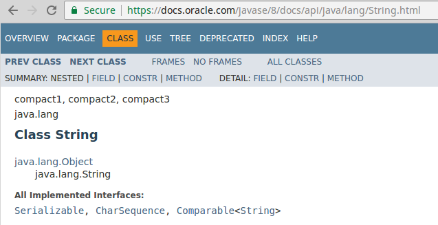

<!-- <text-box variant='learningObjectives' name='Oppimistavoitteet'> -->
<text-box variant='learningObjectives' name='Learning Objectives'>

<!-- - Tunnet käsitteen perintähierarkia.
- Ymmärrät että olio voidaan esittää kaikkien sen todellisten tyyppien avulla. -->
- You are familiar with the concept of inheritance hierarchy.
- You understand that an object can be represented through all its actual types.


</text-box>
<!--
Olemme aiemmissa osissa törmänneet tilanteisiin, joissa viittaustyyppisillä muuttujilla on oman tyyppinsä lisäksi muita tyyppejä. Esimerkiksi *kaikki* oliot ovat tyyppiä `Object`, eli mikä tahansa olio voidaan oman tyyppinsä lisäksi esittää `Object`-tyyppisenä muuttujana. -->

We've encountered situations where reference-type variables have other types besides their own one. For example, *all* objects are of type `Object`, i.e., any given object can be represented as a `Object`-type variable in addition to its own type.

<!-- ```java
String merkkijono = "merkkijono";
Object merkkijonoString = "toinen merkkijono";
```

```java
String merkkijono = "merkkijono";
Object merkkijonoString = merkkijono;
``` -->
```java
String text = "text";
Object textString = "another string";
```

```java
String text = "text";
Object textString = text;
```

<!-- Yllä olevissa esimerkeissä merkkijonomuuttuja esitetään sekä String-tyyppisenä että Object-tyyppisenä, jonka lisäksi String-tyyppinen muuttuja asetetaan Object-tyyppiseen muuttujaan. Asetus toiseen suuntaan, eli Object-tyyppisen muuttujan asettaminen String-tyyppiseksi ei kuitenkaan onnistu. Tämä johtuu siitä, että `Object`-tyyppiset muuttujat eivät ole tyyppiä `String` -->

In the examples above, a string variable is represented as both a String type and an Object type. Also, a String-type variable is assigned to an Object-type variable. However, assignment in the other direction, i.e., setting an Object-type variable to a String type, will not work. This is because `Object`-type variables are not of type `String`

<!-- ```java
Object merkkijonoString = "toinen merkkijono";
String merkkijono = merkkijonoString; // EI ONNISTU!
``` -->
```java
Object textString = "another string";
String text = textString; // WON'T WORK!
```

<!-- Mistä tässä oikein on kyse?


Jokainen muuttuja voidaan esittää muuttujan alkuperäisen tyypin lisäksi myös muuttujan toteuttamien rajapintojen sekä perimien luokkien tyyppisenä. Luokka String perii luokan Object, joten String-oliot ovat aina myös tyyppiä Object. Luokka Object ei peri String-luokkaa, joten Object-tyyppiset muuttujat eivät ole automaattisesti tyyppiä String. Tutustutaan tarkemmin <a href="https://docs.oracle.com/javase/8/docs/api/java/lang/String.html">String</a>-luokan API-dokumentaatioon, erityisesti HTML-sivun yläosaan.
 -->

What is this all about?

In addition to each variable's original type, each variable can also be represented by the types of interfaces it implements and classes that it inherits. The String class inherits the Object class and, as such, String objects are always of type Object. The Object class does not inherit a String class, so Object-type variables are not automatically of type String. Take a closer look at the <a href="https://docs.oracle.com/javase/8/docs/api/java/lang/String.html"> String </a> API documentation, the top of the HTML page in particular.

<!--  -->


<!-- String-luokan API-dokumentaatio alkaa yleisellä otsakkeella jota seuraa luokan pakkaus (`java.lang`). Pakkauksen jälkeen tulee luokan nimi (`Class String`), jota seuraa luokan *perintähierarkia*. -->
The API documentation for the String class begins with a generic header followed by the class' package (`java.lang`). After the package details, the name of the class (`Class String`) is followed by the  *inheritance hierarchy* of the class.

<pre>
  <a href="https://docs.oracle.com/javase/8/docs/api/java/lang/Object.html">java.lang.Object</a>
   java.lang.String
</pre>


<!-- Perintähierarkia listaa luokat, jotka luokka on perinyt. Perityt luokat listataan perimisjärjestyksessä, tarkasteltava luokka aina alimpana. String-luokan perintähierarkiasta näemme, että `String`-luokka perii luokan `Object`. *Javassa jokainen luokka voi periä korkeintaan yhden luokan*. Toisaalta, perittävä luokka on voinut periä toisen luokan, joten välillisesti luokka voi periä useampia luokkia.


Perintähierarkiaa voi ajatella myös listana tyypeistä, joita olio toteuttaa.


Tieto siitä, että oliot voivat olla montaa eri tyyppiä -- esimerkiksi tyyppiä Object -- suoraviivaistaa ohjelmointia. Jos tarvitsemme metodissa vain Object-luokassa määriteltyjä metodeja kuten `toString`, `equals` ja `hashCode`, voimme käyttää metodin parametrina tyyppiä `Object`. Tällöin metodille voi antaa parametrina *minkä tahansa* olion. Tarkastellaan tätä metodin `tulostaMonesti` avulla. Metodi saa parametrinaan `Object`-tyyppisen muuttujan ja tulostusten lukumäärän. -->
The inheritance hierarchy lists all the classes that the given class has inherited. Inherited classes are listed in the order of inheritance, with class being inspected always at the bottom. In the inheritance hierarchy of the String class, we see that the `String` class inherits the `Object` class. *In Java, each class can inherit one class at most*. On the other hand, the inherited class may have inherited another class. As such, a class may indirectly inherit more than a signle class.


The inheritance hierarchy can also be thought of as a list of the different types that the class implements.


Knowledge of the fact that objects can be of many different types -- of type Object, for instance -- makes programming simpler. If we only need methods defined in the Object class, such as `toString`, `equals` and `hashCode` in a method, we can simply use `Object` as the type of the method parameter. In that case, you can pass the method **any* object as a parameter. Let's take a look at this with the `printManyTimes` method. The method gets an `Object`-type variable and the number of print operations as its parameters.

<!-- ```java
public class Tulostin {

    public void tulostaMonesti(Object object, int kertaa) {
        int i = 0;
        while (i < kertaa) {
            System.out.println(object.toString());
            // tai System.out.println(object);

            i = i + 1;
        }
    }
}
``` -->
```java
public class Printer {

    public void printManyTimes(Object object, int times) {
        int i = 0;
        while (i < times) {
            System.out.println(object.toString());
            // or System.out.println(object);

            i = i + 1;
        }
    }
}
```

<!-- Metodille voi antaa parametrina minkä tahansa olion. Metodin `tulostaMonesti` sisällä oliolla on käytössään vain `Object`-luokassa määritellyt metodit, koska olio *tunnetaan* metodissa `Object`-tyyppisenä. Todellisuudessa olio voi olla myös toisen tyyppinen. -->
The method can be given any type of object as a parameter. Within the `printManyTimes` method, the object only has access to the methods defined in the `Object` class because the object is *known* in the method to be of type `Object`. The object may, in fact, be of another type.


<!-- ```java
Tulostin tulostin = new Tulostin();

String merkkijono = " o ";
List<String> sanat = new ArrayList<>();
sanat.add("polymorfismi");
sanat.add("perintä");
sanat.add("kapselointi");
sanat.add("abstrahointi");

tulostin.tulostaMonesti(merkkijono, 2);
tulostin.tulostaMonesti(sanat, 3);
``` -->
```java
Printer printer = new Printer();

String string = " o ";
List<String> words = new ArrayList<>();
words.add("polymorphism");
words.add("inheritance");
words.add("encapsulation");
words.add("abstraction");

printer.tulostaMonesti(string, 2);
printer.tulostaMonesti(words, 3);
```

<!-- <sample-output>

o
o
[polymorfismi, perintä, kapselointi, abstrahointi]
[polymorfismi, perintä, kapselointi, abstrahointi]
[polymorfismi, perintä, kapselointi, abstrahointi]

</sample-output> -->
<sample-output>

o
o
[polymorphism, inheritance, encapsulation, abstraction]
[polymorphism, inheritance, encapsulation, abstraction]
[polymorphism, inheritance, encapsulation, abstraction]

</sample-output>


<!-- Jatketaan `String`-luokan API-kuvauksen tarkastelua. Kuvauksessa olevaa perintähierarkiaa seuraa listaus luokan toteuttamista rajapinnoista. -->

Let's continue to look at the API description of the `String` class. The inheritance hierarchy in the description is followed by a list of interfaces implemented by the class.

<pre>
  All Implemented Interfaces:
  <a href="https://docs.oracle.com/javase/8/docs/api/java/io/Serializable.html" target="_blank" rel="noopener">Serializable</a>, <a href="https://docs.oracle.com/javase/8/docs/api/java/lang/CharSequence.html" target="_blank" rel="noopener">CharSequence</a>, <a href="https://docs.oracle.com/javase/8/docs/api/java/lang/Comparable.html" target="_blank" rel="noopener">Comparable</a><<a href="https://docs.oracle.com/javase/8/docs/api/java/lang/String.html" target="_blank" rel="noopener">String</a>>
</pre>


<!-- Luokka `String` toteuttaa rajapinnat `Serializable`, `CharSequence`, ja `Comparable<String>`. Myös rajapinta on tyyppi. Luokan String API-kuvauksen mukaan String-olion tyypiksi voi asettaa seuraavat rajapinnat. -->
The `String` class implements the `Serializable`, `CharSequence`, and `Comparable <String>` interfaces. An interface is also a type. According to the class' API description, the following interfaces can be set as the type of a String object.

<!-- ```java
Serializable serializableString = "merkkijono";
CharSequence charSequenceString = "merkkijono";
Comparable<String> comparableString = "merkkijono";
``` -->
```java
Serializable serializableString = "string";
CharSequence charSequenceString = "string";
Comparable<String> comparableString = "string";
```

<!-- Koska metodeille voidaan määritellä metodin parametrin tyyppi, voimme määritellä metodeja jotka vastaanottavat *tietyn rajapinnan toteuttavan* olion. Kun metodille määritellään parametrina rajapinta, sille voidaan antaa parametrina mikä tahansa olio, joka toteuttaa kyseisen rajapinnan. -->

Since we're able to define the type of a method's parameter, we can declare methods that receive an object that *implements a specific interface*. When a method's parameter is an interface, any object that implements that interface can be passed to it as an argument.

<!-- Täydennetään `Tulostin`-luokkaa siten, että sillä on metodi `CharSequence`-rajapinnan toteuttavien olioiden merkkien tulostamiseen. Rajapinta `CharSequence` tarjoaa muunmuassa metodit `int length()`, jolla saa merkkijonon pituuden, ja `char charAt(int index)`, jolla saa merkin tietyssä indeksissä. -->
We'll extend the `Printer` class so that it has a method for printing the characters of objects that implement the `CharSequence` interface. The `CharSequence` interface provides, among other things, methods `int length()` for getting a string's length and `char charAt(int index)`, which retrieves a character from a given index.

<!-- ```java
public class Tulostin {

    public void tulostaMonesti(Object object, int kertaa) {
        int i = 0;
        while (i < kertaa) {
            System.out.println(object);
            i = i + 1;
        }
    }

    public void tulostaMerkit(CharSequence charSequence) {
        int i = 0;
        while (i < charSequence.length()) {
            System.out.println(charSequence.charAt(i));
            i = i + 1;
        }
    }
}
``` -->
```java
public class Printer {

    public void printManyTimes(Object object, int times) {
        int i = 0;
        while (i < times) {
            System.out.println(object);
            i = i + 1;
        }
    }

    public void printCharacters(CharSequence charSequence) {
        int i = 0;
        while (i < charSequence.length()) {
            System.out.println(charSequence.charAt(i));
            i = i + 1;
        }
    }
}
```

<!-- Metodille `tulostaMerkit` voi antaa minkä tahansa `CharSequence`-rajapinnan toteuttavan olion. Näitä ovat muun muassa `String` ja merkkijonojen rakentamisessa usein Stringiä tehokkaampi `StringBuilder`. Metodi `tulostaMerkit` tulostaa annetun olion jokaisen merkin omalle rivilleen. -->
The `printCharacters` method can be passed any object that implements the `CharSequence` interface. These include `String` as well as `StringBuilder`, which is often more performant in building strings than `String`. The `printCharacters` method prints each character of a given object on its own line.

<!-- ```java
Tulostin tulostin = new Tulostin();

String mjono = "toimii";

tulostin.tulostaMerkit(mjono);
``` -->
```java
Printer printer = new Printer();

String string = "works";

printer.tulostaMerkit(string);
```

<!-- <sample-output>

t
o
i
m
i
i

</sample-output> -->
<sample-output>

w
o
r
k
s

</sample-output>

<programming-exercise name='Herds (2 osaa)' tmcname='part09-Part09_11.Herds' nocoins='true'>

<!-- Tässä tehtävässä teemme eliöita ja eliöistä koostuvia laumoja jotka liikkuvat ympäriinsä. Eliöiden sijaintien ilmoittamiseen käytetään *kaksiulotteista koordinaatistoa*. Jokaiseen sijaintiin liittyy kaksi lukua, `x`- ja `y`-koordinaatti. Koordinaatti `x` kertoo, kuinka pitkällä "nollapisteestä" mitattuna sijainti on vaakasuunnassa, ja koordinaatti `y` vastaavasti kuinka pitkällä sijainti on pystysuunnassa. Jos koordinaatiston käsite ei ole tuttu, voit lukea siitä lisää esimerkiksi <a href="http://fi.wikipedia.org/wiki/Koordinaatisto">wikipediasta</a>. -->

In this exercise we are going to create organisms and herds of organisms that can move around. To represent the locations of the organisms we'll use a **two-dimensional coordinate system**. Each position involves two numbers: `x` and `y` coordinates. The `x` coordinate indicates how far from the (i.e. point zero, where x = 0, y = 0) that position is horizontally. The `y` coordinate indicates the distance from the origin vertically. If you are not familiar with using a coordinate system, you can study the basics from e.g.  [Wikipedia](https://en.wikipedia.org/wiki/Cartesian_coordinate_system).

<br/>

<!-- Tehtävän mukana tulee rajapinta `Siirrettava`, joka kuvaa asiaa jota voidaan siirtää paikasta toiseen. Rajapinta sisältää metodin `void siirra(int dx, int dy)`. Parametri `dx` kertoo, paljonko asia siirtyy x-akselilla ja `dy` y-akselilla. -->

The exercise base includes the interface `Movable`, which represents something that can be moved from one position to another. The interface includes the method `void move(int dx, int dy)`. The parameter `dx` tells how much the object moves on the x axis, and dy tells the distance on the y axis.

<!-- Tehtävässä toteutat luokat `Elio` ja `Lauma`, jotka molemmat ovat siirrettäviä. -->

This exercise consists of you implementing the classes `Organism` and `Herd`, both of which are movable.


<!-- <h2>Elio-luokan toteuttaminen</h2> -->


<h2>Implementing the Organism Class</h2>

<!-- Luo luokka `Elio`, joka toteuttaa rajapinnan `Siirrettava`. Eliön tulee tietää oma sijaintinsa (x, y -koordinaatteina). Luokan `Elio` APIn tulee olla seuraava: -->

Create a class called `Organism` that implements the interface `Movable`. An organism should know its own location (as x, y coordinates). The API for the class `Organism` is to be as follows:

<!-- - **public Elio(int x, int y)**<br/>Luokan konstruktori, joka saa olion aloitussijainnin x- ja y-koordinaatit parametrina -->
- **public Organism(int x, int y)**<br />The class constructor that receives the x and y coordinates of the initial position as its parameters.
<!-- - **public String toString()**<br/> Luo ja palauttaa oliosta merkkijonoesityksen. Eliön merkkijonoesityksen tulee olla seuraavanlainen `"x: 3; y: 6"`. Huomaa että koordinaatit on erotettu puolipisteellä (`;`) -->
- **public String toString()**<br/>Creates and returns a string representation of the organism. That representation should remind the following: `"x: 3; y: 6"`. Notice that a semicolon is used to separate the coordinates.
<!-- - **public void siirra(int dx, int dy)**<br/> Siirtää oliota parametrina saatujen arvojen verran. Muuttuja `dx` sisältää muutoksen koordinaattiin `x`, muuttuja `dy` sisältää muutoksen koordinaattiin `y`. Esimerkiksi jos muuttujan `dx` arvo on 5, tulee oliomuuttujan `x` arvoa kasvattaa viidellä -->
- **public void move(int dx, int dy)**<br/> Moves the object by the values it receives as parameters. The `dx` variable contains the change to coordinate `x`, and the `dy` variable ontains the change to the coordinate `y`. For example, if the value of `dx` is 5, the value of the object variable `x` should be incremented by five.

<!-- Kokeile luokan `Elio` toimintaa seuraavalla esimerkkikoodilla. -->

Use the following code snippet to test the `Organism` class.

<!-- ```java
Elio elio = new Elio(20, 30);
System.out.println(elio);
elio.siirra(-10, 5);
System.out.println(elio);
elio.siirra(50, 20);
System.out.println(elio);
``` -->

```java
Organism organism = new Organism(20, 30);
System.out.println(organism);
organism.move(-10, 5);
System.out.println(organism);
organism.move(50, 20);
System.out.println(organism);
```

<sample-output>

x: 20; y: 30
x: 10; y: 35
x: 60; y: 55

</sample-output>


<!-- <h2>Lauman toteutus</h2> -->

<h2>Implementing the Herd</h2>

<!-- Luo luokka `Lauma`, joka toteuttaa rajapinnan `Siirrettava`. Lauma koostuu useasta `Siirrettava`-rajapinnan toteutavasta oliosta, jotka tulee tallettaa esimerkiksi listarakenteeseen. -->

Create a class called `Herd` that implements the interface `Movable`. A herd consists of multiple objects that implement the Movable interface. They must be stored in e.g. a list data structure.

<!-- Luokalla `Lauma` tulee olla seuraavanlainen API. -->

The `Herd` class must have the following API.

<!-- - **public String toString()**<br/> Palauttaa merkkijonoesityksen lauman jäsenten sijainnista rivin vaihdolla erotettuna. -->
- **public String toString()**<br/> Returns a string representation of the positions of the members of the herd, each on its own line.
<!-- - **public void lisaaLaumaan(Siirrettava siirrettava)**<br/> Lisää laumaan uuden `Siirrettava`-rajapinnan toteuttavan olion -->
- **public void addToHerd(Movable movable)**<br/> Adds an object that implements the `Movable` interface to the herd.
<!-- - **public void siirra(int dx, int dy)**<br/> Siirtää laumaa parametrina saatujen arvojen verran. Huomaa että tässä sinun tulee siirtää jokaista lauman jäsentä. -->
- **public void move(int dx, int dy)**<br/> Moves the herd with by the amount specified by the parameters. Notice that here you have to move each member of the herd.

<!-- Kokeile ohjelmasi toimintaa alla olevalla esimerkkikoodilla. -->

Test out your program with the sample code below:

<!-- ```java
Lauma lauma = new Lauma();
lauma.lisaaLaumaan(new Elio(73, 56));
lauma.lisaaLaumaan(new Elio(57, 66));
lauma.lisaaLaumaan(new Elio(46, 52));
lauma.lisaaLaumaan(new Elio(19, 107));
System.out.println(lauma);
``` -->

```java
Herd herd = new Herd();
herd.lisaaLaumaan(new Organism(57, 66));
herd.lisaaLaumaan(new Organism(73, 56));
herd.lisaaLaumaan(new Organism(46, 52));
herd.lisaaLaumaan(new Organism(19, 107));
System.out.println(herd);
```

<sample-output>

x: 73; y: 56
x: 57; y: 66
x: 46; y: 52
x: 19; y: 107

</sample-output>


</programming-exercise>


<programming-exercise name='Animals (4 parts)' tmcname='part09-Part09_12.Animals'>

<!-- Tässä tehtävässä demonstroit perinnän ja rajapintojen käyttöä. -->

In this exercise you'll demonstrate how to use inheritance and interfaces.

<!-- <h2>Eläin</h2> -->

<h2>Animal</h2>

<!-- Toteuta ensin abstrakti luokka `Elain`. Luokalla Elain on konstruktori, jolle annetaan parametrina eläimen nimi. Luokalla Elain on lisäksi parametrittomat metodit syo ja nuku, jotka eivät palauta arvoa (void), sekä parametriton metodi getNimi, joka palauttaa eläimen nimen. -->

First implement an abstract class called `Animal`. The class should have a constructor that takes the animal's name as a parameter. The Animal class also has non-parameterized methods eat and sleep that return nothing (void), and a non-parameterized method getName that returns the name of the animal.

<!-- Metodin nuku tulee tulostaa "(nimi) nukkuu" ja metodin syo tulee tulostaa "(nimi) syo". Tässä (nimi) on eläimelle annettu nimi. -->

The sleep method should print "(name) sleeps", and the eat method should print "(name) eats". Here (name) is the name of the animal in question.


<!-- <h2>Koira</h2> -->

<h2>Dog</h2>

<!-- Toteuta luokan Elain perivä luokka `Koira`. Luokalla Koira tulee olla parametrillinen konstruktori, jolla luotavalle koiraoliolle voi antaa nimen. Tämän lisäksi koiralla tulee olla parametriton konstruktori, jolla koiran nimeksi tulee "Koira" sekä parametriton metodi hauku, joka ei palauta arvoa (void). Koiralla tulee olla myös metodit syo ja nuku kuten eläimillä yleensä ottaen. -->

Implement a class called `Dog` that inherits from Animal. Dog should have a parameterized constructor that can be used to name it. The class should also have a non-parameterized constructor, which gives the dog the name "Dog". Another method that Dog must have is the non-parameterized bark, and it should not return any value (void). Like all animals, Dog needs to have the methods eat and sleep.

<!-- Alla on esimerkki luokan Koira odotetusta toiminnasta: -->

Below is an example of how the class Dog is expected to work.


<!-- ```java
Koira koira = new Koira();
koira.hauku();
koira.syo();

Koira vuffe = new Koira("Vuffe");
vuffe.hauku();
``` -->

```java
Dog dog = new Dog();
dog.bark();
dog.eat();

Dog fido = new Dog("Fido");
fido.bark();
```

<!-- <sample-output>

Koira haukkuu
Koira syo
Vuffe haukkuu

</sample-output> -->

<sample-output>

Dog barks
Dog eats
Fido barks

</sample-output>


<!-- <h2>Kissa</h2> -->

<h2>Cat</h2>


<!-- Toteuta seuraavaksi luokka `Kissa`, joka perii luokan Elain. Luokalla Kissa tulee olla parametrillinen konstruktori, jolla luotavalle kissaoliolle voi antaa nimen. Tämän lisäksi kissalla tulee olla parametriton konstruktori, jolla kissan nimeksi tulee "Kissa" sekä parametriton metodi mourua, joka ei palauta arvoa (void). Kissalla tulee olla myös metodit syo ja nuku kuten ensimmäisessä osassa. -->

Next to implement is the class `Cat`, that also inherits from the Animal class. Cat should have two constructors: one with a parameter, used to name the cat according to the parameter, and one without parameters, in which case the name is simply "Cat". Another methd for Cat is a non-parameterized method called purr that returns no value (void). Cats should be able to eat and sleep like in the first part.

<!-- Alla on esimerkki luokan Kissa odotetusta toiminnasta: -->

Here's an example of how the class Cat is expected to function:


<!-- ```java
Kissa kissa = new Kissa();
kissa.mourua();
kissa.syo();

Kissa karvinen = new Kissa("Karvinen");
karvinen.mourua();
``` -->

```java
Cat cat = new Cat();
cat.purr();
cat.eat();

Cat garfield = new Cat("Garfield");
garfield.purr();
```

<!-- <sample-output>

Kissa mouruaa
Kissa syo
Karvinen mouruaa

</sample-output> -->

<sample-output>

Cat purrs
Cat eats
Garfield purrs

</sample-output>


<!-- <h2>Ääntelevä</h2> -->

<h2>NoiseCapable</h2>


<!-- Luo lopulta rajapinta `Aanteleva`, joka maarittelee parametrittoman metodin aantele, joka ei palauta arvoa (void). Toteuta rajapinta luokissa Koira että Kissa. Rajapinnan tulee hyödyntää aiemmin määriteltyjä hauku ja mourua -metodeja. -->

Finally, create an interface called `NoiseCapable`. It should define a non-parameterized method makeNoise that returns no value (void). Implement the interface in the classes Dog and Cat. The interface should take use of the bark and purr methods you've defined earlier.

<!-- Alla on esimerkki odotetusta toiminnasta: -->
Below is an example of the expected functionality.

<!-- ```java
Aanteleva koira = new Koira();
koira.aantele();

Aanteleva kissa = new Kissa("Karvinen");
kissa.aantele();
Kissa k = (Kissa) kissa;
k.mourua();
``` -->

```java
NoiseCapable dog = new Dog();
dog.makeSound();

NoiseCapable cat = new Cat("Garfield");
cat.makeSound();
Cat c = (Cat) cat;
c.purr();
```

<!-- <sample-output>

Koira haukkuu
Karvinen mouruaa
Karvinen mouruaa

</sample-output> -->

<sample-output>

Dog barks
Garfield purrs
Garfield purrs

</sample-output>

</programming-exercise>
