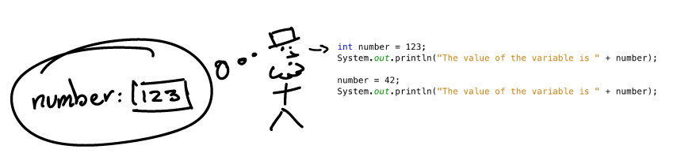
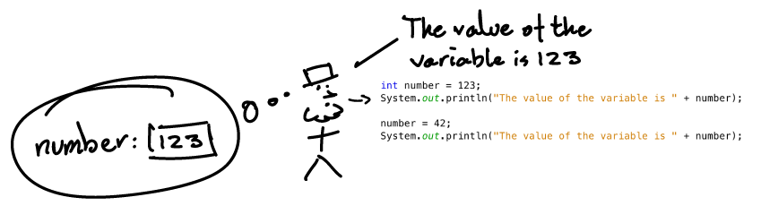
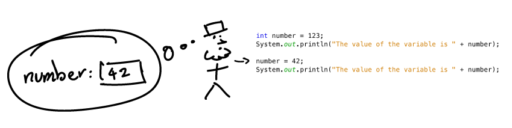
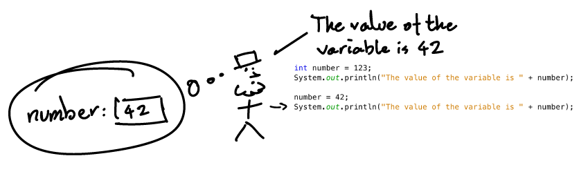

<text-box variant='learningObjectives' name='Learning Objectives'>

- Understand the concept of a variable. You know what variable types, names, and values are.

- Know how to create and use string, integer, floating-point, and boolean variables.

</text-box>

You saw some first examples of variables when dealing with user input in the last section. Let's turn our attention to learning about variable *types* commonly used in Java. A variable can be thought of as a container in which information of a given type can be stored. Examples of these different types include text (`String`), whole numbers (`int`), floating-point numbers (`double`), and whether something is true or false (`boolean`). A value is assigned to a variable using the equals sign (`=`).

```java
int months = 12;
```
In the statement above, the value of 12 is assigned to an integer variable called months. The statement could be read as: "the variable months is assigned the value 12". A variable's value can be printed together with a string using the + sign, as seen in the following example.

```java
String text = "contains text";
int wholeNumber = 123;
double floatingPoint = 3.141592653;
boolean trueOrFalse = true;

System.out.println("Text variable: " + text);
System.out.println("Integer variable: " + wholeNumber);
System.out.println("Floating-point variable: " + floatingPoint);
System.out.println("Boolean: " + trueOrFalse);
```
Output:

<sample-output>

Text variable: contains text
Integer variable: 123
Floating-point variable: 3.141592653
Boolean: true

</sample-output>

Be aware that the printing of variables does not require quotation marks. If you added those, the name of the variable (e.g., `text` for the first print statement) will be printed, instead of its content.

<programming-exercise name="Recipe">

The template for this assignment already contains code to print a recipe consisting of milk and flour. In the print statements, two variables are used: an `int` variable named `gramsOfMilk` and a `double` variable `kilosOfFlour`. The first variable indicates the amount of milk, in grams, while the second indicates the amount of flour, in kilo's.

Complete the assignment in such a way, by declaring both variables with the correct amount, such that the following output is printed:

<sample-output>

This recipe requires the following ingredients
Grams of milk: 750
Kilo's of flour: 1.5

</sample-output>

</programming-exercise>

Variable names are unique - no two variables can have the same name. The variable is created the first time its declared, but the second time you try to declare a variable with the same name, your compiler will give an error. The following program would thus lead to an error, as the variable pi is declared twice:

```java
public class Example {
    public static void main(String[] args) {
        double pi = 3.14;
        double pi = 3.141592653;

        System.out.println("The value of pi is: " + pi);
    }
}
```

## Changing a Value Assigned to a Variable
A variable exists from the moment of its declaration, and its initial value is preserved until another value is assigned to it. You can change a variable's value using a statement that comprises the variable name, an equals sign, and the new value to be assigned. Note that when changing the value of the variable, we do not declare the type of the variable again, as this has already been determined when the variable was declared.

```java
int number = 123;
System.out.println("The value of the variable is " + number);

number = 42;
System.out.println("The value of the variable is " + number);
```
Output:

<sample-output>

The value of the variable is 123
The value of the variable is 42

</sample-output>

Let's look at the preceding program's execution step-by-step. When a variable appears in the program for the first time, one must tell the computer both its type (in this case `int`) and its name (in this case `number`). Then, the computer creates a 'named container' for the variable and the value on the right side of the equals sign is copied into this named container.



Whenever a variable is referenced by its name in a program, its value is retrieved from a container that has the corresponding name.



Whenever a value is assigned to an existing variable (here `number = 42`), the new value is copied in the place of the old value, and the old value disappears.



The variable is then referenced again by its name in the program. We proceed as normal, retrieving the value of `number` from a container having its name.



At the end of the program, you'll notice that the original value of the variable has vanished. A variable can hold only one value at a time.

## Variable's Type Persists
Once a variable's type has been declared, it can no longer be changed. For example, a boolean value cannot be assigned to a variable of the integer type, nor can an integer be assigned to a variable of the boolean type. However, exceptions do exist: an integer can be assigned to a variable of the double type, since Java knows how to convert an integer to a double. A floating-point value cannot, however, be assigned to an integer variable. The reason for this is that those who develop the language aim to prevent developers from making errors that lead to a loss of information.

```java
double floatingPoint = 0.42;
floatingPoint = 1; // Works

int value = 10;
value = floatingPoint; // Does not work
```

There are also other ways of translating variable types back and forth. For instance, if you are sure that a String contains an integer value, you can transform it to another variable of the type `int`. Make a new integer variable and use the Integer.valueOf(name) method. This method takes the string `name` containing the value to be converted as a parameter. In the following example, the value 42 is of type `String` and will be of type `int`.

```java
String valueAsString = "42";
int value = Integer.valueOf(valueAsString);
```

This also works for double values and boolean values, with the method `Double.valueOf()` and `Boolean.valueOf`, respectively. It takes the string containing the value to be converted as a parameter. Boolean variables can either have the value `true` or `false`. When converting a string to a boolean, the string must be "true" if we want the boolean value to be `true`. The case is insensitive here: both "true" and "TRue" turn into the boolean value of `true`. All other strings turn into the boolean `false`.

## Naming Variables
Naming variables is a fundamental aspect of describing a program. It is important that you name your variables as understandable as possible. Programming is a problem-solving tool. The aim is to create solutions for any given problem. As a problem is approached, the developer decides on the terms used to describe the problem domain. The terminology that is chosen, such as variable names, will serve to describe the problem for anyone who is to work with it in the future.
As you're wording the problem that you're solving, think about the concepts related to that problem and appropriate terms that could be used to describe them. If you find it hard to come up with relevant names, think of the ones that definitely do not describe it. After this, settle on some terminology that you're going to use -- the good thing is that you can usually improve on it later on.

Unfortunately, variable naming is limited by certain constraints. Variable names cannot contain certain special symbols, such as exclamation marks (!). Spaces are also not allowed, since they're used to separate parts of commands. Instead of spaces, the convention in Java is to use a style known as [camelCase](https://en.wikipedia.org/wiki/Camel_case "Camel case – Wikipedia"), which means that we write every word part with an uppercase letter. However, the first letter of a variable name is **always lower-cased**, for example: `int camelCaseVariable = 7;`

Numbers can be used within a variable name as long as the name does not begin with a number. A variable's name also cannot already be in use. These names include, for instance, variables previously defined in the program and commands provided by Java. Letters containing diacritics (e.g. the letters ä and ö) should also not be used in variable names.

### Permissible Variable Names

* lastDayOfMonth = 20
* firstYear = 1952
* name = "Essi"

### Impermissible Variable Names

* last day of month = 20 (spaces are not allowed)
* 1day = 1952 (cannot start with number)
* beware! = 1910 (an exclamation mark cannot be included)
* 1920 = 1 (cannot start with number or consist of numbers solely)

## The Type of the Variable Informs of Possible Values
A variable's type determines the types of values that can be assigned to it. `String` types hold text, `int` types whole numbers, `double` floating-point numbers, and `boolean` types are either true or false. As such, the possible values of a given variable type are limited. For example, a string cannot contain an integer, nor can a double contain a boolean value.

| Type                                  | Example                 | Accepted values         |
| ------------------------------------- | ----------------------- | ----------------------- |
| Whole number, i.e., `int`             |  `int value = 4;`       | Values between -2147483648 and 2147483647.   |
| Floating-point number, i.e., `double` | `double value = 4.2;`   | Decimal numbers, with the greatest possible value being approximately 2<sup>1023</sup>.  |
| Text, i.e., `String`                  | `String text = "Hi!";`  | Text (enclosed in quotation marks).   |
| True or false value, i.e., `boolean`  | `boolean right = true;` | A boolean contains either the value `true` or `false`.   |

Note that when a decimal number is represented with a floating-point number, the value can be inaccurate as floating-points are incapable of representing all decimal numbers exactly.
